cola Report for GDS2626
==================

**Date**: 2019-12-25 20:17:16 CET, **cola version**: 1.3.2

----------------------------------------------------------------

<style type='text/css'>

body, td, th {
   font-family: Arial,Helvetica,sans-serif;
   background-color: white;
   font-size: 13px;
  max-width: 800px;
  margin: auto;
  margin-left:210px;
  padding: 0px 10px 0px 10px;
  border-left: 1px solid #EEEEEE;
  line-height: 150%;
}

tt, code, pre {
   font-family: 'DejaVu Sans Mono', 'Droid Sans Mono', 'Lucida Console', Consolas, Monaco, 

monospace;
}

h1 {
   font-size:2.2em;
}

h2 {
   font-size:1.8em;
}

h3 {
   font-size:1.4em;
}

h4 {
   font-size:1.0em;
}

h5 {
   font-size:0.9em;
}

h6 {
   font-size:0.8em;
}

a {
  text-decoration: none;
  color: #0366d6;
}

a:hover {
  text-decoration: underline;
}

a:visited {
   color: #0366d6;
}

pre, img {
  max-width: 100%;
}
pre {
  overflow-x: auto;
}
pre code {
   display: block; padding: 0.5em;
}

code {
  font-size: 92%;
  border: 1px solid #ccc;
}

code[class] {
  background-color: #F8F8F8;
}

table, td, th {
  border: 1px solid #ccc;
}

blockquote {
   color:#666666;
   margin:0;
   padding-left: 1em;
   border-left: 0.5em #EEE solid;
}

hr {
   height: 0px;
   border-bottom: none;
   border-top-width: thin;
   border-top-style: dotted;
   border-top-color: #999999;
}

@media print {
   * {
      background: transparent !important;
      color: black !important;
      filter:none !important;
      -ms-filter: none !important;
   }

   body {
      font-size:12pt;
      max-width:100%;
   }

   a, a:visited {
      text-decoration: underline;
   }

   hr {
      visibility: hidden;
      page-break-before: always;
   }

   pre, blockquote {
      padding-right: 1em;
      page-break-inside: avoid;
   }

   tr, img {
      page-break-inside: avoid;
   }

   img {
      max-width: 100% !important;
   }

   @page :left {
      margin: 15mm 20mm 15mm 10mm;
   }

   @page :right {
      margin: 15mm 10mm 15mm 20mm;
   }

   p, h2, h3 {
      orphans: 3; widows: 3;
   }

   h2, h3 {
      page-break-after: avoid;
   }
}
</style>


## Summary


All available functions which can be applied to this `res_list` object:


```r
res_list
```

```
#> A 'ConsensusPartitionList' object with 24 methods.
#>   On a matrix with 21163 rows and 57 columns.
#>   Top rows are extracted by 'SD, CV, MAD, ATC' methods.
#>   Subgroups are detected by 'hclust, kmeans, skmeans, pam, mclust, NMF' method.
#>   Number of partitions are tried for k = 2, 3, 4, 5, 6.
#>   Performed in total 30000 partitions by row resampling.
#> 
#> Following methods can be applied to this 'ConsensusPartitionList' object:
#>  [1] "cola_report"           "collect_classes"       "collect_plots"         "collect_stats"        
#>  [5] "colnames"              "functional_enrichment" "get_anno_col"          "get_anno"             
#>  [9] "get_classes"           "get_matrix"            "get_membership"        "get_stats"            
#> [13] "is_best_k"             "is_stable_k"           "ncol"                  "nrow"                 
#> [17] "rownames"              "show"                  "suggest_best_k"        "test_to_known_factors"
#> [21] "top_rows_heatmap"      "top_rows_overlap"     
#> 
#> You can get result for a single method by, e.g. object["SD", "hclust"] or object["SD:hclust"]
#> or a subset of methods by object[c("SD", "CV")], c("hclust", "kmeans")]
```

The call of `run_all_consensus_partition_methods()` was:


```
#> run_all_consensus_partition_methods(data = mat, mc.cores = 4, anno = anno)
```

Dimension of the input matrix:


```r
mat = get_matrix(res_list)
dim(mat)
```

```
#> [1] 21163    57
```

### Density distribution

The density distribution for each sample is visualized as in one column in the
following heatmap. The clustering is based on the distance which is the
Kolmogorov-Smirnov statistic between two distributions.


```r
library(ComplexHeatmap)
densityHeatmap(mat, top_annotation = HeatmapAnnotation(df = get_anno(res_list), 
    col = get_anno_col(res_list)), ylab = "value", cluster_columns = TRUE, show_column_names = FALSE,
    mc.cores = 4)
```


### Suggest the best k


Folowing table shows the best `k` (number of partitions) for each combination
of top-value methods and partition methods. Clicking on the method name in
the table goes to the section for a single combination of methods.

[The cola vignette](http://bioconductor.org/packages/devel/bioc/vignettes/cola/inst/doc/cola.html#toc_13)
explains the definition of the metrics used for determining the best
number of partitions.


```r
suggest_best_k(res_list)
```


|                            | The best k| 1-PAC| Mean silhouette| Concordance|   |Optional k |
|:---------------------------|----------:|-----:|---------------:|-----------:|:--|:----------|
|[SD:kmeans](#SD-kmeans)     |          2| 1.000|           1.000|       1.000|** |           |
|[SD:skmeans](#SD-skmeans)   |          2| 1.000|           1.000|       1.000|** |           |
|[SD:NMF](#SD-NMF)           |          2| 1.000|           0.998|       0.999|** |           |
|[CV:kmeans](#CV-kmeans)     |          2| 1.000|           0.987|       0.994|** |           |
|[CV:NMF](#CV-NMF)           |          2| 1.000|           0.982|       0.992|** |           |
|[MAD:hclust](#MAD-hclust)   |          2| 1.000|           0.988|       0.991|** |           |
|[MAD:kmeans](#MAD-kmeans)   |          2| 1.000|           1.000|       1.000|** |           |
|[MAD:skmeans](#MAD-skmeans) |          2| 1.000|           1.000|       1.000|** |           |
|[MAD:NMF](#MAD-NMF)         |          2| 1.000|           1.000|       1.000|** |           |
|[ATC:kmeans](#ATC-kmeans)   |          2| 1.000|           1.000|       1.000|** |           |
|[ATC:skmeans](#ATC-skmeans) |          4| 1.000|           0.999|       0.998|** |2,3        |
|[ATC:NMF](#ATC-NMF)         |          2| 1.000|           1.000|       1.000|** |           |
|[ATC:hclust](#ATC-hclust)   |          4| 0.966|           0.976|       0.983|** |2,3        |
|[SD:pam](#SD-pam)           |          2| 0.961|           0.954|       0.978|** |           |
|[ATC:mclust](#ATC-mclust)   |          6| 0.941|           0.862|       0.922|*  |4,5        |
|[ATC:pam](#ATC-pam)         |          6| 0.928|           0.893|       0.910|*  |2,3,4,5    |
|[MAD:pam](#MAD-pam)         |          2| 0.927|           0.965|       0.981|*  |           |
|[SD:hclust](#SD-hclust)     |          2| 0.878|           0.955|       0.956|   |           |
|[CV:mclust](#CV-mclust)     |          2| 0.857|           0.852|       0.942|   |           |
|[SD:mclust](#SD-mclust)     |          2| 0.829|           0.904|       0.956|   |           |
|[CV:skmeans](#CV-skmeans)   |          2| 0.818|           0.948|       0.957|   |           |
|[MAD:mclust](#MAD-mclust)   |          2| 0.781|           0.895|       0.950|   |           |
|[CV:pam](#CV-pam)           |          2| 0.384|           0.872|       0.892|   |           |
|[CV:hclust](#CV-hclust)     |          2| 0.284|           0.906|       0.848|   |           |

\*\*: 1-PAC > 0.95, \*: 1-PAC > 0.9


### CDF of consensus matrices

Cumulative distribution function curves of consensus matrix for all methods.


```r
collect_plots(res_list, fun = plot_ecdf)
```


### Consensus heatmap

Consensus heatmaps for all methods. ([What is a consensus heatmap?](http://bioconductor.org/packages/devel/bioc/vignettes/cola/inst/doc/cola.html#toc_9))


<style type='text/css'>


.ui-helper-hidden {
	display: none;
}
.ui-helper-hidden-accessible {
	border: 0;
	clip: rect(0 0 0 0);
	height: 1px;
	margin: -1px;
	overflow: hidden;
	padding: 0;
	position: absolute;
	width: 1px;
}
.ui-helper-reset {
	margin: 0;
	padding: 0;
	border: 0;
	outline: 0;
	line-height: 1.3;
	text-decoration: none;
	font-size: 100%;
	list-style: none;
}
.ui-helper-clearfix:before,
.ui-helper-clearfix:after {
	content: "";
	display: table;
	border-collapse: collapse;
}
.ui-helper-clearfix:after {
	clear: both;
}
.ui-helper-zfix {
	width: 100%;
	height: 100%;
	top: 0;
	left: 0;
	position: absolute;
	opacity: 0;
	filter:Alpha(Opacity=0); 
}

.ui-front {
	z-index: 100;
}


.ui-state-disabled {
	cursor: default !important;
	pointer-events: none;
}


.ui-icon {
	display: inline-block;
	vertical-align: middle;
	margin-top: -.25em;
	position: relative;
	text-indent: -99999px;
	overflow: hidden;
	background-repeat: no-repeat;
}

.ui-widget-icon-block {
	left: 50%;
	margin-left: -8px;
	display: block;
}


.ui-widget-overlay {
	position: fixed;
	top: 0;
	left: 0;
	width: 100%;
	height: 100%;
}
.ui-accordion .ui-accordion-header {
	display: block;
	cursor: pointer;
	position: relative;
	margin: 2px 0 0 0;
	padding: .5em .5em .5em .7em;
	font-size: 100%;
}
.ui-accordion .ui-accordion-content {
	padding: 1em 2.2em;
	border-top: 0;
	overflow: auto;
}
.ui-autocomplete {
	position: absolute;
	top: 0;
	left: 0;
	cursor: default;
}
.ui-menu {
	list-style: none;
	padding: 0;
	margin: 0;
	display: block;
	outline: 0;
}
.ui-menu .ui-menu {
	position: absolute;
}
.ui-menu .ui-menu-item {
	margin: 0;
	cursor: pointer;
	
	list-style-image: url("data:image/gif;base64,R0lGODlhAQABAIAAAAAAAP///yH5BAEAAAAALAAAAAABAAEAAAIBRAA7");
}
.ui-menu .ui-menu-item-wrapper {
	position: relative;
	padding: 3px 1em 3px .4em;
}
.ui-menu .ui-menu-divider {
	margin: 5px 0;
	height: 0;
	font-size: 0;
	line-height: 0;
	border-width: 1px 0 0 0;
}
.ui-menu .ui-state-focus,
.ui-menu .ui-state-active {
	margin: -1px;
}


.ui-menu-icons {
	position: relative;
}
.ui-menu-icons .ui-menu-item-wrapper {
	padding-left: 2em;
}


.ui-menu .ui-icon {
	position: absolute;
	top: 0;
	bottom: 0;
	left: .2em;
	margin: auto 0;
}


.ui-menu .ui-menu-icon {
	left: auto;
	right: 0;
}
.ui-button {
	padding: .4em 1em;
	display: inline-block;
	position: relative;
	line-height: normal;
	margin-right: .1em;
	cursor: pointer;
	vertical-align: middle;
	text-align: center;
	-webkit-user-select: none;
	-moz-user-select: none;
	-ms-user-select: none;
	user-select: none;

	
	overflow: visible;
}

.ui-button,
.ui-button:link,
.ui-button:visited,
.ui-button:hover,
.ui-button:active {
	text-decoration: none;
}


.ui-button-icon-only {
	width: 2em;
	box-sizing: border-box;
	text-indent: -9999px;
	white-space: nowrap;
}


input.ui-button.ui-button-icon-only {
	text-indent: 0;
}


.ui-button-icon-only .ui-icon {
	position: absolute;
	top: 50%;
	left: 50%;
	margin-top: -8px;
	margin-left: -8px;
}

.ui-button.ui-icon-notext .ui-icon {
	padding: 0;
	width: 2.1em;
	height: 2.1em;
	text-indent: -9999px;
	white-space: nowrap;

}

input.ui-button.ui-icon-notext .ui-icon {
	width: auto;
	height: auto;
	text-indent: 0;
	white-space: normal;
	padding: .4em 1em;
}


input.ui-button::-moz-focus-inner,
button.ui-button::-moz-focus-inner {
	border: 0;
	padding: 0;
}
.ui-controlgroup {
	vertical-align: middle;
	display: inline-block;
}
.ui-controlgroup > .ui-controlgroup-item {
	float: left;
	margin-left: 0;
	margin-right: 0;
}
.ui-controlgroup > .ui-controlgroup-item:focus,
.ui-controlgroup > .ui-controlgroup-item.ui-visual-focus {
	z-index: 9999;
}
.ui-controlgroup-vertical > .ui-controlgroup-item {
	display: block;
	float: none;
	width: 100%;
	margin-top: 0;
	margin-bottom: 0;
	text-align: left;
}
.ui-controlgroup-vertical .ui-controlgroup-item {
	box-sizing: border-box;
}
.ui-controlgroup .ui-controlgroup-label {
	padding: .4em 1em;
}
.ui-controlgroup .ui-controlgroup-label span {
	font-size: 80%;
}
.ui-controlgroup-horizontal .ui-controlgroup-label + .ui-controlgroup-item {
	border-left: none;
}
.ui-controlgroup-vertical .ui-controlgroup-label + .ui-controlgroup-item {
	border-top: none;
}
.ui-controlgroup-horizontal .ui-controlgroup-label.ui-widget-content {
	border-right: none;
}
.ui-controlgroup-vertical .ui-controlgroup-label.ui-widget-content {
	border-bottom: none;
}


.ui-controlgroup-vertical .ui-spinner-input {

	
	width: 75%;
	width: calc( 100% - 2.4em );
}
.ui-controlgroup-vertical .ui-spinner .ui-spinner-up {
	border-top-style: solid;
}

.ui-checkboxradio-label .ui-icon-background {
	box-shadow: inset 1px 1px 1px #ccc;
	border-radius: .12em;
	border: none;
}
.ui-checkboxradio-radio-label .ui-icon-background {
	width: 16px;
	height: 16px;
	border-radius: 1em;
	overflow: visible;
	border: none;
}
.ui-checkboxradio-radio-label.ui-checkboxradio-checked .ui-icon,
.ui-checkboxradio-radio-label.ui-checkboxradio-checked:hover .ui-icon {
	background-image: none;
	width: 8px;
	height: 8px;
	border-width: 4px;
	border-style: solid;
}
.ui-checkboxradio-disabled {
	pointer-events: none;
}
.ui-datepicker {
	width: 17em;
	padding: .2em .2em 0;
	display: none;
}
.ui-datepicker .ui-datepicker-header {
	position: relative;
	padding: .2em 0;
}
.ui-datepicker .ui-datepicker-prev,
.ui-datepicker .ui-datepicker-next {
	position: absolute;
	top: 2px;
	width: 1.8em;
	height: 1.8em;
}
.ui-datepicker .ui-datepicker-prev-hover,
.ui-datepicker .ui-datepicker-next-hover {
	top: 1px;
}
.ui-datepicker .ui-datepicker-prev {
	left: 2px;
}
.ui-datepicker .ui-datepicker-next {
	right: 2px;
}
.ui-datepicker .ui-datepicker-prev-hover {
	left: 1px;
}
.ui-datepicker .ui-datepicker-next-hover {
	right: 1px;
}
.ui-datepicker .ui-datepicker-prev span,
.ui-datepicker .ui-datepicker-next span {
	display: block;
	position: absolute;
	left: 50%;
	margin-left: -8px;
	top: 50%;
	margin-top: -8px;
}
.ui-datepicker .ui-datepicker-title {
	margin: 0 2.3em;
	line-height: 1.8em;
	text-align: center;
}
.ui-datepicker .ui-datepicker-title select {
	font-size: 1em;
	margin: 1px 0;
}
.ui-datepicker select.ui-datepicker-month,
.ui-datepicker select.ui-datepicker-year {
	width: 45%;
}
.ui-datepicker table {
	width: 100%;
	font-size: .9em;
	border-collapse: collapse;
	margin: 0 0 .4em;
}
.ui-datepicker th {
	padding: .7em .3em;
	text-align: center;
	font-weight: bold;
	border: 0;
}
.ui-datepicker td {
	border: 0;
	padding: 1px;
}
.ui-datepicker td span,
.ui-datepicker td a {
	display: block;
	padding: .2em;
	text-align: right;
	text-decoration: none;
}
.ui-datepicker .ui-datepicker-buttonpane {
	background-image: none;
	margin: .7em 0 0 0;
	padding: 0 .2em;
	border-left: 0;
	border-right: 0;
	border-bottom: 0;
}
.ui-datepicker .ui-datepicker-buttonpane button {
	float: right;
	margin: .5em .2em .4em;
	cursor: pointer;
	padding: .2em .6em .3em .6em;
	width: auto;
	overflow: visible;
}
.ui-datepicker .ui-datepicker-buttonpane button.ui-datepicker-current {
	float: left;
}


.ui-datepicker.ui-datepicker-multi {
	width: auto;
}
.ui-datepicker-multi .ui-datepicker-group {
	float: left;
}
.ui-datepicker-multi .ui-datepicker-group table {
	width: 95%;
	margin: 0 auto .4em;
}
.ui-datepicker-multi-2 .ui-datepicker-group {
	width: 50%;
}
.ui-datepicker-multi-3 .ui-datepicker-group {
	width: 33.3%;
}
.ui-datepicker-multi-4 .ui-datepicker-group {
	width: 25%;
}
.ui-datepicker-multi .ui-datepicker-group-last .ui-datepicker-header,
.ui-datepicker-multi .ui-datepicker-group-middle .ui-datepicker-header {
	border-left-width: 0;
}
.ui-datepicker-multi .ui-datepicker-buttonpane {
	clear: left;
}
.ui-datepicker-row-break {
	clear: both;
	width: 100%;
	font-size: 0;
}


.ui-datepicker-rtl {
	direction: rtl;
}
.ui-datepicker-rtl .ui-datepicker-prev {
	right: 2px;
	left: auto;
}
.ui-datepicker-rtl .ui-datepicker-next {
	left: 2px;
	right: auto;
}
.ui-datepicker-rtl .ui-datepicker-prev:hover {
	right: 1px;
	left: auto;
}
.ui-datepicker-rtl .ui-datepicker-next:hover {
	left: 1px;
	right: auto;
}
.ui-datepicker-rtl .ui-datepicker-buttonpane {
	clear: right;
}
.ui-datepicker-rtl .ui-datepicker-buttonpane button {
	float: left;
}
.ui-datepicker-rtl .ui-datepicker-buttonpane button.ui-datepicker-current,
.ui-datepicker-rtl .ui-datepicker-group {
	float: right;
}
.ui-datepicker-rtl .ui-datepicker-group-last .ui-datepicker-header,
.ui-datepicker-rtl .ui-datepicker-group-middle .ui-datepicker-header {
	border-right-width: 0;
	border-left-width: 1px;
}


.ui-datepicker .ui-icon {
	display: block;
	text-indent: -99999px;
	overflow: hidden;
	background-repeat: no-repeat;
	left: .5em;
	top: .3em;
}
.ui-dialog {
	position: absolute;
	top: 0;
	left: 0;
	padding: .2em;
	outline: 0;
}
.ui-dialog .ui-dialog-titlebar {
	padding: .4em 1em;
	position: relative;
}
.ui-dialog .ui-dialog-title {
	float: left;
	margin: .1em 0;
	white-space: nowrap;
	width: 90%;
	overflow: hidden;
	text-overflow: ellipsis;
}
.ui-dialog .ui-dialog-titlebar-close {
	position: absolute;
	right: .3em;
	top: 50%;
	width: 20px;
	margin: -10px 0 0 0;
	padding: 1px;
	height: 20px;
}
.ui-dialog .ui-dialog-content {
	position: relative;
	border: 0;
	padding: .5em 1em;
	background: none;
	overflow: auto;
}
.ui-dialog .ui-dialog-buttonpane {
	text-align: left;
	border-width: 1px 0 0 0;
	background-image: none;
	margin-top: .5em;
	padding: .3em 1em .5em .4em;
}
.ui-dialog .ui-dialog-buttonpane .ui-dialog-buttonset {
	float: right;
}
.ui-dialog .ui-dialog-buttonpane button {
	margin: .5em .4em .5em 0;
	cursor: pointer;
}
.ui-dialog .ui-resizable-n {
	height: 2px;
	top: 0;
}
.ui-dialog .ui-resizable-e {
	width: 2px;
	right: 0;
}
.ui-dialog .ui-resizable-s {
	height: 2px;
	bottom: 0;
}
.ui-dialog .ui-resizable-w {
	width: 2px;
	left: 0;
}
.ui-dialog .ui-resizable-se,
.ui-dialog .ui-resizable-sw,
.ui-dialog .ui-resizable-ne,
.ui-dialog .ui-resizable-nw {
	width: 7px;
	height: 7px;
}
.ui-dialog .ui-resizable-se {
	right: 0;
	bottom: 0;
}
.ui-dialog .ui-resizable-sw {
	left: 0;
	bottom: 0;
}
.ui-dialog .ui-resizable-ne {
	right: 0;
	top: 0;
}
.ui-dialog .ui-resizable-nw {
	left: 0;
	top: 0;
}
.ui-draggable .ui-dialog-titlebar {
	cursor: move;
}
.ui-draggable-handle {
	-ms-touch-action: none;
	touch-action: none;
}
.ui-resizable {
	position: relative;
}
.ui-resizable-handle {
	position: absolute;
	font-size: 0.1px;
	display: block;
	-ms-touch-action: none;
	touch-action: none;
}
.ui-resizable-disabled .ui-resizable-handle,
.ui-resizable-autohide .ui-resizable-handle {
	display: none;
}
.ui-resizable-n {
	cursor: n-resize;
	height: 7px;
	width: 100%;
	top: -5px;
	left: 0;
}
.ui-resizable-s {
	cursor: s-resize;
	height: 7px;
	width: 100%;
	bottom: -5px;
	left: 0;
}
.ui-resizable-e {
	cursor: e-resize;
	width: 7px;
	right: -5px;
	top: 0;
	height: 100%;
}
.ui-resizable-w {
	cursor: w-resize;
	width: 7px;
	left: -5px;
	top: 0;
	height: 100%;
}
.ui-resizable-se {
	cursor: se-resize;
	width: 12px;
	height: 12px;
	right: 1px;
	bottom: 1px;
}
.ui-resizable-sw {
	cursor: sw-resize;
	width: 9px;
	height: 9px;
	left: -5px;
	bottom: -5px;
}
.ui-resizable-nw {
	cursor: nw-resize;
	width: 9px;
	height: 9px;
	left: -5px;
	top: -5px;
}
.ui-resizable-ne {
	cursor: ne-resize;
	width: 9px;
	height: 9px;
	right: -5px;
	top: -5px;
}
.ui-progressbar {
	height: 2em;
	text-align: left;
	overflow: hidden;
}
.ui-progressbar .ui-progressbar-value {
	margin: -1px;
	height: 100%;
}
.ui-progressbar .ui-progressbar-overlay {
	background: url("data:image/gif;base64,R0lGODlhKAAoAIABAAAAAP///yH/C05FVFNDQVBFMi4wAwEAAAAh+QQJAQABACwAAAAAKAAoAAACkYwNqXrdC52DS06a7MFZI+4FHBCKoDeWKXqymPqGqxvJrXZbMx7Ttc+w9XgU2FB3lOyQRWET2IFGiU9m1frDVpxZZc6bfHwv4c1YXP6k1Vdy292Fb6UkuvFtXpvWSzA+HycXJHUXiGYIiMg2R6W459gnWGfHNdjIqDWVqemH2ekpObkpOlppWUqZiqr6edqqWQAAIfkECQEAAQAsAAAAACgAKAAAApSMgZnGfaqcg1E2uuzDmmHUBR8Qil95hiPKqWn3aqtLsS18y7G1SzNeowWBENtQd+T1JktP05nzPTdJZlR6vUxNWWjV+vUWhWNkWFwxl9VpZRedYcflIOLafaa28XdsH/ynlcc1uPVDZxQIR0K25+cICCmoqCe5mGhZOfeYSUh5yJcJyrkZWWpaR8doJ2o4NYq62lAAACH5BAkBAAEALAAAAAAoACgAAAKVDI4Yy22ZnINRNqosw0Bv7i1gyHUkFj7oSaWlu3ovC8GxNso5fluz3qLVhBVeT/Lz7ZTHyxL5dDalQWPVOsQWtRnuwXaFTj9jVVh8pma9JjZ4zYSj5ZOyma7uuolffh+IR5aW97cHuBUXKGKXlKjn+DiHWMcYJah4N0lYCMlJOXipGRr5qdgoSTrqWSq6WFl2ypoaUAAAIfkECQEAAQAsAAAAACgAKAAAApaEb6HLgd/iO7FNWtcFWe+ufODGjRfoiJ2akShbueb0wtI50zm02pbvwfWEMWBQ1zKGlLIhskiEPm9R6vRXxV4ZzWT2yHOGpWMyorblKlNp8HmHEb/lCXjcW7bmtXP8Xt229OVWR1fod2eWqNfHuMjXCPkIGNileOiImVmCOEmoSfn3yXlJWmoHGhqp6ilYuWYpmTqKUgAAIfkECQEAAQAsAAAAACgAKAAAApiEH6kb58biQ3FNWtMFWW3eNVcojuFGfqnZqSebuS06w5V80/X02pKe8zFwP6EFWOT1lDFk8rGERh1TTNOocQ61Hm4Xm2VexUHpzjymViHrFbiELsefVrn6XKfnt2Q9G/+Xdie499XHd2g4h7ioOGhXGJboGAnXSBnoBwKYyfioubZJ2Hn0RuRZaflZOil56Zp6iioKSXpUAAAh+QQJAQABACwAAAAAKAAoAAACkoQRqRvnxuI7kU1a1UU5bd5tnSeOZXhmn5lWK3qNTWvRdQxP8qvaC+/yaYQzXO7BMvaUEmJRd3TsiMAgswmNYrSgZdYrTX6tSHGZO73ezuAw2uxuQ+BbeZfMxsexY35+/Qe4J1inV0g4x3WHuMhIl2jXOKT2Q+VU5fgoSUI52VfZyfkJGkha6jmY+aaYdirq+lQAACH5BAkBAAEALAAAAAAoACgAAAKWBIKpYe0L3YNKToqswUlvznigd4wiR4KhZrKt9Upqip61i9E3vMvxRdHlbEFiEXfk9YARYxOZZD6VQ2pUunBmtRXo1Lf8hMVVcNl8JafV38aM2/Fu5V16Bn63r6xt97j09+MXSFi4BniGFae3hzbH9+hYBzkpuUh5aZmHuanZOZgIuvbGiNeomCnaxxap2upaCZsq+1kAACH5BAkBAAEALAAAAAAoACgAAAKXjI8By5zf4kOxTVrXNVlv1X0d8IGZGKLnNpYtm8Lr9cqVeuOSvfOW79D9aDHizNhDJidFZhNydEahOaDH6nomtJjp1tutKoNWkvA6JqfRVLHU/QUfau9l2x7G54d1fl995xcIGAdXqMfBNadoYrhH+Mg2KBlpVpbluCiXmMnZ2Sh4GBqJ+ckIOqqJ6LmKSllZmsoq6wpQAAAh+QQJAQABACwAAAAAKAAoAAAClYx/oLvoxuJDkU1a1YUZbJ59nSd2ZXhWqbRa2/gF8Gu2DY3iqs7yrq+xBYEkYvFSM8aSSObE+ZgRl1BHFZNr7pRCavZ5BW2142hY3AN/zWtsmf12p9XxxFl2lpLn1rseztfXZjdIWIf2s5dItwjYKBgo9yg5pHgzJXTEeGlZuenpyPmpGQoKOWkYmSpaSnqKileI2FAAACH5BAkBAAEALAAAAAAoACgAAAKVjB+gu+jG4kORTVrVhRlsnn2dJ3ZleFaptFrb+CXmO9OozeL5VfP99HvAWhpiUdcwkpBH3825AwYdU8xTqlLGhtCosArKMpvfa1mMRae9VvWZfeB2XfPkeLmm18lUcBj+p5dnN8jXZ3YIGEhYuOUn45aoCDkp16hl5IjYJvjWKcnoGQpqyPlpOhr3aElaqrq56Bq7VAAAOw==");
	height: 100%;
	filter: alpha(opacity=25); 
	opacity: 0.25;
}
.ui-progressbar-indeterminate .ui-progressbar-value {
	background-image: none;
}
.ui-selectable {
	-ms-touch-action: none;
	touch-action: none;
}
.ui-selectable-helper {
	position: absolute;
	z-index: 100;
	border: 1px dotted black;
}
.ui-selectmenu-menu {
	padding: 0;
	margin: 0;
	position: absolute;
	top: 0;
	left: 0;
	display: none;
}
.ui-selectmenu-menu .ui-menu {
	overflow: auto;
	overflow-x: hidden;
	padding-bottom: 1px;
}
.ui-selectmenu-menu .ui-menu .ui-selectmenu-optgroup {
	font-size: 1em;
	font-weight: bold;
	line-height: 1.5;
	padding: 2px 0.4em;
	margin: 0.5em 0 0 0;
	height: auto;
	border: 0;
}
.ui-selectmenu-open {
	display: block;
}
.ui-selectmenu-text {
	display: block;
	margin-right: 20px;
	overflow: hidden;
	text-overflow: ellipsis;
}
.ui-selectmenu-button.ui-button {
	text-align: left;
	white-space: nowrap;
	width: 14em;
}
.ui-selectmenu-icon.ui-icon {
	float: right;
	margin-top: 0;
}
.ui-slider {
	position: relative;
	text-align: left;
}
.ui-slider .ui-slider-handle {
	position: absolute;
	z-index: 2;
	width: 1.2em;
	height: 1.2em;
	cursor: default;
	-ms-touch-action: none;
	touch-action: none;
}
.ui-slider .ui-slider-range {
	position: absolute;
	z-index: 1;
	font-size: .7em;
	display: block;
	border: 0;
	background-position: 0 0;
}


.ui-slider.ui-state-disabled .ui-slider-handle,
.ui-slider.ui-state-disabled .ui-slider-range {
	filter: inherit;
}

.ui-slider-horizontal {
	height: .8em;
}
.ui-slider-horizontal .ui-slider-handle {
	top: -.3em;
	margin-left: -.6em;
}
.ui-slider-horizontal .ui-slider-range {
	top: 0;
	height: 100%;
}
.ui-slider-horizontal .ui-slider-range-min {
	left: 0;
}
.ui-slider-horizontal .ui-slider-range-max {
	right: 0;
}

.ui-slider-vertical {
	width: .8em;
	height: 100px;
}
.ui-slider-vertical .ui-slider-handle {
	left: -.3em;
	margin-left: 0;
	margin-bottom: -.6em;
}
.ui-slider-vertical .ui-slider-range {
	left: 0;
	width: 100%;
}
.ui-slider-vertical .ui-slider-range-min {
	bottom: 0;
}
.ui-slider-vertical .ui-slider-range-max {
	top: 0;
}
.ui-sortable-handle {
	-ms-touch-action: none;
	touch-action: none;
}
.ui-spinner {
	position: relative;
	display: inline-block;
	overflow: hidden;
	padding: 0;
	vertical-align: middle;
}
.ui-spinner-input {
	border: none;
	background: none;
	color: inherit;
	padding: .222em 0;
	margin: .2em 0;
	vertical-align: middle;
	margin-left: .4em;
	margin-right: 2em;
}
.ui-spinner-button {
	width: 1.6em;
	height: 50%;
	font-size: .5em;
	padding: 0;
	margin: 0;
	text-align: center;
	position: absolute;
	cursor: default;
	display: block;
	overflow: hidden;
	right: 0;
}

.ui-spinner a.ui-spinner-button {
	border-top-style: none;
	border-bottom-style: none;
	border-right-style: none;
}
.ui-spinner-up {
	top: 0;
}
.ui-spinner-down {
	bottom: 0;
}
.ui-tabs {
	position: relative;
	padding: .2em;
}
.ui-tabs .ui-tabs-nav {
	margin: 0;
	padding: .2em .2em 0;
}
.ui-tabs .ui-tabs-nav li {
	list-style: none;
	float: left;
	position: relative;
	top: 0;
	margin: 1px .2em 0 0;
	border-bottom-width: 0;
	padding: 0;
	white-space: nowrap;
}
.ui-tabs .ui-tabs-nav .ui-tabs-anchor {
	float: left;
	padding: .5em 1em;
	text-decoration: none;
}
.ui-tabs .ui-tabs-nav li.ui-tabs-active {
	margin-bottom: -1px;
	padding-bottom: 1px;
}
.ui-tabs .ui-tabs-nav li.ui-tabs-active .ui-tabs-anchor,
.ui-tabs .ui-tabs-nav li.ui-state-disabled .ui-tabs-anchor,
.ui-tabs .ui-tabs-nav li.ui-tabs-loading .ui-tabs-anchor {
	cursor: text;
}
.ui-tabs-collapsible .ui-tabs-nav li.ui-tabs-active .ui-tabs-anchor {
	cursor: pointer;
}
.ui-tabs .ui-tabs-panel {
	display: block;
	border-width: 0;
	padding: 1em 1.4em;
	background: none;
}
.ui-tooltip {
	padding: 8px;
	position: absolute;
	z-index: 9999;
	max-width: 300px;
}
body .ui-tooltip {
	border-width: 2px;
}

.ui-widget {
	font-family: Arial,Helvetica,sans-serif;
	font-size: 1em;
}
.ui-widget .ui-widget {
	font-size: 1em;
}
.ui-widget input,
.ui-widget select,
.ui-widget textarea,
.ui-widget button {
	font-family: Arial,Helvetica,sans-serif;
	font-size: 1em;
}
.ui-widget.ui-widget-content {
	border: 1px solid #c5c5c5;
}
.ui-widget-content {
	border: 1px solid #dddddd;
	background: #ffffff;
	color: #333333;
}
.ui-widget-content a {
	color: #333333;
}
.ui-widget-header {
	border: 1px solid #dddddd;
	background: #e9e9e9;
	color: #333333;
	font-weight: bold;
}
.ui-widget-header a {
	color: #333333;
}


.ui-state-default,
.ui-widget-content .ui-state-default,
.ui-widget-header .ui-state-default,
.ui-button,


html .ui-button.ui-state-disabled:hover,
html .ui-button.ui-state-disabled:active {
	border: 1px solid #c5c5c5;
	background: #f6f6f6;
	font-weight: normal;
	color: #454545;
}
.ui-state-default a,
.ui-state-default a:link,
.ui-state-default a:visited,
a.ui-button,
a:link.ui-button,
a:visited.ui-button,
.ui-button {
	color: #454545;
	text-decoration: none;
}
.ui-state-hover,
.ui-widget-content .ui-state-hover,
.ui-widget-header .ui-state-hover,
.ui-state-focus,
.ui-widget-content .ui-state-focus,
.ui-widget-header .ui-state-focus,
.ui-button:hover,
.ui-button:focus {
	border: 1px solid #cccccc;
	background: #ededed;
	font-weight: normal;
	color: #2b2b2b;
}
.ui-state-hover a,
.ui-state-hover a:hover,
.ui-state-hover a:link,
.ui-state-hover a:visited,
.ui-state-focus a,
.ui-state-focus a:hover,
.ui-state-focus a:link,
.ui-state-focus a:visited,
a.ui-button:hover,
a.ui-button:focus {
	color: #2b2b2b;
	text-decoration: none;
}

.ui-visual-focus {
	box-shadow: 0 0 3px 1px rgb(94, 158, 214);
}
.ui-state-active,
.ui-widget-content .ui-state-active,
.ui-widget-header .ui-state-active,
a.ui-button:active,
.ui-button:active,
.ui-button.ui-state-active:hover {
	border: 1px solid #003eff;
	background: #007fff;
	font-weight: normal;
	color: #ffffff;
}
.ui-icon-background,
.ui-state-active .ui-icon-background {
	border: #003eff;
	background-color: #ffffff;
}
.ui-state-active a,
.ui-state-active a:link,
.ui-state-active a:visited {
	color: #ffffff;
	text-decoration: none;
}


.ui-state-highlight,
.ui-widget-content .ui-state-highlight,
.ui-widget-header .ui-state-highlight {
	border: 1px solid #dad55e;
	background: #fffa90;
	color: #777620;
}
.ui-state-checked {
	border: 1px solid #dad55e;
	background: #fffa90;
}
.ui-state-highlight a,
.ui-widget-content .ui-state-highlight a,
.ui-widget-header .ui-state-highlight a {
	color: #777620;
}
.ui-state-error,
.ui-widget-content .ui-state-error,
.ui-widget-header .ui-state-error {
	border: 1px solid #f1a899;
	background: #fddfdf;
	color: #5f3f3f;
}
.ui-state-error a,
.ui-widget-content .ui-state-error a,
.ui-widget-header .ui-state-error a {
	color: #5f3f3f;
}
.ui-state-error-text,
.ui-widget-content .ui-state-error-text,
.ui-widget-header .ui-state-error-text {
	color: #5f3f3f;
}
.ui-priority-primary,
.ui-widget-content .ui-priority-primary,
.ui-widget-header .ui-priority-primary {
	font-weight: bold;
}
.ui-priority-secondary,
.ui-widget-content .ui-priority-secondary,
.ui-widget-header .ui-priority-secondary {
	opacity: .7;
	filter:Alpha(Opacity=70); 
	font-weight: normal;
}
.ui-state-disabled,
.ui-widget-content .ui-state-disabled,
.ui-widget-header .ui-state-disabled {
	opacity: .35;
	filter:Alpha(Opacity=35); 
	background-image: none;
}
.ui-state-disabled .ui-icon {
	filter:Alpha(Opacity=35); 
}


.ui-icon {
	width: 16px;
	height: 16px;
}
.ui-icon,
.ui-widget-content .ui-icon {
	background-image: url("images/ui-icons_444444_256x240.png");
}
.ui-widget-header .ui-icon {
	background-image: url("images/ui-icons_444444_256x240.png");
}
.ui-state-hover .ui-icon,
.ui-state-focus .ui-icon,
.ui-button:hover .ui-icon,
.ui-button:focus .ui-icon {
	background-image: url("images/ui-icons_555555_256x240.png");
}
.ui-state-active .ui-icon,
.ui-button:active .ui-icon {
	background-image: url("images/ui-icons_ffffff_256x240.png");
}
.ui-state-highlight .ui-icon,
.ui-button .ui-state-highlight.ui-icon {
	background-image: url("images/ui-icons_777620_256x240.png");
}
.ui-state-error .ui-icon,
.ui-state-error-text .ui-icon {
	background-image: url("images/ui-icons_cc0000_256x240.png");
}
.ui-button .ui-icon {
	background-image: url("images/ui-icons_777777_256x240.png");
}


.ui-icon-blank { background-position: 16px 16px; }
.ui-icon-caret-1-n { background-position: 0 0; }
.ui-icon-caret-1-ne { background-position: -16px 0; }
.ui-icon-caret-1-e { background-position: -32px 0; }
.ui-icon-caret-1-se { background-position: -48px 0; }
.ui-icon-caret-1-s { background-position: -65px 0; }
.ui-icon-caret-1-sw { background-position: -80px 0; }
.ui-icon-caret-1-w { background-position: -96px 0; }
.ui-icon-caret-1-nw { background-position: -112px 0; }
.ui-icon-caret-2-n-s { background-position: -128px 0; }
.ui-icon-caret-2-e-w { background-position: -144px 0; }
.ui-icon-triangle-1-n { background-position: 0 -16px; }
.ui-icon-triangle-1-ne { background-position: -16px -16px; }
.ui-icon-triangle-1-e { background-position: -32px -16px; }
.ui-icon-triangle-1-se { background-position: -48px -16px; }
.ui-icon-triangle-1-s { background-position: -65px -16px; }
.ui-icon-triangle-1-sw { background-position: -80px -16px; }
.ui-icon-triangle-1-w { background-position: -96px -16px; }
.ui-icon-triangle-1-nw { background-position: -112px -16px; }
.ui-icon-triangle-2-n-s { background-position: -128px -16px; }
.ui-icon-triangle-2-e-w { background-position: -144px -16px; }
.ui-icon-arrow-1-n { background-position: 0 -32px; }
.ui-icon-arrow-1-ne { background-position: -16px -32px; }
.ui-icon-arrow-1-e { background-position: -32px -32px; }
.ui-icon-arrow-1-se { background-position: -48px -32px; }
.ui-icon-arrow-1-s { background-position: -65px -32px; }
.ui-icon-arrow-1-sw { background-position: -80px -32px; }
.ui-icon-arrow-1-w { background-position: -96px -32px; }
.ui-icon-arrow-1-nw { background-position: -112px -32px; }
.ui-icon-arrow-2-n-s { background-position: -128px -32px; }
.ui-icon-arrow-2-ne-sw { background-position: -144px -32px; }
.ui-icon-arrow-2-e-w { background-position: -160px -32px; }
.ui-icon-arrow-2-se-nw { background-position: -176px -32px; }
.ui-icon-arrowstop-1-n { background-position: -192px -32px; }
.ui-icon-arrowstop-1-e { background-position: -208px -32px; }
.ui-icon-arrowstop-1-s { background-position: -224px -32px; }
.ui-icon-arrowstop-1-w { background-position: -240px -32px; }
.ui-icon-arrowthick-1-n { background-position: 1px -48px; }
.ui-icon-arrowthick-1-ne { background-position: -16px -48px; }
.ui-icon-arrowthick-1-e { background-position: -32px -48px; }
.ui-icon-arrowthick-1-se { background-position: -48px -48px; }
.ui-icon-arrowthick-1-s { background-position: -64px -48px; }
.ui-icon-arrowthick-1-sw { background-position: -80px -48px; }
.ui-icon-arrowthick-1-w { background-position: -96px -48px; }
.ui-icon-arrowthick-1-nw { background-position: -112px -48px; }
.ui-icon-arrowthick-2-n-s { background-position: -128px -48px; }
.ui-icon-arrowthick-2-ne-sw { background-position: -144px -48px; }
.ui-icon-arrowthick-2-e-w { background-position: -160px -48px; }
.ui-icon-arrowthick-2-se-nw { background-position: -176px -48px; }
.ui-icon-arrowthickstop-1-n { background-position: -192px -48px; }
.ui-icon-arrowthickstop-1-e { background-position: -208px -48px; }
.ui-icon-arrowthickstop-1-s { background-position: -224px -48px; }
.ui-icon-arrowthickstop-1-w { background-position: -240px -48px; }
.ui-icon-arrowreturnthick-1-w { background-position: 0 -64px; }
.ui-icon-arrowreturnthick-1-n { background-position: -16px -64px; }
.ui-icon-arrowreturnthick-1-e { background-position: -32px -64px; }
.ui-icon-arrowreturnthick-1-s { background-position: -48px -64px; }
.ui-icon-arrowreturn-1-w { background-position: -64px -64px; }
.ui-icon-arrowreturn-1-n { background-position: -80px -64px; }
.ui-icon-arrowreturn-1-e { background-position: -96px -64px; }
.ui-icon-arrowreturn-1-s { background-position: -112px -64px; }
.ui-icon-arrowrefresh-1-w { background-position: -128px -64px; }
.ui-icon-arrowrefresh-1-n { background-position: -144px -64px; }
.ui-icon-arrowrefresh-1-e { background-position: -160px -64px; }
.ui-icon-arrowrefresh-1-s { background-position: -176px -64px; }
.ui-icon-arrow-4 { background-position: 0 -80px; }
.ui-icon-arrow-4-diag { background-position: -16px -80px; }
.ui-icon-extlink { background-position: -32px -80px; }
.ui-icon-newwin { background-position: -48px -80px; }
.ui-icon-refresh { background-position: -64px -80px; }
.ui-icon-shuffle { background-position: -80px -80px; }
.ui-icon-transfer-e-w { background-position: -96px -80px; }
.ui-icon-transferthick-e-w { background-position: -112px -80px; }
.ui-icon-folder-collapsed { background-position: 0 -96px; }
.ui-icon-folder-open { background-position: -16px -96px; }
.ui-icon-document { background-position: -32px -96px; }
.ui-icon-document-b { background-position: -48px -96px; }
.ui-icon-note { background-position: -64px -96px; }
.ui-icon-mail-closed { background-position: -80px -96px; }
.ui-icon-mail-open { background-position: -96px -96px; }
.ui-icon-suitcase { background-position: -112px -96px; }
.ui-icon-comment { background-position: -128px -96px; }
.ui-icon-person { background-position: -144px -96px; }
.ui-icon-print { background-position: -160px -96px; }
.ui-icon-trash { background-position: -176px -96px; }
.ui-icon-locked { background-position: -192px -96px; }
.ui-icon-unlocked { background-position: -208px -96px; }
.ui-icon-bookmark { background-position: -224px -96px; }
.ui-icon-tag { background-position: -240px -96px; }
.ui-icon-home { background-position: 0 -112px; }
.ui-icon-flag { background-position: -16px -112px; }
.ui-icon-calendar { background-position: -32px -112px; }
.ui-icon-cart { background-position: -48px -112px; }
.ui-icon-pencil { background-position: -64px -112px; }
.ui-icon-clock { background-position: -80px -112px; }
.ui-icon-disk { background-position: -96px -112px; }
.ui-icon-calculator { background-position: -112px -112px; }
.ui-icon-zoomin { background-position: -128px -112px; }
.ui-icon-zoomout { background-position: -144px -112px; }
.ui-icon-search { background-position: -160px -112px; }
.ui-icon-wrench { background-position: -176px -112px; }
.ui-icon-gear { background-position: -192px -112px; }
.ui-icon-heart { background-position: -208px -112px; }
.ui-icon-star { background-position: -224px -112px; }
.ui-icon-link { background-position: -240px -112px; }
.ui-icon-cancel { background-position: 0 -128px; }
.ui-icon-plus { background-position: -16px -128px; }
.ui-icon-plusthick { background-position: -32px -128px; }
.ui-icon-minus { background-position: -48px -128px; }
.ui-icon-minusthick { background-position: -64px -128px; }
.ui-icon-close { background-position: -80px -128px; }
.ui-icon-closethick { background-position: -96px -128px; }
.ui-icon-key { background-position: -112px -128px; }
.ui-icon-lightbulb { background-position: -128px -128px; }
.ui-icon-scissors { background-position: -144px -128px; }
.ui-icon-clipboard { background-position: -160px -128px; }
.ui-icon-copy { background-position: -176px -128px; }
.ui-icon-contact { background-position: -192px -128px; }
.ui-icon-image { background-position: -208px -128px; }
.ui-icon-video { background-position: -224px -128px; }
.ui-icon-script { background-position: -240px -128px; }
.ui-icon-alert { background-position: 0 -144px; }
.ui-icon-info { background-position: -16px -144px; }
.ui-icon-notice { background-position: -32px -144px; }
.ui-icon-help { background-position: -48px -144px; }
.ui-icon-check { background-position: -64px -144px; }
.ui-icon-bullet { background-position: -80px -144px; }
.ui-icon-radio-on { background-position: -96px -144px; }
.ui-icon-radio-off { background-position: -112px -144px; }
.ui-icon-pin-w { background-position: -128px -144px; }
.ui-icon-pin-s { background-position: -144px -144px; }
.ui-icon-play { background-position: 0 -160px; }
.ui-icon-pause { background-position: -16px -160px; }
.ui-icon-seek-next { background-position: -32px -160px; }
.ui-icon-seek-prev { background-position: -48px -160px; }
.ui-icon-seek-end { background-position: -64px -160px; }
.ui-icon-seek-start { background-position: -80px -160px; }

.ui-icon-seek-first { background-position: -80px -160px; }
.ui-icon-stop { background-position: -96px -160px; }
.ui-icon-eject { background-position: -112px -160px; }
.ui-icon-volume-off { background-position: -128px -160px; }
.ui-icon-volume-on { background-position: -144px -160px; }
.ui-icon-power { background-position: 0 -176px; }
.ui-icon-signal-diag { background-position: -16px -176px; }
.ui-icon-signal { background-position: -32px -176px; }
.ui-icon-battery-0 { background-position: -48px -176px; }
.ui-icon-battery-1 { background-position: -64px -176px; }
.ui-icon-battery-2 { background-position: -80px -176px; }
.ui-icon-battery-3 { background-position: -96px -176px; }
.ui-icon-circle-plus { background-position: 0 -192px; }
.ui-icon-circle-minus { background-position: -16px -192px; }
.ui-icon-circle-close { background-position: -32px -192px; }
.ui-icon-circle-triangle-e { background-position: -48px -192px; }
.ui-icon-circle-triangle-s { background-position: -64px -192px; }
.ui-icon-circle-triangle-w { background-position: -80px -192px; }
.ui-icon-circle-triangle-n { background-position: -96px -192px; }
.ui-icon-circle-arrow-e { background-position: -112px -192px; }
.ui-icon-circle-arrow-s { background-position: -128px -192px; }
.ui-icon-circle-arrow-w { background-position: -144px -192px; }
.ui-icon-circle-arrow-n { background-position: -160px -192px; }
.ui-icon-circle-zoomin { background-position: -176px -192px; }
.ui-icon-circle-zoomout { background-position: -192px -192px; }
.ui-icon-circle-check { background-position: -208px -192px; }
.ui-icon-circlesmall-plus { background-position: 0 -208px; }
.ui-icon-circlesmall-minus { background-position: -16px -208px; }
.ui-icon-circlesmall-close { background-position: -32px -208px; }
.ui-icon-squaresmall-plus { background-position: -48px -208px; }
.ui-icon-squaresmall-minus { background-position: -64px -208px; }
.ui-icon-squaresmall-close { background-position: -80px -208px; }
.ui-icon-grip-dotted-vertical { background-position: 0 -224px; }
.ui-icon-grip-dotted-horizontal { background-position: -16px -224px; }
.ui-icon-grip-solid-vertical { background-position: -32px -224px; }
.ui-icon-grip-solid-horizontal { background-position: -48px -224px; }
.ui-icon-gripsmall-diagonal-se { background-position: -64px -224px; }
.ui-icon-grip-diagonal-se { background-position: -80px -224px; }


.ui-corner-all,
.ui-corner-top,
.ui-corner-left,
.ui-corner-tl {
	border-top-left-radius: 3px;
}
.ui-corner-all,
.ui-corner-top,
.ui-corner-right,
.ui-corner-tr {
	border-top-right-radius: 3px;
}
.ui-corner-all,
.ui-corner-bottom,
.ui-corner-left,
.ui-corner-bl {
	border-bottom-left-radius: 3px;
}
.ui-corner-all,
.ui-corner-bottom,
.ui-corner-right,
.ui-corner-br {
	border-bottom-right-radius: 3px;
}


.ui-widget-overlay {
	background: #aaaaaa;
	opacity: .3;
	filter: Alpha(Opacity=30); 
}
.ui-widget-shadow {
	-webkit-box-shadow: 0px 0px 5px #666666;
	box-shadow: 0px 0px 5px #666666;
} 
</style>
<script src='js/jquery-1.12.4.js'></script>
<script src='js/jquery-ui.js'></script>

<script>
$( function() {
	$( '#tabs-collect-consensus-heatmap' ).tabs();
} );
</script>
<div id='tabs-collect-consensus-heatmap'>
<ul>
<li><a href='#tab-collect-consensus-heatmap-1'>k = 2</a></li>
<li><a href='#tab-collect-consensus-heatmap-2'>k = 3</a></li>
<li><a href='#tab-collect-consensus-heatmap-3'>k = 4</a></li>
<li><a href='#tab-collect-consensus-heatmap-4'>k = 5</a></li>
<li><a href='#tab-collect-consensus-heatmap-5'>k = 6</a></li>
</ul>
<div id='tab-collect-consensus-heatmap-1'>
<pre><code class="r">collect_plots(res_list, k = 2, fun = consensus_heatmap, mc.cores = 4)
</code></pre>

<p></p>

</div>
<div id='tab-collect-consensus-heatmap-2'>
<pre><code class="r">collect_plots(res_list, k = 3, fun = consensus_heatmap, mc.cores = 4)
</code></pre>

<p></p>

</div>
<div id='tab-collect-consensus-heatmap-3'>
<pre><code class="r">collect_plots(res_list, k = 4, fun = consensus_heatmap, mc.cores = 4)
</code></pre>

<p></p>

</div>
<div id='tab-collect-consensus-heatmap-4'>
<pre><code class="r">collect_plots(res_list, k = 5, fun = consensus_heatmap, mc.cores = 4)
</code></pre>

<p></p>

</div>
<div id='tab-collect-consensus-heatmap-5'>
<pre><code class="r">collect_plots(res_list, k = 6, fun = consensus_heatmap, mc.cores = 4)
</code></pre>

<p></p>

</div>
</div>


### Membership heatmap

Membership heatmaps for all methods. ([What is a membership heatmap?](http://bioconductor.org/packages/devel/bioc/vignettes/cola/inst/doc/cola.html#toc_12))


<script>
$( function() {
	$( '#tabs-collect-membership-heatmap' ).tabs();
} );
</script>
<div id='tabs-collect-membership-heatmap'>
<ul>
<li><a href='#tab-collect-membership-heatmap-1'>k = 2</a></li>
<li><a href='#tab-collect-membership-heatmap-2'>k = 3</a></li>
<li><a href='#tab-collect-membership-heatmap-3'>k = 4</a></li>
<li><a href='#tab-collect-membership-heatmap-4'>k = 5</a></li>
<li><a href='#tab-collect-membership-heatmap-5'>k = 6</a></li>
</ul>
<div id='tab-collect-membership-heatmap-1'>
<pre><code class="r">collect_plots(res_list, k = 2, fun = membership_heatmap, mc.cores = 4)
</code></pre>

<p></p>

</div>
<div id='tab-collect-membership-heatmap-2'>
<pre><code class="r">collect_plots(res_list, k = 3, fun = membership_heatmap, mc.cores = 4)
</code></pre>

<p></p>

</div>
<div id='tab-collect-membership-heatmap-3'>
<pre><code class="r">collect_plots(res_list, k = 4, fun = membership_heatmap, mc.cores = 4)
</code></pre>

<p></p>

</div>
<div id='tab-collect-membership-heatmap-4'>
<pre><code class="r">collect_plots(res_list, k = 5, fun = membership_heatmap, mc.cores = 4)
</code></pre>

<p></p>

</div>
<div id='tab-collect-membership-heatmap-5'>
<pre><code class="r">collect_plots(res_list, k = 6, fun = membership_heatmap, mc.cores = 4)
</code></pre>

<p></p>

</div>
</div>


### Signature heatmap

Signature heatmaps for all methods. ([What is a signature heatmap?](http://bioconductor.org/packages/devel/bioc/vignettes/cola/inst/doc/cola.html#toc_22))


Note in following heatmaps, rows are scaled.


<script>
$( function() {
	$( '#tabs-collect-get-signatures' ).tabs();
} );
</script>
<div id='tabs-collect-get-signatures'>
<ul>
<li><a href='#tab-collect-get-signatures-1'>k = 2</a></li>
<li><a href='#tab-collect-get-signatures-2'>k = 3</a></li>
<li><a href='#tab-collect-get-signatures-3'>k = 4</a></li>
<li><a href='#tab-collect-get-signatures-4'>k = 5</a></li>
<li><a href='#tab-collect-get-signatures-5'>k = 6</a></li>
</ul>
<div id='tab-collect-get-signatures-1'>
<pre><code class="r">collect_plots(res_list, k = 2, fun = get_signatures, mc.cores = 4)
</code></pre>

<p></p>

</div>
<div id='tab-collect-get-signatures-2'>
<pre><code class="r">collect_plots(res_list, k = 3, fun = get_signatures, mc.cores = 4)
</code></pre>

<p></p>

</div>
<div id='tab-collect-get-signatures-3'>
<pre><code class="r">collect_plots(res_list, k = 4, fun = get_signatures, mc.cores = 4)
</code></pre>

<p></p>

</div>
<div id='tab-collect-get-signatures-4'>
<pre><code class="r">collect_plots(res_list, k = 5, fun = get_signatures, mc.cores = 4)
</code></pre>

<p></p>

</div>
<div id='tab-collect-get-signatures-5'>
<pre><code class="r">collect_plots(res_list, k = 6, fun = get_signatures, mc.cores = 4)
</code></pre>

<p></p>

</div>
</div>


### Statistics table

The statistics used for measuring the stability of consensus partitioning.
([How are they
defined?](http://bioconductor.org/packages/devel/bioc/vignettes/cola/inst/doc/cola.html#toc_13))


<script>
$( function() {
	$( '#tabs-get-stats-from-consensus-partition-list' ).tabs();
} );
</script>
<div id='tabs-get-stats-from-consensus-partition-list'>
<ul>
<li><a href='#tab-get-stats-from-consensus-partition-list-1'>k = 2</a></li>
<li><a href='#tab-get-stats-from-consensus-partition-list-2'>k = 3</a></li>
<li><a href='#tab-get-stats-from-consensus-partition-list-3'>k = 4</a></li>
<li><a href='#tab-get-stats-from-consensus-partition-list-4'>k = 5</a></li>
<li><a href='#tab-get-stats-from-consensus-partition-list-5'>k = 6</a></li>
</ul>
<div id='tab-get-stats-from-consensus-partition-list-1'>
<pre><code class="r">get_stats(res_list, k = 2)
</code></pre>

<pre><code>#&gt;             k 1-PAC mean_silhouette concordance area_increased  Rand Jaccard
#&gt; SD:NMF      2 1.000           0.998       0.999          0.509 0.491   0.491
#&gt; CV:NMF      2 1.000           0.982       0.992          0.508 0.491   0.491
#&gt; MAD:NMF     2 1.000           1.000       1.000          0.509 0.491   0.491
#&gt; ATC:NMF     2 1.000           1.000       1.000          0.509 0.491   0.491
#&gt; SD:skmeans  2 1.000           1.000       1.000          0.509 0.491   0.491
#&gt; CV:skmeans  2 0.818           0.948       0.957          0.509 0.491   0.491
#&gt; MAD:skmeans 2 1.000           1.000       1.000          0.509 0.491   0.491
#&gt; ATC:skmeans 2 1.000           1.000       1.000          0.509 0.491   0.491
#&gt; SD:mclust   2 0.829           0.904       0.956          0.480 0.526   0.526
#&gt; CV:mclust   2 0.857           0.852       0.942          0.489 0.504   0.504
#&gt; MAD:mclust  2 0.781           0.895       0.950          0.495 0.491   0.491
#&gt; ATC:mclust  2 0.781           0.903       0.953          0.496 0.491   0.491
#&gt; SD:kmeans   2 1.000           1.000       1.000          0.509 0.491   0.491
#&gt; CV:kmeans   2 1.000           0.987       0.994          0.509 0.491   0.491
#&gt; MAD:kmeans  2 1.000           1.000       1.000          0.509 0.491   0.491
#&gt; ATC:kmeans  2 1.000           1.000       1.000          0.509 0.491   0.491
#&gt; SD:pam      2 0.961           0.954       0.978          0.509 0.492   0.492
#&gt; CV:pam      2 0.384           0.872       0.892          0.504 0.491   0.491
#&gt; MAD:pam     2 0.927           0.965       0.981          0.507 0.491   0.491
#&gt; ATC:pam     2 1.000           1.000       1.000          0.509 0.491   0.491
#&gt; SD:hclust   2 0.878           0.955       0.956          0.491 0.491   0.491
#&gt; CV:hclust   2 0.284           0.906       0.848          0.428 0.491   0.491
#&gt; MAD:hclust  2 1.000           0.988       0.991          0.507 0.491   0.491
#&gt; ATC:hclust  2 1.000           1.000       1.000          0.509 0.491   0.491
</code></pre>

</div>
<div id='tab-get-stats-from-consensus-partition-list-2'>
<pre><code class="r">get_stats(res_list, k = 3)
</code></pre>

<pre><code>#&gt;             k 1-PAC mean_silhouette concordance area_increased  Rand Jaccard
#&gt; SD:NMF      3 0.676           0.863       0.829          0.196 1.000   1.000
#&gt; CV:NMF      3 0.618           0.857       0.829          0.211 1.000   1.000
#&gt; MAD:NMF     3 0.686           0.865       0.851          0.199 1.000   1.000
#&gt; ATC:NMF     3 0.767           0.801       0.885          0.216 0.857   0.716
#&gt; SD:skmeans  3 0.628           0.656       0.799          0.262 0.881   0.758
#&gt; CV:skmeans  3 0.333           0.457       0.688          0.296 0.925   0.847
#&gt; MAD:skmeans 3 0.644           0.654       0.772          0.253 0.887   0.770
#&gt; ATC:skmeans 3 1.000           0.998       0.997          0.163 0.917   0.832
#&gt; SD:mclust   3 0.604           0.719       0.817          0.315 0.820   0.657
#&gt; CV:mclust   3 0.616           0.874       0.854          0.253 0.880   0.766
#&gt; MAD:mclust  3 0.642           0.895       0.866          0.248 0.908   0.812
#&gt; ATC:mclust  3 0.647           0.713       0.826          0.258 0.756   0.543
#&gt; SD:kmeans   3 0.723           0.742       0.843          0.222 0.895   0.786
#&gt; CV:kmeans   3 0.656           0.571       0.805          0.220 0.966   0.931
#&gt; MAD:kmeans  3 0.729           0.635       0.772          0.220 0.887   0.770
#&gt; ATC:kmeans  3 0.760           0.822       0.833          0.207 1.000   1.000
#&gt; SD:pam      3 0.573           0.720       0.801          0.208 0.982   0.963
#&gt; CV:pam      3 0.329           0.488       0.700          0.262 0.918   0.834
#&gt; MAD:pam     3 0.602           0.890       0.812          0.197 1.000   1.000
#&gt; ATC:pam     3 1.000           0.988       0.995          0.167 0.917   0.832
#&gt; SD:hclust   3 0.819           0.861       0.923          0.170 0.966   0.931
#&gt; CV:hclust   3 0.368           0.799       0.843          0.269 0.982   0.964
#&gt; MAD:hclust  3 0.811           0.869       0.910          0.130 0.982   0.964
#&gt; ATC:hclust  3 0.911           0.987       0.972          0.144 0.917   0.832
</code></pre>

</div>
<div id='tab-get-stats-from-consensus-partition-list-3'>
<pre><code class="r">get_stats(res_list, k = 4)
</code></pre>

<pre><code>#&gt;             k 1-PAC mean_silhouette concordance area_increased  Rand Jaccard
#&gt; SD:NMF      4 0.623           0.686       0.815         0.1497 0.798   0.588
#&gt; CV:NMF      4 0.539           0.519       0.732         0.1376 0.827   0.648
#&gt; MAD:NMF     4 0.557           0.756       0.796         0.1485 0.784   0.560
#&gt; ATC:NMF     4 0.842           0.897       0.885         0.1289 0.871   0.666
#&gt; SD:skmeans  4 0.493           0.576       0.730         0.1454 0.845   0.610
#&gt; CV:skmeans  4 0.391           0.367       0.610         0.1289 0.811   0.569
#&gt; MAD:skmeans 4 0.507           0.602       0.727         0.1554 0.833   0.589
#&gt; ATC:skmeans 4 1.000           0.999       0.998         0.2187 0.870   0.681
#&gt; SD:mclust   4 0.702           0.775       0.855         0.1207 0.908   0.742
#&gt; CV:mclust   4 0.623           0.687       0.795         0.1324 0.895   0.736
#&gt; MAD:mclust  4 0.819           0.842       0.900         0.1531 0.872   0.680
#&gt; ATC:mclust  4 0.955           0.853       0.939         0.1752 0.854   0.605
#&gt; SD:kmeans   4 0.724           0.819       0.837         0.1276 0.859   0.648
#&gt; CV:kmeans   4 0.644           0.663       0.760         0.1202 0.776   0.529
#&gt; MAD:kmeans  4 0.702           0.800       0.818         0.1214 0.803   0.534
#&gt; ATC:kmeans  4 0.678           0.906       0.835         0.1238 0.778   0.547
#&gt; SD:pam      4 0.501           0.239       0.681         0.1069 0.896   0.781
#&gt; CV:pam      4 0.390           0.257       0.590         0.1041 0.796   0.551
#&gt; MAD:pam     4 0.517           0.515       0.754         0.0994 0.900   0.796
#&gt; ATC:pam     4 1.000           0.979       0.991         0.2194 0.870   0.681
#&gt; SD:hclust   4 0.801           0.785       0.884         0.1130 0.912   0.808
#&gt; CV:hclust   4 0.511           0.548       0.808         0.1189 0.983   0.964
#&gt; MAD:hclust  4 0.769           0.788       0.856         0.1281 0.883   0.753
#&gt; ATC:hclust  4 0.966           0.976       0.983         0.0784 0.966   0.917
</code></pre>

</div>
<div id='tab-get-stats-from-consensus-partition-list-4'>
<pre><code class="r">get_stats(res_list, k = 5)
</code></pre>

<pre><code>#&gt;             k 1-PAC mean_silhouette concordance area_increased  Rand Jaccard
#&gt; SD:NMF      5 0.597           0.656       0.801         0.0727 0.960   0.864
#&gt; CV:NMF      5 0.488           0.554       0.675         0.0759 0.848   0.590
#&gt; MAD:NMF     5 0.564           0.743       0.789         0.0772 0.982   0.938
#&gt; ATC:NMF     5 0.780           0.840       0.875         0.0544 0.971   0.893
#&gt; SD:skmeans  5 0.498           0.548       0.652         0.0683 0.982   0.937
#&gt; CV:skmeans  5 0.435           0.300       0.530         0.0709 0.920   0.740
#&gt; MAD:skmeans 5 0.508           0.537       0.633         0.0712 0.982   0.937
#&gt; ATC:skmeans 5 0.953           0.908       0.902         0.0359 1.000   1.000
#&gt; SD:mclust   5 0.807           0.790       0.859         0.0694 0.964   0.869
#&gt; CV:mclust   5 0.635           0.621       0.750         0.0725 0.982   0.941
#&gt; MAD:mclust  5 0.832           0.786       0.824         0.0630 1.000   1.000
#&gt; ATC:mclust  5 0.935           0.925       0.914         0.0366 0.945   0.800
#&gt; SD:kmeans   5 0.676           0.784       0.837         0.0704 0.972   0.897
#&gt; CV:kmeans   5 0.630           0.723       0.790         0.0773 0.926   0.745
#&gt; MAD:kmeans  5 0.621           0.764       0.811         0.0818 0.958   0.850
#&gt; ATC:kmeans  5 0.632           0.832       0.789         0.0705 1.000   1.000
#&gt; SD:pam      5 0.489           0.318       0.641         0.0354 0.892   0.732
#&gt; CV:pam      5 0.405           0.163       0.533         0.0388 0.862   0.615
#&gt; MAD:pam     5 0.531           0.516       0.713         0.0363 0.981   0.951
#&gt; ATC:pam     5 0.959           0.949       0.969         0.0275 0.982   0.937
#&gt; SD:hclust   5 0.739           0.774       0.849         0.0606 0.964   0.904
#&gt; CV:hclust   5 0.607           0.633       0.784         0.0708 0.897   0.777
#&gt; MAD:hclust  5 0.700           0.725       0.830         0.0568 0.974   0.926
#&gt; ATC:hclust  5 0.855           0.890       0.928         0.0898 0.969   0.916
</code></pre>

</div>
<div id='tab-get-stats-from-consensus-partition-list-5'>
<pre><code class="r">get_stats(res_list, k = 6)
</code></pre>

<pre><code>#&gt;             k 1-PAC mean_silhouette concordance area_increased  Rand Jaccard
#&gt; SD:NMF      6 0.582           0.633       0.761         0.0424 0.982   0.931
#&gt; CV:NMF      6 0.521           0.493       0.651         0.0498 0.927   0.745
#&gt; MAD:NMF     6 0.621           0.627       0.739         0.0435 0.993   0.975
#&gt; ATC:NMF     6 0.824           0.808       0.848         0.0341 0.984   0.937
#&gt; SD:skmeans  6 0.518           0.371       0.585         0.0456 0.974   0.907
#&gt; CV:skmeans  6 0.472           0.161       0.472         0.0444 0.891   0.614
#&gt; MAD:skmeans 6 0.512           0.500       0.583         0.0419 0.951   0.833
#&gt; ATC:skmeans 6 0.870           0.832       0.863         0.0316 0.947   0.809
#&gt; SD:mclust   6 0.805           0.764       0.852         0.0388 0.966   0.860
#&gt; CV:mclust   6 0.632           0.578       0.723         0.0506 0.895   0.673
#&gt; MAD:mclust  6 0.777           0.755       0.822         0.0411 0.935   0.765
#&gt; ATC:mclust  6 0.941           0.862       0.922         0.0318 0.972   0.884
#&gt; SD:kmeans   6 0.730           0.771       0.808         0.0440 0.959   0.837
#&gt; CV:kmeans   6 0.636           0.709       0.774         0.0451 0.977   0.908
#&gt; MAD:kmeans  6 0.672           0.753       0.789         0.0436 0.980   0.920
#&gt; ATC:kmeans  6 0.663           0.809       0.787         0.0578 0.961   0.853
#&gt; SD:pam      6 0.520           0.331       0.665         0.0225 0.904   0.739
#&gt; CV:pam      6 0.420           0.157       0.541         0.0229 0.811   0.487
#&gt; MAD:pam     6 0.516           0.506       0.703         0.0228 0.997   0.992
#&gt; ATC:pam     6 0.928           0.893       0.910         0.0339 0.962   0.856
#&gt; SD:hclust   6 0.719           0.636       0.841         0.0381 0.981   0.943
#&gt; CV:hclust   6 0.645           0.620       0.783         0.0562 0.997   0.991
#&gt; MAD:hclust  6 0.708           0.662       0.802         0.0408 0.992   0.975
#&gt; ATC:hclust  6 0.858           0.892       0.912         0.0731 0.929   0.792
</code></pre>

</div>
</div>

Following heatmap plots the partition for each combination of methods and the
lightness correspond to the silhouette scores for samples in each method. On
top the consensus subgroup is inferred from all methods by taking the mean
silhouette scores as weight.


<script>
$( function() {
	$( '#tabs-collect-stats-from-consensus-partition-list' ).tabs();
} );
</script>
<div id='tabs-collect-stats-from-consensus-partition-list'>
<ul>
<li><a href='#tab-collect-stats-from-consensus-partition-list-1'>k = 2</a></li>
<li><a href='#tab-collect-stats-from-consensus-partition-list-2'>k = 3</a></li>
<li><a href='#tab-collect-stats-from-consensus-partition-list-3'>k = 4</a></li>
<li><a href='#tab-collect-stats-from-consensus-partition-list-4'>k = 5</a></li>
<li><a href='#tab-collect-stats-from-consensus-partition-list-5'>k = 6</a></li>
</ul>
<div id='tab-collect-stats-from-consensus-partition-list-1'>
<pre><code class="r">collect_stats(res_list, k = 2)
</code></pre>

<p></p>

</div>
<div id='tab-collect-stats-from-consensus-partition-list-2'>
<pre><code class="r">collect_stats(res_list, k = 3)
</code></pre>

<p></p>

</div>
<div id='tab-collect-stats-from-consensus-partition-list-3'>
<pre><code class="r">collect_stats(res_list, k = 4)
</code></pre>

<p></p>

</div>
<div id='tab-collect-stats-from-consensus-partition-list-4'>
<pre><code class="r">collect_stats(res_list, k = 5)
</code></pre>

<p></p>

</div>
<div id='tab-collect-stats-from-consensus-partition-list-5'>
<pre><code class="r">collect_stats(res_list, k = 6)
</code></pre>

<p></p>

</div>
</div>

### Partition from all methods


Collect partitions from all methods:


<script>
$( function() {
	$( '#tabs-collect-classes-from-consensus-partition-list' ).tabs();
} );
</script>
<div id='tabs-collect-classes-from-consensus-partition-list'>
<ul>
<li><a href='#tab-collect-classes-from-consensus-partition-list-1'>k = 2</a></li>
<li><a href='#tab-collect-classes-from-consensus-partition-list-2'>k = 3</a></li>
<li><a href='#tab-collect-classes-from-consensus-partition-list-3'>k = 4</a></li>
<li><a href='#tab-collect-classes-from-consensus-partition-list-4'>k = 5</a></li>
<li><a href='#tab-collect-classes-from-consensus-partition-list-5'>k = 6</a></li>
</ul>
<div id='tab-collect-classes-from-consensus-partition-list-1'>
<pre><code class="r">collect_classes(res_list, k = 2)
</code></pre>

<p></p>

</div>
<div id='tab-collect-classes-from-consensus-partition-list-2'>
<pre><code class="r">collect_classes(res_list, k = 3)
</code></pre>

<p>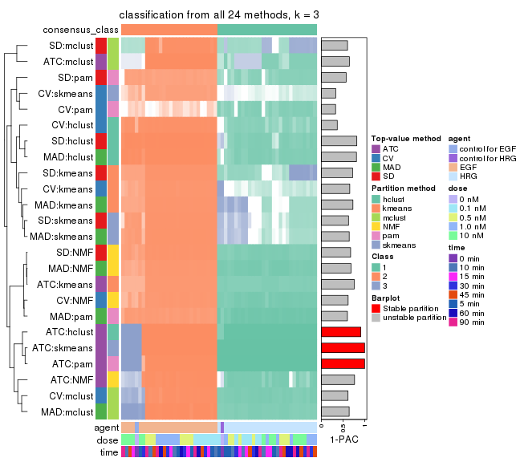</p>

</div>
<div id='tab-collect-classes-from-consensus-partition-list-3'>
<pre><code class="r">collect_classes(res_list, k = 4)
</code></pre>

<p></p>

</div>
<div id='tab-collect-classes-from-consensus-partition-list-4'>
<pre><code class="r">collect_classes(res_list, k = 5)
</code></pre>

<p></p>

</div>
<div id='tab-collect-classes-from-consensus-partition-list-5'>
<pre><code class="r">collect_classes(res_list, k = 6)
</code></pre>

<p></p>

</div>
</div>


### Top rows overlap


Overlap of top rows from different top-row methods:


<script>
$( function() {
	$( '#tabs-top-rows-overlap-by-euler' ).tabs();
} );
</script>
<div id='tabs-top-rows-overlap-by-euler'>
<ul>
<li><a href='#tab-top-rows-overlap-by-euler-1'>top_n = 1000</a></li>
<li><a href='#tab-top-rows-overlap-by-euler-2'>top_n = 2000</a></li>
<li><a href='#tab-top-rows-overlap-by-euler-3'>top_n = 3000</a></li>
<li><a href='#tab-top-rows-overlap-by-euler-4'>top_n = 4000</a></li>
<li><a href='#tab-top-rows-overlap-by-euler-5'>top_n = 5000</a></li>
</ul>
<div id='tab-top-rows-overlap-by-euler-1'>
<pre><code class="r">top_rows_overlap(res_list, top_n = 1000, method = &quot;euler&quot;)
</code></pre>

<p></p>

</div>
<div id='tab-top-rows-overlap-by-euler-2'>
<pre><code class="r">top_rows_overlap(res_list, top_n = 2000, method = &quot;euler&quot;)
</code></pre>

<p></p>

</div>
<div id='tab-top-rows-overlap-by-euler-3'>
<pre><code class="r">top_rows_overlap(res_list, top_n = 3000, method = &quot;euler&quot;)
</code></pre>

<p></p>

</div>
<div id='tab-top-rows-overlap-by-euler-4'>
<pre><code class="r">top_rows_overlap(res_list, top_n = 4000, method = &quot;euler&quot;)
</code></pre>

<p></p>

</div>
<div id='tab-top-rows-overlap-by-euler-5'>
<pre><code class="r">top_rows_overlap(res_list, top_n = 5000, method = &quot;euler&quot;)
</code></pre>

<p></p>

</div>
</div>

Also visualize the correspondance of rankings between different top-row methods:


<script>
$( function() {
	$( '#tabs-top-rows-overlap-by-correspondance' ).tabs();
} );
</script>
<div id='tabs-top-rows-overlap-by-correspondance'>
<ul>
<li><a href='#tab-top-rows-overlap-by-correspondance-1'>top_n = 1000</a></li>
<li><a href='#tab-top-rows-overlap-by-correspondance-2'>top_n = 2000</a></li>
<li><a href='#tab-top-rows-overlap-by-correspondance-3'>top_n = 3000</a></li>
<li><a href='#tab-top-rows-overlap-by-correspondance-4'>top_n = 4000</a></li>
<li><a href='#tab-top-rows-overlap-by-correspondance-5'>top_n = 5000</a></li>
</ul>
<div id='tab-top-rows-overlap-by-correspondance-1'>
<pre><code class="r">top_rows_overlap(res_list, top_n = 1000, method = &quot;correspondance&quot;)
</code></pre>

<p></p>

</div>
<div id='tab-top-rows-overlap-by-correspondance-2'>
<pre><code class="r">top_rows_overlap(res_list, top_n = 2000, method = &quot;correspondance&quot;)
</code></pre>

<p></p>

</div>
<div id='tab-top-rows-overlap-by-correspondance-3'>
<pre><code class="r">top_rows_overlap(res_list, top_n = 3000, method = &quot;correspondance&quot;)
</code></pre>

<p></p>

</div>
<div id='tab-top-rows-overlap-by-correspondance-4'>
<pre><code class="r">top_rows_overlap(res_list, top_n = 4000, method = &quot;correspondance&quot;)
</code></pre>

<p></p>

</div>
<div id='tab-top-rows-overlap-by-correspondance-5'>
<pre><code class="r">top_rows_overlap(res_list, top_n = 5000, method = &quot;correspondance&quot;)
</code></pre>

<p></p>

</div>
</div>


Heatmaps of the top rows:


<script>
$( function() {
	$( '#tabs-top-rows-heatmap' ).tabs();
} );
</script>
<div id='tabs-top-rows-heatmap'>
<ul>
<li><a href='#tab-top-rows-heatmap-1'>top_n = 1000</a></li>
<li><a href='#tab-top-rows-heatmap-2'>top_n = 2000</a></li>
<li><a href='#tab-top-rows-heatmap-3'>top_n = 3000</a></li>
<li><a href='#tab-top-rows-heatmap-4'>top_n = 4000</a></li>
<li><a href='#tab-top-rows-heatmap-5'>top_n = 5000</a></li>
</ul>
<div id='tab-top-rows-heatmap-1'>
<pre><code class="r">top_rows_heatmap(res_list, top_n = 1000)
</code></pre>

<p></p>

</div>
<div id='tab-top-rows-heatmap-2'>
<pre><code class="r">top_rows_heatmap(res_list, top_n = 2000)
</code></pre>

<p></p>

</div>
<div id='tab-top-rows-heatmap-3'>
<pre><code class="r">top_rows_heatmap(res_list, top_n = 3000)
</code></pre>

<p></p>

</div>
<div id='tab-top-rows-heatmap-4'>
<pre><code class="r">top_rows_heatmap(res_list, top_n = 4000)
</code></pre>

<p></p>

</div>
<div id='tab-top-rows-heatmap-5'>
<pre><code class="r">top_rows_heatmap(res_list, top_n = 5000)
</code></pre>

<p></p>

</div>
</div>


### Test to known annotations


Test correlation between subgroups and known annotations. If the known
annotation is numeric, one-way ANOVA test is applied, and if the known
annotation is discrete, chi-squared contingency table test is applied.


<script>
$( function() {
	$( '#tabs-test-to-known-factors-from-consensus-partition-list' ).tabs();
} );
</script>
<div id='tabs-test-to-known-factors-from-consensus-partition-list'>
<ul>
<li><a href='#tab-test-to-known-factors-from-consensus-partition-list-1'>k = 2</a></li>
<li><a href='#tab-test-to-known-factors-from-consensus-partition-list-2'>k = 3</a></li>
<li><a href='#tab-test-to-known-factors-from-consensus-partition-list-3'>k = 4</a></li>
<li><a href='#tab-test-to-known-factors-from-consensus-partition-list-4'>k = 5</a></li>
<li><a href='#tab-test-to-known-factors-from-consensus-partition-list-5'>k = 6</a></li>
</ul>
<div id='tab-test-to-known-factors-from-consensus-partition-list-1'>
<pre><code class="r">test_to_known_factors(res_list, k = 2)
</code></pre>

<pre><code>#&gt;              n agent(p) dose(p) time(p) k
#&gt; SD:NMF      57 2.57e-12   1.000   1.000 2
#&gt; CV:NMF      57 2.57e-12   1.000   1.000 2
#&gt; MAD:NMF     57 2.57e-12   1.000   1.000 2
#&gt; ATC:NMF     57 2.57e-12   1.000   1.000 2
#&gt; SD:skmeans  57 2.57e-12   1.000   1.000 2
#&gt; CV:skmeans  57 2.57e-12   1.000   1.000 2
#&gt; MAD:skmeans 57 2.57e-12   1.000   1.000 2
#&gt; ATC:skmeans 57 2.57e-12   1.000   1.000 2
#&gt; SD:mclust   56 7.87e-08   0.022   0.991 2
#&gt; CV:mclust   51 8.42e-12   0.328   0.996 2
#&gt; MAD:mclust  51 8.42e-12   0.328   0.996 2
#&gt; ATC:mclust  57 2.57e-12   1.000   1.000 2
#&gt; SD:kmeans   57 2.57e-12   1.000   1.000 2
#&gt; CV:kmeans   57 2.57e-12   1.000   1.000 2
#&gt; MAD:kmeans  57 2.57e-12   1.000   1.000 2
#&gt; ATC:kmeans  57 2.57e-12   1.000   1.000 2
#&gt; SD:pam      56 4.20e-12   0.992   1.000 2
#&gt; CV:pam      55 6.87e-12   0.999   1.000 2
#&gt; MAD:pam     57 2.57e-12   1.000   1.000 2
#&gt; ATC:pam     57 2.57e-12   1.000   1.000 2
#&gt; SD:hclust   57 2.57e-12   1.000   1.000 2
#&gt; CV:hclust   57 2.57e-12   1.000   1.000 2
#&gt; MAD:hclust  57 2.57e-12   1.000   1.000 2
#&gt; ATC:hclust  57 2.57e-12   1.000   1.000 2
</code></pre>

</div>
<div id='tab-test-to-known-factors-from-consensus-partition-list-2'>
<pre><code class="r">test_to_known_factors(res_list, k = 3)
</code></pre>

<pre><code>#&gt;              n agent(p)  dose(p) time(p) k
#&gt; SD:NMF      57 2.57e-12 1.00e+00  1.0000 3
#&gt; CV:NMF      57 2.57e-12 1.00e+00  1.0000 3
#&gt; MAD:NMF     57 2.57e-12 1.00e+00  1.0000 3
#&gt; ATC:NMF     52 5.11e-12 6.58e-03  0.9939 3
#&gt; SD:skmeans  42 3.56e-08 1.94e-02  0.4836 3
#&gt; CV:skmeans  25       NA       NA      NA 3
#&gt; MAD:skmeans 45 1.10e-08 2.16e-02  0.6260 3
#&gt; ATC:skmeans 57 4.87e-12 4.14e-03  0.9705 3
#&gt; SD:mclust   53 1.19e-07 1.80e-04  0.9936 3
#&gt; CV:mclust   57 9.44e-12 6.66e-04  0.9951 3
#&gt; MAD:mclust  57 9.44e-12 6.66e-04  0.9951 3
#&gt; ATC:mclust  45 1.69e-10 8.25e-05  0.9975 3
#&gt; SD:kmeans   50 2.51e-09 5.88e-03  0.9291 3
#&gt; CV:kmeans   30 1.38e-06 9.52e-02  0.2451 3
#&gt; MAD:kmeans  48 2.84e-09 2.43e-02  0.6957 3
#&gt; ATC:kmeans  57 2.57e-12 1.00e+00  1.0000 3
#&gt; SD:pam      54 1.12e-11 9.97e-01  0.9991 3
#&gt; CV:pam      27       NA       NA      NA 3
#&gt; MAD:pam     57 2.57e-12 1.00e+00  1.0000 3
#&gt; ATC:pam     57 4.87e-12 4.14e-03  0.9705 3
#&gt; SD:hclust   53 1.40e-20 8.01e-04  0.0126 3
#&gt; CV:hclust   54 1.88e-12 8.85e-01  0.9869 3
#&gt; MAD:hclust  55 1.14e-12 8.89e-01  0.9893 3
#&gt; ATC:hclust  57 4.87e-12 4.14e-03  0.9705 3
</code></pre>

</div>
<div id='tab-test-to-known-factors-from-consensus-partition-list-3'>
<pre><code class="r">test_to_known_factors(res_list, k = 4)
</code></pre>

<pre><code>#&gt;              n agent(p)  dose(p) time(p) k
#&gt; SD:NMF      51 8.66e-10 2.86e-04  0.6291 4
#&gt; CV:NMF      33 1.61e-08 2.96e-04  0.3345 4
#&gt; MAD:NMF     52 1.54e-09 9.08e-06  0.9584 4
#&gt; ATC:NMF     56 8.31e-12 2.93e-06  0.9729 4
#&gt; SD:skmeans  43 3.68e-08 5.48e-05  0.6283 4
#&gt; CV:skmeans  17       NA 7.07e-04  0.5492 4
#&gt; MAD:skmeans 47 8.52e-09 1.00e-05  0.9038 4
#&gt; ATC:skmeans 57 7.72e-11 3.16e-06  0.9969 4
#&gt; SD:mclust   51 3.39e-09 7.11e-07  0.9787 4
#&gt; CV:mclust   45 4.70e-09 2.30e-04  0.4343 4
#&gt; MAD:mclust  55 4.28e-10 1.32e-05  0.9613 4
#&gt; ATC:mclust  50 3.58e-10 3.73e-07  0.9867 4
#&gt; SD:kmeans   53 1.02e-09 5.55e-07  0.9970 4
#&gt; CV:kmeans   40 6.03e-08 9.60e-05  0.7788 4
#&gt; MAD:kmeans  53 1.02e-09 2.17e-06  0.9822 4
#&gt; ATC:kmeans  57 1.45e-10 4.71e-07  0.9996 4
#&gt; SD:pam      13 4.74e-03 3.68e-02  0.4612 4
#&gt; CV:pam       4       NA       NA      NA 4
#&gt; MAD:pam     29 9.42e-03 4.37e-01  0.5475 4
#&gt; ATC:pam     57 7.72e-11 3.16e-06  0.9969 4
#&gt; SD:hclust   50 1.57e-17 2.61e-04  0.0207 4
#&gt; CV:hclust   30 8.08e-06 8.33e-02  0.7660 4
#&gt; MAD:hclust  52 1.38e-10 2.50e-02  0.9852 4
#&gt; ATC:hclust  57 5.82e-16 1.61e-04  0.3494 4
</code></pre>

</div>
<div id='tab-test-to-known-factors-from-consensus-partition-list-4'>
<pre><code class="r">test_to_known_factors(res_list, k = 5)
</code></pre>

<pre><code>#&gt;              n agent(p)  dose(p) time(p) k
#&gt; SD:NMF      47 1.41e-08 1.98e-05   0.821 5
#&gt; CV:NMF      32 1.13e-07 1.73e-04   0.885 5
#&gt; MAD:NMF     52 1.76e-09 4.20e-05   0.925 5
#&gt; ATC:NMF     55 8.11e-14 2.26e-08   0.741 5
#&gt; SD:skmeans  41 7.87e-08 8.83e-05   0.537 5
#&gt; CV:skmeans   4       NA       NA      NA 5
#&gt; MAD:skmeans 41 3.71e-08 2.25e-05   0.905 5
#&gt; ATC:skmeans 57 7.72e-11 3.16e-06   0.997 5
#&gt; SD:mclust   53 7.70e-10 1.19e-06   0.789 5
#&gt; CV:mclust   36 4.56e-07 2.23e-04   0.712 5
#&gt; MAD:mclust  51 2.29e-09 1.36e-05   0.947 5
#&gt; ATC:mclust  56 3.68e-09 3.52e-06   0.857 5
#&gt; SD:kmeans   51 2.09e-09 3.52e-06   0.733 5
#&gt; CV:kmeans   50 1.59e-09 1.49e-06   0.735 5
#&gt; MAD:kmeans  50 3.44e-09 1.37e-05   0.701 5
#&gt; ATC:kmeans  57 1.45e-10 4.71e-07   1.000 5
#&gt; SD:pam      18       NA       NA      NA 5
#&gt; CV:pam       0       NA       NA      NA 5
#&gt; MAD:pam     33 4.03e-07 2.07e-01   0.682 5
#&gt; ATC:pam     57 1.83e-14 5.10e-08   0.726 5
#&gt; SD:hclust   53 1.17e-09 2.75e-01   0.207 5
#&gt; CV:hclust   39 3.40e-09 9.31e-02   0.425 5
#&gt; MAD:hclust  49 7.46e-09 4.19e-03   0.939 5
#&gt; ATC:hclust  57 1.83e-14 1.74e-04   0.419 5
</code></pre>

</div>
<div id='tab-test-to-known-factors-from-consensus-partition-list-5'>
<pre><code class="r">test_to_known_factors(res_list, k = 6)
</code></pre>

<pre><code>#&gt;              n agent(p)  dose(p) time(p) k
#&gt; SD:NMF      43 8.43e-09 6.35e-05  0.4343 6
#&gt; CV:NMF      28 8.32e-07 1.21e-03  0.7261 6
#&gt; MAD:NMF     45 4.58e-08 1.31e-05  0.9000 6
#&gt; ATC:NMF     54 3.03e-13 3.63e-08  0.7222 6
#&gt; SD:skmeans  29 1.27e-06 1.52e-04  0.8408 6
#&gt; CV:skmeans   0       NA       NA      NA 6
#&gt; MAD:skmeans 38 1.66e-07 6.93e-05  0.8472 6
#&gt; ATC:skmeans 55 8.21e-09 2.37e-05  0.8786 6
#&gt; SD:mclust   52 4.08e-08 3.25e-05  0.5341 6
#&gt; CV:mclust   36 1.52e-07 5.42e-04  0.6576 6
#&gt; MAD:mclust  51 1.15e-08 3.16e-06  0.8629 6
#&gt; ATC:mclust  52 2.28e-11 1.37e-06  0.3975 6
#&gt; SD:kmeans   49 1.12e-11 3.03e-07  0.6142 6
#&gt; CV:kmeans   52 1.52e-09 3.63e-06  0.7128 6
#&gt; MAD:kmeans  49 5.66e-09 5.01e-06  0.8834 6
#&gt; ATC:kmeans  57 3.60e-10 2.04e-06  0.9425 6
#&gt; SD:pam      17 4.02e-04 2.45e-01  0.0896 6
#&gt; CV:pam       0       NA       NA      NA 6
#&gt; MAD:pam     31 1.85e-06 6.27e-01  0.5569 6
#&gt; ATC:pam     56 7.77e-13 5.69e-09  0.8013 6
#&gt; SD:hclust   45 9.25e-10 7.75e-03  0.5577 6
#&gt; CV:hclust   43 4.60e-10 9.03e-03  0.8700 6
#&gt; MAD:hclust  44 1.51e-09 3.06e-03  0.8543 6
#&gt; ATC:hclust  57 3.81e-13 1.74e-04  0.3249 6
</code></pre>

</div>
</div>


 
## Results for each method


---------------------------------------------------


### SD:hclust


The object with results only for a single top-value method and a single partition method 
can be extracted as:

```r
res = res_list["SD", "hclust"]
# you can also extract it by
# res = res_list["SD:hclust"]
```

A summary of `res` and all the functions that can be applied to it:

```r
res
```

```
#> A 'ConsensusPartition' object with k = 2, 3, 4, 5, 6.
#>   On a matrix with 21163 rows and 57 columns.
#>   Top rows (1000, 2000, 3000, 4000, 5000) are extracted by 'SD' method.
#>   Subgroups are detected by 'hclust' method.
#>   Performed in total 1250 partitions by row resampling.
#>   Best k for subgroups seems to be 2.
#> 
#> Following methods can be applied to this 'ConsensusPartition' object:
#>  [1] "cola_report"             "collect_classes"         "collect_plots"          
#>  [4] "collect_stats"           "colnames"                "compare_signatures"     
#>  [7] "consensus_heatmap"       "dimension_reduction"     "functional_enrichment"  
#> [10] "get_anno_col"            "get_anno"                "get_classes"            
#> [13] "get_consensus"           "get_matrix"              "get_membership"         
#> [16] "get_param"               "get_signatures"          "get_stats"              
#> [19] "is_best_k"               "is_stable_k"             "membership_heatmap"     
#> [22] "ncol"                    "nrow"                    "plot_ecdf"              
#> [25] "rownames"                "select_partition_number" "show"                   
#> [28] "suggest_best_k"          "test_to_known_factors"
```

`collect_plots()` function collects all the plots made from `res` for all `k` (number of partitions)
into one single page to provide an easy and fast comparison between different `k`.

```r
collect_plots(res)
```


The plots are:

- The first row: a plot of the ECDF (empirical cumulative distribution
  function) curves of the consensus matrix for each `k` and the heatmap of
  predicted classes for each `k`.
- The second row: heatmaps of the consensus matrix for each `k`.
- The third row: heatmaps of the membership matrix for each `k`.
- The fouth row: heatmaps of the signatures for each `k`.

All the plots in panels can be made by individual functions and they are
plotted later in this section.

`select_partition_number()` produces several plots showing different
statistics for choosing "optimized" `k`. There are following statistics:

- ECDF curves of the consensus matrix for each `k`;
- 1-PAC. [The PAC
  score](https://en.wikipedia.org/wiki/Consensus_clustering#Over-interpretation_potential_of_consensus_clustering)
  measures the proportion of the ambiguous subgrouping.
- Mean silhouette score.
- Concordance. The mean probability of fiting the consensus class ids in all
  partitions.
- Area increased. Denote $A_k$ as the area under the ECDF curve for current
  `k`, the area increased is defined as $A_k - A_{k-1}$.
- Rand index. The percent of pairs of samples that are both in a same cluster
  or both are not in a same cluster in the partition of k and k-1.
- Jaccard index. The ratio of pairs of samples are both in a same cluster in
  the partition of k and k-1 and the pairs of samples are both in a same
  cluster in the partition k or k-1.

The detailed explanations of these statistics can be found in [the _cola_
vignette](http://bioconductor.org/packages/devel/bioc/vignettes/cola/inst/doc/cola.html#toc_13).

Generally speaking, lower PAC score, higher mean silhouette score or higher
concordance corresponds to better partition. Rand index and Jaccard index
measure how similar the current partition is compared to partition with `k-1`.
If they are too similar, we won't accept `k` is better than `k-1`.

```r
select_partition_number(res)
```


The numeric values for all these statistics can be obtained by `get_stats()`.

```r
get_stats(res)
```

```
#>   k 1-PAC mean_silhouette concordance area_increased  Rand Jaccard
#> 2 2 0.878           0.955       0.956         0.4907 0.491   0.491
#> 3 3 0.819           0.861       0.923         0.1702 0.966   0.931
#> 4 4 0.801           0.785       0.884         0.1130 0.912   0.808
#> 5 5 0.739           0.774       0.849         0.0606 0.964   0.904
#> 6 6 0.719           0.636       0.841         0.0381 0.981   0.943
```

`suggest_best_k()` suggests the best $k$ based on these statistics. The rules are as follows:

- All $k$ with Jaccard index larger than 0.95 are removed because increasing
  $k$ does not provide enough extra information. If all $k$ are removed, it is
  marked as no subgroup is detected.
- For all $k$ with 1-PAC score larger than 0.9, the maximal $k$ is taken as
  the best $k$, and other $k$ are marked as optional $k$.
- If it does not fit the second rule. The $k$ with the maximal vote of the
  highest 1-PAC score, highest mean silhouette, and highest concordance is
  taken as the best $k$.

```r
suggest_best_k(res)
```

```
#> [1] 2
```


Following shows the table of the partitions (You need to click the **show/hide
code output** link to see it). The membership matrix (columns with name `p*`)
is inferred by
[`clue::cl_consensus()`](https://www.rdocumentation.org/link/cl_consensus?package=clue)
function with the `SE` method. Basically the value in the membership matrix
represents the probability to belong to a certain group. The finall class
label for an item is determined with the group with highest probability it
belongs to.

In `get_classes()` function, the entropy is calculated from the membership
matrix and the silhouette score is calculated from the consensus matrix.


<script>
$( function() {
	$( '#tabs-SD-hclust-get-classes' ).tabs();
} );
</script>
<div id='tabs-SD-hclust-get-classes'>
<ul>
<li><a href='#tab-SD-hclust-get-classes-1'>k = 2</a></li>
<li><a href='#tab-SD-hclust-get-classes-2'>k = 3</a></li>
<li><a href='#tab-SD-hclust-get-classes-3'>k = 4</a></li>
<li><a href='#tab-SD-hclust-get-classes-4'>k = 5</a></li>
<li><a href='#tab-SD-hclust-get-classes-5'>k = 6</a></li>
</ul>

<div id='tab-SD-hclust-get-classes-1'>
<p><a id='tab-SD-hclust-get-classes-1-a' style='color:#0366d6' href='#'>show/hide code output</a></p>
<pre><code class="r">cbind(get_classes(res, k = 2), get_membership(res, k = 2))
</code></pre>

<pre><code>#&gt;           class entropy silhouette    p1    p2
#&gt; GSM148516     2  0.0000      0.998 0.000 1.000
#&gt; GSM148517     1  0.9323      0.538 0.652 0.348
#&gt; GSM148518     2  0.0000      0.998 0.000 1.000
#&gt; GSM148519     2  0.0000      0.998 0.000 1.000
#&gt; GSM148520     2  0.0000      0.998 0.000 1.000
#&gt; GSM148521     2  0.0000      0.998 0.000 1.000
#&gt; GSM148522     2  0.0000      0.998 0.000 1.000
#&gt; GSM148523     2  0.0000      0.998 0.000 1.000
#&gt; GSM148524     2  0.0000      0.998 0.000 1.000
#&gt; GSM148525     2  0.0000      0.998 0.000 1.000
#&gt; GSM148526     2  0.0000      0.998 0.000 1.000
#&gt; GSM148527     2  0.0000      0.998 0.000 1.000
#&gt; GSM148528     2  0.0000      0.998 0.000 1.000
#&gt; GSM148529     2  0.0000      0.998 0.000 1.000
#&gt; GSM148530     2  0.0000      0.998 0.000 1.000
#&gt; GSM148531     2  0.0000      0.998 0.000 1.000
#&gt; GSM148532     2  0.0000      0.998 0.000 1.000
#&gt; GSM148533     2  0.0000      0.998 0.000 1.000
#&gt; GSM148534     2  0.0000      0.998 0.000 1.000
#&gt; GSM148535     2  0.0000      0.998 0.000 1.000
#&gt; GSM148536     2  0.0000      0.998 0.000 1.000
#&gt; GSM148537     2  0.0000      0.998 0.000 1.000
#&gt; GSM148538     2  0.0000      0.998 0.000 1.000
#&gt; GSM148539     2  0.0376      0.994 0.004 0.996
#&gt; GSM148540     2  0.0000      0.998 0.000 1.000
#&gt; GSM148541     2  0.0000      0.998 0.000 1.000
#&gt; GSM148542     2  0.0672      0.990 0.008 0.992
#&gt; GSM148543     2  0.0000      0.998 0.000 1.000
#&gt; GSM148544     2  0.2236      0.959 0.036 0.964
#&gt; GSM148545     1  0.8016      0.763 0.756 0.244
#&gt; GSM148546     1  0.4562      0.941 0.904 0.096
#&gt; GSM148547     1  0.4298      0.944 0.912 0.088
#&gt; GSM148548     1  0.4562      0.941 0.904 0.096
#&gt; GSM148549     1  0.4562      0.941 0.904 0.096
#&gt; GSM148550     1  0.3114      0.945 0.944 0.056
#&gt; GSM148551     1  0.3114      0.945 0.944 0.056
#&gt; GSM148552     1  0.5629      0.920 0.868 0.132
#&gt; GSM148553     1  0.5294      0.928 0.880 0.120
#&gt; GSM148554     1  0.3879      0.946 0.924 0.076
#&gt; GSM148555     1  0.4298      0.944 0.912 0.088
#&gt; GSM148556     1  0.3114      0.944 0.944 0.056
#&gt; GSM148557     1  0.3431      0.945 0.936 0.064
#&gt; GSM148558     1  0.2043      0.938 0.968 0.032
#&gt; GSM148559     1  0.5294      0.920 0.880 0.120
#&gt; GSM148560     1  0.5737      0.907 0.864 0.136
#&gt; GSM148561     1  0.4298      0.938 0.912 0.088
#&gt; GSM148562     1  0.3584      0.946 0.932 0.068
#&gt; GSM148563     1  0.2043      0.938 0.968 0.032
#&gt; GSM148564     1  0.1414      0.932 0.980 0.020
#&gt; GSM148565     1  0.0376      0.922 0.996 0.004
#&gt; GSM148566     1  0.5519      0.915 0.872 0.128
#&gt; GSM148567     1  0.3584      0.945 0.932 0.068
#&gt; GSM148568     1  0.3431      0.945 0.936 0.064
#&gt; GSM148569     1  0.3114      0.945 0.944 0.056
#&gt; GSM148570     1  0.0938      0.928 0.988 0.012
#&gt; GSM148571     1  0.0938      0.928 0.988 0.012
#&gt; GSM148572     1  0.0000      0.920 1.000 0.000
</code></pre>

<script>
$('#tab-SD-hclust-get-classes-1-a').parent().next().next().hide();
$('#tab-SD-hclust-get-classes-1-a').click(function(){
  $('#tab-SD-hclust-get-classes-1-a').parent().next().next().toggle();
  return(false);
});
</script>
</div>

<div id='tab-SD-hclust-get-classes-2'>
<p><a id='tab-SD-hclust-get-classes-2-a' style='color:#0366d6' href='#'>show/hide code output</a></p>
<pre><code class="r">cbind(get_classes(res, k = 3), get_membership(res, k = 3))
</code></pre>

<pre><code>#&gt;           class entropy silhouette    p1    p2    p3
#&gt; GSM148516     2  0.0592      0.988 0.000 0.988 0.012
#&gt; GSM148517     3  0.2878      0.609 0.096 0.000 0.904
#&gt; GSM148518     2  0.0000      0.996 0.000 1.000 0.000
#&gt; GSM148519     2  0.0000      0.996 0.000 1.000 0.000
#&gt; GSM148520     2  0.0237      0.994 0.004 0.996 0.000
#&gt; GSM148521     2  0.0237      0.994 0.004 0.996 0.000
#&gt; GSM148522     2  0.0000      0.996 0.000 1.000 0.000
#&gt; GSM148523     2  0.0000      0.996 0.000 1.000 0.000
#&gt; GSM148524     2  0.0000      0.996 0.000 1.000 0.000
#&gt; GSM148525     2  0.0000      0.996 0.000 1.000 0.000
#&gt; GSM148526     2  0.0000      0.996 0.000 1.000 0.000
#&gt; GSM148527     2  0.0000      0.996 0.000 1.000 0.000
#&gt; GSM148528     2  0.0000      0.996 0.000 1.000 0.000
#&gt; GSM148529     2  0.0000      0.996 0.000 1.000 0.000
#&gt; GSM148530     2  0.0000      0.996 0.000 1.000 0.000
#&gt; GSM148531     2  0.0000      0.996 0.000 1.000 0.000
#&gt; GSM148532     2  0.0000      0.996 0.000 1.000 0.000
#&gt; GSM148533     2  0.0000      0.996 0.000 1.000 0.000
#&gt; GSM148534     2  0.0000      0.996 0.000 1.000 0.000
#&gt; GSM148535     2  0.0000      0.996 0.000 1.000 0.000
#&gt; GSM148536     2  0.0000      0.996 0.000 1.000 0.000
#&gt; GSM148537     2  0.0000      0.996 0.000 1.000 0.000
#&gt; GSM148538     2  0.0237      0.994 0.004 0.996 0.000
#&gt; GSM148539     2  0.0237      0.994 0.000 0.996 0.004
#&gt; GSM148540     2  0.0000      0.996 0.000 1.000 0.000
#&gt; GSM148541     2  0.0237      0.993 0.004 0.996 0.000
#&gt; GSM148542     2  0.1182      0.975 0.012 0.976 0.012
#&gt; GSM148543     2  0.0000      0.996 0.000 1.000 0.000
#&gt; GSM148544     2  0.1411      0.955 0.036 0.964 0.000
#&gt; GSM148545     3  0.6045      0.404 0.380 0.000 0.620
#&gt; GSM148546     1  0.3539      0.794 0.888 0.012 0.100
#&gt; GSM148547     1  0.3896      0.781 0.864 0.008 0.128
#&gt; GSM148548     1  0.2446      0.822 0.936 0.012 0.052
#&gt; GSM148549     1  0.2492      0.823 0.936 0.016 0.048
#&gt; GSM148550     1  0.2063      0.831 0.948 0.008 0.044
#&gt; GSM148551     1  0.2063      0.831 0.948 0.008 0.044
#&gt; GSM148552     1  0.4862      0.741 0.820 0.020 0.160
#&gt; GSM148553     1  0.4539      0.754 0.836 0.016 0.148
#&gt; GSM148554     1  0.1950      0.828 0.952 0.008 0.040
#&gt; GSM148555     1  0.2339      0.825 0.940 0.012 0.048
#&gt; GSM148556     1  0.1950      0.830 0.952 0.008 0.040
#&gt; GSM148557     1  0.1711      0.831 0.960 0.008 0.032
#&gt; GSM148558     1  0.3619      0.800 0.864 0.000 0.136
#&gt; GSM148559     1  0.6298      0.272 0.608 0.004 0.388
#&gt; GSM148560     1  0.6451      0.281 0.608 0.008 0.384
#&gt; GSM148561     1  0.3141      0.820 0.912 0.020 0.068
#&gt; GSM148562     1  0.2173      0.830 0.944 0.008 0.048
#&gt; GSM148563     1  0.3851      0.808 0.860 0.004 0.136
#&gt; GSM148564     1  0.4110      0.792 0.844 0.004 0.152
#&gt; GSM148565     1  0.4291      0.767 0.820 0.000 0.180
#&gt; GSM148566     1  0.6057      0.411 0.656 0.004 0.340
#&gt; GSM148567     1  0.4164      0.818 0.848 0.008 0.144
#&gt; GSM148568     1  0.3896      0.818 0.864 0.008 0.128
#&gt; GSM148569     1  0.3532      0.828 0.884 0.008 0.108
#&gt; GSM148570     1  0.3941      0.787 0.844 0.000 0.156
#&gt; GSM148571     1  0.4062      0.782 0.836 0.000 0.164
#&gt; GSM148572     1  0.4291      0.767 0.820 0.000 0.180
</code></pre>

<script>
$('#tab-SD-hclust-get-classes-2-a').parent().next().next().hide();
$('#tab-SD-hclust-get-classes-2-a').click(function(){
  $('#tab-SD-hclust-get-classes-2-a').parent().next().next().toggle();
  return(false);
});
</script>
</div>

<div id='tab-SD-hclust-get-classes-3'>
<p><a id='tab-SD-hclust-get-classes-3-a' style='color:#0366d6' href='#'>show/hide code output</a></p>
<pre><code class="r">cbind(get_classes(res, k = 4), get_membership(res, k = 4))
</code></pre>

<pre><code>#&gt;           class entropy silhouette    p1    p2    p3    p4
#&gt; GSM148516     2  0.1584     0.9569 0.000 0.952 0.012 0.036
#&gt; GSM148517     3  0.2281     0.5418 0.096 0.000 0.904 0.000
#&gt; GSM148518     2  0.0000     0.9930 0.000 1.000 0.000 0.000
#&gt; GSM148519     2  0.0000     0.9930 0.000 1.000 0.000 0.000
#&gt; GSM148520     2  0.0188     0.9910 0.004 0.996 0.000 0.000
#&gt; GSM148521     2  0.0188     0.9910 0.004 0.996 0.000 0.000
#&gt; GSM148522     2  0.0000     0.9930 0.000 1.000 0.000 0.000
#&gt; GSM148523     2  0.0000     0.9930 0.000 1.000 0.000 0.000
#&gt; GSM148524     2  0.0000     0.9930 0.000 1.000 0.000 0.000
#&gt; GSM148525     2  0.0000     0.9930 0.000 1.000 0.000 0.000
#&gt; GSM148526     2  0.0188     0.9913 0.000 0.996 0.000 0.004
#&gt; GSM148527     2  0.0000     0.9930 0.000 1.000 0.000 0.000
#&gt; GSM148528     2  0.0000     0.9930 0.000 1.000 0.000 0.000
#&gt; GSM148529     2  0.0000     0.9930 0.000 1.000 0.000 0.000
#&gt; GSM148530     2  0.0000     0.9930 0.000 1.000 0.000 0.000
#&gt; GSM148531     2  0.0000     0.9930 0.000 1.000 0.000 0.000
#&gt; GSM148532     2  0.0000     0.9930 0.000 1.000 0.000 0.000
#&gt; GSM148533     2  0.0000     0.9930 0.000 1.000 0.000 0.000
#&gt; GSM148534     2  0.0000     0.9930 0.000 1.000 0.000 0.000
#&gt; GSM148535     2  0.0000     0.9930 0.000 1.000 0.000 0.000
#&gt; GSM148536     2  0.0000     0.9930 0.000 1.000 0.000 0.000
#&gt; GSM148537     2  0.0000     0.9930 0.000 1.000 0.000 0.000
#&gt; GSM148538     2  0.0188     0.9910 0.004 0.996 0.000 0.000
#&gt; GSM148539     2  0.0524     0.9868 0.000 0.988 0.004 0.008
#&gt; GSM148540     2  0.0188     0.9912 0.000 0.996 0.000 0.004
#&gt; GSM148541     2  0.0844     0.9813 0.004 0.980 0.004 0.012
#&gt; GSM148542     2  0.1884     0.9510 0.020 0.948 0.016 0.016
#&gt; GSM148543     2  0.0188     0.9913 0.000 0.996 0.004 0.000
#&gt; GSM148544     2  0.1388     0.9585 0.028 0.960 0.000 0.012
#&gt; GSM148545     3  0.5112     0.3689 0.384 0.000 0.608 0.008
#&gt; GSM148546     1  0.2088     0.7200 0.928 0.004 0.064 0.004
#&gt; GSM148547     1  0.2334     0.7078 0.908 0.004 0.088 0.000
#&gt; GSM148548     1  0.1369     0.7364 0.964 0.004 0.016 0.016
#&gt; GSM148549     1  0.2039     0.7400 0.940 0.008 0.016 0.036
#&gt; GSM148550     1  0.3043     0.7085 0.876 0.004 0.008 0.112
#&gt; GSM148551     1  0.3730     0.6765 0.836 0.004 0.016 0.144
#&gt; GSM148552     1  0.3128     0.6701 0.864 0.004 0.128 0.004
#&gt; GSM148553     1  0.2839     0.6845 0.884 0.004 0.108 0.004
#&gt; GSM148554     1  0.2570     0.7413 0.916 0.004 0.028 0.052
#&gt; GSM148555     1  0.1920     0.7384 0.944 0.004 0.028 0.024
#&gt; GSM148556     1  0.2983     0.7127 0.880 0.004 0.008 0.108
#&gt; GSM148557     1  0.3172     0.7137 0.872 0.004 0.012 0.112
#&gt; GSM148558     4  0.5476     0.5453 0.396 0.000 0.020 0.584
#&gt; GSM148559     1  0.6374     0.0807 0.556 0.000 0.372 0.072
#&gt; GSM148560     1  0.6277     0.1102 0.572 0.000 0.360 0.068
#&gt; GSM148561     1  0.4477     0.6667 0.808 0.000 0.084 0.108
#&gt; GSM148562     1  0.4532     0.6509 0.792 0.000 0.052 0.156
#&gt; GSM148563     4  0.5452     0.6601 0.360 0.000 0.024 0.616
#&gt; GSM148564     4  0.4933     0.7043 0.296 0.000 0.016 0.688
#&gt; GSM148565     4  0.3695     0.7832 0.156 0.000 0.016 0.828
#&gt; GSM148566     1  0.5847     0.2782 0.628 0.000 0.320 0.052
#&gt; GSM148567     1  0.5990     0.2797 0.608 0.000 0.056 0.336
#&gt; GSM148568     1  0.6180     0.2598 0.600 0.004 0.056 0.340
#&gt; GSM148569     1  0.5452     0.2444 0.616 0.000 0.024 0.360
#&gt; GSM148570     4  0.4086     0.8144 0.216 0.000 0.008 0.776
#&gt; GSM148571     4  0.4049     0.8152 0.212 0.000 0.008 0.780
#&gt; GSM148572     4  0.3161     0.7566 0.124 0.000 0.012 0.864
</code></pre>

<script>
$('#tab-SD-hclust-get-classes-3-a').parent().next().next().hide();
$('#tab-SD-hclust-get-classes-3-a').click(function(){
  $('#tab-SD-hclust-get-classes-3-a').parent().next().next().toggle();
  return(false);
});
</script>
</div>

<div id='tab-SD-hclust-get-classes-4'>
<p><a id='tab-SD-hclust-get-classes-4-a' style='color:#0366d6' href='#'>show/hide code output</a></p>
<pre><code class="r">cbind(get_classes(res, k = 5), get_membership(res, k = 5))
</code></pre>

<pre><code>#&gt;           class entropy silhouette    p1    p2    p3    p4 p5
#&gt; GSM148516     2  0.3969      0.683 0.000 0.692 0.000 0.004 NA
#&gt; GSM148517     3  0.5381      0.418 0.044 0.000 0.484 0.004 NA
#&gt; GSM148518     2  0.0290      0.958 0.000 0.992 0.000 0.000 NA
#&gt; GSM148519     2  0.0000      0.958 0.000 1.000 0.000 0.000 NA
#&gt; GSM148520     2  0.0324      0.957 0.004 0.992 0.000 0.000 NA
#&gt; GSM148521     2  0.0162      0.957 0.004 0.996 0.000 0.000 NA
#&gt; GSM148522     2  0.0162      0.958 0.000 0.996 0.000 0.000 NA
#&gt; GSM148523     2  0.0000      0.958 0.000 1.000 0.000 0.000 NA
#&gt; GSM148524     2  0.0000      0.958 0.000 1.000 0.000 0.000 NA
#&gt; GSM148525     2  0.0404      0.958 0.000 0.988 0.000 0.000 NA
#&gt; GSM148526     2  0.0404      0.956 0.000 0.988 0.000 0.000 NA
#&gt; GSM148527     2  0.0290      0.958 0.000 0.992 0.000 0.000 NA
#&gt; GSM148528     2  0.0162      0.958 0.000 0.996 0.000 0.000 NA
#&gt; GSM148529     2  0.0290      0.958 0.000 0.992 0.000 0.000 NA
#&gt; GSM148530     2  0.0290      0.958 0.000 0.992 0.000 0.000 NA
#&gt; GSM148531     2  0.0404      0.958 0.000 0.988 0.000 0.000 NA
#&gt; GSM148532     2  0.0510      0.958 0.000 0.984 0.000 0.000 NA
#&gt; GSM148533     2  0.0290      0.958 0.000 0.992 0.000 0.000 NA
#&gt; GSM148534     2  0.0290      0.957 0.000 0.992 0.000 0.000 NA
#&gt; GSM148535     2  0.0290      0.958 0.000 0.992 0.000 0.000 NA
#&gt; GSM148536     2  0.0290      0.958 0.000 0.992 0.000 0.000 NA
#&gt; GSM148537     2  0.0290      0.958 0.000 0.992 0.000 0.000 NA
#&gt; GSM148538     2  0.0324      0.957 0.004 0.992 0.000 0.000 NA
#&gt; GSM148539     2  0.1768      0.926 0.000 0.924 0.004 0.000 NA
#&gt; GSM148540     2  0.1608      0.928 0.000 0.928 0.000 0.000 NA
#&gt; GSM148541     2  0.3487      0.804 0.000 0.780 0.000 0.008 NA
#&gt; GSM148542     2  0.4394      0.722 0.016 0.716 0.000 0.012 NA
#&gt; GSM148543     2  0.2338      0.899 0.000 0.884 0.000 0.004 NA
#&gt; GSM148544     2  0.2906      0.895 0.012 0.880 0.004 0.016 NA
#&gt; GSM148545     3  0.6561      0.563 0.280 0.000 0.516 0.008 NA
#&gt; GSM148546     1  0.1892      0.713 0.916 0.000 0.080 0.004 NA
#&gt; GSM148547     1  0.2286      0.697 0.888 0.000 0.108 0.004 NA
#&gt; GSM148548     1  0.1682      0.739 0.944 0.000 0.032 0.012 NA
#&gt; GSM148549     1  0.2047      0.745 0.928 0.000 0.020 0.040 NA
#&gt; GSM148550     1  0.2835      0.731 0.868 0.000 0.016 0.112 NA
#&gt; GSM148551     1  0.3379      0.707 0.828 0.000 0.008 0.148 NA
#&gt; GSM148552     1  0.3433      0.646 0.832 0.000 0.132 0.004 NA
#&gt; GSM148553     1  0.3031      0.665 0.856 0.000 0.120 0.004 NA
#&gt; GSM148554     1  0.2278      0.746 0.916 0.000 0.032 0.044 NA
#&gt; GSM148555     1  0.2026      0.740 0.928 0.000 0.044 0.012 NA
#&gt; GSM148556     1  0.2681      0.732 0.876 0.000 0.012 0.108 NA
#&gt; GSM148557     1  0.3010      0.730 0.860 0.000 0.016 0.116 NA
#&gt; GSM148558     4  0.4774      0.553 0.328 0.000 0.016 0.644 NA
#&gt; GSM148559     3  0.4033      0.657 0.236 0.000 0.744 0.004 NA
#&gt; GSM148560     3  0.4423      0.639 0.296 0.000 0.684 0.012 NA
#&gt; GSM148561     1  0.5198      0.519 0.708 0.000 0.208 0.036 NA
#&gt; GSM148562     1  0.4982      0.618 0.744 0.000 0.108 0.128 NA
#&gt; GSM148563     4  0.5287      0.628 0.292 0.000 0.032 0.648 NA
#&gt; GSM148564     4  0.4668      0.677 0.220 0.000 0.048 0.724 NA
#&gt; GSM148565     4  0.2789      0.773 0.092 0.000 0.008 0.880 NA
#&gt; GSM148566     3  0.4375      0.553 0.364 0.000 0.628 0.004 NA
#&gt; GSM148567     1  0.6431      0.201 0.500 0.000 0.148 0.344 NA
#&gt; GSM148568     1  0.6686      0.207 0.492 0.004 0.136 0.352 NA
#&gt; GSM148569     1  0.6021      0.237 0.536 0.000 0.088 0.364 NA
#&gt; GSM148570     4  0.3320      0.793 0.124 0.000 0.016 0.844 NA
#&gt; GSM148571     4  0.3170      0.798 0.120 0.000 0.012 0.852 NA
#&gt; GSM148572     4  0.1967      0.739 0.036 0.000 0.012 0.932 NA
</code></pre>

<script>
$('#tab-SD-hclust-get-classes-4-a').parent().next().next().hide();
$('#tab-SD-hclust-get-classes-4-a').click(function(){
  $('#tab-SD-hclust-get-classes-4-a').parent().next().next().toggle();
  return(false);
});
</script>
</div>

<div id='tab-SD-hclust-get-classes-5'>
<p><a id='tab-SD-hclust-get-classes-5-a' style='color:#0366d6' href='#'>show/hide code output</a></p>
<pre><code class="r">cbind(get_classes(res, k = 6), get_membership(res, k = 6))
</code></pre>

<pre><code>#&gt;           class entropy silhouette    p1    p2    p3    p4    p5    p6
#&gt; GSM148516     3  0.4779     0.0000 0.000 0.468 0.488 0.000 0.004 0.040
#&gt; GSM148517     6  0.3617     0.0000 0.020 0.000 0.000 0.000 0.244 0.736
#&gt; GSM148518     2  0.0260     0.8870 0.000 0.992 0.008 0.000 0.000 0.000
#&gt; GSM148519     2  0.0000     0.8873 0.000 1.000 0.000 0.000 0.000 0.000
#&gt; GSM148520     2  0.0260     0.8850 0.000 0.992 0.008 0.000 0.000 0.000
#&gt; GSM148521     2  0.0146     0.8865 0.000 0.996 0.004 0.000 0.000 0.000
#&gt; GSM148522     2  0.0146     0.8877 0.000 0.996 0.004 0.000 0.000 0.000
#&gt; GSM148523     2  0.0000     0.8873 0.000 1.000 0.000 0.000 0.000 0.000
#&gt; GSM148524     2  0.0000     0.8873 0.000 1.000 0.000 0.000 0.000 0.000
#&gt; GSM148525     2  0.0363     0.8872 0.000 0.988 0.012 0.000 0.000 0.000
#&gt; GSM148526     2  0.0508     0.8797 0.000 0.984 0.012 0.000 0.004 0.000
#&gt; GSM148527     2  0.0458     0.8837 0.000 0.984 0.016 0.000 0.000 0.000
#&gt; GSM148528     2  0.0146     0.8876 0.000 0.996 0.004 0.000 0.000 0.000
#&gt; GSM148529     2  0.0260     0.8870 0.000 0.992 0.008 0.000 0.000 0.000
#&gt; GSM148530     2  0.0260     0.8870 0.000 0.992 0.008 0.000 0.000 0.000
#&gt; GSM148531     2  0.0363     0.8873 0.000 0.988 0.012 0.000 0.000 0.000
#&gt; GSM148532     2  0.0458     0.8865 0.000 0.984 0.016 0.000 0.000 0.000
#&gt; GSM148533     2  0.0260     0.8870 0.000 0.992 0.008 0.000 0.000 0.000
#&gt; GSM148534     2  0.0260     0.8853 0.000 0.992 0.008 0.000 0.000 0.000
#&gt; GSM148535     2  0.0260     0.8870 0.000 0.992 0.008 0.000 0.000 0.000
#&gt; GSM148536     2  0.0458     0.8825 0.000 0.984 0.016 0.000 0.000 0.000
#&gt; GSM148537     2  0.0363     0.8849 0.000 0.988 0.012 0.000 0.000 0.000
#&gt; GSM148538     2  0.0260     0.8850 0.000 0.992 0.008 0.000 0.000 0.000
#&gt; GSM148539     2  0.2212     0.7281 0.000 0.880 0.112 0.000 0.008 0.000
#&gt; GSM148540     2  0.1957     0.7496 0.000 0.888 0.112 0.000 0.000 0.000
#&gt; GSM148541     2  0.4064    -0.2311 0.000 0.644 0.336 0.000 0.000 0.020
#&gt; GSM148542     2  0.5629    -0.5474 0.016 0.520 0.388 0.000 0.016 0.060
#&gt; GSM148543     2  0.3385     0.4963 0.000 0.788 0.180 0.000 0.000 0.032
#&gt; GSM148544     2  0.3338     0.6036 0.016 0.824 0.140 0.012 0.004 0.004
#&gt; GSM148545     5  0.5998    -0.0342 0.236 0.000 0.000 0.000 0.404 0.360
#&gt; GSM148546     1  0.1918     0.6828 0.904 0.000 0.000 0.000 0.088 0.008
#&gt; GSM148547     1  0.2302     0.6628 0.872 0.000 0.000 0.000 0.120 0.008
#&gt; GSM148548     1  0.1649     0.7078 0.936 0.000 0.000 0.016 0.040 0.008
#&gt; GSM148549     1  0.1858     0.7139 0.932 0.000 0.004 0.024 0.024 0.016
#&gt; GSM148550     1  0.2846     0.7024 0.864 0.000 0.004 0.100 0.012 0.020
#&gt; GSM148551     1  0.3439     0.6823 0.828 0.000 0.008 0.112 0.008 0.044
#&gt; GSM148552     1  0.3370     0.6118 0.812 0.000 0.004 0.000 0.140 0.044
#&gt; GSM148553     1  0.2868     0.6361 0.840 0.000 0.000 0.000 0.132 0.028
#&gt; GSM148554     1  0.2007     0.7144 0.920 0.000 0.000 0.036 0.032 0.012
#&gt; GSM148555     1  0.2107     0.7076 0.916 0.000 0.008 0.008 0.052 0.016
#&gt; GSM148556     1  0.2748     0.7034 0.872 0.000 0.004 0.092 0.012 0.020
#&gt; GSM148557     1  0.2899     0.7017 0.860 0.000 0.004 0.104 0.016 0.016
#&gt; GSM148558     4  0.5177     0.4965 0.312 0.000 0.024 0.616 0.016 0.032
#&gt; GSM148559     5  0.3396     0.5099 0.112 0.000 0.020 0.000 0.828 0.040
#&gt; GSM148560     5  0.3404     0.6209 0.184 0.000 0.004 0.012 0.792 0.008
#&gt; GSM148561     1  0.7359     0.1929 0.472 0.000 0.224 0.032 0.192 0.080
#&gt; GSM148562     1  0.6871     0.4342 0.588 0.000 0.068 0.112 0.148 0.084
#&gt; GSM148563     4  0.5852     0.6540 0.212 0.000 0.052 0.644 0.040 0.052
#&gt; GSM148564     4  0.4498     0.6656 0.172 0.000 0.016 0.748 0.036 0.028
#&gt; GSM148565     4  0.3040     0.7494 0.072 0.000 0.028 0.868 0.016 0.016
#&gt; GSM148566     5  0.3512     0.6050 0.272 0.000 0.000 0.000 0.720 0.008
#&gt; GSM148567     1  0.6498     0.1404 0.456 0.000 0.012 0.344 0.164 0.024
#&gt; GSM148568     1  0.6674     0.1094 0.448 0.000 0.016 0.352 0.148 0.036
#&gt; GSM148569     1  0.5990     0.2204 0.512 0.000 0.008 0.360 0.088 0.032
#&gt; GSM148570     4  0.2832     0.7687 0.076 0.000 0.012 0.876 0.012 0.024
#&gt; GSM148571     4  0.2891     0.7752 0.088 0.000 0.008 0.868 0.012 0.024
#&gt; GSM148572     4  0.1794     0.7150 0.008 0.000 0.024 0.936 0.020 0.012
</code></pre>

<script>
$('#tab-SD-hclust-get-classes-5-a').parent().next().next().hide();
$('#tab-SD-hclust-get-classes-5-a').click(function(){
  $('#tab-SD-hclust-get-classes-5-a').parent().next().next().toggle();
  return(false);
});
</script>
</div>
</div>

Heatmaps for the consensus matrix. It visualizes the probability of two
samples to be in a same group.


<script>
$( function() {
	$( '#tabs-SD-hclust-consensus-heatmap' ).tabs();
} );
</script>
<div id='tabs-SD-hclust-consensus-heatmap'>
<ul>
<li><a href='#tab-SD-hclust-consensus-heatmap-1'>k = 2</a></li>
<li><a href='#tab-SD-hclust-consensus-heatmap-2'>k = 3</a></li>
<li><a href='#tab-SD-hclust-consensus-heatmap-3'>k = 4</a></li>
<li><a href='#tab-SD-hclust-consensus-heatmap-4'>k = 5</a></li>
<li><a href='#tab-SD-hclust-consensus-heatmap-5'>k = 6</a></li>
</ul>
<div id='tab-SD-hclust-consensus-heatmap-1'>
<pre><code class="r">consensus_heatmap(res, k = 2)
</code></pre>

<p></p>

</div>
<div id='tab-SD-hclust-consensus-heatmap-2'>
<pre><code class="r">consensus_heatmap(res, k = 3)
</code></pre>

<p></p>

</div>
<div id='tab-SD-hclust-consensus-heatmap-3'>
<pre><code class="r">consensus_heatmap(res, k = 4)
</code></pre>

<p></p>

</div>
<div id='tab-SD-hclust-consensus-heatmap-4'>
<pre><code class="r">consensus_heatmap(res, k = 5)
</code></pre>

<p></p>

</div>
<div id='tab-SD-hclust-consensus-heatmap-5'>
<pre><code class="r">consensus_heatmap(res, k = 6)
</code></pre>

<p></p>

</div>
</div>

Heatmaps for the membership of samples in all partitions to see how consistent they are:


<script>
$( function() {
	$( '#tabs-SD-hclust-membership-heatmap' ).tabs();
} );
</script>
<div id='tabs-SD-hclust-membership-heatmap'>
<ul>
<li><a href='#tab-SD-hclust-membership-heatmap-1'>k = 2</a></li>
<li><a href='#tab-SD-hclust-membership-heatmap-2'>k = 3</a></li>
<li><a href='#tab-SD-hclust-membership-heatmap-3'>k = 4</a></li>
<li><a href='#tab-SD-hclust-membership-heatmap-4'>k = 5</a></li>
<li><a href='#tab-SD-hclust-membership-heatmap-5'>k = 6</a></li>
</ul>
<div id='tab-SD-hclust-membership-heatmap-1'>
<pre><code class="r">membership_heatmap(res, k = 2)
</code></pre>

<p></p>

</div>
<div id='tab-SD-hclust-membership-heatmap-2'>
<pre><code class="r">membership_heatmap(res, k = 3)
</code></pre>

<p></p>

</div>
<div id='tab-SD-hclust-membership-heatmap-3'>
<pre><code class="r">membership_heatmap(res, k = 4)
</code></pre>

<p></p>

</div>
<div id='tab-SD-hclust-membership-heatmap-4'>
<pre><code class="r">membership_heatmap(res, k = 5)
</code></pre>

<p></p>

</div>
<div id='tab-SD-hclust-membership-heatmap-5'>
<pre><code class="r">membership_heatmap(res, k = 6)
</code></pre>

<p></p>

</div>
</div>

As soon as we have had the classes for columns, we can look for signatures
which are significantly different between classes which can be candidate marks
for certain classes. Following are the heatmaps for signatures.


Signature heatmaps where rows are scaled:


<script>
$( function() {
	$( '#tabs-SD-hclust-get-signatures' ).tabs();
} );
</script>
<div id='tabs-SD-hclust-get-signatures'>
<ul>
<li><a href='#tab-SD-hclust-get-signatures-1'>k = 2</a></li>
<li><a href='#tab-SD-hclust-get-signatures-2'>k = 3</a></li>
<li><a href='#tab-SD-hclust-get-signatures-3'>k = 4</a></li>
<li><a href='#tab-SD-hclust-get-signatures-4'>k = 5</a></li>
<li><a href='#tab-SD-hclust-get-signatures-5'>k = 6</a></li>
</ul>
<div id='tab-SD-hclust-get-signatures-1'>
<pre><code class="r">get_signatures(res, k = 2)
</code></pre>

<p></p>

</div>
<div id='tab-SD-hclust-get-signatures-2'>
<pre><code class="r">get_signatures(res, k = 3)
</code></pre>

<p></p>

</div>
<div id='tab-SD-hclust-get-signatures-3'>
<pre><code class="r">get_signatures(res, k = 4)
</code></pre>

<p></p>

</div>
<div id='tab-SD-hclust-get-signatures-4'>
<pre><code class="r">get_signatures(res, k = 5)
</code></pre>

<p></p>

</div>
<div id='tab-SD-hclust-get-signatures-5'>
<pre><code class="r">get_signatures(res, k = 6)
</code></pre>

<p>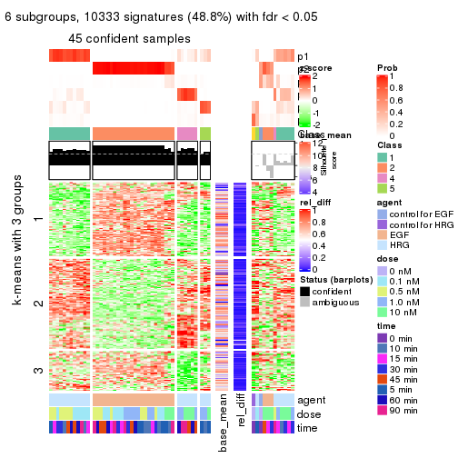</p>

</div>
</div>


Signature heatmaps where rows are not scaled:


<script>
$( function() {
	$( '#tabs-SD-hclust-get-signatures-no-scale' ).tabs();
} );
</script>
<div id='tabs-SD-hclust-get-signatures-no-scale'>
<ul>
<li><a href='#tab-SD-hclust-get-signatures-no-scale-1'>k = 2</a></li>
<li><a href='#tab-SD-hclust-get-signatures-no-scale-2'>k = 3</a></li>
<li><a href='#tab-SD-hclust-get-signatures-no-scale-3'>k = 4</a></li>
<li><a href='#tab-SD-hclust-get-signatures-no-scale-4'>k = 5</a></li>
<li><a href='#tab-SD-hclust-get-signatures-no-scale-5'>k = 6</a></li>
</ul>
<div id='tab-SD-hclust-get-signatures-no-scale-1'>
<pre><code class="r">get_signatures(res, k = 2, scale_rows = FALSE)
</code></pre>

<p></p>

</div>
<div id='tab-SD-hclust-get-signatures-no-scale-2'>
<pre><code class="r">get_signatures(res, k = 3, scale_rows = FALSE)
</code></pre>

<p>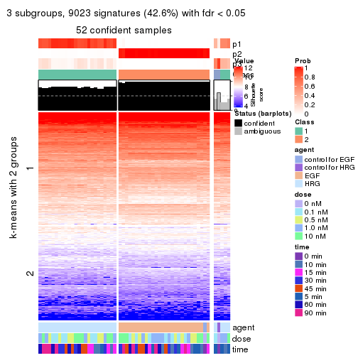</p>

</div>
<div id='tab-SD-hclust-get-signatures-no-scale-3'>
<pre><code class="r">get_signatures(res, k = 4, scale_rows = FALSE)
</code></pre>

<p></p>

</div>
<div id='tab-SD-hclust-get-signatures-no-scale-4'>
<pre><code class="r">get_signatures(res, k = 5, scale_rows = FALSE)
</code></pre>

<p></p>

</div>
<div id='tab-SD-hclust-get-signatures-no-scale-5'>
<pre><code class="r">get_signatures(res, k = 6, scale_rows = FALSE)
</code></pre>

<p></p>

</div>
</div>


Compare the overlap of signatures from different k:

```r
compare_signatures(res)
```


`get_signature()` returns a data frame invisibly. TO get the list of signatures, the function
call should be assigned to a variable explicitly. In following code, if `plot` argument is set
to `FALSE`, no heatmap is plotted while only the differential analysis is performed.

```r
# code only for demonstration
tb = get_signature(res, k = ..., plot = FALSE)
```

An example of the output of `tb` is:

```
#>   which_row         fdr    mean_1    mean_2 scaled_mean_1 scaled_mean_2 km
#> 1        38 0.042760348  8.373488  9.131774    -0.5533452     0.5164555  1
#> 2        40 0.018707592  7.106213  8.469186    -0.6173731     0.5762149  1
#> 3        55 0.019134737 10.221463 11.207825    -0.6159697     0.5749050  1
#> 4        59 0.006059896  5.921854  7.869574    -0.6899429     0.6439467  1
#> 5        60 0.018055526  8.928898 10.211722    -0.6204761     0.5791110  1
#> 6        98 0.009384629 15.714769 14.887706     0.6635654    -0.6193277  2
...
```

The columns in `tb` are:

1. `which_row`: row indices corresponding to the input matrix.
2. `fdr`: FDR for the differential test. 
3. `mean_x`: The mean value in group x.
4. `scaled_mean_x`: The mean value in group x after rows are scaled.
5. `km`: Row groups if k-means clustering is applied to rows.


UMAP plot which shows how samples are separated.


<script>
$( function() {
	$( '#tabs-SD-hclust-dimension-reduction' ).tabs();
} );
</script>
<div id='tabs-SD-hclust-dimension-reduction'>
<ul>
<li><a href='#tab-SD-hclust-dimension-reduction-1'>k = 2</a></li>
<li><a href='#tab-SD-hclust-dimension-reduction-2'>k = 3</a></li>
<li><a href='#tab-SD-hclust-dimension-reduction-3'>k = 4</a></li>
<li><a href='#tab-SD-hclust-dimension-reduction-4'>k = 5</a></li>
<li><a href='#tab-SD-hclust-dimension-reduction-5'>k = 6</a></li>
</ul>
<div id='tab-SD-hclust-dimension-reduction-1'>
<pre><code class="r">dimension_reduction(res, k = 2, method = &quot;UMAP&quot;)
</code></pre>

<p></p>

</div>
<div id='tab-SD-hclust-dimension-reduction-2'>
<pre><code class="r">dimension_reduction(res, k = 3, method = &quot;UMAP&quot;)
</code></pre>

<p></p>

</div>
<div id='tab-SD-hclust-dimension-reduction-3'>
<pre><code class="r">dimension_reduction(res, k = 4, method = &quot;UMAP&quot;)
</code></pre>

<p></p>

</div>
<div id='tab-SD-hclust-dimension-reduction-4'>
<pre><code class="r">dimension_reduction(res, k = 5, method = &quot;UMAP&quot;)
</code></pre>

<p></p>

</div>
<div id='tab-SD-hclust-dimension-reduction-5'>
<pre><code class="r">dimension_reduction(res, k = 6, method = &quot;UMAP&quot;)
</code></pre>

<p></p>

</div>
</div>


Following heatmap shows how subgroups are split when increasing `k`:

```r
collect_classes(res)
```


Test correlation between subgroups and known annotations. If the known
annotation is numeric, one-way ANOVA test is applied, and if the known
annotation is discrete, chi-squared contingency table test is applied.

```r
test_to_known_factors(res)
```

```
#>            n agent(p)  dose(p) time(p) k
#> SD:hclust 57 2.57e-12 0.999568  1.0000 2
#> SD:hclust 53 1.40e-20 0.000801  0.0126 3
#> SD:hclust 50 1.57e-17 0.000261  0.0207 4
#> SD:hclust 53 1.17e-09 0.275130  0.2067 5
#> SD:hclust 45 9.25e-10 0.007745  0.5577 6
```


If matrix rows can be associated to genes, consider to use `functional_enrichment(res,
...)` to perform function enrichment for the signature genes. See [this vignette](http://bioconductor.org/packages/devel/bioc/vignettes/cola/inst/doc/functional_enrichment.html) for more detailed explanations.


 

---------------------------------------------------


### SD:kmeans**


The object with results only for a single top-value method and a single partition method 
can be extracted as:

```r
res = res_list["SD", "kmeans"]
# you can also extract it by
# res = res_list["SD:kmeans"]
```

A summary of `res` and all the functions that can be applied to it:

```r
res
```

```
#> A 'ConsensusPartition' object with k = 2, 3, 4, 5, 6.
#>   On a matrix with 21163 rows and 57 columns.
#>   Top rows (1000, 2000, 3000, 4000, 5000) are extracted by 'SD' method.
#>   Subgroups are detected by 'kmeans' method.
#>   Performed in total 1250 partitions by row resampling.
#>   Best k for subgroups seems to be 2.
#> 
#> Following methods can be applied to this 'ConsensusPartition' object:
#>  [1] "cola_report"             "collect_classes"         "collect_plots"          
#>  [4] "collect_stats"           "colnames"                "compare_signatures"     
#>  [7] "consensus_heatmap"       "dimension_reduction"     "functional_enrichment"  
#> [10] "get_anno_col"            "get_anno"                "get_classes"            
#> [13] "get_consensus"           "get_matrix"              "get_membership"         
#> [16] "get_param"               "get_signatures"          "get_stats"              
#> [19] "is_best_k"               "is_stable_k"             "membership_heatmap"     
#> [22] "ncol"                    "nrow"                    "plot_ecdf"              
#> [25] "rownames"                "select_partition_number" "show"                   
#> [28] "suggest_best_k"          "test_to_known_factors"
```

`collect_plots()` function collects all the plots made from `res` for all `k` (number of partitions)
into one single page to provide an easy and fast comparison between different `k`.

```r
collect_plots(res)
```


The plots are:

- The first row: a plot of the ECDF (empirical cumulative distribution
  function) curves of the consensus matrix for each `k` and the heatmap of
  predicted classes for each `k`.
- The second row: heatmaps of the consensus matrix for each `k`.
- The third row: heatmaps of the membership matrix for each `k`.
- The fouth row: heatmaps of the signatures for each `k`.

All the plots in panels can be made by individual functions and they are
plotted later in this section.

`select_partition_number()` produces several plots showing different
statistics for choosing "optimized" `k`. There are following statistics:

- ECDF curves of the consensus matrix for each `k`;
- 1-PAC. [The PAC
  score](https://en.wikipedia.org/wiki/Consensus_clustering#Over-interpretation_potential_of_consensus_clustering)
  measures the proportion of the ambiguous subgrouping.
- Mean silhouette score.
- Concordance. The mean probability of fiting the consensus class ids in all
  partitions.
- Area increased. Denote $A_k$ as the area under the ECDF curve for current
  `k`, the area increased is defined as $A_k - A_{k-1}$.
- Rand index. The percent of pairs of samples that are both in a same cluster
  or both are not in a same cluster in the partition of k and k-1.
- Jaccard index. The ratio of pairs of samples are both in a same cluster in
  the partition of k and k-1 and the pairs of samples are both in a same
  cluster in the partition k or k-1.

The detailed explanations of these statistics can be found in [the _cola_
vignette](http://bioconductor.org/packages/devel/bioc/vignettes/cola/inst/doc/cola.html#toc_13).

Generally speaking, lower PAC score, higher mean silhouette score or higher
concordance corresponds to better partition. Rand index and Jaccard index
measure how similar the current partition is compared to partition with `k-1`.
If they are too similar, we won't accept `k` is better than `k-1`.

```r
select_partition_number(res)
```


The numeric values for all these statistics can be obtained by `get_stats()`.

```r
get_stats(res)
```

```
#>   k 1-PAC mean_silhouette concordance area_increased  Rand Jaccard
#> 2 2 1.000           1.000       1.000         0.5093 0.491   0.491
#> 3 3 0.723           0.742       0.843         0.2221 0.895   0.786
#> 4 4 0.724           0.819       0.837         0.1276 0.859   0.648
#> 5 5 0.676           0.784       0.837         0.0704 0.972   0.897
#> 6 6 0.730           0.771       0.808         0.0440 0.959   0.837
```

`suggest_best_k()` suggests the best $k$ based on these statistics. The rules are as follows:

- All $k$ with Jaccard index larger than 0.95 are removed because increasing
  $k$ does not provide enough extra information. If all $k$ are removed, it is
  marked as no subgroup is detected.
- For all $k$ with 1-PAC score larger than 0.9, the maximal $k$ is taken as
  the best $k$, and other $k$ are marked as optional $k$.
- If it does not fit the second rule. The $k$ with the maximal vote of the
  highest 1-PAC score, highest mean silhouette, and highest concordance is
  taken as the best $k$.

```r
suggest_best_k(res)
```

```
#> [1] 2
```


Following shows the table of the partitions (You need to click the **show/hide
code output** link to see it). The membership matrix (columns with name `p*`)
is inferred by
[`clue::cl_consensus()`](https://www.rdocumentation.org/link/cl_consensus?package=clue)
function with the `SE` method. Basically the value in the membership matrix
represents the probability to belong to a certain group. The finall class
label for an item is determined with the group with highest probability it
belongs to.

In `get_classes()` function, the entropy is calculated from the membership
matrix and the silhouette score is calculated from the consensus matrix.


<script>
$( function() {
	$( '#tabs-SD-kmeans-get-classes' ).tabs();
} );
</script>
<div id='tabs-SD-kmeans-get-classes'>
<ul>
<li><a href='#tab-SD-kmeans-get-classes-1'>k = 2</a></li>
<li><a href='#tab-SD-kmeans-get-classes-2'>k = 3</a></li>
<li><a href='#tab-SD-kmeans-get-classes-3'>k = 4</a></li>
<li><a href='#tab-SD-kmeans-get-classes-4'>k = 5</a></li>
<li><a href='#tab-SD-kmeans-get-classes-5'>k = 6</a></li>
</ul>

<div id='tab-SD-kmeans-get-classes-1'>
<p><a id='tab-SD-kmeans-get-classes-1-a' style='color:#0366d6' href='#'>show/hide code output</a></p>
<pre><code class="r">cbind(get_classes(res, k = 2), get_membership(res, k = 2))
</code></pre>

<pre><code>#&gt;           class entropy silhouette p1 p2
#&gt; GSM148516     2       0          1  0  1
#&gt; GSM148517     1       0          1  1  0
#&gt; GSM148518     2       0          1  0  1
#&gt; GSM148519     2       0          1  0  1
#&gt; GSM148520     2       0          1  0  1
#&gt; GSM148521     2       0          1  0  1
#&gt; GSM148522     2       0          1  0  1
#&gt; GSM148523     2       0          1  0  1
#&gt; GSM148524     2       0          1  0  1
#&gt; GSM148525     2       0          1  0  1
#&gt; GSM148526     2       0          1  0  1
#&gt; GSM148527     2       0          1  0  1
#&gt; GSM148528     2       0          1  0  1
#&gt; GSM148529     2       0          1  0  1
#&gt; GSM148530     2       0          1  0  1
#&gt; GSM148531     2       0          1  0  1
#&gt; GSM148532     2       0          1  0  1
#&gt; GSM148533     2       0          1  0  1
#&gt; GSM148534     2       0          1  0  1
#&gt; GSM148535     2       0          1  0  1
#&gt; GSM148536     2       0          1  0  1
#&gt; GSM148537     2       0          1  0  1
#&gt; GSM148538     2       0          1  0  1
#&gt; GSM148539     2       0          1  0  1
#&gt; GSM148540     2       0          1  0  1
#&gt; GSM148541     2       0          1  0  1
#&gt; GSM148542     2       0          1  0  1
#&gt; GSM148543     2       0          1  0  1
#&gt; GSM148544     2       0          1  0  1
#&gt; GSM148545     1       0          1  1  0
#&gt; GSM148546     1       0          1  1  0
#&gt; GSM148547     1       0          1  1  0
#&gt; GSM148548     1       0          1  1  0
#&gt; GSM148549     1       0          1  1  0
#&gt; GSM148550     1       0          1  1  0
#&gt; GSM148551     1       0          1  1  0
#&gt; GSM148552     1       0          1  1  0
#&gt; GSM148553     1       0          1  1  0
#&gt; GSM148554     1       0          1  1  0
#&gt; GSM148555     1       0          1  1  0
#&gt; GSM148556     1       0          1  1  0
#&gt; GSM148557     1       0          1  1  0
#&gt; GSM148558     1       0          1  1  0
#&gt; GSM148559     1       0          1  1  0
#&gt; GSM148560     1       0          1  1  0
#&gt; GSM148561     1       0          1  1  0
#&gt; GSM148562     1       0          1  1  0
#&gt; GSM148563     1       0          1  1  0
#&gt; GSM148564     1       0          1  1  0
#&gt; GSM148565     1       0          1  1  0
#&gt; GSM148566     1       0          1  1  0
#&gt; GSM148567     1       0          1  1  0
#&gt; GSM148568     1       0          1  1  0
#&gt; GSM148569     1       0          1  1  0
#&gt; GSM148570     1       0          1  1  0
#&gt; GSM148571     1       0          1  1  0
#&gt; GSM148572     1       0          1  1  0
</code></pre>

<script>
$('#tab-SD-kmeans-get-classes-1-a').parent().next().next().hide();
$('#tab-SD-kmeans-get-classes-1-a').click(function(){
  $('#tab-SD-kmeans-get-classes-1-a').parent().next().next().toggle();
  return(false);
});
</script>
</div>

<div id='tab-SD-kmeans-get-classes-2'>
<p><a id='tab-SD-kmeans-get-classes-2-a' style='color:#0366d6' href='#'>show/hide code output</a></p>
<pre><code class="r">cbind(get_classes(res, k = 3), get_membership(res, k = 3))
</code></pre>

<pre><code>#&gt;           class entropy silhouette    p1    p2    p3
#&gt; GSM148516     2  0.5431      0.795 0.000 0.716 0.284
#&gt; GSM148517     1  0.1529      0.672 0.960 0.000 0.040
#&gt; GSM148518     2  0.0237      0.935 0.000 0.996 0.004
#&gt; GSM148519     2  0.0237      0.935 0.000 0.996 0.004
#&gt; GSM148520     2  0.0424      0.935 0.000 0.992 0.008
#&gt; GSM148521     2  0.0237      0.936 0.000 0.996 0.004
#&gt; GSM148522     2  0.0000      0.936 0.000 1.000 0.000
#&gt; GSM148523     2  0.0000      0.936 0.000 1.000 0.000
#&gt; GSM148524     2  0.0000      0.936 0.000 1.000 0.000
#&gt; GSM148525     2  0.0000      0.936 0.000 1.000 0.000
#&gt; GSM148526     2  0.0000      0.936 0.000 1.000 0.000
#&gt; GSM148527     2  0.0237      0.936 0.000 0.996 0.004
#&gt; GSM148528     2  0.0237      0.935 0.000 0.996 0.004
#&gt; GSM148529     2  0.0237      0.936 0.000 0.996 0.004
#&gt; GSM148530     2  0.0424      0.935 0.000 0.992 0.008
#&gt; GSM148531     2  0.0237      0.936 0.000 0.996 0.004
#&gt; GSM148532     2  0.0592      0.935 0.000 0.988 0.012
#&gt; GSM148533     2  0.0237      0.935 0.000 0.996 0.004
#&gt; GSM148534     2  0.0237      0.935 0.000 0.996 0.004
#&gt; GSM148535     2  0.0000      0.936 0.000 1.000 0.000
#&gt; GSM148536     2  0.0424      0.935 0.000 0.992 0.008
#&gt; GSM148537     2  0.0000      0.936 0.000 1.000 0.000
#&gt; GSM148538     2  0.0237      0.936 0.000 0.996 0.004
#&gt; GSM148539     2  0.5327      0.798 0.000 0.728 0.272
#&gt; GSM148540     2  0.5397      0.795 0.000 0.720 0.280
#&gt; GSM148541     2  0.5397      0.795 0.000 0.720 0.280
#&gt; GSM148542     2  0.5431      0.792 0.000 0.716 0.284
#&gt; GSM148543     2  0.5397      0.795 0.000 0.720 0.280
#&gt; GSM148544     2  0.5591      0.774 0.000 0.696 0.304
#&gt; GSM148545     1  0.1529      0.672 0.960 0.000 0.040
#&gt; GSM148546     1  0.0000      0.697 1.000 0.000 0.000
#&gt; GSM148547     1  0.0000      0.697 1.000 0.000 0.000
#&gt; GSM148548     1  0.2165      0.692 0.936 0.000 0.064
#&gt; GSM148549     1  0.2959      0.678 0.900 0.000 0.100
#&gt; GSM148550     1  0.4399      0.601 0.812 0.000 0.188
#&gt; GSM148551     1  0.4291      0.610 0.820 0.000 0.180
#&gt; GSM148552     1  0.0000      0.697 1.000 0.000 0.000
#&gt; GSM148553     1  0.0000      0.697 1.000 0.000 0.000
#&gt; GSM148554     1  0.1411      0.698 0.964 0.000 0.036
#&gt; GSM148555     1  0.2878      0.681 0.904 0.000 0.096
#&gt; GSM148556     1  0.4399      0.601 0.812 0.000 0.188
#&gt; GSM148557     1  0.4974      0.522 0.764 0.000 0.236
#&gt; GSM148558     1  0.5650      0.341 0.688 0.000 0.312
#&gt; GSM148559     1  0.4750      0.486 0.784 0.000 0.216
#&gt; GSM148560     1  0.5254      0.380 0.736 0.000 0.264
#&gt; GSM148561     1  0.6302     -0.481 0.520 0.000 0.480
#&gt; GSM148562     3  0.6079      0.857 0.388 0.000 0.612
#&gt; GSM148563     3  0.5733      0.970 0.324 0.000 0.676
#&gt; GSM148564     3  0.5760      0.977 0.328 0.000 0.672
#&gt; GSM148565     3  0.5760      0.977 0.328 0.000 0.672
#&gt; GSM148566     1  0.5138      0.410 0.748 0.000 0.252
#&gt; GSM148567     1  0.6286     -0.438 0.536 0.000 0.464
#&gt; GSM148568     1  0.6302     -0.482 0.520 0.000 0.480
#&gt; GSM148569     3  0.5810      0.966 0.336 0.000 0.664
#&gt; GSM148570     3  0.5760      0.977 0.328 0.000 0.672
#&gt; GSM148571     3  0.5760      0.977 0.328 0.000 0.672
#&gt; GSM148572     3  0.5760      0.977 0.328 0.000 0.672
</code></pre>

<script>
$('#tab-SD-kmeans-get-classes-2-a').parent().next().next().hide();
$('#tab-SD-kmeans-get-classes-2-a').click(function(){
  $('#tab-SD-kmeans-get-classes-2-a').parent().next().next().toggle();
  return(false);
});
</script>
</div>

<div id='tab-SD-kmeans-get-classes-3'>
<p><a id='tab-SD-kmeans-get-classes-3-a' style='color:#0366d6' href='#'>show/hide code output</a></p>
<pre><code class="r">cbind(get_classes(res, k = 4), get_membership(res, k = 4))
</code></pre>

<pre><code>#&gt;           class entropy silhouette    p1    p2    p3    p4
#&gt; GSM148516     3  0.5093      0.973 0.000 0.348 0.640 0.012
#&gt; GSM148517     1  0.4818      0.633 0.748 0.000 0.216 0.036
#&gt; GSM148518     2  0.0188      0.978 0.000 0.996 0.000 0.004
#&gt; GSM148519     2  0.0336      0.977 0.000 0.992 0.008 0.000
#&gt; GSM148520     2  0.1510      0.966 0.000 0.956 0.028 0.016
#&gt; GSM148521     2  0.1406      0.966 0.000 0.960 0.024 0.016
#&gt; GSM148522     2  0.0524      0.978 0.000 0.988 0.008 0.004
#&gt; GSM148523     2  0.0336      0.979 0.000 0.992 0.008 0.000
#&gt; GSM148524     2  0.0336      0.977 0.000 0.992 0.008 0.000
#&gt; GSM148525     2  0.0000      0.978 0.000 1.000 0.000 0.000
#&gt; GSM148526     2  0.0779      0.978 0.000 0.980 0.016 0.004
#&gt; GSM148527     2  0.0657      0.978 0.000 0.984 0.012 0.004
#&gt; GSM148528     2  0.0336      0.978 0.000 0.992 0.008 0.000
#&gt; GSM148529     2  0.1174      0.971 0.000 0.968 0.020 0.012
#&gt; GSM148530     2  0.1174      0.971 0.000 0.968 0.020 0.012
#&gt; GSM148531     2  0.0657      0.977 0.000 0.984 0.012 0.004
#&gt; GSM148532     2  0.1356      0.954 0.000 0.960 0.032 0.008
#&gt; GSM148533     2  0.0524      0.977 0.000 0.988 0.004 0.008
#&gt; GSM148534     2  0.0524      0.978 0.000 0.988 0.008 0.004
#&gt; GSM148535     2  0.0188      0.978 0.000 0.996 0.000 0.004
#&gt; GSM148536     2  0.1182      0.974 0.000 0.968 0.016 0.016
#&gt; GSM148537     2  0.0336      0.978 0.000 0.992 0.008 0.000
#&gt; GSM148538     2  0.1406      0.966 0.000 0.960 0.024 0.016
#&gt; GSM148539     3  0.4936      0.954 0.000 0.372 0.624 0.004
#&gt; GSM148540     3  0.4643      0.973 0.000 0.344 0.656 0.000
#&gt; GSM148541     3  0.5495      0.971 0.000 0.348 0.624 0.028
#&gt; GSM148542     3  0.5495      0.970 0.000 0.348 0.624 0.028
#&gt; GSM148543     3  0.5075      0.971 0.000 0.344 0.644 0.012
#&gt; GSM148544     3  0.5245      0.950 0.016 0.320 0.660 0.004
#&gt; GSM148545     1  0.4818      0.633 0.748 0.000 0.216 0.036
#&gt; GSM148546     1  0.1716      0.725 0.936 0.000 0.064 0.000
#&gt; GSM148547     1  0.1716      0.725 0.936 0.000 0.064 0.000
#&gt; GSM148548     1  0.2473      0.719 0.908 0.000 0.012 0.080
#&gt; GSM148549     1  0.2987      0.710 0.880 0.000 0.016 0.104
#&gt; GSM148550     1  0.3725      0.668 0.812 0.000 0.008 0.180
#&gt; GSM148551     1  0.3810      0.664 0.804 0.000 0.008 0.188
#&gt; GSM148552     1  0.1637      0.725 0.940 0.000 0.060 0.000
#&gt; GSM148553     1  0.1792      0.723 0.932 0.000 0.068 0.000
#&gt; GSM148554     1  0.1452      0.726 0.956 0.000 0.008 0.036
#&gt; GSM148555     1  0.2987      0.707 0.880 0.000 0.016 0.104
#&gt; GSM148556     1  0.3626      0.668 0.812 0.000 0.004 0.184
#&gt; GSM148557     1  0.4155      0.631 0.756 0.000 0.004 0.240
#&gt; GSM148558     1  0.4746      0.459 0.632 0.000 0.000 0.368
#&gt; GSM148559     1  0.7490      0.277 0.496 0.000 0.284 0.220
#&gt; GSM148560     1  0.7773      0.117 0.432 0.000 0.288 0.280
#&gt; GSM148561     4  0.6587      0.689 0.292 0.000 0.112 0.596
#&gt; GSM148562     4  0.5750      0.791 0.216 0.000 0.088 0.696
#&gt; GSM148563     4  0.2988      0.856 0.112 0.000 0.012 0.876
#&gt; GSM148564     4  0.2831      0.855 0.120 0.000 0.004 0.876
#&gt; GSM148565     4  0.2281      0.855 0.096 0.000 0.000 0.904
#&gt; GSM148566     1  0.7746      0.140 0.440 0.000 0.288 0.272
#&gt; GSM148567     4  0.6587      0.694 0.292 0.000 0.112 0.596
#&gt; GSM148568     4  0.6528      0.688 0.300 0.000 0.104 0.596
#&gt; GSM148569     4  0.4199      0.837 0.164 0.000 0.032 0.804
#&gt; GSM148570     4  0.2281      0.855 0.096 0.000 0.000 0.904
#&gt; GSM148571     4  0.2281      0.855 0.096 0.000 0.000 0.904
#&gt; GSM148572     4  0.2281      0.855 0.096 0.000 0.000 0.904
</code></pre>

<script>
$('#tab-SD-kmeans-get-classes-3-a').parent().next().next().hide();
$('#tab-SD-kmeans-get-classes-3-a').click(function(){
  $('#tab-SD-kmeans-get-classes-3-a').parent().next().next().toggle();
  return(false);
});
</script>
</div>

<div id='tab-SD-kmeans-get-classes-4'>
<p><a id='tab-SD-kmeans-get-classes-4-a' style='color:#0366d6' href='#'>show/hide code output</a></p>
<pre><code class="r">cbind(get_classes(res, k = 5), get_membership(res, k = 5))
</code></pre>

<pre><code>#&gt;           class entropy silhouette    p1    p2    p3    p4    p5
#&gt; GSM148516     3  0.4437      0.931 0.000 0.136 0.780 0.016 0.068
#&gt; GSM148517     1  0.5643     -0.214 0.492 0.000 0.064 0.004 0.440
#&gt; GSM148518     2  0.1443      0.942 0.000 0.948 0.004 0.004 0.044
#&gt; GSM148519     2  0.1412      0.946 0.000 0.952 0.004 0.008 0.036
#&gt; GSM148520     2  0.2748      0.923 0.000 0.880 0.016 0.008 0.096
#&gt; GSM148521     2  0.2289      0.929 0.000 0.904 0.012 0.004 0.080
#&gt; GSM148522     2  0.1124      0.950 0.000 0.960 0.004 0.000 0.036
#&gt; GSM148523     2  0.1041      0.947 0.000 0.964 0.000 0.004 0.032
#&gt; GSM148524     2  0.0865      0.950 0.000 0.972 0.000 0.004 0.024
#&gt; GSM148525     2  0.1124      0.947 0.000 0.960 0.000 0.004 0.036
#&gt; GSM148526     2  0.1857      0.946 0.000 0.928 0.004 0.008 0.060
#&gt; GSM148527     2  0.1365      0.946 0.000 0.952 0.004 0.004 0.040
#&gt; GSM148528     2  0.1644      0.944 0.000 0.940 0.004 0.008 0.048
#&gt; GSM148529     2  0.2464      0.928 0.000 0.892 0.012 0.004 0.092
#&gt; GSM148530     2  0.2130      0.934 0.000 0.908 0.012 0.000 0.080
#&gt; GSM148531     2  0.1942      0.941 0.000 0.920 0.012 0.000 0.068
#&gt; GSM148532     2  0.1965      0.938 0.000 0.924 0.024 0.000 0.052
#&gt; GSM148533     2  0.1357      0.944 0.000 0.948 0.000 0.004 0.048
#&gt; GSM148534     2  0.1757      0.943 0.000 0.936 0.004 0.012 0.048
#&gt; GSM148535     2  0.1365      0.941 0.000 0.952 0.004 0.004 0.040
#&gt; GSM148536     2  0.2295      0.930 0.000 0.900 0.008 0.004 0.088
#&gt; GSM148537     2  0.1285      0.943 0.000 0.956 0.004 0.004 0.036
#&gt; GSM148538     2  0.2166      0.931 0.000 0.912 0.012 0.004 0.072
#&gt; GSM148539     3  0.3632      0.928 0.000 0.176 0.800 0.004 0.020
#&gt; GSM148540     3  0.3044      0.955 0.000 0.148 0.840 0.004 0.008
#&gt; GSM148541     3  0.4318      0.951 0.000 0.140 0.788 0.020 0.052
#&gt; GSM148542     3  0.4112      0.949 0.000 0.136 0.800 0.016 0.048
#&gt; GSM148543     3  0.3308      0.956 0.000 0.144 0.832 0.004 0.020
#&gt; GSM148544     3  0.2660      0.952 0.008 0.128 0.864 0.000 0.000
#&gt; GSM148545     1  0.5640     -0.205 0.496 0.000 0.064 0.004 0.436
#&gt; GSM148546     1  0.2795      0.676 0.872 0.000 0.028 0.000 0.100
#&gt; GSM148547     1  0.2879      0.676 0.868 0.000 0.032 0.000 0.100
#&gt; GSM148548     1  0.1569      0.737 0.948 0.000 0.008 0.032 0.012
#&gt; GSM148549     1  0.1569      0.737 0.944 0.000 0.004 0.044 0.008
#&gt; GSM148550     1  0.2583      0.721 0.864 0.000 0.004 0.132 0.000
#&gt; GSM148551     1  0.2694      0.722 0.864 0.000 0.004 0.128 0.004
#&gt; GSM148552     1  0.3085      0.660 0.852 0.000 0.032 0.000 0.116
#&gt; GSM148553     1  0.3002      0.661 0.856 0.000 0.028 0.000 0.116
#&gt; GSM148554     1  0.0898      0.734 0.972 0.000 0.000 0.020 0.008
#&gt; GSM148555     1  0.1662      0.738 0.936 0.000 0.004 0.056 0.004
#&gt; GSM148556     1  0.2536      0.722 0.868 0.000 0.004 0.128 0.000
#&gt; GSM148557     1  0.2966      0.694 0.816 0.000 0.000 0.184 0.000
#&gt; GSM148558     1  0.4931      0.448 0.600 0.000 0.012 0.372 0.016
#&gt; GSM148559     5  0.5358      0.904 0.268 0.000 0.024 0.048 0.660
#&gt; GSM148560     5  0.5064      0.946 0.232 0.000 0.000 0.088 0.680
#&gt; GSM148561     4  0.7614      0.333 0.208 0.000 0.060 0.412 0.320
#&gt; GSM148562     4  0.6775      0.599 0.164 0.000 0.052 0.580 0.204
#&gt; GSM148563     4  0.2673      0.758 0.072 0.000 0.008 0.892 0.028
#&gt; GSM148564     4  0.2633      0.758 0.068 0.000 0.024 0.896 0.012
#&gt; GSM148565     4  0.1883      0.751 0.048 0.000 0.008 0.932 0.012
#&gt; GSM148566     5  0.5066      0.949 0.240 0.000 0.000 0.084 0.676
#&gt; GSM148567     4  0.7324      0.404 0.220 0.000 0.044 0.468 0.268
#&gt; GSM148568     4  0.7325      0.413 0.244 0.000 0.040 0.460 0.256
#&gt; GSM148569     4  0.4406      0.722 0.136 0.000 0.020 0.784 0.060
#&gt; GSM148570     4  0.1484      0.757 0.048 0.000 0.000 0.944 0.008
#&gt; GSM148571     4  0.1357      0.756 0.048 0.000 0.000 0.948 0.004
#&gt; GSM148572     4  0.1883      0.751 0.048 0.000 0.008 0.932 0.012
</code></pre>

<script>
$('#tab-SD-kmeans-get-classes-4-a').parent().next().next().hide();
$('#tab-SD-kmeans-get-classes-4-a').click(function(){
  $('#tab-SD-kmeans-get-classes-4-a').parent().next().next().toggle();
  return(false);
});
</script>
</div>

<div id='tab-SD-kmeans-get-classes-5'>
<p><a id='tab-SD-kmeans-get-classes-5-a' style='color:#0366d6' href='#'>show/hide code output</a></p>
<pre><code class="r">cbind(get_classes(res, k = 6), get_membership(res, k = 6))
</code></pre>

<pre><code>#&gt;           class entropy silhouette    p1    p2    p3    p4    p5    p6
#&gt; GSM148516     3  0.4718     0.8419 0.000 0.068 0.748 0.004 0.060 0.120
#&gt; GSM148517     6  0.5971     1.0000 0.264 0.000 0.000 0.000 0.288 0.448
#&gt; GSM148518     2  0.1674     0.9091 0.000 0.924 0.004 0.000 0.004 0.068
#&gt; GSM148519     2  0.1674     0.9093 0.000 0.924 0.004 0.000 0.004 0.068
#&gt; GSM148520     2  0.2871     0.8773 0.000 0.804 0.004 0.000 0.000 0.192
#&gt; GSM148521     2  0.2584     0.8920 0.000 0.848 0.004 0.000 0.004 0.144
#&gt; GSM148522     2  0.0865     0.9207 0.000 0.964 0.000 0.000 0.000 0.036
#&gt; GSM148523     2  0.1411     0.9169 0.000 0.936 0.004 0.000 0.000 0.060
#&gt; GSM148524     2  0.1493     0.9214 0.000 0.936 0.004 0.000 0.004 0.056
#&gt; GSM148525     2  0.1674     0.9124 0.000 0.924 0.004 0.000 0.004 0.068
#&gt; GSM148526     2  0.1843     0.9126 0.000 0.912 0.004 0.000 0.004 0.080
#&gt; GSM148527     2  0.1901     0.9184 0.000 0.912 0.004 0.000 0.008 0.076
#&gt; GSM148528     2  0.2053     0.9010 0.000 0.888 0.004 0.000 0.000 0.108
#&gt; GSM148529     2  0.2558     0.8915 0.000 0.840 0.004 0.000 0.000 0.156
#&gt; GSM148530     2  0.2504     0.8981 0.000 0.856 0.004 0.000 0.004 0.136
#&gt; GSM148531     2  0.2504     0.9043 0.000 0.856 0.004 0.000 0.004 0.136
#&gt; GSM148532     2  0.2920     0.8996 0.000 0.844 0.020 0.000 0.008 0.128
#&gt; GSM148533     2  0.1219     0.9151 0.000 0.948 0.004 0.000 0.000 0.048
#&gt; GSM148534     2  0.2333     0.9014 0.000 0.872 0.004 0.000 0.004 0.120
#&gt; GSM148535     2  0.1615     0.9097 0.000 0.928 0.004 0.000 0.004 0.064
#&gt; GSM148536     2  0.2773     0.8917 0.000 0.828 0.004 0.000 0.004 0.164
#&gt; GSM148537     2  0.1732     0.9096 0.000 0.920 0.004 0.000 0.004 0.072
#&gt; GSM148538     2  0.2462     0.8939 0.000 0.860 0.004 0.000 0.004 0.132
#&gt; GSM148539     3  0.2857     0.8978 0.000 0.112 0.856 0.004 0.004 0.024
#&gt; GSM148540     3  0.2296     0.9228 0.000 0.068 0.900 0.004 0.004 0.024
#&gt; GSM148541     3  0.3402     0.9230 0.000 0.068 0.844 0.004 0.028 0.056
#&gt; GSM148542     3  0.3536     0.9136 0.000 0.060 0.836 0.004 0.032 0.068
#&gt; GSM148543     3  0.2765     0.9266 0.000 0.064 0.876 0.000 0.016 0.044
#&gt; GSM148544     3  0.1757     0.9191 0.012 0.052 0.928 0.000 0.000 0.008
#&gt; GSM148545     6  0.5971     1.0000 0.264 0.000 0.000 0.000 0.288 0.448
#&gt; GSM148546     1  0.3719     0.6762 0.800 0.000 0.008 0.000 0.104 0.088
#&gt; GSM148547     1  0.3764     0.6734 0.796 0.000 0.008 0.000 0.108 0.088
#&gt; GSM148548     1  0.1894     0.7837 0.928 0.000 0.004 0.016 0.040 0.012
#&gt; GSM148549     1  0.1223     0.7878 0.960 0.000 0.004 0.016 0.012 0.008
#&gt; GSM148550     1  0.2312     0.7726 0.896 0.000 0.012 0.080 0.004 0.008
#&gt; GSM148551     1  0.2350     0.7783 0.896 0.000 0.004 0.076 0.008 0.016
#&gt; GSM148552     1  0.3656     0.6671 0.804 0.000 0.008 0.000 0.112 0.076
#&gt; GSM148553     1  0.3558     0.6812 0.812 0.000 0.008 0.000 0.108 0.072
#&gt; GSM148554     1  0.1080     0.7798 0.960 0.000 0.004 0.004 0.032 0.000
#&gt; GSM148555     1  0.1989     0.7877 0.928 0.000 0.016 0.024 0.020 0.012
#&gt; GSM148556     1  0.2365     0.7703 0.892 0.000 0.012 0.084 0.004 0.008
#&gt; GSM148557     1  0.3337     0.7170 0.812 0.000 0.020 0.156 0.004 0.008
#&gt; GSM148558     1  0.4603     0.3293 0.544 0.000 0.008 0.428 0.008 0.012
#&gt; GSM148559     5  0.5343     0.0234 0.084 0.000 0.004 0.040 0.664 0.208
#&gt; GSM148560     5  0.5479     0.1066 0.080 0.000 0.004 0.056 0.660 0.200
#&gt; GSM148561     5  0.6207     0.4865 0.136 0.000 0.024 0.228 0.584 0.028
#&gt; GSM148562     5  0.6460     0.2097 0.136 0.000 0.020 0.392 0.432 0.020
#&gt; GSM148563     4  0.3032     0.8361 0.048 0.000 0.016 0.872 0.048 0.016
#&gt; GSM148564     4  0.3129     0.8050 0.056 0.000 0.004 0.852 0.080 0.008
#&gt; GSM148565     4  0.1390     0.8654 0.016 0.000 0.004 0.948 0.000 0.032
#&gt; GSM148566     5  0.5460     0.1150 0.088 0.000 0.004 0.056 0.668 0.184
#&gt; GSM148567     5  0.6205     0.4271 0.192 0.000 0.020 0.312 0.476 0.000
#&gt; GSM148568     5  0.6273     0.3461 0.196 0.000 0.012 0.352 0.436 0.004
#&gt; GSM148569     4  0.5064     0.5765 0.120 0.000 0.020 0.700 0.152 0.008
#&gt; GSM148570     4  0.1663     0.8722 0.024 0.000 0.004 0.940 0.024 0.008
#&gt; GSM148571     4  0.1282     0.8722 0.024 0.000 0.004 0.956 0.012 0.004
#&gt; GSM148572     4  0.1313     0.8619 0.016 0.000 0.000 0.952 0.004 0.028
</code></pre>

<script>
$('#tab-SD-kmeans-get-classes-5-a').parent().next().next().hide();
$('#tab-SD-kmeans-get-classes-5-a').click(function(){
  $('#tab-SD-kmeans-get-classes-5-a').parent().next().next().toggle();
  return(false);
});
</script>
</div>
</div>

Heatmaps for the consensus matrix. It visualizes the probability of two
samples to be in a same group.


<script>
$( function() {
	$( '#tabs-SD-kmeans-consensus-heatmap' ).tabs();
} );
</script>
<div id='tabs-SD-kmeans-consensus-heatmap'>
<ul>
<li><a href='#tab-SD-kmeans-consensus-heatmap-1'>k = 2</a></li>
<li><a href='#tab-SD-kmeans-consensus-heatmap-2'>k = 3</a></li>
<li><a href='#tab-SD-kmeans-consensus-heatmap-3'>k = 4</a></li>
<li><a href='#tab-SD-kmeans-consensus-heatmap-4'>k = 5</a></li>
<li><a href='#tab-SD-kmeans-consensus-heatmap-5'>k = 6</a></li>
</ul>
<div id='tab-SD-kmeans-consensus-heatmap-1'>
<pre><code class="r">consensus_heatmap(res, k = 2)
</code></pre>

<p></p>

</div>
<div id='tab-SD-kmeans-consensus-heatmap-2'>
<pre><code class="r">consensus_heatmap(res, k = 3)
</code></pre>

<p></p>

</div>
<div id='tab-SD-kmeans-consensus-heatmap-3'>
<pre><code class="r">consensus_heatmap(res, k = 4)
</code></pre>

<p>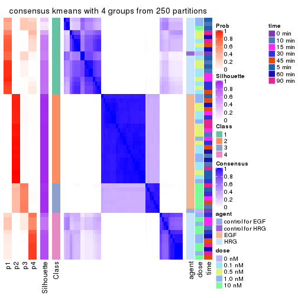</p>

</div>
<div id='tab-SD-kmeans-consensus-heatmap-4'>
<pre><code class="r">consensus_heatmap(res, k = 5)
</code></pre>

<p></p>

</div>
<div id='tab-SD-kmeans-consensus-heatmap-5'>
<pre><code class="r">consensus_heatmap(res, k = 6)
</code></pre>

<p></p>

</div>
</div>

Heatmaps for the membership of samples in all partitions to see how consistent they are:


<script>
$( function() {
	$( '#tabs-SD-kmeans-membership-heatmap' ).tabs();
} );
</script>
<div id='tabs-SD-kmeans-membership-heatmap'>
<ul>
<li><a href='#tab-SD-kmeans-membership-heatmap-1'>k = 2</a></li>
<li><a href='#tab-SD-kmeans-membership-heatmap-2'>k = 3</a></li>
<li><a href='#tab-SD-kmeans-membership-heatmap-3'>k = 4</a></li>
<li><a href='#tab-SD-kmeans-membership-heatmap-4'>k = 5</a></li>
<li><a href='#tab-SD-kmeans-membership-heatmap-5'>k = 6</a></li>
</ul>
<div id='tab-SD-kmeans-membership-heatmap-1'>
<pre><code class="r">membership_heatmap(res, k = 2)
</code></pre>

<p></p>

</div>
<div id='tab-SD-kmeans-membership-heatmap-2'>
<pre><code class="r">membership_heatmap(res, k = 3)
</code></pre>

<p></p>

</div>
<div id='tab-SD-kmeans-membership-heatmap-3'>
<pre><code class="r">membership_heatmap(res, k = 4)
</code></pre>

<p></p>

</div>
<div id='tab-SD-kmeans-membership-heatmap-4'>
<pre><code class="r">membership_heatmap(res, k = 5)
</code></pre>

<p></p>

</div>
<div id='tab-SD-kmeans-membership-heatmap-5'>
<pre><code class="r">membership_heatmap(res, k = 6)
</code></pre>

<p></p>

</div>
</div>

As soon as we have had the classes for columns, we can look for signatures
which are significantly different between classes which can be candidate marks
for certain classes. Following are the heatmaps for signatures.


Signature heatmaps where rows are scaled:


<script>
$( function() {
	$( '#tabs-SD-kmeans-get-signatures' ).tabs();
} );
</script>
<div id='tabs-SD-kmeans-get-signatures'>
<ul>
<li><a href='#tab-SD-kmeans-get-signatures-1'>k = 2</a></li>
<li><a href='#tab-SD-kmeans-get-signatures-2'>k = 3</a></li>
<li><a href='#tab-SD-kmeans-get-signatures-3'>k = 4</a></li>
<li><a href='#tab-SD-kmeans-get-signatures-4'>k = 5</a></li>
<li><a href='#tab-SD-kmeans-get-signatures-5'>k = 6</a></li>
</ul>
<div id='tab-SD-kmeans-get-signatures-1'>
<pre><code class="r">get_signatures(res, k = 2)
</code></pre>

<p></p>

</div>
<div id='tab-SD-kmeans-get-signatures-2'>
<pre><code class="r">get_signatures(res, k = 3)
</code></pre>

<p></p>

</div>
<div id='tab-SD-kmeans-get-signatures-3'>
<pre><code class="r">get_signatures(res, k = 4)
</code></pre>

<p></p>

</div>
<div id='tab-SD-kmeans-get-signatures-4'>
<pre><code class="r">get_signatures(res, k = 5)
</code></pre>

<p></p>

</div>
<div id='tab-SD-kmeans-get-signatures-5'>
<pre><code class="r">get_signatures(res, k = 6)
</code></pre>

<p></p>

</div>
</div>


Signature heatmaps where rows are not scaled:


<script>
$( function() {
	$( '#tabs-SD-kmeans-get-signatures-no-scale' ).tabs();
} );
</script>
<div id='tabs-SD-kmeans-get-signatures-no-scale'>
<ul>
<li><a href='#tab-SD-kmeans-get-signatures-no-scale-1'>k = 2</a></li>
<li><a href='#tab-SD-kmeans-get-signatures-no-scale-2'>k = 3</a></li>
<li><a href='#tab-SD-kmeans-get-signatures-no-scale-3'>k = 4</a></li>
<li><a href='#tab-SD-kmeans-get-signatures-no-scale-4'>k = 5</a></li>
<li><a href='#tab-SD-kmeans-get-signatures-no-scale-5'>k = 6</a></li>
</ul>
<div id='tab-SD-kmeans-get-signatures-no-scale-1'>
<pre><code class="r">get_signatures(res, k = 2, scale_rows = FALSE)
</code></pre>

<p></p>

</div>
<div id='tab-SD-kmeans-get-signatures-no-scale-2'>
<pre><code class="r">get_signatures(res, k = 3, scale_rows = FALSE)
</code></pre>

<p></p>

</div>
<div id='tab-SD-kmeans-get-signatures-no-scale-3'>
<pre><code class="r">get_signatures(res, k = 4, scale_rows = FALSE)
</code></pre>

<p></p>

</div>
<div id='tab-SD-kmeans-get-signatures-no-scale-4'>
<pre><code class="r">get_signatures(res, k = 5, scale_rows = FALSE)
</code></pre>

<p></p>

</div>
<div id='tab-SD-kmeans-get-signatures-no-scale-5'>
<pre><code class="r">get_signatures(res, k = 6, scale_rows = FALSE)
</code></pre>

<p></p>

</div>
</div>


Compare the overlap of signatures from different k:

```r
compare_signatures(res)
```


`get_signature()` returns a data frame invisibly. TO get the list of signatures, the function
call should be assigned to a variable explicitly. In following code, if `plot` argument is set
to `FALSE`, no heatmap is plotted while only the differential analysis is performed.

```r
# code only for demonstration
tb = get_signature(res, k = ..., plot = FALSE)
```

An example of the output of `tb` is:

```
#>   which_row         fdr    mean_1    mean_2 scaled_mean_1 scaled_mean_2 km
#> 1        38 0.042760348  8.373488  9.131774    -0.5533452     0.5164555  1
#> 2        40 0.018707592  7.106213  8.469186    -0.6173731     0.5762149  1
#> 3        55 0.019134737 10.221463 11.207825    -0.6159697     0.5749050  1
#> 4        59 0.006059896  5.921854  7.869574    -0.6899429     0.6439467  1
#> 5        60 0.018055526  8.928898 10.211722    -0.6204761     0.5791110  1
#> 6        98 0.009384629 15.714769 14.887706     0.6635654    -0.6193277  2
...
```

The columns in `tb` are:

1. `which_row`: row indices corresponding to the input matrix.
2. `fdr`: FDR for the differential test. 
3. `mean_x`: The mean value in group x.
4. `scaled_mean_x`: The mean value in group x after rows are scaled.
5. `km`: Row groups if k-means clustering is applied to rows.


UMAP plot which shows how samples are separated.


<script>
$( function() {
	$( '#tabs-SD-kmeans-dimension-reduction' ).tabs();
} );
</script>
<div id='tabs-SD-kmeans-dimension-reduction'>
<ul>
<li><a href='#tab-SD-kmeans-dimension-reduction-1'>k = 2</a></li>
<li><a href='#tab-SD-kmeans-dimension-reduction-2'>k = 3</a></li>
<li><a href='#tab-SD-kmeans-dimension-reduction-3'>k = 4</a></li>
<li><a href='#tab-SD-kmeans-dimension-reduction-4'>k = 5</a></li>
<li><a href='#tab-SD-kmeans-dimension-reduction-5'>k = 6</a></li>
</ul>
<div id='tab-SD-kmeans-dimension-reduction-1'>
<pre><code class="r">dimension_reduction(res, k = 2, method = &quot;UMAP&quot;)
</code></pre>

<p></p>

</div>
<div id='tab-SD-kmeans-dimension-reduction-2'>
<pre><code class="r">dimension_reduction(res, k = 3, method = &quot;UMAP&quot;)
</code></pre>

<p></p>

</div>
<div id='tab-SD-kmeans-dimension-reduction-3'>
<pre><code class="r">dimension_reduction(res, k = 4, method = &quot;UMAP&quot;)
</code></pre>

<p></p>

</div>
<div id='tab-SD-kmeans-dimension-reduction-4'>
<pre><code class="r">dimension_reduction(res, k = 5, method = &quot;UMAP&quot;)
</code></pre>

<p></p>

</div>
<div id='tab-SD-kmeans-dimension-reduction-5'>
<pre><code class="r">dimension_reduction(res, k = 6, method = &quot;UMAP&quot;)
</code></pre>

<p></p>

</div>
</div>


Following heatmap shows how subgroups are split when increasing `k`:

```r
collect_classes(res)
```


Test correlation between subgroups and known annotations. If the known
annotation is numeric, one-way ANOVA test is applied, and if the known
annotation is discrete, chi-squared contingency table test is applied.

```r
test_to_known_factors(res)
```

```
#>            n agent(p)  dose(p) time(p) k
#> SD:kmeans 57 2.57e-12 1.00e+00   1.000 2
#> SD:kmeans 50 2.51e-09 5.88e-03   0.929 3
#> SD:kmeans 53 1.02e-09 5.55e-07   0.997 4
#> SD:kmeans 51 2.09e-09 3.52e-06   0.733 5
#> SD:kmeans 49 1.12e-11 3.03e-07   0.614 6
```


If matrix rows can be associated to genes, consider to use `functional_enrichment(res,
...)` to perform function enrichment for the signature genes. See [this vignette](http://bioconductor.org/packages/devel/bioc/vignettes/cola/inst/doc/functional_enrichment.html) for more detailed explanations.


 

---------------------------------------------------


### SD:skmeans**


The object with results only for a single top-value method and a single partition method 
can be extracted as:

```r
res = res_list["SD", "skmeans"]
# you can also extract it by
# res = res_list["SD:skmeans"]
```

A summary of `res` and all the functions that can be applied to it:

```r
res
```

```
#> A 'ConsensusPartition' object with k = 2, 3, 4, 5, 6.
#>   On a matrix with 21163 rows and 57 columns.
#>   Top rows (1000, 2000, 3000, 4000, 5000) are extracted by 'SD' method.
#>   Subgroups are detected by 'skmeans' method.
#>   Performed in total 1250 partitions by row resampling.
#>   Best k for subgroups seems to be 2.
#> 
#> Following methods can be applied to this 'ConsensusPartition' object:
#>  [1] "cola_report"             "collect_classes"         "collect_plots"          
#>  [4] "collect_stats"           "colnames"                "compare_signatures"     
#>  [7] "consensus_heatmap"       "dimension_reduction"     "functional_enrichment"  
#> [10] "get_anno_col"            "get_anno"                "get_classes"            
#> [13] "get_consensus"           "get_matrix"              "get_membership"         
#> [16] "get_param"               "get_signatures"          "get_stats"              
#> [19] "is_best_k"               "is_stable_k"             "membership_heatmap"     
#> [22] "ncol"                    "nrow"                    "plot_ecdf"              
#> [25] "rownames"                "select_partition_number" "show"                   
#> [28] "suggest_best_k"          "test_to_known_factors"
```

`collect_plots()` function collects all the plots made from `res` for all `k` (number of partitions)
into one single page to provide an easy and fast comparison between different `k`.

```r
collect_plots(res)
```


The plots are:

- The first row: a plot of the ECDF (empirical cumulative distribution
  function) curves of the consensus matrix for each `k` and the heatmap of
  predicted classes for each `k`.
- The second row: heatmaps of the consensus matrix for each `k`.
- The third row: heatmaps of the membership matrix for each `k`.
- The fouth row: heatmaps of the signatures for each `k`.

All the plots in panels can be made by individual functions and they are
plotted later in this section.

`select_partition_number()` produces several plots showing different
statistics for choosing "optimized" `k`. There are following statistics:

- ECDF curves of the consensus matrix for each `k`;
- 1-PAC. [The PAC
  score](https://en.wikipedia.org/wiki/Consensus_clustering#Over-interpretation_potential_of_consensus_clustering)
  measures the proportion of the ambiguous subgrouping.
- Mean silhouette score.
- Concordance. The mean probability of fiting the consensus class ids in all
  partitions.
- Area increased. Denote $A_k$ as the area under the ECDF curve for current
  `k`, the area increased is defined as $A_k - A_{k-1}$.
- Rand index. The percent of pairs of samples that are both in a same cluster
  or both are not in a same cluster in the partition of k and k-1.
- Jaccard index. The ratio of pairs of samples are both in a same cluster in
  the partition of k and k-1 and the pairs of samples are both in a same
  cluster in the partition k or k-1.

The detailed explanations of these statistics can be found in [the _cola_
vignette](http://bioconductor.org/packages/devel/bioc/vignettes/cola/inst/doc/cola.html#toc_13).

Generally speaking, lower PAC score, higher mean silhouette score or higher
concordance corresponds to better partition. Rand index and Jaccard index
measure how similar the current partition is compared to partition with `k-1`.
If they are too similar, we won't accept `k` is better than `k-1`.

```r
select_partition_number(res)
```


The numeric values for all these statistics can be obtained by `get_stats()`.

```r
get_stats(res)
```

```
#>   k 1-PAC mean_silhouette concordance area_increased  Rand Jaccard
#> 2 2 1.000           1.000       1.000         0.5093 0.491   0.491
#> 3 3 0.628           0.656       0.799         0.2625 0.881   0.758
#> 4 4 0.493           0.576       0.730         0.1454 0.845   0.610
#> 5 5 0.498           0.548       0.652         0.0683 0.982   0.937
#> 6 6 0.518           0.371       0.585         0.0456 0.974   0.907
```

`suggest_best_k()` suggests the best $k$ based on these statistics. The rules are as follows:

- All $k$ with Jaccard index larger than 0.95 are removed because increasing
  $k$ does not provide enough extra information. If all $k$ are removed, it is
  marked as no subgroup is detected.
- For all $k$ with 1-PAC score larger than 0.9, the maximal $k$ is taken as
  the best $k$, and other $k$ are marked as optional $k$.
- If it does not fit the second rule. The $k$ with the maximal vote of the
  highest 1-PAC score, highest mean silhouette, and highest concordance is
  taken as the best $k$.

```r
suggest_best_k(res)
```

```
#> [1] 2
```


Following shows the table of the partitions (You need to click the **show/hide
code output** link to see it). The membership matrix (columns with name `p*`)
is inferred by
[`clue::cl_consensus()`](https://www.rdocumentation.org/link/cl_consensus?package=clue)
function with the `SE` method. Basically the value in the membership matrix
represents the probability to belong to a certain group. The finall class
label for an item is determined with the group with highest probability it
belongs to.

In `get_classes()` function, the entropy is calculated from the membership
matrix and the silhouette score is calculated from the consensus matrix.


<script>
$( function() {
	$( '#tabs-SD-skmeans-get-classes' ).tabs();
} );
</script>
<div id='tabs-SD-skmeans-get-classes'>
<ul>
<li><a href='#tab-SD-skmeans-get-classes-1'>k = 2</a></li>
<li><a href='#tab-SD-skmeans-get-classes-2'>k = 3</a></li>
<li><a href='#tab-SD-skmeans-get-classes-3'>k = 4</a></li>
<li><a href='#tab-SD-skmeans-get-classes-4'>k = 5</a></li>
<li><a href='#tab-SD-skmeans-get-classes-5'>k = 6</a></li>
</ul>

<div id='tab-SD-skmeans-get-classes-1'>
<p><a id='tab-SD-skmeans-get-classes-1-a' style='color:#0366d6' href='#'>show/hide code output</a></p>
<pre><code class="r">cbind(get_classes(res, k = 2), get_membership(res, k = 2))
</code></pre>

<pre><code>#&gt;           class entropy silhouette    p1    p2
#&gt; GSM148516     2  0.0000      1.000 0.000 1.000
#&gt; GSM148517     1  0.0000      1.000 1.000 0.000
#&gt; GSM148518     2  0.0000      1.000 0.000 1.000
#&gt; GSM148519     2  0.0000      1.000 0.000 1.000
#&gt; GSM148520     2  0.0000      1.000 0.000 1.000
#&gt; GSM148521     2  0.0000      1.000 0.000 1.000
#&gt; GSM148522     2  0.0000      1.000 0.000 1.000
#&gt; GSM148523     2  0.0000      1.000 0.000 1.000
#&gt; GSM148524     2  0.0000      1.000 0.000 1.000
#&gt; GSM148525     2  0.0000      1.000 0.000 1.000
#&gt; GSM148526     2  0.0000      1.000 0.000 1.000
#&gt; GSM148527     2  0.0000      1.000 0.000 1.000
#&gt; GSM148528     2  0.0000      1.000 0.000 1.000
#&gt; GSM148529     2  0.0000      1.000 0.000 1.000
#&gt; GSM148530     2  0.0000      1.000 0.000 1.000
#&gt; GSM148531     2  0.0000      1.000 0.000 1.000
#&gt; GSM148532     2  0.0000      1.000 0.000 1.000
#&gt; GSM148533     2  0.0000      1.000 0.000 1.000
#&gt; GSM148534     2  0.0000      1.000 0.000 1.000
#&gt; GSM148535     2  0.0000      1.000 0.000 1.000
#&gt; GSM148536     2  0.0000      1.000 0.000 1.000
#&gt; GSM148537     2  0.0000      1.000 0.000 1.000
#&gt; GSM148538     2  0.0000      1.000 0.000 1.000
#&gt; GSM148539     2  0.0000      1.000 0.000 1.000
#&gt; GSM148540     2  0.0000      1.000 0.000 1.000
#&gt; GSM148541     2  0.0000      1.000 0.000 1.000
#&gt; GSM148542     2  0.0000      1.000 0.000 1.000
#&gt; GSM148543     2  0.0000      1.000 0.000 1.000
#&gt; GSM148544     2  0.0376      0.996 0.004 0.996
#&gt; GSM148545     1  0.0000      1.000 1.000 0.000
#&gt; GSM148546     1  0.0000      1.000 1.000 0.000
#&gt; GSM148547     1  0.0000      1.000 1.000 0.000
#&gt; GSM148548     1  0.0000      1.000 1.000 0.000
#&gt; GSM148549     1  0.0000      1.000 1.000 0.000
#&gt; GSM148550     1  0.0000      1.000 1.000 0.000
#&gt; GSM148551     1  0.0000      1.000 1.000 0.000
#&gt; GSM148552     1  0.0000      1.000 1.000 0.000
#&gt; GSM148553     1  0.0000      1.000 1.000 0.000
#&gt; GSM148554     1  0.0000      1.000 1.000 0.000
#&gt; GSM148555     1  0.0000      1.000 1.000 0.000
#&gt; GSM148556     1  0.0000      1.000 1.000 0.000
#&gt; GSM148557     1  0.0000      1.000 1.000 0.000
#&gt; GSM148558     1  0.0000      1.000 1.000 0.000
#&gt; GSM148559     1  0.0000      1.000 1.000 0.000
#&gt; GSM148560     1  0.0000      1.000 1.000 0.000
#&gt; GSM148561     1  0.0000      1.000 1.000 0.000
#&gt; GSM148562     1  0.0000      1.000 1.000 0.000
#&gt; GSM148563     1  0.0000      1.000 1.000 0.000
#&gt; GSM148564     1  0.0000      1.000 1.000 0.000
#&gt; GSM148565     1  0.0000      1.000 1.000 0.000
#&gt; GSM148566     1  0.0000      1.000 1.000 0.000
#&gt; GSM148567     1  0.0000      1.000 1.000 0.000
#&gt; GSM148568     1  0.0000      1.000 1.000 0.000
#&gt; GSM148569     1  0.0000      1.000 1.000 0.000
#&gt; GSM148570     1  0.0000      1.000 1.000 0.000
#&gt; GSM148571     1  0.0000      1.000 1.000 0.000
#&gt; GSM148572     1  0.0000      1.000 1.000 0.000
</code></pre>

<script>
$('#tab-SD-skmeans-get-classes-1-a').parent().next().next().hide();
$('#tab-SD-skmeans-get-classes-1-a').click(function(){
  $('#tab-SD-skmeans-get-classes-1-a').parent().next().next().toggle();
  return(false);
});
</script>
</div>

<div id='tab-SD-skmeans-get-classes-2'>
<p><a id='tab-SD-skmeans-get-classes-2-a' style='color:#0366d6' href='#'>show/hide code output</a></p>
<pre><code class="r">cbind(get_classes(res, k = 3), get_membership(res, k = 3))
</code></pre>

<pre><code>#&gt;           class entropy silhouette    p1    p2    p3
#&gt; GSM148516     2  0.4874     0.8673 0.028 0.828 0.144
#&gt; GSM148517     3  0.5178     0.6929 0.256 0.000 0.744
#&gt; GSM148518     2  0.0747     0.9378 0.000 0.984 0.016
#&gt; GSM148519     2  0.0892     0.9377 0.000 0.980 0.020
#&gt; GSM148520     2  0.1031     0.9383 0.000 0.976 0.024
#&gt; GSM148521     2  0.0592     0.9365 0.000 0.988 0.012
#&gt; GSM148522     2  0.0892     0.9381 0.000 0.980 0.020
#&gt; GSM148523     2  0.0592     0.9367 0.000 0.988 0.012
#&gt; GSM148524     2  0.0592     0.9380 0.000 0.988 0.012
#&gt; GSM148525     2  0.1411     0.9350 0.000 0.964 0.036
#&gt; GSM148526     2  0.1411     0.9371 0.000 0.964 0.036
#&gt; GSM148527     2  0.0747     0.9379 0.000 0.984 0.016
#&gt; GSM148528     2  0.0592     0.9369 0.000 0.988 0.012
#&gt; GSM148529     2  0.0237     0.9363 0.000 0.996 0.004
#&gt; GSM148530     2  0.1031     0.9375 0.000 0.976 0.024
#&gt; GSM148531     2  0.1031     0.9370 0.000 0.976 0.024
#&gt; GSM148532     2  0.2066     0.9288 0.000 0.940 0.060
#&gt; GSM148533     2  0.1411     0.9368 0.000 0.964 0.036
#&gt; GSM148534     2  0.0747     0.9380 0.000 0.984 0.016
#&gt; GSM148535     2  0.1031     0.9379 0.000 0.976 0.024
#&gt; GSM148536     2  0.0747     0.9378 0.000 0.984 0.016
#&gt; GSM148537     2  0.1163     0.9380 0.000 0.972 0.028
#&gt; GSM148538     2  0.0892     0.9369 0.000 0.980 0.020
#&gt; GSM148539     2  0.3816     0.8877 0.000 0.852 0.148
#&gt; GSM148540     2  0.4514     0.8721 0.012 0.832 0.156
#&gt; GSM148541     2  0.4748     0.8727 0.024 0.832 0.144
#&gt; GSM148542     2  0.8933     0.4918 0.168 0.556 0.276
#&gt; GSM148543     2  0.5435     0.8407 0.048 0.808 0.144
#&gt; GSM148544     2  0.9440     0.2779 0.308 0.488 0.204
#&gt; GSM148545     3  0.5138     0.7080 0.252 0.000 0.748
#&gt; GSM148546     3  0.4504     0.7128 0.196 0.000 0.804
#&gt; GSM148547     3  0.4555     0.7160 0.200 0.000 0.800
#&gt; GSM148548     3  0.6180     0.3932 0.416 0.000 0.584
#&gt; GSM148549     3  0.6235     0.3424 0.436 0.000 0.564
#&gt; GSM148550     1  0.6302    -0.0652 0.520 0.000 0.480
#&gt; GSM148551     1  0.6286    -0.0174 0.536 0.000 0.464
#&gt; GSM148552     3  0.5020     0.6957 0.192 0.012 0.796
#&gt; GSM148553     3  0.4702     0.6740 0.212 0.000 0.788
#&gt; GSM148554     3  0.5859     0.5926 0.344 0.000 0.656
#&gt; GSM148555     1  0.6291    -0.0332 0.532 0.000 0.468
#&gt; GSM148556     1  0.6204     0.1144 0.576 0.000 0.424
#&gt; GSM148557     1  0.5760     0.3620 0.672 0.000 0.328
#&gt; GSM148558     1  0.5397     0.4437 0.720 0.000 0.280
#&gt; GSM148559     3  0.6235     0.3315 0.436 0.000 0.564
#&gt; GSM148560     1  0.6308    -0.2136 0.508 0.000 0.492
#&gt; GSM148561     1  0.5363     0.4626 0.724 0.000 0.276
#&gt; GSM148562     1  0.3619     0.6009 0.864 0.000 0.136
#&gt; GSM148563     1  0.2165     0.6219 0.936 0.000 0.064
#&gt; GSM148564     1  0.2959     0.6126 0.900 0.000 0.100
#&gt; GSM148565     1  0.1753     0.6204 0.952 0.000 0.048
#&gt; GSM148566     1  0.6299    -0.1596 0.524 0.000 0.476
#&gt; GSM148567     1  0.5363     0.4305 0.724 0.000 0.276
#&gt; GSM148568     1  0.4702     0.5243 0.788 0.000 0.212
#&gt; GSM148569     1  0.3412     0.6113 0.876 0.000 0.124
#&gt; GSM148570     1  0.1289     0.6160 0.968 0.000 0.032
#&gt; GSM148571     1  0.1643     0.6183 0.956 0.000 0.044
#&gt; GSM148572     1  0.1753     0.6213 0.952 0.000 0.048
</code></pre>

<script>
$('#tab-SD-skmeans-get-classes-2-a').parent().next().next().hide();
$('#tab-SD-skmeans-get-classes-2-a').click(function(){
  $('#tab-SD-skmeans-get-classes-2-a').parent().next().next().toggle();
  return(false);
});
</script>
</div>

<div id='tab-SD-skmeans-get-classes-3'>
<p><a id='tab-SD-skmeans-get-classes-3-a' style='color:#0366d6' href='#'>show/hide code output</a></p>
<pre><code class="r">cbind(get_classes(res, k = 4), get_membership(res, k = 4))
</code></pre>

<pre><code>#&gt;           class entropy silhouette    p1    p2    p3    p4
#&gt; GSM148516     3   0.601     0.6241 0.044 0.320 0.628 0.008
#&gt; GSM148517     1   0.539     0.5799 0.736 0.000 0.092 0.172
#&gt; GSM148518     2   0.385     0.7541 0.008 0.800 0.192 0.000
#&gt; GSM148519     2   0.300     0.7953 0.004 0.864 0.132 0.000
#&gt; GSM148520     2   0.375     0.7613 0.004 0.800 0.196 0.000
#&gt; GSM148521     2   0.331     0.7684 0.000 0.828 0.172 0.000
#&gt; GSM148522     2   0.276     0.7970 0.000 0.872 0.128 0.000
#&gt; GSM148523     2   0.363     0.7700 0.004 0.812 0.184 0.000
#&gt; GSM148524     2   0.302     0.7986 0.000 0.852 0.148 0.000
#&gt; GSM148525     2   0.398     0.6565 0.000 0.760 0.240 0.000
#&gt; GSM148526     2   0.387     0.7432 0.004 0.788 0.208 0.000
#&gt; GSM148527     2   0.331     0.7817 0.004 0.840 0.156 0.000
#&gt; GSM148528     2   0.372     0.7875 0.008 0.812 0.180 0.000
#&gt; GSM148529     2   0.358     0.7731 0.004 0.816 0.180 0.000
#&gt; GSM148530     2   0.331     0.7889 0.004 0.840 0.156 0.000
#&gt; GSM148531     2   0.409     0.7467 0.004 0.764 0.232 0.000
#&gt; GSM148532     2   0.468     0.5739 0.004 0.680 0.316 0.000
#&gt; GSM148533     2   0.358     0.7824 0.004 0.816 0.180 0.000
#&gt; GSM148534     2   0.367     0.7704 0.004 0.808 0.188 0.000
#&gt; GSM148535     2   0.326     0.7796 0.004 0.844 0.152 0.000
#&gt; GSM148536     2   0.354     0.7640 0.004 0.820 0.176 0.000
#&gt; GSM148537     2   0.294     0.7902 0.004 0.868 0.128 0.000
#&gt; GSM148538     2   0.297     0.7796 0.000 0.856 0.144 0.000
#&gt; GSM148539     3   0.531     0.4773 0.012 0.412 0.576 0.000
#&gt; GSM148540     3   0.661     0.5550 0.040 0.360 0.572 0.028
#&gt; GSM148541     3   0.583     0.6268 0.020 0.344 0.620 0.016
#&gt; GSM148542     3   0.752     0.5986 0.088 0.284 0.576 0.052
#&gt; GSM148543     3   0.610     0.6154 0.024 0.340 0.612 0.024
#&gt; GSM148544     3   0.781     0.5421 0.024 0.248 0.540 0.188
#&gt; GSM148545     1   0.426     0.6043 0.820 0.000 0.068 0.112
#&gt; GSM148546     1   0.373     0.6040 0.848 0.000 0.044 0.108
#&gt; GSM148547     1   0.374     0.6100 0.852 0.000 0.060 0.088
#&gt; GSM148548     1   0.619     0.4573 0.644 0.000 0.096 0.260
#&gt; GSM148549     1   0.682     0.3635 0.564 0.000 0.124 0.312
#&gt; GSM148550     1   0.644     0.1460 0.492 0.000 0.068 0.440
#&gt; GSM148551     1   0.692     0.0879 0.464 0.000 0.108 0.428
#&gt; GSM148552     1   0.428     0.6008 0.832 0.008 0.068 0.092
#&gt; GSM148553     1   0.470     0.5984 0.792 0.000 0.084 0.124
#&gt; GSM148554     1   0.517     0.5567 0.744 0.000 0.068 0.188
#&gt; GSM148555     4   0.640    -0.0376 0.464 0.000 0.064 0.472
#&gt; GSM148556     4   0.664    -0.0298 0.424 0.000 0.084 0.492
#&gt; GSM148557     4   0.578     0.2040 0.380 0.000 0.036 0.584
#&gt; GSM148558     4   0.586     0.3088 0.340 0.000 0.048 0.612
#&gt; GSM148559     1   0.687     0.3675 0.580 0.008 0.104 0.308
#&gt; GSM148560     1   0.663     0.2610 0.544 0.000 0.092 0.364
#&gt; GSM148561     4   0.619     0.4593 0.244 0.000 0.104 0.652
#&gt; GSM148562     4   0.470     0.6129 0.164 0.000 0.056 0.780
#&gt; GSM148563     4   0.337     0.6488 0.080 0.000 0.048 0.872
#&gt; GSM148564     4   0.490     0.6002 0.156 0.000 0.072 0.772
#&gt; GSM148565     4   0.323     0.6533 0.072 0.000 0.048 0.880
#&gt; GSM148566     1   0.689     0.0595 0.452 0.000 0.104 0.444
#&gt; GSM148567     4   0.614     0.4098 0.288 0.000 0.080 0.632
#&gt; GSM148568     4   0.556     0.5088 0.240 0.000 0.064 0.696
#&gt; GSM148569     4   0.331     0.6458 0.104 0.000 0.028 0.868
#&gt; GSM148570     4   0.295     0.6548 0.088 0.000 0.024 0.888
#&gt; GSM148571     4   0.191     0.6516 0.040 0.000 0.020 0.940
#&gt; GSM148572     4   0.194     0.6547 0.052 0.000 0.012 0.936
</code></pre>

<script>
$('#tab-SD-skmeans-get-classes-3-a').parent().next().next().hide();
$('#tab-SD-skmeans-get-classes-3-a').click(function(){
  $('#tab-SD-skmeans-get-classes-3-a').parent().next().next().toggle();
  return(false);
});
</script>
</div>

<div id='tab-SD-skmeans-get-classes-4'>
<p><a id='tab-SD-skmeans-get-classes-4-a' style='color:#0366d6' href='#'>show/hide code output</a></p>
<pre><code class="r">cbind(get_classes(res, k = 5), get_membership(res, k = 5))
</code></pre>

<pre><code>#&gt;           class entropy silhouette    p1    p2    p3    p4 p5
#&gt; GSM148516     3   0.563     0.6378 0.024 0.172 0.700 0.008 NA
#&gt; GSM148517     1   0.575     0.5019 0.668 0.000 0.020 0.136 NA
#&gt; GSM148518     2   0.451     0.7252 0.000 0.740 0.188 0.000 NA
#&gt; GSM148519     2   0.361     0.7527 0.000 0.824 0.112 0.000 NA
#&gt; GSM148520     2   0.523     0.6876 0.000 0.676 0.208 0.000 NA
#&gt; GSM148521     2   0.500     0.7136 0.000 0.700 0.196 0.000 NA
#&gt; GSM148522     2   0.389     0.7515 0.000 0.804 0.120 0.000 NA
#&gt; GSM148523     2   0.471     0.7198 0.004 0.736 0.180 0.000 NA
#&gt; GSM148524     2   0.463     0.7433 0.000 0.736 0.176 0.000 NA
#&gt; GSM148525     2   0.546     0.5791 0.000 0.644 0.256 0.004 NA
#&gt; GSM148526     2   0.479     0.6567 0.000 0.720 0.188 0.000 NA
#&gt; GSM148527     2   0.457     0.7366 0.000 0.748 0.148 0.000 NA
#&gt; GSM148528     2   0.415     0.7411 0.000 0.780 0.144 0.000 NA
#&gt; GSM148529     2   0.545     0.6973 0.004 0.668 0.200 0.000 NA
#&gt; GSM148530     2   0.510     0.7071 0.000 0.692 0.192 0.000 NA
#&gt; GSM148531     2   0.538     0.6964 0.000 0.656 0.224 0.000 NA
#&gt; GSM148532     2   0.579     0.5569 0.000 0.580 0.300 0.000 NA
#&gt; GSM148533     2   0.418     0.7362 0.000 0.776 0.152 0.000 NA
#&gt; GSM148534     2   0.439     0.7307 0.000 0.756 0.168 0.000 NA
#&gt; GSM148535     2   0.439     0.7262 0.000 0.764 0.140 0.000 NA
#&gt; GSM148536     2   0.475     0.7071 0.000 0.724 0.184 0.000 NA
#&gt; GSM148537     2   0.367     0.7478 0.000 0.812 0.140 0.000 NA
#&gt; GSM148538     2   0.459     0.7343 0.004 0.756 0.140 0.000 NA
#&gt; GSM148539     3   0.619     0.4714 0.024 0.316 0.576 0.004 NA
#&gt; GSM148540     3   0.629     0.6148 0.012 0.216 0.624 0.016 NA
#&gt; GSM148541     3   0.559     0.6617 0.020 0.164 0.696 0.004 NA
#&gt; GSM148542     3   0.750     0.6218 0.068 0.124 0.592 0.056 NA
#&gt; GSM148543     3   0.578     0.5962 0.012 0.212 0.656 0.004 NA
#&gt; GSM148544     3   0.775     0.5771 0.036 0.120 0.564 0.140 NA
#&gt; GSM148545     1   0.482     0.5368 0.744 0.000 0.016 0.072 NA
#&gt; GSM148546     1   0.412     0.5557 0.808 0.000 0.016 0.072 NA
#&gt; GSM148547     1   0.403     0.5557 0.812 0.000 0.012 0.076 NA
#&gt; GSM148548     1   0.630     0.4227 0.584 0.000 0.012 0.204 NA
#&gt; GSM148549     1   0.641     0.3690 0.564 0.000 0.012 0.236 NA
#&gt; GSM148550     1   0.679     0.2753 0.484 0.000 0.012 0.292 NA
#&gt; GSM148551     1   0.669     0.1314 0.452 0.000 0.012 0.372 NA
#&gt; GSM148552     1   0.506     0.5326 0.748 0.004 0.024 0.088 NA
#&gt; GSM148553     1   0.553     0.5303 0.712 0.004 0.032 0.100 NA
#&gt; GSM148554     1   0.575     0.4957 0.656 0.000 0.012 0.164 NA
#&gt; GSM148555     1   0.718     0.1529 0.404 0.000 0.024 0.352 NA
#&gt; GSM148556     4   0.668    -0.0422 0.400 0.000 0.008 0.416 NA
#&gt; GSM148557     4   0.668     0.2179 0.280 0.000 0.020 0.528 NA
#&gt; GSM148558     4   0.612     0.3917 0.228 0.000 0.012 0.604 NA
#&gt; GSM148559     1   0.715     0.3630 0.496 0.004 0.028 0.240 NA
#&gt; GSM148560     1   0.717     0.2310 0.444 0.000 0.024 0.284 NA
#&gt; GSM148561     4   0.661     0.3797 0.132 0.000 0.028 0.536 NA
#&gt; GSM148562     4   0.617     0.5063 0.156 0.000 0.032 0.636 NA
#&gt; GSM148563     4   0.391     0.6103 0.084 0.000 0.004 0.812 NA
#&gt; GSM148564     4   0.482     0.5915 0.092 0.000 0.024 0.760 NA
#&gt; GSM148565     4   0.388     0.6133 0.064 0.000 0.020 0.828 NA
#&gt; GSM148566     1   0.737     0.1462 0.376 0.000 0.028 0.328 NA
#&gt; GSM148567     4   0.715     0.2670 0.220 0.004 0.028 0.496 NA
#&gt; GSM148568     4   0.616     0.4573 0.168 0.000 0.016 0.612 NA
#&gt; GSM148569     4   0.519     0.5717 0.108 0.000 0.012 0.712 NA
#&gt; GSM148570     4   0.309     0.6252 0.064 0.000 0.004 0.868 NA
#&gt; GSM148571     4   0.223     0.6265 0.040 0.000 0.000 0.912 NA
#&gt; GSM148572     4   0.327     0.6188 0.056 0.000 0.000 0.848 NA
</code></pre>

<script>
$('#tab-SD-skmeans-get-classes-4-a').parent().next().next().hide();
$('#tab-SD-skmeans-get-classes-4-a').click(function(){
  $('#tab-SD-skmeans-get-classes-4-a').parent().next().next().toggle();
  return(false);
});
</script>
</div>

<div id='tab-SD-skmeans-get-classes-5'>
<p><a id='tab-SD-skmeans-get-classes-5-a' style='color:#0366d6' href='#'>show/hide code output</a></p>
<pre><code class="r">cbind(get_classes(res, k = 6), get_membership(res, k = 6))
</code></pre>

<pre><code>#&gt;           class entropy silhouette    p1    p2    p3    p4    p5 p6
#&gt; GSM148516     3   0.672     0.5440 0.012 0.144 0.540 0.004 0.064 NA
#&gt; GSM148517     1   0.533     0.3165 0.700 0.000 0.028 0.112 0.136 NA
#&gt; GSM148518     2   0.447     0.6260 0.000 0.704 0.108 0.000 0.000 NA
#&gt; GSM148519     2   0.340     0.6642 0.000 0.820 0.052 0.000 0.008 NA
#&gt; GSM148520     2   0.547     0.5552 0.000 0.480 0.108 0.000 0.004 NA
#&gt; GSM148521     2   0.540     0.5758 0.000 0.584 0.108 0.000 0.012 NA
#&gt; GSM148522     2   0.425     0.6447 0.000 0.760 0.092 0.000 0.016 NA
#&gt; GSM148523     2   0.478     0.6228 0.008 0.688 0.040 0.000 0.024 NA
#&gt; GSM148524     2   0.420     0.6656 0.004 0.752 0.052 0.000 0.012 NA
#&gt; GSM148525     2   0.614     0.5005 0.000 0.560 0.156 0.004 0.036 NA
#&gt; GSM148526     2   0.525     0.5406 0.000 0.640 0.184 0.004 0.004 NA
#&gt; GSM148527     2   0.531     0.6129 0.004 0.624 0.116 0.000 0.008 NA
#&gt; GSM148528     2   0.477     0.6260 0.000 0.652 0.100 0.000 0.000 NA
#&gt; GSM148529     2   0.536     0.6090 0.004 0.604 0.084 0.000 0.016 NA
#&gt; GSM148530     2   0.565     0.5977 0.000 0.616 0.096 0.000 0.048 NA
#&gt; GSM148531     2   0.606     0.5419 0.000 0.524 0.120 0.000 0.040 NA
#&gt; GSM148532     2   0.614     0.4860 0.000 0.524 0.180 0.000 0.028 NA
#&gt; GSM148533     2   0.540     0.6052 0.004 0.648 0.100 0.000 0.028 NA
#&gt; GSM148534     2   0.505     0.6288 0.000 0.636 0.076 0.000 0.016 NA
#&gt; GSM148535     2   0.488     0.6031 0.000 0.696 0.080 0.000 0.028 NA
#&gt; GSM148536     2   0.531     0.5882 0.004 0.540 0.064 0.000 0.012 NA
#&gt; GSM148537     2   0.488     0.5998 0.004 0.696 0.144 0.000 0.008 NA
#&gt; GSM148538     2   0.506     0.6230 0.000 0.648 0.052 0.000 0.036 NA
#&gt; GSM148539     3   0.694     0.4634 0.024 0.252 0.520 0.004 0.060 NA
#&gt; GSM148540     3   0.665     0.5552 0.028 0.132 0.600 0.024 0.036 NA
#&gt; GSM148541     3   0.577     0.5798 0.012 0.140 0.664 0.008 0.036 NA
#&gt; GSM148542     3   0.789     0.5281 0.036 0.140 0.484 0.028 0.112 NA
#&gt; GSM148543     3   0.632     0.5662 0.028 0.128 0.632 0.008 0.052 NA
#&gt; GSM148544     3   0.803     0.5159 0.052 0.084 0.516 0.088 0.096 NA
#&gt; GSM148545     1   0.418     0.3243 0.800 0.000 0.016 0.056 0.088 NA
#&gt; GSM148546     1   0.470     0.2286 0.732 0.000 0.012 0.060 0.172 NA
#&gt; GSM148547     1   0.449     0.2639 0.764 0.000 0.020 0.048 0.140 NA
#&gt; GSM148548     1   0.663    -0.1410 0.444 0.000 0.024 0.116 0.380 NA
#&gt; GSM148549     1   0.664    -0.3628 0.420 0.000 0.020 0.156 0.380 NA
#&gt; GSM148550     1   0.689    -0.4532 0.388 0.000 0.020 0.244 0.328 NA
#&gt; GSM148551     5   0.720     0.0000 0.312 0.000 0.028 0.292 0.340 NA
#&gt; GSM148552     1   0.605     0.3005 0.648 0.012 0.024 0.044 0.188 NA
#&gt; GSM148553     1   0.658     0.2766 0.576 0.000 0.036 0.084 0.228 NA
#&gt; GSM148554     1   0.635    -0.0283 0.572 0.000 0.012 0.132 0.228 NA
#&gt; GSM148555     1   0.726    -0.2659 0.372 0.000 0.032 0.208 0.348 NA
#&gt; GSM148556     1   0.713    -0.5185 0.348 0.000 0.020 0.320 0.280 NA
#&gt; GSM148557     4   0.671    -0.3437 0.276 0.000 0.004 0.440 0.244 NA
#&gt; GSM148558     4   0.638    -0.2782 0.268 0.000 0.012 0.488 0.220 NA
#&gt; GSM148559     1   0.715     0.2536 0.472 0.000 0.024 0.144 0.280 NA
#&gt; GSM148560     1   0.739     0.1958 0.420 0.000 0.040 0.192 0.296 NA
#&gt; GSM148561     4   0.754     0.3162 0.116 0.004 0.072 0.428 0.324 NA
#&gt; GSM148562     4   0.613     0.4197 0.104 0.000 0.036 0.624 0.196 NA
#&gt; GSM148563     4   0.507     0.4843 0.068 0.000 0.024 0.716 0.164 NA
#&gt; GSM148564     4   0.502     0.4793 0.064 0.000 0.020 0.708 0.184 NA
#&gt; GSM148565     4   0.470     0.4932 0.052 0.000 0.032 0.768 0.100 NA
#&gt; GSM148566     1   0.753     0.1783 0.380 0.000 0.044 0.208 0.316 NA
#&gt; GSM148567     4   0.728     0.3233 0.152 0.000 0.056 0.468 0.276 NA
#&gt; GSM148568     4   0.714     0.3954 0.124 0.000 0.060 0.524 0.228 NA
#&gt; GSM148569     4   0.556     0.4745 0.060 0.004 0.044 0.704 0.140 NA
#&gt; GSM148570     4   0.358     0.5252 0.052 0.000 0.012 0.828 0.096 NA
#&gt; GSM148571     4   0.359     0.5050 0.048 0.000 0.012 0.832 0.088 NA
#&gt; GSM148572     4   0.360     0.5196 0.056 0.000 0.024 0.840 0.060 NA
</code></pre>

<script>
$('#tab-SD-skmeans-get-classes-5-a').parent().next().next().hide();
$('#tab-SD-skmeans-get-classes-5-a').click(function(){
  $('#tab-SD-skmeans-get-classes-5-a').parent().next().next().toggle();
  return(false);
});
</script>
</div>
</div>

Heatmaps for the consensus matrix. It visualizes the probability of two
samples to be in a same group.


<script>
$( function() {
	$( '#tabs-SD-skmeans-consensus-heatmap' ).tabs();
} );
</script>
<div id='tabs-SD-skmeans-consensus-heatmap'>
<ul>
<li><a href='#tab-SD-skmeans-consensus-heatmap-1'>k = 2</a></li>
<li><a href='#tab-SD-skmeans-consensus-heatmap-2'>k = 3</a></li>
<li><a href='#tab-SD-skmeans-consensus-heatmap-3'>k = 4</a></li>
<li><a href='#tab-SD-skmeans-consensus-heatmap-4'>k = 5</a></li>
<li><a href='#tab-SD-skmeans-consensus-heatmap-5'>k = 6</a></li>
</ul>
<div id='tab-SD-skmeans-consensus-heatmap-1'>
<pre><code class="r">consensus_heatmap(res, k = 2)
</code></pre>

<p></p>

</div>
<div id='tab-SD-skmeans-consensus-heatmap-2'>
<pre><code class="r">consensus_heatmap(res, k = 3)
</code></pre>

<p></p>

</div>
<div id='tab-SD-skmeans-consensus-heatmap-3'>
<pre><code class="r">consensus_heatmap(res, k = 4)
</code></pre>

<p></p>

</div>
<div id='tab-SD-skmeans-consensus-heatmap-4'>
<pre><code class="r">consensus_heatmap(res, k = 5)
</code></pre>

<p></p>

</div>
<div id='tab-SD-skmeans-consensus-heatmap-5'>
<pre><code class="r">consensus_heatmap(res, k = 6)
</code></pre>

<p></p>

</div>
</div>

Heatmaps for the membership of samples in all partitions to see how consistent they are:


<script>
$( function() {
	$( '#tabs-SD-skmeans-membership-heatmap' ).tabs();
} );
</script>
<div id='tabs-SD-skmeans-membership-heatmap'>
<ul>
<li><a href='#tab-SD-skmeans-membership-heatmap-1'>k = 2</a></li>
<li><a href='#tab-SD-skmeans-membership-heatmap-2'>k = 3</a></li>
<li><a href='#tab-SD-skmeans-membership-heatmap-3'>k = 4</a></li>
<li><a href='#tab-SD-skmeans-membership-heatmap-4'>k = 5</a></li>
<li><a href='#tab-SD-skmeans-membership-heatmap-5'>k = 6</a></li>
</ul>
<div id='tab-SD-skmeans-membership-heatmap-1'>
<pre><code class="r">membership_heatmap(res, k = 2)
</code></pre>

<p></p>

</div>
<div id='tab-SD-skmeans-membership-heatmap-2'>
<pre><code class="r">membership_heatmap(res, k = 3)
</code></pre>

<p></p>

</div>
<div id='tab-SD-skmeans-membership-heatmap-3'>
<pre><code class="r">membership_heatmap(res, k = 4)
</code></pre>

<p></p>

</div>
<div id='tab-SD-skmeans-membership-heatmap-4'>
<pre><code class="r">membership_heatmap(res, k = 5)
</code></pre>

<p></p>

</div>
<div id='tab-SD-skmeans-membership-heatmap-5'>
<pre><code class="r">membership_heatmap(res, k = 6)
</code></pre>

<p></p>

</div>
</div>

As soon as we have had the classes for columns, we can look for signatures
which are significantly different between classes which can be candidate marks
for certain classes. Following are the heatmaps for signatures.


Signature heatmaps where rows are scaled:


<script>
$( function() {
	$( '#tabs-SD-skmeans-get-signatures' ).tabs();
} );
</script>
<div id='tabs-SD-skmeans-get-signatures'>
<ul>
<li><a href='#tab-SD-skmeans-get-signatures-1'>k = 2</a></li>
<li><a href='#tab-SD-skmeans-get-signatures-2'>k = 3</a></li>
<li><a href='#tab-SD-skmeans-get-signatures-3'>k = 4</a></li>
<li><a href='#tab-SD-skmeans-get-signatures-4'>k = 5</a></li>
<li><a href='#tab-SD-skmeans-get-signatures-5'>k = 6</a></li>
</ul>
<div id='tab-SD-skmeans-get-signatures-1'>
<pre><code class="r">get_signatures(res, k = 2)
</code></pre>

<p></p>

</div>
<div id='tab-SD-skmeans-get-signatures-2'>
<pre><code class="r">get_signatures(res, k = 3)
</code></pre>

<p></p>

</div>
<div id='tab-SD-skmeans-get-signatures-3'>
<pre><code class="r">get_signatures(res, k = 4)
</code></pre>

<p></p>

</div>
<div id='tab-SD-skmeans-get-signatures-4'>
<pre><code class="r">get_signatures(res, k = 5)
</code></pre>

<p></p>

</div>
<div id='tab-SD-skmeans-get-signatures-5'>
<pre><code class="r">get_signatures(res, k = 6)
</code></pre>

<p></p>

</div>
</div>


Signature heatmaps where rows are not scaled:


<script>
$( function() {
	$( '#tabs-SD-skmeans-get-signatures-no-scale' ).tabs();
} );
</script>
<div id='tabs-SD-skmeans-get-signatures-no-scale'>
<ul>
<li><a href='#tab-SD-skmeans-get-signatures-no-scale-1'>k = 2</a></li>
<li><a href='#tab-SD-skmeans-get-signatures-no-scale-2'>k = 3</a></li>
<li><a href='#tab-SD-skmeans-get-signatures-no-scale-3'>k = 4</a></li>
<li><a href='#tab-SD-skmeans-get-signatures-no-scale-4'>k = 5</a></li>
<li><a href='#tab-SD-skmeans-get-signatures-no-scale-5'>k = 6</a></li>
</ul>
<div id='tab-SD-skmeans-get-signatures-no-scale-1'>
<pre><code class="r">get_signatures(res, k = 2, scale_rows = FALSE)
</code></pre>

<p></p>

</div>
<div id='tab-SD-skmeans-get-signatures-no-scale-2'>
<pre><code class="r">get_signatures(res, k = 3, scale_rows = FALSE)
</code></pre>

<p></p>

</div>
<div id='tab-SD-skmeans-get-signatures-no-scale-3'>
<pre><code class="r">get_signatures(res, k = 4, scale_rows = FALSE)
</code></pre>

<p></p>

</div>
<div id='tab-SD-skmeans-get-signatures-no-scale-4'>
<pre><code class="r">get_signatures(res, k = 5, scale_rows = FALSE)
</code></pre>

<p></p>

</div>
<div id='tab-SD-skmeans-get-signatures-no-scale-5'>
<pre><code class="r">get_signatures(res, k = 6, scale_rows = FALSE)
</code></pre>

<p></p>

</div>
</div>


Compare the overlap of signatures from different k:

```r
compare_signatures(res)
```


`get_signature()` returns a data frame invisibly. TO get the list of signatures, the function
call should be assigned to a variable explicitly. In following code, if `plot` argument is set
to `FALSE`, no heatmap is plotted while only the differential analysis is performed.

```r
# code only for demonstration
tb = get_signature(res, k = ..., plot = FALSE)
```

An example of the output of `tb` is:

```
#>   which_row         fdr    mean_1    mean_2 scaled_mean_1 scaled_mean_2 km
#> 1        38 0.042760348  8.373488  9.131774    -0.5533452     0.5164555  1
#> 2        40 0.018707592  7.106213  8.469186    -0.6173731     0.5762149  1
#> 3        55 0.019134737 10.221463 11.207825    -0.6159697     0.5749050  1
#> 4        59 0.006059896  5.921854  7.869574    -0.6899429     0.6439467  1
#> 5        60 0.018055526  8.928898 10.211722    -0.6204761     0.5791110  1
#> 6        98 0.009384629 15.714769 14.887706     0.6635654    -0.6193277  2
...
```

The columns in `tb` are:

1. `which_row`: row indices corresponding to the input matrix.
2. `fdr`: FDR for the differential test. 
3. `mean_x`: The mean value in group x.
4. `scaled_mean_x`: The mean value in group x after rows are scaled.
5. `km`: Row groups if k-means clustering is applied to rows.


UMAP plot which shows how samples are separated.


<script>
$( function() {
	$( '#tabs-SD-skmeans-dimension-reduction' ).tabs();
} );
</script>
<div id='tabs-SD-skmeans-dimension-reduction'>
<ul>
<li><a href='#tab-SD-skmeans-dimension-reduction-1'>k = 2</a></li>
<li><a href='#tab-SD-skmeans-dimension-reduction-2'>k = 3</a></li>
<li><a href='#tab-SD-skmeans-dimension-reduction-3'>k = 4</a></li>
<li><a href='#tab-SD-skmeans-dimension-reduction-4'>k = 5</a></li>
<li><a href='#tab-SD-skmeans-dimension-reduction-5'>k = 6</a></li>
</ul>
<div id='tab-SD-skmeans-dimension-reduction-1'>
<pre><code class="r">dimension_reduction(res, k = 2, method = &quot;UMAP&quot;)
</code></pre>

<p></p>

</div>
<div id='tab-SD-skmeans-dimension-reduction-2'>
<pre><code class="r">dimension_reduction(res, k = 3, method = &quot;UMAP&quot;)
</code></pre>

<p></p>

</div>
<div id='tab-SD-skmeans-dimension-reduction-3'>
<pre><code class="r">dimension_reduction(res, k = 4, method = &quot;UMAP&quot;)
</code></pre>

<p></p>

</div>
<div id='tab-SD-skmeans-dimension-reduction-4'>
<pre><code class="r">dimension_reduction(res, k = 5, method = &quot;UMAP&quot;)
</code></pre>

<p></p>

</div>
<div id='tab-SD-skmeans-dimension-reduction-5'>
<pre><code class="r">dimension_reduction(res, k = 6, method = &quot;UMAP&quot;)
</code></pre>

<p></p>

</div>
</div>


Following heatmap shows how subgroups are split when increasing `k`:

```r
collect_classes(res)
```


Test correlation between subgroups and known annotations. If the known
annotation is numeric, one-way ANOVA test is applied, and if the known
annotation is discrete, chi-squared contingency table test is applied.

```r
test_to_known_factors(res)
```

```
#>             n agent(p)  dose(p) time(p) k
#> SD:skmeans 57 2.57e-12 1.00e+00   1.000 2
#> SD:skmeans 42 3.56e-08 1.94e-02   0.484 3
#> SD:skmeans 43 3.68e-08 5.48e-05   0.628 4
#> SD:skmeans 41 7.87e-08 8.83e-05   0.537 5
#> SD:skmeans 29 1.27e-06 1.52e-04   0.841 6
```


If matrix rows can be associated to genes, consider to use `functional_enrichment(res,
...)` to perform function enrichment for the signature genes. See [this vignette](http://bioconductor.org/packages/devel/bioc/vignettes/cola/inst/doc/functional_enrichment.html) for more detailed explanations.


 

---------------------------------------------------


### SD:pam**


The object with results only for a single top-value method and a single partition method 
can be extracted as:

```r
res = res_list["SD", "pam"]
# you can also extract it by
# res = res_list["SD:pam"]
```

A summary of `res` and all the functions that can be applied to it:

```r
res
```

```
#> A 'ConsensusPartition' object with k = 2, 3, 4, 5, 6.
#>   On a matrix with 21163 rows and 57 columns.
#>   Top rows (1000, 2000, 3000, 4000, 5000) are extracted by 'SD' method.
#>   Subgroups are detected by 'pam' method.
#>   Performed in total 1250 partitions by row resampling.
#>   Best k for subgroups seems to be 2.
#> 
#> Following methods can be applied to this 'ConsensusPartition' object:
#>  [1] "cola_report"             "collect_classes"         "collect_plots"          
#>  [4] "collect_stats"           "colnames"                "compare_signatures"     
#>  [7] "consensus_heatmap"       "dimension_reduction"     "functional_enrichment"  
#> [10] "get_anno_col"            "get_anno"                "get_classes"            
#> [13] "get_consensus"           "get_matrix"              "get_membership"         
#> [16] "get_param"               "get_signatures"          "get_stats"              
#> [19] "is_best_k"               "is_stable_k"             "membership_heatmap"     
#> [22] "ncol"                    "nrow"                    "plot_ecdf"              
#> [25] "rownames"                "select_partition_number" "show"                   
#> [28] "suggest_best_k"          "test_to_known_factors"
```

`collect_plots()` function collects all the plots made from `res` for all `k` (number of partitions)
into one single page to provide an easy and fast comparison between different `k`.

```r
collect_plots(res)
```


The plots are:

- The first row: a plot of the ECDF (empirical cumulative distribution
  function) curves of the consensus matrix for each `k` and the heatmap of
  predicted classes for each `k`.
- The second row: heatmaps of the consensus matrix for each `k`.
- The third row: heatmaps of the membership matrix for each `k`.
- The fouth row: heatmaps of the signatures for each `k`.

All the plots in panels can be made by individual functions and they are
plotted later in this section.

`select_partition_number()` produces several plots showing different
statistics for choosing "optimized" `k`. There are following statistics:

- ECDF curves of the consensus matrix for each `k`;
- 1-PAC. [The PAC
  score](https://en.wikipedia.org/wiki/Consensus_clustering#Over-interpretation_potential_of_consensus_clustering)
  measures the proportion of the ambiguous subgrouping.
- Mean silhouette score.
- Concordance. The mean probability of fiting the consensus class ids in all
  partitions.
- Area increased. Denote $A_k$ as the area under the ECDF curve for current
  `k`, the area increased is defined as $A_k - A_{k-1}$.
- Rand index. The percent of pairs of samples that are both in a same cluster
  or both are not in a same cluster in the partition of k and k-1.
- Jaccard index. The ratio of pairs of samples are both in a same cluster in
  the partition of k and k-1 and the pairs of samples are both in a same
  cluster in the partition k or k-1.

The detailed explanations of these statistics can be found in [the _cola_
vignette](http://bioconductor.org/packages/devel/bioc/vignettes/cola/inst/doc/cola.html#toc_13).

Generally speaking, lower PAC score, higher mean silhouette score or higher
concordance corresponds to better partition. Rand index and Jaccard index
measure how similar the current partition is compared to partition with `k-1`.
If they are too similar, we won't accept `k` is better than `k-1`.

```r
select_partition_number(res)
```


The numeric values for all these statistics can be obtained by `get_stats()`.

```r
get_stats(res)
```

```
#>   k 1-PAC mean_silhouette concordance area_increased  Rand Jaccard
#> 2 2 0.961           0.954       0.978         0.5085 0.492   0.492
#> 3 3 0.573           0.720       0.801         0.2077 0.982   0.963
#> 4 4 0.501           0.239       0.681         0.1069 0.896   0.781
#> 5 5 0.489           0.318       0.641         0.0354 0.892   0.732
#> 6 6 0.520           0.331       0.665         0.0225 0.904   0.739
```

`suggest_best_k()` suggests the best $k$ based on these statistics. The rules are as follows:

- All $k$ with Jaccard index larger than 0.95 are removed because increasing
  $k$ does not provide enough extra information. If all $k$ are removed, it is
  marked as no subgroup is detected.
- For all $k$ with 1-PAC score larger than 0.9, the maximal $k$ is taken as
  the best $k$, and other $k$ are marked as optional $k$.
- If it does not fit the second rule. The $k$ with the maximal vote of the
  highest 1-PAC score, highest mean silhouette, and highest concordance is
  taken as the best $k$.

```r
suggest_best_k(res)
```

```
#> [1] 2
```


Following shows the table of the partitions (You need to click the **show/hide
code output** link to see it). The membership matrix (columns with name `p*`)
is inferred by
[`clue::cl_consensus()`](https://www.rdocumentation.org/link/cl_consensus?package=clue)
function with the `SE` method. Basically the value in the membership matrix
represents the probability to belong to a certain group. The finall class
label for an item is determined with the group with highest probability it
belongs to.

In `get_classes()` function, the entropy is calculated from the membership
matrix and the silhouette score is calculated from the consensus matrix.


<script>
$( function() {
	$( '#tabs-SD-pam-get-classes' ).tabs();
} );
</script>
<div id='tabs-SD-pam-get-classes'>
<ul>
<li><a href='#tab-SD-pam-get-classes-1'>k = 2</a></li>
<li><a href='#tab-SD-pam-get-classes-2'>k = 3</a></li>
<li><a href='#tab-SD-pam-get-classes-3'>k = 4</a></li>
<li><a href='#tab-SD-pam-get-classes-4'>k = 5</a></li>
<li><a href='#tab-SD-pam-get-classes-5'>k = 6</a></li>
</ul>

<div id='tab-SD-pam-get-classes-1'>
<p><a id='tab-SD-pam-get-classes-1-a' style='color:#0366d6' href='#'>show/hide code output</a></p>
<pre><code class="r">cbind(get_classes(res, k = 2), get_membership(res, k = 2))
</code></pre>

<pre><code>#&gt;           class entropy silhouette    p1    p2
#&gt; GSM148516     2  0.0000      0.995 0.000 1.000
#&gt; GSM148517     1  0.0000      0.961 1.000 0.000
#&gt; GSM148518     2  0.0000      0.995 0.000 1.000
#&gt; GSM148519     2  0.0000      0.995 0.000 1.000
#&gt; GSM148520     2  0.0000      0.995 0.000 1.000
#&gt; GSM148521     2  0.0000      0.995 0.000 1.000
#&gt; GSM148522     2  0.0000      0.995 0.000 1.000
#&gt; GSM148523     2  0.0000      0.995 0.000 1.000
#&gt; GSM148524     2  0.0000      0.995 0.000 1.000
#&gt; GSM148525     2  0.0000      0.995 0.000 1.000
#&gt; GSM148526     2  0.0000      0.995 0.000 1.000
#&gt; GSM148527     2  0.0000      0.995 0.000 1.000
#&gt; GSM148528     2  0.0000      0.995 0.000 1.000
#&gt; GSM148529     2  0.0000      0.995 0.000 1.000
#&gt; GSM148530     2  0.0000      0.995 0.000 1.000
#&gt; GSM148531     2  0.0000      0.995 0.000 1.000
#&gt; GSM148532     2  0.0000      0.995 0.000 1.000
#&gt; GSM148533     2  0.0000      0.995 0.000 1.000
#&gt; GSM148534     2  0.0000      0.995 0.000 1.000
#&gt; GSM148535     2  0.0000      0.995 0.000 1.000
#&gt; GSM148536     2  0.0000      0.995 0.000 1.000
#&gt; GSM148537     2  0.0000      0.995 0.000 1.000
#&gt; GSM148538     2  0.0000      0.995 0.000 1.000
#&gt; GSM148539     2  0.0376      0.992 0.004 0.996
#&gt; GSM148540     2  0.0376      0.992 0.004 0.996
#&gt; GSM148541     2  0.0938      0.985 0.012 0.988
#&gt; GSM148542     2  0.2603      0.954 0.044 0.956
#&gt; GSM148543     2  0.2778      0.949 0.048 0.952
#&gt; GSM148544     1  0.9661      0.378 0.608 0.392
#&gt; GSM148545     1  0.0000      0.961 1.000 0.000
#&gt; GSM148546     1  0.0376      0.959 0.996 0.004
#&gt; GSM148547     1  0.1184      0.954 0.984 0.016
#&gt; GSM148548     1  0.0000      0.961 1.000 0.000
#&gt; GSM148549     1  0.0000      0.961 1.000 0.000
#&gt; GSM148550     1  0.0000      0.961 1.000 0.000
#&gt; GSM148551     1  0.0000      0.961 1.000 0.000
#&gt; GSM148552     1  0.3584      0.915 0.932 0.068
#&gt; GSM148553     1  0.5178      0.867 0.884 0.116
#&gt; GSM148554     1  0.0000      0.961 1.000 0.000
#&gt; GSM148555     1  0.0000      0.961 1.000 0.000
#&gt; GSM148556     1  0.0000      0.961 1.000 0.000
#&gt; GSM148557     1  0.0000      0.961 1.000 0.000
#&gt; GSM148558     1  0.0000      0.961 1.000 0.000
#&gt; GSM148559     1  0.6623      0.806 0.828 0.172
#&gt; GSM148560     1  0.1414      0.951 0.980 0.020
#&gt; GSM148561     1  0.1843      0.947 0.972 0.028
#&gt; GSM148562     1  0.0000      0.961 1.000 0.000
#&gt; GSM148563     1  0.0000      0.961 1.000 0.000
#&gt; GSM148564     1  0.0000      0.961 1.000 0.000
#&gt; GSM148565     1  0.0000      0.961 1.000 0.000
#&gt; GSM148566     1  0.0938      0.956 0.988 0.012
#&gt; GSM148567     1  0.8267      0.675 0.740 0.260
#&gt; GSM148568     1  0.2236      0.940 0.964 0.036
#&gt; GSM148569     1  0.0000      0.961 1.000 0.000
#&gt; GSM148570     1  0.0000      0.961 1.000 0.000
#&gt; GSM148571     1  0.0000      0.961 1.000 0.000
#&gt; GSM148572     1  0.0000      0.961 1.000 0.000
</code></pre>

<script>
$('#tab-SD-pam-get-classes-1-a').parent().next().next().hide();
$('#tab-SD-pam-get-classes-1-a').click(function(){
  $('#tab-SD-pam-get-classes-1-a').parent().next().next().toggle();
  return(false);
});
</script>
</div>

<div id='tab-SD-pam-get-classes-2'>
<p><a id='tab-SD-pam-get-classes-2-a' style='color:#0366d6' href='#'>show/hide code output</a></p>
<pre><code class="r">cbind(get_classes(res, k = 3), get_membership(res, k = 3))
</code></pre>

<pre><code>#&gt;           class entropy silhouette    p1    p2    p3
#&gt; GSM148516     2   0.553      0.819 0.000 0.704 0.296
#&gt; GSM148517     1   0.450      0.565 0.804 0.000 0.196
#&gt; GSM148518     2   0.196      0.815 0.000 0.944 0.056
#&gt; GSM148519     2   0.450      0.809 0.000 0.804 0.196
#&gt; GSM148520     2   0.608      0.808 0.000 0.612 0.388
#&gt; GSM148521     2   0.629      0.791 0.000 0.532 0.468
#&gt; GSM148522     2   0.614      0.814 0.000 0.596 0.404
#&gt; GSM148523     2   0.186      0.809 0.000 0.948 0.052
#&gt; GSM148524     2   0.571      0.836 0.000 0.680 0.320
#&gt; GSM148525     2   0.141      0.805 0.000 0.964 0.036
#&gt; GSM148526     2   0.579      0.826 0.000 0.668 0.332
#&gt; GSM148527     2   0.601      0.808 0.000 0.628 0.372
#&gt; GSM148528     2   0.484      0.832 0.000 0.776 0.224
#&gt; GSM148529     2   0.631      0.782 0.000 0.512 0.488
#&gt; GSM148530     2   0.573      0.825 0.000 0.676 0.324
#&gt; GSM148531     2   0.540      0.837 0.000 0.720 0.280
#&gt; GSM148532     2   0.245      0.816 0.000 0.924 0.076
#&gt; GSM148533     2   0.334      0.823 0.000 0.880 0.120
#&gt; GSM148534     2   0.599      0.812 0.000 0.632 0.368
#&gt; GSM148535     2   0.164      0.807 0.000 0.956 0.044
#&gt; GSM148536     2   0.595      0.806 0.000 0.640 0.360
#&gt; GSM148537     2   0.271      0.812 0.000 0.912 0.088
#&gt; GSM148538     2   0.518      0.817 0.000 0.744 0.256
#&gt; GSM148539     2   0.546      0.841 0.000 0.712 0.288
#&gt; GSM148540     2   0.529      0.832 0.000 0.732 0.268
#&gt; GSM148541     2   0.468      0.825 0.004 0.804 0.192
#&gt; GSM148542     2   0.623      0.790 0.040 0.740 0.220
#&gt; GSM148543     2   0.652      0.817 0.016 0.644 0.340
#&gt; GSM148544     1   0.782     -0.376 0.580 0.356 0.064
#&gt; GSM148545     1   0.455      0.631 0.800 0.000 0.200
#&gt; GSM148546     1   0.502      0.588 0.760 0.000 0.240
#&gt; GSM148547     1   0.465      0.604 0.792 0.000 0.208
#&gt; GSM148548     1   0.369      0.759 0.860 0.000 0.140
#&gt; GSM148549     1   0.334      0.749 0.880 0.000 0.120
#&gt; GSM148550     1   0.236      0.773 0.928 0.000 0.072
#&gt; GSM148551     1   0.288      0.779 0.904 0.000 0.096
#&gt; GSM148552     1   0.423      0.678 0.844 0.008 0.148
#&gt; GSM148553     1   0.572      0.564 0.744 0.016 0.240
#&gt; GSM148554     1   0.216      0.784 0.936 0.000 0.064
#&gt; GSM148555     1   0.207      0.776 0.940 0.000 0.060
#&gt; GSM148556     1   0.196      0.773 0.944 0.000 0.056
#&gt; GSM148557     1   0.175      0.773 0.952 0.000 0.048
#&gt; GSM148558     1   0.186      0.775 0.948 0.000 0.052
#&gt; GSM148559     1   0.693     -0.129 0.640 0.032 0.328
#&gt; GSM148560     1   0.428      0.728 0.856 0.020 0.124
#&gt; GSM148561     1   0.489      0.582 0.772 0.000 0.228
#&gt; GSM148562     1   0.216      0.775 0.936 0.000 0.064
#&gt; GSM148563     1   0.245      0.777 0.924 0.000 0.076
#&gt; GSM148564     1   0.196      0.773 0.944 0.000 0.056
#&gt; GSM148565     1   0.186      0.774 0.948 0.000 0.052
#&gt; GSM148566     1   0.447      0.686 0.828 0.008 0.164
#&gt; GSM148567     3   0.889      0.000 0.436 0.120 0.444
#&gt; GSM148568     1   0.318      0.760 0.908 0.016 0.076
#&gt; GSM148569     1   0.175      0.775 0.952 0.000 0.048
#&gt; GSM148570     1   0.141      0.783 0.964 0.000 0.036
#&gt; GSM148571     1   0.175      0.773 0.952 0.000 0.048
#&gt; GSM148572     1   0.175      0.773 0.952 0.000 0.048
</code></pre>

<script>
$('#tab-SD-pam-get-classes-2-a').parent().next().next().hide();
$('#tab-SD-pam-get-classes-2-a').click(function(){
  $('#tab-SD-pam-get-classes-2-a').parent().next().next().toggle();
  return(false);
});
</script>
</div>

<div id='tab-SD-pam-get-classes-3'>
<p><a id='tab-SD-pam-get-classes-3-a' style='color:#0366d6' href='#'>show/hide code output</a></p>
<pre><code class="r">cbind(get_classes(res, k = 4), get_membership(res, k = 4))
</code></pre>

<pre><code>#&gt;           class entropy silhouette    p1    p2    p3    p4
#&gt; GSM148516     2  0.4889     0.1751 0.000 0.636 0.360 0.004
#&gt; GSM148517     1  0.5807     0.0967 0.636 0.000 0.052 0.312
#&gt; GSM148518     2  0.2589     0.3934 0.000 0.884 0.116 0.000
#&gt; GSM148519     2  0.4697     0.0772 0.000 0.644 0.356 0.000
#&gt; GSM148520     2  0.4999    -0.1128 0.000 0.508 0.492 0.000
#&gt; GSM148521     3  0.4543     0.5260 0.000 0.324 0.676 0.000
#&gt; GSM148522     3  0.4925     0.5027 0.000 0.428 0.572 0.000
#&gt; GSM148523     2  0.2814     0.3744 0.000 0.868 0.132 0.000
#&gt; GSM148524     2  0.4830    -0.0536 0.000 0.608 0.392 0.000
#&gt; GSM148525     2  0.1557     0.4056 0.000 0.944 0.056 0.000
#&gt; GSM148526     3  0.4999     0.2549 0.000 0.492 0.508 0.000
#&gt; GSM148527     2  0.4998    -0.2395 0.000 0.512 0.488 0.000
#&gt; GSM148528     2  0.4697     0.1590 0.000 0.644 0.356 0.000
#&gt; GSM148529     3  0.4406     0.5337 0.000 0.300 0.700 0.000
#&gt; GSM148530     2  0.4996    -0.3760 0.000 0.516 0.484 0.000
#&gt; GSM148531     2  0.4888    -0.1391 0.000 0.588 0.412 0.000
#&gt; GSM148532     2  0.2216     0.4002 0.000 0.908 0.092 0.000
#&gt; GSM148533     2  0.4008     0.2453 0.000 0.756 0.244 0.000
#&gt; GSM148534     2  0.5000    -0.2178 0.000 0.504 0.496 0.000
#&gt; GSM148535     2  0.1302     0.4042 0.000 0.956 0.044 0.000
#&gt; GSM148536     2  0.4977    -0.1419 0.000 0.540 0.460 0.000
#&gt; GSM148537     2  0.3444     0.3596 0.000 0.816 0.184 0.000
#&gt; GSM148538     2  0.4933    -0.0575 0.000 0.568 0.432 0.000
#&gt; GSM148539     2  0.4933    -0.1520 0.000 0.568 0.432 0.000
#&gt; GSM148540     2  0.4948    -0.1934 0.000 0.560 0.440 0.000
#&gt; GSM148541     2  0.4103     0.3343 0.000 0.744 0.256 0.000
#&gt; GSM148542     2  0.5421     0.2557 0.012 0.692 0.272 0.024
#&gt; GSM148543     3  0.4994     0.2470 0.000 0.480 0.520 0.000
#&gt; GSM148544     1  0.7674    -0.0505 0.548 0.312 0.080 0.060
#&gt; GSM148545     1  0.4961    -0.2448 0.552 0.000 0.000 0.448
#&gt; GSM148546     4  0.4985     0.2256 0.468 0.000 0.000 0.532
#&gt; GSM148547     1  0.5112    -0.2581 0.560 0.000 0.004 0.436
#&gt; GSM148548     1  0.3444     0.4912 0.816 0.000 0.000 0.184
#&gt; GSM148549     1  0.4790     0.2254 0.620 0.000 0.000 0.380
#&gt; GSM148550     1  0.4193     0.4487 0.732 0.000 0.000 0.268
#&gt; GSM148551     1  0.4193     0.4473 0.732 0.000 0.000 0.268
#&gt; GSM148552     1  0.5713     0.2725 0.640 0.004 0.036 0.320
#&gt; GSM148553     1  0.4800     0.2178 0.720 0.008 0.008 0.264
#&gt; GSM148554     1  0.3074     0.5445 0.848 0.000 0.000 0.152
#&gt; GSM148555     1  0.1118     0.5560 0.964 0.000 0.000 0.036
#&gt; GSM148556     1  0.4382     0.3873 0.704 0.000 0.000 0.296
#&gt; GSM148557     1  0.0188     0.5550 0.996 0.000 0.000 0.004
#&gt; GSM148558     1  0.1022     0.5585 0.968 0.000 0.000 0.032
#&gt; GSM148559     4  0.6809     0.4022 0.416 0.016 0.060 0.508
#&gt; GSM148560     1  0.5253     0.1803 0.624 0.016 0.000 0.360
#&gt; GSM148561     1  0.7332    -0.2686 0.448 0.000 0.156 0.396
#&gt; GSM148562     1  0.4164     0.4494 0.736 0.000 0.000 0.264
#&gt; GSM148563     1  0.2281     0.5582 0.904 0.000 0.000 0.096
#&gt; GSM148564     1  0.4193     0.4348 0.732 0.000 0.000 0.268
#&gt; GSM148565     1  0.4382     0.3862 0.704 0.000 0.000 0.296
#&gt; GSM148566     1  0.5088    -0.0877 0.572 0.004 0.000 0.424
#&gt; GSM148567     4  0.8537     0.3762 0.244 0.084 0.156 0.516
#&gt; GSM148568     1  0.4050     0.5271 0.824 0.012 0.016 0.148
#&gt; GSM148569     1  0.0707     0.5554 0.980 0.000 0.000 0.020
#&gt; GSM148570     1  0.2011     0.5642 0.920 0.000 0.000 0.080
#&gt; GSM148571     1  0.0336     0.5572 0.992 0.000 0.000 0.008
#&gt; GSM148572     1  0.0524     0.5546 0.988 0.000 0.004 0.008
</code></pre>

<script>
$('#tab-SD-pam-get-classes-3-a').parent().next().next().hide();
$('#tab-SD-pam-get-classes-3-a').click(function(){
  $('#tab-SD-pam-get-classes-3-a').parent().next().next().toggle();
  return(false);
});
</script>
</div>

<div id='tab-SD-pam-get-classes-4'>
<p><a id='tab-SD-pam-get-classes-4-a' style='color:#0366d6' href='#'>show/hide code output</a></p>
<pre><code class="r">cbind(get_classes(res, k = 5), get_membership(res, k = 5))
</code></pre>

<pre><code>#&gt;           class entropy silhouette    p1    p2    p3    p4    p5
#&gt; GSM148516     2  0.4734    0.00597 0.000 0.604 0.372 0.000 0.024
#&gt; GSM148517     4  0.6466   -0.30812 0.428 0.000 0.044 0.460 0.068
#&gt; GSM148518     2  0.2377    0.42193 0.000 0.872 0.128 0.000 0.000
#&gt; GSM148519     2  0.4196    0.21572 0.000 0.640 0.356 0.000 0.004
#&gt; GSM148520     3  0.4452    0.12750 0.000 0.496 0.500 0.000 0.004
#&gt; GSM148521     3  0.3949    0.44724 0.000 0.300 0.696 0.000 0.004
#&gt; GSM148522     3  0.4201    0.42571 0.000 0.408 0.592 0.000 0.000
#&gt; GSM148523     2  0.2753    0.42665 0.000 0.856 0.136 0.000 0.008
#&gt; GSM148524     2  0.4350   -0.26428 0.000 0.588 0.408 0.000 0.004
#&gt; GSM148525     2  0.1502    0.43156 0.000 0.940 0.056 0.000 0.004
#&gt; GSM148526     3  0.4300    0.13510 0.000 0.476 0.524 0.000 0.000
#&gt; GSM148527     3  0.4449    0.38290 0.000 0.484 0.512 0.000 0.004
#&gt; GSM148528     2  0.4354    0.16889 0.000 0.624 0.368 0.000 0.008
#&gt; GSM148529     3  0.3814    0.48558 0.000 0.276 0.720 0.000 0.004
#&gt; GSM148530     3  0.4305    0.37982 0.000 0.488 0.512 0.000 0.000
#&gt; GSM148531     2  0.4249   -0.12380 0.000 0.568 0.432 0.000 0.000
#&gt; GSM148532     2  0.2068    0.44263 0.000 0.904 0.092 0.000 0.004
#&gt; GSM148533     2  0.3715    0.26646 0.000 0.736 0.260 0.000 0.004
#&gt; GSM148534     3  0.4448    0.36765 0.000 0.480 0.516 0.000 0.004
#&gt; GSM148535     2  0.1205    0.44334 0.000 0.956 0.040 0.000 0.004
#&gt; GSM148536     2  0.4450   -0.38379 0.000 0.508 0.488 0.000 0.004
#&gt; GSM148537     2  0.3231    0.40948 0.000 0.800 0.196 0.000 0.004
#&gt; GSM148538     2  0.4415    0.10095 0.000 0.552 0.444 0.000 0.004
#&gt; GSM148539     2  0.4434   -0.21277 0.000 0.536 0.460 0.000 0.004
#&gt; GSM148540     2  0.5468   -0.09533 0.000 0.516 0.432 0.008 0.044
#&gt; GSM148541     2  0.4167    0.32480 0.000 0.724 0.252 0.000 0.024
#&gt; GSM148542     2  0.5548    0.14816 0.012 0.656 0.272 0.024 0.036
#&gt; GSM148543     3  0.4622    0.40781 0.000 0.440 0.548 0.000 0.012
#&gt; GSM148544     1  0.7367   -0.15075 0.480 0.300 0.072 0.148 0.000
#&gt; GSM148545     1  0.6204    0.33700 0.524 0.000 0.000 0.312 0.164
#&gt; GSM148546     1  0.6299    0.26985 0.464 0.000 0.000 0.380 0.156
#&gt; GSM148547     1  0.6187    0.37156 0.556 0.000 0.004 0.284 0.156
#&gt; GSM148548     1  0.3639    0.59055 0.812 0.000 0.000 0.144 0.044
#&gt; GSM148549     1  0.4434    0.47016 0.536 0.000 0.000 0.460 0.004
#&gt; GSM148550     1  0.4238    0.55719 0.628 0.000 0.000 0.368 0.004
#&gt; GSM148551     1  0.4251    0.53756 0.624 0.000 0.000 0.372 0.004
#&gt; GSM148552     1  0.5108    0.50164 0.612 0.004 0.032 0.348 0.004
#&gt; GSM148553     1  0.5157    0.46551 0.716 0.004 0.004 0.140 0.136
#&gt; GSM148554     1  0.3333    0.61030 0.788 0.000 0.000 0.208 0.004
#&gt; GSM148555     1  0.1121    0.58367 0.956 0.000 0.000 0.044 0.000
#&gt; GSM148556     1  0.4161    0.52468 0.608 0.000 0.000 0.392 0.000
#&gt; GSM148557     1  0.0162    0.57635 0.996 0.000 0.000 0.004 0.000
#&gt; GSM148558     1  0.2020    0.58863 0.900 0.000 0.000 0.100 0.000
#&gt; GSM148559     4  0.7530   -0.20317 0.368 0.008 0.084 0.436 0.104
#&gt; GSM148560     1  0.6107    0.41744 0.564 0.008 0.020 0.344 0.064
#&gt; GSM148561     5  0.5580    0.00000 0.256 0.000 0.008 0.096 0.640
#&gt; GSM148562     1  0.3707    0.59661 0.716 0.000 0.000 0.284 0.000
#&gt; GSM148563     1  0.3395    0.54930 0.844 0.000 0.004 0.104 0.048
#&gt; GSM148564     1  0.3661    0.58980 0.724 0.000 0.000 0.276 0.000
#&gt; GSM148565     1  0.3906    0.57305 0.704 0.000 0.000 0.292 0.004
#&gt; GSM148566     1  0.6125    0.33263 0.492 0.004 0.024 0.424 0.056
#&gt; GSM148567     4  0.9489   -0.06080 0.228 0.088 0.152 0.328 0.204
#&gt; GSM148568     1  0.3867    0.59760 0.816 0.008 0.024 0.140 0.012
#&gt; GSM148569     1  0.1830    0.58057 0.924 0.000 0.000 0.068 0.008
#&gt; GSM148570     1  0.1792    0.60762 0.916 0.000 0.000 0.084 0.000
#&gt; GSM148571     1  0.0404    0.58065 0.988 0.000 0.000 0.012 0.000
#&gt; GSM148572     1  0.1518    0.54891 0.952 0.000 0.012 0.016 0.020
</code></pre>

<script>
$('#tab-SD-pam-get-classes-4-a').parent().next().next().hide();
$('#tab-SD-pam-get-classes-4-a').click(function(){
  $('#tab-SD-pam-get-classes-4-a').parent().next().next().toggle();
  return(false);
});
</script>
</div>

<div id='tab-SD-pam-get-classes-5'>
<p><a id='tab-SD-pam-get-classes-5-a' style='color:#0366d6' href='#'>show/hide code output</a></p>
<pre><code class="r">cbind(get_classes(res, k = 6), get_membership(res, k = 6))
</code></pre>

<pre><code>#&gt;           class entropy silhouette    p1    p2    p3    p4    p5    p6
#&gt; GSM148516     3  0.5916     0.0240 0.000 0.404 0.472 0.000 0.080 0.044
#&gt; GSM148517     4  0.7090    -0.2573 0.316 0.000 0.040 0.404 0.220 0.020
#&gt; GSM148518     3  0.3804     0.5165 0.000 0.336 0.656 0.000 0.008 0.000
#&gt; GSM148519     2  0.3907    -0.0348 0.000 0.588 0.408 0.000 0.000 0.004
#&gt; GSM148520     2  0.4275     0.1872 0.000 0.644 0.328 0.000 0.020 0.008
#&gt; GSM148521     2  0.2312     0.4504 0.000 0.876 0.112 0.000 0.012 0.000
#&gt; GSM148522     2  0.2737     0.4734 0.000 0.832 0.160 0.000 0.004 0.004
#&gt; GSM148523     3  0.3707     0.5122 0.000 0.312 0.680 0.000 0.008 0.000
#&gt; GSM148524     2  0.4299     0.2799 0.000 0.620 0.356 0.000 0.012 0.012
#&gt; GSM148525     3  0.3805     0.5559 0.000 0.248 0.728 0.000 0.016 0.008
#&gt; GSM148526     2  0.3276     0.3614 0.000 0.764 0.228 0.000 0.004 0.004
#&gt; GSM148527     2  0.4199     0.3821 0.000 0.712 0.244 0.000 0.028 0.016
#&gt; GSM148528     2  0.4452    -0.0229 0.000 0.548 0.428 0.000 0.016 0.008
#&gt; GSM148529     2  0.1340     0.4764 0.000 0.948 0.040 0.000 0.008 0.004
#&gt; GSM148530     2  0.3384     0.4260 0.000 0.760 0.228 0.000 0.008 0.004
#&gt; GSM148531     2  0.3805     0.2979 0.000 0.664 0.328 0.000 0.004 0.004
#&gt; GSM148532     3  0.3468     0.5414 0.000 0.284 0.712 0.000 0.004 0.000
#&gt; GSM148533     3  0.4128     0.1780 0.000 0.492 0.500 0.000 0.004 0.004
#&gt; GSM148534     2  0.4222     0.3759 0.000 0.700 0.260 0.000 0.020 0.020
#&gt; GSM148535     3  0.3290     0.5571 0.000 0.252 0.744 0.000 0.004 0.000
#&gt; GSM148536     2  0.4288     0.2960 0.000 0.644 0.328 0.000 0.016 0.012
#&gt; GSM148537     3  0.4356     0.4141 0.000 0.376 0.600 0.000 0.012 0.012
#&gt; GSM148538     2  0.3659     0.0973 0.000 0.636 0.364 0.000 0.000 0.000
#&gt; GSM148539     2  0.3916     0.3136 0.000 0.680 0.300 0.000 0.020 0.000
#&gt; GSM148540     2  0.5467     0.2261 0.000 0.608 0.276 0.000 0.080 0.036
#&gt; GSM148541     3  0.5076     0.3530 0.000 0.356 0.576 0.000 0.048 0.020
#&gt; GSM148542     3  0.6143     0.2052 0.012 0.344 0.540 0.028 0.032 0.044
#&gt; GSM148543     2  0.4217     0.3852 0.000 0.700 0.260 0.000 0.024 0.016
#&gt; GSM148544     1  0.7072    -0.1276 0.476 0.180 0.180 0.164 0.000 0.000
#&gt; GSM148545     1  0.6363     0.2011 0.516 0.000 0.000 0.288 0.136 0.060
#&gt; GSM148546     1  0.6389     0.1107 0.460 0.000 0.000 0.368 0.100 0.072
#&gt; GSM148547     1  0.6303     0.2546 0.544 0.004 0.000 0.280 0.100 0.072
#&gt; GSM148548     1  0.3479     0.5580 0.812 0.000 0.000 0.140 0.024 0.024
#&gt; GSM148549     1  0.3864     0.3515 0.520 0.000 0.000 0.480 0.000 0.000
#&gt; GSM148550     1  0.3881     0.4628 0.600 0.000 0.000 0.396 0.000 0.004
#&gt; GSM148551     1  0.3881     0.4395 0.600 0.000 0.000 0.396 0.004 0.000
#&gt; GSM148552     1  0.4716     0.4119 0.600 0.032 0.000 0.356 0.008 0.004
#&gt; GSM148553     1  0.5186     0.4374 0.716 0.004 0.004 0.128 0.088 0.060
#&gt; GSM148554     1  0.3023     0.5683 0.784 0.000 0.000 0.212 0.004 0.000
#&gt; GSM148555     1  0.0865     0.5611 0.964 0.000 0.000 0.036 0.000 0.000
#&gt; GSM148556     1  0.3789     0.4182 0.584 0.000 0.000 0.416 0.000 0.000
#&gt; GSM148557     1  0.0260     0.5554 0.992 0.000 0.000 0.008 0.000 0.000
#&gt; GSM148558     1  0.1910     0.5627 0.892 0.000 0.000 0.108 0.000 0.000
#&gt; GSM148559     5  0.7054     0.0000 0.272 0.032 0.000 0.332 0.348 0.016
#&gt; GSM148560     1  0.6624     0.1255 0.508 0.008 0.028 0.336 0.060 0.060
#&gt; GSM148561     6  0.3076     0.0000 0.112 0.004 0.000 0.044 0.000 0.840
#&gt; GSM148562     1  0.3565     0.5298 0.692 0.000 0.000 0.304 0.000 0.004
#&gt; GSM148563     1  0.4156     0.4115 0.780 0.000 0.008 0.088 0.112 0.012
#&gt; GSM148564     1  0.3330     0.5269 0.716 0.000 0.000 0.284 0.000 0.000
#&gt; GSM148565     1  0.3634     0.5017 0.696 0.000 0.000 0.296 0.000 0.008
#&gt; GSM148566     1  0.5493     0.1560 0.480 0.000 0.008 0.440 0.020 0.052
#&gt; GSM148567     4  0.9504    -0.4224 0.236 0.160 0.088 0.284 0.100 0.132
#&gt; GSM148568     1  0.3484     0.5617 0.812 0.024 0.008 0.148 0.004 0.004
#&gt; GSM148569     1  0.1843     0.5584 0.912 0.000 0.004 0.080 0.000 0.004
#&gt; GSM148570     1  0.1643     0.5751 0.924 0.000 0.000 0.068 0.008 0.000
#&gt; GSM148571     1  0.0458     0.5589 0.984 0.000 0.000 0.016 0.000 0.000
#&gt; GSM148572     1  0.2510     0.4711 0.896 0.000 0.024 0.020 0.056 0.004
</code></pre>

<script>
$('#tab-SD-pam-get-classes-5-a').parent().next().next().hide();
$('#tab-SD-pam-get-classes-5-a').click(function(){
  $('#tab-SD-pam-get-classes-5-a').parent().next().next().toggle();
  return(false);
});
</script>
</div>
</div>

Heatmaps for the consensus matrix. It visualizes the probability of two
samples to be in a same group.


<script>
$( function() {
	$( '#tabs-SD-pam-consensus-heatmap' ).tabs();
} );
</script>
<div id='tabs-SD-pam-consensus-heatmap'>
<ul>
<li><a href='#tab-SD-pam-consensus-heatmap-1'>k = 2</a></li>
<li><a href='#tab-SD-pam-consensus-heatmap-2'>k = 3</a></li>
<li><a href='#tab-SD-pam-consensus-heatmap-3'>k = 4</a></li>
<li><a href='#tab-SD-pam-consensus-heatmap-4'>k = 5</a></li>
<li><a href='#tab-SD-pam-consensus-heatmap-5'>k = 6</a></li>
</ul>
<div id='tab-SD-pam-consensus-heatmap-1'>
<pre><code class="r">consensus_heatmap(res, k = 2)
</code></pre>

<p></p>

</div>
<div id='tab-SD-pam-consensus-heatmap-2'>
<pre><code class="r">consensus_heatmap(res, k = 3)
</code></pre>

<p></p>

</div>
<div id='tab-SD-pam-consensus-heatmap-3'>
<pre><code class="r">consensus_heatmap(res, k = 4)
</code></pre>

<p></p>

</div>
<div id='tab-SD-pam-consensus-heatmap-4'>
<pre><code class="r">consensus_heatmap(res, k = 5)
</code></pre>

<p></p>

</div>
<div id='tab-SD-pam-consensus-heatmap-5'>
<pre><code class="r">consensus_heatmap(res, k = 6)
</code></pre>

<p></p>

</div>
</div>

Heatmaps for the membership of samples in all partitions to see how consistent they are:


<script>
$( function() {
	$( '#tabs-SD-pam-membership-heatmap' ).tabs();
} );
</script>
<div id='tabs-SD-pam-membership-heatmap'>
<ul>
<li><a href='#tab-SD-pam-membership-heatmap-1'>k = 2</a></li>
<li><a href='#tab-SD-pam-membership-heatmap-2'>k = 3</a></li>
<li><a href='#tab-SD-pam-membership-heatmap-3'>k = 4</a></li>
<li><a href='#tab-SD-pam-membership-heatmap-4'>k = 5</a></li>
<li><a href='#tab-SD-pam-membership-heatmap-5'>k = 6</a></li>
</ul>
<div id='tab-SD-pam-membership-heatmap-1'>
<pre><code class="r">membership_heatmap(res, k = 2)
</code></pre>

<p></p>

</div>
<div id='tab-SD-pam-membership-heatmap-2'>
<pre><code class="r">membership_heatmap(res, k = 3)
</code></pre>

<p></p>

</div>
<div id='tab-SD-pam-membership-heatmap-3'>
<pre><code class="r">membership_heatmap(res, k = 4)
</code></pre>

<p></p>

</div>
<div id='tab-SD-pam-membership-heatmap-4'>
<pre><code class="r">membership_heatmap(res, k = 5)
</code></pre>

<p></p>

</div>
<div id='tab-SD-pam-membership-heatmap-5'>
<pre><code class="r">membership_heatmap(res, k = 6)
</code></pre>

<p></p>

</div>
</div>

As soon as we have had the classes for columns, we can look for signatures
which are significantly different between classes which can be candidate marks
for certain classes. Following are the heatmaps for signatures.


Signature heatmaps where rows are scaled:


<script>
$( function() {
	$( '#tabs-SD-pam-get-signatures' ).tabs();
} );
</script>
<div id='tabs-SD-pam-get-signatures'>
<ul>
<li><a href='#tab-SD-pam-get-signatures-1'>k = 2</a></li>
<li><a href='#tab-SD-pam-get-signatures-2'>k = 3</a></li>
<li><a href='#tab-SD-pam-get-signatures-3'>k = 4</a></li>
<li><a href='#tab-SD-pam-get-signatures-4'>k = 5</a></li>
<li><a href='#tab-SD-pam-get-signatures-5'>k = 6</a></li>
</ul>
<div id='tab-SD-pam-get-signatures-1'>
<pre><code class="r">get_signatures(res, k = 2)
</code></pre>

<p></p>

</div>
<div id='tab-SD-pam-get-signatures-2'>
<pre><code class="r">get_signatures(res, k = 3)
</code></pre>

<p></p>

</div>
<div id='tab-SD-pam-get-signatures-3'>
<pre><code class="r">get_signatures(res, k = 4)
</code></pre>

<p></p>

</div>
<div id='tab-SD-pam-get-signatures-4'>
<pre><code class="r">get_signatures(res, k = 5)
</code></pre>

<p></p>

</div>
<div id='tab-SD-pam-get-signatures-5'>
<pre><code class="r">get_signatures(res, k = 6)
</code></pre>

<p></p>

</div>
</div>


Signature heatmaps where rows are not scaled:


<script>
$( function() {
	$( '#tabs-SD-pam-get-signatures-no-scale' ).tabs();
} );
</script>
<div id='tabs-SD-pam-get-signatures-no-scale'>
<ul>
<li><a href='#tab-SD-pam-get-signatures-no-scale-1'>k = 2</a></li>
<li><a href='#tab-SD-pam-get-signatures-no-scale-2'>k = 3</a></li>
<li><a href='#tab-SD-pam-get-signatures-no-scale-3'>k = 4</a></li>
<li><a href='#tab-SD-pam-get-signatures-no-scale-4'>k = 5</a></li>
<li><a href='#tab-SD-pam-get-signatures-no-scale-5'>k = 6</a></li>
</ul>
<div id='tab-SD-pam-get-signatures-no-scale-1'>
<pre><code class="r">get_signatures(res, k = 2, scale_rows = FALSE)
</code></pre>

<p></p>

</div>
<div id='tab-SD-pam-get-signatures-no-scale-2'>
<pre><code class="r">get_signatures(res, k = 3, scale_rows = FALSE)
</code></pre>

<p></p>

</div>
<div id='tab-SD-pam-get-signatures-no-scale-3'>
<pre><code class="r">get_signatures(res, k = 4, scale_rows = FALSE)
</code></pre>

<p></p>

</div>
<div id='tab-SD-pam-get-signatures-no-scale-4'>
<pre><code class="r">get_signatures(res, k = 5, scale_rows = FALSE)
</code></pre>

<p></p>

</div>
<div id='tab-SD-pam-get-signatures-no-scale-5'>
<pre><code class="r">get_signatures(res, k = 6, scale_rows = FALSE)
</code></pre>

<p></p>

</div>
</div>


Compare the overlap of signatures from different k:

```r
compare_signatures(res)
```


`get_signature()` returns a data frame invisibly. TO get the list of signatures, the function
call should be assigned to a variable explicitly. In following code, if `plot` argument is set
to `FALSE`, no heatmap is plotted while only the differential analysis is performed.

```r
# code only for demonstration
tb = get_signature(res, k = ..., plot = FALSE)
```

An example of the output of `tb` is:

```
#>   which_row         fdr    mean_1    mean_2 scaled_mean_1 scaled_mean_2 km
#> 1        38 0.042760348  8.373488  9.131774    -0.5533452     0.5164555  1
#> 2        40 0.018707592  7.106213  8.469186    -0.6173731     0.5762149  1
#> 3        55 0.019134737 10.221463 11.207825    -0.6159697     0.5749050  1
#> 4        59 0.006059896  5.921854  7.869574    -0.6899429     0.6439467  1
#> 5        60 0.018055526  8.928898 10.211722    -0.6204761     0.5791110  1
#> 6        98 0.009384629 15.714769 14.887706     0.6635654    -0.6193277  2
...
```

The columns in `tb` are:

1. `which_row`: row indices corresponding to the input matrix.
2. `fdr`: FDR for the differential test. 
3. `mean_x`: The mean value in group x.
4. `scaled_mean_x`: The mean value in group x after rows are scaled.
5. `km`: Row groups if k-means clustering is applied to rows.


UMAP plot which shows how samples are separated.


<script>
$( function() {
	$( '#tabs-SD-pam-dimension-reduction' ).tabs();
} );
</script>
<div id='tabs-SD-pam-dimension-reduction'>
<ul>
<li><a href='#tab-SD-pam-dimension-reduction-1'>k = 2</a></li>
<li><a href='#tab-SD-pam-dimension-reduction-2'>k = 3</a></li>
<li><a href='#tab-SD-pam-dimension-reduction-3'>k = 4</a></li>
<li><a href='#tab-SD-pam-dimension-reduction-4'>k = 5</a></li>
<li><a href='#tab-SD-pam-dimension-reduction-5'>k = 6</a></li>
</ul>
<div id='tab-SD-pam-dimension-reduction-1'>
<pre><code class="r">dimension_reduction(res, k = 2, method = &quot;UMAP&quot;)
</code></pre>

<p></p>

</div>
<div id='tab-SD-pam-dimension-reduction-2'>
<pre><code class="r">dimension_reduction(res, k = 3, method = &quot;UMAP&quot;)
</code></pre>

<p></p>

</div>
<div id='tab-SD-pam-dimension-reduction-3'>
<pre><code class="r">dimension_reduction(res, k = 4, method = &quot;UMAP&quot;)
</code></pre>

<p></p>

</div>
<div id='tab-SD-pam-dimension-reduction-4'>
<pre><code class="r">dimension_reduction(res, k = 5, method = &quot;UMAP&quot;)
</code></pre>

<p></p>

</div>
<div id='tab-SD-pam-dimension-reduction-5'>
<pre><code class="r">dimension_reduction(res, k = 6, method = &quot;UMAP&quot;)
</code></pre>

<p></p>

</div>
</div>


Following heatmap shows how subgroups are split when increasing `k`:

```r
collect_classes(res)
```


Test correlation between subgroups and known annotations. If the known
annotation is numeric, one-way ANOVA test is applied, and if the known
annotation is discrete, chi-squared contingency table test is applied.

```r
test_to_known_factors(res)
```

```
#>         n agent(p) dose(p) time(p) k
#> SD:pam 56 4.20e-12  0.9921  1.0000 2
#> SD:pam 54 1.12e-11  0.9967  0.9991 3
#> SD:pam 13 4.74e-03  0.0368  0.4612 4
#> SD:pam 18       NA      NA      NA 5
#> SD:pam 17 4.02e-04  0.2451  0.0896 6
```


If matrix rows can be associated to genes, consider to use `functional_enrichment(res,
...)` to perform function enrichment for the signature genes. See [this vignette](http://bioconductor.org/packages/devel/bioc/vignettes/cola/inst/doc/functional_enrichment.html) for more detailed explanations.


 

---------------------------------------------------


### SD:mclust


The object with results only for a single top-value method and a single partition method 
can be extracted as:

```r
res = res_list["SD", "mclust"]
# you can also extract it by
# res = res_list["SD:mclust"]
```

A summary of `res` and all the functions that can be applied to it:

```r
res
```

```
#> A 'ConsensusPartition' object with k = 2, 3, 4, 5, 6.
#>   On a matrix with 21163 rows and 57 columns.
#>   Top rows (1000, 2000, 3000, 4000, 5000) are extracted by 'SD' method.
#>   Subgroups are detected by 'mclust' method.
#>   Performed in total 1250 partitions by row resampling.
#>   Best k for subgroups seems to be 2.
#> 
#> Following methods can be applied to this 'ConsensusPartition' object:
#>  [1] "cola_report"             "collect_classes"         "collect_plots"          
#>  [4] "collect_stats"           "colnames"                "compare_signatures"     
#>  [7] "consensus_heatmap"       "dimension_reduction"     "functional_enrichment"  
#> [10] "get_anno_col"            "get_anno"                "get_classes"            
#> [13] "get_consensus"           "get_matrix"              "get_membership"         
#> [16] "get_param"               "get_signatures"          "get_stats"              
#> [19] "is_best_k"               "is_stable_k"             "membership_heatmap"     
#> [22] "ncol"                    "nrow"                    "plot_ecdf"              
#> [25] "rownames"                "select_partition_number" "show"                   
#> [28] "suggest_best_k"          "test_to_known_factors"
```

`collect_plots()` function collects all the plots made from `res` for all `k` (number of partitions)
into one single page to provide an easy and fast comparison between different `k`.

```r
collect_plots(res)
```


The plots are:

- The first row: a plot of the ECDF (empirical cumulative distribution
  function) curves of the consensus matrix for each `k` and the heatmap of
  predicted classes for each `k`.
- The second row: heatmaps of the consensus matrix for each `k`.
- The third row: heatmaps of the membership matrix for each `k`.
- The fouth row: heatmaps of the signatures for each `k`.

All the plots in panels can be made by individual functions and they are
plotted later in this section.

`select_partition_number()` produces several plots showing different
statistics for choosing "optimized" `k`. There are following statistics:

- ECDF curves of the consensus matrix for each `k`;
- 1-PAC. [The PAC
  score](https://en.wikipedia.org/wiki/Consensus_clustering#Over-interpretation_potential_of_consensus_clustering)
  measures the proportion of the ambiguous subgrouping.
- Mean silhouette score.
- Concordance. The mean probability of fiting the consensus class ids in all
  partitions.
- Area increased. Denote $A_k$ as the area under the ECDF curve for current
  `k`, the area increased is defined as $A_k - A_{k-1}$.
- Rand index. The percent of pairs of samples that are both in a same cluster
  or both are not in a same cluster in the partition of k and k-1.
- Jaccard index. The ratio of pairs of samples are both in a same cluster in
  the partition of k and k-1 and the pairs of samples are both in a same
  cluster in the partition k or k-1.

The detailed explanations of these statistics can be found in [the _cola_
vignette](http://bioconductor.org/packages/devel/bioc/vignettes/cola/inst/doc/cola.html#toc_13).

Generally speaking, lower PAC score, higher mean silhouette score or higher
concordance corresponds to better partition. Rand index and Jaccard index
measure how similar the current partition is compared to partition with `k-1`.
If they are too similar, we won't accept `k` is better than `k-1`.

```r
select_partition_number(res)
```


The numeric values for all these statistics can be obtained by `get_stats()`.

```r
get_stats(res)
```

```
#>   k 1-PAC mean_silhouette concordance area_increased  Rand Jaccard
#> 2 2 0.829           0.904       0.956         0.4801 0.526   0.526
#> 3 3 0.604           0.719       0.817         0.3148 0.820   0.657
#> 4 4 0.702           0.775       0.855         0.1207 0.908   0.742
#> 5 5 0.807           0.790       0.859         0.0694 0.964   0.869
#> 6 6 0.805           0.764       0.852         0.0388 0.966   0.860
```

`suggest_best_k()` suggests the best $k$ based on these statistics. The rules are as follows:

- All $k$ with Jaccard index larger than 0.95 are removed because increasing
  $k$ does not provide enough extra information. If all $k$ are removed, it is
  marked as no subgroup is detected.
- For all $k$ with 1-PAC score larger than 0.9, the maximal $k$ is taken as
  the best $k$, and other $k$ are marked as optional $k$.
- If it does not fit the second rule. The $k$ with the maximal vote of the
  highest 1-PAC score, highest mean silhouette, and highest concordance is
  taken as the best $k$.

```r
suggest_best_k(res)
```

```
#> [1] 2
```


Following shows the table of the partitions (You need to click the **show/hide
code output** link to see it). The membership matrix (columns with name `p*`)
is inferred by
[`clue::cl_consensus()`](https://www.rdocumentation.org/link/cl_consensus?package=clue)
function with the `SE` method. Basically the value in the membership matrix
represents the probability to belong to a certain group. The finall class
label for an item is determined with the group with highest probability it
belongs to.

In `get_classes()` function, the entropy is calculated from the membership
matrix and the silhouette score is calculated from the consensus matrix.


<script>
$( function() {
	$( '#tabs-SD-mclust-get-classes' ).tabs();
} );
</script>
<div id='tabs-SD-mclust-get-classes'>
<ul>
<li><a href='#tab-SD-mclust-get-classes-1'>k = 2</a></li>
<li><a href='#tab-SD-mclust-get-classes-2'>k = 3</a></li>
<li><a href='#tab-SD-mclust-get-classes-3'>k = 4</a></li>
<li><a href='#tab-SD-mclust-get-classes-4'>k = 5</a></li>
<li><a href='#tab-SD-mclust-get-classes-5'>k = 6</a></li>
</ul>

<div id='tab-SD-mclust-get-classes-1'>
<p><a id='tab-SD-mclust-get-classes-1-a' style='color:#0366d6' href='#'>show/hide code output</a></p>
<pre><code class="r">cbind(get_classes(res, k = 2), get_membership(res, k = 2))
</code></pre>

<pre><code>#&gt;           class entropy silhouette    p1    p2
#&gt; GSM148516     1  0.8661      0.648 0.712 0.288
#&gt; GSM148517     1  0.0000      0.937 1.000 0.000
#&gt; GSM148518     2  0.3431      0.914 0.064 0.936
#&gt; GSM148519     2  0.0000      0.976 0.000 1.000
#&gt; GSM148520     2  0.0672      0.971 0.008 0.992
#&gt; GSM148521     2  0.0000      0.976 0.000 1.000
#&gt; GSM148522     2  0.0000      0.976 0.000 1.000
#&gt; GSM148523     2  0.0000      0.976 0.000 1.000
#&gt; GSM148524     2  0.0000      0.976 0.000 1.000
#&gt; GSM148525     2  0.0376      0.974 0.004 0.996
#&gt; GSM148526     2  0.0376      0.974 0.004 0.996
#&gt; GSM148527     2  0.0000      0.976 0.000 1.000
#&gt; GSM148528     2  0.0000      0.976 0.000 1.000
#&gt; GSM148529     2  0.0376      0.974 0.004 0.996
#&gt; GSM148530     2  0.0000      0.976 0.000 1.000
#&gt; GSM148531     2  0.0000      0.976 0.000 1.000
#&gt; GSM148532     2  0.0376      0.974 0.004 0.996
#&gt; GSM148533     2  0.0000      0.976 0.000 1.000
#&gt; GSM148534     2  0.0376      0.974 0.004 0.996
#&gt; GSM148535     2  0.0000      0.976 0.000 1.000
#&gt; GSM148536     2  0.0000      0.976 0.000 1.000
#&gt; GSM148537     2  0.9129      0.452 0.328 0.672
#&gt; GSM148538     2  0.1414      0.961 0.020 0.980
#&gt; GSM148539     1  0.8661      0.648 0.712 0.288
#&gt; GSM148540     1  0.8955      0.607 0.688 0.312
#&gt; GSM148541     1  0.8763      0.636 0.704 0.296
#&gt; GSM148542     1  0.8608      0.654 0.716 0.284
#&gt; GSM148543     1  0.8713      0.642 0.708 0.292
#&gt; GSM148544     1  0.8555      0.659 0.720 0.280
#&gt; GSM148545     1  0.0000      0.937 1.000 0.000
#&gt; GSM148546     1  0.0000      0.937 1.000 0.000
#&gt; GSM148547     1  0.0000      0.937 1.000 0.000
#&gt; GSM148548     1  0.0000      0.937 1.000 0.000
#&gt; GSM148549     1  0.0000      0.937 1.000 0.000
#&gt; GSM148550     1  0.0000      0.937 1.000 0.000
#&gt; GSM148551     1  0.0000      0.937 1.000 0.000
#&gt; GSM148552     1  0.0000      0.937 1.000 0.000
#&gt; GSM148553     1  0.0000      0.937 1.000 0.000
#&gt; GSM148554     1  0.0000      0.937 1.000 0.000
#&gt; GSM148555     1  0.0000      0.937 1.000 0.000
#&gt; GSM148556     1  0.0000      0.937 1.000 0.000
#&gt; GSM148557     1  0.0000      0.937 1.000 0.000
#&gt; GSM148558     1  0.0000      0.937 1.000 0.000
#&gt; GSM148559     1  0.0000      0.937 1.000 0.000
#&gt; GSM148560     1  0.0000      0.937 1.000 0.000
#&gt; GSM148561     1  0.0000      0.937 1.000 0.000
#&gt; GSM148562     1  0.0000      0.937 1.000 0.000
#&gt; GSM148563     1  0.0000      0.937 1.000 0.000
#&gt; GSM148564     1  0.0000      0.937 1.000 0.000
#&gt; GSM148565     1  0.0000      0.937 1.000 0.000
#&gt; GSM148566     1  0.0000      0.937 1.000 0.000
#&gt; GSM148567     1  0.0000      0.937 1.000 0.000
#&gt; GSM148568     1  0.0000      0.937 1.000 0.000
#&gt; GSM148569     1  0.0000      0.937 1.000 0.000
#&gt; GSM148570     1  0.0000      0.937 1.000 0.000
#&gt; GSM148571     1  0.0000      0.937 1.000 0.000
#&gt; GSM148572     1  0.0000      0.937 1.000 0.000
</code></pre>

<script>
$('#tab-SD-mclust-get-classes-1-a').parent().next().next().hide();
$('#tab-SD-mclust-get-classes-1-a').click(function(){
  $('#tab-SD-mclust-get-classes-1-a').parent().next().next().toggle();
  return(false);
});
</script>
</div>

<div id='tab-SD-mclust-get-classes-2'>
<p><a id='tab-SD-mclust-get-classes-2-a' style='color:#0366d6' href='#'>show/hide code output</a></p>
<pre><code class="r">cbind(get_classes(res, k = 3), get_membership(res, k = 3))
</code></pre>

<pre><code>#&gt;           class entropy silhouette    p1    p2    p3
#&gt; GSM148516     1  0.9272      0.506 0.528 0.240 0.232
#&gt; GSM148517     1  0.2165      0.610 0.936 0.000 0.064
#&gt; GSM148518     2  0.2550      0.926 0.040 0.936 0.024
#&gt; GSM148519     2  0.0424      0.977 0.000 0.992 0.008
#&gt; GSM148520     2  0.0424      0.976 0.000 0.992 0.008
#&gt; GSM148521     2  0.0237      0.977 0.000 0.996 0.004
#&gt; GSM148522     2  0.0237      0.977 0.004 0.996 0.000
#&gt; GSM148523     2  0.0000      0.977 0.000 1.000 0.000
#&gt; GSM148524     2  0.0237      0.977 0.000 0.996 0.004
#&gt; GSM148525     2  0.0592      0.975 0.000 0.988 0.012
#&gt; GSM148526     2  0.0237      0.977 0.000 0.996 0.004
#&gt; GSM148527     2  0.0000      0.977 0.000 1.000 0.000
#&gt; GSM148528     2  0.0000      0.977 0.000 1.000 0.000
#&gt; GSM148529     2  0.0237      0.977 0.000 0.996 0.004
#&gt; GSM148530     2  0.0661      0.975 0.004 0.988 0.008
#&gt; GSM148531     2  0.0475      0.976 0.004 0.992 0.004
#&gt; GSM148532     2  0.0983      0.970 0.004 0.980 0.016
#&gt; GSM148533     2  0.0000      0.977 0.000 1.000 0.000
#&gt; GSM148534     2  0.0237      0.977 0.000 0.996 0.004
#&gt; GSM148535     2  0.0000      0.977 0.000 1.000 0.000
#&gt; GSM148536     2  0.0237      0.977 0.000 0.996 0.004
#&gt; GSM148537     2  0.6714      0.669 0.140 0.748 0.112
#&gt; GSM148538     2  0.1751      0.953 0.012 0.960 0.028
#&gt; GSM148539     1  0.9251      0.498 0.528 0.260 0.212
#&gt; GSM148540     1  0.9429      0.486 0.504 0.264 0.232
#&gt; GSM148541     1  0.9267      0.503 0.528 0.248 0.224
#&gt; GSM148542     1  0.9182      0.515 0.536 0.204 0.260
#&gt; GSM148543     1  0.9197      0.513 0.536 0.212 0.252
#&gt; GSM148544     1  0.9191      0.514 0.536 0.208 0.256
#&gt; GSM148545     1  0.2261      0.610 0.932 0.000 0.068
#&gt; GSM148546     1  0.1964      0.617 0.944 0.000 0.056
#&gt; GSM148547     1  0.1753      0.619 0.952 0.000 0.048
#&gt; GSM148548     1  0.2959      0.605 0.900 0.000 0.100
#&gt; GSM148549     1  0.3116      0.607 0.892 0.000 0.108
#&gt; GSM148550     1  0.3482      0.597 0.872 0.000 0.128
#&gt; GSM148551     1  0.3340      0.600 0.880 0.000 0.120
#&gt; GSM148552     1  0.2066      0.621 0.940 0.000 0.060
#&gt; GSM148553     1  0.2066      0.620 0.940 0.000 0.060
#&gt; GSM148554     1  0.1289      0.624 0.968 0.000 0.032
#&gt; GSM148555     1  0.3412      0.596 0.876 0.000 0.124
#&gt; GSM148556     1  0.3482      0.593 0.872 0.000 0.128
#&gt; GSM148557     1  0.3752      0.592 0.856 0.000 0.144
#&gt; GSM148558     1  0.4178      0.580 0.828 0.000 0.172
#&gt; GSM148559     3  0.6309      0.616 0.496 0.000 0.504
#&gt; GSM148560     1  0.6305     -0.673 0.516 0.000 0.484
#&gt; GSM148561     3  0.6192      0.763 0.420 0.000 0.580
#&gt; GSM148562     3  0.6026      0.796 0.376 0.000 0.624
#&gt; GSM148563     3  0.5098      0.843 0.248 0.000 0.752
#&gt; GSM148564     3  0.5216      0.847 0.260 0.000 0.740
#&gt; GSM148565     3  0.4974      0.840 0.236 0.000 0.764
#&gt; GSM148566     1  0.6308     -0.680 0.508 0.000 0.492
#&gt; GSM148567     3  0.6168      0.767 0.412 0.000 0.588
#&gt; GSM148568     3  0.6154      0.756 0.408 0.000 0.592
#&gt; GSM148569     3  0.5650      0.836 0.312 0.000 0.688
#&gt; GSM148570     3  0.4842      0.836 0.224 0.000 0.776
#&gt; GSM148571     3  0.4842      0.836 0.224 0.000 0.776
#&gt; GSM148572     3  0.4887      0.838 0.228 0.000 0.772
</code></pre>

<script>
$('#tab-SD-mclust-get-classes-2-a').parent().next().next().hide();
$('#tab-SD-mclust-get-classes-2-a').click(function(){
  $('#tab-SD-mclust-get-classes-2-a').parent().next().next().toggle();
  return(false);
});
</script>
</div>

<div id='tab-SD-mclust-get-classes-3'>
<p><a id='tab-SD-mclust-get-classes-3-a' style='color:#0366d6' href='#'>show/hide code output</a></p>
<pre><code class="r">cbind(get_classes(res, k = 4), get_membership(res, k = 4))
</code></pre>

<pre><code>#&gt;           class entropy silhouette    p1    p2    p3    p4
#&gt; GSM148516     3  0.5555     0.9618 0.176 0.088 0.732 0.004
#&gt; GSM148517     1  0.2401     0.6764 0.904 0.000 0.092 0.004
#&gt; GSM148518     2  0.1975     0.9256 0.016 0.936 0.048 0.000
#&gt; GSM148519     2  0.0000     0.9828 0.000 1.000 0.000 0.000
#&gt; GSM148520     2  0.0188     0.9823 0.000 0.996 0.004 0.000
#&gt; GSM148521     2  0.0336     0.9807 0.000 0.992 0.008 0.000
#&gt; GSM148522     2  0.0336     0.9804 0.000 0.992 0.008 0.000
#&gt; GSM148523     2  0.0000     0.9828 0.000 1.000 0.000 0.000
#&gt; GSM148524     2  0.0000     0.9828 0.000 1.000 0.000 0.000
#&gt; GSM148525     2  0.0188     0.9823 0.000 0.996 0.004 0.000
#&gt; GSM148526     2  0.0188     0.9822 0.000 0.996 0.004 0.000
#&gt; GSM148527     2  0.0000     0.9828 0.000 1.000 0.000 0.000
#&gt; GSM148528     2  0.0000     0.9828 0.000 1.000 0.000 0.000
#&gt; GSM148529     2  0.0000     0.9828 0.000 1.000 0.000 0.000
#&gt; GSM148530     2  0.0336     0.9807 0.000 0.992 0.008 0.000
#&gt; GSM148531     2  0.0188     0.9823 0.000 0.996 0.004 0.000
#&gt; GSM148532     2  0.0817     0.9690 0.000 0.976 0.024 0.000
#&gt; GSM148533     2  0.0188     0.9822 0.000 0.996 0.004 0.000
#&gt; GSM148534     2  0.0188     0.9823 0.000 0.996 0.004 0.000
#&gt; GSM148535     2  0.0000     0.9828 0.000 1.000 0.000 0.000
#&gt; GSM148536     2  0.0000     0.9828 0.000 1.000 0.000 0.000
#&gt; GSM148537     2  0.4017     0.7811 0.044 0.828 0.128 0.000
#&gt; GSM148538     2  0.0336     0.9800 0.000 0.992 0.008 0.000
#&gt; GSM148539     3  0.6178     0.9267 0.184 0.128 0.684 0.004
#&gt; GSM148540     3  0.5815     0.9479 0.168 0.112 0.716 0.004
#&gt; GSM148541     3  0.5674     0.9594 0.176 0.096 0.724 0.004
#&gt; GSM148542     3  0.5380     0.9603 0.184 0.072 0.740 0.004
#&gt; GSM148543     3  0.5446     0.9621 0.184 0.076 0.736 0.004
#&gt; GSM148544     3  0.5242     0.9524 0.184 0.064 0.748 0.004
#&gt; GSM148545     1  0.2053     0.6900 0.924 0.000 0.072 0.004
#&gt; GSM148546     1  0.1209     0.7089 0.964 0.000 0.032 0.004
#&gt; GSM148547     1  0.1209     0.7089 0.964 0.000 0.032 0.004
#&gt; GSM148548     1  0.3707     0.6976 0.840 0.000 0.028 0.132
#&gt; GSM148549     1  0.4462     0.6837 0.792 0.000 0.044 0.164
#&gt; GSM148550     1  0.4839     0.6655 0.756 0.000 0.044 0.200
#&gt; GSM148551     1  0.4839     0.6663 0.756 0.000 0.044 0.200
#&gt; GSM148552     1  0.1798     0.7116 0.944 0.000 0.040 0.016
#&gt; GSM148553     1  0.1724     0.7132 0.948 0.000 0.032 0.020
#&gt; GSM148554     1  0.1151     0.7151 0.968 0.000 0.008 0.024
#&gt; GSM148555     1  0.4638     0.6769 0.776 0.000 0.044 0.180
#&gt; GSM148556     1  0.4707     0.6638 0.760 0.000 0.036 0.204
#&gt; GSM148557     1  0.5055     0.6205 0.712 0.000 0.032 0.256
#&gt; GSM148558     1  0.5522     0.5801 0.668 0.000 0.044 0.288
#&gt; GSM148559     1  0.7632    -0.0346 0.468 0.000 0.244 0.288
#&gt; GSM148560     1  0.7636    -0.0371 0.468 0.000 0.248 0.284
#&gt; GSM148561     4  0.7429     0.3833 0.316 0.000 0.192 0.492
#&gt; GSM148562     4  0.5690     0.5782 0.268 0.000 0.060 0.672
#&gt; GSM148563     4  0.1151     0.7542 0.024 0.000 0.008 0.968
#&gt; GSM148564     4  0.3051     0.7419 0.088 0.000 0.028 0.884
#&gt; GSM148565     4  0.0376     0.7520 0.004 0.000 0.004 0.992
#&gt; GSM148566     1  0.7651    -0.0439 0.464 0.000 0.248 0.288
#&gt; GSM148567     4  0.6483     0.4817 0.324 0.000 0.092 0.584
#&gt; GSM148568     4  0.6494     0.4533 0.340 0.000 0.088 0.572
#&gt; GSM148569     4  0.4188     0.7099 0.148 0.000 0.040 0.812
#&gt; GSM148570     4  0.0188     0.7508 0.000 0.000 0.004 0.996
#&gt; GSM148571     4  0.0188     0.7508 0.000 0.000 0.004 0.996
#&gt; GSM148572     4  0.0188     0.7508 0.000 0.000 0.004 0.996
</code></pre>

<script>
$('#tab-SD-mclust-get-classes-3-a').parent().next().next().hide();
$('#tab-SD-mclust-get-classes-3-a').click(function(){
  $('#tab-SD-mclust-get-classes-3-a').parent().next().next().toggle();
  return(false);
});
</script>
</div>

<div id='tab-SD-mclust-get-classes-4'>
<p><a id='tab-SD-mclust-get-classes-4-a' style='color:#0366d6' href='#'>show/hide code output</a></p>
<pre><code class="r">cbind(get_classes(res, k = 5), get_membership(res, k = 5))
</code></pre>

<pre><code>#&gt;           class entropy silhouette    p1    p2    p3    p4    p5
#&gt; GSM148516     3  0.3910      0.854 0.040 0.140 0.808 0.000 0.012
#&gt; GSM148517     1  0.5344      0.465 0.500 0.000 0.052 0.000 0.448
#&gt; GSM148518     2  0.1990      0.933 0.004 0.928 0.052 0.004 0.012
#&gt; GSM148519     2  0.0613      0.979 0.004 0.984 0.000 0.008 0.004
#&gt; GSM148520     2  0.0566      0.980 0.000 0.984 0.000 0.012 0.004
#&gt; GSM148521     2  0.0290      0.981 0.000 0.992 0.000 0.008 0.000
#&gt; GSM148522     2  0.0566      0.978 0.000 0.984 0.012 0.004 0.000
#&gt; GSM148523     2  0.0451      0.981 0.000 0.988 0.004 0.008 0.000
#&gt; GSM148524     2  0.0290      0.981 0.000 0.992 0.000 0.008 0.000
#&gt; GSM148525     2  0.0404      0.980 0.000 0.988 0.000 0.000 0.012
#&gt; GSM148526     2  0.0613      0.981 0.000 0.984 0.004 0.004 0.008
#&gt; GSM148527     2  0.0451      0.981 0.000 0.988 0.000 0.004 0.008
#&gt; GSM148528     2  0.0451      0.980 0.000 0.988 0.000 0.004 0.008
#&gt; GSM148529     2  0.0451      0.981 0.000 0.988 0.004 0.008 0.000
#&gt; GSM148530     2  0.0451      0.981 0.000 0.988 0.004 0.008 0.000
#&gt; GSM148531     2  0.0579      0.980 0.000 0.984 0.008 0.008 0.000
#&gt; GSM148532     2  0.0727      0.980 0.000 0.980 0.004 0.004 0.012
#&gt; GSM148533     2  0.0451      0.980 0.000 0.988 0.008 0.000 0.004
#&gt; GSM148534     2  0.0566      0.979 0.000 0.984 0.000 0.004 0.012
#&gt; GSM148535     2  0.0324      0.980 0.000 0.992 0.000 0.004 0.004
#&gt; GSM148536     2  0.0451      0.981 0.000 0.988 0.000 0.008 0.004
#&gt; GSM148537     2  0.3149      0.853 0.024 0.864 0.100 0.008 0.004
#&gt; GSM148538     2  0.0912      0.972 0.000 0.972 0.016 0.012 0.000
#&gt; GSM148539     3  0.3867      0.840 0.048 0.144 0.804 0.000 0.004
#&gt; GSM148540     3  0.3543      0.867 0.040 0.128 0.828 0.000 0.004
#&gt; GSM148541     3  0.2569      0.892 0.040 0.068 0.892 0.000 0.000
#&gt; GSM148542     3  0.1569      0.877 0.044 0.008 0.944 0.000 0.004
#&gt; GSM148543     3  0.1787      0.879 0.044 0.016 0.936 0.000 0.004
#&gt; GSM148544     3  0.1443      0.873 0.044 0.004 0.948 0.000 0.004
#&gt; GSM148545     1  0.5365      0.515 0.528 0.000 0.056 0.000 0.416
#&gt; GSM148546     1  0.4817      0.651 0.656 0.000 0.044 0.000 0.300
#&gt; GSM148547     1  0.4728      0.662 0.664 0.000 0.040 0.000 0.296
#&gt; GSM148548     1  0.2395      0.715 0.904 0.000 0.016 0.008 0.072
#&gt; GSM148549     1  0.1904      0.720 0.936 0.000 0.028 0.020 0.016
#&gt; GSM148550     1  0.1822      0.716 0.936 0.000 0.024 0.036 0.004
#&gt; GSM148551     1  0.1911      0.715 0.932 0.000 0.028 0.036 0.004
#&gt; GSM148552     1  0.4227      0.679 0.692 0.000 0.016 0.000 0.292
#&gt; GSM148553     1  0.4445      0.672 0.676 0.000 0.024 0.000 0.300
#&gt; GSM148554     1  0.4212      0.705 0.736 0.000 0.024 0.004 0.236
#&gt; GSM148555     1  0.1668      0.715 0.940 0.000 0.028 0.032 0.000
#&gt; GSM148556     1  0.2523      0.721 0.908 0.000 0.024 0.040 0.028
#&gt; GSM148557     1  0.3795      0.672 0.788 0.000 0.024 0.184 0.004
#&gt; GSM148558     1  0.4990      0.568 0.644 0.000 0.024 0.316 0.016
#&gt; GSM148559     5  0.2011      0.804 0.044 0.000 0.008 0.020 0.928
#&gt; GSM148560     5  0.1772      0.805 0.032 0.000 0.008 0.020 0.940
#&gt; GSM148561     5  0.6558      0.169 0.236 0.000 0.012 0.212 0.540
#&gt; GSM148562     4  0.6235      0.566 0.256 0.000 0.008 0.572 0.164
#&gt; GSM148563     4  0.3319      0.726 0.160 0.000 0.000 0.820 0.020
#&gt; GSM148564     4  0.3667      0.728 0.140 0.000 0.000 0.812 0.048
#&gt; GSM148565     4  0.1300      0.725 0.028 0.000 0.000 0.956 0.016
#&gt; GSM148566     5  0.2228      0.804 0.056 0.000 0.008 0.020 0.916
#&gt; GSM148567     4  0.7220      0.260 0.268 0.000 0.020 0.396 0.316
#&gt; GSM148568     4  0.7144      0.236 0.264 0.000 0.016 0.396 0.324
#&gt; GSM148569     4  0.4819      0.687 0.192 0.000 0.000 0.716 0.092
#&gt; GSM148570     4  0.0609      0.721 0.020 0.000 0.000 0.980 0.000
#&gt; GSM148571     4  0.0609      0.721 0.020 0.000 0.000 0.980 0.000
#&gt; GSM148572     4  0.0609      0.721 0.020 0.000 0.000 0.980 0.000
</code></pre>

<script>
$('#tab-SD-mclust-get-classes-4-a').parent().next().next().hide();
$('#tab-SD-mclust-get-classes-4-a').click(function(){
  $('#tab-SD-mclust-get-classes-4-a').parent().next().next().toggle();
  return(false);
});
</script>
</div>

<div id='tab-SD-mclust-get-classes-5'>
<p><a id='tab-SD-mclust-get-classes-5-a' style='color:#0366d6' href='#'>show/hide code output</a></p>
<pre><code class="r">cbind(get_classes(res, k = 6), get_membership(res, k = 6))
</code></pre>

<pre><code>#&gt;           class entropy silhouette    p1    p2    p3    p4    p5    p6
#&gt; GSM148516     3  0.3552     0.8496 0.004 0.108 0.824 0.004 0.008 0.052
#&gt; GSM148517     6  0.4634     0.6409 0.056 0.000 0.004 0.000 0.300 0.640
#&gt; GSM148518     2  0.1860     0.9435 0.004 0.928 0.036 0.004 0.000 0.028
#&gt; GSM148519     2  0.0603     0.9664 0.000 0.980 0.000 0.004 0.000 0.016
#&gt; GSM148520     2  0.1364     0.9575 0.000 0.944 0.000 0.004 0.004 0.048
#&gt; GSM148521     2  0.0713     0.9660 0.000 0.972 0.000 0.000 0.000 0.028
#&gt; GSM148522     2  0.0922     0.9647 0.000 0.968 0.004 0.004 0.000 0.024
#&gt; GSM148523     2  0.0777     0.9640 0.000 0.972 0.000 0.000 0.004 0.024
#&gt; GSM148524     2  0.0748     0.9679 0.000 0.976 0.000 0.004 0.004 0.016
#&gt; GSM148525     2  0.1080     0.9624 0.004 0.960 0.000 0.000 0.004 0.032
#&gt; GSM148526     2  0.0837     0.9673 0.000 0.972 0.004 0.000 0.004 0.020
#&gt; GSM148527     2  0.0692     0.9680 0.000 0.976 0.000 0.000 0.004 0.020
#&gt; GSM148528     2  0.0692     0.9669 0.000 0.976 0.000 0.004 0.000 0.020
#&gt; GSM148529     2  0.0935     0.9626 0.000 0.964 0.000 0.000 0.004 0.032
#&gt; GSM148530     2  0.1265     0.9571 0.000 0.948 0.000 0.000 0.008 0.044
#&gt; GSM148531     2  0.1080     0.9634 0.004 0.960 0.000 0.000 0.004 0.032
#&gt; GSM148532     2  0.1096     0.9638 0.004 0.964 0.008 0.000 0.004 0.020
#&gt; GSM148533     2  0.1080     0.9622 0.004 0.960 0.004 0.000 0.000 0.032
#&gt; GSM148534     2  0.0837     0.9662 0.000 0.972 0.004 0.004 0.000 0.020
#&gt; GSM148535     2  0.0713     0.9669 0.000 0.972 0.000 0.000 0.000 0.028
#&gt; GSM148536     2  0.0291     0.9682 0.004 0.992 0.000 0.000 0.004 0.000
#&gt; GSM148537     2  0.2663     0.8949 0.004 0.884 0.076 0.004 0.008 0.024
#&gt; GSM148538     2  0.2257     0.9274 0.000 0.900 0.008 0.004 0.012 0.076
#&gt; GSM148539     3  0.2747     0.8516 0.004 0.108 0.860 0.000 0.000 0.028
#&gt; GSM148540     3  0.3407     0.8270 0.004 0.132 0.820 0.000 0.008 0.036
#&gt; GSM148541     3  0.2152     0.8812 0.004 0.040 0.916 0.004 0.004 0.032
#&gt; GSM148542     3  0.0922     0.8751 0.004 0.004 0.968 0.000 0.000 0.024
#&gt; GSM148543     3  0.1477     0.8749 0.004 0.008 0.940 0.000 0.000 0.048
#&gt; GSM148544     3  0.1440     0.8723 0.004 0.004 0.944 0.000 0.004 0.044
#&gt; GSM148545     6  0.4484     0.6732 0.056 0.000 0.004 0.000 0.268 0.672
#&gt; GSM148546     6  0.4490     0.7321 0.108 0.000 0.004 0.000 0.172 0.716
#&gt; GSM148547     6  0.5224     0.7344 0.176 0.000 0.004 0.004 0.172 0.644
#&gt; GSM148548     1  0.4124     0.4893 0.728 0.000 0.012 0.000 0.036 0.224
#&gt; GSM148549     1  0.1957     0.7771 0.928 0.000 0.028 0.012 0.008 0.024
#&gt; GSM148550     1  0.1346     0.7802 0.952 0.000 0.024 0.016 0.000 0.008
#&gt; GSM148551     1  0.1684     0.7796 0.940 0.000 0.028 0.016 0.008 0.008
#&gt; GSM148552     6  0.5995     0.5388 0.348 0.000 0.004 0.000 0.204 0.444
#&gt; GSM148553     6  0.6039     0.5382 0.344 0.000 0.004 0.000 0.216 0.436
#&gt; GSM148554     1  0.5843    -0.3188 0.480 0.000 0.004 0.000 0.176 0.340
#&gt; GSM148555     1  0.1396     0.7777 0.952 0.000 0.024 0.004 0.008 0.012
#&gt; GSM148556     1  0.1794     0.7796 0.936 0.000 0.024 0.020 0.008 0.012
#&gt; GSM148557     1  0.3690     0.6695 0.784 0.000 0.024 0.176 0.004 0.012
#&gt; GSM148558     1  0.4838     0.5809 0.668 0.000 0.028 0.268 0.020 0.016
#&gt; GSM148559     5  0.1720     0.7006 0.032 0.000 0.000 0.000 0.928 0.040
#&gt; GSM148560     5  0.1984     0.7116 0.032 0.000 0.000 0.000 0.912 0.056
#&gt; GSM148561     5  0.6125     0.0998 0.232 0.000 0.004 0.220 0.528 0.016
#&gt; GSM148562     4  0.5743     0.5502 0.276 0.000 0.000 0.560 0.148 0.016
#&gt; GSM148563     4  0.3154     0.7008 0.184 0.000 0.000 0.800 0.012 0.004
#&gt; GSM148564     4  0.3615     0.7053 0.156 0.000 0.000 0.796 0.032 0.016
#&gt; GSM148565     4  0.1232     0.6956 0.016 0.000 0.004 0.956 0.000 0.024
#&gt; GSM148566     5  0.2407     0.7134 0.056 0.000 0.000 0.004 0.892 0.048
#&gt; GSM148567     4  0.6332     0.2895 0.260 0.000 0.000 0.404 0.324 0.012
#&gt; GSM148568     4  0.6346     0.2831 0.268 0.000 0.000 0.400 0.320 0.012
#&gt; GSM148569     4  0.4516     0.6696 0.212 0.000 0.000 0.708 0.068 0.012
#&gt; GSM148570     4  0.0520     0.6995 0.008 0.000 0.000 0.984 0.000 0.008
#&gt; GSM148571     4  0.1232     0.6949 0.016 0.000 0.004 0.956 0.000 0.024
#&gt; GSM148572     4  0.1138     0.6930 0.012 0.000 0.004 0.960 0.000 0.024
</code></pre>

<script>
$('#tab-SD-mclust-get-classes-5-a').parent().next().next().hide();
$('#tab-SD-mclust-get-classes-5-a').click(function(){
  $('#tab-SD-mclust-get-classes-5-a').parent().next().next().toggle();
  return(false);
});
</script>
</div>
</div>

Heatmaps for the consensus matrix. It visualizes the probability of two
samples to be in a same group.


<script>
$( function() {
	$( '#tabs-SD-mclust-consensus-heatmap' ).tabs();
} );
</script>
<div id='tabs-SD-mclust-consensus-heatmap'>
<ul>
<li><a href='#tab-SD-mclust-consensus-heatmap-1'>k = 2</a></li>
<li><a href='#tab-SD-mclust-consensus-heatmap-2'>k = 3</a></li>
<li><a href='#tab-SD-mclust-consensus-heatmap-3'>k = 4</a></li>
<li><a href='#tab-SD-mclust-consensus-heatmap-4'>k = 5</a></li>
<li><a href='#tab-SD-mclust-consensus-heatmap-5'>k = 6</a></li>
</ul>
<div id='tab-SD-mclust-consensus-heatmap-1'>
<pre><code class="r">consensus_heatmap(res, k = 2)
</code></pre>

<p></p>

</div>
<div id='tab-SD-mclust-consensus-heatmap-2'>
<pre><code class="r">consensus_heatmap(res, k = 3)
</code></pre>

<p></p>

</div>
<div id='tab-SD-mclust-consensus-heatmap-3'>
<pre><code class="r">consensus_heatmap(res, k = 4)
</code></pre>

<p></p>

</div>
<div id='tab-SD-mclust-consensus-heatmap-4'>
<pre><code class="r">consensus_heatmap(res, k = 5)
</code></pre>

<p></p>

</div>
<div id='tab-SD-mclust-consensus-heatmap-5'>
<pre><code class="r">consensus_heatmap(res, k = 6)
</code></pre>

<p></p>

</div>
</div>

Heatmaps for the membership of samples in all partitions to see how consistent they are:


<script>
$( function() {
	$( '#tabs-SD-mclust-membership-heatmap' ).tabs();
} );
</script>
<div id='tabs-SD-mclust-membership-heatmap'>
<ul>
<li><a href='#tab-SD-mclust-membership-heatmap-1'>k = 2</a></li>
<li><a href='#tab-SD-mclust-membership-heatmap-2'>k = 3</a></li>
<li><a href='#tab-SD-mclust-membership-heatmap-3'>k = 4</a></li>
<li><a href='#tab-SD-mclust-membership-heatmap-4'>k = 5</a></li>
<li><a href='#tab-SD-mclust-membership-heatmap-5'>k = 6</a></li>
</ul>
<div id='tab-SD-mclust-membership-heatmap-1'>
<pre><code class="r">membership_heatmap(res, k = 2)
</code></pre>

<p></p>

</div>
<div id='tab-SD-mclust-membership-heatmap-2'>
<pre><code class="r">membership_heatmap(res, k = 3)
</code></pre>

<p></p>

</div>
<div id='tab-SD-mclust-membership-heatmap-3'>
<pre><code class="r">membership_heatmap(res, k = 4)
</code></pre>

<p></p>

</div>
<div id='tab-SD-mclust-membership-heatmap-4'>
<pre><code class="r">membership_heatmap(res, k = 5)
</code></pre>

<p></p>

</div>
<div id='tab-SD-mclust-membership-heatmap-5'>
<pre><code class="r">membership_heatmap(res, k = 6)
</code></pre>

<p></p>

</div>
</div>

As soon as we have had the classes for columns, we can look for signatures
which are significantly different between classes which can be candidate marks
for certain classes. Following are the heatmaps for signatures.


Signature heatmaps where rows are scaled:


<script>
$( function() {
	$( '#tabs-SD-mclust-get-signatures' ).tabs();
} );
</script>
<div id='tabs-SD-mclust-get-signatures'>
<ul>
<li><a href='#tab-SD-mclust-get-signatures-1'>k = 2</a></li>
<li><a href='#tab-SD-mclust-get-signatures-2'>k = 3</a></li>
<li><a href='#tab-SD-mclust-get-signatures-3'>k = 4</a></li>
<li><a href='#tab-SD-mclust-get-signatures-4'>k = 5</a></li>
<li><a href='#tab-SD-mclust-get-signatures-5'>k = 6</a></li>
</ul>
<div id='tab-SD-mclust-get-signatures-1'>
<pre><code class="r">get_signatures(res, k = 2)
</code></pre>

<p></p>

</div>
<div id='tab-SD-mclust-get-signatures-2'>
<pre><code class="r">get_signatures(res, k = 3)
</code></pre>

<p></p>

</div>
<div id='tab-SD-mclust-get-signatures-3'>
<pre><code class="r">get_signatures(res, k = 4)
</code></pre>

<p></p>

</div>
<div id='tab-SD-mclust-get-signatures-4'>
<pre><code class="r">get_signatures(res, k = 5)
</code></pre>

<p></p>

</div>
<div id='tab-SD-mclust-get-signatures-5'>
<pre><code class="r">get_signatures(res, k = 6)
</code></pre>

<p></p>

</div>
</div>


Signature heatmaps where rows are not scaled:


<script>
$( function() {
	$( '#tabs-SD-mclust-get-signatures-no-scale' ).tabs();
} );
</script>
<div id='tabs-SD-mclust-get-signatures-no-scale'>
<ul>
<li><a href='#tab-SD-mclust-get-signatures-no-scale-1'>k = 2</a></li>
<li><a href='#tab-SD-mclust-get-signatures-no-scale-2'>k = 3</a></li>
<li><a href='#tab-SD-mclust-get-signatures-no-scale-3'>k = 4</a></li>
<li><a href='#tab-SD-mclust-get-signatures-no-scale-4'>k = 5</a></li>
<li><a href='#tab-SD-mclust-get-signatures-no-scale-5'>k = 6</a></li>
</ul>
<div id='tab-SD-mclust-get-signatures-no-scale-1'>
<pre><code class="r">get_signatures(res, k = 2, scale_rows = FALSE)
</code></pre>

<p></p>

</div>
<div id='tab-SD-mclust-get-signatures-no-scale-2'>
<pre><code class="r">get_signatures(res, k = 3, scale_rows = FALSE)
</code></pre>

<p></p>

</div>
<div id='tab-SD-mclust-get-signatures-no-scale-3'>
<pre><code class="r">get_signatures(res, k = 4, scale_rows = FALSE)
</code></pre>

<p></p>

</div>
<div id='tab-SD-mclust-get-signatures-no-scale-4'>
<pre><code class="r">get_signatures(res, k = 5, scale_rows = FALSE)
</code></pre>

<p></p>

</div>
<div id='tab-SD-mclust-get-signatures-no-scale-5'>
<pre><code class="r">get_signatures(res, k = 6, scale_rows = FALSE)
</code></pre>

<p></p>

</div>
</div>


Compare the overlap of signatures from different k:

```r
compare_signatures(res)
```


`get_signature()` returns a data frame invisibly. TO get the list of signatures, the function
call should be assigned to a variable explicitly. In following code, if `plot` argument is set
to `FALSE`, no heatmap is plotted while only the differential analysis is performed.

```r
# code only for demonstration
tb = get_signature(res, k = ..., plot = FALSE)
```

An example of the output of `tb` is:

```
#>   which_row         fdr    mean_1    mean_2 scaled_mean_1 scaled_mean_2 km
#> 1        38 0.042760348  8.373488  9.131774    -0.5533452     0.5164555  1
#> 2        40 0.018707592  7.106213  8.469186    -0.6173731     0.5762149  1
#> 3        55 0.019134737 10.221463 11.207825    -0.6159697     0.5749050  1
#> 4        59 0.006059896  5.921854  7.869574    -0.6899429     0.6439467  1
#> 5        60 0.018055526  8.928898 10.211722    -0.6204761     0.5791110  1
#> 6        98 0.009384629 15.714769 14.887706     0.6635654    -0.6193277  2
...
```

The columns in `tb` are:

1. `which_row`: row indices corresponding to the input matrix.
2. `fdr`: FDR for the differential test. 
3. `mean_x`: The mean value in group x.
4. `scaled_mean_x`: The mean value in group x after rows are scaled.
5. `km`: Row groups if k-means clustering is applied to rows.


UMAP plot which shows how samples are separated.


<script>
$( function() {
	$( '#tabs-SD-mclust-dimension-reduction' ).tabs();
} );
</script>
<div id='tabs-SD-mclust-dimension-reduction'>
<ul>
<li><a href='#tab-SD-mclust-dimension-reduction-1'>k = 2</a></li>
<li><a href='#tab-SD-mclust-dimension-reduction-2'>k = 3</a></li>
<li><a href='#tab-SD-mclust-dimension-reduction-3'>k = 4</a></li>
<li><a href='#tab-SD-mclust-dimension-reduction-4'>k = 5</a></li>
<li><a href='#tab-SD-mclust-dimension-reduction-5'>k = 6</a></li>
</ul>
<div id='tab-SD-mclust-dimension-reduction-1'>
<pre><code class="r">dimension_reduction(res, k = 2, method = &quot;UMAP&quot;)
</code></pre>

<p></p>

</div>
<div id='tab-SD-mclust-dimension-reduction-2'>
<pre><code class="r">dimension_reduction(res, k = 3, method = &quot;UMAP&quot;)
</code></pre>

<p></p>

</div>
<div id='tab-SD-mclust-dimension-reduction-3'>
<pre><code class="r">dimension_reduction(res, k = 4, method = &quot;UMAP&quot;)
</code></pre>

<p></p>

</div>
<div id='tab-SD-mclust-dimension-reduction-4'>
<pre><code class="r">dimension_reduction(res, k = 5, method = &quot;UMAP&quot;)
</code></pre>

<p></p>

</div>
<div id='tab-SD-mclust-dimension-reduction-5'>
<pre><code class="r">dimension_reduction(res, k = 6, method = &quot;UMAP&quot;)
</code></pre>

<p></p>

</div>
</div>


Following heatmap shows how subgroups are split when increasing `k`:

```r
collect_classes(res)
```


Test correlation between subgroups and known annotations. If the known
annotation is numeric, one-way ANOVA test is applied, and if the known
annotation is discrete, chi-squared contingency table test is applied.

```r
test_to_known_factors(res)
```

```
#>            n agent(p)  dose(p) time(p) k
#> SD:mclust 56 7.87e-08 2.20e-02   0.991 2
#> SD:mclust 53 1.19e-07 1.80e-04   0.994 3
#> SD:mclust 51 3.39e-09 7.11e-07   0.979 4
#> SD:mclust 53 7.70e-10 1.19e-06   0.789 5
#> SD:mclust 52 4.08e-08 3.25e-05   0.534 6
```


If matrix rows can be associated to genes, consider to use `functional_enrichment(res,
...)` to perform function enrichment for the signature genes. See [this vignette](http://bioconductor.org/packages/devel/bioc/vignettes/cola/inst/doc/functional_enrichment.html) for more detailed explanations.


 

---------------------------------------------------


### SD:NMF**


The object with results only for a single top-value method and a single partition method 
can be extracted as:

```r
res = res_list["SD", "NMF"]
# you can also extract it by
# res = res_list["SD:NMF"]
```

A summary of `res` and all the functions that can be applied to it:

```r
res
```

```
#> A 'ConsensusPartition' object with k = 2, 3, 4, 5, 6.
#>   On a matrix with 21163 rows and 57 columns.
#>   Top rows (1000, 2000, 3000, 4000, 5000) are extracted by 'SD' method.
#>   Subgroups are detected by 'NMF' method.
#>   Performed in total 1250 partitions by row resampling.
#>   Best k for subgroups seems to be 2.
#> 
#> Following methods can be applied to this 'ConsensusPartition' object:
#>  [1] "cola_report"             "collect_classes"         "collect_plots"          
#>  [4] "collect_stats"           "colnames"                "compare_signatures"     
#>  [7] "consensus_heatmap"       "dimension_reduction"     "functional_enrichment"  
#> [10] "get_anno_col"            "get_anno"                "get_classes"            
#> [13] "get_consensus"           "get_matrix"              "get_membership"         
#> [16] "get_param"               "get_signatures"          "get_stats"              
#> [19] "is_best_k"               "is_stable_k"             "membership_heatmap"     
#> [22] "ncol"                    "nrow"                    "plot_ecdf"              
#> [25] "rownames"                "select_partition_number" "show"                   
#> [28] "suggest_best_k"          "test_to_known_factors"
```

`collect_plots()` function collects all the plots made from `res` for all `k` (number of partitions)
into one single page to provide an easy and fast comparison between different `k`.

```r
collect_plots(res)
```


The plots are:

- The first row: a plot of the ECDF (empirical cumulative distribution
  function) curves of the consensus matrix for each `k` and the heatmap of
  predicted classes for each `k`.
- The second row: heatmaps of the consensus matrix for each `k`.
- The third row: heatmaps of the membership matrix for each `k`.
- The fouth row: heatmaps of the signatures for each `k`.

All the plots in panels can be made by individual functions and they are
plotted later in this section.

`select_partition_number()` produces several plots showing different
statistics for choosing "optimized" `k`. There are following statistics:

- ECDF curves of the consensus matrix for each `k`;
- 1-PAC. [The PAC
  score](https://en.wikipedia.org/wiki/Consensus_clustering#Over-interpretation_potential_of_consensus_clustering)
  measures the proportion of the ambiguous subgrouping.
- Mean silhouette score.
- Concordance. The mean probability of fiting the consensus class ids in all
  partitions.
- Area increased. Denote $A_k$ as the area under the ECDF curve for current
  `k`, the area increased is defined as $A_k - A_{k-1}$.
- Rand index. The percent of pairs of samples that are both in a same cluster
  or both are not in a same cluster in the partition of k and k-1.
- Jaccard index. The ratio of pairs of samples are both in a same cluster in
  the partition of k and k-1 and the pairs of samples are both in a same
  cluster in the partition k or k-1.

The detailed explanations of these statistics can be found in [the _cola_
vignette](http://bioconductor.org/packages/devel/bioc/vignettes/cola/inst/doc/cola.html#toc_13).

Generally speaking, lower PAC score, higher mean silhouette score or higher
concordance corresponds to better partition. Rand index and Jaccard index
measure how similar the current partition is compared to partition with `k-1`.
If they are too similar, we won't accept `k` is better than `k-1`.

```r
select_partition_number(res)
```


The numeric values for all these statistics can be obtained by `get_stats()`.

```r
get_stats(res)
```

```
#>   k 1-PAC mean_silhouette concordance area_increased  Rand Jaccard
#> 2 2 1.000           0.998       0.999         0.5092 0.491   0.491
#> 3 3 0.676           0.863       0.829         0.1964 1.000   1.000
#> 4 4 0.623           0.686       0.815         0.1497 0.798   0.588
#> 5 5 0.597           0.656       0.801         0.0727 0.960   0.864
#> 6 6 0.582           0.633       0.761         0.0424 0.982   0.931
```

`suggest_best_k()` suggests the best $k$ based on these statistics. The rules are as follows:

- All $k$ with Jaccard index larger than 0.95 are removed because increasing
  $k$ does not provide enough extra information. If all $k$ are removed, it is
  marked as no subgroup is detected.
- For all $k$ with 1-PAC score larger than 0.9, the maximal $k$ is taken as
  the best $k$, and other $k$ are marked as optional $k$.
- If it does not fit the second rule. The $k$ with the maximal vote of the
  highest 1-PAC score, highest mean silhouette, and highest concordance is
  taken as the best $k$.

```r
suggest_best_k(res)
```

```
#> [1] 2
```


Following shows the table of the partitions (You need to click the **show/hide
code output** link to see it). The membership matrix (columns with name `p*`)
is inferred by
[`clue::cl_consensus()`](https://www.rdocumentation.org/link/cl_consensus?package=clue)
function with the `SE` method. Basically the value in the membership matrix
represents the probability to belong to a certain group. The finall class
label for an item is determined with the group with highest probability it
belongs to.

In `get_classes()` function, the entropy is calculated from the membership
matrix and the silhouette score is calculated from the consensus matrix.


<script>
$( function() {
	$( '#tabs-SD-NMF-get-classes' ).tabs();
} );
</script>
<div id='tabs-SD-NMF-get-classes'>
<ul>
<li><a href='#tab-SD-NMF-get-classes-1'>k = 2</a></li>
<li><a href='#tab-SD-NMF-get-classes-2'>k = 3</a></li>
<li><a href='#tab-SD-NMF-get-classes-3'>k = 4</a></li>
<li><a href='#tab-SD-NMF-get-classes-4'>k = 5</a></li>
<li><a href='#tab-SD-NMF-get-classes-5'>k = 6</a></li>
</ul>

<div id='tab-SD-NMF-get-classes-1'>
<p><a id='tab-SD-NMF-get-classes-1-a' style='color:#0366d6' href='#'>show/hide code output</a></p>
<pre><code class="r">cbind(get_classes(res, k = 2), get_membership(res, k = 2))
</code></pre>

<pre><code>#&gt;           class entropy silhouette    p1    p2
#&gt; GSM148516     2  0.0000      0.998 0.000 1.000
#&gt; GSM148517     1  0.0000      1.000 1.000 0.000
#&gt; GSM148518     2  0.0000      0.998 0.000 1.000
#&gt; GSM148519     2  0.0000      0.998 0.000 1.000
#&gt; GSM148520     2  0.0000      0.998 0.000 1.000
#&gt; GSM148521     2  0.0000      0.998 0.000 1.000
#&gt; GSM148522     2  0.0000      0.998 0.000 1.000
#&gt; GSM148523     2  0.0000      0.998 0.000 1.000
#&gt; GSM148524     2  0.0000      0.998 0.000 1.000
#&gt; GSM148525     2  0.0000      0.998 0.000 1.000
#&gt; GSM148526     2  0.0000      0.998 0.000 1.000
#&gt; GSM148527     2  0.0000      0.998 0.000 1.000
#&gt; GSM148528     2  0.0000      0.998 0.000 1.000
#&gt; GSM148529     2  0.0000      0.998 0.000 1.000
#&gt; GSM148530     2  0.0000      0.998 0.000 1.000
#&gt; GSM148531     2  0.0000      0.998 0.000 1.000
#&gt; GSM148532     2  0.0000      0.998 0.000 1.000
#&gt; GSM148533     2  0.0000      0.998 0.000 1.000
#&gt; GSM148534     2  0.0000      0.998 0.000 1.000
#&gt; GSM148535     2  0.0000      0.998 0.000 1.000
#&gt; GSM148536     2  0.0000      0.998 0.000 1.000
#&gt; GSM148537     2  0.0000      0.998 0.000 1.000
#&gt; GSM148538     2  0.0000      0.998 0.000 1.000
#&gt; GSM148539     2  0.0000      0.998 0.000 1.000
#&gt; GSM148540     2  0.0000      0.998 0.000 1.000
#&gt; GSM148541     2  0.0000      0.998 0.000 1.000
#&gt; GSM148542     2  0.0376      0.995 0.004 0.996
#&gt; GSM148543     2  0.0000      0.998 0.000 1.000
#&gt; GSM148544     2  0.2603      0.954 0.044 0.956
#&gt; GSM148545     1  0.0000      1.000 1.000 0.000
#&gt; GSM148546     1  0.0000      1.000 1.000 0.000
#&gt; GSM148547     1  0.0000      1.000 1.000 0.000
#&gt; GSM148548     1  0.0000      1.000 1.000 0.000
#&gt; GSM148549     1  0.0000      1.000 1.000 0.000
#&gt; GSM148550     1  0.0000      1.000 1.000 0.000
#&gt; GSM148551     1  0.0000      1.000 1.000 0.000
#&gt; GSM148552     1  0.0000      1.000 1.000 0.000
#&gt; GSM148553     1  0.0376      0.996 0.996 0.004
#&gt; GSM148554     1  0.0000      1.000 1.000 0.000
#&gt; GSM148555     1  0.0000      1.000 1.000 0.000
#&gt; GSM148556     1  0.0000      1.000 1.000 0.000
#&gt; GSM148557     1  0.0000      1.000 1.000 0.000
#&gt; GSM148558     1  0.0000      1.000 1.000 0.000
#&gt; GSM148559     1  0.0000      1.000 1.000 0.000
#&gt; GSM148560     1  0.0000      1.000 1.000 0.000
#&gt; GSM148561     1  0.0000      1.000 1.000 0.000
#&gt; GSM148562     1  0.0000      1.000 1.000 0.000
#&gt; GSM148563     1  0.0000      1.000 1.000 0.000
#&gt; GSM148564     1  0.0000      1.000 1.000 0.000
#&gt; GSM148565     1  0.0000      1.000 1.000 0.000
#&gt; GSM148566     1  0.0000      1.000 1.000 0.000
#&gt; GSM148567     1  0.0000      1.000 1.000 0.000
#&gt; GSM148568     1  0.0000      1.000 1.000 0.000
#&gt; GSM148569     1  0.0000      1.000 1.000 0.000
#&gt; GSM148570     1  0.0000      1.000 1.000 0.000
#&gt; GSM148571     1  0.0000      1.000 1.000 0.000
#&gt; GSM148572     1  0.0000      1.000 1.000 0.000
</code></pre>

<script>
$('#tab-SD-NMF-get-classes-1-a').parent().next().next().hide();
$('#tab-SD-NMF-get-classes-1-a').click(function(){
  $('#tab-SD-NMF-get-classes-1-a').parent().next().next().toggle();
  return(false);
});
</script>
</div>

<div id='tab-SD-NMF-get-classes-2'>
<p><a id='tab-SD-NMF-get-classes-2-a' style='color:#0366d6' href='#'>show/hide code output</a></p>
<pre><code class="r">cbind(get_classes(res, k = 3), get_membership(res, k = 3))
</code></pre>

<pre><code>#&gt;           class entropy silhouette    p1    p2 p3
#&gt; GSM148516     2  0.5948      0.741 0.000 0.640 NA
#&gt; GSM148517     1  0.6045      0.796 0.620 0.000 NA
#&gt; GSM148518     2  0.0747      0.937 0.000 0.984 NA
#&gt; GSM148519     2  0.0892      0.936 0.000 0.980 NA
#&gt; GSM148520     2  0.1643      0.934 0.000 0.956 NA
#&gt; GSM148521     2  0.0747      0.938 0.000 0.984 NA
#&gt; GSM148522     2  0.0892      0.937 0.000 0.980 NA
#&gt; GSM148523     2  0.0424      0.936 0.000 0.992 NA
#&gt; GSM148524     2  0.1289      0.934 0.000 0.968 NA
#&gt; GSM148525     2  0.1964      0.931 0.000 0.944 NA
#&gt; GSM148526     2  0.1753      0.933 0.000 0.952 NA
#&gt; GSM148527     2  0.1289      0.937 0.000 0.968 NA
#&gt; GSM148528     2  0.1031      0.937 0.000 0.976 NA
#&gt; GSM148529     2  0.1289      0.935 0.000 0.968 NA
#&gt; GSM148530     2  0.0892      0.938 0.000 0.980 NA
#&gt; GSM148531     2  0.1163      0.937 0.000 0.972 NA
#&gt; GSM148532     2  0.2356      0.926 0.000 0.928 NA
#&gt; GSM148533     2  0.0892      0.936 0.000 0.980 NA
#&gt; GSM148534     2  0.1964      0.930 0.000 0.944 NA
#&gt; GSM148535     2  0.0892      0.936 0.000 0.980 NA
#&gt; GSM148536     2  0.0000      0.936 0.000 1.000 NA
#&gt; GSM148537     2  0.1289      0.935 0.000 0.968 NA
#&gt; GSM148538     2  0.1753      0.933 0.000 0.952 NA
#&gt; GSM148539     2  0.5016      0.838 0.000 0.760 NA
#&gt; GSM148540     2  0.5138      0.839 0.000 0.748 NA
#&gt; GSM148541     2  0.5529      0.803 0.000 0.704 NA
#&gt; GSM148542     2  0.5517      0.819 0.004 0.728 NA
#&gt; GSM148543     2  0.4504      0.867 0.000 0.804 NA
#&gt; GSM148544     2  0.6258      0.825 0.052 0.752 NA
#&gt; GSM148545     1  0.5988      0.800 0.632 0.000 NA
#&gt; GSM148546     1  0.5968      0.802 0.636 0.000 NA
#&gt; GSM148547     1  0.5859      0.810 0.656 0.000 NA
#&gt; GSM148548     1  0.5216      0.837 0.740 0.000 NA
#&gt; GSM148549     1  0.5016      0.842 0.760 0.000 NA
#&gt; GSM148550     1  0.4291      0.850 0.820 0.000 NA
#&gt; GSM148551     1  0.3752      0.854 0.856 0.000 NA
#&gt; GSM148552     1  0.6724      0.762 0.568 0.012 NA
#&gt; GSM148553     1  0.6111      0.786 0.604 0.000 NA
#&gt; GSM148554     1  0.5431      0.831 0.716 0.000 NA
#&gt; GSM148555     1  0.3619      0.853 0.864 0.000 NA
#&gt; GSM148556     1  0.3267      0.854 0.884 0.000 NA
#&gt; GSM148557     1  0.2711      0.845 0.912 0.000 NA
#&gt; GSM148558     1  0.3267      0.837 0.884 0.000 NA
#&gt; GSM148559     1  0.5948      0.806 0.640 0.000 NA
#&gt; GSM148560     1  0.4974      0.843 0.764 0.000 NA
#&gt; GSM148561     1  0.4235      0.829 0.824 0.000 NA
#&gt; GSM148562     1  0.2537      0.834 0.920 0.000 NA
#&gt; GSM148563     1  0.3340      0.823 0.880 0.000 NA
#&gt; GSM148564     1  0.4452      0.798 0.808 0.000 NA
#&gt; GSM148565     1  0.4452      0.800 0.808 0.000 NA
#&gt; GSM148566     1  0.4750      0.846 0.784 0.000 NA
#&gt; GSM148567     1  0.3267      0.842 0.884 0.000 NA
#&gt; GSM148568     1  0.2261      0.842 0.932 0.000 NA
#&gt; GSM148569     1  0.4235      0.802 0.824 0.000 NA
#&gt; GSM148570     1  0.4452      0.796 0.808 0.000 NA
#&gt; GSM148571     1  0.4399      0.799 0.812 0.000 NA
#&gt; GSM148572     1  0.4605      0.792 0.796 0.000 NA
</code></pre>

<script>
$('#tab-SD-NMF-get-classes-2-a').parent().next().next().hide();
$('#tab-SD-NMF-get-classes-2-a').click(function(){
  $('#tab-SD-NMF-get-classes-2-a').parent().next().next().toggle();
  return(false);
});
</script>
</div>

<div id='tab-SD-NMF-get-classes-3'>
<p><a id='tab-SD-NMF-get-classes-3-a' style='color:#0366d6' href='#'>show/hide code output</a></p>
<pre><code class="r">cbind(get_classes(res, k = 4), get_membership(res, k = 4))
</code></pre>

<pre><code>#&gt;           class entropy silhouette    p1    p2    p3    p4
#&gt; GSM148516     3  0.5697      0.774 0.056 0.280 0.664 0.000
#&gt; GSM148517     1  0.3266      0.761 0.876 0.000 0.084 0.040
#&gt; GSM148518     2  0.2149      0.802 0.000 0.912 0.088 0.000
#&gt; GSM148519     2  0.0895      0.838 0.000 0.976 0.020 0.004
#&gt; GSM148520     2  0.2101      0.811 0.000 0.928 0.060 0.012
#&gt; GSM148521     2  0.1807      0.833 0.000 0.940 0.052 0.008
#&gt; GSM148522     2  0.1209      0.838 0.000 0.964 0.032 0.004
#&gt; GSM148523     2  0.0817      0.838 0.000 0.976 0.024 0.000
#&gt; GSM148524     2  0.1452      0.829 0.000 0.956 0.036 0.008
#&gt; GSM148525     2  0.3710      0.618 0.000 0.804 0.192 0.004
#&gt; GSM148526     2  0.3157      0.716 0.000 0.852 0.144 0.004
#&gt; GSM148527     2  0.1211      0.839 0.000 0.960 0.040 0.000
#&gt; GSM148528     2  0.1398      0.838 0.000 0.956 0.040 0.004
#&gt; GSM148529     2  0.1389      0.820 0.000 0.952 0.048 0.000
#&gt; GSM148530     2  0.1661      0.835 0.000 0.944 0.052 0.004
#&gt; GSM148531     2  0.1211      0.838 0.000 0.960 0.040 0.000
#&gt; GSM148532     2  0.3494      0.656 0.000 0.824 0.172 0.004
#&gt; GSM148533     2  0.2011      0.808 0.000 0.920 0.080 0.000
#&gt; GSM148534     2  0.2402      0.818 0.000 0.912 0.076 0.012
#&gt; GSM148535     2  0.1118      0.836 0.000 0.964 0.036 0.000
#&gt; GSM148536     2  0.1356      0.837 0.000 0.960 0.032 0.008
#&gt; GSM148537     2  0.1398      0.834 0.000 0.956 0.040 0.004
#&gt; GSM148538     2  0.1867      0.813 0.000 0.928 0.072 0.000
#&gt; GSM148539     2  0.6445     -0.566 0.044 0.524 0.420 0.012
#&gt; GSM148540     3  0.5980      0.676 0.024 0.456 0.512 0.008
#&gt; GSM148541     3  0.5733      0.808 0.040 0.308 0.648 0.004
#&gt; GSM148542     3  0.6420      0.804 0.028 0.352 0.588 0.032
#&gt; GSM148543     3  0.6710      0.693 0.036 0.456 0.480 0.028
#&gt; GSM148544     2  0.8208     -0.562 0.012 0.384 0.344 0.260
#&gt; GSM148545     1  0.2586      0.784 0.912 0.000 0.040 0.048
#&gt; GSM148546     1  0.2179      0.794 0.924 0.000 0.012 0.064
#&gt; GSM148547     1  0.2300      0.794 0.920 0.000 0.016 0.064
#&gt; GSM148548     1  0.3842      0.779 0.836 0.000 0.036 0.128
#&gt; GSM148549     1  0.5753      0.621 0.680 0.000 0.072 0.248
#&gt; GSM148550     1  0.4737      0.673 0.728 0.000 0.020 0.252
#&gt; GSM148551     1  0.6176      0.186 0.524 0.000 0.052 0.424
#&gt; GSM148552     1  0.3255      0.784 0.888 0.008 0.056 0.048
#&gt; GSM148553     1  0.2021      0.782 0.936 0.000 0.040 0.024
#&gt; GSM148554     1  0.3441      0.782 0.856 0.000 0.024 0.120
#&gt; GSM148555     1  0.5596      0.532 0.632 0.000 0.036 0.332
#&gt; GSM148556     1  0.5159      0.501 0.624 0.000 0.012 0.364
#&gt; GSM148557     4  0.4990      0.422 0.352 0.000 0.008 0.640
#&gt; GSM148558     4  0.4420      0.654 0.240 0.000 0.012 0.748
#&gt; GSM148559     1  0.4161      0.741 0.832 0.004 0.108 0.056
#&gt; GSM148560     1  0.4724      0.733 0.792 0.000 0.096 0.112
#&gt; GSM148561     4  0.7988      0.160 0.360 0.008 0.224 0.408
#&gt; GSM148562     4  0.4194      0.753 0.172 0.000 0.028 0.800
#&gt; GSM148563     4  0.3441      0.777 0.120 0.000 0.024 0.856
#&gt; GSM148564     4  0.2053      0.788 0.072 0.000 0.004 0.924
#&gt; GSM148565     4  0.2060      0.786 0.052 0.000 0.016 0.932
#&gt; GSM148566     1  0.4286      0.752 0.812 0.000 0.052 0.136
#&gt; GSM148567     4  0.6637      0.444 0.324 0.000 0.104 0.572
#&gt; GSM148568     4  0.5169      0.626 0.272 0.000 0.032 0.696
#&gt; GSM148569     4  0.1637      0.792 0.060 0.000 0.000 0.940
#&gt; GSM148570     4  0.1792      0.792 0.068 0.000 0.000 0.932
#&gt; GSM148571     4  0.1890      0.789 0.056 0.000 0.008 0.936
#&gt; GSM148572     4  0.2282      0.783 0.052 0.000 0.024 0.924
</code></pre>

<script>
$('#tab-SD-NMF-get-classes-3-a').parent().next().next().hide();
$('#tab-SD-NMF-get-classes-3-a').click(function(){
  $('#tab-SD-NMF-get-classes-3-a').parent().next().next().toggle();
  return(false);
});
</script>
</div>

<div id='tab-SD-NMF-get-classes-4'>
<p><a id='tab-SD-NMF-get-classes-4-a' style='color:#0366d6' href='#'>show/hide code output</a></p>
<pre><code class="r">cbind(get_classes(res, k = 5), get_membership(res, k = 5))
</code></pre>

<pre><code>#&gt;           class entropy silhouette    p1    p2    p3    p4    p5
#&gt; GSM148516     3  0.5578     0.6299 0.024 0.112 0.688 0.000 0.176
#&gt; GSM148517     1  0.3538     0.6948 0.832 0.000 0.028 0.012 0.128
#&gt; GSM148518     2  0.2573     0.8664 0.000 0.880 0.104 0.000 0.016
#&gt; GSM148519     2  0.0898     0.8971 0.000 0.972 0.020 0.000 0.008
#&gt; GSM148520     2  0.3291     0.8417 0.000 0.848 0.064 0.000 0.088
#&gt; GSM148521     2  0.2153     0.8919 0.000 0.916 0.040 0.000 0.044
#&gt; GSM148522     2  0.1560     0.8973 0.000 0.948 0.028 0.004 0.020
#&gt; GSM148523     2  0.1372     0.8983 0.000 0.956 0.024 0.004 0.016
#&gt; GSM148524     2  0.1195     0.8976 0.000 0.960 0.028 0.000 0.012
#&gt; GSM148525     2  0.4603     0.5355 0.000 0.668 0.300 0.000 0.032
#&gt; GSM148526     2  0.3810     0.7703 0.000 0.792 0.168 0.000 0.040
#&gt; GSM148527     2  0.1741     0.8990 0.000 0.936 0.040 0.000 0.024
#&gt; GSM148528     2  0.1740     0.8988 0.000 0.932 0.056 0.000 0.012
#&gt; GSM148529     2  0.1630     0.8864 0.004 0.944 0.016 0.000 0.036
#&gt; GSM148530     2  0.1582     0.9010 0.000 0.944 0.028 0.000 0.028
#&gt; GSM148531     2  0.1822     0.9009 0.004 0.936 0.036 0.000 0.024
#&gt; GSM148532     2  0.4840     0.6102 0.000 0.688 0.248 0.000 0.064
#&gt; GSM148533     2  0.2720     0.8711 0.000 0.880 0.096 0.004 0.020
#&gt; GSM148534     2  0.2645     0.8815 0.000 0.888 0.068 0.000 0.044
#&gt; GSM148535     2  0.2125     0.8949 0.000 0.920 0.052 0.004 0.024
#&gt; GSM148536     2  0.1992     0.8954 0.000 0.924 0.044 0.000 0.032
#&gt; GSM148537     2  0.1996     0.8958 0.000 0.928 0.036 0.004 0.032
#&gt; GSM148538     2  0.2308     0.8865 0.004 0.912 0.036 0.000 0.048
#&gt; GSM148539     3  0.6086     0.6214 0.032 0.316 0.580 0.000 0.072
#&gt; GSM148540     3  0.5780     0.7031 0.016 0.224 0.656 0.004 0.100
#&gt; GSM148541     3  0.4098     0.6898 0.016 0.112 0.808 0.000 0.064
#&gt; GSM148542     3  0.4975     0.7073 0.016 0.148 0.760 0.024 0.052
#&gt; GSM148543     3  0.6632     0.7074 0.024 0.216 0.620 0.032 0.108
#&gt; GSM148544     3  0.7920     0.3658 0.008 0.176 0.392 0.348 0.076
#&gt; GSM148545     1  0.2561     0.7163 0.884 0.000 0.020 0.000 0.096
#&gt; GSM148546     1  0.1364     0.7349 0.952 0.000 0.012 0.000 0.036
#&gt; GSM148547     1  0.2100     0.7366 0.924 0.000 0.012 0.016 0.048
#&gt; GSM148548     1  0.3504     0.7181 0.844 0.000 0.012 0.044 0.100
#&gt; GSM148549     1  0.6116     0.5631 0.668 0.000 0.080 0.160 0.092
#&gt; GSM148550     1  0.5054     0.6565 0.744 0.000 0.032 0.140 0.084
#&gt; GSM148551     1  0.6947     0.2038 0.496 0.000 0.044 0.328 0.132
#&gt; GSM148552     1  0.1502     0.7340 0.940 0.004 0.000 0.000 0.056
#&gt; GSM148553     1  0.2110     0.7314 0.912 0.000 0.016 0.000 0.072
#&gt; GSM148554     1  0.2390     0.7350 0.908 0.000 0.008 0.024 0.060
#&gt; GSM148555     1  0.5791     0.5760 0.676 0.000 0.032 0.172 0.120
#&gt; GSM148556     1  0.5294     0.5478 0.680 0.000 0.016 0.236 0.068
#&gt; GSM148557     4  0.5609     0.3145 0.292 0.000 0.016 0.624 0.068
#&gt; GSM148558     4  0.5244     0.4393 0.212 0.000 0.024 0.700 0.064
#&gt; GSM148559     1  0.5322     0.5749 0.692 0.016 0.040 0.016 0.236
#&gt; GSM148560     1  0.5878     0.4419 0.636 0.004 0.044 0.048 0.268
#&gt; GSM148561     5  0.7605     0.0000 0.156 0.000 0.100 0.264 0.480
#&gt; GSM148562     4  0.5236     0.4285 0.120 0.000 0.004 0.692 0.184
#&gt; GSM148563     4  0.3948     0.5949 0.056 0.000 0.008 0.808 0.128
#&gt; GSM148564     4  0.2664     0.6438 0.040 0.000 0.004 0.892 0.064
#&gt; GSM148565     4  0.1173     0.6634 0.012 0.000 0.004 0.964 0.020
#&gt; GSM148566     1  0.5423     0.4986 0.672 0.000 0.028 0.056 0.244
#&gt; GSM148567     4  0.7371    -0.6215 0.232 0.004 0.024 0.372 0.368
#&gt; GSM148568     4  0.6098     0.0635 0.196 0.000 0.000 0.568 0.236
#&gt; GSM148569     4  0.1668     0.6675 0.032 0.000 0.000 0.940 0.028
#&gt; GSM148570     4  0.2331     0.6508 0.024 0.000 0.004 0.908 0.064
#&gt; GSM148571     4  0.1498     0.6663 0.024 0.000 0.008 0.952 0.016
#&gt; GSM148572     4  0.1095     0.6563 0.012 0.000 0.012 0.968 0.008
</code></pre>

<script>
$('#tab-SD-NMF-get-classes-4-a').parent().next().next().hide();
$('#tab-SD-NMF-get-classes-4-a').click(function(){
  $('#tab-SD-NMF-get-classes-4-a').parent().next().next().toggle();
  return(false);
});
</script>
</div>

<div id='tab-SD-NMF-get-classes-5'>
<p><a id='tab-SD-NMF-get-classes-5-a' style='color:#0366d6' href='#'>show/hide code output</a></p>
<pre><code class="r">cbind(get_classes(res, k = 6), get_membership(res, k = 6))
</code></pre>

<pre><code>#&gt;           class entropy silhouette    p1    p2    p3    p4    p5 p6
#&gt; GSM148516     3   0.585    0.58120 0.008 0.072 0.648 0.000 0.112 NA
#&gt; GSM148517     1   0.508    0.48131 0.652 0.000 0.016 0.008 0.064 NA
#&gt; GSM148518     2   0.303    0.83781 0.000 0.840 0.104 0.000 0.000 NA
#&gt; GSM148519     2   0.192    0.87954 0.000 0.920 0.012 0.000 0.012 NA
#&gt; GSM148520     2   0.405    0.78593 0.000 0.768 0.044 0.000 0.024 NA
#&gt; GSM148521     2   0.250    0.87813 0.004 0.892 0.032 0.000 0.008 NA
#&gt; GSM148522     2   0.215    0.87615 0.000 0.900 0.028 0.000 0.000 NA
#&gt; GSM148523     2   0.203    0.87966 0.000 0.912 0.024 0.000 0.004 NA
#&gt; GSM148524     2   0.194    0.87732 0.000 0.916 0.012 0.000 0.008 NA
#&gt; GSM148525     2   0.435    0.61472 0.000 0.684 0.268 0.000 0.008 NA
#&gt; GSM148526     2   0.438    0.77862 0.004 0.764 0.120 0.000 0.024 NA
#&gt; GSM148527     2   0.219    0.88036 0.000 0.904 0.032 0.000 0.004 NA
#&gt; GSM148528     2   0.221    0.87900 0.000 0.908 0.032 0.000 0.012 NA
#&gt; GSM148529     2   0.190    0.86944 0.000 0.916 0.008 0.000 0.008 NA
#&gt; GSM148530     2   0.201    0.88107 0.000 0.916 0.036 0.000 0.004 NA
#&gt; GSM148531     2   0.292    0.86956 0.004 0.864 0.064 0.000 0.004 NA
#&gt; GSM148532     2   0.536    0.49653 0.000 0.608 0.276 0.000 0.020 NA
#&gt; GSM148533     2   0.249    0.86364 0.000 0.880 0.076 0.000 0.000 NA
#&gt; GSM148534     2   0.304    0.86170 0.000 0.860 0.052 0.000 0.020 NA
#&gt; GSM148535     2   0.218    0.87538 0.000 0.908 0.052 0.000 0.008 NA
#&gt; GSM148536     2   0.242    0.87639 0.000 0.892 0.032 0.000 0.008 NA
#&gt; GSM148537     2   0.240    0.87430 0.000 0.896 0.024 0.000 0.016 NA
#&gt; GSM148538     2   0.276    0.85560 0.008 0.872 0.020 0.000 0.008 NA
#&gt; GSM148539     3   0.586    0.63252 0.044 0.216 0.612 0.000 0.004 NA
#&gt; GSM148540     3   0.596    0.64533 0.008 0.128 0.632 0.000 0.064 NA
#&gt; GSM148541     3   0.382    0.65254 0.000 0.064 0.812 0.000 0.044 NA
#&gt; GSM148542     3   0.575    0.64137 0.016 0.096 0.696 0.016 0.112 NA
#&gt; GSM148543     3   0.625    0.66773 0.012 0.180 0.628 0.020 0.044 NA
#&gt; GSM148544     3   0.791    0.31851 0.004 0.124 0.360 0.348 0.056 NA
#&gt; GSM148545     1   0.401    0.54527 0.740 0.000 0.008 0.000 0.040 NA
#&gt; GSM148546     1   0.222    0.62600 0.912 0.000 0.012 0.004 0.036 NA
#&gt; GSM148547     1   0.253    0.62601 0.892 0.000 0.008 0.004 0.044 NA
#&gt; GSM148548     1   0.380    0.61114 0.832 0.004 0.032 0.024 0.076 NA
#&gt; GSM148549     1   0.687    0.43871 0.592 0.000 0.124 0.120 0.096 NA
#&gt; GSM148550     1   0.469    0.57596 0.752 0.000 0.036 0.144 0.044 NA
#&gt; GSM148551     1   0.682    0.25349 0.508 0.000 0.028 0.284 0.124 NA
#&gt; GSM148552     1   0.366    0.61736 0.824 0.000 0.020 0.008 0.052 NA
#&gt; GSM148553     1   0.391    0.60621 0.808 0.004 0.024 0.004 0.052 NA
#&gt; GSM148554     1   0.236    0.63569 0.912 0.004 0.008 0.020 0.028 NA
#&gt; GSM148555     1   0.635    0.48730 0.628 0.004 0.036 0.144 0.136 NA
#&gt; GSM148556     1   0.494    0.48691 0.676 0.000 0.008 0.244 0.044 NA
#&gt; GSM148557     4   0.461    0.51731 0.220 0.000 0.000 0.704 0.048 NA
#&gt; GSM148558     4   0.459    0.55937 0.192 0.000 0.008 0.728 0.048 NA
#&gt; GSM148559     1   0.688    0.10485 0.472 0.028 0.008 0.016 0.192 NA
#&gt; GSM148560     5   0.701    0.00172 0.400 0.004 0.032 0.048 0.404 NA
#&gt; GSM148561     5   0.665    0.47677 0.132 0.004 0.056 0.156 0.604 NA
#&gt; GSM148562     4   0.533    0.45319 0.080 0.000 0.004 0.640 0.248 NA
#&gt; GSM148563     4   0.451    0.60436 0.048 0.000 0.008 0.716 0.216 NA
#&gt; GSM148564     4   0.266    0.72617 0.008 0.000 0.008 0.880 0.084 NA
#&gt; GSM148565     4   0.181    0.74172 0.012 0.000 0.008 0.932 0.040 NA
#&gt; GSM148566     1   0.684   -0.13037 0.464 0.000 0.020 0.044 0.316 NA
#&gt; GSM148567     5   0.636    0.37918 0.148 0.000 0.016 0.276 0.532 NA
#&gt; GSM148568     4   0.640    0.08435 0.116 0.000 0.008 0.500 0.328 NA
#&gt; GSM148569     4   0.176    0.74062 0.000 0.000 0.000 0.916 0.076 NA
#&gt; GSM148570     4   0.211    0.73099 0.012 0.000 0.000 0.900 0.084 NA
#&gt; GSM148571     4   0.105    0.74591 0.012 0.000 0.000 0.964 0.020 NA
#&gt; GSM148572     4   0.187    0.73439 0.000 0.000 0.008 0.924 0.048 NA
</code></pre>

<script>
$('#tab-SD-NMF-get-classes-5-a').parent().next().next().hide();
$('#tab-SD-NMF-get-classes-5-a').click(function(){
  $('#tab-SD-NMF-get-classes-5-a').parent().next().next().toggle();
  return(false);
});
</script>
</div>
</div>

Heatmaps for the consensus matrix. It visualizes the probability of two
samples to be in a same group.


<script>
$( function() {
	$( '#tabs-SD-NMF-consensus-heatmap' ).tabs();
} );
</script>
<div id='tabs-SD-NMF-consensus-heatmap'>
<ul>
<li><a href='#tab-SD-NMF-consensus-heatmap-1'>k = 2</a></li>
<li><a href='#tab-SD-NMF-consensus-heatmap-2'>k = 3</a></li>
<li><a href='#tab-SD-NMF-consensus-heatmap-3'>k = 4</a></li>
<li><a href='#tab-SD-NMF-consensus-heatmap-4'>k = 5</a></li>
<li><a href='#tab-SD-NMF-consensus-heatmap-5'>k = 6</a></li>
</ul>
<div id='tab-SD-NMF-consensus-heatmap-1'>
<pre><code class="r">consensus_heatmap(res, k = 2)
</code></pre>

<p></p>

</div>
<div id='tab-SD-NMF-consensus-heatmap-2'>
<pre><code class="r">consensus_heatmap(res, k = 3)
</code></pre>

<p></p>

</div>
<div id='tab-SD-NMF-consensus-heatmap-3'>
<pre><code class="r">consensus_heatmap(res, k = 4)
</code></pre>

<p></p>

</div>
<div id='tab-SD-NMF-consensus-heatmap-4'>
<pre><code class="r">consensus_heatmap(res, k = 5)
</code></pre>

<p></p>

</div>
<div id='tab-SD-NMF-consensus-heatmap-5'>
<pre><code class="r">consensus_heatmap(res, k = 6)
</code></pre>

<p></p>

</div>
</div>

Heatmaps for the membership of samples in all partitions to see how consistent they are:


<script>
$( function() {
	$( '#tabs-SD-NMF-membership-heatmap' ).tabs();
} );
</script>
<div id='tabs-SD-NMF-membership-heatmap'>
<ul>
<li><a href='#tab-SD-NMF-membership-heatmap-1'>k = 2</a></li>
<li><a href='#tab-SD-NMF-membership-heatmap-2'>k = 3</a></li>
<li><a href='#tab-SD-NMF-membership-heatmap-3'>k = 4</a></li>
<li><a href='#tab-SD-NMF-membership-heatmap-4'>k = 5</a></li>
<li><a href='#tab-SD-NMF-membership-heatmap-5'>k = 6</a></li>
</ul>
<div id='tab-SD-NMF-membership-heatmap-1'>
<pre><code class="r">membership_heatmap(res, k = 2)
</code></pre>

<p></p>

</div>
<div id='tab-SD-NMF-membership-heatmap-2'>
<pre><code class="r">membership_heatmap(res, k = 3)
</code></pre>

<p></p>

</div>
<div id='tab-SD-NMF-membership-heatmap-3'>
<pre><code class="r">membership_heatmap(res, k = 4)
</code></pre>

<p></p>

</div>
<div id='tab-SD-NMF-membership-heatmap-4'>
<pre><code class="r">membership_heatmap(res, k = 5)
</code></pre>

<p></p>

</div>
<div id='tab-SD-NMF-membership-heatmap-5'>
<pre><code class="r">membership_heatmap(res, k = 6)
</code></pre>

<p></p>

</div>
</div>

As soon as we have had the classes for columns, we can look for signatures
which are significantly different between classes which can be candidate marks
for certain classes. Following are the heatmaps for signatures.


Signature heatmaps where rows are scaled:


<script>
$( function() {
	$( '#tabs-SD-NMF-get-signatures' ).tabs();
} );
</script>
<div id='tabs-SD-NMF-get-signatures'>
<ul>
<li><a href='#tab-SD-NMF-get-signatures-1'>k = 2</a></li>
<li><a href='#tab-SD-NMF-get-signatures-2'>k = 3</a></li>
<li><a href='#tab-SD-NMF-get-signatures-3'>k = 4</a></li>
<li><a href='#tab-SD-NMF-get-signatures-4'>k = 5</a></li>
<li><a href='#tab-SD-NMF-get-signatures-5'>k = 6</a></li>
</ul>
<div id='tab-SD-NMF-get-signatures-1'>
<pre><code class="r">get_signatures(res, k = 2)
</code></pre>

<p></p>

</div>
<div id='tab-SD-NMF-get-signatures-2'>
<pre><code class="r">get_signatures(res, k = 3)
</code></pre>

<p></p>

</div>
<div id='tab-SD-NMF-get-signatures-3'>
<pre><code class="r">get_signatures(res, k = 4)
</code></pre>

<p></p>

</div>
<div id='tab-SD-NMF-get-signatures-4'>
<pre><code class="r">get_signatures(res, k = 5)
</code></pre>

<p></p>

</div>
<div id='tab-SD-NMF-get-signatures-5'>
<pre><code class="r">get_signatures(res, k = 6)
</code></pre>

<p></p>

</div>
</div>


Signature heatmaps where rows are not scaled:


<script>
$( function() {
	$( '#tabs-SD-NMF-get-signatures-no-scale' ).tabs();
} );
</script>
<div id='tabs-SD-NMF-get-signatures-no-scale'>
<ul>
<li><a href='#tab-SD-NMF-get-signatures-no-scale-1'>k = 2</a></li>
<li><a href='#tab-SD-NMF-get-signatures-no-scale-2'>k = 3</a></li>
<li><a href='#tab-SD-NMF-get-signatures-no-scale-3'>k = 4</a></li>
<li><a href='#tab-SD-NMF-get-signatures-no-scale-4'>k = 5</a></li>
<li><a href='#tab-SD-NMF-get-signatures-no-scale-5'>k = 6</a></li>
</ul>
<div id='tab-SD-NMF-get-signatures-no-scale-1'>
<pre><code class="r">get_signatures(res, k = 2, scale_rows = FALSE)
</code></pre>

<p></p>

</div>
<div id='tab-SD-NMF-get-signatures-no-scale-2'>
<pre><code class="r">get_signatures(res, k = 3, scale_rows = FALSE)
</code></pre>

<p></p>

</div>
<div id='tab-SD-NMF-get-signatures-no-scale-3'>
<pre><code class="r">get_signatures(res, k = 4, scale_rows = FALSE)
</code></pre>

<p></p>

</div>
<div id='tab-SD-NMF-get-signatures-no-scale-4'>
<pre><code class="r">get_signatures(res, k = 5, scale_rows = FALSE)
</code></pre>

<p></p>

</div>
<div id='tab-SD-NMF-get-signatures-no-scale-5'>
<pre><code class="r">get_signatures(res, k = 6, scale_rows = FALSE)
</code></pre>

<p></p>

</div>
</div>


Compare the overlap of signatures from different k:

```r
compare_signatures(res)
```


`get_signature()` returns a data frame invisibly. TO get the list of signatures, the function
call should be assigned to a variable explicitly. In following code, if `plot` argument is set
to `FALSE`, no heatmap is plotted while only the differential analysis is performed.

```r
# code only for demonstration
tb = get_signature(res, k = ..., plot = FALSE)
```

An example of the output of `tb` is:

```
#>   which_row         fdr    mean_1    mean_2 scaled_mean_1 scaled_mean_2 km
#> 1        38 0.042760348  8.373488  9.131774    -0.5533452     0.5164555  1
#> 2        40 0.018707592  7.106213  8.469186    -0.6173731     0.5762149  1
#> 3        55 0.019134737 10.221463 11.207825    -0.6159697     0.5749050  1
#> 4        59 0.006059896  5.921854  7.869574    -0.6899429     0.6439467  1
#> 5        60 0.018055526  8.928898 10.211722    -0.6204761     0.5791110  1
#> 6        98 0.009384629 15.714769 14.887706     0.6635654    -0.6193277  2
...
```

The columns in `tb` are:

1. `which_row`: row indices corresponding to the input matrix.
2. `fdr`: FDR for the differential test. 
3. `mean_x`: The mean value in group x.
4. `scaled_mean_x`: The mean value in group x after rows are scaled.
5. `km`: Row groups if k-means clustering is applied to rows.


UMAP plot which shows how samples are separated.


<script>
$( function() {
	$( '#tabs-SD-NMF-dimension-reduction' ).tabs();
} );
</script>
<div id='tabs-SD-NMF-dimension-reduction'>
<ul>
<li><a href='#tab-SD-NMF-dimension-reduction-1'>k = 2</a></li>
<li><a href='#tab-SD-NMF-dimension-reduction-2'>k = 3</a></li>
<li><a href='#tab-SD-NMF-dimension-reduction-3'>k = 4</a></li>
<li><a href='#tab-SD-NMF-dimension-reduction-4'>k = 5</a></li>
<li><a href='#tab-SD-NMF-dimension-reduction-5'>k = 6</a></li>
</ul>
<div id='tab-SD-NMF-dimension-reduction-1'>
<pre><code class="r">dimension_reduction(res, k = 2, method = &quot;UMAP&quot;)
</code></pre>

<p></p>

</div>
<div id='tab-SD-NMF-dimension-reduction-2'>
<pre><code class="r">dimension_reduction(res, k = 3, method = &quot;UMAP&quot;)
</code></pre>

<p></p>

</div>
<div id='tab-SD-NMF-dimension-reduction-3'>
<pre><code class="r">dimension_reduction(res, k = 4, method = &quot;UMAP&quot;)
</code></pre>

<p></p>

</div>
<div id='tab-SD-NMF-dimension-reduction-4'>
<pre><code class="r">dimension_reduction(res, k = 5, method = &quot;UMAP&quot;)
</code></pre>

<p></p>

</div>
<div id='tab-SD-NMF-dimension-reduction-5'>
<pre><code class="r">dimension_reduction(res, k = 6, method = &quot;UMAP&quot;)
</code></pre>

<p></p>

</div>
</div>


Following heatmap shows how subgroups are split when increasing `k`:

```r
collect_classes(res)
```


Test correlation between subgroups and known annotations. If the known
annotation is numeric, one-way ANOVA test is applied, and if the known
annotation is discrete, chi-squared contingency table test is applied.

```r
test_to_known_factors(res)
```

```
#>         n agent(p)  dose(p) time(p) k
#> SD:NMF 57 2.57e-12 1.00e+00   1.000 2
#> SD:NMF 57 2.57e-12 1.00e+00   1.000 3
#> SD:NMF 51 8.66e-10 2.86e-04   0.629 4
#> SD:NMF 47 1.41e-08 1.98e-05   0.821 5
#> SD:NMF 43 8.43e-09 6.35e-05   0.434 6
```


If matrix rows can be associated to genes, consider to use `functional_enrichment(res,
...)` to perform function enrichment for the signature genes. See [this vignette](http://bioconductor.org/packages/devel/bioc/vignettes/cola/inst/doc/functional_enrichment.html) for more detailed explanations.


 

---------------------------------------------------


### CV:hclust


The object with results only for a single top-value method and a single partition method 
can be extracted as:

```r
res = res_list["CV", "hclust"]
# you can also extract it by
# res = res_list["CV:hclust"]
```

A summary of `res` and all the functions that can be applied to it:

```r
res
```

```
#> A 'ConsensusPartition' object with k = 2, 3, 4, 5, 6.
#>   On a matrix with 21163 rows and 57 columns.
#>   Top rows (1000, 2000, 3000, 4000, 5000) are extracted by 'CV' method.
#>   Subgroups are detected by 'hclust' method.
#>   Performed in total 1250 partitions by row resampling.
#>   Best k for subgroups seems to be 2.
#> 
#> Following methods can be applied to this 'ConsensusPartition' object:
#>  [1] "cola_report"             "collect_classes"         "collect_plots"          
#>  [4] "collect_stats"           "colnames"                "compare_signatures"     
#>  [7] "consensus_heatmap"       "dimension_reduction"     "functional_enrichment"  
#> [10] "get_anno_col"            "get_anno"                "get_classes"            
#> [13] "get_consensus"           "get_matrix"              "get_membership"         
#> [16] "get_param"               "get_signatures"          "get_stats"              
#> [19] "is_best_k"               "is_stable_k"             "membership_heatmap"     
#> [22] "ncol"                    "nrow"                    "plot_ecdf"              
#> [25] "rownames"                "select_partition_number" "show"                   
#> [28] "suggest_best_k"          "test_to_known_factors"
```

`collect_plots()` function collects all the plots made from `res` for all `k` (number of partitions)
into one single page to provide an easy and fast comparison between different `k`.

```r
collect_plots(res)
```


The plots are:

- The first row: a plot of the ECDF (empirical cumulative distribution
  function) curves of the consensus matrix for each `k` and the heatmap of
  predicted classes for each `k`.
- The second row: heatmaps of the consensus matrix for each `k`.
- The third row: heatmaps of the membership matrix for each `k`.
- The fouth row: heatmaps of the signatures for each `k`.

All the plots in panels can be made by individual functions and they are
plotted later in this section.

`select_partition_number()` produces several plots showing different
statistics for choosing "optimized" `k`. There are following statistics:

- ECDF curves of the consensus matrix for each `k`;
- 1-PAC. [The PAC
  score](https://en.wikipedia.org/wiki/Consensus_clustering#Over-interpretation_potential_of_consensus_clustering)
  measures the proportion of the ambiguous subgrouping.
- Mean silhouette score.
- Concordance. The mean probability of fiting the consensus class ids in all
  partitions.
- Area increased. Denote $A_k$ as the area under the ECDF curve for current
  `k`, the area increased is defined as $A_k - A_{k-1}$.
- Rand index. The percent of pairs of samples that are both in a same cluster
  or both are not in a same cluster in the partition of k and k-1.
- Jaccard index. The ratio of pairs of samples are both in a same cluster in
  the partition of k and k-1 and the pairs of samples are both in a same
  cluster in the partition k or k-1.

The detailed explanations of these statistics can be found in [the _cola_
vignette](http://bioconductor.org/packages/devel/bioc/vignettes/cola/inst/doc/cola.html#toc_13).

Generally speaking, lower PAC score, higher mean silhouette score or higher
concordance corresponds to better partition. Rand index and Jaccard index
measure how similar the current partition is compared to partition with `k-1`.
If they are too similar, we won't accept `k` is better than `k-1`.

```r
select_partition_number(res)
```


The numeric values for all these statistics can be obtained by `get_stats()`.

```r
get_stats(res)
```

```
#>   k 1-PAC mean_silhouette concordance area_increased  Rand Jaccard
#> 2 2 0.284           0.906       0.848         0.4280 0.491   0.491
#> 3 3 0.368           0.799       0.843         0.2691 0.982   0.964
#> 4 4 0.511           0.548       0.808         0.1189 0.983   0.964
#> 5 5 0.607           0.633       0.784         0.0708 0.897   0.777
#> 6 6 0.645           0.620       0.783         0.0562 0.997   0.991
```

`suggest_best_k()` suggests the best $k$ based on these statistics. The rules are as follows:

- All $k$ with Jaccard index larger than 0.95 are removed because increasing
  $k$ does not provide enough extra information. If all $k$ are removed, it is
  marked as no subgroup is detected.
- For all $k$ with 1-PAC score larger than 0.9, the maximal $k$ is taken as
  the best $k$, and other $k$ are marked as optional $k$.
- If it does not fit the second rule. The $k$ with the maximal vote of the
  highest 1-PAC score, highest mean silhouette, and highest concordance is
  taken as the best $k$.

```r
suggest_best_k(res)
```

```
#> [1] 2
```


Following shows the table of the partitions (You need to click the **show/hide
code output** link to see it). The membership matrix (columns with name `p*`)
is inferred by
[`clue::cl_consensus()`](https://www.rdocumentation.org/link/cl_consensus?package=clue)
function with the `SE` method. Basically the value in the membership matrix
represents the probability to belong to a certain group. The finall class
label for an item is determined with the group with highest probability it
belongs to.

In `get_classes()` function, the entropy is calculated from the membership
matrix and the silhouette score is calculated from the consensus matrix.


<script>
$( function() {
	$( '#tabs-CV-hclust-get-classes' ).tabs();
} );
</script>
<div id='tabs-CV-hclust-get-classes'>
<ul>
<li><a href='#tab-CV-hclust-get-classes-1'>k = 2</a></li>
<li><a href='#tab-CV-hclust-get-classes-2'>k = 3</a></li>
<li><a href='#tab-CV-hclust-get-classes-3'>k = 4</a></li>
<li><a href='#tab-CV-hclust-get-classes-4'>k = 5</a></li>
<li><a href='#tab-CV-hclust-get-classes-5'>k = 6</a></li>
</ul>

<div id='tab-CV-hclust-get-classes-1'>
<p><a id='tab-CV-hclust-get-classes-1-a' style='color:#0366d6' href='#'>show/hide code output</a></p>
<pre><code class="r">cbind(get_classes(res, k = 2), get_membership(res, k = 2))
</code></pre>

<pre><code>#&gt;           class entropy silhouette    p1    p2
#&gt; GSM148516     2  0.5737      0.849 0.136 0.864
#&gt; GSM148517     1  0.9460      0.548 0.636 0.364
#&gt; GSM148518     2  0.0938      0.975 0.012 0.988
#&gt; GSM148519     2  0.0000      0.974 0.000 1.000
#&gt; GSM148520     2  0.1414      0.970 0.020 0.980
#&gt; GSM148521     2  0.0376      0.975 0.004 0.996
#&gt; GSM148522     2  0.1414      0.973 0.020 0.980
#&gt; GSM148523     2  0.0672      0.975 0.008 0.992
#&gt; GSM148524     2  0.0376      0.974 0.004 0.996
#&gt; GSM148525     2  0.0672      0.974 0.008 0.992
#&gt; GSM148526     2  0.0938      0.975 0.012 0.988
#&gt; GSM148527     2  0.0672      0.974 0.008 0.992
#&gt; GSM148528     2  0.0672      0.975 0.008 0.992
#&gt; GSM148529     2  0.2236      0.965 0.036 0.964
#&gt; GSM148530     2  0.1184      0.974 0.016 0.984
#&gt; GSM148531     2  0.1843      0.969 0.028 0.972
#&gt; GSM148532     2  0.1414      0.973 0.020 0.980
#&gt; GSM148533     2  0.0376      0.975 0.004 0.996
#&gt; GSM148534     2  0.0376      0.974 0.004 0.996
#&gt; GSM148535     2  0.0672      0.975 0.008 0.992
#&gt; GSM148536     2  0.1843      0.971 0.028 0.972
#&gt; GSM148537     2  0.2043      0.963 0.032 0.968
#&gt; GSM148538     2  0.0672      0.973 0.008 0.992
#&gt; GSM148539     2  0.2236      0.966 0.036 0.964
#&gt; GSM148540     2  0.2603      0.963 0.044 0.956
#&gt; GSM148541     2  0.2236      0.968 0.036 0.964
#&gt; GSM148542     2  0.2236      0.968 0.036 0.964
#&gt; GSM148543     2  0.2778      0.953 0.048 0.952
#&gt; GSM148544     2  0.3879      0.923 0.076 0.924
#&gt; GSM148545     1  0.8955      0.777 0.688 0.312
#&gt; GSM148546     1  0.8713      0.883 0.708 0.292
#&gt; GSM148547     1  0.8813      0.883 0.700 0.300
#&gt; GSM148548     1  0.8813      0.885 0.700 0.300
#&gt; GSM148549     1  0.8661      0.886 0.712 0.288
#&gt; GSM148550     1  0.8661      0.886 0.712 0.288
#&gt; GSM148551     1  0.8608      0.890 0.716 0.284
#&gt; GSM148552     1  0.8813      0.879 0.700 0.300
#&gt; GSM148553     1  0.8955      0.869 0.688 0.312
#&gt; GSM148554     1  0.8327      0.892 0.736 0.264
#&gt; GSM148555     1  0.8016      0.889 0.756 0.244
#&gt; GSM148556     1  0.8713      0.885 0.708 0.292
#&gt; GSM148557     1  0.8443      0.890 0.728 0.272
#&gt; GSM148558     1  0.7299      0.846 0.796 0.204
#&gt; GSM148559     1  0.8608      0.873 0.716 0.284
#&gt; GSM148560     1  0.8661      0.871 0.712 0.288
#&gt; GSM148561     1  0.9909      0.632 0.556 0.444
#&gt; GSM148562     1  0.8081      0.890 0.752 0.248
#&gt; GSM148563     1  0.8207      0.892 0.744 0.256
#&gt; GSM148564     1  0.8016      0.871 0.756 0.244
#&gt; GSM148565     1  0.5178      0.796 0.884 0.116
#&gt; GSM148566     1  0.8813      0.858 0.700 0.300
#&gt; GSM148567     1  0.8081      0.885 0.752 0.248
#&gt; GSM148568     1  0.8861      0.880 0.696 0.304
#&gt; GSM148569     1  0.7883      0.881 0.764 0.236
#&gt; GSM148570     1  0.7139      0.854 0.804 0.196
#&gt; GSM148571     1  0.6801      0.847 0.820 0.180
#&gt; GSM148572     1  0.5294      0.796 0.880 0.120
</code></pre>

<script>
$('#tab-CV-hclust-get-classes-1-a').parent().next().next().hide();
$('#tab-CV-hclust-get-classes-1-a').click(function(){
  $('#tab-CV-hclust-get-classes-1-a').parent().next().next().toggle();
  return(false);
});
</script>
</div>

<div id='tab-CV-hclust-get-classes-2'>
<p><a id='tab-CV-hclust-get-classes-2-a' style='color:#0366d6' href='#'>show/hide code output</a></p>
<pre><code class="r">cbind(get_classes(res, k = 3), get_membership(res, k = 3))
</code></pre>

<pre><code>#&gt;           class entropy silhouette    p1    p2    p3
#&gt; GSM148516     2  0.7024      0.621 0.072 0.704 0.224
#&gt; GSM148517     3  0.6341      0.000 0.252 0.032 0.716
#&gt; GSM148518     2  0.1129      0.963 0.020 0.976 0.004
#&gt; GSM148519     2  0.0747      0.963 0.016 0.984 0.000
#&gt; GSM148520     2  0.2187      0.952 0.028 0.948 0.024
#&gt; GSM148521     2  0.0592      0.963 0.012 0.988 0.000
#&gt; GSM148522     2  0.1647      0.960 0.036 0.960 0.004
#&gt; GSM148523     2  0.0829      0.964 0.012 0.984 0.004
#&gt; GSM148524     2  0.0747      0.963 0.016 0.984 0.000
#&gt; GSM148525     2  0.0892      0.963 0.020 0.980 0.000
#&gt; GSM148526     2  0.1163      0.964 0.028 0.972 0.000
#&gt; GSM148527     2  0.0892      0.962 0.020 0.980 0.000
#&gt; GSM148528     2  0.1129      0.964 0.020 0.976 0.004
#&gt; GSM148529     2  0.1950      0.956 0.040 0.952 0.008
#&gt; GSM148530     2  0.1525      0.962 0.032 0.964 0.004
#&gt; GSM148531     2  0.2173      0.955 0.048 0.944 0.008
#&gt; GSM148532     2  0.1765      0.961 0.040 0.956 0.004
#&gt; GSM148533     2  0.0829      0.963 0.012 0.984 0.004
#&gt; GSM148534     2  0.1337      0.961 0.016 0.972 0.012
#&gt; GSM148535     2  0.0983      0.963 0.016 0.980 0.004
#&gt; GSM148536     2  0.1411      0.962 0.036 0.964 0.000
#&gt; GSM148537     2  0.1878      0.956 0.044 0.952 0.004
#&gt; GSM148538     2  0.0829      0.962 0.012 0.984 0.004
#&gt; GSM148539     2  0.2152      0.950 0.036 0.948 0.016
#&gt; GSM148540     2  0.2269      0.947 0.040 0.944 0.016
#&gt; GSM148541     2  0.2056      0.950 0.024 0.952 0.024
#&gt; GSM148542     2  0.2313      0.947 0.032 0.944 0.024
#&gt; GSM148543     2  0.2384      0.940 0.056 0.936 0.008
#&gt; GSM148544     2  0.3886      0.895 0.096 0.880 0.024
#&gt; GSM148545     1  0.7715     -0.166 0.524 0.048 0.428
#&gt; GSM148546     1  0.5573      0.763 0.796 0.160 0.044
#&gt; GSM148547     1  0.6254      0.749 0.756 0.188 0.056
#&gt; GSM148548     1  0.5757      0.776 0.792 0.152 0.056
#&gt; GSM148549     1  0.5558      0.775 0.800 0.152 0.048
#&gt; GSM148550     1  0.5598      0.776 0.800 0.148 0.052
#&gt; GSM148551     1  0.5173      0.782 0.816 0.148 0.036
#&gt; GSM148552     1  0.6511      0.753 0.760 0.136 0.104
#&gt; GSM148553     1  0.6239      0.746 0.768 0.160 0.072
#&gt; GSM148554     1  0.4591      0.785 0.848 0.120 0.032
#&gt; GSM148555     1  0.5093      0.760 0.836 0.076 0.088
#&gt; GSM148556     1  0.5558      0.775 0.800 0.152 0.048
#&gt; GSM148557     1  0.5069      0.783 0.828 0.128 0.044
#&gt; GSM148558     1  0.6703      0.499 0.692 0.040 0.268
#&gt; GSM148559     1  0.7666      0.562 0.636 0.076 0.288
#&gt; GSM148560     1  0.6990      0.686 0.728 0.108 0.164
#&gt; GSM148561     1  0.8371      0.540 0.624 0.212 0.164
#&gt; GSM148562     1  0.5260      0.774 0.828 0.092 0.080
#&gt; GSM148563     1  0.5179      0.774 0.832 0.088 0.080
#&gt; GSM148564     1  0.6425      0.730 0.764 0.096 0.140
#&gt; GSM148565     1  0.5585      0.587 0.772 0.024 0.204
#&gt; GSM148566     1  0.7447      0.667 0.696 0.120 0.184
#&gt; GSM148567     1  0.6168      0.775 0.780 0.124 0.096
#&gt; GSM148568     1  0.7180      0.746 0.716 0.168 0.116
#&gt; GSM148569     1  0.5426      0.755 0.820 0.088 0.092
#&gt; GSM148570     1  0.5346      0.691 0.808 0.040 0.152
#&gt; GSM148571     1  0.5357      0.705 0.820 0.064 0.116
#&gt; GSM148572     1  0.5849      0.580 0.756 0.028 0.216
</code></pre>

<script>
$('#tab-CV-hclust-get-classes-2-a').parent().next().next().hide();
$('#tab-CV-hclust-get-classes-2-a').click(function(){
  $('#tab-CV-hclust-get-classes-2-a').parent().next().next().toggle();
  return(false);
});
</script>
</div>

<div id='tab-CV-hclust-get-classes-3'>
<p><a id='tab-CV-hclust-get-classes-3-a' style='color:#0366d6' href='#'>show/hide code output</a></p>
<pre><code class="r">cbind(get_classes(res, k = 4), get_membership(res, k = 4))
</code></pre>

<pre><code>#&gt;           class entropy silhouette    p1    p2    p3    p4
#&gt; GSM148516     2  0.7320      0.167 0.012 0.492 0.384 0.112
#&gt; GSM148517     3  0.5849      0.000 0.132 0.000 0.704 0.164
#&gt; GSM148518     2  0.0779      0.951 0.016 0.980 0.000 0.004
#&gt; GSM148519     2  0.0895      0.951 0.020 0.976 0.004 0.000
#&gt; GSM148520     2  0.1958      0.940 0.028 0.944 0.020 0.008
#&gt; GSM148521     2  0.0524      0.950 0.008 0.988 0.004 0.000
#&gt; GSM148522     2  0.1209      0.947 0.032 0.964 0.000 0.004
#&gt; GSM148523     2  0.0712      0.951 0.008 0.984 0.004 0.004
#&gt; GSM148524     2  0.0657      0.951 0.012 0.984 0.004 0.000
#&gt; GSM148525     2  0.0779      0.951 0.016 0.980 0.004 0.000
#&gt; GSM148526     2  0.0817      0.951 0.024 0.976 0.000 0.000
#&gt; GSM148527     2  0.0779      0.950 0.016 0.980 0.004 0.000
#&gt; GSM148528     2  0.0657      0.951 0.012 0.984 0.004 0.000
#&gt; GSM148529     2  0.1406      0.945 0.024 0.960 0.016 0.000
#&gt; GSM148530     2  0.1174      0.950 0.020 0.968 0.000 0.012
#&gt; GSM148531     2  0.1697      0.945 0.028 0.952 0.004 0.016
#&gt; GSM148532     2  0.1388      0.949 0.028 0.960 0.000 0.012
#&gt; GSM148533     2  0.0712      0.950 0.008 0.984 0.004 0.004
#&gt; GSM148534     2  0.1271      0.949 0.012 0.968 0.012 0.008
#&gt; GSM148535     2  0.0712      0.950 0.008 0.984 0.004 0.004
#&gt; GSM148536     2  0.1339      0.948 0.024 0.964 0.004 0.008
#&gt; GSM148537     2  0.1598      0.947 0.020 0.956 0.004 0.020
#&gt; GSM148538     2  0.0712      0.950 0.008 0.984 0.004 0.004
#&gt; GSM148539     2  0.2531      0.929 0.032 0.924 0.020 0.024
#&gt; GSM148540     2  0.2486      0.928 0.048 0.920 0.004 0.028
#&gt; GSM148541     2  0.2301      0.932 0.028 0.932 0.012 0.028
#&gt; GSM148542     2  0.2364      0.930 0.036 0.928 0.008 0.028
#&gt; GSM148543     2  0.2695      0.921 0.056 0.912 0.008 0.024
#&gt; GSM148544     2  0.3898      0.863 0.092 0.852 0.008 0.048
#&gt; GSM148545     1  0.7440     -0.176 0.440 0.000 0.388 0.172
#&gt; GSM148546     1  0.4053      0.510 0.844 0.108 0.020 0.028
#&gt; GSM148547     1  0.5599      0.485 0.752 0.164 0.048 0.036
#&gt; GSM148548     1  0.4342      0.503 0.820 0.128 0.008 0.044
#&gt; GSM148549     1  0.3706      0.501 0.848 0.112 0.000 0.040
#&gt; GSM148550     1  0.4583      0.489 0.808 0.112 0.004 0.076
#&gt; GSM148551     1  0.4413      0.478 0.820 0.096 0.004 0.080
#&gt; GSM148552     1  0.6201      0.459 0.720 0.100 0.032 0.148
#&gt; GSM148553     1  0.5125      0.499 0.792 0.108 0.024 0.076
#&gt; GSM148554     1  0.3623      0.489 0.864 0.084 0.004 0.048
#&gt; GSM148555     1  0.4832      0.421 0.812 0.036 0.048 0.104
#&gt; GSM148556     1  0.4734      0.488 0.796 0.128 0.004 0.072
#&gt; GSM148557     1  0.4932      0.479 0.792 0.096 0.008 0.104
#&gt; GSM148558     1  0.7503     -0.472 0.468 0.020 0.108 0.404
#&gt; GSM148559     1  0.7487      0.108 0.472 0.032 0.084 0.412
#&gt; GSM148560     1  0.6945      0.313 0.652 0.056 0.072 0.220
#&gt; GSM148561     1  0.8177      0.177 0.520 0.080 0.100 0.300
#&gt; GSM148562     1  0.5658      0.372 0.756 0.056 0.040 0.148
#&gt; GSM148563     1  0.5509      0.225 0.724 0.048 0.012 0.216
#&gt; GSM148564     1  0.6652      0.114 0.604 0.064 0.020 0.312
#&gt; GSM148565     1  0.5464     -0.935 0.496 0.004 0.008 0.492
#&gt; GSM148566     1  0.7330      0.300 0.628 0.068 0.084 0.220
#&gt; GSM148567     1  0.6583      0.336 0.660 0.096 0.020 0.224
#&gt; GSM148568     1  0.7172      0.340 0.636 0.132 0.036 0.196
#&gt; GSM148569     1  0.5914      0.202 0.704 0.056 0.020 0.220
#&gt; GSM148570     1  0.5212     -0.551 0.572 0.008 0.000 0.420
#&gt; GSM148571     1  0.6120     -0.526 0.564 0.036 0.008 0.392
#&gt; GSM148572     4  0.5675      0.000 0.472 0.004 0.016 0.508
</code></pre>

<script>
$('#tab-CV-hclust-get-classes-3-a').parent().next().next().hide();
$('#tab-CV-hclust-get-classes-3-a').click(function(){
  $('#tab-CV-hclust-get-classes-3-a').parent().next().next().toggle();
  return(false);
});
</script>
</div>

<div id='tab-CV-hclust-get-classes-4'>
<p><a id='tab-CV-hclust-get-classes-4-a' style='color:#0366d6' href='#'>show/hide code output</a></p>
<pre><code class="r">cbind(get_classes(res, k = 5), get_membership(res, k = 5))
</code></pre>

<pre><code>#&gt;           class entropy silhouette    p1    p2    p3    p4    p5
#&gt; GSM148516     3  0.5516     0.0000 0.004 0.388 0.548 0.000 0.060
#&gt; GSM148517     5  0.2204     0.4853 0.036 0.000 0.008 0.036 0.920
#&gt; GSM148518     2  0.1059     0.9304 0.020 0.968 0.008 0.004 0.000
#&gt; GSM148519     2  0.1130     0.9294 0.012 0.968 0.012 0.004 0.004
#&gt; GSM148520     2  0.1847     0.9116 0.028 0.940 0.020 0.004 0.008
#&gt; GSM148521     2  0.0566     0.9295 0.004 0.984 0.012 0.000 0.000
#&gt; GSM148522     2  0.1766     0.9172 0.040 0.940 0.012 0.004 0.004
#&gt; GSM148523     2  0.0898     0.9309 0.008 0.972 0.020 0.000 0.000
#&gt; GSM148524     2  0.0613     0.9291 0.008 0.984 0.004 0.000 0.004
#&gt; GSM148525     2  0.0932     0.9301 0.020 0.972 0.004 0.004 0.000
#&gt; GSM148526     2  0.1059     0.9309 0.020 0.968 0.008 0.004 0.000
#&gt; GSM148527     2  0.0693     0.9296 0.012 0.980 0.008 0.000 0.000
#&gt; GSM148528     2  0.0727     0.9303 0.012 0.980 0.004 0.004 0.000
#&gt; GSM148529     2  0.1441     0.9196 0.024 0.956 0.008 0.004 0.008
#&gt; GSM148530     2  0.1369     0.9285 0.028 0.956 0.000 0.008 0.008
#&gt; GSM148531     2  0.1748     0.9222 0.028 0.944 0.016 0.008 0.004
#&gt; GSM148532     2  0.1742     0.9271 0.032 0.944 0.008 0.008 0.008
#&gt; GSM148533     2  0.1074     0.9305 0.012 0.968 0.016 0.004 0.000
#&gt; GSM148534     2  0.1235     0.9264 0.012 0.964 0.016 0.004 0.004
#&gt; GSM148535     2  0.0854     0.9302 0.008 0.976 0.012 0.004 0.000
#&gt; GSM148536     2  0.1153     0.9268 0.024 0.964 0.000 0.008 0.004
#&gt; GSM148537     2  0.1924     0.9199 0.016 0.940 0.016 0.016 0.012
#&gt; GSM148538     2  0.0833     0.9318 0.016 0.976 0.004 0.004 0.000
#&gt; GSM148539     2  0.2933     0.8658 0.032 0.892 0.052 0.012 0.012
#&gt; GSM148540     2  0.2834     0.8543 0.060 0.888 0.040 0.012 0.000
#&gt; GSM148541     2  0.2830     0.8586 0.036 0.896 0.048 0.012 0.008
#&gt; GSM148542     2  0.2985     0.8559 0.048 0.888 0.044 0.012 0.008
#&gt; GSM148543     2  0.3088     0.8474 0.056 0.880 0.048 0.008 0.008
#&gt; GSM148544     2  0.3913     0.7381 0.108 0.824 0.036 0.032 0.000
#&gt; GSM148545     5  0.6508     0.3164 0.280 0.000 0.052 0.092 0.576
#&gt; GSM148546     1  0.3546     0.5931 0.860 0.064 0.016 0.012 0.048
#&gt; GSM148547     1  0.4926     0.5728 0.772 0.124 0.036 0.012 0.056
#&gt; GSM148548     1  0.3777     0.5940 0.844 0.092 0.016 0.024 0.024
#&gt; GSM148549     1  0.3011     0.5919 0.876 0.076 0.012 0.036 0.000
#&gt; GSM148550     1  0.4582     0.5774 0.800 0.072 0.024 0.088 0.016
#&gt; GSM148551     1  0.4170     0.5416 0.820 0.048 0.016 0.100 0.016
#&gt; GSM148552     1  0.7142     0.4919 0.632 0.076 0.092 0.140 0.060
#&gt; GSM148553     1  0.5479     0.5594 0.760 0.068 0.048 0.064 0.060
#&gt; GSM148554     1  0.3519     0.5808 0.856 0.048 0.008 0.076 0.012
#&gt; GSM148555     1  0.6187     0.4956 0.700 0.028 0.072 0.120 0.080
#&gt; GSM148556     1  0.4621     0.5759 0.792 0.088 0.020 0.088 0.012
#&gt; GSM148557     1  0.4522     0.5696 0.796 0.052 0.012 0.116 0.024
#&gt; GSM148558     4  0.7306     0.3681 0.300 0.004 0.044 0.480 0.172
#&gt; GSM148559     4  0.8839    -0.3597 0.228 0.016 0.220 0.340 0.196
#&gt; GSM148560     1  0.8062     0.2501 0.516 0.028 0.128 0.168 0.160
#&gt; GSM148561     1  0.7143     0.0407 0.460 0.028 0.364 0.136 0.012
#&gt; GSM148562     1  0.5202     0.4125 0.740 0.020 0.056 0.164 0.020
#&gt; GSM148563     1  0.6247     0.2069 0.620 0.024 0.048 0.272 0.036
#&gt; GSM148564     1  0.7106     0.1126 0.492 0.056 0.064 0.364 0.024
#&gt; GSM148565     4  0.4905     0.5311 0.344 0.000 0.008 0.624 0.024
#&gt; GSM148566     1  0.8246     0.2151 0.508 0.040 0.136 0.160 0.156
#&gt; GSM148567     1  0.6401     0.3523 0.620 0.068 0.044 0.252 0.016
#&gt; GSM148568     1  0.7581     0.3756 0.560 0.116 0.060 0.216 0.048
#&gt; GSM148569     1  0.5683     0.2791 0.620 0.036 0.044 0.300 0.000
#&gt; GSM148570     4  0.5084     0.3724 0.452 0.000 0.016 0.520 0.012
#&gt; GSM148571     4  0.5503     0.3671 0.440 0.016 0.020 0.516 0.008
#&gt; GSM148572     4  0.4625     0.5352 0.324 0.000 0.004 0.652 0.020
</code></pre>

<script>
$('#tab-CV-hclust-get-classes-4-a').parent().next().next().hide();
$('#tab-CV-hclust-get-classes-4-a').click(function(){
  $('#tab-CV-hclust-get-classes-4-a').parent().next().next().toggle();
  return(false);
});
</script>
</div>

<div id='tab-CV-hclust-get-classes-5'>
<p><a id='tab-CV-hclust-get-classes-5-a' style='color:#0366d6' href='#'>show/hide code output</a></p>
<pre><code class="r">cbind(get_classes(res, k = 6), get_membership(res, k = 6))
</code></pre>

<pre><code>#&gt;           class entropy silhouette    p1    p2    p3    p4    p5    p6
#&gt; GSM148516     3  0.3709     0.0000 0.000 0.204 0.756 0.000 0.000 0.040
#&gt; GSM148517     6  0.0692     0.2186 0.020 0.000 0.000 0.004 0.000 0.976
#&gt; GSM148518     2  0.1180     0.9241 0.004 0.960 0.008 0.004 0.024 0.000
#&gt; GSM148519     2  0.1312     0.9210 0.008 0.956 0.012 0.000 0.020 0.004
#&gt; GSM148520     2  0.2072     0.9118 0.016 0.924 0.024 0.000 0.024 0.012
#&gt; GSM148521     2  0.1262     0.9228 0.008 0.956 0.020 0.000 0.016 0.000
#&gt; GSM148522     2  0.2148     0.9162 0.036 0.920 0.020 0.004 0.016 0.004
#&gt; GSM148523     2  0.1498     0.9235 0.012 0.948 0.024 0.004 0.012 0.000
#&gt; GSM148524     2  0.0810     0.9211 0.008 0.976 0.004 0.000 0.008 0.004
#&gt; GSM148525     2  0.1078     0.9248 0.016 0.964 0.008 0.000 0.012 0.000
#&gt; GSM148526     2  0.1718     0.9211 0.024 0.936 0.020 0.000 0.020 0.000
#&gt; GSM148527     2  0.1078     0.9231 0.016 0.964 0.012 0.000 0.008 0.000
#&gt; GSM148528     2  0.0767     0.9238 0.004 0.976 0.008 0.000 0.012 0.000
#&gt; GSM148529     2  0.1734     0.9150 0.028 0.940 0.012 0.004 0.008 0.008
#&gt; GSM148530     2  0.1515     0.9207 0.020 0.944 0.008 0.000 0.028 0.000
#&gt; GSM148531     2  0.1596     0.9188 0.020 0.944 0.012 0.004 0.020 0.000
#&gt; GSM148532     2  0.1562     0.9200 0.024 0.940 0.004 0.000 0.032 0.000
#&gt; GSM148533     2  0.1261     0.9236 0.004 0.956 0.008 0.004 0.028 0.000
#&gt; GSM148534     2  0.0951     0.9228 0.004 0.968 0.008 0.000 0.020 0.000
#&gt; GSM148535     2  0.0912     0.9232 0.004 0.972 0.012 0.004 0.008 0.000
#&gt; GSM148536     2  0.1121     0.9231 0.016 0.964 0.000 0.008 0.008 0.004
#&gt; GSM148537     2  0.1963     0.9140 0.012 0.928 0.016 0.012 0.032 0.000
#&gt; GSM148538     2  0.1007     0.9241 0.008 0.968 0.004 0.004 0.016 0.000
#&gt; GSM148539     2  0.3705     0.8357 0.036 0.824 0.100 0.004 0.032 0.004
#&gt; GSM148540     2  0.3776     0.8256 0.064 0.824 0.068 0.008 0.036 0.000
#&gt; GSM148541     2  0.4516     0.7615 0.040 0.784 0.104 0.020 0.044 0.008
#&gt; GSM148542     2  0.4663     0.7574 0.048 0.776 0.100 0.020 0.048 0.008
#&gt; GSM148543     2  0.3941     0.8138 0.060 0.812 0.088 0.004 0.032 0.004
#&gt; GSM148544     2  0.4397     0.7620 0.104 0.784 0.056 0.028 0.028 0.000
#&gt; GSM148545     6  0.5886     0.0548 0.252 0.000 0.004 0.012 0.176 0.556
#&gt; GSM148546     1  0.3472     0.5993 0.856 0.048 0.016 0.012 0.048 0.020
#&gt; GSM148547     1  0.4849     0.5872 0.772 0.080 0.052 0.016 0.060 0.020
#&gt; GSM148548     1  0.3310     0.5984 0.860 0.072 0.012 0.012 0.024 0.020
#&gt; GSM148549     1  0.2860     0.5951 0.872 0.068 0.000 0.028 0.032 0.000
#&gt; GSM148550     1  0.4391     0.5810 0.792 0.056 0.008 0.080 0.056 0.008
#&gt; GSM148551     1  0.4361     0.5398 0.788 0.032 0.008 0.100 0.064 0.008
#&gt; GSM148552     1  0.6479     0.5081 0.616 0.064 0.012 0.068 0.200 0.040
#&gt; GSM148553     1  0.4760     0.5747 0.764 0.044 0.012 0.020 0.124 0.036
#&gt; GSM148554     1  0.3459     0.5856 0.848 0.036 0.004 0.072 0.032 0.008
#&gt; GSM148555     1  0.5740     0.5164 0.680 0.008 0.016 0.096 0.148 0.052
#&gt; GSM148556     1  0.4443     0.5810 0.788 0.064 0.012 0.076 0.056 0.004
#&gt; GSM148557     1  0.4343     0.5747 0.792 0.032 0.008 0.100 0.056 0.012
#&gt; GSM148558     4  0.7679     0.3422 0.216 0.004 0.012 0.412 0.220 0.136
#&gt; GSM148559     5  0.4886     0.0000 0.096 0.012 0.004 0.032 0.744 0.112
#&gt; GSM148560     1  0.7096     0.1398 0.496 0.012 0.028 0.048 0.284 0.132
#&gt; GSM148561     1  0.7820    -0.0631 0.376 0.016 0.256 0.128 0.220 0.004
#&gt; GSM148562     1  0.6205     0.3341 0.608 0.008 0.036 0.184 0.152 0.012
#&gt; GSM148563     1  0.6586     0.1035 0.520 0.012 0.020 0.316 0.096 0.036
#&gt; GSM148564     1  0.7007    -0.0332 0.388 0.052 0.008 0.372 0.176 0.004
#&gt; GSM148565     4  0.3616     0.6798 0.184 0.000 0.012 0.780 0.024 0.000
#&gt; GSM148566     1  0.7074     0.0552 0.476 0.016 0.028 0.044 0.324 0.112
#&gt; GSM148567     1  0.6670     0.2312 0.528 0.048 0.016 0.284 0.116 0.008
#&gt; GSM148568     1  0.7754     0.3406 0.492 0.104 0.020 0.208 0.136 0.040
#&gt; GSM148569     1  0.6235     0.1863 0.528 0.036 0.012 0.328 0.092 0.004
#&gt; GSM148570     4  0.5556     0.5657 0.292 0.000 0.012 0.592 0.092 0.012
#&gt; GSM148571     4  0.5265     0.5959 0.268 0.020 0.012 0.644 0.052 0.004
#&gt; GSM148572     4  0.3232     0.6557 0.140 0.000 0.020 0.824 0.016 0.000
</code></pre>

<script>
$('#tab-CV-hclust-get-classes-5-a').parent().next().next().hide();
$('#tab-CV-hclust-get-classes-5-a').click(function(){
  $('#tab-CV-hclust-get-classes-5-a').parent().next().next().toggle();
  return(false);
});
</script>
</div>
</div>

Heatmaps for the consensus matrix. It visualizes the probability of two
samples to be in a same group.


<script>
$( function() {
	$( '#tabs-CV-hclust-consensus-heatmap' ).tabs();
} );
</script>
<div id='tabs-CV-hclust-consensus-heatmap'>
<ul>
<li><a href='#tab-CV-hclust-consensus-heatmap-1'>k = 2</a></li>
<li><a href='#tab-CV-hclust-consensus-heatmap-2'>k = 3</a></li>
<li><a href='#tab-CV-hclust-consensus-heatmap-3'>k = 4</a></li>
<li><a href='#tab-CV-hclust-consensus-heatmap-4'>k = 5</a></li>
<li><a href='#tab-CV-hclust-consensus-heatmap-5'>k = 6</a></li>
</ul>
<div id='tab-CV-hclust-consensus-heatmap-1'>
<pre><code class="r">consensus_heatmap(res, k = 2)
</code></pre>

<p></p>

</div>
<div id='tab-CV-hclust-consensus-heatmap-2'>
<pre><code class="r">consensus_heatmap(res, k = 3)
</code></pre>

<p></p>

</div>
<div id='tab-CV-hclust-consensus-heatmap-3'>
<pre><code class="r">consensus_heatmap(res, k = 4)
</code></pre>

<p></p>

</div>
<div id='tab-CV-hclust-consensus-heatmap-4'>
<pre><code class="r">consensus_heatmap(res, k = 5)
</code></pre>

<p></p>

</div>
<div id='tab-CV-hclust-consensus-heatmap-5'>
<pre><code class="r">consensus_heatmap(res, k = 6)
</code></pre>

<p></p>

</div>
</div>

Heatmaps for the membership of samples in all partitions to see how consistent they are:


<script>
$( function() {
	$( '#tabs-CV-hclust-membership-heatmap' ).tabs();
} );
</script>
<div id='tabs-CV-hclust-membership-heatmap'>
<ul>
<li><a href='#tab-CV-hclust-membership-heatmap-1'>k = 2</a></li>
<li><a href='#tab-CV-hclust-membership-heatmap-2'>k = 3</a></li>
<li><a href='#tab-CV-hclust-membership-heatmap-3'>k = 4</a></li>
<li><a href='#tab-CV-hclust-membership-heatmap-4'>k = 5</a></li>
<li><a href='#tab-CV-hclust-membership-heatmap-5'>k = 6</a></li>
</ul>
<div id='tab-CV-hclust-membership-heatmap-1'>
<pre><code class="r">membership_heatmap(res, k = 2)
</code></pre>

<p></p>

</div>
<div id='tab-CV-hclust-membership-heatmap-2'>
<pre><code class="r">membership_heatmap(res, k = 3)
</code></pre>

<p></p>

</div>
<div id='tab-CV-hclust-membership-heatmap-3'>
<pre><code class="r">membership_heatmap(res, k = 4)
</code></pre>

<p></p>

</div>
<div id='tab-CV-hclust-membership-heatmap-4'>
<pre><code class="r">membership_heatmap(res, k = 5)
</code></pre>

<p></p>

</div>
<div id='tab-CV-hclust-membership-heatmap-5'>
<pre><code class="r">membership_heatmap(res, k = 6)
</code></pre>

<p></p>

</div>
</div>

As soon as we have had the classes for columns, we can look for signatures
which are significantly different between classes which can be candidate marks
for certain classes. Following are the heatmaps for signatures.


Signature heatmaps where rows are scaled:


<script>
$( function() {
	$( '#tabs-CV-hclust-get-signatures' ).tabs();
} );
</script>
<div id='tabs-CV-hclust-get-signatures'>
<ul>
<li><a href='#tab-CV-hclust-get-signatures-1'>k = 2</a></li>
<li><a href='#tab-CV-hclust-get-signatures-2'>k = 3</a></li>
<li><a href='#tab-CV-hclust-get-signatures-3'>k = 4</a></li>
<li><a href='#tab-CV-hclust-get-signatures-4'>k = 5</a></li>
<li><a href='#tab-CV-hclust-get-signatures-5'>k = 6</a></li>
</ul>
<div id='tab-CV-hclust-get-signatures-1'>
<pre><code class="r">get_signatures(res, k = 2)
</code></pre>

<p></p>

</div>
<div id='tab-CV-hclust-get-signatures-2'>
<pre><code class="r">get_signatures(res, k = 3)
</code></pre>

<p></p>

</div>
<div id='tab-CV-hclust-get-signatures-3'>
<pre><code class="r">get_signatures(res, k = 4)
</code></pre>

<p></p>

</div>
<div id='tab-CV-hclust-get-signatures-4'>
<pre><code class="r">get_signatures(res, k = 5)
</code></pre>

<p></p>

</div>
<div id='tab-CV-hclust-get-signatures-5'>
<pre><code class="r">get_signatures(res, k = 6)
</code></pre>

<p></p>

</div>
</div>


Signature heatmaps where rows are not scaled:


<script>
$( function() {
	$( '#tabs-CV-hclust-get-signatures-no-scale' ).tabs();
} );
</script>
<div id='tabs-CV-hclust-get-signatures-no-scale'>
<ul>
<li><a href='#tab-CV-hclust-get-signatures-no-scale-1'>k = 2</a></li>
<li><a href='#tab-CV-hclust-get-signatures-no-scale-2'>k = 3</a></li>
<li><a href='#tab-CV-hclust-get-signatures-no-scale-3'>k = 4</a></li>
<li><a href='#tab-CV-hclust-get-signatures-no-scale-4'>k = 5</a></li>
<li><a href='#tab-CV-hclust-get-signatures-no-scale-5'>k = 6</a></li>
</ul>
<div id='tab-CV-hclust-get-signatures-no-scale-1'>
<pre><code class="r">get_signatures(res, k = 2, scale_rows = FALSE)
</code></pre>

<p></p>

</div>
<div id='tab-CV-hclust-get-signatures-no-scale-2'>
<pre><code class="r">get_signatures(res, k = 3, scale_rows = FALSE)
</code></pre>

<p></p>

</div>
<div id='tab-CV-hclust-get-signatures-no-scale-3'>
<pre><code class="r">get_signatures(res, k = 4, scale_rows = FALSE)
</code></pre>

<p></p>

</div>
<div id='tab-CV-hclust-get-signatures-no-scale-4'>
<pre><code class="r">get_signatures(res, k = 5, scale_rows = FALSE)
</code></pre>

<p></p>

</div>
<div id='tab-CV-hclust-get-signatures-no-scale-5'>
<pre><code class="r">get_signatures(res, k = 6, scale_rows = FALSE)
</code></pre>

<p></p>

</div>
</div>


Compare the overlap of signatures from different k:

```r
compare_signatures(res)
```


`get_signature()` returns a data frame invisibly. TO get the list of signatures, the function
call should be assigned to a variable explicitly. In following code, if `plot` argument is set
to `FALSE`, no heatmap is plotted while only the differential analysis is performed.

```r
# code only for demonstration
tb = get_signature(res, k = ..., plot = FALSE)
```

An example of the output of `tb` is:

```
#>   which_row         fdr    mean_1    mean_2 scaled_mean_1 scaled_mean_2 km
#> 1        38 0.042760348  8.373488  9.131774    -0.5533452     0.5164555  1
#> 2        40 0.018707592  7.106213  8.469186    -0.6173731     0.5762149  1
#> 3        55 0.019134737 10.221463 11.207825    -0.6159697     0.5749050  1
#> 4        59 0.006059896  5.921854  7.869574    -0.6899429     0.6439467  1
#> 5        60 0.018055526  8.928898 10.211722    -0.6204761     0.5791110  1
#> 6        98 0.009384629 15.714769 14.887706     0.6635654    -0.6193277  2
...
```

The columns in `tb` are:

1. `which_row`: row indices corresponding to the input matrix.
2. `fdr`: FDR for the differential test. 
3. `mean_x`: The mean value in group x.
4. `scaled_mean_x`: The mean value in group x after rows are scaled.
5. `km`: Row groups if k-means clustering is applied to rows.


UMAP plot which shows how samples are separated.


<script>
$( function() {
	$( '#tabs-CV-hclust-dimension-reduction' ).tabs();
} );
</script>
<div id='tabs-CV-hclust-dimension-reduction'>
<ul>
<li><a href='#tab-CV-hclust-dimension-reduction-1'>k = 2</a></li>
<li><a href='#tab-CV-hclust-dimension-reduction-2'>k = 3</a></li>
<li><a href='#tab-CV-hclust-dimension-reduction-3'>k = 4</a></li>
<li><a href='#tab-CV-hclust-dimension-reduction-4'>k = 5</a></li>
<li><a href='#tab-CV-hclust-dimension-reduction-5'>k = 6</a></li>
</ul>
<div id='tab-CV-hclust-dimension-reduction-1'>
<pre><code class="r">dimension_reduction(res, k = 2, method = &quot;UMAP&quot;)
</code></pre>

<p></p>

</div>
<div id='tab-CV-hclust-dimension-reduction-2'>
<pre><code class="r">dimension_reduction(res, k = 3, method = &quot;UMAP&quot;)
</code></pre>

<p></p>

</div>
<div id='tab-CV-hclust-dimension-reduction-3'>
<pre><code class="r">dimension_reduction(res, k = 4, method = &quot;UMAP&quot;)
</code></pre>

<p></p>

</div>
<div id='tab-CV-hclust-dimension-reduction-4'>
<pre><code class="r">dimension_reduction(res, k = 5, method = &quot;UMAP&quot;)
</code></pre>

<p></p>

</div>
<div id='tab-CV-hclust-dimension-reduction-5'>
<pre><code class="r">dimension_reduction(res, k = 6, method = &quot;UMAP&quot;)
</code></pre>

<p></p>

</div>
</div>


Following heatmap shows how subgroups are split when increasing `k`:

```r
collect_classes(res)
```


Test correlation between subgroups and known annotations. If the known
annotation is numeric, one-way ANOVA test is applied, and if the known
annotation is discrete, chi-squared contingency table test is applied.

```r
test_to_known_factors(res)
```

```
#>            n agent(p) dose(p) time(p) k
#> CV:hclust 57 2.57e-12 0.99957   1.000 2
#> CV:hclust 54 1.88e-12 0.88492   0.987 3
#> CV:hclust 30 8.08e-06 0.08332   0.766 4
#> CV:hclust 39 3.40e-09 0.09311   0.425 5
#> CV:hclust 43 4.60e-10 0.00903   0.870 6
```


If matrix rows can be associated to genes, consider to use `functional_enrichment(res,
...)` to perform function enrichment for the signature genes. See [this vignette](http://bioconductor.org/packages/devel/bioc/vignettes/cola/inst/doc/functional_enrichment.html) for more detailed explanations.


 

---------------------------------------------------


### CV:kmeans**


The object with results only for a single top-value method and a single partition method 
can be extracted as:

```r
res = res_list["CV", "kmeans"]
# you can also extract it by
# res = res_list["CV:kmeans"]
```

A summary of `res` and all the functions that can be applied to it:

```r
res
```

```
#> A 'ConsensusPartition' object with k = 2, 3, 4, 5, 6.
#>   On a matrix with 21163 rows and 57 columns.
#>   Top rows (1000, 2000, 3000, 4000, 5000) are extracted by 'CV' method.
#>   Subgroups are detected by 'kmeans' method.
#>   Performed in total 1250 partitions by row resampling.
#>   Best k for subgroups seems to be 2.
#> 
#> Following methods can be applied to this 'ConsensusPartition' object:
#>  [1] "cola_report"             "collect_classes"         "collect_plots"          
#>  [4] "collect_stats"           "colnames"                "compare_signatures"     
#>  [7] "consensus_heatmap"       "dimension_reduction"     "functional_enrichment"  
#> [10] "get_anno_col"            "get_anno"                "get_classes"            
#> [13] "get_consensus"           "get_matrix"              "get_membership"         
#> [16] "get_param"               "get_signatures"          "get_stats"              
#> [19] "is_best_k"               "is_stable_k"             "membership_heatmap"     
#> [22] "ncol"                    "nrow"                    "plot_ecdf"              
#> [25] "rownames"                "select_partition_number" "show"                   
#> [28] "suggest_best_k"          "test_to_known_factors"
```

`collect_plots()` function collects all the plots made from `res` for all `k` (number of partitions)
into one single page to provide an easy and fast comparison between different `k`.

```r
collect_plots(res)
```


The plots are:

- The first row: a plot of the ECDF (empirical cumulative distribution
  function) curves of the consensus matrix for each `k` and the heatmap of
  predicted classes for each `k`.
- The second row: heatmaps of the consensus matrix for each `k`.
- The third row: heatmaps of the membership matrix for each `k`.
- The fouth row: heatmaps of the signatures for each `k`.

All the plots in panels can be made by individual functions and they are
plotted later in this section.

`select_partition_number()` produces several plots showing different
statistics for choosing "optimized" `k`. There are following statistics:

- ECDF curves of the consensus matrix for each `k`;
- 1-PAC. [The PAC
  score](https://en.wikipedia.org/wiki/Consensus_clustering#Over-interpretation_potential_of_consensus_clustering)
  measures the proportion of the ambiguous subgrouping.
- Mean silhouette score.
- Concordance. The mean probability of fiting the consensus class ids in all
  partitions.
- Area increased. Denote $A_k$ as the area under the ECDF curve for current
  `k`, the area increased is defined as $A_k - A_{k-1}$.
- Rand index. The percent of pairs of samples that are both in a same cluster
  or both are not in a same cluster in the partition of k and k-1.
- Jaccard index. The ratio of pairs of samples are both in a same cluster in
  the partition of k and k-1 and the pairs of samples are both in a same
  cluster in the partition k or k-1.

The detailed explanations of these statistics can be found in [the _cola_
vignette](http://bioconductor.org/packages/devel/bioc/vignettes/cola/inst/doc/cola.html#toc_13).

Generally speaking, lower PAC score, higher mean silhouette score or higher
concordance corresponds to better partition. Rand index and Jaccard index
measure how similar the current partition is compared to partition with `k-1`.
If they are too similar, we won't accept `k` is better than `k-1`.

```r
select_partition_number(res)
```


The numeric values for all these statistics can be obtained by `get_stats()`.

```r
get_stats(res)
```

```
#>   k 1-PAC mean_silhouette concordance area_increased  Rand Jaccard
#> 2 2 1.000           0.987       0.994         0.5087 0.491   0.491
#> 3 3 0.656           0.571       0.805         0.2199 0.966   0.931
#> 4 4 0.644           0.663       0.760         0.1202 0.776   0.529
#> 5 5 0.630           0.723       0.790         0.0773 0.926   0.745
#> 6 6 0.636           0.709       0.774         0.0451 0.977   0.908
```

`suggest_best_k()` suggests the best $k$ based on these statistics. The rules are as follows:

- All $k$ with Jaccard index larger than 0.95 are removed because increasing
  $k$ does not provide enough extra information. If all $k$ are removed, it is
  marked as no subgroup is detected.
- For all $k$ with 1-PAC score larger than 0.9, the maximal $k$ is taken as
  the best $k$, and other $k$ are marked as optional $k$.
- If it does not fit the second rule. The $k$ with the maximal vote of the
  highest 1-PAC score, highest mean silhouette, and highest concordance is
  taken as the best $k$.

```r
suggest_best_k(res)
```

```
#> [1] 2
```


Following shows the table of the partitions (You need to click the **show/hide
code output** link to see it). The membership matrix (columns with name `p*`)
is inferred by
[`clue::cl_consensus()`](https://www.rdocumentation.org/link/cl_consensus?package=clue)
function with the `SE` method. Basically the value in the membership matrix
represents the probability to belong to a certain group. The finall class
label for an item is determined with the group with highest probability it
belongs to.

In `get_classes()` function, the entropy is calculated from the membership
matrix and the silhouette score is calculated from the consensus matrix.


<script>
$( function() {
	$( '#tabs-CV-kmeans-get-classes' ).tabs();
} );
</script>
<div id='tabs-CV-kmeans-get-classes'>
<ul>
<li><a href='#tab-CV-kmeans-get-classes-1'>k = 2</a></li>
<li><a href='#tab-CV-kmeans-get-classes-2'>k = 3</a></li>
<li><a href='#tab-CV-kmeans-get-classes-3'>k = 4</a></li>
<li><a href='#tab-CV-kmeans-get-classes-4'>k = 5</a></li>
<li><a href='#tab-CV-kmeans-get-classes-5'>k = 6</a></li>
</ul>

<div id='tab-CV-kmeans-get-classes-1'>
<p><a id='tab-CV-kmeans-get-classes-1-a' style='color:#0366d6' href='#'>show/hide code output</a></p>
<pre><code class="r">cbind(get_classes(res, k = 2), get_membership(res, k = 2))
</code></pre>

<pre><code>#&gt;           class entropy silhouette    p1    p2
#&gt; GSM148516     2  0.0938      0.979 0.012 0.988
#&gt; GSM148517     1  0.0000      0.999 1.000 0.000
#&gt; GSM148518     2  0.0000      0.988 0.000 1.000
#&gt; GSM148519     2  0.0000      0.988 0.000 1.000
#&gt; GSM148520     2  0.0000      0.988 0.000 1.000
#&gt; GSM148521     2  0.0000      0.988 0.000 1.000
#&gt; GSM148522     2  0.0000      0.988 0.000 1.000
#&gt; GSM148523     2  0.0000      0.988 0.000 1.000
#&gt; GSM148524     2  0.0000      0.988 0.000 1.000
#&gt; GSM148525     2  0.0000      0.988 0.000 1.000
#&gt; GSM148526     2  0.0000      0.988 0.000 1.000
#&gt; GSM148527     2  0.0000      0.988 0.000 1.000
#&gt; GSM148528     2  0.0000      0.988 0.000 1.000
#&gt; GSM148529     2  0.0000      0.988 0.000 1.000
#&gt; GSM148530     2  0.0000      0.988 0.000 1.000
#&gt; GSM148531     2  0.0000      0.988 0.000 1.000
#&gt; GSM148532     2  0.0000      0.988 0.000 1.000
#&gt; GSM148533     2  0.0000      0.988 0.000 1.000
#&gt; GSM148534     2  0.0000      0.988 0.000 1.000
#&gt; GSM148535     2  0.0000      0.988 0.000 1.000
#&gt; GSM148536     2  0.0000      0.988 0.000 1.000
#&gt; GSM148537     2  0.0000      0.988 0.000 1.000
#&gt; GSM148538     2  0.0000      0.988 0.000 1.000
#&gt; GSM148539     2  0.0000      0.988 0.000 1.000
#&gt; GSM148540     2  0.5059      0.876 0.112 0.888
#&gt; GSM148541     2  0.0376      0.985 0.004 0.996
#&gt; GSM148542     2  0.0000      0.988 0.000 1.000
#&gt; GSM148543     2  0.0000      0.988 0.000 1.000
#&gt; GSM148544     2  0.6973      0.777 0.188 0.812
#&gt; GSM148545     1  0.0000      0.999 1.000 0.000
#&gt; GSM148546     1  0.0000      0.999 1.000 0.000
#&gt; GSM148547     1  0.0000      0.999 1.000 0.000
#&gt; GSM148548     1  0.0376      0.996 0.996 0.004
#&gt; GSM148549     1  0.0376      0.996 0.996 0.004
#&gt; GSM148550     1  0.0000      0.999 1.000 0.000
#&gt; GSM148551     1  0.0938      0.989 0.988 0.012
#&gt; GSM148552     1  0.0000      0.999 1.000 0.000
#&gt; GSM148553     1  0.0376      0.996 0.996 0.004
#&gt; GSM148554     1  0.0000      0.999 1.000 0.000
#&gt; GSM148555     1  0.0000      0.999 1.000 0.000
#&gt; GSM148556     1  0.0000      0.999 1.000 0.000
#&gt; GSM148557     1  0.0000      0.999 1.000 0.000
#&gt; GSM148558     1  0.0000      0.999 1.000 0.000
#&gt; GSM148559     1  0.0000      0.999 1.000 0.000
#&gt; GSM148560     1  0.0000      0.999 1.000 0.000
#&gt; GSM148561     1  0.0000      0.999 1.000 0.000
#&gt; GSM148562     1  0.0000      0.999 1.000 0.000
#&gt; GSM148563     1  0.0000      0.999 1.000 0.000
#&gt; GSM148564     1  0.0000      0.999 1.000 0.000
#&gt; GSM148565     1  0.0000      0.999 1.000 0.000
#&gt; GSM148566     1  0.0000      0.999 1.000 0.000
#&gt; GSM148567     1  0.0672      0.993 0.992 0.008
#&gt; GSM148568     1  0.0000      0.999 1.000 0.000
#&gt; GSM148569     1  0.0000      0.999 1.000 0.000
#&gt; GSM148570     1  0.0000      0.999 1.000 0.000
#&gt; GSM148571     1  0.0000      0.999 1.000 0.000
#&gt; GSM148572     1  0.0000      0.999 1.000 0.000
</code></pre>

<script>
$('#tab-CV-kmeans-get-classes-1-a').parent().next().next().hide();
$('#tab-CV-kmeans-get-classes-1-a').click(function(){
  $('#tab-CV-kmeans-get-classes-1-a').parent().next().next().toggle();
  return(false);
});
</script>
</div>

<div id='tab-CV-kmeans-get-classes-2'>
<p><a id='tab-CV-kmeans-get-classes-2-a' style='color:#0366d6' href='#'>show/hide code output</a></p>
<pre><code class="r">cbind(get_classes(res, k = 3), get_membership(res, k = 3))
</code></pre>

<pre><code>#&gt;           class entropy silhouette    p1    p2    p3
#&gt; GSM148516     2  0.6297     0.7102 0.008 0.640 0.352
#&gt; GSM148517     3  0.6168     0.9339 0.412 0.000 0.588
#&gt; GSM148518     2  0.0892     0.9200 0.000 0.980 0.020
#&gt; GSM148519     2  0.0237     0.9221 0.000 0.996 0.004
#&gt; GSM148520     2  0.0829     0.9194 0.004 0.984 0.012
#&gt; GSM148521     2  0.0237     0.9223 0.000 0.996 0.004
#&gt; GSM148522     2  0.0000     0.9223 0.000 1.000 0.000
#&gt; GSM148523     2  0.0424     0.9222 0.000 0.992 0.008
#&gt; GSM148524     2  0.0237     0.9221 0.000 0.996 0.004
#&gt; GSM148525     2  0.1031     0.9188 0.000 0.976 0.024
#&gt; GSM148526     2  0.0424     0.9224 0.000 0.992 0.008
#&gt; GSM148527     2  0.0237     0.9223 0.000 0.996 0.004
#&gt; GSM148528     2  0.0424     0.9218 0.000 0.992 0.008
#&gt; GSM148529     2  0.0237     0.9223 0.000 0.996 0.004
#&gt; GSM148530     2  0.0237     0.9228 0.000 0.996 0.004
#&gt; GSM148531     2  0.0424     0.9222 0.000 0.992 0.008
#&gt; GSM148532     2  0.2301     0.9007 0.004 0.936 0.060
#&gt; GSM148533     2  0.0237     0.9226 0.000 0.996 0.004
#&gt; GSM148534     2  0.0424     0.9218 0.000 0.992 0.008
#&gt; GSM148535     2  0.0424     0.9222 0.000 0.992 0.008
#&gt; GSM148536     2  0.0424     0.9218 0.000 0.992 0.008
#&gt; GSM148537     2  0.0829     0.9181 0.012 0.984 0.004
#&gt; GSM148538     2  0.0237     0.9223 0.000 0.996 0.004
#&gt; GSM148539     2  0.5404     0.7899 0.004 0.740 0.256
#&gt; GSM148540     2  0.7941     0.6866 0.096 0.628 0.276
#&gt; GSM148541     2  0.6224     0.7549 0.016 0.688 0.296
#&gt; GSM148542     2  0.5728     0.7804 0.008 0.720 0.272
#&gt; GSM148543     2  0.5692     0.7794 0.008 0.724 0.268
#&gt; GSM148544     2  0.8750     0.6115 0.164 0.580 0.256
#&gt; GSM148545     3  0.6225     0.9330 0.432 0.000 0.568
#&gt; GSM148546     1  0.5926     0.0737 0.644 0.000 0.356
#&gt; GSM148547     1  0.5926     0.0513 0.644 0.000 0.356
#&gt; GSM148548     1  0.5650     0.2132 0.688 0.000 0.312
#&gt; GSM148549     1  0.4504     0.3775 0.804 0.000 0.196
#&gt; GSM148550     1  0.4750     0.3527 0.784 0.000 0.216
#&gt; GSM148551     1  0.4861     0.3844 0.800 0.008 0.192
#&gt; GSM148552     1  0.6062    -0.1358 0.616 0.000 0.384
#&gt; GSM148553     1  0.6264    -0.0168 0.616 0.004 0.380
#&gt; GSM148554     1  0.5178     0.2528 0.744 0.000 0.256
#&gt; GSM148555     1  0.5363     0.2461 0.724 0.000 0.276
#&gt; GSM148556     1  0.4235     0.3835 0.824 0.000 0.176
#&gt; GSM148557     1  0.4750     0.3540 0.784 0.000 0.216
#&gt; GSM148558     1  0.5926     0.1243 0.644 0.000 0.356
#&gt; GSM148559     1  0.6267    -0.5926 0.548 0.000 0.452
#&gt; GSM148560     1  0.5810    -0.1022 0.664 0.000 0.336
#&gt; GSM148561     1  0.4235     0.4215 0.824 0.000 0.176
#&gt; GSM148562     1  0.3340     0.4544 0.880 0.000 0.120
#&gt; GSM148563     1  0.5058     0.3631 0.756 0.000 0.244
#&gt; GSM148564     1  0.4452     0.4022 0.808 0.000 0.192
#&gt; GSM148565     1  0.5254     0.2984 0.736 0.000 0.264
#&gt; GSM148566     1  0.5733    -0.0736 0.676 0.000 0.324
#&gt; GSM148567     1  0.3941     0.4457 0.844 0.000 0.156
#&gt; GSM148568     1  0.3340     0.4487 0.880 0.000 0.120
#&gt; GSM148569     1  0.3267     0.4517 0.884 0.000 0.116
#&gt; GSM148570     1  0.4291     0.3981 0.820 0.000 0.180
#&gt; GSM148571     1  0.4346     0.3865 0.816 0.000 0.184
#&gt; GSM148572     1  0.5178     0.2913 0.744 0.000 0.256
</code></pre>

<script>
$('#tab-CV-kmeans-get-classes-2-a').parent().next().next().hide();
$('#tab-CV-kmeans-get-classes-2-a').click(function(){
  $('#tab-CV-kmeans-get-classes-2-a').parent().next().next().toggle();
  return(false);
});
</script>
</div>

<div id='tab-CV-kmeans-get-classes-3'>
<p><a id='tab-CV-kmeans-get-classes-3-a' style='color:#0366d6' href='#'>show/hide code output</a></p>
<pre><code class="r">cbind(get_classes(res, k = 4), get_membership(res, k = 4))
</code></pre>

<pre><code>#&gt;           class entropy silhouette    p1    p2    p3    p4
#&gt; GSM148516     3  0.6140     0.8217 0.064 0.340 0.596 0.000
#&gt; GSM148517     1  0.6139     0.2988 0.656 0.000 0.244 0.100
#&gt; GSM148518     2  0.1151     0.9502 0.008 0.968 0.024 0.000
#&gt; GSM148519     2  0.0657     0.9553 0.004 0.984 0.012 0.000
#&gt; GSM148520     2  0.0817     0.9535 0.000 0.976 0.024 0.000
#&gt; GSM148521     2  0.0469     0.9577 0.000 0.988 0.012 0.000
#&gt; GSM148522     2  0.1042     0.9523 0.008 0.972 0.020 0.000
#&gt; GSM148523     2  0.0895     0.9533 0.004 0.976 0.020 0.000
#&gt; GSM148524     2  0.0376     0.9575 0.004 0.992 0.004 0.000
#&gt; GSM148525     2  0.1452     0.9459 0.008 0.956 0.036 0.000
#&gt; GSM148526     2  0.1256     0.9462 0.008 0.964 0.028 0.000
#&gt; GSM148527     2  0.0657     0.9576 0.004 0.984 0.012 0.000
#&gt; GSM148528     2  0.0817     0.9509 0.000 0.976 0.024 0.000
#&gt; GSM148529     2  0.0707     0.9534 0.000 0.980 0.020 0.000
#&gt; GSM148530     2  0.1004     0.9552 0.004 0.972 0.024 0.000
#&gt; GSM148531     2  0.0657     0.9570 0.004 0.984 0.012 0.000
#&gt; GSM148532     2  0.3306     0.7119 0.004 0.840 0.156 0.000
#&gt; GSM148533     2  0.1356     0.9459 0.008 0.960 0.032 0.000
#&gt; GSM148534     2  0.1022     0.9472 0.000 0.968 0.032 0.000
#&gt; GSM148535     2  0.1356     0.9468 0.008 0.960 0.032 0.000
#&gt; GSM148536     2  0.0817     0.9528 0.000 0.976 0.024 0.000
#&gt; GSM148537     2  0.1296     0.9487 0.004 0.964 0.028 0.004
#&gt; GSM148538     2  0.0336     0.9570 0.000 0.992 0.008 0.000
#&gt; GSM148539     3  0.5353     0.8445 0.012 0.432 0.556 0.000
#&gt; GSM148540     3  0.6393     0.8679 0.044 0.332 0.604 0.020
#&gt; GSM148541     3  0.5040     0.8818 0.008 0.364 0.628 0.000
#&gt; GSM148542     3  0.5070     0.8712 0.004 0.416 0.580 0.000
#&gt; GSM148543     3  0.5203     0.8714 0.008 0.416 0.576 0.000
#&gt; GSM148544     3  0.7550     0.8279 0.064 0.324 0.548 0.064
#&gt; GSM148545     1  0.5956     0.3263 0.680 0.000 0.220 0.100
#&gt; GSM148546     1  0.4853     0.5447 0.744 0.000 0.036 0.220
#&gt; GSM148547     1  0.4888     0.5419 0.740 0.000 0.036 0.224
#&gt; GSM148548     1  0.5903     0.4839 0.616 0.000 0.052 0.332
#&gt; GSM148549     1  0.6784     0.3979 0.528 0.000 0.104 0.368
#&gt; GSM148550     1  0.5883     0.4206 0.572 0.000 0.040 0.388
#&gt; GSM148551     1  0.6898     0.3793 0.512 0.008 0.084 0.396
#&gt; GSM148552     1  0.4839     0.5239 0.756 0.000 0.044 0.200
#&gt; GSM148553     1  0.5361     0.5385 0.724 0.000 0.068 0.208
#&gt; GSM148554     1  0.4889     0.4639 0.636 0.000 0.004 0.360
#&gt; GSM148555     1  0.5969     0.4227 0.564 0.000 0.044 0.392
#&gt; GSM148556     1  0.5775     0.3992 0.560 0.000 0.032 0.408
#&gt; GSM148557     4  0.5408    -0.3162 0.488 0.000 0.012 0.500
#&gt; GSM148558     4  0.6586     0.0926 0.368 0.000 0.088 0.544
#&gt; GSM148559     1  0.5990     0.3317 0.688 0.000 0.188 0.124
#&gt; GSM148560     1  0.7225     0.1635 0.512 0.000 0.160 0.328
#&gt; GSM148561     4  0.6684     0.3703 0.336 0.000 0.104 0.560
#&gt; GSM148562     4  0.5883     0.4211 0.288 0.000 0.064 0.648
#&gt; GSM148563     4  0.5031     0.5195 0.212 0.000 0.048 0.740
#&gt; GSM148564     4  0.4761     0.5825 0.184 0.000 0.048 0.768
#&gt; GSM148565     4  0.3239     0.5771 0.052 0.000 0.068 0.880
#&gt; GSM148566     1  0.7363     0.1312 0.492 0.000 0.176 0.332
#&gt; GSM148567     4  0.5429     0.5518 0.196 0.004 0.068 0.732
#&gt; GSM148568     4  0.5025     0.4550 0.252 0.000 0.032 0.716
#&gt; GSM148569     4  0.4234     0.6045 0.132 0.000 0.052 0.816
#&gt; GSM148570     4  0.2335     0.6183 0.060 0.000 0.020 0.920
#&gt; GSM148571     4  0.1936     0.6186 0.032 0.000 0.028 0.940
#&gt; GSM148572     4  0.3621     0.5680 0.068 0.000 0.072 0.860
</code></pre>

<script>
$('#tab-CV-kmeans-get-classes-3-a').parent().next().next().hide();
$('#tab-CV-kmeans-get-classes-3-a').click(function(){
  $('#tab-CV-kmeans-get-classes-3-a').parent().next().next().toggle();
  return(false);
});
</script>
</div>

<div id='tab-CV-kmeans-get-classes-4'>
<p><a id='tab-CV-kmeans-get-classes-4-a' style='color:#0366d6' href='#'>show/hide code output</a></p>
<pre><code class="r">cbind(get_classes(res, k = 5), get_membership(res, k = 5))
</code></pre>

<pre><code>#&gt;           class entropy silhouette    p1    p2    p3    p4    p5
#&gt; GSM148516     3  0.5928      0.789 0.004 0.148 0.680 0.036 0.132
#&gt; GSM148517     5  0.4679      0.616 0.156 0.000 0.040 0.040 0.764
#&gt; GSM148518     2  0.2339      0.924 0.000 0.912 0.052 0.008 0.028
#&gt; GSM148519     2  0.0693      0.941 0.000 0.980 0.000 0.008 0.012
#&gt; GSM148520     2  0.1815      0.934 0.000 0.940 0.016 0.024 0.020
#&gt; GSM148521     2  0.0898      0.939 0.000 0.972 0.000 0.020 0.008
#&gt; GSM148522     2  0.1202      0.939 0.000 0.960 0.032 0.004 0.004
#&gt; GSM148523     2  0.1186      0.941 0.000 0.964 0.020 0.008 0.008
#&gt; GSM148524     2  0.0727      0.942 0.000 0.980 0.004 0.012 0.004
#&gt; GSM148525     2  0.2795      0.901 0.000 0.884 0.080 0.008 0.028
#&gt; GSM148526     2  0.1805      0.931 0.012 0.944 0.020 0.008 0.016
#&gt; GSM148527     2  0.0867      0.943 0.000 0.976 0.008 0.008 0.008
#&gt; GSM148528     2  0.1597      0.936 0.000 0.948 0.020 0.008 0.024
#&gt; GSM148529     2  0.1220      0.937 0.004 0.964 0.004 0.020 0.008
#&gt; GSM148530     2  0.2363      0.928 0.000 0.912 0.052 0.012 0.024
#&gt; GSM148531     2  0.2270      0.930 0.000 0.916 0.052 0.012 0.020
#&gt; GSM148532     2  0.4650      0.676 0.008 0.736 0.216 0.012 0.028
#&gt; GSM148533     2  0.1914      0.926 0.000 0.924 0.060 0.000 0.016
#&gt; GSM148534     2  0.1997      0.933 0.000 0.932 0.024 0.016 0.028
#&gt; GSM148535     2  0.1978      0.930 0.000 0.928 0.044 0.004 0.024
#&gt; GSM148536     2  0.1518      0.938 0.000 0.952 0.012 0.020 0.016
#&gt; GSM148537     2  0.1554      0.940 0.004 0.952 0.012 0.008 0.024
#&gt; GSM148538     2  0.1074      0.942 0.000 0.968 0.004 0.016 0.012
#&gt; GSM148539     3  0.4134      0.874 0.008 0.224 0.752 0.008 0.008
#&gt; GSM148540     3  0.4746      0.889 0.040 0.156 0.768 0.012 0.024
#&gt; GSM148541     3  0.4384      0.883 0.020 0.152 0.788 0.012 0.028
#&gt; GSM148542     3  0.4325      0.892 0.012 0.164 0.784 0.016 0.024
#&gt; GSM148543     3  0.3421      0.888 0.008 0.204 0.788 0.000 0.000
#&gt; GSM148544     3  0.5913      0.853 0.084 0.164 0.696 0.040 0.016
#&gt; GSM148545     5  0.4879      0.610 0.204 0.000 0.036 0.032 0.728
#&gt; GSM148546     1  0.3764      0.639 0.828 0.000 0.032 0.024 0.116
#&gt; GSM148547     1  0.3898      0.624 0.820 0.000 0.032 0.028 0.120
#&gt; GSM148548     1  0.2756      0.707 0.900 0.004 0.036 0.020 0.040
#&gt; GSM148549     1  0.3428      0.672 0.848 0.000 0.092 0.052 0.008
#&gt; GSM148550     1  0.2607      0.705 0.904 0.000 0.032 0.040 0.024
#&gt; GSM148551     1  0.3634      0.683 0.840 0.000 0.072 0.076 0.012
#&gt; GSM148552     1  0.4779      0.473 0.704 0.000 0.016 0.032 0.248
#&gt; GSM148553     1  0.5121      0.572 0.736 0.000 0.080 0.032 0.152
#&gt; GSM148554     1  0.3175      0.694 0.872 0.000 0.020 0.044 0.064
#&gt; GSM148555     1  0.4371      0.650 0.796 0.000 0.024 0.080 0.100
#&gt; GSM148556     1  0.2445      0.703 0.908 0.000 0.016 0.056 0.020
#&gt; GSM148557     1  0.3613      0.623 0.812 0.000 0.012 0.160 0.016
#&gt; GSM148558     1  0.7152     -0.101 0.400 0.000 0.020 0.348 0.232
#&gt; GSM148559     5  0.6073      0.592 0.248 0.000 0.044 0.080 0.628
#&gt; GSM148560     5  0.7136      0.507 0.220 0.000 0.044 0.224 0.512
#&gt; GSM148561     4  0.7760      0.320 0.336 0.004 0.088 0.424 0.148
#&gt; GSM148562     1  0.6599     -0.394 0.456 0.000 0.036 0.416 0.092
#&gt; GSM148563     4  0.6347      0.491 0.344 0.000 0.036 0.540 0.080
#&gt; GSM148564     4  0.5495      0.659 0.236 0.000 0.020 0.668 0.076
#&gt; GSM148565     4  0.4531      0.643 0.128 0.000 0.024 0.780 0.068
#&gt; GSM148566     5  0.7003      0.483 0.228 0.000 0.032 0.228 0.512
#&gt; GSM148567     4  0.6046      0.629 0.260 0.000 0.048 0.624 0.068
#&gt; GSM148568     4  0.6317      0.375 0.424 0.000 0.024 0.468 0.084
#&gt; GSM148569     4  0.4954      0.633 0.336 0.000 0.008 0.628 0.028
#&gt; GSM148570     4  0.4382      0.666 0.228 0.000 0.012 0.736 0.024
#&gt; GSM148571     4  0.3003      0.688 0.188 0.000 0.000 0.812 0.000
#&gt; GSM148572     4  0.4703      0.648 0.140 0.000 0.032 0.768 0.060
</code></pre>

<script>
$('#tab-CV-kmeans-get-classes-4-a').parent().next().next().hide();
$('#tab-CV-kmeans-get-classes-4-a').click(function(){
  $('#tab-CV-kmeans-get-classes-4-a').parent().next().next().toggle();
  return(false);
});
</script>
</div>

<div id='tab-CV-kmeans-get-classes-5'>
<p><a id='tab-CV-kmeans-get-classes-5-a' style='color:#0366d6' href='#'>show/hide code output</a></p>
<pre><code class="r">cbind(get_classes(res, k = 6), get_membership(res, k = 6))
</code></pre>

<pre><code>#&gt;           class entropy silhouette    p1    p2    p3    p4    p5 p6
#&gt; GSM148516     3   0.565     0.6388 0.000 0.060 0.580 0.012 0.032 NA
#&gt; GSM148517     5   0.599     0.5238 0.096 0.000 0.004 0.036 0.520 NA
#&gt; GSM148518     2   0.281     0.8818 0.000 0.864 0.052 0.004 0.000 NA
#&gt; GSM148519     2   0.115     0.8993 0.000 0.952 0.004 0.000 0.000 NA
#&gt; GSM148520     2   0.325     0.8612 0.008 0.832 0.032 0.000 0.004 NA
#&gt; GSM148521     2   0.130     0.9004 0.000 0.948 0.012 0.000 0.000 NA
#&gt; GSM148522     2   0.148     0.8994 0.000 0.944 0.032 0.004 0.000 NA
#&gt; GSM148523     2   0.208     0.8969 0.000 0.912 0.040 0.004 0.000 NA
#&gt; GSM148524     2   0.112     0.9037 0.000 0.956 0.008 0.000 0.000 NA
#&gt; GSM148525     2   0.312     0.8642 0.000 0.836 0.084 0.000 0.000 NA
#&gt; GSM148526     2   0.327     0.8574 0.004 0.840 0.044 0.004 0.004 NA
#&gt; GSM148527     2   0.082     0.9019 0.000 0.972 0.012 0.000 0.000 NA
#&gt; GSM148528     2   0.267     0.8703 0.000 0.864 0.024 0.004 0.000 NA
#&gt; GSM148529     2   0.218     0.8884 0.004 0.900 0.020 0.000 0.000 NA
#&gt; GSM148530     2   0.302     0.8820 0.000 0.844 0.072 0.000 0.000 NA
#&gt; GSM148531     2   0.287     0.8869 0.000 0.860 0.052 0.004 0.000 NA
#&gt; GSM148532     2   0.446     0.7129 0.000 0.708 0.204 0.004 0.000 NA
#&gt; GSM148533     2   0.258     0.8804 0.000 0.880 0.068 0.004 0.000 NA
#&gt; GSM148534     2   0.307     0.8590 0.004 0.840 0.028 0.004 0.000 NA
#&gt; GSM148535     2   0.265     0.8811 0.000 0.876 0.052 0.004 0.000 NA
#&gt; GSM148536     2   0.272     0.8715 0.004 0.860 0.024 0.000 0.000 NA
#&gt; GSM148537     2   0.229     0.8931 0.008 0.900 0.016 0.004 0.000 NA
#&gt; GSM148538     2   0.130     0.9013 0.000 0.948 0.012 0.000 0.000 NA
#&gt; GSM148539     3   0.363     0.7939 0.004 0.160 0.792 0.004 0.000 NA
#&gt; GSM148540     3   0.339     0.8234 0.028 0.068 0.856 0.008 0.028 NA
#&gt; GSM148541     3   0.381     0.8182 0.008 0.068 0.816 0.004 0.012 NA
#&gt; GSM148542     3   0.401     0.8252 0.008 0.104 0.796 0.004 0.008 NA
#&gt; GSM148543     3   0.255     0.8376 0.004 0.112 0.868 0.000 0.000 NA
#&gt; GSM148544     3   0.521     0.7698 0.104 0.088 0.736 0.032 0.008 NA
#&gt; GSM148545     5   0.607     0.5287 0.132 0.000 0.000 0.036 0.524 NA
#&gt; GSM148546     1   0.338     0.7252 0.812 0.000 0.008 0.004 0.152 NA
#&gt; GSM148547     1   0.372     0.7106 0.804 0.000 0.012 0.012 0.140 NA
#&gt; GSM148548     1   0.248     0.7711 0.908 0.004 0.020 0.020 0.028 NA
#&gt; GSM148549     1   0.294     0.7534 0.876 0.000 0.060 0.032 0.016 NA
#&gt; GSM148550     1   0.252     0.7584 0.896 0.000 0.020 0.060 0.012 NA
#&gt; GSM148551     1   0.266     0.7546 0.888 0.000 0.020 0.064 0.008 NA
#&gt; GSM148552     1   0.489     0.6090 0.684 0.000 0.016 0.020 0.240 NA
#&gt; GSM148553     1   0.473     0.6493 0.720 0.000 0.028 0.020 0.200 NA
#&gt; GSM148554     1   0.282     0.7667 0.876 0.000 0.000 0.036 0.060 NA
#&gt; GSM148555     1   0.428     0.7142 0.772 0.000 0.004 0.048 0.136 NA
#&gt; GSM148556     1   0.269     0.7527 0.884 0.000 0.012 0.072 0.012 NA
#&gt; GSM148557     1   0.349     0.6967 0.804 0.000 0.000 0.152 0.012 NA
#&gt; GSM148558     1   0.746    -0.0573 0.360 0.000 0.012 0.340 0.108 NA
#&gt; GSM148559     5   0.568     0.5446 0.140 0.000 0.044 0.020 0.672 NA
#&gt; GSM148560     5   0.413     0.5262 0.072 0.000 0.020 0.104 0.792 NA
#&gt; GSM148561     5   0.782    -0.1675 0.196 0.000 0.008 0.268 0.324 NA
#&gt; GSM148562     4   0.676     0.3969 0.360 0.000 0.004 0.436 0.112 NA
#&gt; GSM148563     4   0.690     0.4238 0.244 0.000 0.012 0.496 0.180 NA
#&gt; GSM148564     4   0.549     0.5895 0.140 0.000 0.012 0.684 0.116 NA
#&gt; GSM148565     4   0.339     0.6081 0.052 0.000 0.008 0.848 0.028 NA
#&gt; GSM148566     5   0.412     0.5140 0.088 0.000 0.000 0.108 0.780 NA
#&gt; GSM148567     4   0.652     0.5433 0.172 0.004 0.036 0.596 0.152 NA
#&gt; GSM148568     4   0.691     0.4233 0.300 0.004 0.008 0.460 0.176 NA
#&gt; GSM148569     4   0.467     0.5916 0.296 0.000 0.004 0.652 0.032 NA
#&gt; GSM148570     4   0.502     0.6204 0.148 0.000 0.004 0.716 0.080 NA
#&gt; GSM148571     4   0.259     0.6535 0.116 0.000 0.000 0.864 0.004 NA
#&gt; GSM148572     4   0.347     0.6065 0.052 0.000 0.008 0.844 0.032 NA
</code></pre>

<script>
$('#tab-CV-kmeans-get-classes-5-a').parent().next().next().hide();
$('#tab-CV-kmeans-get-classes-5-a').click(function(){
  $('#tab-CV-kmeans-get-classes-5-a').parent().next().next().toggle();
  return(false);
});
</script>
</div>
</div>

Heatmaps for the consensus matrix. It visualizes the probability of two
samples to be in a same group.


<script>
$( function() {
	$( '#tabs-CV-kmeans-consensus-heatmap' ).tabs();
} );
</script>
<div id='tabs-CV-kmeans-consensus-heatmap'>
<ul>
<li><a href='#tab-CV-kmeans-consensus-heatmap-1'>k = 2</a></li>
<li><a href='#tab-CV-kmeans-consensus-heatmap-2'>k = 3</a></li>
<li><a href='#tab-CV-kmeans-consensus-heatmap-3'>k = 4</a></li>
<li><a href='#tab-CV-kmeans-consensus-heatmap-4'>k = 5</a></li>
<li><a href='#tab-CV-kmeans-consensus-heatmap-5'>k = 6</a></li>
</ul>
<div id='tab-CV-kmeans-consensus-heatmap-1'>
<pre><code class="r">consensus_heatmap(res, k = 2)
</code></pre>

<p></p>

</div>
<div id='tab-CV-kmeans-consensus-heatmap-2'>
<pre><code class="r">consensus_heatmap(res, k = 3)
</code></pre>

<p></p>

</div>
<div id='tab-CV-kmeans-consensus-heatmap-3'>
<pre><code class="r">consensus_heatmap(res, k = 4)
</code></pre>

<p></p>

</div>
<div id='tab-CV-kmeans-consensus-heatmap-4'>
<pre><code class="r">consensus_heatmap(res, k = 5)
</code></pre>

<p></p>

</div>
<div id='tab-CV-kmeans-consensus-heatmap-5'>
<pre><code class="r">consensus_heatmap(res, k = 6)
</code></pre>

<p></p>

</div>
</div>

Heatmaps for the membership of samples in all partitions to see how consistent they are:


<script>
$( function() {
	$( '#tabs-CV-kmeans-membership-heatmap' ).tabs();
} );
</script>
<div id='tabs-CV-kmeans-membership-heatmap'>
<ul>
<li><a href='#tab-CV-kmeans-membership-heatmap-1'>k = 2</a></li>
<li><a href='#tab-CV-kmeans-membership-heatmap-2'>k = 3</a></li>
<li><a href='#tab-CV-kmeans-membership-heatmap-3'>k = 4</a></li>
<li><a href='#tab-CV-kmeans-membership-heatmap-4'>k = 5</a></li>
<li><a href='#tab-CV-kmeans-membership-heatmap-5'>k = 6</a></li>
</ul>
<div id='tab-CV-kmeans-membership-heatmap-1'>
<pre><code class="r">membership_heatmap(res, k = 2)
</code></pre>

<p></p>

</div>
<div id='tab-CV-kmeans-membership-heatmap-2'>
<pre><code class="r">membership_heatmap(res, k = 3)
</code></pre>

<p></p>

</div>
<div id='tab-CV-kmeans-membership-heatmap-3'>
<pre><code class="r">membership_heatmap(res, k = 4)
</code></pre>

<p></p>

</div>
<div id='tab-CV-kmeans-membership-heatmap-4'>
<pre><code class="r">membership_heatmap(res, k = 5)
</code></pre>

<p></p>

</div>
<div id='tab-CV-kmeans-membership-heatmap-5'>
<pre><code class="r">membership_heatmap(res, k = 6)
</code></pre>

<p></p>

</div>
</div>

As soon as we have had the classes for columns, we can look for signatures
which are significantly different between classes which can be candidate marks
for certain classes. Following are the heatmaps for signatures.


Signature heatmaps where rows are scaled:


<script>
$( function() {
	$( '#tabs-CV-kmeans-get-signatures' ).tabs();
} );
</script>
<div id='tabs-CV-kmeans-get-signatures'>
<ul>
<li><a href='#tab-CV-kmeans-get-signatures-1'>k = 2</a></li>
<li><a href='#tab-CV-kmeans-get-signatures-2'>k = 3</a></li>
<li><a href='#tab-CV-kmeans-get-signatures-3'>k = 4</a></li>
<li><a href='#tab-CV-kmeans-get-signatures-4'>k = 5</a></li>
<li><a href='#tab-CV-kmeans-get-signatures-5'>k = 6</a></li>
</ul>
<div id='tab-CV-kmeans-get-signatures-1'>
<pre><code class="r">get_signatures(res, k = 2)
</code></pre>

<p></p>

</div>
<div id='tab-CV-kmeans-get-signatures-2'>
<pre><code class="r">get_signatures(res, k = 3)
</code></pre>

<p></p>

</div>
<div id='tab-CV-kmeans-get-signatures-3'>
<pre><code class="r">get_signatures(res, k = 4)
</code></pre>

<p></p>

</div>
<div id='tab-CV-kmeans-get-signatures-4'>
<pre><code class="r">get_signatures(res, k = 5)
</code></pre>

<p></p>

</div>
<div id='tab-CV-kmeans-get-signatures-5'>
<pre><code class="r">get_signatures(res, k = 6)
</code></pre>

<p></p>

</div>
</div>


Signature heatmaps where rows are not scaled:


<script>
$( function() {
	$( '#tabs-CV-kmeans-get-signatures-no-scale' ).tabs();
} );
</script>
<div id='tabs-CV-kmeans-get-signatures-no-scale'>
<ul>
<li><a href='#tab-CV-kmeans-get-signatures-no-scale-1'>k = 2</a></li>
<li><a href='#tab-CV-kmeans-get-signatures-no-scale-2'>k = 3</a></li>
<li><a href='#tab-CV-kmeans-get-signatures-no-scale-3'>k = 4</a></li>
<li><a href='#tab-CV-kmeans-get-signatures-no-scale-4'>k = 5</a></li>
<li><a href='#tab-CV-kmeans-get-signatures-no-scale-5'>k = 6</a></li>
</ul>
<div id='tab-CV-kmeans-get-signatures-no-scale-1'>
<pre><code class="r">get_signatures(res, k = 2, scale_rows = FALSE)
</code></pre>

<p></p>

</div>
<div id='tab-CV-kmeans-get-signatures-no-scale-2'>
<pre><code class="r">get_signatures(res, k = 3, scale_rows = FALSE)
</code></pre>

<p></p>

</div>
<div id='tab-CV-kmeans-get-signatures-no-scale-3'>
<pre><code class="r">get_signatures(res, k = 4, scale_rows = FALSE)
</code></pre>

<p></p>

</div>
<div id='tab-CV-kmeans-get-signatures-no-scale-4'>
<pre><code class="r">get_signatures(res, k = 5, scale_rows = FALSE)
</code></pre>

<p></p>

</div>
<div id='tab-CV-kmeans-get-signatures-no-scale-5'>
<pre><code class="r">get_signatures(res, k = 6, scale_rows = FALSE)
</code></pre>

<p></p>

</div>
</div>


Compare the overlap of signatures from different k:

```r
compare_signatures(res)
```


`get_signature()` returns a data frame invisibly. TO get the list of signatures, the function
call should be assigned to a variable explicitly. In following code, if `plot` argument is set
to `FALSE`, no heatmap is plotted while only the differential analysis is performed.

```r
# code only for demonstration
tb = get_signature(res, k = ..., plot = FALSE)
```

An example of the output of `tb` is:

```
#>   which_row         fdr    mean_1    mean_2 scaled_mean_1 scaled_mean_2 km
#> 1        38 0.042760348  8.373488  9.131774    -0.5533452     0.5164555  1
#> 2        40 0.018707592  7.106213  8.469186    -0.6173731     0.5762149  1
#> 3        55 0.019134737 10.221463 11.207825    -0.6159697     0.5749050  1
#> 4        59 0.006059896  5.921854  7.869574    -0.6899429     0.6439467  1
#> 5        60 0.018055526  8.928898 10.211722    -0.6204761     0.5791110  1
#> 6        98 0.009384629 15.714769 14.887706     0.6635654    -0.6193277  2
...
```

The columns in `tb` are:

1. `which_row`: row indices corresponding to the input matrix.
2. `fdr`: FDR for the differential test. 
3. `mean_x`: The mean value in group x.
4. `scaled_mean_x`: The mean value in group x after rows are scaled.
5. `km`: Row groups if k-means clustering is applied to rows.


UMAP plot which shows how samples are separated.


<script>
$( function() {
	$( '#tabs-CV-kmeans-dimension-reduction' ).tabs();
} );
</script>
<div id='tabs-CV-kmeans-dimension-reduction'>
<ul>
<li><a href='#tab-CV-kmeans-dimension-reduction-1'>k = 2</a></li>
<li><a href='#tab-CV-kmeans-dimension-reduction-2'>k = 3</a></li>
<li><a href='#tab-CV-kmeans-dimension-reduction-3'>k = 4</a></li>
<li><a href='#tab-CV-kmeans-dimension-reduction-4'>k = 5</a></li>
<li><a href='#tab-CV-kmeans-dimension-reduction-5'>k = 6</a></li>
</ul>
<div id='tab-CV-kmeans-dimension-reduction-1'>
<pre><code class="r">dimension_reduction(res, k = 2, method = &quot;UMAP&quot;)
</code></pre>

<p></p>

</div>
<div id='tab-CV-kmeans-dimension-reduction-2'>
<pre><code class="r">dimension_reduction(res, k = 3, method = &quot;UMAP&quot;)
</code></pre>

<p></p>

</div>
<div id='tab-CV-kmeans-dimension-reduction-3'>
<pre><code class="r">dimension_reduction(res, k = 4, method = &quot;UMAP&quot;)
</code></pre>

<p></p>

</div>
<div id='tab-CV-kmeans-dimension-reduction-4'>
<pre><code class="r">dimension_reduction(res, k = 5, method = &quot;UMAP&quot;)
</code></pre>

<p></p>

</div>
<div id='tab-CV-kmeans-dimension-reduction-5'>
<pre><code class="r">dimension_reduction(res, k = 6, method = &quot;UMAP&quot;)
</code></pre>

<p></p>

</div>
</div>


Following heatmap shows how subgroups are split when increasing `k`:

```r
collect_classes(res)
```


Test correlation between subgroups and known annotations. If the known
annotation is numeric, one-way ANOVA test is applied, and if the known
annotation is discrete, chi-squared contingency table test is applied.

```r
test_to_known_factors(res)
```

```
#>            n agent(p)  dose(p) time(p) k
#> CV:kmeans 57 2.57e-12 1.00e+00   1.000 2
#> CV:kmeans 30 1.38e-06 9.52e-02   0.245 3
#> CV:kmeans 40 6.03e-08 9.60e-05   0.779 4
#> CV:kmeans 50 1.59e-09 1.49e-06   0.735 5
#> CV:kmeans 52 1.52e-09 3.63e-06   0.713 6
```


If matrix rows can be associated to genes, consider to use `functional_enrichment(res,
...)` to perform function enrichment for the signature genes. See [this vignette](http://bioconductor.org/packages/devel/bioc/vignettes/cola/inst/doc/functional_enrichment.html) for more detailed explanations.


 

---------------------------------------------------


### CV:skmeans


The object with results only for a single top-value method and a single partition method 
can be extracted as:

```r
res = res_list["CV", "skmeans"]
# you can also extract it by
# res = res_list["CV:skmeans"]
```

A summary of `res` and all the functions that can be applied to it:

```r
res
```

```
#> A 'ConsensusPartition' object with k = 2, 3, 4, 5, 6.
#>   On a matrix with 21163 rows and 57 columns.
#>   Top rows (1000, 2000, 3000, 4000, 5000) are extracted by 'CV' method.
#>   Subgroups are detected by 'skmeans' method.
#>   Performed in total 1250 partitions by row resampling.
#>   Best k for subgroups seems to be 2.
#> 
#> Following methods can be applied to this 'ConsensusPartition' object:
#>  [1] "cola_report"             "collect_classes"         "collect_plots"          
#>  [4] "collect_stats"           "colnames"                "compare_signatures"     
#>  [7] "consensus_heatmap"       "dimension_reduction"     "functional_enrichment"  
#> [10] "get_anno_col"            "get_anno"                "get_classes"            
#> [13] "get_consensus"           "get_matrix"              "get_membership"         
#> [16] "get_param"               "get_signatures"          "get_stats"              
#> [19] "is_best_k"               "is_stable_k"             "membership_heatmap"     
#> [22] "ncol"                    "nrow"                    "plot_ecdf"              
#> [25] "rownames"                "select_partition_number" "show"                   
#> [28] "suggest_best_k"          "test_to_known_factors"
```

`collect_plots()` function collects all the plots made from `res` for all `k` (number of partitions)
into one single page to provide an easy and fast comparison between different `k`.

```r
collect_plots(res)
```


The plots are:

- The first row: a plot of the ECDF (empirical cumulative distribution
  function) curves of the consensus matrix for each `k` and the heatmap of
  predicted classes for each `k`.
- The second row: heatmaps of the consensus matrix for each `k`.
- The third row: heatmaps of the membership matrix for each `k`.
- The fouth row: heatmaps of the signatures for each `k`.

All the plots in panels can be made by individual functions and they are
plotted later in this section.

`select_partition_number()` produces several plots showing different
statistics for choosing "optimized" `k`. There are following statistics:

- ECDF curves of the consensus matrix for each `k`;
- 1-PAC. [The PAC
  score](https://en.wikipedia.org/wiki/Consensus_clustering#Over-interpretation_potential_of_consensus_clustering)
  measures the proportion of the ambiguous subgrouping.
- Mean silhouette score.
- Concordance. The mean probability of fiting the consensus class ids in all
  partitions.
- Area increased. Denote $A_k$ as the area under the ECDF curve for current
  `k`, the area increased is defined as $A_k - A_{k-1}$.
- Rand index. The percent of pairs of samples that are both in a same cluster
  or both are not in a same cluster in the partition of k and k-1.
- Jaccard index. The ratio of pairs of samples are both in a same cluster in
  the partition of k and k-1 and the pairs of samples are both in a same
  cluster in the partition k or k-1.

The detailed explanations of these statistics can be found in [the _cola_
vignette](http://bioconductor.org/packages/devel/bioc/vignettes/cola/inst/doc/cola.html#toc_13).

Generally speaking, lower PAC score, higher mean silhouette score or higher
concordance corresponds to better partition. Rand index and Jaccard index
measure how similar the current partition is compared to partition with `k-1`.
If they are too similar, we won't accept `k` is better than `k-1`.

```r
select_partition_number(res)
```


The numeric values for all these statistics can be obtained by `get_stats()`.

```r
get_stats(res)
```

```
#>   k 1-PAC mean_silhouette concordance area_increased  Rand Jaccard
#> 2 2 0.818           0.948       0.957         0.5087 0.491   0.491
#> 3 3 0.333           0.457       0.688         0.2965 0.925   0.847
#> 4 4 0.391           0.367       0.610         0.1289 0.811   0.569
#> 5 5 0.435           0.300       0.530         0.0709 0.920   0.740
#> 6 6 0.472           0.161       0.472         0.0444 0.891   0.614
```

`suggest_best_k()` suggests the best $k$ based on these statistics. The rules are as follows:

- All $k$ with Jaccard index larger than 0.95 are removed because increasing
  $k$ does not provide enough extra information. If all $k$ are removed, it is
  marked as no subgroup is detected.
- For all $k$ with 1-PAC score larger than 0.9, the maximal $k$ is taken as
  the best $k$, and other $k$ are marked as optional $k$.
- If it does not fit the second rule. The $k$ with the maximal vote of the
  highest 1-PAC score, highest mean silhouette, and highest concordance is
  taken as the best $k$.

```r
suggest_best_k(res)
```

```
#> [1] 2
```


Following shows the table of the partitions (You need to click the **show/hide
code output** link to see it). The membership matrix (columns with name `p*`)
is inferred by
[`clue::cl_consensus()`](https://www.rdocumentation.org/link/cl_consensus?package=clue)
function with the `SE` method. Basically the value in the membership matrix
represents the probability to belong to a certain group. The finall class
label for an item is determined with the group with highest probability it
belongs to.

In `get_classes()` function, the entropy is calculated from the membership
matrix and the silhouette score is calculated from the consensus matrix.


<script>
$( function() {
	$( '#tabs-CV-skmeans-get-classes' ).tabs();
} );
</script>
<div id='tabs-CV-skmeans-get-classes'>
<ul>
<li><a href='#tab-CV-skmeans-get-classes-1'>k = 2</a></li>
<li><a href='#tab-CV-skmeans-get-classes-2'>k = 3</a></li>
<li><a href='#tab-CV-skmeans-get-classes-3'>k = 4</a></li>
<li><a href='#tab-CV-skmeans-get-classes-4'>k = 5</a></li>
<li><a href='#tab-CV-skmeans-get-classes-5'>k = 6</a></li>
</ul>

<div id='tab-CV-skmeans-get-classes-1'>
<p><a id='tab-CV-skmeans-get-classes-1-a' style='color:#0366d6' href='#'>show/hide code output</a></p>
<pre><code class="r">cbind(get_classes(res, k = 2), get_membership(res, k = 2))
</code></pre>

<pre><code>#&gt;           class entropy silhouette    p1    p2
#&gt; GSM148516     2  0.5178      0.905 0.116 0.884
#&gt; GSM148517     1  0.0672      0.964 0.992 0.008
#&gt; GSM148518     2  0.0000      0.960 0.000 1.000
#&gt; GSM148519     2  0.0000      0.960 0.000 1.000
#&gt; GSM148520     2  0.2423      0.953 0.040 0.960
#&gt; GSM148521     2  0.0000      0.960 0.000 1.000
#&gt; GSM148522     2  0.0000      0.960 0.000 1.000
#&gt; GSM148523     2  0.0376      0.960 0.004 0.996
#&gt; GSM148524     2  0.0672      0.960 0.008 0.992
#&gt; GSM148525     2  0.0000      0.960 0.000 1.000
#&gt; GSM148526     2  0.1843      0.959 0.028 0.972
#&gt; GSM148527     2  0.0672      0.960 0.008 0.992
#&gt; GSM148528     2  0.0376      0.960 0.004 0.996
#&gt; GSM148529     2  0.1184      0.960 0.016 0.984
#&gt; GSM148530     2  0.0938      0.960 0.012 0.988
#&gt; GSM148531     2  0.1414      0.960 0.020 0.980
#&gt; GSM148532     2  0.2603      0.955 0.044 0.956
#&gt; GSM148533     2  0.0000      0.960 0.000 1.000
#&gt; GSM148534     2  0.0938      0.961 0.012 0.988
#&gt; GSM148535     2  0.0376      0.960 0.004 0.996
#&gt; GSM148536     2  0.2603      0.953 0.044 0.956
#&gt; GSM148537     2  0.2236      0.956 0.036 0.964
#&gt; GSM148538     2  0.2043      0.957 0.032 0.968
#&gt; GSM148539     2  0.3114      0.944 0.056 0.944
#&gt; GSM148540     2  0.7299      0.801 0.204 0.796
#&gt; GSM148541     2  0.3274      0.946 0.060 0.940
#&gt; GSM148542     2  0.6712      0.829 0.176 0.824
#&gt; GSM148543     2  0.4161      0.928 0.084 0.916
#&gt; GSM148544     2  0.7219      0.813 0.200 0.800
#&gt; GSM148545     1  0.0938      0.966 0.988 0.012
#&gt; GSM148546     1  0.3114      0.959 0.944 0.056
#&gt; GSM148547     1  0.2423      0.966 0.960 0.040
#&gt; GSM148548     1  0.3274      0.958 0.940 0.060
#&gt; GSM148549     1  0.3584      0.955 0.932 0.068
#&gt; GSM148550     1  0.2043      0.967 0.968 0.032
#&gt; GSM148551     1  0.4298      0.940 0.912 0.088
#&gt; GSM148552     1  0.5178      0.899 0.884 0.116
#&gt; GSM148553     1  0.4022      0.945 0.920 0.080
#&gt; GSM148554     1  0.2778      0.964 0.952 0.048
#&gt; GSM148555     1  0.1184      0.966 0.984 0.016
#&gt; GSM148556     1  0.2423      0.965 0.960 0.040
#&gt; GSM148557     1  0.0000      0.960 1.000 0.000
#&gt; GSM148558     1  0.0376      0.962 0.996 0.004
#&gt; GSM148559     1  0.5519      0.893 0.872 0.128
#&gt; GSM148560     1  0.1414      0.967 0.980 0.020
#&gt; GSM148561     1  0.3274      0.955 0.940 0.060
#&gt; GSM148562     1  0.2236      0.967 0.964 0.036
#&gt; GSM148563     1  0.2423      0.965 0.960 0.040
#&gt; GSM148564     1  0.2778      0.963 0.952 0.048
#&gt; GSM148565     1  0.1414      0.966 0.980 0.020
#&gt; GSM148566     1  0.1843      0.967 0.972 0.028
#&gt; GSM148567     1  0.2236      0.967 0.964 0.036
#&gt; GSM148568     1  0.5059      0.915 0.888 0.112
#&gt; GSM148569     1  0.0672      0.964 0.992 0.008
#&gt; GSM148570     1  0.0672      0.963 0.992 0.008
#&gt; GSM148571     1  0.0938      0.965 0.988 0.012
#&gt; GSM148572     1  0.0376      0.962 0.996 0.004
</code></pre>

<script>
$('#tab-CV-skmeans-get-classes-1-a').parent().next().next().hide();
$('#tab-CV-skmeans-get-classes-1-a').click(function(){
  $('#tab-CV-skmeans-get-classes-1-a').parent().next().next().toggle();
  return(false);
});
</script>
</div>

<div id='tab-CV-skmeans-get-classes-2'>
<p><a id='tab-CV-skmeans-get-classes-2-a' style='color:#0366d6' href='#'>show/hide code output</a></p>
<pre><code class="r">cbind(get_classes(res, k = 3), get_membership(res, k = 3))
</code></pre>

<pre><code>#&gt;           class entropy silhouette    p1    p2    p3
#&gt; GSM148516     2   0.868   0.546097 0.124 0.548 0.328
#&gt; GSM148517     3   0.682  -0.000132 0.488 0.012 0.500
#&gt; GSM148518     2   0.245   0.837747 0.012 0.936 0.052
#&gt; GSM148519     2   0.196   0.835344 0.000 0.944 0.056
#&gt; GSM148520     2   0.566   0.805196 0.052 0.796 0.152
#&gt; GSM148521     2   0.338   0.841702 0.008 0.892 0.100
#&gt; GSM148522     2   0.199   0.836226 0.004 0.948 0.048
#&gt; GSM148523     2   0.338   0.842572 0.008 0.892 0.100
#&gt; GSM148524     2   0.311   0.841372 0.004 0.900 0.096
#&gt; GSM148525     2   0.329   0.841285 0.008 0.896 0.096
#&gt; GSM148526     2   0.439   0.835137 0.012 0.840 0.148
#&gt; GSM148527     2   0.287   0.839868 0.008 0.916 0.076
#&gt; GSM148528     2   0.338   0.841255 0.012 0.896 0.092
#&gt; GSM148529     2   0.420   0.836984 0.024 0.864 0.112
#&gt; GSM148530     2   0.421   0.838035 0.020 0.860 0.120
#&gt; GSM148531     2   0.474   0.833371 0.048 0.848 0.104
#&gt; GSM148532     2   0.421   0.839109 0.016 0.856 0.128
#&gt; GSM148533     2   0.280   0.840816 0.000 0.908 0.092
#&gt; GSM148534     2   0.341   0.841988 0.028 0.904 0.068
#&gt; GSM148535     2   0.345   0.841686 0.008 0.888 0.104
#&gt; GSM148536     2   0.621   0.795260 0.088 0.776 0.136
#&gt; GSM148537     2   0.547   0.814161 0.040 0.800 0.160
#&gt; GSM148538     2   0.428   0.834000 0.020 0.856 0.124
#&gt; GSM148539     2   0.715   0.727207 0.060 0.676 0.264
#&gt; GSM148540     2   0.928   0.328573 0.164 0.468 0.368
#&gt; GSM148541     2   0.800   0.628709 0.076 0.580 0.344
#&gt; GSM148542     2   0.941   0.341342 0.196 0.488 0.316
#&gt; GSM148543     2   0.834   0.607448 0.112 0.592 0.296
#&gt; GSM148544     2   0.979   0.256264 0.256 0.428 0.316
#&gt; GSM148545     1   0.628  -0.016816 0.540 0.000 0.460
#&gt; GSM148546     1   0.748  -0.040128 0.508 0.036 0.456
#&gt; GSM148547     1   0.749  -0.094894 0.496 0.036 0.468
#&gt; GSM148548     3   0.864   0.087877 0.444 0.100 0.456
#&gt; GSM148549     1   0.728   0.101820 0.564 0.032 0.404
#&gt; GSM148550     1   0.663   0.247340 0.644 0.020 0.336
#&gt; GSM148551     1   0.704   0.223353 0.648 0.040 0.312
#&gt; GSM148552     3   0.864   0.258912 0.400 0.104 0.496
#&gt; GSM148553     3   0.750   0.223806 0.360 0.048 0.592
#&gt; GSM148554     1   0.707   0.067344 0.568 0.024 0.408
#&gt; GSM148555     1   0.688   0.128220 0.592 0.020 0.388
#&gt; GSM148556     1   0.636   0.230610 0.652 0.012 0.336
#&gt; GSM148557     1   0.520   0.329102 0.760 0.004 0.236
#&gt; GSM148558     1   0.524   0.308564 0.756 0.004 0.240
#&gt; GSM148559     3   0.803   0.214150 0.424 0.064 0.512
#&gt; GSM148560     1   0.706   0.027538 0.520 0.020 0.460
#&gt; GSM148561     1   0.800   0.041789 0.552 0.068 0.380
#&gt; GSM148562     1   0.534   0.334051 0.760 0.008 0.232
#&gt; GSM148563     1   0.492   0.357956 0.816 0.020 0.164
#&gt; GSM148564     1   0.752   0.088377 0.568 0.044 0.388
#&gt; GSM148565     1   0.484   0.337827 0.776 0.000 0.224
#&gt; GSM148566     1   0.675   0.056012 0.556 0.012 0.432
#&gt; GSM148567     1   0.755   0.152269 0.580 0.048 0.372
#&gt; GSM148568     1   0.774   0.038115 0.568 0.056 0.376
#&gt; GSM148569     1   0.590   0.307950 0.736 0.020 0.244
#&gt; GSM148570     1   0.493   0.348588 0.784 0.004 0.212
#&gt; GSM148571     1   0.441   0.372584 0.844 0.016 0.140
#&gt; GSM148572     1   0.388   0.350943 0.848 0.000 0.152
</code></pre>

<script>
$('#tab-CV-skmeans-get-classes-2-a').parent().next().next().hide();
$('#tab-CV-skmeans-get-classes-2-a').click(function(){
  $('#tab-CV-skmeans-get-classes-2-a').parent().next().next().toggle();
  return(false);
});
</script>
</div>

<div id='tab-CV-skmeans-get-classes-3'>
<p><a id='tab-CV-skmeans-get-classes-3-a' style='color:#0366d6' href='#'>show/hide code output</a></p>
<pre><code class="r">cbind(get_classes(res, k = 4), get_membership(res, k = 4))
</code></pre>

<pre><code>#&gt;           class entropy silhouette    p1    p2    p3    p4
#&gt; GSM148516     3   0.796    0.42438 0.128 0.308 0.520 0.044
#&gt; GSM148517     1   0.731    0.15747 0.524 0.012 0.120 0.344
#&gt; GSM148518     2   0.493    0.62920 0.028 0.760 0.200 0.012
#&gt; GSM148519     2   0.371    0.66604 0.024 0.852 0.116 0.008
#&gt; GSM148520     2   0.717    0.40254 0.048 0.568 0.328 0.056
#&gt; GSM148521     2   0.567    0.59387 0.040 0.692 0.256 0.012
#&gt; GSM148522     2   0.349    0.66372 0.036 0.868 0.092 0.004
#&gt; GSM148523     2   0.446    0.63434 0.024 0.800 0.164 0.012
#&gt; GSM148524     2   0.496    0.63133 0.020 0.760 0.200 0.020
#&gt; GSM148525     2   0.602    0.49867 0.028 0.668 0.272 0.032
#&gt; GSM148526     2   0.655    0.44493 0.060 0.640 0.272 0.028
#&gt; GSM148527     2   0.493    0.64793 0.028 0.768 0.188 0.016
#&gt; GSM148528     2   0.479    0.63455 0.020 0.740 0.236 0.004
#&gt; GSM148529     2   0.636    0.57240 0.052 0.680 0.228 0.040
#&gt; GSM148530     2   0.585    0.58873 0.064 0.712 0.208 0.016
#&gt; GSM148531     2   0.669    0.48568 0.064 0.644 0.256 0.036
#&gt; GSM148532     2   0.637    0.43772 0.068 0.616 0.308 0.008
#&gt; GSM148533     2   0.415    0.64293 0.016 0.800 0.180 0.004
#&gt; GSM148534     2   0.548    0.61167 0.024 0.696 0.264 0.016
#&gt; GSM148535     2   0.404    0.64789 0.024 0.820 0.152 0.004
#&gt; GSM148536     2   0.732    0.51517 0.076 0.616 0.244 0.064
#&gt; GSM148537     2   0.539    0.61571 0.036 0.760 0.168 0.036
#&gt; GSM148538     2   0.540    0.63716 0.052 0.760 0.164 0.024
#&gt; GSM148539     3   0.808    0.36309 0.096 0.400 0.444 0.060
#&gt; GSM148540     3   0.884    0.50476 0.148 0.244 0.492 0.116
#&gt; GSM148541     3   0.754    0.40990 0.104 0.356 0.512 0.028
#&gt; GSM148542     3   0.888    0.42051 0.104 0.352 0.416 0.128
#&gt; GSM148543     3   0.840    0.37141 0.104 0.364 0.452 0.080
#&gt; GSM148544     3   0.955    0.43887 0.144 0.244 0.392 0.220
#&gt; GSM148545     1   0.703    0.16760 0.508 0.008 0.096 0.388
#&gt; GSM148546     1   0.709    0.30616 0.624 0.036 0.096 0.244
#&gt; GSM148547     1   0.699    0.23222 0.604 0.016 0.112 0.268
#&gt; GSM148548     1   0.786    0.23589 0.564 0.056 0.120 0.260
#&gt; GSM148549     1   0.857    0.18057 0.432 0.048 0.188 0.332
#&gt; GSM148550     1   0.705    0.09255 0.464 0.004 0.104 0.428
#&gt; GSM148551     1   0.774    0.10653 0.468 0.032 0.108 0.392
#&gt; GSM148552     1   0.847    0.23094 0.520 0.084 0.144 0.252
#&gt; GSM148553     1   0.666    0.32289 0.680 0.028 0.136 0.156
#&gt; GSM148554     1   0.729    0.22848 0.548 0.024 0.096 0.332
#&gt; GSM148555     4   0.722   -0.09162 0.432 0.008 0.108 0.452
#&gt; GSM148556     4   0.737   -0.01527 0.408 0.024 0.088 0.480
#&gt; GSM148557     4   0.657    0.00286 0.408 0.004 0.068 0.520
#&gt; GSM148558     4   0.637    0.15332 0.336 0.000 0.080 0.584
#&gt; GSM148559     1   0.865    0.16594 0.444 0.060 0.176 0.320
#&gt; GSM148560     4   0.776    0.08950 0.404 0.028 0.116 0.452
#&gt; GSM148561     4   0.823    0.17842 0.264 0.048 0.172 0.516
#&gt; GSM148562     4   0.665    0.25281 0.284 0.016 0.080 0.620
#&gt; GSM148563     4   0.647    0.27875 0.284 0.016 0.068 0.632
#&gt; GSM148564     4   0.749    0.18822 0.324 0.024 0.116 0.536
#&gt; GSM148565     4   0.513    0.35249 0.212 0.004 0.044 0.740
#&gt; GSM148566     4   0.757    0.10458 0.368 0.028 0.104 0.500
#&gt; GSM148567     4   0.762    0.23889 0.244 0.048 0.120 0.588
#&gt; GSM148568     4   0.748    0.20466 0.268 0.020 0.148 0.564
#&gt; GSM148569     4   0.660    0.29824 0.220 0.012 0.116 0.652
#&gt; GSM148570     4   0.541    0.35448 0.168 0.000 0.096 0.736
#&gt; GSM148571     4   0.522    0.36801 0.136 0.016 0.072 0.776
#&gt; GSM148572     4   0.387    0.38466 0.096 0.000 0.060 0.844
</code></pre>

<script>
$('#tab-CV-skmeans-get-classes-3-a').parent().next().next().hide();
$('#tab-CV-skmeans-get-classes-3-a').click(function(){
  $('#tab-CV-skmeans-get-classes-3-a').parent().next().next().toggle();
  return(false);
});
</script>
</div>

<div id='tab-CV-skmeans-get-classes-4'>
<p><a id='tab-CV-skmeans-get-classes-4-a' style='color:#0366d6' href='#'>show/hide code output</a></p>
<pre><code class="r">cbind(get_classes(res, k = 5), get_membership(res, k = 5))
</code></pre>

<pre><code>#&gt;           class entropy silhouette    p1    p2    p3    p4 p5
#&gt; GSM148516     3   0.865    0.31078 0.068 0.216 0.440 0.076 NA
#&gt; GSM148517     1   0.750    0.14921 0.476 0.008 0.044 0.268 NA
#&gt; GSM148518     2   0.557    0.46881 0.000 0.624 0.276 0.004 NA
#&gt; GSM148519     2   0.470    0.52882 0.016 0.756 0.156 0.000 NA
#&gt; GSM148520     2   0.802    0.33834 0.052 0.484 0.220 0.040 NA
#&gt; GSM148521     2   0.666    0.42704 0.036 0.536 0.308 0.000 NA
#&gt; GSM148522     2   0.555    0.49909 0.020 0.696 0.192 0.008 NA
#&gt; GSM148523     2   0.631    0.47073 0.016 0.616 0.244 0.016 NA
#&gt; GSM148524     2   0.609    0.50591 0.024 0.672 0.188 0.024 NA
#&gt; GSM148525     2   0.634    0.27872 0.012 0.492 0.400 0.008 NA
#&gt; GSM148526     2   0.703    0.39900 0.044 0.592 0.208 0.024 NA
#&gt; GSM148527     2   0.542    0.51481 0.008 0.688 0.196 0.004 NA
#&gt; GSM148528     2   0.592    0.50896 0.020 0.684 0.176 0.020 NA
#&gt; GSM148529     2   0.646    0.45828 0.056 0.656 0.168 0.016 NA
#&gt; GSM148530     2   0.656    0.45747 0.024 0.528 0.352 0.012 NA
#&gt; GSM148531     2   0.686    0.34535 0.020 0.492 0.372 0.024 NA
#&gt; GSM148532     3   0.752   -0.21894 0.040 0.368 0.452 0.036 NA
#&gt; GSM148533     2   0.551    0.41653 0.012 0.548 0.396 0.000 NA
#&gt; GSM148534     2   0.585    0.49841 0.008 0.664 0.188 0.012 NA
#&gt; GSM148535     2   0.578    0.47502 0.016 0.632 0.256 0.000 NA
#&gt; GSM148536     2   0.741    0.39529 0.044 0.512 0.268 0.016 NA
#&gt; GSM148537     2   0.620    0.45197 0.016 0.656 0.184 0.024 NA
#&gt; GSM148538     2   0.672    0.45545 0.056 0.592 0.248 0.008 NA
#&gt; GSM148539     3   0.758    0.19433 0.036 0.324 0.444 0.016 NA
#&gt; GSM148540     3   0.877    0.37158 0.092 0.160 0.448 0.084 NA
#&gt; GSM148541     3   0.820    0.37283 0.056 0.220 0.428 0.032 NA
#&gt; GSM148542     3   0.882    0.34194 0.068 0.208 0.432 0.100 NA
#&gt; GSM148543     3   0.737    0.34747 0.036 0.180 0.560 0.036 NA
#&gt; GSM148544     3   0.904    0.36281 0.092 0.112 0.420 0.164 NA
#&gt; GSM148545     1   0.755    0.17792 0.496 0.012 0.052 0.256 NA
#&gt; GSM148546     1   0.646    0.29997 0.652 0.024 0.032 0.136 NA
#&gt; GSM148547     1   0.761    0.25270 0.548 0.028 0.068 0.156 NA
#&gt; GSM148548     1   0.864    0.20679 0.464 0.068 0.108 0.212 NA
#&gt; GSM148549     1   0.827    0.20740 0.468 0.032 0.112 0.248 NA
#&gt; GSM148550     1   0.738    0.21422 0.480 0.012 0.040 0.312 NA
#&gt; GSM148551     1   0.810    0.11876 0.464 0.044 0.064 0.288 NA
#&gt; GSM148552     1   0.873    0.19552 0.440 0.068 0.092 0.180 NA
#&gt; GSM148553     1   0.782    0.23068 0.512 0.020 0.080 0.180 NA
#&gt; GSM148554     1   0.664    0.26000 0.624 0.020 0.048 0.216 NA
#&gt; GSM148555     1   0.774    0.17721 0.460 0.020 0.044 0.288 NA
#&gt; GSM148556     1   0.701    0.19490 0.540 0.016 0.044 0.300 NA
#&gt; GSM148557     1   0.630    0.04293 0.464 0.004 0.020 0.436 NA
#&gt; GSM148558     4   0.716    0.02348 0.384 0.012 0.020 0.428 NA
#&gt; GSM148559     1   0.867    0.13302 0.372 0.036 0.096 0.200 NA
#&gt; GSM148560     1   0.802    0.00668 0.380 0.016 0.048 0.276 NA
#&gt; GSM148561     4   0.814    0.16939 0.252 0.016 0.076 0.428 NA
#&gt; GSM148562     4   0.749    0.16909 0.312 0.008 0.044 0.456 NA
#&gt; GSM148563     4   0.731    0.26785 0.260 0.012 0.052 0.528 NA
#&gt; GSM148564     4   0.697    0.31471 0.156 0.024 0.072 0.624 NA
#&gt; GSM148565     4   0.643    0.33113 0.136 0.024 0.048 0.668 NA
#&gt; GSM148566     4   0.818    0.09587 0.280 0.028 0.044 0.372 NA
#&gt; GSM148567     4   0.785    0.29172 0.176 0.032 0.072 0.524 NA
#&gt; GSM148568     4   0.813    0.23266 0.212 0.036 0.080 0.492 NA
#&gt; GSM148569     4   0.691    0.27727 0.204 0.008 0.052 0.588 NA
#&gt; GSM148570     4   0.604    0.34303 0.200 0.000 0.036 0.648 NA
#&gt; GSM148571     4   0.529    0.35644 0.148 0.000 0.032 0.724 NA
#&gt; GSM148572     4   0.407    0.36629 0.104 0.012 0.020 0.824 NA
</code></pre>

<script>
$('#tab-CV-skmeans-get-classes-4-a').parent().next().next().hide();
$('#tab-CV-skmeans-get-classes-4-a').click(function(){
  $('#tab-CV-skmeans-get-classes-4-a').parent().next().next().toggle();
  return(false);
});
</script>
</div>

<div id='tab-CV-skmeans-get-classes-5'>
<p><a id='tab-CV-skmeans-get-classes-5-a' style='color:#0366d6' href='#'>show/hide code output</a></p>
<pre><code class="r">cbind(get_classes(res, k = 6), get_membership(res, k = 6))
</code></pre>

<pre><code>#&gt;           class entropy silhouette    p1    p2    p3    p4    p5    p6
#&gt; GSM148516     3   0.836     0.2871 0.052 0.124 0.420 0.048 0.096 0.260
#&gt; GSM148517     5   0.760     0.2299 0.184 0.024 0.024 0.236 0.468 0.064
#&gt; GSM148518     2   0.622     0.1891 0.032 0.624 0.160 0.012 0.020 0.152
#&gt; GSM148519     2   0.503     0.1475 0.020 0.700 0.072 0.000 0.016 0.192
#&gt; GSM148520     6   0.801     0.1541 0.048 0.328 0.136 0.032 0.064 0.392
#&gt; GSM148521     2   0.718    -0.0771 0.020 0.456 0.140 0.024 0.036 0.324
#&gt; GSM148522     2   0.616     0.0646 0.032 0.624 0.116 0.004 0.032 0.192
#&gt; GSM148523     2   0.624     0.1735 0.020 0.616 0.176 0.012 0.028 0.148
#&gt; GSM148524     2   0.642     0.0164 0.020 0.572 0.100 0.012 0.036 0.260
#&gt; GSM148525     2   0.710     0.0733 0.024 0.460 0.224 0.000 0.048 0.244
#&gt; GSM148526     2   0.696     0.0696 0.048 0.520 0.172 0.004 0.028 0.228
#&gt; GSM148527     2   0.620     0.0213 0.012 0.552 0.140 0.004 0.020 0.272
#&gt; GSM148528     2   0.660     0.0452 0.032 0.564 0.104 0.008 0.040 0.252
#&gt; GSM148529     6   0.669     0.1200 0.032 0.408 0.084 0.012 0.028 0.436
#&gt; GSM148530     2   0.712    -0.0469 0.024 0.452 0.148 0.020 0.028 0.328
#&gt; GSM148531     2   0.733     0.0679 0.040 0.484 0.180 0.020 0.028 0.248
#&gt; GSM148532     2   0.804     0.0127 0.064 0.336 0.284 0.008 0.052 0.256
#&gt; GSM148533     2   0.635     0.1448 0.028 0.604 0.180 0.004 0.036 0.148
#&gt; GSM148534     2   0.687    -0.1223 0.024 0.508 0.100 0.016 0.044 0.308
#&gt; GSM148535     2   0.618     0.2165 0.024 0.648 0.160 0.016 0.044 0.108
#&gt; GSM148536     6   0.684     0.1454 0.036 0.400 0.092 0.020 0.020 0.432
#&gt; GSM148537     2   0.649     0.1286 0.036 0.636 0.084 0.036 0.040 0.168
#&gt; GSM148538     2   0.691    -0.1174 0.032 0.440 0.092 0.024 0.024 0.388
#&gt; GSM148539     3   0.763     0.2554 0.056 0.264 0.484 0.028 0.052 0.116
#&gt; GSM148540     3   0.800     0.3938 0.060 0.124 0.528 0.068 0.104 0.116
#&gt; GSM148541     3   0.763     0.3822 0.052 0.164 0.528 0.028 0.072 0.156
#&gt; GSM148542     3   0.889     0.3278 0.064 0.180 0.408 0.112 0.088 0.148
#&gt; GSM148543     3   0.628     0.3714 0.052 0.188 0.640 0.024 0.028 0.068
#&gt; GSM148544     3   0.892     0.3640 0.124 0.120 0.424 0.140 0.076 0.116
#&gt; GSM148545     5   0.743     0.2117 0.256 0.000 0.056 0.156 0.468 0.064
#&gt; GSM148546     1   0.713     0.0730 0.480 0.012 0.052 0.096 0.320 0.040
#&gt; GSM148547     1   0.786     0.0117 0.412 0.008 0.060 0.152 0.296 0.072
#&gt; GSM148548     1   0.820     0.1590 0.484 0.060 0.084 0.136 0.180 0.056
#&gt; GSM148549     1   0.732     0.2502 0.556 0.024 0.072 0.200 0.068 0.080
#&gt; GSM148550     1   0.695     0.2430 0.552 0.008 0.060 0.224 0.120 0.036
#&gt; GSM148551     1   0.787     0.2139 0.464 0.012 0.072 0.232 0.148 0.072
#&gt; GSM148552     5   0.829     0.1311 0.300 0.032 0.044 0.116 0.384 0.124
#&gt; GSM148553     5   0.859     0.0578 0.296 0.032 0.140 0.100 0.356 0.076
#&gt; GSM148554     1   0.730     0.2445 0.532 0.012 0.032 0.188 0.152 0.084
#&gt; GSM148555     1   0.799     0.0851 0.400 0.008 0.052 0.276 0.180 0.084
#&gt; GSM148556     1   0.697     0.1561 0.500 0.008 0.028 0.296 0.116 0.052
#&gt; GSM148557     4   0.723    -0.0896 0.376 0.008 0.032 0.408 0.124 0.052
#&gt; GSM148558     4   0.696     0.1613 0.232 0.000 0.040 0.516 0.168 0.044
#&gt; GSM148559     5   0.891     0.1953 0.216 0.040 0.100 0.160 0.372 0.112
#&gt; GSM148560     5   0.736     0.2227 0.144 0.020 0.072 0.216 0.520 0.028
#&gt; GSM148561     4   0.874     0.0613 0.176 0.028 0.104 0.352 0.256 0.084
#&gt; GSM148562     4   0.721     0.2010 0.244 0.004 0.028 0.504 0.136 0.084
#&gt; GSM148563     4   0.747     0.2240 0.164 0.004 0.060 0.492 0.220 0.060
#&gt; GSM148564     4   0.741     0.1935 0.136 0.008 0.076 0.504 0.232 0.044
#&gt; GSM148565     4   0.632     0.3427 0.108 0.012 0.052 0.640 0.156 0.032
#&gt; GSM148566     5   0.723     0.1866 0.132 0.032 0.036 0.212 0.544 0.044
#&gt; GSM148567     4   0.782     0.2352 0.140 0.024 0.096 0.492 0.204 0.044
#&gt; GSM148568     4   0.793     0.1179 0.104 0.024 0.052 0.432 0.296 0.092
#&gt; GSM148569     4   0.719     0.2042 0.232 0.020 0.052 0.524 0.144 0.028
#&gt; GSM148570     4   0.589     0.3266 0.116 0.004 0.028 0.660 0.156 0.036
#&gt; GSM148571     4   0.484     0.3563 0.108 0.004 0.028 0.760 0.064 0.036
#&gt; GSM148572     4   0.519     0.3654 0.108 0.004 0.040 0.728 0.100 0.020
</code></pre>

<script>
$('#tab-CV-skmeans-get-classes-5-a').parent().next().next().hide();
$('#tab-CV-skmeans-get-classes-5-a').click(function(){
  $('#tab-CV-skmeans-get-classes-5-a').parent().next().next().toggle();
  return(false);
});
</script>
</div>
</div>

Heatmaps for the consensus matrix. It visualizes the probability of two
samples to be in a same group.


<script>
$( function() {
	$( '#tabs-CV-skmeans-consensus-heatmap' ).tabs();
} );
</script>
<div id='tabs-CV-skmeans-consensus-heatmap'>
<ul>
<li><a href='#tab-CV-skmeans-consensus-heatmap-1'>k = 2</a></li>
<li><a href='#tab-CV-skmeans-consensus-heatmap-2'>k = 3</a></li>
<li><a href='#tab-CV-skmeans-consensus-heatmap-3'>k = 4</a></li>
<li><a href='#tab-CV-skmeans-consensus-heatmap-4'>k = 5</a></li>
<li><a href='#tab-CV-skmeans-consensus-heatmap-5'>k = 6</a></li>
</ul>
<div id='tab-CV-skmeans-consensus-heatmap-1'>
<pre><code class="r">consensus_heatmap(res, k = 2)
</code></pre>

<p></p>

</div>
<div id='tab-CV-skmeans-consensus-heatmap-2'>
<pre><code class="r">consensus_heatmap(res, k = 3)
</code></pre>

<p></p>

</div>
<div id='tab-CV-skmeans-consensus-heatmap-3'>
<pre><code class="r">consensus_heatmap(res, k = 4)
</code></pre>

<p></p>

</div>
<div id='tab-CV-skmeans-consensus-heatmap-4'>
<pre><code class="r">consensus_heatmap(res, k = 5)
</code></pre>

<p></p>

</div>
<div id='tab-CV-skmeans-consensus-heatmap-5'>
<pre><code class="r">consensus_heatmap(res, k = 6)
</code></pre>

<p></p>

</div>
</div>

Heatmaps for the membership of samples in all partitions to see how consistent they are:


<script>
$( function() {
	$( '#tabs-CV-skmeans-membership-heatmap' ).tabs();
} );
</script>
<div id='tabs-CV-skmeans-membership-heatmap'>
<ul>
<li><a href='#tab-CV-skmeans-membership-heatmap-1'>k = 2</a></li>
<li><a href='#tab-CV-skmeans-membership-heatmap-2'>k = 3</a></li>
<li><a href='#tab-CV-skmeans-membership-heatmap-3'>k = 4</a></li>
<li><a href='#tab-CV-skmeans-membership-heatmap-4'>k = 5</a></li>
<li><a href='#tab-CV-skmeans-membership-heatmap-5'>k = 6</a></li>
</ul>
<div id='tab-CV-skmeans-membership-heatmap-1'>
<pre><code class="r">membership_heatmap(res, k = 2)
</code></pre>

<p></p>

</div>
<div id='tab-CV-skmeans-membership-heatmap-2'>
<pre><code class="r">membership_heatmap(res, k = 3)
</code></pre>

<p></p>

</div>
<div id='tab-CV-skmeans-membership-heatmap-3'>
<pre><code class="r">membership_heatmap(res, k = 4)
</code></pre>

<p></p>

</div>
<div id='tab-CV-skmeans-membership-heatmap-4'>
<pre><code class="r">membership_heatmap(res, k = 5)
</code></pre>

<p></p>

</div>
<div id='tab-CV-skmeans-membership-heatmap-5'>
<pre><code class="r">membership_heatmap(res, k = 6)
</code></pre>

<p></p>

</div>
</div>

As soon as we have had the classes for columns, we can look for signatures
which are significantly different between classes which can be candidate marks
for certain classes. Following are the heatmaps for signatures.


Signature heatmaps where rows are scaled:


<script>
$( function() {
	$( '#tabs-CV-skmeans-get-signatures' ).tabs();
} );
</script>
<div id='tabs-CV-skmeans-get-signatures'>
<ul>
<li><a href='#tab-CV-skmeans-get-signatures-1'>k = 2</a></li>
<li><a href='#tab-CV-skmeans-get-signatures-2'>k = 3</a></li>
<li><a href='#tab-CV-skmeans-get-signatures-3'>k = 4</a></li>
<li><a href='#tab-CV-skmeans-get-signatures-4'>k = 5</a></li>
<li><a href='#tab-CV-skmeans-get-signatures-5'>k = 6</a></li>
</ul>
<div id='tab-CV-skmeans-get-signatures-1'>
<pre><code class="r">get_signatures(res, k = 2)
</code></pre>

<p></p>

</div>
<div id='tab-CV-skmeans-get-signatures-2'>
<pre><code class="r">get_signatures(res, k = 3)
</code></pre>

<p></p>

</div>
<div id='tab-CV-skmeans-get-signatures-3'>
<pre><code class="r">get_signatures(res, k = 4)
</code></pre>

<p></p>

</div>
<div id='tab-CV-skmeans-get-signatures-4'>
<pre><code class="r">get_signatures(res, k = 5)
</code></pre>

<p></p>

</div>
<div id='tab-CV-skmeans-get-signatures-5'>
<pre><code class="r">get_signatures(res, k = 6)
</code></pre>

<p></p>

</div>
</div>


Signature heatmaps where rows are not scaled:


<script>
$( function() {
	$( '#tabs-CV-skmeans-get-signatures-no-scale' ).tabs();
} );
</script>
<div id='tabs-CV-skmeans-get-signatures-no-scale'>
<ul>
<li><a href='#tab-CV-skmeans-get-signatures-no-scale-1'>k = 2</a></li>
<li><a href='#tab-CV-skmeans-get-signatures-no-scale-2'>k = 3</a></li>
<li><a href='#tab-CV-skmeans-get-signatures-no-scale-3'>k = 4</a></li>
<li><a href='#tab-CV-skmeans-get-signatures-no-scale-4'>k = 5</a></li>
<li><a href='#tab-CV-skmeans-get-signatures-no-scale-5'>k = 6</a></li>
</ul>
<div id='tab-CV-skmeans-get-signatures-no-scale-1'>
<pre><code class="r">get_signatures(res, k = 2, scale_rows = FALSE)
</code></pre>

<p></p>

</div>
<div id='tab-CV-skmeans-get-signatures-no-scale-2'>
<pre><code class="r">get_signatures(res, k = 3, scale_rows = FALSE)
</code></pre>

<p></p>

</div>
<div id='tab-CV-skmeans-get-signatures-no-scale-3'>
<pre><code class="r">get_signatures(res, k = 4, scale_rows = FALSE)
</code></pre>

<p></p>

</div>
<div id='tab-CV-skmeans-get-signatures-no-scale-4'>
<pre><code class="r">get_signatures(res, k = 5, scale_rows = FALSE)
</code></pre>

<p></p>

</div>
<div id='tab-CV-skmeans-get-signatures-no-scale-5'>
<pre><code class="r">get_signatures(res, k = 6, scale_rows = FALSE)
</code></pre>

<p></p>

</div>
</div>


Compare the overlap of signatures from different k:

```r
compare_signatures(res)
```


`get_signature()` returns a data frame invisibly. TO get the list of signatures, the function
call should be assigned to a variable explicitly. In following code, if `plot` argument is set
to `FALSE`, no heatmap is plotted while only the differential analysis is performed.

```r
# code only for demonstration
tb = get_signature(res, k = ..., plot = FALSE)
```

An example of the output of `tb` is:

```
#>   which_row         fdr    mean_1    mean_2 scaled_mean_1 scaled_mean_2 km
#> 1        38 0.042760348  8.373488  9.131774    -0.5533452     0.5164555  1
#> 2        40 0.018707592  7.106213  8.469186    -0.6173731     0.5762149  1
#> 3        55 0.019134737 10.221463 11.207825    -0.6159697     0.5749050  1
#> 4        59 0.006059896  5.921854  7.869574    -0.6899429     0.6439467  1
#> 5        60 0.018055526  8.928898 10.211722    -0.6204761     0.5791110  1
#> 6        98 0.009384629 15.714769 14.887706     0.6635654    -0.6193277  2
...
```

The columns in `tb` are:

1. `which_row`: row indices corresponding to the input matrix.
2. `fdr`: FDR for the differential test. 
3. `mean_x`: The mean value in group x.
4. `scaled_mean_x`: The mean value in group x after rows are scaled.
5. `km`: Row groups if k-means clustering is applied to rows.


UMAP plot which shows how samples are separated.


<script>
$( function() {
	$( '#tabs-CV-skmeans-dimension-reduction' ).tabs();
} );
</script>
<div id='tabs-CV-skmeans-dimension-reduction'>
<ul>
<li><a href='#tab-CV-skmeans-dimension-reduction-1'>k = 2</a></li>
<li><a href='#tab-CV-skmeans-dimension-reduction-2'>k = 3</a></li>
<li><a href='#tab-CV-skmeans-dimension-reduction-3'>k = 4</a></li>
<li><a href='#tab-CV-skmeans-dimension-reduction-4'>k = 5</a></li>
<li><a href='#tab-CV-skmeans-dimension-reduction-5'>k = 6</a></li>
</ul>
<div id='tab-CV-skmeans-dimension-reduction-1'>
<pre><code class="r">dimension_reduction(res, k = 2, method = &quot;UMAP&quot;)
</code></pre>

<p></p>

</div>
<div id='tab-CV-skmeans-dimension-reduction-2'>
<pre><code class="r">dimension_reduction(res, k = 3, method = &quot;UMAP&quot;)
</code></pre>

<p></p>

</div>
<div id='tab-CV-skmeans-dimension-reduction-3'>
<pre><code class="r">dimension_reduction(res, k = 4, method = &quot;UMAP&quot;)
</code></pre>

<p></p>

</div>
<div id='tab-CV-skmeans-dimension-reduction-4'>
<pre><code class="r">dimension_reduction(res, k = 5, method = &quot;UMAP&quot;)
</code></pre>

<p></p>

</div>
<div id='tab-CV-skmeans-dimension-reduction-5'>
<pre><code class="r">dimension_reduction(res, k = 6, method = &quot;UMAP&quot;)
</code></pre>

<p></p>

</div>
</div>


Following heatmap shows how subgroups are split when increasing `k`:

```r
collect_classes(res)
```


Test correlation between subgroups and known annotations. If the known
annotation is numeric, one-way ANOVA test is applied, and if the known
annotation is discrete, chi-squared contingency table test is applied.

```r
test_to_known_factors(res)
```

```
#>             n agent(p)  dose(p) time(p) k
#> CV:skmeans 57 2.57e-12 0.999568   1.000 2
#> CV:skmeans 25       NA       NA      NA 3
#> CV:skmeans 17       NA 0.000707   0.549 4
#> CV:skmeans  4       NA       NA      NA 5
#> CV:skmeans  0       NA       NA      NA 6
```


If matrix rows can be associated to genes, consider to use `functional_enrichment(res,
...)` to perform function enrichment for the signature genes. See [this vignette](http://bioconductor.org/packages/devel/bioc/vignettes/cola/inst/doc/functional_enrichment.html) for more detailed explanations.


 

---------------------------------------------------


### CV:pam


The object with results only for a single top-value method and a single partition method 
can be extracted as:

```r
res = res_list["CV", "pam"]
# you can also extract it by
# res = res_list["CV:pam"]
```

A summary of `res` and all the functions that can be applied to it:

```r
res
```

```
#> A 'ConsensusPartition' object with k = 2, 3, 4, 5, 6.
#>   On a matrix with 21163 rows and 57 columns.
#>   Top rows (1000, 2000, 3000, 4000, 5000) are extracted by 'CV' method.
#>   Subgroups are detected by 'pam' method.
#>   Performed in total 1250 partitions by row resampling.
#>   Best k for subgroups seems to be 2.
#> 
#> Following methods can be applied to this 'ConsensusPartition' object:
#>  [1] "cola_report"             "collect_classes"         "collect_plots"          
#>  [4] "collect_stats"           "colnames"                "compare_signatures"     
#>  [7] "consensus_heatmap"       "dimension_reduction"     "functional_enrichment"  
#> [10] "get_anno_col"            "get_anno"                "get_classes"            
#> [13] "get_consensus"           "get_matrix"              "get_membership"         
#> [16] "get_param"               "get_signatures"          "get_stats"              
#> [19] "is_best_k"               "is_stable_k"             "membership_heatmap"     
#> [22] "ncol"                    "nrow"                    "plot_ecdf"              
#> [25] "rownames"                "select_partition_number" "show"                   
#> [28] "suggest_best_k"          "test_to_known_factors"
```

`collect_plots()` function collects all the plots made from `res` for all `k` (number of partitions)
into one single page to provide an easy and fast comparison between different `k`.

```r
collect_plots(res)
```


The plots are:

- The first row: a plot of the ECDF (empirical cumulative distribution
  function) curves of the consensus matrix for each `k` and the heatmap of
  predicted classes for each `k`.
- The second row: heatmaps of the consensus matrix for each `k`.
- The third row: heatmaps of the membership matrix for each `k`.
- The fouth row: heatmaps of the signatures for each `k`.

All the plots in panels can be made by individual functions and they are
plotted later in this section.

`select_partition_number()` produces several plots showing different
statistics for choosing "optimized" `k`. There are following statistics:

- ECDF curves of the consensus matrix for each `k`;
- 1-PAC. [The PAC
  score](https://en.wikipedia.org/wiki/Consensus_clustering#Over-interpretation_potential_of_consensus_clustering)
  measures the proportion of the ambiguous subgrouping.
- Mean silhouette score.
- Concordance. The mean probability of fiting the consensus class ids in all
  partitions.
- Area increased. Denote $A_k$ as the area under the ECDF curve for current
  `k`, the area increased is defined as $A_k - A_{k-1}$.
- Rand index. The percent of pairs of samples that are both in a same cluster
  or both are not in a same cluster in the partition of k and k-1.
- Jaccard index. The ratio of pairs of samples are both in a same cluster in
  the partition of k and k-1 and the pairs of samples are both in a same
  cluster in the partition k or k-1.

The detailed explanations of these statistics can be found in [the _cola_
vignette](http://bioconductor.org/packages/devel/bioc/vignettes/cola/inst/doc/cola.html#toc_13).

Generally speaking, lower PAC score, higher mean silhouette score or higher
concordance corresponds to better partition. Rand index and Jaccard index
measure how similar the current partition is compared to partition with `k-1`.
If they are too similar, we won't accept `k` is better than `k-1`.

```r
select_partition_number(res)
```


The numeric values for all these statistics can be obtained by `get_stats()`.

```r
get_stats(res)
```

```
#>   k 1-PAC mean_silhouette concordance area_increased  Rand Jaccard
#> 2 2 0.384           0.872       0.892         0.5037 0.491   0.491
#> 3 3 0.329           0.488       0.700         0.2622 0.918   0.834
#> 4 4 0.390           0.257       0.590         0.1041 0.796   0.551
#> 5 5 0.405           0.163       0.533         0.0388 0.862   0.615
#> 6 6 0.420           0.157       0.541         0.0229 0.811   0.487
```

`suggest_best_k()` suggests the best $k$ based on these statistics. The rules are as follows:

- All $k$ with Jaccard index larger than 0.95 are removed because increasing
  $k$ does not provide enough extra information. If all $k$ are removed, it is
  marked as no subgroup is detected.
- For all $k$ with 1-PAC score larger than 0.9, the maximal $k$ is taken as
  the best $k$, and other $k$ are marked as optional $k$.
- If it does not fit the second rule. The $k$ with the maximal vote of the
  highest 1-PAC score, highest mean silhouette, and highest concordance is
  taken as the best $k$.

```r
suggest_best_k(res)
```

```
#> [1] 2
```


Following shows the table of the partitions (You need to click the **show/hide
code output** link to see it). The membership matrix (columns with name `p*`)
is inferred by
[`clue::cl_consensus()`](https://www.rdocumentation.org/link/cl_consensus?package=clue)
function with the `SE` method. Basically the value in the membership matrix
represents the probability to belong to a certain group. The finall class
label for an item is determined with the group with highest probability it
belongs to.

In `get_classes()` function, the entropy is calculated from the membership
matrix and the silhouette score is calculated from the consensus matrix.


<script>
$( function() {
	$( '#tabs-CV-pam-get-classes' ).tabs();
} );
</script>
<div id='tabs-CV-pam-get-classes'>
<ul>
<li><a href='#tab-CV-pam-get-classes-1'>k = 2</a></li>
<li><a href='#tab-CV-pam-get-classes-2'>k = 3</a></li>
<li><a href='#tab-CV-pam-get-classes-3'>k = 4</a></li>
<li><a href='#tab-CV-pam-get-classes-4'>k = 5</a></li>
<li><a href='#tab-CV-pam-get-classes-5'>k = 6</a></li>
</ul>

<div id='tab-CV-pam-get-classes-1'>
<p><a id='tab-CV-pam-get-classes-1-a' style='color:#0366d6' href='#'>show/hide code output</a></p>
<pre><code class="r">cbind(get_classes(res, k = 2), get_membership(res, k = 2))
</code></pre>

<pre><code>#&gt;           class entropy silhouette    p1    p2
#&gt; GSM148516     2   0.295      0.916 0.052 0.948
#&gt; GSM148517     1   0.714      0.870 0.804 0.196
#&gt; GSM148518     2   0.295      0.919 0.052 0.948
#&gt; GSM148519     2   0.295      0.921 0.052 0.948
#&gt; GSM148520     2   0.358      0.918 0.068 0.932
#&gt; GSM148521     2   0.343      0.915 0.064 0.936
#&gt; GSM148522     2   0.343      0.916 0.064 0.936
#&gt; GSM148523     2   0.204      0.922 0.032 0.968
#&gt; GSM148524     2   0.278      0.917 0.048 0.952
#&gt; GSM148525     2   0.260      0.916 0.044 0.956
#&gt; GSM148526     2   0.644      0.857 0.164 0.836
#&gt; GSM148527     2   0.388      0.913 0.076 0.924
#&gt; GSM148528     2   0.260      0.919 0.044 0.956
#&gt; GSM148529     2   0.388      0.916 0.076 0.924
#&gt; GSM148530     2   0.295      0.921 0.052 0.948
#&gt; GSM148531     2   0.430      0.909 0.088 0.912
#&gt; GSM148532     2   0.163      0.916 0.024 0.976
#&gt; GSM148533     2   0.224      0.923 0.036 0.964
#&gt; GSM148534     2   0.430      0.917 0.088 0.912
#&gt; GSM148535     2   0.184      0.917 0.028 0.972
#&gt; GSM148536     2   0.529      0.888 0.120 0.880
#&gt; GSM148537     2   0.260      0.921 0.044 0.956
#&gt; GSM148538     2   0.295      0.924 0.052 0.948
#&gt; GSM148539     2   0.343      0.917 0.064 0.936
#&gt; GSM148540     2   0.552      0.893 0.128 0.872
#&gt; GSM148541     2   0.327      0.910 0.060 0.940
#&gt; GSM148542     2   0.327      0.918 0.060 0.940
#&gt; GSM148543     2   0.358      0.915 0.068 0.932
#&gt; GSM148544     2   0.975      0.415 0.408 0.592
#&gt; GSM148545     1   0.373      0.904 0.928 0.072
#&gt; GSM148546     1   0.753      0.856 0.784 0.216
#&gt; GSM148547     1   0.494      0.907 0.892 0.108
#&gt; GSM148548     1   0.788      0.774 0.764 0.236
#&gt; GSM148549     1   0.469      0.906 0.900 0.100
#&gt; GSM148550     1   0.242      0.902 0.960 0.040
#&gt; GSM148551     1   0.469      0.906 0.900 0.100
#&gt; GSM148552     1   0.529      0.902 0.880 0.120
#&gt; GSM148553     1   0.781      0.826 0.768 0.232
#&gt; GSM148554     1   0.456      0.905 0.904 0.096
#&gt; GSM148555     1   0.388      0.913 0.924 0.076
#&gt; GSM148556     1   0.242      0.904 0.960 0.040
#&gt; GSM148557     1   0.373      0.901 0.928 0.072
#&gt; GSM148558     1   0.204      0.899 0.968 0.032
#&gt; GSM148559     1   0.730      0.839 0.796 0.204
#&gt; GSM148560     1   0.615      0.886 0.848 0.152
#&gt; GSM148561     1   0.775      0.816 0.772 0.228
#&gt; GSM148562     1   0.388      0.907 0.924 0.076
#&gt; GSM148563     1   0.574      0.888 0.864 0.136
#&gt; GSM148564     1   0.671      0.887 0.824 0.176
#&gt; GSM148565     1   0.388      0.913 0.924 0.076
#&gt; GSM148566     1   0.653      0.885 0.832 0.168
#&gt; GSM148567     2   1.000     -0.144 0.488 0.512
#&gt; GSM148568     1   0.680      0.886 0.820 0.180
#&gt; GSM148569     1   0.506      0.896 0.888 0.112
#&gt; GSM148570     1   0.358      0.905 0.932 0.068
#&gt; GSM148571     1   0.358      0.907 0.932 0.068
#&gt; GSM148572     1   0.260      0.901 0.956 0.044
</code></pre>

<script>
$('#tab-CV-pam-get-classes-1-a').parent().next().next().hide();
$('#tab-CV-pam-get-classes-1-a').click(function(){
  $('#tab-CV-pam-get-classes-1-a').parent().next().next().toggle();
  return(false);
});
</script>
</div>

<div id='tab-CV-pam-get-classes-2'>
<p><a id='tab-CV-pam-get-classes-2-a' style='color:#0366d6' href='#'>show/hide code output</a></p>
<pre><code class="r">cbind(get_classes(res, k = 3), get_membership(res, k = 3))
</code></pre>

<pre><code>#&gt;           class entropy silhouette    p1    p2    p3
#&gt; GSM148516     2   0.343    0.47415 0.004 0.884 0.112
#&gt; GSM148517     1   0.851    0.64814 0.604 0.152 0.244
#&gt; GSM148518     2   0.572    0.42987 0.016 0.744 0.240
#&gt; GSM148519     2   0.603    0.23145 0.000 0.624 0.376
#&gt; GSM148520     2   0.546    0.44418 0.020 0.776 0.204
#&gt; GSM148521     2   0.668    0.02433 0.008 0.508 0.484
#&gt; GSM148522     2   0.698   -0.03351 0.020 0.560 0.420
#&gt; GSM148523     2   0.385    0.48400 0.004 0.860 0.136
#&gt; GSM148524     2   0.598    0.30858 0.004 0.668 0.328
#&gt; GSM148525     2   0.483    0.42076 0.004 0.792 0.204
#&gt; GSM148526     3   0.742    0.05267 0.040 0.388 0.572
#&gt; GSM148527     2   0.677    0.23835 0.028 0.652 0.320
#&gt; GSM148528     2   0.619    0.23110 0.000 0.580 0.420
#&gt; GSM148529     3   0.707   -0.06193 0.020 0.476 0.504
#&gt; GSM148530     2   0.480    0.42280 0.020 0.824 0.156
#&gt; GSM148531     3   0.737   -0.04835 0.032 0.444 0.524
#&gt; GSM148532     2   0.484    0.45486 0.016 0.816 0.168
#&gt; GSM148533     2   0.304    0.47377 0.008 0.908 0.084
#&gt; GSM148534     2   0.675    0.15803 0.016 0.596 0.388
#&gt; GSM148535     2   0.566    0.37958 0.004 0.712 0.284
#&gt; GSM148536     2   0.531    0.42671 0.048 0.816 0.136
#&gt; GSM148537     2   0.623    0.27981 0.004 0.624 0.372
#&gt; GSM148538     2   0.680    0.09752 0.012 0.532 0.456
#&gt; GSM148539     2   0.625    0.33179 0.024 0.708 0.268
#&gt; GSM148540     3   0.749    0.00611 0.036 0.480 0.484
#&gt; GSM148541     2   0.655    0.34890 0.020 0.656 0.324
#&gt; GSM148542     2   0.512    0.45598 0.012 0.788 0.200
#&gt; GSM148543     2   0.517    0.41299 0.024 0.804 0.172
#&gt; GSM148544     2   0.969    0.00997 0.276 0.460 0.264
#&gt; GSM148545     1   0.392    0.81087 0.872 0.016 0.112
#&gt; GSM148546     1   0.792    0.72786 0.664 0.184 0.152
#&gt; GSM148547     1   0.646    0.80261 0.756 0.080 0.164
#&gt; GSM148548     3   0.758   -0.43273 0.460 0.040 0.500
#&gt; GSM148549     1   0.634    0.78619 0.736 0.044 0.220
#&gt; GSM148550     1   0.341    0.81573 0.876 0.000 0.124
#&gt; GSM148551     1   0.529    0.82208 0.824 0.064 0.112
#&gt; GSM148552     1   0.677    0.78025 0.724 0.068 0.208
#&gt; GSM148553     1   0.814    0.69260 0.644 0.152 0.204
#&gt; GSM148554     1   0.471    0.82193 0.848 0.044 0.108
#&gt; GSM148555     1   0.551    0.80935 0.808 0.056 0.136
#&gt; GSM148556     1   0.487    0.81063 0.832 0.032 0.136
#&gt; GSM148557     1   0.369    0.79934 0.884 0.016 0.100
#&gt; GSM148558     1   0.371    0.79975 0.868 0.004 0.128
#&gt; GSM148559     1   0.737    0.74761 0.688 0.092 0.220
#&gt; GSM148560     1   0.782    0.68500 0.648 0.100 0.252
#&gt; GSM148561     1   0.835    0.67835 0.628 0.196 0.176
#&gt; GSM148562     1   0.557    0.81123 0.784 0.032 0.184
#&gt; GSM148563     1   0.687    0.71844 0.672 0.040 0.288
#&gt; GSM148564     1   0.733    0.77113 0.708 0.156 0.136
#&gt; GSM148565     1   0.570    0.81440 0.800 0.064 0.136
#&gt; GSM148566     1   0.823    0.69440 0.632 0.144 0.224
#&gt; GSM148567     2   0.988   -0.07742 0.340 0.396 0.264
#&gt; GSM148568     1   0.635    0.79247 0.768 0.140 0.092
#&gt; GSM148569     1   0.554    0.79736 0.812 0.072 0.116
#&gt; GSM148570     1   0.460    0.80531 0.852 0.040 0.108
#&gt; GSM148571     1   0.449    0.80425 0.856 0.036 0.108
#&gt; GSM148572     1   0.371    0.81212 0.868 0.004 0.128
</code></pre>

<script>
$('#tab-CV-pam-get-classes-2-a').parent().next().next().hide();
$('#tab-CV-pam-get-classes-2-a').click(function(){
  $('#tab-CV-pam-get-classes-2-a').parent().next().next().toggle();
  return(false);
});
</script>
</div>

<div id='tab-CV-pam-get-classes-3'>
<p><a id='tab-CV-pam-get-classes-3-a' style='color:#0366d6' href='#'>show/hide code output</a></p>
<pre><code class="r">cbind(get_classes(res, k = 4), get_membership(res, k = 4))
</code></pre>

<pre><code>#&gt;           class entropy silhouette    p1    p2    p3    p4
#&gt; GSM148516     2   0.624    0.35329 0.044 0.620 0.320 0.016
#&gt; GSM148517     1   0.519    0.13714 0.780 0.128 0.016 0.076
#&gt; GSM148518     2   0.482    0.37274 0.020 0.784 0.168 0.028
#&gt; GSM148519     2   0.511    0.13217 0.012 0.688 0.292 0.008
#&gt; GSM148520     2   0.687    0.28150 0.060 0.556 0.360 0.024
#&gt; GSM148521     3   0.569    0.27752 0.008 0.368 0.604 0.020
#&gt; GSM148522     3   0.583    0.38433 0.020 0.304 0.652 0.024
#&gt; GSM148523     2   0.461    0.41784 0.004 0.752 0.228 0.016
#&gt; GSM148524     3   0.625    0.09724 0.040 0.416 0.536 0.008
#&gt; GSM148525     2   0.123    0.43293 0.004 0.968 0.008 0.020
#&gt; GSM148526     3   0.730    0.26588 0.052 0.396 0.504 0.048
#&gt; GSM148527     3   0.570    0.14713 0.012 0.364 0.608 0.016
#&gt; GSM148528     2   0.644    0.01635 0.044 0.528 0.416 0.012
#&gt; GSM148529     3   0.571    0.39632 0.012 0.304 0.656 0.028
#&gt; GSM148530     2   0.629    0.20756 0.020 0.556 0.396 0.028
#&gt; GSM148531     2   0.641   -0.14604 0.012 0.544 0.400 0.044
#&gt; GSM148532     2   0.366    0.43747 0.008 0.852 0.120 0.020
#&gt; GSM148533     2   0.515    0.37159 0.016 0.696 0.280 0.008
#&gt; GSM148534     3   0.625    0.29643 0.064 0.232 0.680 0.024
#&gt; GSM148535     2   0.317    0.37725 0.004 0.876 0.104 0.016
#&gt; GSM148536     2   0.763    0.28519 0.052 0.544 0.320 0.084
#&gt; GSM148537     2   0.516    0.22206 0.016 0.720 0.248 0.016
#&gt; GSM148538     2   0.595   -0.06482 0.016 0.552 0.416 0.016
#&gt; GSM148539     3   0.654    0.00308 0.020 0.460 0.484 0.036
#&gt; GSM148540     3   0.707    0.32920 0.048 0.388 0.524 0.040
#&gt; GSM148541     2   0.543    0.33242 0.016 0.712 0.244 0.028
#&gt; GSM148542     2   0.559    0.39529 0.032 0.724 0.216 0.028
#&gt; GSM148543     2   0.645    0.22519 0.028 0.556 0.388 0.028
#&gt; GSM148544     2   0.873    0.08450 0.120 0.516 0.148 0.216
#&gt; GSM148545     4   0.318    0.43167 0.132 0.004 0.004 0.860
#&gt; GSM148546     4   0.572    0.45693 0.052 0.168 0.036 0.744
#&gt; GSM148547     4   0.625    0.38587 0.188 0.056 0.048 0.708
#&gt; GSM148548     3   0.862   -0.28817 0.176 0.052 0.388 0.384
#&gt; GSM148549     4   0.490    0.46959 0.060 0.016 0.128 0.796
#&gt; GSM148550     4   0.447    0.37110 0.180 0.000 0.036 0.784
#&gt; GSM148551     4   0.580    0.27505 0.224 0.020 0.048 0.708
#&gt; GSM148552     4   0.486    0.47350 0.052 0.020 0.128 0.800
#&gt; GSM148553     4   0.869   -0.04927 0.356 0.096 0.116 0.432
#&gt; GSM148554     4   0.627   -0.05394 0.360 0.024 0.028 0.588
#&gt; GSM148555     1   0.692    0.48619 0.472 0.048 0.028 0.452
#&gt; GSM148556     4   0.331    0.45618 0.084 0.028 0.008 0.880
#&gt; GSM148557     1   0.500    0.55543 0.516 0.000 0.000 0.484
#&gt; GSM148558     1   0.557    0.57714 0.540 0.000 0.020 0.440
#&gt; GSM148559     4   0.485    0.48388 0.032 0.060 0.096 0.812
#&gt; GSM148560     4   0.702    0.34044 0.128 0.204 0.028 0.640
#&gt; GSM148561     4   0.894    0.15084 0.224 0.104 0.192 0.480
#&gt; GSM148562     4   0.466    0.45356 0.128 0.004 0.068 0.800
#&gt; GSM148563     4   0.788   -0.02184 0.304 0.024 0.164 0.508
#&gt; GSM148564     4   0.593    0.44706 0.092 0.160 0.020 0.728
#&gt; GSM148565     4   0.483    0.46870 0.116 0.032 0.044 0.808
#&gt; GSM148566     4   0.593    0.40569 0.064 0.232 0.012 0.692
#&gt; GSM148567     4   0.836    0.10870 0.044 0.376 0.156 0.424
#&gt; GSM148568     4   0.731   -0.23962 0.372 0.104 0.016 0.508
#&gt; GSM148569     4   0.676   -0.39596 0.420 0.032 0.036 0.512
#&gt; GSM148570     1   0.622    0.52828 0.500 0.036 0.008 0.456
#&gt; GSM148571     1   0.601    0.54742 0.500 0.020 0.012 0.468
#&gt; GSM148572     4   0.571   -0.24914 0.384 0.004 0.024 0.588
</code></pre>

<script>
$('#tab-CV-pam-get-classes-3-a').parent().next().next().hide();
$('#tab-CV-pam-get-classes-3-a').click(function(){
  $('#tab-CV-pam-get-classes-3-a').parent().next().next().toggle();
  return(false);
});
</script>
</div>

<div id='tab-CV-pam-get-classes-4'>
<p><a id='tab-CV-pam-get-classes-4-a' style='color:#0366d6' href='#'>show/hide code output</a></p>
<pre><code class="r">cbind(get_classes(res, k = 5), get_membership(res, k = 5))
</code></pre>

<pre><code>#&gt;           class entropy silhouette    p1    p2    p3    p4 p5
#&gt; GSM148516     2  0.6781     0.2813 0.036 0.548 0.256 0.000 NA
#&gt; GSM148517     4  0.6276     0.1346 0.012 0.104 0.000 0.448 NA
#&gt; GSM148518     2  0.4387     0.3100 0.004 0.744 0.208 0.000 NA
#&gt; GSM148519     2  0.4643     0.0769 0.012 0.656 0.320 0.000 NA
#&gt; GSM148520     2  0.6886     0.2080 0.024 0.508 0.308 0.004 NA
#&gt; GSM148521     3  0.5760     0.3210 0.012 0.340 0.576 0.000 NA
#&gt; GSM148522     3  0.4181     0.4151 0.008 0.240 0.736 0.000 NA
#&gt; GSM148523     2  0.4771     0.3442 0.004 0.712 0.224 0.000 NA
#&gt; GSM148524     3  0.6285     0.1797 0.012 0.372 0.504 0.000 NA
#&gt; GSM148525     2  0.0854     0.3831 0.008 0.976 0.004 0.000 NA
#&gt; GSM148526     3  0.6326     0.2866 0.036 0.356 0.540 0.004 NA
#&gt; GSM148527     3  0.5371     0.2158 0.008 0.308 0.624 0.000 NA
#&gt; GSM148528     2  0.6314    -0.0480 0.008 0.500 0.364 0.000 NA
#&gt; GSM148529     3  0.4903     0.4262 0.012 0.236 0.708 0.004 NA
#&gt; GSM148530     2  0.5742     0.1361 0.012 0.496 0.436 0.000 NA
#&gt; GSM148531     2  0.5441    -0.2089 0.012 0.504 0.456 0.012 NA
#&gt; GSM148532     2  0.2622     0.3808 0.004 0.884 0.100 0.004 NA
#&gt; GSM148533     2  0.5116     0.2931 0.004 0.640 0.304 0.000 NA
#&gt; GSM148534     3  0.6137     0.3325 0.020 0.192 0.636 0.004 NA
#&gt; GSM148535     2  0.2517     0.3248 0.004 0.884 0.104 0.000 NA
#&gt; GSM148536     2  0.7476     0.2230 0.072 0.492 0.280 0.004 NA
#&gt; GSM148537     2  0.4479     0.1816 0.004 0.720 0.240 0.000 NA
#&gt; GSM148538     2  0.5659    -0.1470 0.008 0.528 0.404 0.000 NA
#&gt; GSM148539     3  0.5870     0.0827 0.020 0.400 0.524 0.000 NA
#&gt; GSM148540     3  0.5587     0.3606 0.024 0.336 0.604 0.008 NA
#&gt; GSM148541     2  0.6735     0.2415 0.080 0.624 0.180 0.008 NA
#&gt; GSM148542     2  0.5176     0.3270 0.016 0.688 0.236 0.000 NA
#&gt; GSM148543     2  0.5781     0.1627 0.008 0.508 0.416 0.000 NA
#&gt; GSM148544     2  0.7815     0.1176 0.116 0.516 0.164 0.192 NA
#&gt; GSM148545     4  0.4818    -0.4753 0.460 0.000 0.000 0.520 NA
#&gt; GSM148546     1  0.7502     0.4179 0.404 0.176 0.020 0.376 NA
#&gt; GSM148547     4  0.7383    -0.1824 0.324 0.044 0.048 0.508 NA
#&gt; GSM148548     3  0.7507    -0.2230 0.176 0.028 0.452 0.324 NA
#&gt; GSM148549     1  0.6945     0.4927 0.456 0.000 0.128 0.376 NA
#&gt; GSM148550     4  0.5149    -0.3304 0.388 0.000 0.036 0.572 NA
#&gt; GSM148551     4  0.6195    -0.1130 0.312 0.016 0.036 0.592 NA
#&gt; GSM148552     1  0.7362     0.4916 0.424 0.008 0.080 0.400 NA
#&gt; GSM148553     4  0.7194     0.1907 0.104 0.064 0.080 0.632 NA
#&gt; GSM148554     4  0.4844     0.1699 0.224 0.016 0.004 0.720 NA
#&gt; GSM148555     4  0.3631     0.3608 0.060 0.036 0.028 0.860 NA
#&gt; GSM148556     1  0.5539     0.4512 0.492 0.032 0.004 0.460 NA
#&gt; GSM148557     4  0.0671     0.3705 0.016 0.000 0.000 0.980 NA
#&gt; GSM148558     4  0.1300     0.3761 0.028 0.000 0.016 0.956 NA
#&gt; GSM148559     1  0.8029     0.3502 0.484 0.052 0.060 0.276 NA
#&gt; GSM148560     4  0.7800    -0.2370 0.320 0.208 0.048 0.412 NA
#&gt; GSM148561     4  0.9099     0.0188 0.272 0.072 0.128 0.372 NA
#&gt; GSM148562     4  0.6733    -0.4813 0.408 0.004 0.044 0.464 NA
#&gt; GSM148563     4  0.6368     0.1593 0.164 0.008 0.168 0.632 NA
#&gt; GSM148564     4  0.7573    -0.4155 0.380 0.136 0.008 0.412 NA
#&gt; GSM148565     1  0.6957     0.4695 0.436 0.024 0.044 0.436 NA
#&gt; GSM148566     4  0.7457    -0.3276 0.348 0.248 0.012 0.376 NA
#&gt; GSM148567     2  0.9315    -0.1197 0.264 0.352 0.132 0.160 NA
#&gt; GSM148568     4  0.5364     0.2524 0.132 0.104 0.016 0.732 NA
#&gt; GSM148569     4  0.5360     0.2988 0.156 0.028 0.020 0.736 NA
#&gt; GSM148570     4  0.3003     0.3643 0.096 0.020 0.008 0.872 NA
#&gt; GSM148571     4  0.2470     0.3749 0.036 0.020 0.012 0.916 NA
#&gt; GSM148572     4  0.4426     0.2565 0.188 0.000 0.028 0.760 NA
</code></pre>

<script>
$('#tab-CV-pam-get-classes-4-a').parent().next().next().hide();
$('#tab-CV-pam-get-classes-4-a').click(function(){
  $('#tab-CV-pam-get-classes-4-a').parent().next().next().toggle();
  return(false);
});
</script>
</div>

<div id='tab-CV-pam-get-classes-5'>
<p><a id='tab-CV-pam-get-classes-5-a' style='color:#0366d6' href='#'>show/hide code output</a></p>
<pre><code class="r">cbind(get_classes(res, k = 6), get_membership(res, k = 6))
</code></pre>

<pre><code>#&gt;           class entropy silhouette    p1    p2    p3    p4    p5    p6
#&gt; GSM148516     2  0.5680     0.3665 0.008 0.640 0.108 0.000 0.204 0.040
#&gt; GSM148517     6  0.5096     0.0000 0.000 0.012 0.056 0.388 0.000 0.544
#&gt; GSM148518     2  0.4721     0.1578 0.000 0.592 0.356 0.000 0.048 0.004
#&gt; GSM148519     3  0.4271     0.2756 0.004 0.300 0.664 0.000 0.032 0.000
#&gt; GSM148520     2  0.5463     0.3887 0.008 0.632 0.176 0.008 0.176 0.000
#&gt; GSM148521     3  0.5976     0.1233 0.000 0.392 0.456 0.000 0.132 0.020
#&gt; GSM148522     2  0.5220    -0.0567 0.004 0.544 0.384 0.000 0.056 0.012
#&gt; GSM148523     2  0.4402     0.3437 0.000 0.672 0.268 0.000 0.060 0.000
#&gt; GSM148524     2  0.5609     0.1160 0.000 0.496 0.368 0.004 0.132 0.000
#&gt; GSM148525     3  0.4348    -0.0464 0.004 0.464 0.520 0.000 0.008 0.004
#&gt; GSM148526     3  0.6209     0.2591 0.024 0.272 0.556 0.004 0.132 0.012
#&gt; GSM148527     2  0.5011     0.2687 0.000 0.672 0.204 0.000 0.108 0.016
#&gt; GSM148528     3  0.5675     0.1047 0.000 0.344 0.488 0.000 0.168 0.000
#&gt; GSM148529     3  0.6218     0.1205 0.012 0.384 0.476 0.008 0.104 0.016
#&gt; GSM148530     2  0.1382     0.4738 0.008 0.948 0.036 0.000 0.008 0.000
#&gt; GSM148531     3  0.4776     0.3143 0.008 0.284 0.660 0.012 0.032 0.004
#&gt; GSM148532     2  0.4455     0.0236 0.008 0.500 0.480 0.004 0.008 0.000
#&gt; GSM148533     2  0.2402     0.4558 0.000 0.856 0.140 0.000 0.000 0.004
#&gt; GSM148534     2  0.6245     0.1246 0.008 0.484 0.276 0.008 0.224 0.000
#&gt; GSM148535     3  0.3782     0.1366 0.000 0.360 0.636 0.000 0.000 0.004
#&gt; GSM148536     2  0.4968     0.4397 0.056 0.732 0.064 0.012 0.136 0.000
#&gt; GSM148537     3  0.4202     0.2591 0.000 0.300 0.668 0.000 0.028 0.004
#&gt; GSM148538     3  0.5305     0.2395 0.000 0.328 0.568 0.000 0.096 0.008
#&gt; GSM148539     2  0.4829     0.2982 0.012 0.668 0.260 0.000 0.052 0.008
#&gt; GSM148540     3  0.5912     0.1704 0.016 0.416 0.488 0.016 0.048 0.016
#&gt; GSM148541     3  0.7572     0.1250 0.072 0.196 0.500 0.004 0.156 0.072
#&gt; GSM148542     2  0.4109     0.3758 0.012 0.736 0.212 0.000 0.040 0.000
#&gt; GSM148543     2  0.0909     0.4805 0.000 0.968 0.020 0.000 0.012 0.000
#&gt; GSM148544     3  0.7669     0.0946 0.144 0.288 0.380 0.172 0.016 0.000
#&gt; GSM148545     4  0.5422    -0.3203 0.436 0.000 0.000 0.472 0.012 0.080
#&gt; GSM148546     1  0.7267     0.2462 0.396 0.056 0.152 0.360 0.000 0.036
#&gt; GSM148547     4  0.7122    -0.0457 0.316 0.056 0.024 0.496 0.064 0.044
#&gt; GSM148548     4  0.9172    -0.1276 0.176 0.168 0.236 0.296 0.084 0.040
#&gt; GSM148549     1  0.6764     0.3221 0.496 0.048 0.024 0.348 0.056 0.028
#&gt; GSM148550     4  0.4827    -0.1847 0.412 0.020 0.000 0.548 0.012 0.008
#&gt; GSM148551     4  0.5862     0.0380 0.336 0.032 0.004 0.560 0.044 0.024
#&gt; GSM148552     1  0.7120     0.2885 0.408 0.020 0.036 0.400 0.104 0.032
#&gt; GSM148553     4  0.6595     0.2353 0.092 0.080 0.048 0.632 0.136 0.012
#&gt; GSM148554     4  0.4623     0.2585 0.220 0.016 0.004 0.716 0.020 0.024
#&gt; GSM148555     4  0.3432     0.3833 0.052 0.028 0.020 0.860 0.012 0.028
#&gt; GSM148556     1  0.5282     0.2255 0.484 0.004 0.032 0.456 0.016 0.008
#&gt; GSM148557     4  0.0603     0.3877 0.016 0.000 0.000 0.980 0.000 0.004
#&gt; GSM148558     4  0.1737     0.3889 0.040 0.008 0.000 0.932 0.000 0.020
#&gt; GSM148559     1  0.7551     0.0397 0.536 0.052 0.036 0.196 0.064 0.116
#&gt; GSM148560     4  0.7716    -0.1461 0.308 0.044 0.208 0.388 0.032 0.020
#&gt; GSM148561     5  0.7065     0.0000 0.084 0.100 0.008 0.276 0.508 0.024
#&gt; GSM148562     4  0.6603    -0.2909 0.380 0.028 0.008 0.456 0.108 0.020
#&gt; GSM148563     4  0.6878     0.2008 0.144 0.028 0.112 0.612 0.052 0.052
#&gt; GSM148564     4  0.7626    -0.2897 0.372 0.028 0.104 0.392 0.028 0.076
#&gt; GSM148565     4  0.6729    -0.3198 0.396 0.032 0.020 0.436 0.012 0.104
#&gt; GSM148566     4  0.7011    -0.2278 0.344 0.012 0.264 0.352 0.020 0.008
#&gt; GSM148567     3  0.9260    -0.2282 0.224 0.184 0.300 0.160 0.072 0.060
#&gt; GSM148568     4  0.4921     0.3023 0.136 0.056 0.076 0.728 0.004 0.000
#&gt; GSM148569     4  0.5300     0.3186 0.168 0.048 0.004 0.708 0.028 0.044
#&gt; GSM148570     4  0.3443     0.3651 0.096 0.000 0.044 0.836 0.008 0.016
#&gt; GSM148571     4  0.2074     0.3924 0.036 0.048 0.000 0.912 0.004 0.000
#&gt; GSM148572     4  0.4453     0.3046 0.184 0.012 0.000 0.732 0.004 0.068
</code></pre>

<script>
$('#tab-CV-pam-get-classes-5-a').parent().next().next().hide();
$('#tab-CV-pam-get-classes-5-a').click(function(){
  $('#tab-CV-pam-get-classes-5-a').parent().next().next().toggle();
  return(false);
});
</script>
</div>
</div>

Heatmaps for the consensus matrix. It visualizes the probability of two
samples to be in a same group.


<script>
$( function() {
	$( '#tabs-CV-pam-consensus-heatmap' ).tabs();
} );
</script>
<div id='tabs-CV-pam-consensus-heatmap'>
<ul>
<li><a href='#tab-CV-pam-consensus-heatmap-1'>k = 2</a></li>
<li><a href='#tab-CV-pam-consensus-heatmap-2'>k = 3</a></li>
<li><a href='#tab-CV-pam-consensus-heatmap-3'>k = 4</a></li>
<li><a href='#tab-CV-pam-consensus-heatmap-4'>k = 5</a></li>
<li><a href='#tab-CV-pam-consensus-heatmap-5'>k = 6</a></li>
</ul>
<div id='tab-CV-pam-consensus-heatmap-1'>
<pre><code class="r">consensus_heatmap(res, k = 2)
</code></pre>

<p></p>

</div>
<div id='tab-CV-pam-consensus-heatmap-2'>
<pre><code class="r">consensus_heatmap(res, k = 3)
</code></pre>

<p></p>

</div>
<div id='tab-CV-pam-consensus-heatmap-3'>
<pre><code class="r">consensus_heatmap(res, k = 4)
</code></pre>

<p>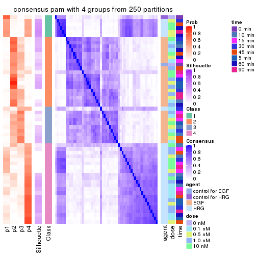</p>

</div>
<div id='tab-CV-pam-consensus-heatmap-4'>
<pre><code class="r">consensus_heatmap(res, k = 5)
</code></pre>

<p></p>

</div>
<div id='tab-CV-pam-consensus-heatmap-5'>
<pre><code class="r">consensus_heatmap(res, k = 6)
</code></pre>

<p></p>

</div>
</div>

Heatmaps for the membership of samples in all partitions to see how consistent they are:


<script>
$( function() {
	$( '#tabs-CV-pam-membership-heatmap' ).tabs();
} );
</script>
<div id='tabs-CV-pam-membership-heatmap'>
<ul>
<li><a href='#tab-CV-pam-membership-heatmap-1'>k = 2</a></li>
<li><a href='#tab-CV-pam-membership-heatmap-2'>k = 3</a></li>
<li><a href='#tab-CV-pam-membership-heatmap-3'>k = 4</a></li>
<li><a href='#tab-CV-pam-membership-heatmap-4'>k = 5</a></li>
<li><a href='#tab-CV-pam-membership-heatmap-5'>k = 6</a></li>
</ul>
<div id='tab-CV-pam-membership-heatmap-1'>
<pre><code class="r">membership_heatmap(res, k = 2)
</code></pre>

<p></p>

</div>
<div id='tab-CV-pam-membership-heatmap-2'>
<pre><code class="r">membership_heatmap(res, k = 3)
</code></pre>

<p></p>

</div>
<div id='tab-CV-pam-membership-heatmap-3'>
<pre><code class="r">membership_heatmap(res, k = 4)
</code></pre>

<p></p>

</div>
<div id='tab-CV-pam-membership-heatmap-4'>
<pre><code class="r">membership_heatmap(res, k = 5)
</code></pre>

<p></p>

</div>
<div id='tab-CV-pam-membership-heatmap-5'>
<pre><code class="r">membership_heatmap(res, k = 6)
</code></pre>

<p></p>

</div>
</div>

As soon as we have had the classes for columns, we can look for signatures
which are significantly different between classes which can be candidate marks
for certain classes. Following are the heatmaps for signatures.


Signature heatmaps where rows are scaled:


<script>
$( function() {
	$( '#tabs-CV-pam-get-signatures' ).tabs();
} );
</script>
<div id='tabs-CV-pam-get-signatures'>
<ul>
<li><a href='#tab-CV-pam-get-signatures-1'>k = 2</a></li>
<li><a href='#tab-CV-pam-get-signatures-2'>k = 3</a></li>
<li><a href='#tab-CV-pam-get-signatures-3'>k = 4</a></li>
<li><a href='#tab-CV-pam-get-signatures-4'>k = 5</a></li>
<li><a href='#tab-CV-pam-get-signatures-5'>k = 6</a></li>
</ul>
<div id='tab-CV-pam-get-signatures-1'>
<pre><code class="r">get_signatures(res, k = 2)
</code></pre>

<p></p>

</div>
<div id='tab-CV-pam-get-signatures-2'>
<pre><code class="r">get_signatures(res, k = 3)
</code></pre>

<p></p>

</div>
<div id='tab-CV-pam-get-signatures-3'>
<pre><code class="r">get_signatures(res, k = 4)
</code></pre>

<p></p>

</div>
<div id='tab-CV-pam-get-signatures-4'>
<pre><code class="r">get_signatures(res, k = 5)
</code></pre>

<p></p>

</div>
<div id='tab-CV-pam-get-signatures-5'>
<pre><code class="r">get_signatures(res, k = 6)
</code></pre>

<p></p>

</div>
</div>


Signature heatmaps where rows are not scaled:


<script>
$( function() {
	$( '#tabs-CV-pam-get-signatures-no-scale' ).tabs();
} );
</script>
<div id='tabs-CV-pam-get-signatures-no-scale'>
<ul>
<li><a href='#tab-CV-pam-get-signatures-no-scale-1'>k = 2</a></li>
<li><a href='#tab-CV-pam-get-signatures-no-scale-2'>k = 3</a></li>
<li><a href='#tab-CV-pam-get-signatures-no-scale-3'>k = 4</a></li>
<li><a href='#tab-CV-pam-get-signatures-no-scale-4'>k = 5</a></li>
<li><a href='#tab-CV-pam-get-signatures-no-scale-5'>k = 6</a></li>
</ul>
<div id='tab-CV-pam-get-signatures-no-scale-1'>
<pre><code class="r">get_signatures(res, k = 2, scale_rows = FALSE)
</code></pre>

<p></p>

</div>
<div id='tab-CV-pam-get-signatures-no-scale-2'>
<pre><code class="r">get_signatures(res, k = 3, scale_rows = FALSE)
</code></pre>

<p></p>

</div>
<div id='tab-CV-pam-get-signatures-no-scale-3'>
<pre><code class="r">get_signatures(res, k = 4, scale_rows = FALSE)
</code></pre>

<p></p>

</div>
<div id='tab-CV-pam-get-signatures-no-scale-4'>
<pre><code class="r">get_signatures(res, k = 5, scale_rows = FALSE)
</code></pre>

<p></p>

</div>
<div id='tab-CV-pam-get-signatures-no-scale-5'>
<pre><code class="r">get_signatures(res, k = 6, scale_rows = FALSE)
</code></pre>

<p></p>

</div>
</div>


Compare the overlap of signatures from different k:

```r
compare_signatures(res)
```


`get_signature()` returns a data frame invisibly. TO get the list of signatures, the function
call should be assigned to a variable explicitly. In following code, if `plot` argument is set
to `FALSE`, no heatmap is plotted while only the differential analysis is performed.

```r
# code only for demonstration
tb = get_signature(res, k = ..., plot = FALSE)
```

An example of the output of `tb` is:

```
#>   which_row         fdr    mean_1    mean_2 scaled_mean_1 scaled_mean_2 km
#> 1        38 0.042760348  8.373488  9.131774    -0.5533452     0.5164555  1
#> 2        40 0.018707592  7.106213  8.469186    -0.6173731     0.5762149  1
#> 3        55 0.019134737 10.221463 11.207825    -0.6159697     0.5749050  1
#> 4        59 0.006059896  5.921854  7.869574    -0.6899429     0.6439467  1
#> 5        60 0.018055526  8.928898 10.211722    -0.6204761     0.5791110  1
#> 6        98 0.009384629 15.714769 14.887706     0.6635654    -0.6193277  2
...
```

The columns in `tb` are:

1. `which_row`: row indices corresponding to the input matrix.
2. `fdr`: FDR for the differential test. 
3. `mean_x`: The mean value in group x.
4. `scaled_mean_x`: The mean value in group x after rows are scaled.
5. `km`: Row groups if k-means clustering is applied to rows.


UMAP plot which shows how samples are separated.


<script>
$( function() {
	$( '#tabs-CV-pam-dimension-reduction' ).tabs();
} );
</script>
<div id='tabs-CV-pam-dimension-reduction'>
<ul>
<li><a href='#tab-CV-pam-dimension-reduction-1'>k = 2</a></li>
<li><a href='#tab-CV-pam-dimension-reduction-2'>k = 3</a></li>
<li><a href='#tab-CV-pam-dimension-reduction-3'>k = 4</a></li>
<li><a href='#tab-CV-pam-dimension-reduction-4'>k = 5</a></li>
<li><a href='#tab-CV-pam-dimension-reduction-5'>k = 6</a></li>
</ul>
<div id='tab-CV-pam-dimension-reduction-1'>
<pre><code class="r">dimension_reduction(res, k = 2, method = &quot;UMAP&quot;)
</code></pre>

<p></p>

</div>
<div id='tab-CV-pam-dimension-reduction-2'>
<pre><code class="r">dimension_reduction(res, k = 3, method = &quot;UMAP&quot;)
</code></pre>

<p></p>

</div>
<div id='tab-CV-pam-dimension-reduction-3'>
<pre><code class="r">dimension_reduction(res, k = 4, method = &quot;UMAP&quot;)
</code></pre>

<p></p>

</div>
<div id='tab-CV-pam-dimension-reduction-4'>
<pre><code class="r">dimension_reduction(res, k = 5, method = &quot;UMAP&quot;)
</code></pre>

<p></p>

</div>
<div id='tab-CV-pam-dimension-reduction-5'>
<pre><code class="r">dimension_reduction(res, k = 6, method = &quot;UMAP&quot;)
</code></pre>

<p></p>

</div>
</div>


Following heatmap shows how subgroups are split when increasing `k`:

```r
collect_classes(res)
```


Test correlation between subgroups and known annotations. If the known
annotation is numeric, one-way ANOVA test is applied, and if the known
annotation is discrete, chi-squared contingency table test is applied.

```r
test_to_known_factors(res)
```

```
#>         n agent(p) dose(p) time(p) k
#> CV:pam 55 6.87e-12   0.999       1 2
#> CV:pam 27       NA      NA      NA 3
#> CV:pam  4       NA      NA      NA 4
#> CV:pam  0       NA      NA      NA 5
#> CV:pam  0       NA      NA      NA 6
```


If matrix rows can be associated to genes, consider to use `functional_enrichment(res,
...)` to perform function enrichment for the signature genes. See [this vignette](http://bioconductor.org/packages/devel/bioc/vignettes/cola/inst/doc/functional_enrichment.html) for more detailed explanations.


 

---------------------------------------------------


### CV:mclust


The object with results only for a single top-value method and a single partition method 
can be extracted as:

```r
res = res_list["CV", "mclust"]
# you can also extract it by
# res = res_list["CV:mclust"]
```

A summary of `res` and all the functions that can be applied to it:

```r
res
```

```
#> A 'ConsensusPartition' object with k = 2, 3, 4, 5, 6.
#>   On a matrix with 21163 rows and 57 columns.
#>   Top rows (1000, 2000, 3000, 4000, 5000) are extracted by 'CV' method.
#>   Subgroups are detected by 'mclust' method.
#>   Performed in total 1250 partitions by row resampling.
#>   Best k for subgroups seems to be 2.
#> 
#> Following methods can be applied to this 'ConsensusPartition' object:
#>  [1] "cola_report"             "collect_classes"         "collect_plots"          
#>  [4] "collect_stats"           "colnames"                "compare_signatures"     
#>  [7] "consensus_heatmap"       "dimension_reduction"     "functional_enrichment"  
#> [10] "get_anno_col"            "get_anno"                "get_classes"            
#> [13] "get_consensus"           "get_matrix"              "get_membership"         
#> [16] "get_param"               "get_signatures"          "get_stats"              
#> [19] "is_best_k"               "is_stable_k"             "membership_heatmap"     
#> [22] "ncol"                    "nrow"                    "plot_ecdf"              
#> [25] "rownames"                "select_partition_number" "show"                   
#> [28] "suggest_best_k"          "test_to_known_factors"
```

`collect_plots()` function collects all the plots made from `res` for all `k` (number of partitions)
into one single page to provide an easy and fast comparison between different `k`.

```r
collect_plots(res)
```


The plots are:

- The first row: a plot of the ECDF (empirical cumulative distribution
  function) curves of the consensus matrix for each `k` and the heatmap of
  predicted classes for each `k`.
- The second row: heatmaps of the consensus matrix for each `k`.
- The third row: heatmaps of the membership matrix for each `k`.
- The fouth row: heatmaps of the signatures for each `k`.

All the plots in panels can be made by individual functions and they are
plotted later in this section.

`select_partition_number()` produces several plots showing different
statistics for choosing "optimized" `k`. There are following statistics:

- ECDF curves of the consensus matrix for each `k`;
- 1-PAC. [The PAC
  score](https://en.wikipedia.org/wiki/Consensus_clustering#Over-interpretation_potential_of_consensus_clustering)
  measures the proportion of the ambiguous subgrouping.
- Mean silhouette score.
- Concordance. The mean probability of fiting the consensus class ids in all
  partitions.
- Area increased. Denote $A_k$ as the area under the ECDF curve for current
  `k`, the area increased is defined as $A_k - A_{k-1}$.
- Rand index. The percent of pairs of samples that are both in a same cluster
  or both are not in a same cluster in the partition of k and k-1.
- Jaccard index. The ratio of pairs of samples are both in a same cluster in
  the partition of k and k-1 and the pairs of samples are both in a same
  cluster in the partition k or k-1.

The detailed explanations of these statistics can be found in [the _cola_
vignette](http://bioconductor.org/packages/devel/bioc/vignettes/cola/inst/doc/cola.html#toc_13).

Generally speaking, lower PAC score, higher mean silhouette score or higher
concordance corresponds to better partition. Rand index and Jaccard index
measure how similar the current partition is compared to partition with `k-1`.
If they are too similar, we won't accept `k` is better than `k-1`.

```r
select_partition_number(res)
```


The numeric values for all these statistics can be obtained by `get_stats()`.

```r
get_stats(res)
```

```
#>   k 1-PAC mean_silhouette concordance area_increased  Rand Jaccard
#> 2 2 0.857           0.852       0.942         0.4887 0.504   0.504
#> 3 3 0.616           0.874       0.854         0.2526 0.880   0.766
#> 4 4 0.623           0.687       0.795         0.1324 0.895   0.736
#> 5 5 0.635           0.621       0.750         0.0725 0.982   0.941
#> 6 6 0.632           0.578       0.723         0.0506 0.895   0.673
```

`suggest_best_k()` suggests the best $k$ based on these statistics. The rules are as follows:

- All $k$ with Jaccard index larger than 0.95 are removed because increasing
  $k$ does not provide enough extra information. If all $k$ are removed, it is
  marked as no subgroup is detected.
- For all $k$ with 1-PAC score larger than 0.9, the maximal $k$ is taken as
  the best $k$, and other $k$ are marked as optional $k$.
- If it does not fit the second rule. The $k$ with the maximal vote of the
  highest 1-PAC score, highest mean silhouette, and highest concordance is
  taken as the best $k$.

```r
suggest_best_k(res)
```

```
#> [1] 2
```


Following shows the table of the partitions (You need to click the **show/hide
code output** link to see it). The membership matrix (columns with name `p*`)
is inferred by
[`clue::cl_consensus()`](https://www.rdocumentation.org/link/cl_consensus?package=clue)
function with the `SE` method. Basically the value in the membership matrix
represents the probability to belong to a certain group. The finall class
label for an item is determined with the group with highest probability it
belongs to.

In `get_classes()` function, the entropy is calculated from the membership
matrix and the silhouette score is calculated from the consensus matrix.


<script>
$( function() {
	$( '#tabs-CV-mclust-get-classes' ).tabs();
} );
</script>
<div id='tabs-CV-mclust-get-classes'>
<ul>
<li><a href='#tab-CV-mclust-get-classes-1'>k = 2</a></li>
<li><a href='#tab-CV-mclust-get-classes-2'>k = 3</a></li>
<li><a href='#tab-CV-mclust-get-classes-3'>k = 4</a></li>
<li><a href='#tab-CV-mclust-get-classes-4'>k = 5</a></li>
<li><a href='#tab-CV-mclust-get-classes-5'>k = 6</a></li>
</ul>

<div id='tab-CV-mclust-get-classes-1'>
<p><a id='tab-CV-mclust-get-classes-1-a' style='color:#0366d6' href='#'>show/hide code output</a></p>
<pre><code class="r">cbind(get_classes(res, k = 2), get_membership(res, k = 2))
</code></pre>

<pre><code>#&gt;           class entropy silhouette    p1    p2
#&gt; GSM148516     1  0.9775     0.2473 0.588 0.412
#&gt; GSM148517     1  0.0000     0.9385 1.000 0.000
#&gt; GSM148518     2  0.0376     0.9291 0.004 0.996
#&gt; GSM148519     2  0.0672     0.9313 0.008 0.992
#&gt; GSM148520     2  0.0938     0.9321 0.012 0.988
#&gt; GSM148521     2  0.0672     0.9310 0.008 0.992
#&gt; GSM148522     2  0.0672     0.9314 0.008 0.992
#&gt; GSM148523     2  0.0376     0.9296 0.004 0.996
#&gt; GSM148524     2  0.0672     0.9313 0.008 0.992
#&gt; GSM148525     2  0.0672     0.9311 0.008 0.992
#&gt; GSM148526     2  0.3584     0.9058 0.068 0.932
#&gt; GSM148527     2  0.1843     0.9292 0.028 0.972
#&gt; GSM148528     2  0.1843     0.9292 0.028 0.972
#&gt; GSM148529     2  0.2948     0.9182 0.052 0.948
#&gt; GSM148530     2  0.1184     0.9321 0.016 0.984
#&gt; GSM148531     2  0.0000     0.9272 0.000 1.000
#&gt; GSM148532     2  0.2423     0.9242 0.040 0.960
#&gt; GSM148533     2  0.0000     0.9272 0.000 1.000
#&gt; GSM148534     2  0.1414     0.9317 0.020 0.980
#&gt; GSM148535     2  0.0672     0.9314 0.008 0.992
#&gt; GSM148536     2  0.1843     0.9298 0.028 0.972
#&gt; GSM148537     2  0.4431     0.8858 0.092 0.908
#&gt; GSM148538     2  0.2423     0.9245 0.040 0.960
#&gt; GSM148539     2  0.7815     0.7072 0.232 0.768
#&gt; GSM148540     1  0.9795     0.2352 0.584 0.416
#&gt; GSM148541     1  0.9996    -0.0290 0.512 0.488
#&gt; GSM148542     2  1.0000     0.0184 0.496 0.504
#&gt; GSM148543     2  0.9427     0.4534 0.360 0.640
#&gt; GSM148544     1  0.9686     0.2925 0.604 0.396
#&gt; GSM148545     1  0.0000     0.9385 1.000 0.000
#&gt; GSM148546     1  0.0000     0.9385 1.000 0.000
#&gt; GSM148547     1  0.0000     0.9385 1.000 0.000
#&gt; GSM148548     1  0.0000     0.9385 1.000 0.000
#&gt; GSM148549     1  0.0000     0.9385 1.000 0.000
#&gt; GSM148550     1  0.0000     0.9385 1.000 0.000
#&gt; GSM148551     1  0.0000     0.9385 1.000 0.000
#&gt; GSM148552     1  0.0000     0.9385 1.000 0.000
#&gt; GSM148553     1  0.0000     0.9385 1.000 0.000
#&gt; GSM148554     1  0.0376     0.9354 0.996 0.004
#&gt; GSM148555     1  0.0000     0.9385 1.000 0.000
#&gt; GSM148556     1  0.0000     0.9385 1.000 0.000
#&gt; GSM148557     1  0.0000     0.9385 1.000 0.000
#&gt; GSM148558     1  0.0000     0.9385 1.000 0.000
#&gt; GSM148559     1  0.0376     0.9354 0.996 0.004
#&gt; GSM148560     1  0.0000     0.9385 1.000 0.000
#&gt; GSM148561     1  0.0000     0.9385 1.000 0.000
#&gt; GSM148562     1  0.0000     0.9385 1.000 0.000
#&gt; GSM148563     1  0.0000     0.9385 1.000 0.000
#&gt; GSM148564     1  0.0000     0.9385 1.000 0.000
#&gt; GSM148565     1  0.0000     0.9385 1.000 0.000
#&gt; GSM148566     1  0.0000     0.9385 1.000 0.000
#&gt; GSM148567     1  0.0376     0.9354 0.996 0.004
#&gt; GSM148568     1  0.0000     0.9385 1.000 0.000
#&gt; GSM148569     1  0.0000     0.9385 1.000 0.000
#&gt; GSM148570     1  0.0000     0.9385 1.000 0.000
#&gt; GSM148571     1  0.0000     0.9385 1.000 0.000
#&gt; GSM148572     1  0.0000     0.9385 1.000 0.000
</code></pre>

<script>
$('#tab-CV-mclust-get-classes-1-a').parent().next().next().hide();
$('#tab-CV-mclust-get-classes-1-a').click(function(){
  $('#tab-CV-mclust-get-classes-1-a').parent().next().next().toggle();
  return(false);
});
</script>
</div>

<div id='tab-CV-mclust-get-classes-2'>
<p><a id='tab-CV-mclust-get-classes-2-a' style='color:#0366d6' href='#'>show/hide code output</a></p>
<pre><code class="r">cbind(get_classes(res, k = 3), get_membership(res, k = 3))
</code></pre>

<pre><code>#&gt;           class entropy silhouette    p1    p2    p3
#&gt; GSM148516     3  0.8643      0.819 0.212 0.188 0.600
#&gt; GSM148517     1  0.5138      0.806 0.748 0.000 0.252
#&gt; GSM148518     2  0.1170      0.970 0.008 0.976 0.016
#&gt; GSM148519     2  0.0661      0.972 0.004 0.988 0.008
#&gt; GSM148520     2  0.0829      0.971 0.004 0.984 0.012
#&gt; GSM148521     2  0.0747      0.970 0.000 0.984 0.016
#&gt; GSM148522     2  0.1170      0.970 0.008 0.976 0.016
#&gt; GSM148523     2  0.0237      0.968 0.000 0.996 0.004
#&gt; GSM148524     2  0.0237      0.971 0.004 0.996 0.000
#&gt; GSM148525     2  0.1315      0.965 0.008 0.972 0.020
#&gt; GSM148526     2  0.2527      0.942 0.020 0.936 0.044
#&gt; GSM148527     2  0.0829      0.971 0.012 0.984 0.004
#&gt; GSM148528     2  0.1015      0.970 0.008 0.980 0.012
#&gt; GSM148529     2  0.1711      0.952 0.032 0.960 0.008
#&gt; GSM148530     2  0.1015      0.971 0.012 0.980 0.008
#&gt; GSM148531     2  0.0424      0.969 0.000 0.992 0.008
#&gt; GSM148532     2  0.1905      0.951 0.028 0.956 0.016
#&gt; GSM148533     2  0.0237      0.970 0.004 0.996 0.000
#&gt; GSM148534     2  0.0661      0.971 0.004 0.988 0.008
#&gt; GSM148535     2  0.0475      0.970 0.004 0.992 0.004
#&gt; GSM148536     2  0.1337      0.969 0.012 0.972 0.016
#&gt; GSM148537     2  0.3148      0.905 0.048 0.916 0.036
#&gt; GSM148538     2  0.1636      0.958 0.020 0.964 0.016
#&gt; GSM148539     3  0.8140      0.512 0.068 0.456 0.476
#&gt; GSM148540     3  0.8361      0.801 0.216 0.160 0.624
#&gt; GSM148541     3  0.8349      0.829 0.128 0.264 0.608
#&gt; GSM148542     3  0.8292      0.827 0.124 0.264 0.612
#&gt; GSM148543     3  0.8297      0.739 0.092 0.348 0.560
#&gt; GSM148544     3  0.8210      0.760 0.240 0.132 0.628
#&gt; GSM148545     1  0.5016      0.812 0.760 0.000 0.240
#&gt; GSM148546     1  0.3752      0.832 0.856 0.000 0.144
#&gt; GSM148547     1  0.3752      0.834 0.856 0.000 0.144
#&gt; GSM148548     1  0.2796      0.857 0.908 0.000 0.092
#&gt; GSM148549     1  0.3340      0.852 0.880 0.000 0.120
#&gt; GSM148550     1  0.2959      0.852 0.900 0.000 0.100
#&gt; GSM148551     1  0.2711      0.865 0.912 0.000 0.088
#&gt; GSM148552     1  0.3686      0.838 0.860 0.000 0.140
#&gt; GSM148553     1  0.3686      0.837 0.860 0.000 0.140
#&gt; GSM148554     1  0.2711      0.859 0.912 0.000 0.088
#&gt; GSM148555     1  0.3038      0.854 0.896 0.000 0.104
#&gt; GSM148556     1  0.3038      0.851 0.896 0.000 0.104
#&gt; GSM148557     1  0.4346      0.837 0.816 0.000 0.184
#&gt; GSM148558     1  0.4842      0.814 0.776 0.000 0.224
#&gt; GSM148559     1  0.4399      0.828 0.812 0.000 0.188
#&gt; GSM148560     1  0.4399      0.829 0.812 0.000 0.188
#&gt; GSM148561     1  0.3551      0.847 0.868 0.000 0.132
#&gt; GSM148562     1  0.2356      0.865 0.928 0.000 0.072
#&gt; GSM148563     1  0.3192      0.858 0.888 0.000 0.112
#&gt; GSM148564     1  0.4121      0.849 0.832 0.000 0.168
#&gt; GSM148565     1  0.5016      0.800 0.760 0.000 0.240
#&gt; GSM148566     1  0.4452      0.829 0.808 0.000 0.192
#&gt; GSM148567     1  0.2796      0.857 0.908 0.000 0.092
#&gt; GSM148568     1  0.2711      0.864 0.912 0.000 0.088
#&gt; GSM148569     1  0.4178      0.844 0.828 0.000 0.172
#&gt; GSM148570     1  0.4796      0.813 0.780 0.000 0.220
#&gt; GSM148571     1  0.4931      0.804 0.768 0.000 0.232
#&gt; GSM148572     1  0.5058      0.801 0.756 0.000 0.244
</code></pre>

<script>
$('#tab-CV-mclust-get-classes-2-a').parent().next().next().hide();
$('#tab-CV-mclust-get-classes-2-a').click(function(){
  $('#tab-CV-mclust-get-classes-2-a').parent().next().next().toggle();
  return(false);
});
</script>
</div>

<div id='tab-CV-mclust-get-classes-3'>
<p><a id='tab-CV-mclust-get-classes-3-a' style='color:#0366d6' href='#'>show/hide code output</a></p>
<pre><code class="r">cbind(get_classes(res, k = 4), get_membership(res, k = 4))
</code></pre>

<pre><code>#&gt;           class entropy silhouette    p1    p2    p3    p4
#&gt; GSM148516     3  0.6761     0.7628 0.112 0.108 0.700 0.080
#&gt; GSM148517     1  0.5963     0.4658 0.688 0.000 0.196 0.116
#&gt; GSM148518     2  0.0712     0.9769 0.004 0.984 0.004 0.008
#&gt; GSM148519     2  0.0672     0.9756 0.000 0.984 0.008 0.008
#&gt; GSM148520     2  0.0707     0.9755 0.000 0.980 0.020 0.000
#&gt; GSM148521     2  0.0817     0.9756 0.000 0.976 0.024 0.000
#&gt; GSM148522     2  0.0712     0.9755 0.004 0.984 0.008 0.004
#&gt; GSM148523     2  0.0188     0.9753 0.000 0.996 0.004 0.000
#&gt; GSM148524     2  0.0188     0.9753 0.000 0.996 0.000 0.004
#&gt; GSM148525     2  0.0804     0.9736 0.000 0.980 0.012 0.008
#&gt; GSM148526     2  0.2408     0.9288 0.016 0.920 0.060 0.004
#&gt; GSM148527     2  0.0844     0.9754 0.004 0.980 0.012 0.004
#&gt; GSM148528     2  0.1339     0.9704 0.004 0.964 0.024 0.008
#&gt; GSM148529     2  0.1114     0.9747 0.008 0.972 0.016 0.004
#&gt; GSM148530     2  0.0657     0.9763 0.000 0.984 0.012 0.004
#&gt; GSM148531     2  0.0469     0.9764 0.000 0.988 0.012 0.000
#&gt; GSM148532     2  0.1305     0.9676 0.000 0.960 0.036 0.004
#&gt; GSM148533     2  0.0188     0.9750 0.000 0.996 0.000 0.004
#&gt; GSM148534     2  0.0672     0.9764 0.000 0.984 0.008 0.008
#&gt; GSM148535     2  0.0657     0.9744 0.000 0.984 0.012 0.004
#&gt; GSM148536     2  0.1209     0.9696 0.004 0.964 0.032 0.000
#&gt; GSM148537     2  0.2438     0.9319 0.012 0.924 0.048 0.016
#&gt; GSM148538     2  0.1471     0.9678 0.012 0.960 0.024 0.004
#&gt; GSM148539     3  0.6149     0.5392 0.036 0.404 0.552 0.008
#&gt; GSM148540     3  0.6441     0.8125 0.096 0.132 0.716 0.056
#&gt; GSM148541     3  0.6115     0.8312 0.052 0.148 0.732 0.068
#&gt; GSM148542     3  0.5870     0.8284 0.036 0.168 0.736 0.060
#&gt; GSM148543     3  0.6063     0.7882 0.044 0.256 0.676 0.024
#&gt; GSM148544     3  0.6534     0.7842 0.104 0.104 0.716 0.076
#&gt; GSM148545     1  0.5820     0.4742 0.700 0.000 0.192 0.108
#&gt; GSM148546     1  0.3876     0.5956 0.836 0.000 0.124 0.040
#&gt; GSM148547     1  0.3612     0.6094 0.856 0.000 0.100 0.044
#&gt; GSM148548     1  0.4685     0.6013 0.784 0.000 0.060 0.156
#&gt; GSM148549     1  0.5977     0.5132 0.680 0.000 0.104 0.216
#&gt; GSM148550     1  0.5590     0.4985 0.692 0.000 0.064 0.244
#&gt; GSM148551     1  0.6329     0.4320 0.616 0.000 0.092 0.292
#&gt; GSM148552     1  0.3542     0.6065 0.864 0.000 0.060 0.076
#&gt; GSM148553     1  0.4428     0.6073 0.808 0.000 0.124 0.068
#&gt; GSM148554     1  0.3583     0.5765 0.816 0.000 0.004 0.180
#&gt; GSM148555     1  0.4988     0.5355 0.728 0.000 0.036 0.236
#&gt; GSM148556     1  0.4904     0.5519 0.744 0.000 0.040 0.216
#&gt; GSM148557     1  0.5472     0.0481 0.544 0.000 0.016 0.440
#&gt; GSM148558     4  0.4908     0.5250 0.292 0.000 0.016 0.692
#&gt; GSM148559     1  0.5483     0.5385 0.736 0.000 0.136 0.128
#&gt; GSM148560     1  0.5058     0.5782 0.768 0.000 0.128 0.104
#&gt; GSM148561     1  0.6766     0.3785 0.596 0.004 0.116 0.284
#&gt; GSM148562     1  0.5543     0.1449 0.556 0.000 0.020 0.424
#&gt; GSM148563     4  0.6080     0.0480 0.468 0.000 0.044 0.488
#&gt; GSM148564     4  0.4972     0.1438 0.456 0.000 0.000 0.544
#&gt; GSM148565     4  0.2730     0.6604 0.088 0.000 0.016 0.896
#&gt; GSM148566     1  0.5280     0.5506 0.752 0.000 0.124 0.124
#&gt; GSM148567     1  0.6627     0.0750 0.516 0.004 0.072 0.408
#&gt; GSM148568     1  0.5271     0.4297 0.640 0.000 0.020 0.340
#&gt; GSM148569     4  0.5398     0.2612 0.404 0.000 0.016 0.580
#&gt; GSM148570     4  0.3812     0.6595 0.140 0.000 0.028 0.832
#&gt; GSM148571     4  0.2987     0.6639 0.104 0.000 0.016 0.880
#&gt; GSM148572     4  0.2730     0.6541 0.088 0.000 0.016 0.896
</code></pre>

<script>
$('#tab-CV-mclust-get-classes-3-a').parent().next().next().hide();
$('#tab-CV-mclust-get-classes-3-a').click(function(){
  $('#tab-CV-mclust-get-classes-3-a').parent().next().next().toggle();
  return(false);
});
</script>
</div>

<div id='tab-CV-mclust-get-classes-4'>
<p><a id='tab-CV-mclust-get-classes-4-a' style='color:#0366d6' href='#'>show/hide code output</a></p>
<pre><code class="r">cbind(get_classes(res, k = 5), get_membership(res, k = 5))
</code></pre>

<pre><code>#&gt;           class entropy silhouette    p1    p2    p3    p4 p5
#&gt; GSM148516     3   0.576     0.7415 0.116 0.092 0.720 0.012 NA
#&gt; GSM148517     1   0.504     0.3077 0.544 0.000 0.008 0.020 NA
#&gt; GSM148518     2   0.190     0.9408 0.000 0.932 0.024 0.004 NA
#&gt; GSM148519     2   0.182     0.9412 0.000 0.932 0.024 0.000 NA
#&gt; GSM148520     2   0.220     0.9307 0.004 0.916 0.024 0.000 NA
#&gt; GSM148521     2   0.215     0.9380 0.000 0.916 0.048 0.000 NA
#&gt; GSM148522     2   0.140     0.9435 0.000 0.952 0.028 0.000 NA
#&gt; GSM148523     2   0.102     0.9445 0.000 0.968 0.016 0.000 NA
#&gt; GSM148524     2   0.120     0.9434 0.000 0.956 0.004 0.000 NA
#&gt; GSM148525     2   0.136     0.9403 0.000 0.952 0.036 0.000 NA
#&gt; GSM148526     2   0.284     0.9064 0.008 0.876 0.096 0.000 NA
#&gt; GSM148527     2   0.199     0.9317 0.000 0.924 0.044 0.000 NA
#&gt; GSM148528     2   0.223     0.9334 0.000 0.916 0.044 0.004 NA
#&gt; GSM148529     2   0.239     0.9274 0.000 0.900 0.028 0.000 NA
#&gt; GSM148530     2   0.155     0.9412 0.000 0.944 0.016 0.000 NA
#&gt; GSM148531     2   0.160     0.9362 0.000 0.940 0.012 0.000 NA
#&gt; GSM148532     2   0.141     0.9419 0.004 0.952 0.036 0.000 NA
#&gt; GSM148533     2   0.117     0.9400 0.000 0.960 0.008 0.000 NA
#&gt; GSM148534     2   0.163     0.9410 0.000 0.944 0.016 0.004 NA
#&gt; GSM148535     2   0.122     0.9429 0.000 0.960 0.020 0.000 NA
#&gt; GSM148536     2   0.240     0.9306 0.004 0.912 0.040 0.004 NA
#&gt; GSM148537     2   0.315     0.9018 0.004 0.864 0.100 0.008 NA
#&gt; GSM148538     2   0.230     0.9253 0.000 0.904 0.024 0.000 NA
#&gt; GSM148539     3   0.472     0.5863 0.016 0.340 0.636 0.000 NA
#&gt; GSM148540     3   0.354     0.8070 0.056 0.080 0.848 0.016 NA
#&gt; GSM148541     3   0.335     0.8144 0.020 0.080 0.864 0.004 NA
#&gt; GSM148542     3   0.279     0.8169 0.004 0.088 0.884 0.008 NA
#&gt; GSM148543     3   0.335     0.7913 0.004 0.192 0.800 0.004 NA
#&gt; GSM148544     3   0.434     0.7898 0.072 0.088 0.808 0.028 NA
#&gt; GSM148545     1   0.503     0.3115 0.548 0.000 0.008 0.020 NA
#&gt; GSM148546     1   0.201     0.5078 0.924 0.000 0.016 0.004 NA
#&gt; GSM148547     1   0.181     0.5167 0.936 0.000 0.020 0.004 NA
#&gt; GSM148548     1   0.542     0.4979 0.668 0.000 0.032 0.048 NA
#&gt; GSM148549     1   0.744     0.3754 0.460 0.000 0.120 0.092 NA
#&gt; GSM148550     1   0.755     0.3102 0.448 0.000 0.068 0.184 NA
#&gt; GSM148551     1   0.795     0.2771 0.432 0.000 0.116 0.192 NA
#&gt; GSM148552     1   0.474     0.5158 0.736 0.000 0.020 0.044 NA
#&gt; GSM148553     1   0.319     0.5263 0.872 0.000 0.040 0.024 NA
#&gt; GSM148554     1   0.569     0.4711 0.628 0.000 0.008 0.104 NA
#&gt; GSM148555     1   0.638     0.3608 0.476 0.000 0.004 0.148 NA
#&gt; GSM148556     1   0.681     0.3368 0.476 0.000 0.024 0.152 NA
#&gt; GSM148557     4   0.715     0.0709 0.300 0.000 0.016 0.400 NA
#&gt; GSM148558     4   0.561     0.4848 0.156 0.000 0.008 0.664 NA
#&gt; GSM148559     1   0.586     0.3660 0.512 0.000 0.048 0.024 NA
#&gt; GSM148560     1   0.430     0.4904 0.804 0.000 0.084 0.028 NA
#&gt; GSM148561     1   0.695     0.3732 0.600 0.004 0.104 0.180 NA
#&gt; GSM148562     1   0.705    -0.0199 0.408 0.000 0.024 0.384 NA
#&gt; GSM148563     4   0.650     0.0493 0.412 0.000 0.028 0.464 NA
#&gt; GSM148564     4   0.701     0.1056 0.328 0.000 0.012 0.416 NA
#&gt; GSM148565     4   0.130     0.5796 0.008 0.000 0.012 0.960 NA
#&gt; GSM148566     1   0.471     0.4850 0.780 0.000 0.084 0.044 NA
#&gt; GSM148567     1   0.791     0.0147 0.380 0.000 0.120 0.352 NA
#&gt; GSM148568     1   0.734     0.1299 0.420 0.000 0.032 0.300 NA
#&gt; GSM148569     4   0.675     0.2520 0.268 0.000 0.012 0.500 NA
#&gt; GSM148570     4   0.274     0.5861 0.068 0.000 0.016 0.892 NA
#&gt; GSM148571     4   0.149     0.5871 0.040 0.000 0.008 0.948 NA
#&gt; GSM148572     4   0.120     0.5774 0.008 0.000 0.012 0.964 NA
</code></pre>

<script>
$('#tab-CV-mclust-get-classes-4-a').parent().next().next().hide();
$('#tab-CV-mclust-get-classes-4-a').click(function(){
  $('#tab-CV-mclust-get-classes-4-a').parent().next().next().toggle();
  return(false);
});
</script>
</div>

<div id='tab-CV-mclust-get-classes-5'>
<p><a id='tab-CV-mclust-get-classes-5-a' style='color:#0366d6' href='#'>show/hide code output</a></p>
<pre><code class="r">cbind(get_classes(res, k = 6), get_membership(res, k = 6))
</code></pre>

<pre><code>#&gt;           class entropy silhouette    p1    p2    p3    p4    p5    p6
#&gt; GSM148516     3   0.660      0.642 0.060 0.096 0.576 0.004 0.232 0.032
#&gt; GSM148517     6   0.143      0.538 0.048 0.000 0.000 0.012 0.000 0.940
#&gt; GSM148518     2   0.133      0.906 0.000 0.944 0.008 0.000 0.048 0.000
#&gt; GSM148519     2   0.166      0.906 0.000 0.928 0.016 0.000 0.056 0.000
#&gt; GSM148520     2   0.313      0.872 0.000 0.820 0.024 0.004 0.152 0.000
#&gt; GSM148521     2   0.292      0.897 0.000 0.848 0.052 0.000 0.100 0.000
#&gt; GSM148522     2   0.181      0.908 0.000 0.920 0.020 0.000 0.060 0.000
#&gt; GSM148523     2   0.143      0.911 0.000 0.940 0.012 0.000 0.048 0.000
#&gt; GSM148524     2   0.206      0.903 0.000 0.900 0.008 0.004 0.088 0.000
#&gt; GSM148525     2   0.118      0.909 0.000 0.956 0.020 0.000 0.024 0.000
#&gt; GSM148526     2   0.336      0.858 0.000 0.828 0.108 0.004 0.056 0.004
#&gt; GSM148527     2   0.253      0.877 0.000 0.884 0.056 0.000 0.056 0.004
#&gt; GSM148528     2   0.238      0.884 0.000 0.888 0.064 0.000 0.048 0.000
#&gt; GSM148529     2   0.360      0.857 0.000 0.788 0.032 0.004 0.172 0.004
#&gt; GSM148530     2   0.240      0.898 0.000 0.872 0.016 0.000 0.112 0.000
#&gt; GSM148531     2   0.257      0.886 0.000 0.856 0.008 0.004 0.132 0.000
#&gt; GSM148532     2   0.214      0.902 0.004 0.908 0.048 0.000 0.040 0.000
#&gt; GSM148533     2   0.115      0.901 0.000 0.956 0.004 0.000 0.036 0.004
#&gt; GSM148534     2   0.191      0.905 0.000 0.920 0.024 0.004 0.052 0.000
#&gt; GSM148535     2   0.139      0.906 0.000 0.944 0.016 0.000 0.040 0.000
#&gt; GSM148536     2   0.317      0.888 0.004 0.836 0.036 0.004 0.120 0.000
#&gt; GSM148537     2   0.362      0.850 0.008 0.804 0.124 0.000 0.064 0.000
#&gt; GSM148538     2   0.338      0.857 0.000 0.792 0.016 0.004 0.184 0.004
#&gt; GSM148539     3   0.464      0.597 0.008 0.268 0.664 0.000 0.060 0.000
#&gt; GSM148540     3   0.274      0.743 0.028 0.032 0.888 0.008 0.044 0.000
#&gt; GSM148541     3   0.428      0.751 0.020 0.052 0.764 0.000 0.156 0.008
#&gt; GSM148542     3   0.356      0.763 0.008 0.056 0.816 0.004 0.116 0.000
#&gt; GSM148543     3   0.326      0.741 0.012 0.144 0.820 0.000 0.024 0.000
#&gt; GSM148544     3   0.432      0.734 0.048 0.056 0.796 0.024 0.076 0.000
#&gt; GSM148545     6   0.167      0.538 0.060 0.000 0.000 0.008 0.004 0.928
#&gt; GSM148546     6   0.662     -0.597 0.292 0.000 0.020 0.004 0.292 0.392
#&gt; GSM148547     1   0.641     -0.618 0.364 0.000 0.008 0.004 0.264 0.360
#&gt; GSM148548     1   0.457      0.206 0.716 0.000 0.000 0.008 0.112 0.164
#&gt; GSM148549     1   0.558      0.411 0.696 0.000 0.092 0.048 0.128 0.036
#&gt; GSM148550     1   0.494      0.471 0.756 0.000 0.040 0.084 0.064 0.056
#&gt; GSM148551     1   0.675      0.368 0.584 0.000 0.096 0.104 0.176 0.040
#&gt; GSM148552     1   0.606     -0.160 0.468 0.000 0.008 0.012 0.136 0.376
#&gt; GSM148553     1   0.665     -0.453 0.388 0.000 0.032 0.000 0.256 0.324
#&gt; GSM148554     1   0.479      0.310 0.684 0.000 0.000 0.044 0.036 0.236
#&gt; GSM148555     1   0.385      0.450 0.804 0.000 0.000 0.072 0.028 0.096
#&gt; GSM148556     1   0.333      0.458 0.852 0.000 0.004 0.048 0.048 0.048
#&gt; GSM148557     1   0.441      0.355 0.692 0.000 0.000 0.256 0.016 0.036
#&gt; GSM148558     4   0.451      0.358 0.372 0.000 0.000 0.596 0.020 0.012
#&gt; GSM148559     6   0.513      0.377 0.228 0.000 0.016 0.016 0.068 0.672
#&gt; GSM148560     5   0.704      0.874 0.272 0.000 0.044 0.008 0.364 0.312
#&gt; GSM148561     1   0.786     -0.368 0.388 0.000 0.052 0.124 0.304 0.132
#&gt; GSM148562     1   0.618      0.370 0.568 0.000 0.012 0.244 0.144 0.032
#&gt; GSM148563     1   0.667      0.168 0.444 0.000 0.020 0.344 0.168 0.024
#&gt; GSM148564     1   0.505      0.276 0.592 0.000 0.000 0.328 0.072 0.008
#&gt; GSM148565     4   0.079      0.796 0.032 0.000 0.000 0.968 0.000 0.000
#&gt; GSM148566     5   0.711      0.881 0.296 0.000 0.044 0.012 0.372 0.276
#&gt; GSM148567     1   0.734      0.342 0.456 0.000 0.084 0.248 0.188 0.024
#&gt; GSM148568     1   0.480      0.473 0.724 0.000 0.008 0.176 0.052 0.040
#&gt; GSM148569     1   0.538      0.177 0.544 0.000 0.004 0.368 0.072 0.012
#&gt; GSM148570     4   0.394      0.721 0.120 0.000 0.016 0.800 0.052 0.012
#&gt; GSM148571     4   0.229      0.795 0.072 0.000 0.004 0.900 0.016 0.008
#&gt; GSM148572     4   0.120      0.791 0.040 0.000 0.000 0.952 0.008 0.000
</code></pre>

<script>
$('#tab-CV-mclust-get-classes-5-a').parent().next().next().hide();
$('#tab-CV-mclust-get-classes-5-a').click(function(){
  $('#tab-CV-mclust-get-classes-5-a').parent().next().next().toggle();
  return(false);
});
</script>
</div>
</div>

Heatmaps for the consensus matrix. It visualizes the probability of two
samples to be in a same group.


<script>
$( function() {
	$( '#tabs-CV-mclust-consensus-heatmap' ).tabs();
} );
</script>
<div id='tabs-CV-mclust-consensus-heatmap'>
<ul>
<li><a href='#tab-CV-mclust-consensus-heatmap-1'>k = 2</a></li>
<li><a href='#tab-CV-mclust-consensus-heatmap-2'>k = 3</a></li>
<li><a href='#tab-CV-mclust-consensus-heatmap-3'>k = 4</a></li>
<li><a href='#tab-CV-mclust-consensus-heatmap-4'>k = 5</a></li>
<li><a href='#tab-CV-mclust-consensus-heatmap-5'>k = 6</a></li>
</ul>
<div id='tab-CV-mclust-consensus-heatmap-1'>
<pre><code class="r">consensus_heatmap(res, k = 2)
</code></pre>

<p></p>

</div>
<div id='tab-CV-mclust-consensus-heatmap-2'>
<pre><code class="r">consensus_heatmap(res, k = 3)
</code></pre>

<p></p>

</div>
<div id='tab-CV-mclust-consensus-heatmap-3'>
<pre><code class="r">consensus_heatmap(res, k = 4)
</code></pre>

<p></p>

</div>
<div id='tab-CV-mclust-consensus-heatmap-4'>
<pre><code class="r">consensus_heatmap(res, k = 5)
</code></pre>

<p></p>

</div>
<div id='tab-CV-mclust-consensus-heatmap-5'>
<pre><code class="r">consensus_heatmap(res, k = 6)
</code></pre>

<p></p>

</div>
</div>

Heatmaps for the membership of samples in all partitions to see how consistent they are:


<script>
$( function() {
	$( '#tabs-CV-mclust-membership-heatmap' ).tabs();
} );
</script>
<div id='tabs-CV-mclust-membership-heatmap'>
<ul>
<li><a href='#tab-CV-mclust-membership-heatmap-1'>k = 2</a></li>
<li><a href='#tab-CV-mclust-membership-heatmap-2'>k = 3</a></li>
<li><a href='#tab-CV-mclust-membership-heatmap-3'>k = 4</a></li>
<li><a href='#tab-CV-mclust-membership-heatmap-4'>k = 5</a></li>
<li><a href='#tab-CV-mclust-membership-heatmap-5'>k = 6</a></li>
</ul>
<div id='tab-CV-mclust-membership-heatmap-1'>
<pre><code class="r">membership_heatmap(res, k = 2)
</code></pre>

<p></p>

</div>
<div id='tab-CV-mclust-membership-heatmap-2'>
<pre><code class="r">membership_heatmap(res, k = 3)
</code></pre>

<p></p>

</div>
<div id='tab-CV-mclust-membership-heatmap-3'>
<pre><code class="r">membership_heatmap(res, k = 4)
</code></pre>

<p></p>

</div>
<div id='tab-CV-mclust-membership-heatmap-4'>
<pre><code class="r">membership_heatmap(res, k = 5)
</code></pre>

<p></p>

</div>
<div id='tab-CV-mclust-membership-heatmap-5'>
<pre><code class="r">membership_heatmap(res, k = 6)
</code></pre>

<p></p>

</div>
</div>

As soon as we have had the classes for columns, we can look for signatures
which are significantly different between classes which can be candidate marks
for certain classes. Following are the heatmaps for signatures.


Signature heatmaps where rows are scaled:


<script>
$( function() {
	$( '#tabs-CV-mclust-get-signatures' ).tabs();
} );
</script>
<div id='tabs-CV-mclust-get-signatures'>
<ul>
<li><a href='#tab-CV-mclust-get-signatures-1'>k = 2</a></li>
<li><a href='#tab-CV-mclust-get-signatures-2'>k = 3</a></li>
<li><a href='#tab-CV-mclust-get-signatures-3'>k = 4</a></li>
<li><a href='#tab-CV-mclust-get-signatures-4'>k = 5</a></li>
<li><a href='#tab-CV-mclust-get-signatures-5'>k = 6</a></li>
</ul>
<div id='tab-CV-mclust-get-signatures-1'>
<pre><code class="r">get_signatures(res, k = 2)
</code></pre>

<p></p>

</div>
<div id='tab-CV-mclust-get-signatures-2'>
<pre><code class="r">get_signatures(res, k = 3)
</code></pre>

<p></p>

</div>
<div id='tab-CV-mclust-get-signatures-3'>
<pre><code class="r">get_signatures(res, k = 4)
</code></pre>

<p></p>

</div>
<div id='tab-CV-mclust-get-signatures-4'>
<pre><code class="r">get_signatures(res, k = 5)
</code></pre>

<p></p>

</div>
<div id='tab-CV-mclust-get-signatures-5'>
<pre><code class="r">get_signatures(res, k = 6)
</code></pre>

<p></p>

</div>
</div>


Signature heatmaps where rows are not scaled:


<script>
$( function() {
	$( '#tabs-CV-mclust-get-signatures-no-scale' ).tabs();
} );
</script>
<div id='tabs-CV-mclust-get-signatures-no-scale'>
<ul>
<li><a href='#tab-CV-mclust-get-signatures-no-scale-1'>k = 2</a></li>
<li><a href='#tab-CV-mclust-get-signatures-no-scale-2'>k = 3</a></li>
<li><a href='#tab-CV-mclust-get-signatures-no-scale-3'>k = 4</a></li>
<li><a href='#tab-CV-mclust-get-signatures-no-scale-4'>k = 5</a></li>
<li><a href='#tab-CV-mclust-get-signatures-no-scale-5'>k = 6</a></li>
</ul>
<div id='tab-CV-mclust-get-signatures-no-scale-1'>
<pre><code class="r">get_signatures(res, k = 2, scale_rows = FALSE)
</code></pre>

<p></p>

</div>
<div id='tab-CV-mclust-get-signatures-no-scale-2'>
<pre><code class="r">get_signatures(res, k = 3, scale_rows = FALSE)
</code></pre>

<p></p>

</div>
<div id='tab-CV-mclust-get-signatures-no-scale-3'>
<pre><code class="r">get_signatures(res, k = 4, scale_rows = FALSE)
</code></pre>

<p></p>

</div>
<div id='tab-CV-mclust-get-signatures-no-scale-4'>
<pre><code class="r">get_signatures(res, k = 5, scale_rows = FALSE)
</code></pre>

<p></p>

</div>
<div id='tab-CV-mclust-get-signatures-no-scale-5'>
<pre><code class="r">get_signatures(res, k = 6, scale_rows = FALSE)
</code></pre>

<p></p>

</div>
</div>


Compare the overlap of signatures from different k:

```r
compare_signatures(res)
```


`get_signature()` returns a data frame invisibly. TO get the list of signatures, the function
call should be assigned to a variable explicitly. In following code, if `plot` argument is set
to `FALSE`, no heatmap is plotted while only the differential analysis is performed.

```r
# code only for demonstration
tb = get_signature(res, k = ..., plot = FALSE)
```

An example of the output of `tb` is:

```
#>   which_row         fdr    mean_1    mean_2 scaled_mean_1 scaled_mean_2 km
#> 1        38 0.042760348  8.373488  9.131774    -0.5533452     0.5164555  1
#> 2        40 0.018707592  7.106213  8.469186    -0.6173731     0.5762149  1
#> 3        55 0.019134737 10.221463 11.207825    -0.6159697     0.5749050  1
#> 4        59 0.006059896  5.921854  7.869574    -0.6899429     0.6439467  1
#> 5        60 0.018055526  8.928898 10.211722    -0.6204761     0.5791110  1
#> 6        98 0.009384629 15.714769 14.887706     0.6635654    -0.6193277  2
...
```

The columns in `tb` are:

1. `which_row`: row indices corresponding to the input matrix.
2. `fdr`: FDR for the differential test. 
3. `mean_x`: The mean value in group x.
4. `scaled_mean_x`: The mean value in group x after rows are scaled.
5. `km`: Row groups if k-means clustering is applied to rows.


UMAP plot which shows how samples are separated.


<script>
$( function() {
	$( '#tabs-CV-mclust-dimension-reduction' ).tabs();
} );
</script>
<div id='tabs-CV-mclust-dimension-reduction'>
<ul>
<li><a href='#tab-CV-mclust-dimension-reduction-1'>k = 2</a></li>
<li><a href='#tab-CV-mclust-dimension-reduction-2'>k = 3</a></li>
<li><a href='#tab-CV-mclust-dimension-reduction-3'>k = 4</a></li>
<li><a href='#tab-CV-mclust-dimension-reduction-4'>k = 5</a></li>
<li><a href='#tab-CV-mclust-dimension-reduction-5'>k = 6</a></li>
</ul>
<div id='tab-CV-mclust-dimension-reduction-1'>
<pre><code class="r">dimension_reduction(res, k = 2, method = &quot;UMAP&quot;)
</code></pre>

<p></p>

</div>
<div id='tab-CV-mclust-dimension-reduction-2'>
<pre><code class="r">dimension_reduction(res, k = 3, method = &quot;UMAP&quot;)
</code></pre>

<p></p>

</div>
<div id='tab-CV-mclust-dimension-reduction-3'>
<pre><code class="r">dimension_reduction(res, k = 4, method = &quot;UMAP&quot;)
</code></pre>

<p></p>

</div>
<div id='tab-CV-mclust-dimension-reduction-4'>
<pre><code class="r">dimension_reduction(res, k = 5, method = &quot;UMAP&quot;)
</code></pre>

<p></p>

</div>
<div id='tab-CV-mclust-dimension-reduction-5'>
<pre><code class="r">dimension_reduction(res, k = 6, method = &quot;UMAP&quot;)
</code></pre>

<p></p>

</div>
</div>


Following heatmap shows how subgroups are split when increasing `k`:

```r
collect_classes(res)
```


Test correlation between subgroups and known annotations. If the known
annotation is numeric, one-way ANOVA test is applied, and if the known
annotation is discrete, chi-squared contingency table test is applied.

```r
test_to_known_factors(res)
```

```
#>            n agent(p)  dose(p) time(p) k
#> CV:mclust 51 8.42e-12 0.327825   0.996 2
#> CV:mclust 57 9.44e-12 0.000666   0.995 3
#> CV:mclust 45 4.70e-09 0.000230   0.434 4
#> CV:mclust 36 4.56e-07 0.000223   0.712 5
#> CV:mclust 36 1.52e-07 0.000542   0.658 6
```


If matrix rows can be associated to genes, consider to use `functional_enrichment(res,
...)` to perform function enrichment for the signature genes. See [this vignette](http://bioconductor.org/packages/devel/bioc/vignettes/cola/inst/doc/functional_enrichment.html) for more detailed explanations.


 

---------------------------------------------------


### CV:NMF**


The object with results only for a single top-value method and a single partition method 
can be extracted as:

```r
res = res_list["CV", "NMF"]
# you can also extract it by
# res = res_list["CV:NMF"]
```

A summary of `res` and all the functions that can be applied to it:

```r
res
```

```
#> A 'ConsensusPartition' object with k = 2, 3, 4, 5, 6.
#>   On a matrix with 21163 rows and 57 columns.
#>   Top rows (1000, 2000, 3000, 4000, 5000) are extracted by 'CV' method.
#>   Subgroups are detected by 'NMF' method.
#>   Performed in total 1250 partitions by row resampling.
#>   Best k for subgroups seems to be 2.
#> 
#> Following methods can be applied to this 'ConsensusPartition' object:
#>  [1] "cola_report"             "collect_classes"         "collect_plots"          
#>  [4] "collect_stats"           "colnames"                "compare_signatures"     
#>  [7] "consensus_heatmap"       "dimension_reduction"     "functional_enrichment"  
#> [10] "get_anno_col"            "get_anno"                "get_classes"            
#> [13] "get_consensus"           "get_matrix"              "get_membership"         
#> [16] "get_param"               "get_signatures"          "get_stats"              
#> [19] "is_best_k"               "is_stable_k"             "membership_heatmap"     
#> [22] "ncol"                    "nrow"                    "plot_ecdf"              
#> [25] "rownames"                "select_partition_number" "show"                   
#> [28] "suggest_best_k"          "test_to_known_factors"
```

`collect_plots()` function collects all the plots made from `res` for all `k` (number of partitions)
into one single page to provide an easy and fast comparison between different `k`.

```r
collect_plots(res)
```


The plots are:

- The first row: a plot of the ECDF (empirical cumulative distribution
  function) curves of the consensus matrix for each `k` and the heatmap of
  predicted classes for each `k`.
- The second row: heatmaps of the consensus matrix for each `k`.
- The third row: heatmaps of the membership matrix for each `k`.
- The fouth row: heatmaps of the signatures for each `k`.

All the plots in panels can be made by individual functions and they are
plotted later in this section.

`select_partition_number()` produces several plots showing different
statistics for choosing "optimized" `k`. There are following statistics:

- ECDF curves of the consensus matrix for each `k`;
- 1-PAC. [The PAC
  score](https://en.wikipedia.org/wiki/Consensus_clustering#Over-interpretation_potential_of_consensus_clustering)
  measures the proportion of the ambiguous subgrouping.
- Mean silhouette score.
- Concordance. The mean probability of fiting the consensus class ids in all
  partitions.
- Area increased. Denote $A_k$ as the area under the ECDF curve for current
  `k`, the area increased is defined as $A_k - A_{k-1}$.
- Rand index. The percent of pairs of samples that are both in a same cluster
  or both are not in a same cluster in the partition of k and k-1.
- Jaccard index. The ratio of pairs of samples are both in a same cluster in
  the partition of k and k-1 and the pairs of samples are both in a same
  cluster in the partition k or k-1.

The detailed explanations of these statistics can be found in [the _cola_
vignette](http://bioconductor.org/packages/devel/bioc/vignettes/cola/inst/doc/cola.html#toc_13).

Generally speaking, lower PAC score, higher mean silhouette score or higher
concordance corresponds to better partition. Rand index and Jaccard index
measure how similar the current partition is compared to partition with `k-1`.
If they are too similar, we won't accept `k` is better than `k-1`.

```r
select_partition_number(res)
```


The numeric values for all these statistics can be obtained by `get_stats()`.

```r
get_stats(res)
```

```
#>   k 1-PAC mean_silhouette concordance area_increased  Rand Jaccard
#> 2 2 1.000           0.982       0.992         0.5085 0.491   0.491
#> 3 3 0.618           0.857       0.829         0.2108 1.000   1.000
#> 4 4 0.539           0.519       0.732         0.1376 0.827   0.648
#> 5 5 0.488           0.554       0.675         0.0759 0.848   0.590
#> 6 6 0.521           0.493       0.651         0.0498 0.927   0.745
```

`suggest_best_k()` suggests the best $k$ based on these statistics. The rules are as follows:

- All $k$ with Jaccard index larger than 0.95 are removed because increasing
  $k$ does not provide enough extra information. If all $k$ are removed, it is
  marked as no subgroup is detected.
- For all $k$ with 1-PAC score larger than 0.9, the maximal $k$ is taken as
  the best $k$, and other $k$ are marked as optional $k$.
- If it does not fit the second rule. The $k$ with the maximal vote of the
  highest 1-PAC score, highest mean silhouette, and highest concordance is
  taken as the best $k$.

```r
suggest_best_k(res)
```

```
#> [1] 2
```


Following shows the table of the partitions (You need to click the **show/hide
code output** link to see it). The membership matrix (columns with name `p*`)
is inferred by
[`clue::cl_consensus()`](https://www.rdocumentation.org/link/cl_consensus?package=clue)
function with the `SE` method. Basically the value in the membership matrix
represents the probability to belong to a certain group. The finall class
label for an item is determined with the group with highest probability it
belongs to.

In `get_classes()` function, the entropy is calculated from the membership
matrix and the silhouette score is calculated from the consensus matrix.


<script>
$( function() {
	$( '#tabs-CV-NMF-get-classes' ).tabs();
} );
</script>
<div id='tabs-CV-NMF-get-classes'>
<ul>
<li><a href='#tab-CV-NMF-get-classes-1'>k = 2</a></li>
<li><a href='#tab-CV-NMF-get-classes-2'>k = 3</a></li>
<li><a href='#tab-CV-NMF-get-classes-3'>k = 4</a></li>
<li><a href='#tab-CV-NMF-get-classes-4'>k = 5</a></li>
<li><a href='#tab-CV-NMF-get-classes-5'>k = 6</a></li>
</ul>

<div id='tab-CV-NMF-get-classes-1'>
<p><a id='tab-CV-NMF-get-classes-1-a' style='color:#0366d6' href='#'>show/hide code output</a></p>
<pre><code class="r">cbind(get_classes(res, k = 2), get_membership(res, k = 2))
</code></pre>

<pre><code>#&gt;           class entropy silhouette    p1    p2
#&gt; GSM148516     2  0.1414      0.967 0.020 0.980
#&gt; GSM148517     1  0.0000      0.999 1.000 0.000
#&gt; GSM148518     2  0.0000      0.983 0.000 1.000
#&gt; GSM148519     2  0.0000      0.983 0.000 1.000
#&gt; GSM148520     2  0.0000      0.983 0.000 1.000
#&gt; GSM148521     2  0.0000      0.983 0.000 1.000
#&gt; GSM148522     2  0.0000      0.983 0.000 1.000
#&gt; GSM148523     2  0.0000      0.983 0.000 1.000
#&gt; GSM148524     2  0.0000      0.983 0.000 1.000
#&gt; GSM148525     2  0.0000      0.983 0.000 1.000
#&gt; GSM148526     2  0.0000      0.983 0.000 1.000
#&gt; GSM148527     2  0.0000      0.983 0.000 1.000
#&gt; GSM148528     2  0.0000      0.983 0.000 1.000
#&gt; GSM148529     2  0.0000      0.983 0.000 1.000
#&gt; GSM148530     2  0.0000      0.983 0.000 1.000
#&gt; GSM148531     2  0.0000      0.983 0.000 1.000
#&gt; GSM148532     2  0.0000      0.983 0.000 1.000
#&gt; GSM148533     2  0.0000      0.983 0.000 1.000
#&gt; GSM148534     2  0.0000      0.983 0.000 1.000
#&gt; GSM148535     2  0.0000      0.983 0.000 1.000
#&gt; GSM148536     2  0.0000      0.983 0.000 1.000
#&gt; GSM148537     2  0.0000      0.983 0.000 1.000
#&gt; GSM148538     2  0.0000      0.983 0.000 1.000
#&gt; GSM148539     2  0.0000      0.983 0.000 1.000
#&gt; GSM148540     2  0.7139      0.767 0.196 0.804
#&gt; GSM148541     2  0.0000      0.983 0.000 1.000
#&gt; GSM148542     2  0.1184      0.970 0.016 0.984
#&gt; GSM148543     2  0.0000      0.983 0.000 1.000
#&gt; GSM148544     2  0.7528      0.738 0.216 0.784
#&gt; GSM148545     1  0.0000      0.999 1.000 0.000
#&gt; GSM148546     1  0.0000      0.999 1.000 0.000
#&gt; GSM148547     1  0.0000      0.999 1.000 0.000
#&gt; GSM148548     1  0.0376      0.995 0.996 0.004
#&gt; GSM148549     1  0.0376      0.995 0.996 0.004
#&gt; GSM148550     1  0.0000      0.999 1.000 0.000
#&gt; GSM148551     1  0.0938      0.988 0.988 0.012
#&gt; GSM148552     1  0.0000      0.999 1.000 0.000
#&gt; GSM148553     1  0.1184      0.984 0.984 0.016
#&gt; GSM148554     1  0.0000      0.999 1.000 0.000
#&gt; GSM148555     1  0.0000      0.999 1.000 0.000
#&gt; GSM148556     1  0.0000      0.999 1.000 0.000
#&gt; GSM148557     1  0.0000      0.999 1.000 0.000
#&gt; GSM148558     1  0.0000      0.999 1.000 0.000
#&gt; GSM148559     1  0.0000      0.999 1.000 0.000
#&gt; GSM148560     1  0.0000      0.999 1.000 0.000
#&gt; GSM148561     1  0.0000      0.999 1.000 0.000
#&gt; GSM148562     1  0.0000      0.999 1.000 0.000
#&gt; GSM148563     1  0.0000      0.999 1.000 0.000
#&gt; GSM148564     1  0.0000      0.999 1.000 0.000
#&gt; GSM148565     1  0.0000      0.999 1.000 0.000
#&gt; GSM148566     1  0.0000      0.999 1.000 0.000
#&gt; GSM148567     1  0.0000      0.999 1.000 0.000
#&gt; GSM148568     1  0.0000      0.999 1.000 0.000
#&gt; GSM148569     1  0.0000      0.999 1.000 0.000
#&gt; GSM148570     1  0.0000      0.999 1.000 0.000
#&gt; GSM148571     1  0.0000      0.999 1.000 0.000
#&gt; GSM148572     1  0.0000      0.999 1.000 0.000
</code></pre>

<script>
$('#tab-CV-NMF-get-classes-1-a').parent().next().next().hide();
$('#tab-CV-NMF-get-classes-1-a').click(function(){
  $('#tab-CV-NMF-get-classes-1-a').parent().next().next().toggle();
  return(false);
});
</script>
</div>

<div id='tab-CV-NMF-get-classes-2'>
<p><a id='tab-CV-NMF-get-classes-2-a' style='color:#0366d6' href='#'>show/hide code output</a></p>
<pre><code class="r">cbind(get_classes(res, k = 3), get_membership(res, k = 3))
</code></pre>

<pre><code>#&gt;           class entropy silhouette    p1    p2 p3
#&gt; GSM148516     2  0.7366      0.624 0.032 0.524 NA
#&gt; GSM148517     1  0.5529      0.837 0.704 0.000 NA
#&gt; GSM148518     2  0.1411      0.906 0.000 0.964 NA
#&gt; GSM148519     2  0.0892      0.908 0.000 0.980 NA
#&gt; GSM148520     2  0.2796      0.898 0.000 0.908 NA
#&gt; GSM148521     2  0.0747      0.908 0.000 0.984 NA
#&gt; GSM148522     2  0.1031      0.909 0.000 0.976 NA
#&gt; GSM148523     2  0.0747      0.907 0.000 0.984 NA
#&gt; GSM148524     2  0.1529      0.904 0.000 0.960 NA
#&gt; GSM148525     2  0.2537      0.899 0.000 0.920 NA
#&gt; GSM148526     2  0.2959      0.891 0.000 0.900 NA
#&gt; GSM148527     2  0.1031      0.908 0.000 0.976 NA
#&gt; GSM148528     2  0.1529      0.909 0.000 0.960 NA
#&gt; GSM148529     2  0.2356      0.894 0.000 0.928 NA
#&gt; GSM148530     2  0.1163      0.909 0.000 0.972 NA
#&gt; GSM148531     2  0.1753      0.906 0.000 0.952 NA
#&gt; GSM148532     2  0.2959      0.898 0.000 0.900 NA
#&gt; GSM148533     2  0.1411      0.907 0.000 0.964 NA
#&gt; GSM148534     2  0.1753      0.908 0.000 0.952 NA
#&gt; GSM148535     2  0.0747      0.907 0.000 0.984 NA
#&gt; GSM148536     2  0.1411      0.908 0.000 0.964 NA
#&gt; GSM148537     2  0.1647      0.903 0.004 0.960 NA
#&gt; GSM148538     2  0.2711      0.891 0.000 0.912 NA
#&gt; GSM148539     2  0.4963      0.847 0.008 0.792 NA
#&gt; GSM148540     2  0.8700      0.597 0.120 0.536 NA
#&gt; GSM148541     2  0.6745      0.667 0.012 0.560 NA
#&gt; GSM148542     2  0.6427      0.734 0.012 0.640 NA
#&gt; GSM148543     2  0.5843      0.809 0.016 0.732 NA
#&gt; GSM148544     2  0.8799      0.610 0.196 0.584 NA
#&gt; GSM148545     1  0.5591      0.839 0.696 0.000 NA
#&gt; GSM148546     1  0.5650      0.849 0.688 0.000 NA
#&gt; GSM148547     1  0.5690      0.862 0.708 0.004 NA
#&gt; GSM148548     1  0.5325      0.873 0.748 0.004 NA
#&gt; GSM148549     1  0.4047      0.886 0.848 0.004 NA
#&gt; GSM148550     1  0.3482      0.887 0.872 0.000 NA
#&gt; GSM148551     1  0.4555      0.879 0.800 0.000 NA
#&gt; GSM148552     1  0.6102      0.828 0.672 0.008 NA
#&gt; GSM148553     1  0.5926      0.832 0.644 0.000 NA
#&gt; GSM148554     1  0.4645      0.877 0.816 0.008 NA
#&gt; GSM148555     1  0.3340      0.888 0.880 0.000 NA
#&gt; GSM148556     1  0.3412      0.887 0.876 0.000 NA
#&gt; GSM148557     1  0.1964      0.884 0.944 0.000 NA
#&gt; GSM148558     1  0.3551      0.879 0.868 0.000 NA
#&gt; GSM148559     1  0.6111      0.797 0.604 0.000 NA
#&gt; GSM148560     1  0.5058      0.869 0.756 0.000 NA
#&gt; GSM148561     1  0.6062      0.772 0.616 0.000 NA
#&gt; GSM148562     1  0.4291      0.875 0.820 0.000 NA
#&gt; GSM148563     1  0.4452      0.876 0.808 0.000 NA
#&gt; GSM148564     1  0.2959      0.878 0.900 0.000 NA
#&gt; GSM148565     1  0.3340      0.869 0.880 0.000 NA
#&gt; GSM148566     1  0.5650      0.850 0.688 0.000 NA
#&gt; GSM148567     1  0.4346      0.865 0.816 0.000 NA
#&gt; GSM148568     1  0.2959      0.882 0.900 0.000 NA
#&gt; GSM148569     1  0.3267      0.872 0.884 0.000 NA
#&gt; GSM148570     1  0.3412      0.878 0.876 0.000 NA
#&gt; GSM148571     1  0.3340      0.871 0.880 0.000 NA
#&gt; GSM148572     1  0.3267      0.869 0.884 0.000 NA
</code></pre>

<script>
$('#tab-CV-NMF-get-classes-2-a').parent().next().next().hide();
$('#tab-CV-NMF-get-classes-2-a').click(function(){
  $('#tab-CV-NMF-get-classes-2-a').parent().next().next().toggle();
  return(false);
});
</script>
</div>

<div id='tab-CV-NMF-get-classes-3'>
<p><a id='tab-CV-NMF-get-classes-3-a' style='color:#0366d6' href='#'>show/hide code output</a></p>
<pre><code class="r">cbind(get_classes(res, k = 4), get_membership(res, k = 4))
</code></pre>

<pre><code>#&gt;           class entropy silhouette    p1    p2    p3    p4
#&gt; GSM148516     3  0.6917     0.7533 0.144 0.236 0.612 0.008
#&gt; GSM148517     1  0.5754     0.5106 0.636 0.000 0.048 0.316
#&gt; GSM148518     2  0.1888     0.8302 0.016 0.940 0.044 0.000
#&gt; GSM148519     2  0.0657     0.8322 0.004 0.984 0.012 0.000
#&gt; GSM148520     2  0.3687     0.7763 0.080 0.856 0.064 0.000
#&gt; GSM148521     2  0.2060     0.8330 0.016 0.932 0.052 0.000
#&gt; GSM148522     2  0.1706     0.8368 0.016 0.948 0.036 0.000
#&gt; GSM148523     2  0.1510     0.8351 0.016 0.956 0.028 0.000
#&gt; GSM148524     2  0.1610     0.8303 0.016 0.952 0.032 0.000
#&gt; GSM148525     2  0.3638     0.7487 0.032 0.848 0.120 0.000
#&gt; GSM148526     2  0.4095     0.6828 0.024 0.804 0.172 0.000
#&gt; GSM148527     2  0.1798     0.8349 0.016 0.944 0.040 0.000
#&gt; GSM148528     2  0.1677     0.8308 0.012 0.948 0.040 0.000
#&gt; GSM148529     2  0.2124     0.8230 0.040 0.932 0.028 0.000
#&gt; GSM148530     2  0.1733     0.8365 0.024 0.948 0.028 0.000
#&gt; GSM148531     2  0.1488     0.8366 0.032 0.956 0.012 0.000
#&gt; GSM148532     2  0.4416     0.7063 0.052 0.812 0.132 0.004
#&gt; GSM148533     2  0.1706     0.8322 0.016 0.948 0.036 0.000
#&gt; GSM148534     2  0.2300     0.8255 0.028 0.924 0.048 0.000
#&gt; GSM148535     2  0.0804     0.8349 0.008 0.980 0.012 0.000
#&gt; GSM148536     2  0.1510     0.8365 0.016 0.956 0.028 0.000
#&gt; GSM148537     2  0.2643     0.8169 0.016 0.916 0.052 0.016
#&gt; GSM148538     2  0.3198     0.7856 0.080 0.880 0.040 0.000
#&gt; GSM148539     2  0.5955     0.1676 0.056 0.616 0.328 0.000
#&gt; GSM148540     3  0.7451     0.7042 0.068 0.316 0.560 0.056
#&gt; GSM148541     3  0.4789     0.7878 0.020 0.236 0.740 0.004
#&gt; GSM148542     3  0.6602     0.7094 0.052 0.348 0.580 0.020
#&gt; GSM148543     2  0.6314    -0.4224 0.048 0.484 0.464 0.004
#&gt; GSM148544     2  0.8592    -0.4295 0.052 0.448 0.312 0.188
#&gt; GSM148545     1  0.5947     0.5262 0.628 0.000 0.060 0.312
#&gt; GSM148546     1  0.7694     0.4629 0.448 0.000 0.244 0.308
#&gt; GSM148547     1  0.7332     0.3896 0.468 0.000 0.160 0.372
#&gt; GSM148548     4  0.7342    -0.2729 0.412 0.000 0.156 0.432
#&gt; GSM148549     4  0.6967     0.2657 0.244 0.000 0.176 0.580
#&gt; GSM148550     4  0.6367     0.1475 0.336 0.000 0.080 0.584
#&gt; GSM148551     4  0.6513     0.3672 0.180 0.000 0.180 0.640
#&gt; GSM148552     1  0.6291     0.4823 0.600 0.012 0.048 0.340
#&gt; GSM148553     1  0.7408     0.4912 0.512 0.000 0.276 0.212
#&gt; GSM148554     4  0.6008    -0.1474 0.464 0.000 0.040 0.496
#&gt; GSM148555     4  0.5884     0.2213 0.328 0.000 0.052 0.620
#&gt; GSM148556     4  0.6069     0.0900 0.356 0.000 0.056 0.588
#&gt; GSM148557     4  0.4262     0.4307 0.236 0.000 0.008 0.756
#&gt; GSM148558     4  0.5256     0.4016 0.260 0.000 0.040 0.700
#&gt; GSM148559     1  0.6653     0.4905 0.636 0.016 0.092 0.256
#&gt; GSM148560     1  0.7775     0.3370 0.384 0.000 0.240 0.376
#&gt; GSM148561     4  0.7852    -0.0879 0.268 0.000 0.360 0.372
#&gt; GSM148562     4  0.5719     0.4207 0.132 0.000 0.152 0.716
#&gt; GSM148563     4  0.6373     0.3469 0.148 0.000 0.200 0.652
#&gt; GSM148564     4  0.4452     0.5009 0.156 0.000 0.048 0.796
#&gt; GSM148565     4  0.3099     0.5187 0.104 0.000 0.020 0.876
#&gt; GSM148566     1  0.7832     0.3997 0.392 0.000 0.264 0.344
#&gt; GSM148567     4  0.5913     0.4124 0.124 0.000 0.180 0.696
#&gt; GSM148568     4  0.4638     0.4898 0.180 0.000 0.044 0.776
#&gt; GSM148569     4  0.3286     0.5387 0.080 0.000 0.044 0.876
#&gt; GSM148570     4  0.3691     0.5303 0.068 0.000 0.076 0.856
#&gt; GSM148571     4  0.2411     0.5375 0.040 0.000 0.040 0.920
#&gt; GSM148572     4  0.3421     0.5174 0.088 0.000 0.044 0.868
</code></pre>

<script>
$('#tab-CV-NMF-get-classes-3-a').parent().next().next().hide();
$('#tab-CV-NMF-get-classes-3-a').click(function(){
  $('#tab-CV-NMF-get-classes-3-a').parent().next().next().toggle();
  return(false);
});
</script>
</div>

<div id='tab-CV-NMF-get-classes-4'>
<p><a id='tab-CV-NMF-get-classes-4-a' style='color:#0366d6' href='#'>show/hide code output</a></p>
<pre><code class="r">cbind(get_classes(res, k = 5), get_membership(res, k = 5))
</code></pre>

<pre><code>#&gt;           class entropy silhouette    p1    p2    p3    p4 p5
#&gt; GSM148516     3   0.666    0.49224 0.060 0.104 0.600 0.004 NA
#&gt; GSM148517     1   0.639    0.39626 0.496 0.000 0.020 0.104 NA
#&gt; GSM148518     2   0.304    0.82643 0.000 0.864 0.100 0.004 NA
#&gt; GSM148519     2   0.198    0.85548 0.004 0.928 0.024 0.000 NA
#&gt; GSM148520     2   0.486    0.73788 0.016 0.756 0.064 0.008 NA
#&gt; GSM148521     2   0.254    0.85383 0.004 0.900 0.048 0.000 NA
#&gt; GSM148522     2   0.313    0.83876 0.008 0.868 0.092 0.004 NA
#&gt; GSM148523     2   0.262    0.85081 0.000 0.888 0.076 0.000 NA
#&gt; GSM148524     2   0.223    0.85402 0.004 0.916 0.032 0.000 NA
#&gt; GSM148525     2   0.436    0.63732 0.000 0.736 0.224 0.004 NA
#&gt; GSM148526     2   0.488    0.70370 0.044 0.764 0.124 0.000 NA
#&gt; GSM148527     2   0.214    0.85686 0.004 0.924 0.044 0.004 NA
#&gt; GSM148528     2   0.321    0.84130 0.024 0.872 0.056 0.000 NA
#&gt; GSM148529     2   0.287    0.83579 0.020 0.884 0.020 0.000 NA
#&gt; GSM148530     2   0.254    0.85563 0.004 0.900 0.044 0.000 NA
#&gt; GSM148531     2   0.275    0.85223 0.004 0.888 0.052 0.000 NA
#&gt; GSM148532     2   0.533    0.51901 0.012 0.672 0.240 0.000 NA
#&gt; GSM148533     2   0.197    0.84844 0.000 0.924 0.060 0.004 NA
#&gt; GSM148534     2   0.348    0.83829 0.004 0.848 0.084 0.004 NA
#&gt; GSM148535     2   0.212    0.85628 0.008 0.924 0.036 0.000 NA
#&gt; GSM148536     2   0.261    0.85211 0.004 0.896 0.056 0.000 NA
#&gt; GSM148537     2   0.363    0.82771 0.024 0.860 0.052 0.016 NA
#&gt; GSM148538     2   0.408    0.79737 0.048 0.816 0.032 0.000 NA
#&gt; GSM148539     3   0.681    0.40233 0.064 0.412 0.464 0.012 NA
#&gt; GSM148540     3   0.718    0.64798 0.072 0.204 0.604 0.064 NA
#&gt; GSM148541     3   0.582    0.59187 0.056 0.132 0.716 0.016 NA
#&gt; GSM148542     3   0.634    0.66655 0.012 0.240 0.628 0.076 NA
#&gt; GSM148543     3   0.680    0.56158 0.032 0.348 0.528 0.032 NA
#&gt; GSM148544     3   0.841    0.48276 0.040 0.332 0.348 0.228 NA
#&gt; GSM148545     1   0.621    0.41019 0.512 0.000 0.028 0.072 NA
#&gt; GSM148546     1   0.577    0.45451 0.700 0.000 0.140 0.072 NA
#&gt; GSM148547     1   0.575    0.42867 0.704 0.000 0.092 0.128 NA
#&gt; GSM148548     1   0.605    0.40798 0.668 0.004 0.040 0.168 NA
#&gt; GSM148549     1   0.747    0.04736 0.412 0.000 0.180 0.352 NA
#&gt; GSM148550     1   0.645    0.20732 0.552 0.000 0.056 0.324 NA
#&gt; GSM148551     1   0.742   -0.00532 0.464 0.004 0.104 0.340 NA
#&gt; GSM148552     1   0.596    0.43908 0.620 0.012 0.012 0.080 NA
#&gt; GSM148553     1   0.607    0.45148 0.672 0.000 0.144 0.064 NA
#&gt; GSM148554     1   0.544    0.34028 0.660 0.000 0.008 0.240 NA
#&gt; GSM148555     1   0.649    0.19300 0.516 0.000 0.016 0.332 NA
#&gt; GSM148556     1   0.565    0.20950 0.584 0.000 0.012 0.340 NA
#&gt; GSM148557     4   0.587    0.18172 0.416 0.000 0.028 0.512 NA
#&gt; GSM148558     4   0.599    0.35667 0.300 0.000 0.020 0.592 NA
#&gt; GSM148559     1   0.693    0.38182 0.468 0.016 0.036 0.084 NA
#&gt; GSM148560     1   0.795    0.30704 0.456 0.000 0.148 0.172 NA
#&gt; GSM148561     1   0.873    0.11240 0.324 0.008 0.220 0.200 NA
#&gt; GSM148562     4   0.726    0.31394 0.332 0.000 0.104 0.476 NA
#&gt; GSM148563     4   0.708    0.20711 0.348 0.000 0.116 0.476 NA
#&gt; GSM148564     4   0.521    0.57714 0.128 0.004 0.028 0.740 NA
#&gt; GSM148565     4   0.252    0.62054 0.068 0.000 0.008 0.900 NA
#&gt; GSM148566     1   0.787    0.34023 0.460 0.000 0.160 0.136 NA
#&gt; GSM148567     4   0.617    0.51795 0.172 0.000 0.092 0.660 NA
#&gt; GSM148568     4   0.628    0.45148 0.252 0.004 0.016 0.596 NA
#&gt; GSM148569     4   0.407    0.62156 0.128 0.000 0.036 0.808 NA
#&gt; GSM148570     4   0.493    0.59583 0.192 0.000 0.044 0.732 NA
#&gt; GSM148571     4   0.346    0.62277 0.120 0.000 0.024 0.840 NA
#&gt; GSM148572     4   0.306    0.59912 0.052 0.000 0.024 0.880 NA
</code></pre>

<script>
$('#tab-CV-NMF-get-classes-4-a').parent().next().next().hide();
$('#tab-CV-NMF-get-classes-4-a').click(function(){
  $('#tab-CV-NMF-get-classes-4-a').parent().next().next().toggle();
  return(false);
});
</script>
</div>

<div id='tab-CV-NMF-get-classes-5'>
<p><a id='tab-CV-NMF-get-classes-5-a' style='color:#0366d6' href='#'>show/hide code output</a></p>
<pre><code class="r">cbind(get_classes(res, k = 6), get_membership(res, k = 6))
</code></pre>

<pre><code>#&gt;           class entropy silhouette    p1    p2    p3    p4    p5    p6
#&gt; GSM148516     3   0.762     0.2968 0.076 0.084 0.412 0.000 0.328 0.100
#&gt; GSM148517     6   0.594     0.4738 0.308 0.000 0.032 0.056 0.032 0.572
#&gt; GSM148518     2   0.382     0.7541 0.000 0.772 0.180 0.000 0.032 0.016
#&gt; GSM148519     2   0.200     0.8123 0.000 0.920 0.040 0.000 0.028 0.012
#&gt; GSM148520     2   0.525     0.7045 0.000 0.716 0.072 0.012 0.112 0.088
#&gt; GSM148521     2   0.295     0.8133 0.024 0.872 0.060 0.000 0.040 0.004
#&gt; GSM148522     2   0.360     0.7932 0.004 0.808 0.140 0.000 0.032 0.016
#&gt; GSM148523     2   0.334     0.8056 0.008 0.840 0.104 0.000 0.028 0.020
#&gt; GSM148524     2   0.336     0.8033 0.004 0.852 0.036 0.004 0.068 0.036
#&gt; GSM148525     2   0.528     0.6237 0.000 0.656 0.220 0.000 0.084 0.040
#&gt; GSM148526     2   0.606     0.6380 0.072 0.664 0.140 0.004 0.084 0.036
#&gt; GSM148527     2   0.302     0.8117 0.012 0.872 0.052 0.000 0.044 0.020
#&gt; GSM148528     2   0.337     0.7981 0.020 0.852 0.056 0.000 0.056 0.016
#&gt; GSM148529     2   0.376     0.7759 0.012 0.820 0.016 0.000 0.076 0.076
#&gt; GSM148530     2   0.369     0.8023 0.004 0.820 0.096 0.000 0.056 0.024
#&gt; GSM148531     2   0.406     0.8018 0.008 0.796 0.112 0.000 0.056 0.028
#&gt; GSM148532     2   0.637     0.3941 0.004 0.532 0.308 0.008 0.060 0.088
#&gt; GSM148533     2   0.336     0.7937 0.000 0.820 0.136 0.000 0.024 0.020
#&gt; GSM148534     2   0.344     0.7967 0.000 0.836 0.048 0.000 0.080 0.036
#&gt; GSM148535     2   0.293     0.8049 0.000 0.856 0.104 0.000 0.024 0.016
#&gt; GSM148536     2   0.326     0.8022 0.000 0.848 0.036 0.000 0.076 0.040
#&gt; GSM148537     2   0.456     0.7813 0.032 0.792 0.088 0.024 0.040 0.024
#&gt; GSM148538     2   0.399     0.7678 0.008 0.800 0.040 0.000 0.036 0.116
#&gt; GSM148539     3   0.689     0.4514 0.056 0.296 0.516 0.004 0.076 0.052
#&gt; GSM148540     3   0.688     0.5032 0.064 0.104 0.636 0.064 0.072 0.060
#&gt; GSM148541     3   0.584     0.4845 0.052 0.076 0.660 0.004 0.184 0.024
#&gt; GSM148542     3   0.677     0.4838 0.036 0.128 0.596 0.044 0.176 0.020
#&gt; GSM148543     3   0.599     0.5792 0.048 0.232 0.628 0.008 0.060 0.024
#&gt; GSM148544     3   0.807     0.4311 0.072 0.200 0.412 0.248 0.048 0.020
#&gt; GSM148545     6   0.560     0.4676 0.336 0.000 0.032 0.040 0.020 0.572
#&gt; GSM148546     1   0.641     0.2249 0.628 0.000 0.092 0.044 0.092 0.144
#&gt; GSM148547     1   0.521     0.3123 0.732 0.000 0.048 0.036 0.096 0.088
#&gt; GSM148548     1   0.511     0.3974 0.744 0.000 0.040 0.064 0.072 0.080
#&gt; GSM148549     1   0.685     0.3913 0.544 0.000 0.160 0.204 0.060 0.032
#&gt; GSM148550     1   0.531     0.4453 0.676 0.000 0.044 0.200 0.008 0.072
#&gt; GSM148551     1   0.685     0.3603 0.556 0.000 0.076 0.220 0.104 0.044
#&gt; GSM148552     1   0.641    -0.1951 0.520 0.016 0.032 0.036 0.048 0.348
#&gt; GSM148553     1   0.691     0.0495 0.552 0.000 0.136 0.020 0.132 0.160
#&gt; GSM148554     1   0.593     0.3904 0.636 0.000 0.020 0.152 0.036 0.156
#&gt; GSM148555     1   0.693     0.3453 0.532 0.004 0.016 0.212 0.076 0.160
#&gt; GSM148556     1   0.646     0.3875 0.568 0.000 0.032 0.248 0.048 0.104
#&gt; GSM148557     1   0.549     0.0704 0.468 0.000 0.000 0.440 0.020 0.072
#&gt; GSM148558     4   0.646     0.1813 0.276 0.000 0.044 0.528 0.012 0.140
#&gt; GSM148559     6   0.684     0.3855 0.284 0.016 0.024 0.040 0.112 0.524
#&gt; GSM148560     5   0.810     0.0584 0.316 0.000 0.088 0.068 0.320 0.208
#&gt; GSM148561     5   0.721     0.3015 0.240 0.008 0.068 0.132 0.516 0.036
#&gt; GSM148562     4   0.698     0.2759 0.280 0.000 0.044 0.476 0.172 0.028
#&gt; GSM148563     1   0.815    -0.2097 0.324 0.000 0.072 0.312 0.200 0.092
#&gt; GSM148564     4   0.526     0.5614 0.068 0.000 0.028 0.728 0.092 0.084
#&gt; GSM148565     4   0.254     0.6280 0.044 0.000 0.004 0.896 0.020 0.036
#&gt; GSM148566     6   0.776    -0.3296 0.300 0.000 0.052 0.052 0.296 0.300
#&gt; GSM148567     4   0.672     0.2815 0.204 0.000 0.048 0.508 0.228 0.012
#&gt; GSM148568     4   0.732     0.3536 0.208 0.008 0.016 0.504 0.140 0.124
#&gt; GSM148569     4   0.356     0.6292 0.100 0.000 0.020 0.832 0.032 0.016
#&gt; GSM148570     4   0.544     0.5456 0.180 0.000 0.016 0.680 0.084 0.040
#&gt; GSM148571     4   0.402     0.6107 0.124 0.000 0.012 0.796 0.044 0.024
#&gt; GSM148572     4   0.276     0.6170 0.036 0.000 0.020 0.888 0.012 0.044
</code></pre>

<script>
$('#tab-CV-NMF-get-classes-5-a').parent().next().next().hide();
$('#tab-CV-NMF-get-classes-5-a').click(function(){
  $('#tab-CV-NMF-get-classes-5-a').parent().next().next().toggle();
  return(false);
});
</script>
</div>
</div>

Heatmaps for the consensus matrix. It visualizes the probability of two
samples to be in a same group.


<script>
$( function() {
	$( '#tabs-CV-NMF-consensus-heatmap' ).tabs();
} );
</script>
<div id='tabs-CV-NMF-consensus-heatmap'>
<ul>
<li><a href='#tab-CV-NMF-consensus-heatmap-1'>k = 2</a></li>
<li><a href='#tab-CV-NMF-consensus-heatmap-2'>k = 3</a></li>
<li><a href='#tab-CV-NMF-consensus-heatmap-3'>k = 4</a></li>
<li><a href='#tab-CV-NMF-consensus-heatmap-4'>k = 5</a></li>
<li><a href='#tab-CV-NMF-consensus-heatmap-5'>k = 6</a></li>
</ul>
<div id='tab-CV-NMF-consensus-heatmap-1'>
<pre><code class="r">consensus_heatmap(res, k = 2)
</code></pre>

<p></p>

</div>
<div id='tab-CV-NMF-consensus-heatmap-2'>
<pre><code class="r">consensus_heatmap(res, k = 3)
</code></pre>

<p></p>

</div>
<div id='tab-CV-NMF-consensus-heatmap-3'>
<pre><code class="r">consensus_heatmap(res, k = 4)
</code></pre>

<p></p>

</div>
<div id='tab-CV-NMF-consensus-heatmap-4'>
<pre><code class="r">consensus_heatmap(res, k = 5)
</code></pre>

<p></p>

</div>
<div id='tab-CV-NMF-consensus-heatmap-5'>
<pre><code class="r">consensus_heatmap(res, k = 6)
</code></pre>

<p></p>

</div>
</div>

Heatmaps for the membership of samples in all partitions to see how consistent they are:


<script>
$( function() {
	$( '#tabs-CV-NMF-membership-heatmap' ).tabs();
} );
</script>
<div id='tabs-CV-NMF-membership-heatmap'>
<ul>
<li><a href='#tab-CV-NMF-membership-heatmap-1'>k = 2</a></li>
<li><a href='#tab-CV-NMF-membership-heatmap-2'>k = 3</a></li>
<li><a href='#tab-CV-NMF-membership-heatmap-3'>k = 4</a></li>
<li><a href='#tab-CV-NMF-membership-heatmap-4'>k = 5</a></li>
<li><a href='#tab-CV-NMF-membership-heatmap-5'>k = 6</a></li>
</ul>
<div id='tab-CV-NMF-membership-heatmap-1'>
<pre><code class="r">membership_heatmap(res, k = 2)
</code></pre>

<p></p>

</div>
<div id='tab-CV-NMF-membership-heatmap-2'>
<pre><code class="r">membership_heatmap(res, k = 3)
</code></pre>

<p>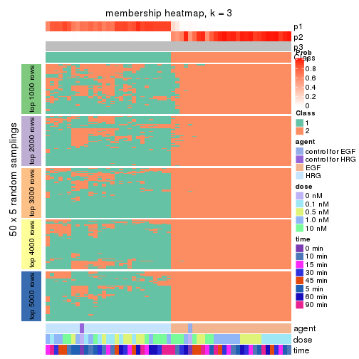</p>

</div>
<div id='tab-CV-NMF-membership-heatmap-3'>
<pre><code class="r">membership_heatmap(res, k = 4)
</code></pre>

<p></p>

</div>
<div id='tab-CV-NMF-membership-heatmap-4'>
<pre><code class="r">membership_heatmap(res, k = 5)
</code></pre>

<p></p>

</div>
<div id='tab-CV-NMF-membership-heatmap-5'>
<pre><code class="r">membership_heatmap(res, k = 6)
</code></pre>

<p></p>

</div>
</div>

As soon as we have had the classes for columns, we can look for signatures
which are significantly different between classes which can be candidate marks
for certain classes. Following are the heatmaps for signatures.


Signature heatmaps where rows are scaled:


<script>
$( function() {
	$( '#tabs-CV-NMF-get-signatures' ).tabs();
} );
</script>
<div id='tabs-CV-NMF-get-signatures'>
<ul>
<li><a href='#tab-CV-NMF-get-signatures-1'>k = 2</a></li>
<li><a href='#tab-CV-NMF-get-signatures-2'>k = 3</a></li>
<li><a href='#tab-CV-NMF-get-signatures-3'>k = 4</a></li>
<li><a href='#tab-CV-NMF-get-signatures-4'>k = 5</a></li>
<li><a href='#tab-CV-NMF-get-signatures-5'>k = 6</a></li>
</ul>
<div id='tab-CV-NMF-get-signatures-1'>
<pre><code class="r">get_signatures(res, k = 2)
</code></pre>

<p></p>

</div>
<div id='tab-CV-NMF-get-signatures-2'>
<pre><code class="r">get_signatures(res, k = 3)
</code></pre>

<p></p>

</div>
<div id='tab-CV-NMF-get-signatures-3'>
<pre><code class="r">get_signatures(res, k = 4)
</code></pre>

<p></p>

</div>
<div id='tab-CV-NMF-get-signatures-4'>
<pre><code class="r">get_signatures(res, k = 5)
</code></pre>

<p></p>

</div>
<div id='tab-CV-NMF-get-signatures-5'>
<pre><code class="r">get_signatures(res, k = 6)
</code></pre>

<p></p>

</div>
</div>


Signature heatmaps where rows are not scaled:


<script>
$( function() {
	$( '#tabs-CV-NMF-get-signatures-no-scale' ).tabs();
} );
</script>
<div id='tabs-CV-NMF-get-signatures-no-scale'>
<ul>
<li><a href='#tab-CV-NMF-get-signatures-no-scale-1'>k = 2</a></li>
<li><a href='#tab-CV-NMF-get-signatures-no-scale-2'>k = 3</a></li>
<li><a href='#tab-CV-NMF-get-signatures-no-scale-3'>k = 4</a></li>
<li><a href='#tab-CV-NMF-get-signatures-no-scale-4'>k = 5</a></li>
<li><a href='#tab-CV-NMF-get-signatures-no-scale-5'>k = 6</a></li>
</ul>
<div id='tab-CV-NMF-get-signatures-no-scale-1'>
<pre><code class="r">get_signatures(res, k = 2, scale_rows = FALSE)
</code></pre>

<p></p>

</div>
<div id='tab-CV-NMF-get-signatures-no-scale-2'>
<pre><code class="r">get_signatures(res, k = 3, scale_rows = FALSE)
</code></pre>

<p></p>

</div>
<div id='tab-CV-NMF-get-signatures-no-scale-3'>
<pre><code class="r">get_signatures(res, k = 4, scale_rows = FALSE)
</code></pre>

<p></p>

</div>
<div id='tab-CV-NMF-get-signatures-no-scale-4'>
<pre><code class="r">get_signatures(res, k = 5, scale_rows = FALSE)
</code></pre>

<p></p>

</div>
<div id='tab-CV-NMF-get-signatures-no-scale-5'>
<pre><code class="r">get_signatures(res, k = 6, scale_rows = FALSE)
</code></pre>

<p></p>

</div>
</div>


Compare the overlap of signatures from different k:

```r
compare_signatures(res)
```


`get_signature()` returns a data frame invisibly. TO get the list of signatures, the function
call should be assigned to a variable explicitly. In following code, if `plot` argument is set
to `FALSE`, no heatmap is plotted while only the differential analysis is performed.

```r
# code only for demonstration
tb = get_signature(res, k = ..., plot = FALSE)
```

An example of the output of `tb` is:

```
#>   which_row         fdr    mean_1    mean_2 scaled_mean_1 scaled_mean_2 km
#> 1        38 0.042760348  8.373488  9.131774    -0.5533452     0.5164555  1
#> 2        40 0.018707592  7.106213  8.469186    -0.6173731     0.5762149  1
#> 3        55 0.019134737 10.221463 11.207825    -0.6159697     0.5749050  1
#> 4        59 0.006059896  5.921854  7.869574    -0.6899429     0.6439467  1
#> 5        60 0.018055526  8.928898 10.211722    -0.6204761     0.5791110  1
#> 6        98 0.009384629 15.714769 14.887706     0.6635654    -0.6193277  2
...
```

The columns in `tb` are:

1. `which_row`: row indices corresponding to the input matrix.
2. `fdr`: FDR for the differential test. 
3. `mean_x`: The mean value in group x.
4. `scaled_mean_x`: The mean value in group x after rows are scaled.
5. `km`: Row groups if k-means clustering is applied to rows.


UMAP plot which shows how samples are separated.


<script>
$( function() {
	$( '#tabs-CV-NMF-dimension-reduction' ).tabs();
} );
</script>
<div id='tabs-CV-NMF-dimension-reduction'>
<ul>
<li><a href='#tab-CV-NMF-dimension-reduction-1'>k = 2</a></li>
<li><a href='#tab-CV-NMF-dimension-reduction-2'>k = 3</a></li>
<li><a href='#tab-CV-NMF-dimension-reduction-3'>k = 4</a></li>
<li><a href='#tab-CV-NMF-dimension-reduction-4'>k = 5</a></li>
<li><a href='#tab-CV-NMF-dimension-reduction-5'>k = 6</a></li>
</ul>
<div id='tab-CV-NMF-dimension-reduction-1'>
<pre><code class="r">dimension_reduction(res, k = 2, method = &quot;UMAP&quot;)
</code></pre>

<p></p>

</div>
<div id='tab-CV-NMF-dimension-reduction-2'>
<pre><code class="r">dimension_reduction(res, k = 3, method = &quot;UMAP&quot;)
</code></pre>

<p></p>

</div>
<div id='tab-CV-NMF-dimension-reduction-3'>
<pre><code class="r">dimension_reduction(res, k = 4, method = &quot;UMAP&quot;)
</code></pre>

<p></p>

</div>
<div id='tab-CV-NMF-dimension-reduction-4'>
<pre><code class="r">dimension_reduction(res, k = 5, method = &quot;UMAP&quot;)
</code></pre>

<p></p>

</div>
<div id='tab-CV-NMF-dimension-reduction-5'>
<pre><code class="r">dimension_reduction(res, k = 6, method = &quot;UMAP&quot;)
</code></pre>

<p></p>

</div>
</div>


Following heatmap shows how subgroups are split when increasing `k`:

```r
collect_classes(res)
```


Test correlation between subgroups and known annotations. If the known
annotation is numeric, one-way ANOVA test is applied, and if the known
annotation is discrete, chi-squared contingency table test is applied.

```r
test_to_known_factors(res)
```

```
#>         n agent(p)  dose(p) time(p) k
#> CV:NMF 57 2.57e-12 0.999568   1.000 2
#> CV:NMF 57 2.57e-12 0.999568   1.000 3
#> CV:NMF 33 1.61e-08 0.000296   0.335 4
#> CV:NMF 32 1.13e-07 0.000173   0.885 5
#> CV:NMF 28 8.32e-07 0.001205   0.726 6
```


If matrix rows can be associated to genes, consider to use `functional_enrichment(res,
...)` to perform function enrichment for the signature genes. See [this vignette](http://bioconductor.org/packages/devel/bioc/vignettes/cola/inst/doc/functional_enrichment.html) for more detailed explanations.


 

---------------------------------------------------


### MAD:hclust**


The object with results only for a single top-value method and a single partition method 
can be extracted as:

```r
res = res_list["MAD", "hclust"]
# you can also extract it by
# res = res_list["MAD:hclust"]
```

A summary of `res` and all the functions that can be applied to it:

```r
res
```

```
#> A 'ConsensusPartition' object with k = 2, 3, 4, 5, 6.
#>   On a matrix with 21163 rows and 57 columns.
#>   Top rows (1000, 2000, 3000, 4000, 5000) are extracted by 'MAD' method.
#>   Subgroups are detected by 'hclust' method.
#>   Performed in total 1250 partitions by row resampling.
#>   Best k for subgroups seems to be 2.
#> 
#> Following methods can be applied to this 'ConsensusPartition' object:
#>  [1] "cola_report"             "collect_classes"         "collect_plots"          
#>  [4] "collect_stats"           "colnames"                "compare_signatures"     
#>  [7] "consensus_heatmap"       "dimension_reduction"     "functional_enrichment"  
#> [10] "get_anno_col"            "get_anno"                "get_classes"            
#> [13] "get_consensus"           "get_matrix"              "get_membership"         
#> [16] "get_param"               "get_signatures"          "get_stats"              
#> [19] "is_best_k"               "is_stable_k"             "membership_heatmap"     
#> [22] "ncol"                    "nrow"                    "plot_ecdf"              
#> [25] "rownames"                "select_partition_number" "show"                   
#> [28] "suggest_best_k"          "test_to_known_factors"
```

`collect_plots()` function collects all the plots made from `res` for all `k` (number of partitions)
into one single page to provide an easy and fast comparison between different `k`.

```r
collect_plots(res)
```


The plots are:

- The first row: a plot of the ECDF (empirical cumulative distribution
  function) curves of the consensus matrix for each `k` and the heatmap of
  predicted classes for each `k`.
- The second row: heatmaps of the consensus matrix for each `k`.
- The third row: heatmaps of the membership matrix for each `k`.
- The fouth row: heatmaps of the signatures for each `k`.

All the plots in panels can be made by individual functions and they are
plotted later in this section.

`select_partition_number()` produces several plots showing different
statistics for choosing "optimized" `k`. There are following statistics:

- ECDF curves of the consensus matrix for each `k`;
- 1-PAC. [The PAC
  score](https://en.wikipedia.org/wiki/Consensus_clustering#Over-interpretation_potential_of_consensus_clustering)
  measures the proportion of the ambiguous subgrouping.
- Mean silhouette score.
- Concordance. The mean probability of fiting the consensus class ids in all
  partitions.
- Area increased. Denote $A_k$ as the area under the ECDF curve for current
  `k`, the area increased is defined as $A_k - A_{k-1}$.
- Rand index. The percent of pairs of samples that are both in a same cluster
  or both are not in a same cluster in the partition of k and k-1.
- Jaccard index. The ratio of pairs of samples are both in a same cluster in
  the partition of k and k-1 and the pairs of samples are both in a same
  cluster in the partition k or k-1.

The detailed explanations of these statistics can be found in [the _cola_
vignette](http://bioconductor.org/packages/devel/bioc/vignettes/cola/inst/doc/cola.html#toc_13).

Generally speaking, lower PAC score, higher mean silhouette score or higher
concordance corresponds to better partition. Rand index and Jaccard index
measure how similar the current partition is compared to partition with `k-1`.
If they are too similar, we won't accept `k` is better than `k-1`.

```r
select_partition_number(res)
```


The numeric values for all these statistics can be obtained by `get_stats()`.

```r
get_stats(res)
```

```
#>   k 1-PAC mean_silhouette concordance area_increased  Rand Jaccard
#> 2 2 1.000           0.988       0.991         0.5075 0.491   0.491
#> 3 3 0.811           0.869       0.910         0.1303 0.982   0.964
#> 4 4 0.769           0.788       0.856         0.1281 0.883   0.753
#> 5 5 0.700           0.725       0.830         0.0568 0.974   0.926
#> 6 6 0.708           0.662       0.802         0.0408 0.992   0.975
```

`suggest_best_k()` suggests the best $k$ based on these statistics. The rules are as follows:

- All $k$ with Jaccard index larger than 0.95 are removed because increasing
  $k$ does not provide enough extra information. If all $k$ are removed, it is
  marked as no subgroup is detected.
- For all $k$ with 1-PAC score larger than 0.9, the maximal $k$ is taken as
  the best $k$, and other $k$ are marked as optional $k$.
- If it does not fit the second rule. The $k$ with the maximal vote of the
  highest 1-PAC score, highest mean silhouette, and highest concordance is
  taken as the best $k$.

```r
suggest_best_k(res)
```

```
#> [1] 2
```


Following shows the table of the partitions (You need to click the **show/hide
code output** link to see it). The membership matrix (columns with name `p*`)
is inferred by
[`clue::cl_consensus()`](https://www.rdocumentation.org/link/cl_consensus?package=clue)
function with the `SE` method. Basically the value in the membership matrix
represents the probability to belong to a certain group. The finall class
label for an item is determined with the group with highest probability it
belongs to.

In `get_classes()` function, the entropy is calculated from the membership
matrix and the silhouette score is calculated from the consensus matrix.


<script>
$( function() {
	$( '#tabs-MAD-hclust-get-classes' ).tabs();
} );
</script>
<div id='tabs-MAD-hclust-get-classes'>
<ul>
<li><a href='#tab-MAD-hclust-get-classes-1'>k = 2</a></li>
<li><a href='#tab-MAD-hclust-get-classes-2'>k = 3</a></li>
<li><a href='#tab-MAD-hclust-get-classes-3'>k = 4</a></li>
<li><a href='#tab-MAD-hclust-get-classes-4'>k = 5</a></li>
<li><a href='#tab-MAD-hclust-get-classes-5'>k = 6</a></li>
</ul>

<div id='tab-MAD-hclust-get-classes-1'>
<p><a id='tab-MAD-hclust-get-classes-1-a' style='color:#0366d6' href='#'>show/hide code output</a></p>
<pre><code class="r">cbind(get_classes(res, k = 2), get_membership(res, k = 2))
</code></pre>

<pre><code>#&gt;           class entropy silhouette    p1    p2
#&gt; GSM148516     2  0.0376      0.993 0.004 0.996
#&gt; GSM148517     1  0.1633      0.983 0.976 0.024
#&gt; GSM148518     2  0.0000      0.996 0.000 1.000
#&gt; GSM148519     2  0.0000      0.996 0.000 1.000
#&gt; GSM148520     2  0.0000      0.996 0.000 1.000
#&gt; GSM148521     2  0.0000      0.996 0.000 1.000
#&gt; GSM148522     2  0.0000      0.996 0.000 1.000
#&gt; GSM148523     2  0.0000      0.996 0.000 1.000
#&gt; GSM148524     2  0.0000      0.996 0.000 1.000
#&gt; GSM148525     2  0.0000      0.996 0.000 1.000
#&gt; GSM148526     2  0.0000      0.996 0.000 1.000
#&gt; GSM148527     2  0.0000      0.996 0.000 1.000
#&gt; GSM148528     2  0.0000      0.996 0.000 1.000
#&gt; GSM148529     2  0.0000      0.996 0.000 1.000
#&gt; GSM148530     2  0.0000      0.996 0.000 1.000
#&gt; GSM148531     2  0.0000      0.996 0.000 1.000
#&gt; GSM148532     2  0.0000      0.996 0.000 1.000
#&gt; GSM148533     2  0.0000      0.996 0.000 1.000
#&gt; GSM148534     2  0.0000      0.996 0.000 1.000
#&gt; GSM148535     2  0.0000      0.996 0.000 1.000
#&gt; GSM148536     2  0.0000      0.996 0.000 1.000
#&gt; GSM148537     2  0.0000      0.996 0.000 1.000
#&gt; GSM148538     2  0.0000      0.996 0.000 1.000
#&gt; GSM148539     2  0.0000      0.996 0.000 1.000
#&gt; GSM148540     2  0.0000      0.996 0.000 1.000
#&gt; GSM148541     2  0.0376      0.993 0.004 0.996
#&gt; GSM148542     2  0.3733      0.922 0.072 0.928
#&gt; GSM148543     2  0.1184      0.982 0.016 0.984
#&gt; GSM148544     2  0.0000      0.996 0.000 1.000
#&gt; GSM148545     1  0.1414      0.985 0.980 0.020
#&gt; GSM148546     1  0.1843      0.982 0.972 0.028
#&gt; GSM148547     1  0.1843      0.982 0.972 0.028
#&gt; GSM148548     1  0.0938      0.988 0.988 0.012
#&gt; GSM148549     1  0.0938      0.988 0.988 0.012
#&gt; GSM148550     1  0.0000      0.986 1.000 0.000
#&gt; GSM148551     1  0.0938      0.987 0.988 0.012
#&gt; GSM148552     1  0.1633      0.983 0.976 0.024
#&gt; GSM148553     1  0.1633      0.984 0.976 0.024
#&gt; GSM148554     1  0.0376      0.987 0.996 0.004
#&gt; GSM148555     1  0.0672      0.988 0.992 0.008
#&gt; GSM148556     1  0.0376      0.987 0.996 0.004
#&gt; GSM148557     1  0.0376      0.987 0.996 0.004
#&gt; GSM148558     1  0.0000      0.986 1.000 0.000
#&gt; GSM148559     1  0.2043      0.978 0.968 0.032
#&gt; GSM148560     1  0.1414      0.985 0.980 0.020
#&gt; GSM148561     1  0.3584      0.946 0.932 0.068
#&gt; GSM148562     1  0.2603      0.964 0.956 0.044
#&gt; GSM148563     1  0.0000      0.986 1.000 0.000
#&gt; GSM148564     1  0.1184      0.985 0.984 0.016
#&gt; GSM148565     1  0.0000      0.986 1.000 0.000
#&gt; GSM148566     1  0.0938      0.987 0.988 0.012
#&gt; GSM148567     1  0.0938      0.986 0.988 0.012
#&gt; GSM148568     1  0.0938      0.987 0.988 0.012
#&gt; GSM148569     1  0.0376      0.987 0.996 0.004
#&gt; GSM148570     1  0.0000      0.986 1.000 0.000
#&gt; GSM148571     1  0.0000      0.986 1.000 0.000
#&gt; GSM148572     1  0.0000      0.986 1.000 0.000
</code></pre>

<script>
$('#tab-MAD-hclust-get-classes-1-a').parent().next().next().hide();
$('#tab-MAD-hclust-get-classes-1-a').click(function(){
  $('#tab-MAD-hclust-get-classes-1-a').parent().next().next().toggle();
  return(false);
});
</script>
</div>

<div id='tab-MAD-hclust-get-classes-2'>
<p><a id='tab-MAD-hclust-get-classes-2-a' style='color:#0366d6' href='#'>show/hide code output</a></p>
<pre><code class="r">cbind(get_classes(res, k = 3), get_membership(res, k = 3))
</code></pre>

<pre><code>#&gt;           class entropy silhouette    p1    p2    p3
#&gt; GSM148516     2  0.1289      0.971 0.000 0.968 0.032
#&gt; GSM148517     3  0.3619      0.000 0.136 0.000 0.864
#&gt; GSM148518     2  0.0000      0.992 0.000 1.000 0.000
#&gt; GSM148519     2  0.0000      0.992 0.000 1.000 0.000
#&gt; GSM148520     2  0.0424      0.989 0.000 0.992 0.008
#&gt; GSM148521     2  0.0237      0.991 0.000 0.996 0.004
#&gt; GSM148522     2  0.0000      0.992 0.000 1.000 0.000
#&gt; GSM148523     2  0.0000      0.992 0.000 1.000 0.000
#&gt; GSM148524     2  0.0000      0.992 0.000 1.000 0.000
#&gt; GSM148525     2  0.0000      0.992 0.000 1.000 0.000
#&gt; GSM148526     2  0.0000      0.992 0.000 1.000 0.000
#&gt; GSM148527     2  0.0000      0.992 0.000 1.000 0.000
#&gt; GSM148528     2  0.0237      0.991 0.000 0.996 0.004
#&gt; GSM148529     2  0.0000      0.992 0.000 1.000 0.000
#&gt; GSM148530     2  0.0000      0.992 0.000 1.000 0.000
#&gt; GSM148531     2  0.0000      0.992 0.000 1.000 0.000
#&gt; GSM148532     2  0.0000      0.992 0.000 1.000 0.000
#&gt; GSM148533     2  0.0000      0.992 0.000 1.000 0.000
#&gt; GSM148534     2  0.0000      0.992 0.000 1.000 0.000
#&gt; GSM148535     2  0.0000      0.992 0.000 1.000 0.000
#&gt; GSM148536     2  0.0000      0.992 0.000 1.000 0.000
#&gt; GSM148537     2  0.0000      0.992 0.000 1.000 0.000
#&gt; GSM148538     2  0.0000      0.992 0.000 1.000 0.000
#&gt; GSM148539     2  0.0424      0.988 0.000 0.992 0.008
#&gt; GSM148540     2  0.0424      0.989 0.000 0.992 0.008
#&gt; GSM148541     2  0.0592      0.986 0.000 0.988 0.012
#&gt; GSM148542     2  0.3472      0.896 0.040 0.904 0.056
#&gt; GSM148543     2  0.1399      0.971 0.004 0.968 0.028
#&gt; GSM148544     2  0.0592      0.986 0.000 0.988 0.012
#&gt; GSM148545     1  0.6095      0.495 0.608 0.000 0.392
#&gt; GSM148546     1  0.5115      0.758 0.768 0.004 0.228
#&gt; GSM148547     1  0.4978      0.762 0.780 0.004 0.216
#&gt; GSM148548     1  0.2772      0.830 0.916 0.004 0.080
#&gt; GSM148549     1  0.2496      0.831 0.928 0.004 0.068
#&gt; GSM148550     1  0.3116      0.828 0.892 0.000 0.108
#&gt; GSM148551     1  0.3193      0.834 0.896 0.004 0.100
#&gt; GSM148552     1  0.5728      0.694 0.720 0.008 0.272
#&gt; GSM148553     1  0.5536      0.741 0.752 0.012 0.236
#&gt; GSM148554     1  0.3349      0.823 0.888 0.004 0.108
#&gt; GSM148555     1  0.2945      0.833 0.908 0.004 0.088
#&gt; GSM148556     1  0.2860      0.828 0.912 0.004 0.084
#&gt; GSM148557     1  0.3272      0.826 0.892 0.004 0.104
#&gt; GSM148558     1  0.3879      0.815 0.848 0.000 0.152
#&gt; GSM148559     1  0.6228      0.626 0.672 0.012 0.316
#&gt; GSM148560     1  0.5650      0.649 0.688 0.000 0.312
#&gt; GSM148561     1  0.4915      0.803 0.832 0.036 0.132
#&gt; GSM148562     1  0.4209      0.810 0.860 0.020 0.120
#&gt; GSM148563     1  0.3340      0.821 0.880 0.000 0.120
#&gt; GSM148564     1  0.3454      0.823 0.888 0.008 0.104
#&gt; GSM148565     1  0.3619      0.808 0.864 0.000 0.136
#&gt; GSM148566     1  0.4842      0.751 0.776 0.000 0.224
#&gt; GSM148567     1  0.3377      0.823 0.896 0.012 0.092
#&gt; GSM148568     1  0.3043      0.830 0.908 0.008 0.084
#&gt; GSM148569     1  0.3112      0.822 0.900 0.004 0.096
#&gt; GSM148570     1  0.3192      0.813 0.888 0.000 0.112
#&gt; GSM148571     1  0.3686      0.809 0.860 0.000 0.140
#&gt; GSM148572     1  0.3551      0.811 0.868 0.000 0.132
</code></pre>

<script>
$('#tab-MAD-hclust-get-classes-2-a').parent().next().next().hide();
$('#tab-MAD-hclust-get-classes-2-a').click(function(){
  $('#tab-MAD-hclust-get-classes-2-a').parent().next().next().toggle();
  return(false);
});
</script>
</div>

<div id='tab-MAD-hclust-get-classes-3'>
<p><a id='tab-MAD-hclust-get-classes-3-a' style='color:#0366d6' href='#'>show/hide code output</a></p>
<pre><code class="r">cbind(get_classes(res, k = 4), get_membership(res, k = 4))
</code></pre>

<pre><code>#&gt;           class entropy silhouette    p1    p2    p3    p4
#&gt; GSM148516     2  0.2089      0.943 0.000 0.932 0.048 0.020
#&gt; GSM148517     3  0.3743      0.000 0.160 0.000 0.824 0.016
#&gt; GSM148518     2  0.0000      0.986 0.000 1.000 0.000 0.000
#&gt; GSM148519     2  0.0000      0.986 0.000 1.000 0.000 0.000
#&gt; GSM148520     2  0.0592      0.980 0.000 0.984 0.016 0.000
#&gt; GSM148521     2  0.0188      0.985 0.000 0.996 0.004 0.000
#&gt; GSM148522     2  0.0000      0.986 0.000 1.000 0.000 0.000
#&gt; GSM148523     2  0.0000      0.986 0.000 1.000 0.000 0.000
#&gt; GSM148524     2  0.0000      0.986 0.000 1.000 0.000 0.000
#&gt; GSM148525     2  0.0000      0.986 0.000 1.000 0.000 0.000
#&gt; GSM148526     2  0.0188      0.985 0.000 0.996 0.000 0.004
#&gt; GSM148527     2  0.0000      0.986 0.000 1.000 0.000 0.000
#&gt; GSM148528     2  0.0188      0.985 0.000 0.996 0.004 0.000
#&gt; GSM148529     2  0.0000      0.986 0.000 1.000 0.000 0.000
#&gt; GSM148530     2  0.0000      0.986 0.000 1.000 0.000 0.000
#&gt; GSM148531     2  0.0000      0.986 0.000 1.000 0.000 0.000
#&gt; GSM148532     2  0.0000      0.986 0.000 1.000 0.000 0.000
#&gt; GSM148533     2  0.0000      0.986 0.000 1.000 0.000 0.000
#&gt; GSM148534     2  0.0000      0.986 0.000 1.000 0.000 0.000
#&gt; GSM148535     2  0.0000      0.986 0.000 1.000 0.000 0.000
#&gt; GSM148536     2  0.0000      0.986 0.000 1.000 0.000 0.000
#&gt; GSM148537     2  0.0000      0.986 0.000 1.000 0.000 0.000
#&gt; GSM148538     2  0.0000      0.986 0.000 1.000 0.000 0.000
#&gt; GSM148539     2  0.0967      0.976 0.004 0.976 0.004 0.016
#&gt; GSM148540     2  0.1174      0.971 0.000 0.968 0.020 0.012
#&gt; GSM148541     2  0.1362      0.969 0.004 0.964 0.020 0.012
#&gt; GSM148542     2  0.3668      0.867 0.056 0.872 0.056 0.016
#&gt; GSM148543     2  0.1871      0.957 0.012 0.948 0.024 0.016
#&gt; GSM148544     2  0.1182      0.971 0.000 0.968 0.016 0.016
#&gt; GSM148545     1  0.5639      0.462 0.636 0.000 0.324 0.040
#&gt; GSM148546     1  0.3377      0.718 0.848 0.000 0.140 0.012
#&gt; GSM148547     1  0.3324      0.720 0.852 0.000 0.136 0.012
#&gt; GSM148548     1  0.3384      0.698 0.860 0.000 0.024 0.116
#&gt; GSM148549     1  0.3659      0.683 0.840 0.000 0.024 0.136
#&gt; GSM148550     1  0.3497      0.680 0.852 0.000 0.024 0.124
#&gt; GSM148551     1  0.4194      0.626 0.800 0.000 0.028 0.172
#&gt; GSM148552     1  0.4514      0.671 0.788 0.004 0.176 0.032
#&gt; GSM148553     1  0.4331      0.705 0.808 0.004 0.152 0.036
#&gt; GSM148554     1  0.3876      0.706 0.836 0.000 0.040 0.124
#&gt; GSM148555     1  0.3156      0.704 0.884 0.000 0.048 0.068
#&gt; GSM148556     1  0.3428      0.671 0.844 0.000 0.012 0.144
#&gt; GSM148557     1  0.3495      0.685 0.844 0.000 0.016 0.140
#&gt; GSM148558     4  0.5592      0.386 0.404 0.000 0.024 0.572
#&gt; GSM148559     1  0.6644      0.501 0.624 0.004 0.248 0.124
#&gt; GSM148560     1  0.6181      0.560 0.668 0.000 0.204 0.128
#&gt; GSM148561     1  0.6730      0.337 0.628 0.004 0.156 0.212
#&gt; GSM148562     4  0.6929      0.404 0.440 0.000 0.108 0.452
#&gt; GSM148563     4  0.5754      0.654 0.316 0.000 0.048 0.636
#&gt; GSM148564     4  0.5823      0.644 0.344 0.004 0.036 0.616
#&gt; GSM148565     4  0.3105      0.700 0.140 0.000 0.004 0.856
#&gt; GSM148566     1  0.5842      0.647 0.704 0.000 0.168 0.128
#&gt; GSM148567     4  0.5959      0.621 0.388 0.000 0.044 0.568
#&gt; GSM148568     4  0.6182      0.570 0.428 0.000 0.052 0.520
#&gt; GSM148569     4  0.5213      0.682 0.328 0.000 0.020 0.652
#&gt; GSM148570     4  0.4139      0.716 0.176 0.000 0.024 0.800
#&gt; GSM148571     4  0.3306      0.714 0.156 0.000 0.004 0.840
#&gt; GSM148572     4  0.3088      0.687 0.128 0.000 0.008 0.864
</code></pre>

<script>
$('#tab-MAD-hclust-get-classes-3-a').parent().next().next().hide();
$('#tab-MAD-hclust-get-classes-3-a').click(function(){
  $('#tab-MAD-hclust-get-classes-3-a').parent().next().next().toggle();
  return(false);
});
</script>
</div>

<div id='tab-MAD-hclust-get-classes-4'>
<p><a id='tab-MAD-hclust-get-classes-4-a' style='color:#0366d6' href='#'>show/hide code output</a></p>
<pre><code class="r">cbind(get_classes(res, k = 5), get_membership(res, k = 5))
</code></pre>

<pre><code>#&gt;           class entropy silhouette    p1    p2    p3    p4    p5
#&gt; GSM148516     2  0.4375     0.7920 0.000 0.772 0.156 0.008 0.064
#&gt; GSM148517     3  0.4872     0.0000 0.120 0.000 0.720 0.000 0.160
#&gt; GSM148518     2  0.0000     0.9598 0.000 1.000 0.000 0.000 0.000
#&gt; GSM148519     2  0.0000     0.9598 0.000 1.000 0.000 0.000 0.000
#&gt; GSM148520     2  0.0912     0.9505 0.000 0.972 0.012 0.000 0.016
#&gt; GSM148521     2  0.0162     0.9593 0.000 0.996 0.004 0.000 0.000
#&gt; GSM148522     2  0.0162     0.9593 0.000 0.996 0.004 0.000 0.000
#&gt; GSM148523     2  0.0162     0.9592 0.000 0.996 0.004 0.000 0.000
#&gt; GSM148524     2  0.0000     0.9598 0.000 1.000 0.000 0.000 0.000
#&gt; GSM148525     2  0.0000     0.9598 0.000 1.000 0.000 0.000 0.000
#&gt; GSM148526     2  0.0404     0.9568 0.000 0.988 0.012 0.000 0.000
#&gt; GSM148527     2  0.0162     0.9593 0.000 0.996 0.004 0.000 0.000
#&gt; GSM148528     2  0.0290     0.9581 0.000 0.992 0.008 0.000 0.000
#&gt; GSM148529     2  0.0000     0.9598 0.000 1.000 0.000 0.000 0.000
#&gt; GSM148530     2  0.0000     0.9598 0.000 1.000 0.000 0.000 0.000
#&gt; GSM148531     2  0.0000     0.9598 0.000 1.000 0.000 0.000 0.000
#&gt; GSM148532     2  0.0000     0.9598 0.000 1.000 0.000 0.000 0.000
#&gt; GSM148533     2  0.0162     0.9592 0.000 0.996 0.004 0.000 0.000
#&gt; GSM148534     2  0.0000     0.9598 0.000 1.000 0.000 0.000 0.000
#&gt; GSM148535     2  0.0000     0.9598 0.000 1.000 0.000 0.000 0.000
#&gt; GSM148536     2  0.0451     0.9573 0.000 0.988 0.008 0.000 0.004
#&gt; GSM148537     2  0.0290     0.9583 0.000 0.992 0.008 0.000 0.000
#&gt; GSM148538     2  0.0000     0.9598 0.000 1.000 0.000 0.000 0.000
#&gt; GSM148539     2  0.2189     0.9102 0.000 0.904 0.084 0.000 0.012
#&gt; GSM148540     2  0.2722     0.8896 0.000 0.872 0.108 0.000 0.020
#&gt; GSM148541     2  0.3529     0.8619 0.004 0.836 0.120 0.004 0.036
#&gt; GSM148542     2  0.4628     0.7833 0.036 0.792 0.108 0.008 0.056
#&gt; GSM148543     2  0.3218     0.8713 0.012 0.848 0.124 0.000 0.016
#&gt; GSM148544     2  0.2625     0.8919 0.000 0.876 0.108 0.000 0.016
#&gt; GSM148545     1  0.6327    -0.3656 0.484 0.000 0.168 0.000 0.348
#&gt; GSM148546     1  0.3845     0.5321 0.812 0.000 0.060 0.004 0.124
#&gt; GSM148547     1  0.3798     0.5406 0.816 0.000 0.060 0.004 0.120
#&gt; GSM148548     1  0.3152     0.6692 0.868 0.000 0.016 0.084 0.032
#&gt; GSM148549     1  0.3325     0.6681 0.852 0.000 0.012 0.104 0.032
#&gt; GSM148550     1  0.3834     0.6538 0.816 0.000 0.008 0.124 0.052
#&gt; GSM148551     1  0.3818     0.6385 0.812 0.000 0.016 0.144 0.028
#&gt; GSM148552     1  0.5040     0.3874 0.716 0.004 0.072 0.008 0.200
#&gt; GSM148553     1  0.4908     0.4812 0.748 0.004 0.064 0.020 0.164
#&gt; GSM148554     1  0.3658     0.6681 0.832 0.000 0.016 0.116 0.036
#&gt; GSM148555     1  0.3426     0.6348 0.852 0.000 0.012 0.052 0.084
#&gt; GSM148556     1  0.3022     0.6616 0.848 0.000 0.004 0.136 0.012
#&gt; GSM148557     1  0.3127     0.6670 0.848 0.000 0.004 0.128 0.020
#&gt; GSM148558     4  0.5117     0.3211 0.348 0.000 0.016 0.612 0.024
#&gt; GSM148559     5  0.4501     0.6300 0.276 0.000 0.020 0.008 0.696
#&gt; GSM148560     5  0.4774     0.7009 0.340 0.000 0.024 0.004 0.632
#&gt; GSM148561     1  0.7012     0.0782 0.500 0.000 0.088 0.080 0.332
#&gt; GSM148562     4  0.7825     0.3858 0.340 0.000 0.076 0.372 0.212
#&gt; GSM148563     4  0.6200     0.6128 0.252 0.000 0.036 0.612 0.100
#&gt; GSM148564     4  0.6294     0.6261 0.252 0.004 0.020 0.600 0.124
#&gt; GSM148565     4  0.2243     0.6567 0.056 0.000 0.012 0.916 0.016
#&gt; GSM148566     5  0.5644     0.4973 0.472 0.000 0.024 0.032 0.472
#&gt; GSM148567     4  0.6331     0.5983 0.300 0.000 0.008 0.540 0.152
#&gt; GSM148568     4  0.6591     0.5686 0.312 0.000 0.016 0.516 0.156
#&gt; GSM148569     4  0.5267     0.6674 0.232 0.000 0.004 0.672 0.092
#&gt; GSM148570     4  0.3707     0.6774 0.108 0.000 0.008 0.828 0.056
#&gt; GSM148571     4  0.2748     0.6744 0.096 0.000 0.008 0.880 0.016
#&gt; GSM148572     4  0.1522     0.6464 0.044 0.000 0.012 0.944 0.000
</code></pre>

<script>
$('#tab-MAD-hclust-get-classes-4-a').parent().next().next().hide();
$('#tab-MAD-hclust-get-classes-4-a').click(function(){
  $('#tab-MAD-hclust-get-classes-4-a').parent().next().next().toggle();
  return(false);
});
</script>
</div>

<div id='tab-MAD-hclust-get-classes-5'>
<p><a id='tab-MAD-hclust-get-classes-5-a' style='color:#0366d6' href='#'>show/hide code output</a></p>
<pre><code class="r">cbind(get_classes(res, k = 6), get_membership(res, k = 6))
</code></pre>

<pre><code>#&gt;           class entropy silhouette    p1    p2    p3    p4    p5    p6
#&gt; GSM148516     2  0.4450      0.406 0.000 0.528 0.448 0.000 0.004 0.020
#&gt; GSM148517     6  0.3435      0.000 0.060 0.000 0.000 0.000 0.136 0.804
#&gt; GSM148518     2  0.0000      0.925 0.000 1.000 0.000 0.000 0.000 0.000
#&gt; GSM148519     2  0.0146      0.925 0.000 0.996 0.004 0.000 0.000 0.000
#&gt; GSM148520     2  0.1464      0.906 0.000 0.944 0.036 0.000 0.016 0.004
#&gt; GSM148521     2  0.0260      0.925 0.000 0.992 0.008 0.000 0.000 0.000
#&gt; GSM148522     2  0.0146      0.925 0.000 0.996 0.004 0.000 0.000 0.000
#&gt; GSM148523     2  0.0260      0.925 0.000 0.992 0.008 0.000 0.000 0.000
#&gt; GSM148524     2  0.0291      0.926 0.000 0.992 0.004 0.000 0.000 0.004
#&gt; GSM148525     2  0.0146      0.925 0.000 0.996 0.004 0.000 0.000 0.000
#&gt; GSM148526     2  0.0458      0.922 0.000 0.984 0.016 0.000 0.000 0.000
#&gt; GSM148527     2  0.0146      0.925 0.000 0.996 0.004 0.000 0.000 0.000
#&gt; GSM148528     2  0.0632      0.921 0.000 0.976 0.024 0.000 0.000 0.000
#&gt; GSM148529     2  0.0000      0.925 0.000 1.000 0.000 0.000 0.000 0.000
#&gt; GSM148530     2  0.0000      0.925 0.000 1.000 0.000 0.000 0.000 0.000
#&gt; GSM148531     2  0.0000      0.925 0.000 1.000 0.000 0.000 0.000 0.000
#&gt; GSM148532     2  0.0146      0.925 0.000 0.996 0.004 0.000 0.000 0.000
#&gt; GSM148533     2  0.0260      0.925 0.000 0.992 0.008 0.000 0.000 0.000
#&gt; GSM148534     2  0.0000      0.925 0.000 1.000 0.000 0.000 0.000 0.000
#&gt; GSM148535     2  0.0000      0.925 0.000 1.000 0.000 0.000 0.000 0.000
#&gt; GSM148536     2  0.1010      0.915 0.000 0.960 0.036 0.000 0.004 0.000
#&gt; GSM148537     2  0.0260      0.925 0.000 0.992 0.008 0.000 0.000 0.000
#&gt; GSM148538     2  0.0146      0.925 0.000 0.996 0.004 0.000 0.000 0.000
#&gt; GSM148539     2  0.2300      0.847 0.000 0.856 0.144 0.000 0.000 0.000
#&gt; GSM148540     2  0.3074      0.799 0.000 0.792 0.200 0.000 0.004 0.004
#&gt; GSM148541     2  0.3665      0.706 0.000 0.696 0.296 0.000 0.004 0.004
#&gt; GSM148542     2  0.4962      0.500 0.012 0.608 0.320 0.000 0.000 0.060
#&gt; GSM148543     2  0.3519      0.765 0.008 0.752 0.232 0.000 0.000 0.008
#&gt; GSM148544     2  0.2964      0.798 0.000 0.792 0.204 0.000 0.000 0.004
#&gt; GSM148545     1  0.5901     -0.216 0.408 0.000 0.000 0.000 0.388 0.204
#&gt; GSM148546     1  0.4089      0.631 0.768 0.000 0.008 0.004 0.152 0.068
#&gt; GSM148547     1  0.4052      0.634 0.772 0.000 0.008 0.004 0.148 0.068
#&gt; GSM148548     1  0.2351      0.689 0.908 0.000 0.008 0.040 0.028 0.016
#&gt; GSM148549     1  0.2503      0.682 0.896 0.000 0.008 0.060 0.024 0.012
#&gt; GSM148550     1  0.3606      0.672 0.832 0.000 0.012 0.084 0.052 0.020
#&gt; GSM148551     1  0.3410      0.632 0.836 0.000 0.012 0.108 0.024 0.020
#&gt; GSM148552     1  0.5234      0.534 0.660 0.004 0.012 0.004 0.216 0.104
#&gt; GSM148553     1  0.5267      0.574 0.692 0.004 0.020 0.016 0.180 0.088
#&gt; GSM148554     1  0.3161      0.699 0.856 0.000 0.004 0.080 0.036 0.024
#&gt; GSM148555     1  0.3920      0.626 0.820 0.000 0.044 0.028 0.080 0.028
#&gt; GSM148556     1  0.2597      0.682 0.880 0.000 0.004 0.088 0.020 0.008
#&gt; GSM148557     1  0.2697      0.692 0.876 0.000 0.004 0.088 0.020 0.012
#&gt; GSM148558     4  0.5335      0.171 0.368 0.000 0.012 0.560 0.032 0.028
#&gt; GSM148559     5  0.2988      0.627 0.140 0.000 0.004 0.004 0.836 0.016
#&gt; GSM148560     5  0.4167      0.672 0.176 0.000 0.028 0.004 0.760 0.032
#&gt; GSM148561     3  0.8067      0.000 0.308 0.000 0.348 0.076 0.184 0.084
#&gt; GSM148562     4  0.8361     -0.192 0.280 0.000 0.164 0.340 0.124 0.092
#&gt; GSM148563     4  0.6235      0.391 0.172 0.000 0.096 0.632 0.048 0.052
#&gt; GSM148564     4  0.6573      0.427 0.228 0.004 0.064 0.576 0.104 0.024
#&gt; GSM148565     4  0.2890      0.566 0.036 0.000 0.024 0.884 0.024 0.032
#&gt; GSM148566     5  0.5938      0.476 0.292 0.000 0.096 0.008 0.568 0.036
#&gt; GSM148567     4  0.6852      0.375 0.260 0.000 0.088 0.524 0.104 0.024
#&gt; GSM148568     4  0.7064      0.320 0.268 0.000 0.100 0.496 0.112 0.024
#&gt; GSM148569     4  0.5679      0.494 0.240 0.000 0.056 0.628 0.068 0.008
#&gt; GSM148570     4  0.4155      0.556 0.092 0.000 0.036 0.804 0.036 0.032
#&gt; GSM148571     4  0.3296      0.566 0.084 0.000 0.024 0.852 0.020 0.020
#&gt; GSM148572     4  0.2622      0.561 0.040 0.000 0.028 0.896 0.012 0.024
</code></pre>

<script>
$('#tab-MAD-hclust-get-classes-5-a').parent().next().next().hide();
$('#tab-MAD-hclust-get-classes-5-a').click(function(){
  $('#tab-MAD-hclust-get-classes-5-a').parent().next().next().toggle();
  return(false);
});
</script>
</div>
</div>

Heatmaps for the consensus matrix. It visualizes the probability of two
samples to be in a same group.


<script>
$( function() {
	$( '#tabs-MAD-hclust-consensus-heatmap' ).tabs();
} );
</script>
<div id='tabs-MAD-hclust-consensus-heatmap'>
<ul>
<li><a href='#tab-MAD-hclust-consensus-heatmap-1'>k = 2</a></li>
<li><a href='#tab-MAD-hclust-consensus-heatmap-2'>k = 3</a></li>
<li><a href='#tab-MAD-hclust-consensus-heatmap-3'>k = 4</a></li>
<li><a href='#tab-MAD-hclust-consensus-heatmap-4'>k = 5</a></li>
<li><a href='#tab-MAD-hclust-consensus-heatmap-5'>k = 6</a></li>
</ul>
<div id='tab-MAD-hclust-consensus-heatmap-1'>
<pre><code class="r">consensus_heatmap(res, k = 2)
</code></pre>

<p></p>

</div>
<div id='tab-MAD-hclust-consensus-heatmap-2'>
<pre><code class="r">consensus_heatmap(res, k = 3)
</code></pre>

<p></p>

</div>
<div id='tab-MAD-hclust-consensus-heatmap-3'>
<pre><code class="r">consensus_heatmap(res, k = 4)
</code></pre>

<p></p>

</div>
<div id='tab-MAD-hclust-consensus-heatmap-4'>
<pre><code class="r">consensus_heatmap(res, k = 5)
</code></pre>

<p></p>

</div>
<div id='tab-MAD-hclust-consensus-heatmap-5'>
<pre><code class="r">consensus_heatmap(res, k = 6)
</code></pre>

<p></p>

</div>
</div>

Heatmaps for the membership of samples in all partitions to see how consistent they are:


<script>
$( function() {
	$( '#tabs-MAD-hclust-membership-heatmap' ).tabs();
} );
</script>
<div id='tabs-MAD-hclust-membership-heatmap'>
<ul>
<li><a href='#tab-MAD-hclust-membership-heatmap-1'>k = 2</a></li>
<li><a href='#tab-MAD-hclust-membership-heatmap-2'>k = 3</a></li>
<li><a href='#tab-MAD-hclust-membership-heatmap-3'>k = 4</a></li>
<li><a href='#tab-MAD-hclust-membership-heatmap-4'>k = 5</a></li>
<li><a href='#tab-MAD-hclust-membership-heatmap-5'>k = 6</a></li>
</ul>
<div id='tab-MAD-hclust-membership-heatmap-1'>
<pre><code class="r">membership_heatmap(res, k = 2)
</code></pre>

<p></p>

</div>
<div id='tab-MAD-hclust-membership-heatmap-2'>
<pre><code class="r">membership_heatmap(res, k = 3)
</code></pre>

<p></p>

</div>
<div id='tab-MAD-hclust-membership-heatmap-3'>
<pre><code class="r">membership_heatmap(res, k = 4)
</code></pre>

<p></p>

</div>
<div id='tab-MAD-hclust-membership-heatmap-4'>
<pre><code class="r">membership_heatmap(res, k = 5)
</code></pre>

<p></p>

</div>
<div id='tab-MAD-hclust-membership-heatmap-5'>
<pre><code class="r">membership_heatmap(res, k = 6)
</code></pre>

<p></p>

</div>
</div>

As soon as we have had the classes for columns, we can look for signatures
which are significantly different between classes which can be candidate marks
for certain classes. Following are the heatmaps for signatures.


Signature heatmaps where rows are scaled:


<script>
$( function() {
	$( '#tabs-MAD-hclust-get-signatures' ).tabs();
} );
</script>
<div id='tabs-MAD-hclust-get-signatures'>
<ul>
<li><a href='#tab-MAD-hclust-get-signatures-1'>k = 2</a></li>
<li><a href='#tab-MAD-hclust-get-signatures-2'>k = 3</a></li>
<li><a href='#tab-MAD-hclust-get-signatures-3'>k = 4</a></li>
<li><a href='#tab-MAD-hclust-get-signatures-4'>k = 5</a></li>
<li><a href='#tab-MAD-hclust-get-signatures-5'>k = 6</a></li>
</ul>
<div id='tab-MAD-hclust-get-signatures-1'>
<pre><code class="r">get_signatures(res, k = 2)
</code></pre>

<p></p>

</div>
<div id='tab-MAD-hclust-get-signatures-2'>
<pre><code class="r">get_signatures(res, k = 3)
</code></pre>

<p></p>

</div>
<div id='tab-MAD-hclust-get-signatures-3'>
<pre><code class="r">get_signatures(res, k = 4)
</code></pre>

<p></p>

</div>
<div id='tab-MAD-hclust-get-signatures-4'>
<pre><code class="r">get_signatures(res, k = 5)
</code></pre>

<p></p>

</div>
<div id='tab-MAD-hclust-get-signatures-5'>
<pre><code class="r">get_signatures(res, k = 6)
</code></pre>

<p></p>

</div>
</div>


Signature heatmaps where rows are not scaled:


<script>
$( function() {
	$( '#tabs-MAD-hclust-get-signatures-no-scale' ).tabs();
} );
</script>
<div id='tabs-MAD-hclust-get-signatures-no-scale'>
<ul>
<li><a href='#tab-MAD-hclust-get-signatures-no-scale-1'>k = 2</a></li>
<li><a href='#tab-MAD-hclust-get-signatures-no-scale-2'>k = 3</a></li>
<li><a href='#tab-MAD-hclust-get-signatures-no-scale-3'>k = 4</a></li>
<li><a href='#tab-MAD-hclust-get-signatures-no-scale-4'>k = 5</a></li>
<li><a href='#tab-MAD-hclust-get-signatures-no-scale-5'>k = 6</a></li>
</ul>
<div id='tab-MAD-hclust-get-signatures-no-scale-1'>
<pre><code class="r">get_signatures(res, k = 2, scale_rows = FALSE)
</code></pre>

<p></p>

</div>
<div id='tab-MAD-hclust-get-signatures-no-scale-2'>
<pre><code class="r">get_signatures(res, k = 3, scale_rows = FALSE)
</code></pre>

<p></p>

</div>
<div id='tab-MAD-hclust-get-signatures-no-scale-3'>
<pre><code class="r">get_signatures(res, k = 4, scale_rows = FALSE)
</code></pre>

<p></p>

</div>
<div id='tab-MAD-hclust-get-signatures-no-scale-4'>
<pre><code class="r">get_signatures(res, k = 5, scale_rows = FALSE)
</code></pre>

<p></p>

</div>
<div id='tab-MAD-hclust-get-signatures-no-scale-5'>
<pre><code class="r">get_signatures(res, k = 6, scale_rows = FALSE)
</code></pre>

<p></p>

</div>
</div>


Compare the overlap of signatures from different k:

```r
compare_signatures(res)
```


`get_signature()` returns a data frame invisibly. TO get the list of signatures, the function
call should be assigned to a variable explicitly. In following code, if `plot` argument is set
to `FALSE`, no heatmap is plotted while only the differential analysis is performed.

```r
# code only for demonstration
tb = get_signature(res, k = ..., plot = FALSE)
```

An example of the output of `tb` is:

```
#>   which_row         fdr    mean_1    mean_2 scaled_mean_1 scaled_mean_2 km
#> 1        38 0.042760348  8.373488  9.131774    -0.5533452     0.5164555  1
#> 2        40 0.018707592  7.106213  8.469186    -0.6173731     0.5762149  1
#> 3        55 0.019134737 10.221463 11.207825    -0.6159697     0.5749050  1
#> 4        59 0.006059896  5.921854  7.869574    -0.6899429     0.6439467  1
#> 5        60 0.018055526  8.928898 10.211722    -0.6204761     0.5791110  1
#> 6        98 0.009384629 15.714769 14.887706     0.6635654    -0.6193277  2
...
```

The columns in `tb` are:

1. `which_row`: row indices corresponding to the input matrix.
2. `fdr`: FDR for the differential test. 
3. `mean_x`: The mean value in group x.
4. `scaled_mean_x`: The mean value in group x after rows are scaled.
5. `km`: Row groups if k-means clustering is applied to rows.


UMAP plot which shows how samples are separated.


<script>
$( function() {
	$( '#tabs-MAD-hclust-dimension-reduction' ).tabs();
} );
</script>
<div id='tabs-MAD-hclust-dimension-reduction'>
<ul>
<li><a href='#tab-MAD-hclust-dimension-reduction-1'>k = 2</a></li>
<li><a href='#tab-MAD-hclust-dimension-reduction-2'>k = 3</a></li>
<li><a href='#tab-MAD-hclust-dimension-reduction-3'>k = 4</a></li>
<li><a href='#tab-MAD-hclust-dimension-reduction-4'>k = 5</a></li>
<li><a href='#tab-MAD-hclust-dimension-reduction-5'>k = 6</a></li>
</ul>
<div id='tab-MAD-hclust-dimension-reduction-1'>
<pre><code class="r">dimension_reduction(res, k = 2, method = &quot;UMAP&quot;)
</code></pre>

<p></p>

</div>
<div id='tab-MAD-hclust-dimension-reduction-2'>
<pre><code class="r">dimension_reduction(res, k = 3, method = &quot;UMAP&quot;)
</code></pre>

<p></p>

</div>
<div id='tab-MAD-hclust-dimension-reduction-3'>
<pre><code class="r">dimension_reduction(res, k = 4, method = &quot;UMAP&quot;)
</code></pre>

<p></p>

</div>
<div id='tab-MAD-hclust-dimension-reduction-4'>
<pre><code class="r">dimension_reduction(res, k = 5, method = &quot;UMAP&quot;)
</code></pre>

<p></p>

</div>
<div id='tab-MAD-hclust-dimension-reduction-5'>
<pre><code class="r">dimension_reduction(res, k = 6, method = &quot;UMAP&quot;)
</code></pre>

<p></p>

</div>
</div>


Following heatmap shows how subgroups are split when increasing `k`:

```r
collect_classes(res)
```


Test correlation between subgroups and known annotations. If the known
annotation is numeric, one-way ANOVA test is applied, and if the known
annotation is discrete, chi-squared contingency table test is applied.

```r
test_to_known_factors(res)
```

```
#>             n agent(p) dose(p) time(p) k
#> MAD:hclust 57 2.57e-12 0.99957   1.000 2
#> MAD:hclust 55 1.14e-12 0.88851   0.989 3
#> MAD:hclust 52 1.38e-10 0.02496   0.985 4
#> MAD:hclust 49 7.46e-09 0.00419   0.939 5
#> MAD:hclust 44 1.51e-09 0.00306   0.854 6
```


If matrix rows can be associated to genes, consider to use `functional_enrichment(res,
...)` to perform function enrichment for the signature genes. See [this vignette](http://bioconductor.org/packages/devel/bioc/vignettes/cola/inst/doc/functional_enrichment.html) for more detailed explanations.


 

---------------------------------------------------


### MAD:kmeans**


The object with results only for a single top-value method and a single partition method 
can be extracted as:

```r
res = res_list["MAD", "kmeans"]
# you can also extract it by
# res = res_list["MAD:kmeans"]
```

A summary of `res` and all the functions that can be applied to it:

```r
res
```

```
#> A 'ConsensusPartition' object with k = 2, 3, 4, 5, 6.
#>   On a matrix with 21163 rows and 57 columns.
#>   Top rows (1000, 2000, 3000, 4000, 5000) are extracted by 'MAD' method.
#>   Subgroups are detected by 'kmeans' method.
#>   Performed in total 1250 partitions by row resampling.
#>   Best k for subgroups seems to be 2.
#> 
#> Following methods can be applied to this 'ConsensusPartition' object:
#>  [1] "cola_report"             "collect_classes"         "collect_plots"          
#>  [4] "collect_stats"           "colnames"                "compare_signatures"     
#>  [7] "consensus_heatmap"       "dimension_reduction"     "functional_enrichment"  
#> [10] "get_anno_col"            "get_anno"                "get_classes"            
#> [13] "get_consensus"           "get_matrix"              "get_membership"         
#> [16] "get_param"               "get_signatures"          "get_stats"              
#> [19] "is_best_k"               "is_stable_k"             "membership_heatmap"     
#> [22] "ncol"                    "nrow"                    "plot_ecdf"              
#> [25] "rownames"                "select_partition_number" "show"                   
#> [28] "suggest_best_k"          "test_to_known_factors"
```

`collect_plots()` function collects all the plots made from `res` for all `k` (number of partitions)
into one single page to provide an easy and fast comparison between different `k`.

```r
collect_plots(res)
```


The plots are:

- The first row: a plot of the ECDF (empirical cumulative distribution
  function) curves of the consensus matrix for each `k` and the heatmap of
  predicted classes for each `k`.
- The second row: heatmaps of the consensus matrix for each `k`.
- The third row: heatmaps of the membership matrix for each `k`.
- The fouth row: heatmaps of the signatures for each `k`.

All the plots in panels can be made by individual functions and they are
plotted later in this section.

`select_partition_number()` produces several plots showing different
statistics for choosing "optimized" `k`. There are following statistics:

- ECDF curves of the consensus matrix for each `k`;
- 1-PAC. [The PAC
  score](https://en.wikipedia.org/wiki/Consensus_clustering#Over-interpretation_potential_of_consensus_clustering)
  measures the proportion of the ambiguous subgrouping.
- Mean silhouette score.
- Concordance. The mean probability of fiting the consensus class ids in all
  partitions.
- Area increased. Denote $A_k$ as the area under the ECDF curve for current
  `k`, the area increased is defined as $A_k - A_{k-1}$.
- Rand index. The percent of pairs of samples that are both in a same cluster
  or both are not in a same cluster in the partition of k and k-1.
- Jaccard index. The ratio of pairs of samples are both in a same cluster in
  the partition of k and k-1 and the pairs of samples are both in a same
  cluster in the partition k or k-1.

The detailed explanations of these statistics can be found in [the _cola_
vignette](http://bioconductor.org/packages/devel/bioc/vignettes/cola/inst/doc/cola.html#toc_13).

Generally speaking, lower PAC score, higher mean silhouette score or higher
concordance corresponds to better partition. Rand index and Jaccard index
measure how similar the current partition is compared to partition with `k-1`.
If they are too similar, we won't accept `k` is better than `k-1`.

```r
select_partition_number(res)
```


The numeric values for all these statistics can be obtained by `get_stats()`.

```r
get_stats(res)
```

```
#>   k 1-PAC mean_silhouette concordance area_increased  Rand Jaccard
#> 2 2 1.000           1.000       1.000         0.5093 0.491   0.491
#> 3 3 0.729           0.635       0.772         0.2200 0.887   0.770
#> 4 4 0.702           0.800       0.818         0.1214 0.803   0.534
#> 5 5 0.621           0.764       0.811         0.0818 0.958   0.850
#> 6 6 0.672           0.753       0.789         0.0436 0.980   0.920
```

`suggest_best_k()` suggests the best $k$ based on these statistics. The rules are as follows:

- All $k$ with Jaccard index larger than 0.95 are removed because increasing
  $k$ does not provide enough extra information. If all $k$ are removed, it is
  marked as no subgroup is detected.
- For all $k$ with 1-PAC score larger than 0.9, the maximal $k$ is taken as
  the best $k$, and other $k$ are marked as optional $k$.
- If it does not fit the second rule. The $k$ with the maximal vote of the
  highest 1-PAC score, highest mean silhouette, and highest concordance is
  taken as the best $k$.

```r
suggest_best_k(res)
```

```
#> [1] 2
```


Following shows the table of the partitions (You need to click the **show/hide
code output** link to see it). The membership matrix (columns with name `p*`)
is inferred by
[`clue::cl_consensus()`](https://www.rdocumentation.org/link/cl_consensus?package=clue)
function with the `SE` method. Basically the value in the membership matrix
represents the probability to belong to a certain group. The finall class
label for an item is determined with the group with highest probability it
belongs to.

In `get_classes()` function, the entropy is calculated from the membership
matrix and the silhouette score is calculated from the consensus matrix.


<script>
$( function() {
	$( '#tabs-MAD-kmeans-get-classes' ).tabs();
} );
</script>
<div id='tabs-MAD-kmeans-get-classes'>
<ul>
<li><a href='#tab-MAD-kmeans-get-classes-1'>k = 2</a></li>
<li><a href='#tab-MAD-kmeans-get-classes-2'>k = 3</a></li>
<li><a href='#tab-MAD-kmeans-get-classes-3'>k = 4</a></li>
<li><a href='#tab-MAD-kmeans-get-classes-4'>k = 5</a></li>
<li><a href='#tab-MAD-kmeans-get-classes-5'>k = 6</a></li>
</ul>

<div id='tab-MAD-kmeans-get-classes-1'>
<p><a id='tab-MAD-kmeans-get-classes-1-a' style='color:#0366d6' href='#'>show/hide code output</a></p>
<pre><code class="r">cbind(get_classes(res, k = 2), get_membership(res, k = 2))
</code></pre>

<pre><code>#&gt;           class entropy silhouette p1 p2
#&gt; GSM148516     2       0          1  0  1
#&gt; GSM148517     1       0          1  1  0
#&gt; GSM148518     2       0          1  0  1
#&gt; GSM148519     2       0          1  0  1
#&gt; GSM148520     2       0          1  0  1
#&gt; GSM148521     2       0          1  0  1
#&gt; GSM148522     2       0          1  0  1
#&gt; GSM148523     2       0          1  0  1
#&gt; GSM148524     2       0          1  0  1
#&gt; GSM148525     2       0          1  0  1
#&gt; GSM148526     2       0          1  0  1
#&gt; GSM148527     2       0          1  0  1
#&gt; GSM148528     2       0          1  0  1
#&gt; GSM148529     2       0          1  0  1
#&gt; GSM148530     2       0          1  0  1
#&gt; GSM148531     2       0          1  0  1
#&gt; GSM148532     2       0          1  0  1
#&gt; GSM148533     2       0          1  0  1
#&gt; GSM148534     2       0          1  0  1
#&gt; GSM148535     2       0          1  0  1
#&gt; GSM148536     2       0          1  0  1
#&gt; GSM148537     2       0          1  0  1
#&gt; GSM148538     2       0          1  0  1
#&gt; GSM148539     2       0          1  0  1
#&gt; GSM148540     2       0          1  0  1
#&gt; GSM148541     2       0          1  0  1
#&gt; GSM148542     2       0          1  0  1
#&gt; GSM148543     2       0          1  0  1
#&gt; GSM148544     2       0          1  0  1
#&gt; GSM148545     1       0          1  1  0
#&gt; GSM148546     1       0          1  1  0
#&gt; GSM148547     1       0          1  1  0
#&gt; GSM148548     1       0          1  1  0
#&gt; GSM148549     1       0          1  1  0
#&gt; GSM148550     1       0          1  1  0
#&gt; GSM148551     1       0          1  1  0
#&gt; GSM148552     1       0          1  1  0
#&gt; GSM148553     1       0          1  1  0
#&gt; GSM148554     1       0          1  1  0
#&gt; GSM148555     1       0          1  1  0
#&gt; GSM148556     1       0          1  1  0
#&gt; GSM148557     1       0          1  1  0
#&gt; GSM148558     1       0          1  1  0
#&gt; GSM148559     1       0          1  1  0
#&gt; GSM148560     1       0          1  1  0
#&gt; GSM148561     1       0          1  1  0
#&gt; GSM148562     1       0          1  1  0
#&gt; GSM148563     1       0          1  1  0
#&gt; GSM148564     1       0          1  1  0
#&gt; GSM148565     1       0          1  1  0
#&gt; GSM148566     1       0          1  1  0
#&gt; GSM148567     1       0          1  1  0
#&gt; GSM148568     1       0          1  1  0
#&gt; GSM148569     1       0          1  1  0
#&gt; GSM148570     1       0          1  1  0
#&gt; GSM148571     1       0          1  1  0
#&gt; GSM148572     1       0          1  1  0
</code></pre>

<script>
$('#tab-MAD-kmeans-get-classes-1-a').parent().next().next().hide();
$('#tab-MAD-kmeans-get-classes-1-a').click(function(){
  $('#tab-MAD-kmeans-get-classes-1-a').parent().next().next().toggle();
  return(false);
});
</script>
</div>

<div id='tab-MAD-kmeans-get-classes-2'>
<p><a id='tab-MAD-kmeans-get-classes-2-a' style='color:#0366d6' href='#'>show/hide code output</a></p>
<pre><code class="r">cbind(get_classes(res, k = 3), get_membership(res, k = 3))
</code></pre>

<pre><code>#&gt;           class entropy silhouette    p1    p2    p3
#&gt; GSM148516     2  0.5835     0.7541 0.000 0.660 0.340
#&gt; GSM148517     3  0.5882     0.8681 0.348 0.000 0.652
#&gt; GSM148518     2  0.0424     0.9264 0.000 0.992 0.008
#&gt; GSM148519     2  0.0000     0.9274 0.000 1.000 0.000
#&gt; GSM148520     2  0.0424     0.9264 0.000 0.992 0.008
#&gt; GSM148521     2  0.0000     0.9274 0.000 1.000 0.000
#&gt; GSM148522     2  0.0000     0.9274 0.000 1.000 0.000
#&gt; GSM148523     2  0.0237     0.9271 0.000 0.996 0.004
#&gt; GSM148524     2  0.0237     0.9271 0.000 0.996 0.004
#&gt; GSM148525     2  0.0592     0.9256 0.000 0.988 0.012
#&gt; GSM148526     2  0.0000     0.9274 0.000 1.000 0.000
#&gt; GSM148527     2  0.0000     0.9274 0.000 1.000 0.000
#&gt; GSM148528     2  0.0237     0.9268 0.000 0.996 0.004
#&gt; GSM148529     2  0.0000     0.9274 0.000 1.000 0.000
#&gt; GSM148530     2  0.0000     0.9274 0.000 1.000 0.000
#&gt; GSM148531     2  0.0237     0.9271 0.000 0.996 0.004
#&gt; GSM148532     2  0.0424     0.9264 0.000 0.992 0.008
#&gt; GSM148533     2  0.0237     0.9271 0.000 0.996 0.004
#&gt; GSM148534     2  0.0237     0.9268 0.000 0.996 0.004
#&gt; GSM148535     2  0.0237     0.9271 0.000 0.996 0.004
#&gt; GSM148536     2  0.0424     0.9259 0.000 0.992 0.008
#&gt; GSM148537     2  0.0237     0.9271 0.000 0.996 0.004
#&gt; GSM148538     2  0.0000     0.9274 0.000 1.000 0.000
#&gt; GSM148539     2  0.5497     0.7837 0.000 0.708 0.292
#&gt; GSM148540     2  0.5785     0.7584 0.000 0.668 0.332
#&gt; GSM148541     2  0.5810     0.7556 0.000 0.664 0.336
#&gt; GSM148542     2  0.6057     0.7530 0.004 0.656 0.340
#&gt; GSM148543     2  0.5760     0.7609 0.000 0.672 0.328
#&gt; GSM148544     2  0.5785     0.7603 0.000 0.668 0.332
#&gt; GSM148545     3  0.5926     0.8778 0.356 0.000 0.644
#&gt; GSM148546     3  0.5988     0.8912 0.368 0.000 0.632
#&gt; GSM148547     3  0.5988     0.8912 0.368 0.000 0.632
#&gt; GSM148548     3  0.6299     0.6336 0.476 0.000 0.524
#&gt; GSM148549     1  0.6280    -0.4704 0.540 0.000 0.460
#&gt; GSM148550     1  0.6291    -0.4892 0.532 0.000 0.468
#&gt; GSM148551     1  0.6008    -0.1529 0.628 0.000 0.372
#&gt; GSM148552     3  0.5988     0.8904 0.368 0.000 0.632
#&gt; GSM148553     3  0.6008     0.8892 0.372 0.000 0.628
#&gt; GSM148554     3  0.6204     0.8091 0.424 0.000 0.576
#&gt; GSM148555     1  0.6302    -0.5375 0.520 0.000 0.480
#&gt; GSM148556     1  0.6286    -0.4740 0.536 0.000 0.464
#&gt; GSM148557     1  0.6260    -0.4341 0.552 0.000 0.448
#&gt; GSM148558     1  0.5678     0.0418 0.684 0.000 0.316
#&gt; GSM148559     3  0.6267     0.6507 0.452 0.000 0.548
#&gt; GSM148560     1  0.6192    -0.2686 0.580 0.000 0.420
#&gt; GSM148561     1  0.2165     0.6060 0.936 0.000 0.064
#&gt; GSM148562     1  0.1163     0.6215 0.972 0.000 0.028
#&gt; GSM148563     1  0.0892     0.6212 0.980 0.000 0.020
#&gt; GSM148564     1  0.0892     0.6220 0.980 0.000 0.020
#&gt; GSM148565     1  0.0237     0.6185 0.996 0.000 0.004
#&gt; GSM148566     1  0.5882     0.0218 0.652 0.000 0.348
#&gt; GSM148567     1  0.1411     0.6189 0.964 0.000 0.036
#&gt; GSM148568     1  0.1860     0.6063 0.948 0.000 0.052
#&gt; GSM148569     1  0.0747     0.6226 0.984 0.000 0.016
#&gt; GSM148570     1  0.0237     0.6195 0.996 0.000 0.004
#&gt; GSM148571     1  0.0424     0.6186 0.992 0.000 0.008
#&gt; GSM148572     1  0.0424     0.6183 0.992 0.000 0.008
</code></pre>

<script>
$('#tab-MAD-kmeans-get-classes-2-a').parent().next().next().hide();
$('#tab-MAD-kmeans-get-classes-2-a').click(function(){
  $('#tab-MAD-kmeans-get-classes-2-a').parent().next().next().toggle();
  return(false);
});
</script>
</div>

<div id='tab-MAD-kmeans-get-classes-3'>
<p><a id='tab-MAD-kmeans-get-classes-3-a' style='color:#0366d6' href='#'>show/hide code output</a></p>
<pre><code class="r">cbind(get_classes(res, k = 4), get_membership(res, k = 4))
</code></pre>

<pre><code>#&gt;           class entropy silhouette    p1    p2    p3    p4
#&gt; GSM148516     3  0.5453      0.952 0.032 0.320 0.648 0.000
#&gt; GSM148517     1  0.5326      0.643 0.748 0.000 0.116 0.136
#&gt; GSM148518     2  0.1452      0.956 0.036 0.956 0.008 0.000
#&gt; GSM148519     2  0.1004      0.964 0.024 0.972 0.004 0.000
#&gt; GSM148520     2  0.1584      0.952 0.036 0.952 0.012 0.000
#&gt; GSM148521     2  0.0657      0.965 0.012 0.984 0.004 0.000
#&gt; GSM148522     2  0.0336      0.966 0.008 0.992 0.000 0.000
#&gt; GSM148523     2  0.1452      0.960 0.036 0.956 0.008 0.000
#&gt; GSM148524     2  0.1151      0.960 0.024 0.968 0.008 0.000
#&gt; GSM148525     2  0.1833      0.942 0.032 0.944 0.024 0.000
#&gt; GSM148526     2  0.0895      0.965 0.020 0.976 0.004 0.000
#&gt; GSM148527     2  0.0657      0.965 0.012 0.984 0.004 0.000
#&gt; GSM148528     2  0.1584      0.961 0.036 0.952 0.012 0.000
#&gt; GSM148529     2  0.0592      0.964 0.016 0.984 0.000 0.000
#&gt; GSM148530     2  0.0592      0.967 0.016 0.984 0.000 0.000
#&gt; GSM148531     2  0.1151      0.965 0.024 0.968 0.008 0.000
#&gt; GSM148532     2  0.1610      0.963 0.032 0.952 0.016 0.000
#&gt; GSM148533     2  0.1488      0.957 0.032 0.956 0.012 0.000
#&gt; GSM148534     2  0.1256      0.962 0.028 0.964 0.008 0.000
#&gt; GSM148535     2  0.1356      0.956 0.032 0.960 0.008 0.000
#&gt; GSM148536     2  0.1610      0.950 0.032 0.952 0.016 0.000
#&gt; GSM148537     2  0.1356      0.956 0.032 0.960 0.008 0.000
#&gt; GSM148538     2  0.0657      0.965 0.012 0.984 0.004 0.000
#&gt; GSM148539     3  0.5560      0.878 0.024 0.392 0.584 0.000
#&gt; GSM148540     3  0.5271      0.957 0.020 0.340 0.640 0.000
#&gt; GSM148541     3  0.4741      0.957 0.004 0.328 0.668 0.000
#&gt; GSM148542     3  0.5557      0.935 0.040 0.308 0.652 0.000
#&gt; GSM148543     3  0.4605      0.959 0.000 0.336 0.664 0.000
#&gt; GSM148544     3  0.4897      0.959 0.008 0.332 0.660 0.000
#&gt; GSM148545     1  0.5092      0.654 0.764 0.000 0.096 0.140
#&gt; GSM148546     1  0.3495      0.688 0.844 0.000 0.016 0.140
#&gt; GSM148547     1  0.3300      0.688 0.848 0.000 0.008 0.144
#&gt; GSM148548     1  0.6585      0.626 0.584 0.000 0.104 0.312
#&gt; GSM148549     1  0.6773      0.582 0.532 0.000 0.104 0.364
#&gt; GSM148550     1  0.6784      0.584 0.528 0.000 0.104 0.368
#&gt; GSM148551     1  0.6887      0.444 0.456 0.000 0.104 0.440
#&gt; GSM148552     1  0.3958      0.683 0.824 0.000 0.032 0.144
#&gt; GSM148553     1  0.3913      0.689 0.824 0.000 0.028 0.148
#&gt; GSM148554     1  0.5537      0.668 0.688 0.000 0.056 0.256
#&gt; GSM148555     1  0.6887      0.591 0.528 0.000 0.116 0.356
#&gt; GSM148556     1  0.6804      0.576 0.520 0.000 0.104 0.376
#&gt; GSM148557     1  0.6542      0.525 0.496 0.000 0.076 0.428
#&gt; GSM148558     4  0.6500     -0.286 0.376 0.000 0.080 0.544
#&gt; GSM148559     1  0.6616      0.546 0.624 0.000 0.156 0.220
#&gt; GSM148560     1  0.7228      0.361 0.504 0.000 0.156 0.340
#&gt; GSM148561     4  0.4150      0.800 0.056 0.000 0.120 0.824
#&gt; GSM148562     4  0.3149      0.840 0.032 0.000 0.088 0.880
#&gt; GSM148563     4  0.2271      0.852 0.008 0.000 0.076 0.916
#&gt; GSM148564     4  0.1820      0.865 0.020 0.000 0.036 0.944
#&gt; GSM148565     4  0.0707      0.863 0.000 0.000 0.020 0.980
#&gt; GSM148566     1  0.7312      0.225 0.436 0.000 0.152 0.412
#&gt; GSM148567     4  0.2596      0.852 0.024 0.000 0.068 0.908
#&gt; GSM148568     4  0.3400      0.822 0.064 0.000 0.064 0.872
#&gt; GSM148569     4  0.1624      0.862 0.020 0.000 0.028 0.952
#&gt; GSM148570     4  0.1022      0.865 0.000 0.000 0.032 0.968
#&gt; GSM148571     4  0.0817      0.860 0.000 0.000 0.024 0.976
#&gt; GSM148572     4  0.0707      0.862 0.000 0.000 0.020 0.980
</code></pre>

<script>
$('#tab-MAD-kmeans-get-classes-3-a').parent().next().next().hide();
$('#tab-MAD-kmeans-get-classes-3-a').click(function(){
  $('#tab-MAD-kmeans-get-classes-3-a').parent().next().next().toggle();
  return(false);
});
</script>
</div>

<div id='tab-MAD-kmeans-get-classes-4'>
<p><a id='tab-MAD-kmeans-get-classes-4-a' style='color:#0366d6' href='#'>show/hide code output</a></p>
<pre><code class="r">cbind(get_classes(res, k = 5), get_membership(res, k = 5))
</code></pre>

<pre><code>#&gt;           class entropy silhouette    p1    p2    p3    p4    p5
#&gt; GSM148516     3   0.436      0.920 0.000 0.148 0.776 0.008 0.068
#&gt; GSM148517     1   0.530     -0.361 0.476 0.000 0.048 0.000 0.476
#&gt; GSM148518     2   0.198      0.927 0.000 0.920 0.016 0.000 0.064
#&gt; GSM148519     2   0.225      0.919 0.000 0.896 0.008 0.000 0.096
#&gt; GSM148520     2   0.272      0.900 0.000 0.868 0.008 0.004 0.120
#&gt; GSM148521     2   0.148      0.928 0.000 0.936 0.000 0.000 0.064
#&gt; GSM148522     2   0.144      0.932 0.000 0.948 0.012 0.000 0.040
#&gt; GSM148523     2   0.167      0.930 0.000 0.936 0.012 0.000 0.052
#&gt; GSM148524     2   0.174      0.928 0.000 0.932 0.012 0.000 0.056
#&gt; GSM148525     2   0.285      0.904 0.000 0.872 0.036 0.000 0.092
#&gt; GSM148526     2   0.219      0.921 0.000 0.900 0.008 0.000 0.092
#&gt; GSM148527     2   0.163      0.930 0.000 0.936 0.008 0.000 0.056
#&gt; GSM148528     2   0.265      0.904 0.000 0.868 0.004 0.004 0.124
#&gt; GSM148529     2   0.141      0.934 0.000 0.948 0.008 0.000 0.044
#&gt; GSM148530     2   0.152      0.930 0.000 0.944 0.012 0.000 0.044
#&gt; GSM148531     2   0.170      0.927 0.000 0.936 0.016 0.000 0.048
#&gt; GSM148532     2   0.205      0.928 0.000 0.916 0.016 0.000 0.068
#&gt; GSM148533     2   0.174      0.929 0.000 0.932 0.012 0.000 0.056
#&gt; GSM148534     2   0.265      0.907 0.000 0.868 0.004 0.004 0.124
#&gt; GSM148535     2   0.198      0.923 0.000 0.920 0.016 0.000 0.064
#&gt; GSM148536     2   0.252      0.914 0.000 0.884 0.016 0.000 0.100
#&gt; GSM148537     2   0.221      0.922 0.000 0.908 0.020 0.000 0.072
#&gt; GSM148538     2   0.104      0.934 0.000 0.964 0.004 0.000 0.032
#&gt; GSM148539     3   0.491      0.837 0.000 0.232 0.692 0.000 0.076
#&gt; GSM148540     3   0.345      0.938 0.000 0.148 0.820 0.000 0.032
#&gt; GSM148541     3   0.337      0.939 0.000 0.148 0.824 0.000 0.028
#&gt; GSM148542     3   0.494      0.907 0.004 0.152 0.752 0.024 0.068
#&gt; GSM148543     3   0.293      0.941 0.000 0.152 0.840 0.000 0.008
#&gt; GSM148544     3   0.284      0.940 0.000 0.144 0.848 0.000 0.008
#&gt; GSM148545     1   0.473     -0.215 0.532 0.000 0.016 0.000 0.452
#&gt; GSM148546     1   0.311      0.495 0.800 0.000 0.000 0.000 0.200
#&gt; GSM148547     1   0.324      0.477 0.784 0.000 0.000 0.000 0.216
#&gt; GSM148548     1   0.275      0.649 0.880 0.000 0.000 0.080 0.040
#&gt; GSM148549     1   0.246      0.656 0.880 0.000 0.000 0.112 0.008
#&gt; GSM148550     1   0.261      0.654 0.868 0.000 0.000 0.124 0.008
#&gt; GSM148551     1   0.421      0.579 0.756 0.000 0.004 0.204 0.036
#&gt; GSM148552     1   0.379      0.380 0.724 0.000 0.004 0.000 0.272
#&gt; GSM148553     1   0.327      0.467 0.780 0.000 0.000 0.000 0.220
#&gt; GSM148554     1   0.291      0.615 0.872 0.000 0.000 0.052 0.076
#&gt; GSM148555     1   0.325      0.640 0.852 0.000 0.004 0.104 0.040
#&gt; GSM148556     1   0.249      0.654 0.872 0.000 0.000 0.124 0.004
#&gt; GSM148557     1   0.297      0.636 0.828 0.000 0.000 0.168 0.004
#&gt; GSM148558     1   0.506      0.383 0.584 0.000 0.016 0.384 0.016
#&gt; GSM148559     5   0.572      0.662 0.360 0.000 0.008 0.072 0.560
#&gt; GSM148560     5   0.659      0.796 0.288 0.000 0.020 0.156 0.536
#&gt; GSM148561     4   0.625      0.693 0.128 0.000 0.052 0.644 0.176
#&gt; GSM148562     4   0.547      0.777 0.144 0.000 0.036 0.712 0.108
#&gt; GSM148563     4   0.316      0.831 0.072 0.000 0.028 0.872 0.028
#&gt; GSM148564     4   0.435      0.832 0.104 0.000 0.032 0.800 0.064
#&gt; GSM148565     4   0.191      0.833 0.044 0.000 0.016 0.932 0.008
#&gt; GSM148566     5   0.695      0.728 0.252 0.000 0.024 0.224 0.500
#&gt; GSM148567     4   0.526      0.801 0.124 0.000 0.036 0.732 0.108
#&gt; GSM148568     4   0.539      0.789 0.120 0.000 0.040 0.724 0.116
#&gt; GSM148569     4   0.416      0.831 0.128 0.000 0.016 0.800 0.056
#&gt; GSM148570     4   0.295      0.841 0.076 0.000 0.028 0.880 0.016
#&gt; GSM148571     4   0.220      0.831 0.056 0.000 0.024 0.916 0.004
#&gt; GSM148572     4   0.289      0.820 0.084 0.000 0.020 0.880 0.016
</code></pre>

<script>
$('#tab-MAD-kmeans-get-classes-4-a').parent().next().next().hide();
$('#tab-MAD-kmeans-get-classes-4-a').click(function(){
  $('#tab-MAD-kmeans-get-classes-4-a').parent().next().next().toggle();
  return(false);
});
</script>
</div>

<div id='tab-MAD-kmeans-get-classes-5'>
<p><a id='tab-MAD-kmeans-get-classes-5-a' style='color:#0366d6' href='#'>show/hide code output</a></p>
<pre><code class="r">cbind(get_classes(res, k = 6), get_membership(res, k = 6))
</code></pre>

<pre><code>#&gt;           class entropy silhouette    p1    p2    p3    p4    p5 p6
#&gt; GSM148516     3   0.443      0.843 0.004 0.064 0.772 0.004 0.036 NA
#&gt; GSM148517     5   0.626      0.498 0.284 0.000 0.012 0.004 0.476 NA
#&gt; GSM148518     2   0.281      0.876 0.000 0.824 0.004 0.000 0.004 NA
#&gt; GSM148519     2   0.305      0.881 0.000 0.812 0.012 0.000 0.004 NA
#&gt; GSM148520     2   0.321      0.855 0.000 0.816 0.016 0.000 0.012 NA
#&gt; GSM148521     2   0.202      0.886 0.000 0.900 0.012 0.000 0.000 NA
#&gt; GSM148522     2   0.221      0.892 0.000 0.892 0.012 0.004 0.000 NA
#&gt; GSM148523     2   0.264      0.882 0.000 0.868 0.016 0.004 0.004 NA
#&gt; GSM148524     2   0.215      0.890 0.000 0.904 0.012 0.004 0.004 NA
#&gt; GSM148525     2   0.373      0.849 0.000 0.768 0.032 0.000 0.008 NA
#&gt; GSM148526     2   0.325      0.875 0.000 0.812 0.016 0.000 0.012 NA
#&gt; GSM148527     2   0.211      0.890 0.000 0.896 0.016 0.000 0.000 NA
#&gt; GSM148528     2   0.333      0.864 0.000 0.788 0.008 0.000 0.012 NA
#&gt; GSM148529     2   0.211      0.886 0.000 0.900 0.012 0.000 0.004 NA
#&gt; GSM148530     2   0.220      0.891 0.000 0.896 0.016 0.000 0.004 NA
#&gt; GSM148531     2   0.240      0.887 0.000 0.892 0.016 0.004 0.008 NA
#&gt; GSM148532     2   0.256      0.886 0.000 0.864 0.008 0.000 0.008 NA
#&gt; GSM148533     2   0.264      0.881 0.000 0.860 0.016 0.004 0.000 NA
#&gt; GSM148534     2   0.349      0.862 0.000 0.776 0.012 0.000 0.012 NA
#&gt; GSM148535     2   0.329      0.862 0.000 0.796 0.012 0.004 0.004 NA
#&gt; GSM148536     2   0.330      0.871 0.000 0.820 0.028 0.000 0.012 NA
#&gt; GSM148537     2   0.318      0.869 0.000 0.804 0.016 0.004 0.000 NA
#&gt; GSM148538     2   0.207      0.893 0.000 0.908 0.020 0.000 0.004 NA
#&gt; GSM148539     3   0.471      0.807 0.000 0.124 0.740 0.004 0.032 NA
#&gt; GSM148540     3   0.329      0.886 0.004 0.052 0.856 0.004 0.024 NA
#&gt; GSM148541     3   0.253      0.893 0.004 0.052 0.896 0.000 0.028 NA
#&gt; GSM148542     3   0.486      0.825 0.000 0.072 0.740 0.004 0.108 NA
#&gt; GSM148543     3   0.143      0.898 0.000 0.052 0.940 0.000 0.004 NA
#&gt; GSM148544     3   0.219      0.896 0.000 0.056 0.908 0.000 0.012 NA
#&gt; GSM148545     5   0.586      0.331 0.384 0.000 0.000 0.004 0.444 NA
#&gt; GSM148546     1   0.430      0.498 0.708 0.000 0.000 0.000 0.216 NA
#&gt; GSM148547     1   0.448      0.452 0.680 0.000 0.000 0.000 0.244 NA
#&gt; GSM148548     1   0.193      0.717 0.928 0.000 0.004 0.032 0.016 NA
#&gt; GSM148549     1   0.147      0.730 0.932 0.000 0.000 0.064 0.004 NA
#&gt; GSM148550     1   0.156      0.729 0.920 0.000 0.000 0.080 0.000 NA
#&gt; GSM148551     1   0.331      0.696 0.836 0.000 0.004 0.112 0.016 NA
#&gt; GSM148552     1   0.518      0.278 0.608 0.000 0.008 0.000 0.284 NA
#&gt; GSM148553     1   0.492      0.427 0.660 0.000 0.008 0.000 0.232 NA
#&gt; GSM148554     1   0.328      0.667 0.844 0.000 0.000 0.032 0.088 NA
#&gt; GSM148555     1   0.257      0.705 0.888 0.000 0.004 0.072 0.024 NA
#&gt; GSM148556     1   0.161      0.729 0.916 0.000 0.000 0.084 0.000 NA
#&gt; GSM148557     1   0.219      0.718 0.876 0.000 0.000 0.120 0.000 NA
#&gt; GSM148558     1   0.511      0.367 0.536 0.000 0.008 0.400 0.004 NA
#&gt; GSM148559     5   0.472      0.656 0.188 0.000 0.004 0.052 0.720 NA
#&gt; GSM148560     5   0.421      0.639 0.124 0.000 0.000 0.112 0.756 NA
#&gt; GSM148561     4   0.729      0.568 0.144 0.000 0.008 0.456 0.236 NA
#&gt; GSM148562     4   0.596      0.718 0.168 0.000 0.000 0.620 0.084 NA
#&gt; GSM148563     4   0.410      0.770 0.104 0.000 0.008 0.796 0.032 NA
#&gt; GSM148564     4   0.505      0.766 0.096 0.000 0.020 0.740 0.064 NA
#&gt; GSM148565     4   0.188      0.771 0.020 0.000 0.008 0.928 0.004 NA
#&gt; GSM148566     5   0.563      0.470 0.124 0.000 0.004 0.172 0.652 NA
#&gt; GSM148567     4   0.596      0.721 0.112 0.000 0.004 0.632 0.164 NA
#&gt; GSM148568     4   0.614      0.698 0.128 0.000 0.004 0.612 0.168 NA
#&gt; GSM148569     4   0.431      0.780 0.120 0.000 0.000 0.768 0.036 NA
#&gt; GSM148570     4   0.280      0.789 0.052 0.000 0.008 0.884 0.024 NA
#&gt; GSM148571     4   0.207      0.773 0.028 0.000 0.012 0.916 0.000 NA
#&gt; GSM148572     4   0.227      0.768 0.056 0.000 0.004 0.904 0.004 NA
</code></pre>

<script>
$('#tab-MAD-kmeans-get-classes-5-a').parent().next().next().hide();
$('#tab-MAD-kmeans-get-classes-5-a').click(function(){
  $('#tab-MAD-kmeans-get-classes-5-a').parent().next().next().toggle();
  return(false);
});
</script>
</div>
</div>

Heatmaps for the consensus matrix. It visualizes the probability of two
samples to be in a same group.


<script>
$( function() {
	$( '#tabs-MAD-kmeans-consensus-heatmap' ).tabs();
} );
</script>
<div id='tabs-MAD-kmeans-consensus-heatmap'>
<ul>
<li><a href='#tab-MAD-kmeans-consensus-heatmap-1'>k = 2</a></li>
<li><a href='#tab-MAD-kmeans-consensus-heatmap-2'>k = 3</a></li>
<li><a href='#tab-MAD-kmeans-consensus-heatmap-3'>k = 4</a></li>
<li><a href='#tab-MAD-kmeans-consensus-heatmap-4'>k = 5</a></li>
<li><a href='#tab-MAD-kmeans-consensus-heatmap-5'>k = 6</a></li>
</ul>
<div id='tab-MAD-kmeans-consensus-heatmap-1'>
<pre><code class="r">consensus_heatmap(res, k = 2)
</code></pre>

<p></p>

</div>
<div id='tab-MAD-kmeans-consensus-heatmap-2'>
<pre><code class="r">consensus_heatmap(res, k = 3)
</code></pre>

<p></p>

</div>
<div id='tab-MAD-kmeans-consensus-heatmap-3'>
<pre><code class="r">consensus_heatmap(res, k = 4)
</code></pre>

<p></p>

</div>
<div id='tab-MAD-kmeans-consensus-heatmap-4'>
<pre><code class="r">consensus_heatmap(res, k = 5)
</code></pre>

<p></p>

</div>
<div id='tab-MAD-kmeans-consensus-heatmap-5'>
<pre><code class="r">consensus_heatmap(res, k = 6)
</code></pre>

<p></p>

</div>
</div>

Heatmaps for the membership of samples in all partitions to see how consistent they are:


<script>
$( function() {
	$( '#tabs-MAD-kmeans-membership-heatmap' ).tabs();
} );
</script>
<div id='tabs-MAD-kmeans-membership-heatmap'>
<ul>
<li><a href='#tab-MAD-kmeans-membership-heatmap-1'>k = 2</a></li>
<li><a href='#tab-MAD-kmeans-membership-heatmap-2'>k = 3</a></li>
<li><a href='#tab-MAD-kmeans-membership-heatmap-3'>k = 4</a></li>
<li><a href='#tab-MAD-kmeans-membership-heatmap-4'>k = 5</a></li>
<li><a href='#tab-MAD-kmeans-membership-heatmap-5'>k = 6</a></li>
</ul>
<div id='tab-MAD-kmeans-membership-heatmap-1'>
<pre><code class="r">membership_heatmap(res, k = 2)
</code></pre>

<p></p>

</div>
<div id='tab-MAD-kmeans-membership-heatmap-2'>
<pre><code class="r">membership_heatmap(res, k = 3)
</code></pre>

<p></p>

</div>
<div id='tab-MAD-kmeans-membership-heatmap-3'>
<pre><code class="r">membership_heatmap(res, k = 4)
</code></pre>

<p></p>

</div>
<div id='tab-MAD-kmeans-membership-heatmap-4'>
<pre><code class="r">membership_heatmap(res, k = 5)
</code></pre>

<p></p>

</div>
<div id='tab-MAD-kmeans-membership-heatmap-5'>
<pre><code class="r">membership_heatmap(res, k = 6)
</code></pre>

<p></p>

</div>
</div>

As soon as we have had the classes for columns, we can look for signatures
which are significantly different between classes which can be candidate marks
for certain classes. Following are the heatmaps for signatures.


Signature heatmaps where rows are scaled:


<script>
$( function() {
	$( '#tabs-MAD-kmeans-get-signatures' ).tabs();
} );
</script>
<div id='tabs-MAD-kmeans-get-signatures'>
<ul>
<li><a href='#tab-MAD-kmeans-get-signatures-1'>k = 2</a></li>
<li><a href='#tab-MAD-kmeans-get-signatures-2'>k = 3</a></li>
<li><a href='#tab-MAD-kmeans-get-signatures-3'>k = 4</a></li>
<li><a href='#tab-MAD-kmeans-get-signatures-4'>k = 5</a></li>
<li><a href='#tab-MAD-kmeans-get-signatures-5'>k = 6</a></li>
</ul>
<div id='tab-MAD-kmeans-get-signatures-1'>
<pre><code class="r">get_signatures(res, k = 2)
</code></pre>

<p></p>

</div>
<div id='tab-MAD-kmeans-get-signatures-2'>
<pre><code class="r">get_signatures(res, k = 3)
</code></pre>

<p></p>

</div>
<div id='tab-MAD-kmeans-get-signatures-3'>
<pre><code class="r">get_signatures(res, k = 4)
</code></pre>

<p></p>

</div>
<div id='tab-MAD-kmeans-get-signatures-4'>
<pre><code class="r">get_signatures(res, k = 5)
</code></pre>

<p></p>

</div>
<div id='tab-MAD-kmeans-get-signatures-5'>
<pre><code class="r">get_signatures(res, k = 6)
</code></pre>

<p></p>

</div>
</div>


Signature heatmaps where rows are not scaled:


<script>
$( function() {
	$( '#tabs-MAD-kmeans-get-signatures-no-scale' ).tabs();
} );
</script>
<div id='tabs-MAD-kmeans-get-signatures-no-scale'>
<ul>
<li><a href='#tab-MAD-kmeans-get-signatures-no-scale-1'>k = 2</a></li>
<li><a href='#tab-MAD-kmeans-get-signatures-no-scale-2'>k = 3</a></li>
<li><a href='#tab-MAD-kmeans-get-signatures-no-scale-3'>k = 4</a></li>
<li><a href='#tab-MAD-kmeans-get-signatures-no-scale-4'>k = 5</a></li>
<li><a href='#tab-MAD-kmeans-get-signatures-no-scale-5'>k = 6</a></li>
</ul>
<div id='tab-MAD-kmeans-get-signatures-no-scale-1'>
<pre><code class="r">get_signatures(res, k = 2, scale_rows = FALSE)
</code></pre>

<p></p>

</div>
<div id='tab-MAD-kmeans-get-signatures-no-scale-2'>
<pre><code class="r">get_signatures(res, k = 3, scale_rows = FALSE)
</code></pre>

<p></p>

</div>
<div id='tab-MAD-kmeans-get-signatures-no-scale-3'>
<pre><code class="r">get_signatures(res, k = 4, scale_rows = FALSE)
</code></pre>

<p></p>

</div>
<div id='tab-MAD-kmeans-get-signatures-no-scale-4'>
<pre><code class="r">get_signatures(res, k = 5, scale_rows = FALSE)
</code></pre>

<p>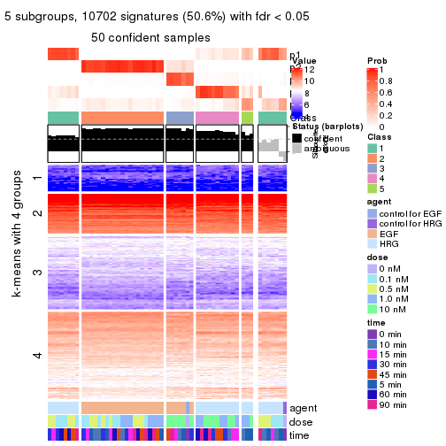</p>

</div>
<div id='tab-MAD-kmeans-get-signatures-no-scale-5'>
<pre><code class="r">get_signatures(res, k = 6, scale_rows = FALSE)
</code></pre>

<p></p>

</div>
</div>


Compare the overlap of signatures from different k:

```r
compare_signatures(res)
```


`get_signature()` returns a data frame invisibly. TO get the list of signatures, the function
call should be assigned to a variable explicitly. In following code, if `plot` argument is set
to `FALSE`, no heatmap is plotted while only the differential analysis is performed.

```r
# code only for demonstration
tb = get_signature(res, k = ..., plot = FALSE)
```

An example of the output of `tb` is:

```
#>   which_row         fdr    mean_1    mean_2 scaled_mean_1 scaled_mean_2 km
#> 1        38 0.042760348  8.373488  9.131774    -0.5533452     0.5164555  1
#> 2        40 0.018707592  7.106213  8.469186    -0.6173731     0.5762149  1
#> 3        55 0.019134737 10.221463 11.207825    -0.6159697     0.5749050  1
#> 4        59 0.006059896  5.921854  7.869574    -0.6899429     0.6439467  1
#> 5        60 0.018055526  8.928898 10.211722    -0.6204761     0.5791110  1
#> 6        98 0.009384629 15.714769 14.887706     0.6635654    -0.6193277  2
...
```

The columns in `tb` are:

1. `which_row`: row indices corresponding to the input matrix.
2. `fdr`: FDR for the differential test. 
3. `mean_x`: The mean value in group x.
4. `scaled_mean_x`: The mean value in group x after rows are scaled.
5. `km`: Row groups if k-means clustering is applied to rows.


UMAP plot which shows how samples are separated.


<script>
$( function() {
	$( '#tabs-MAD-kmeans-dimension-reduction' ).tabs();
} );
</script>
<div id='tabs-MAD-kmeans-dimension-reduction'>
<ul>
<li><a href='#tab-MAD-kmeans-dimension-reduction-1'>k = 2</a></li>
<li><a href='#tab-MAD-kmeans-dimension-reduction-2'>k = 3</a></li>
<li><a href='#tab-MAD-kmeans-dimension-reduction-3'>k = 4</a></li>
<li><a href='#tab-MAD-kmeans-dimension-reduction-4'>k = 5</a></li>
<li><a href='#tab-MAD-kmeans-dimension-reduction-5'>k = 6</a></li>
</ul>
<div id='tab-MAD-kmeans-dimension-reduction-1'>
<pre><code class="r">dimension_reduction(res, k = 2, method = &quot;UMAP&quot;)
</code></pre>

<p></p>

</div>
<div id='tab-MAD-kmeans-dimension-reduction-2'>
<pre><code class="r">dimension_reduction(res, k = 3, method = &quot;UMAP&quot;)
</code></pre>

<p></p>

</div>
<div id='tab-MAD-kmeans-dimension-reduction-3'>
<pre><code class="r">dimension_reduction(res, k = 4, method = &quot;UMAP&quot;)
</code></pre>

<p></p>

</div>
<div id='tab-MAD-kmeans-dimension-reduction-4'>
<pre><code class="r">dimension_reduction(res, k = 5, method = &quot;UMAP&quot;)
</code></pre>

<p></p>

</div>
<div id='tab-MAD-kmeans-dimension-reduction-5'>
<pre><code class="r">dimension_reduction(res, k = 6, method = &quot;UMAP&quot;)
</code></pre>

<p></p>

</div>
</div>


Following heatmap shows how subgroups are split when increasing `k`:

```r
collect_classes(res)
```


Test correlation between subgroups and known annotations. If the known
annotation is numeric, one-way ANOVA test is applied, and if the known
annotation is discrete, chi-squared contingency table test is applied.

```r
test_to_known_factors(res)
```

```
#>             n agent(p)  dose(p) time(p) k
#> MAD:kmeans 57 2.57e-12 1.00e+00   1.000 2
#> MAD:kmeans 48 2.84e-09 2.43e-02   0.696 3
#> MAD:kmeans 53 1.02e-09 2.17e-06   0.982 4
#> MAD:kmeans 50 3.44e-09 1.37e-05   0.701 5
#> MAD:kmeans 49 5.66e-09 5.01e-06   0.883 6
```


If matrix rows can be associated to genes, consider to use `functional_enrichment(res,
...)` to perform function enrichment for the signature genes. See [this vignette](http://bioconductor.org/packages/devel/bioc/vignettes/cola/inst/doc/functional_enrichment.html) for more detailed explanations.


 

---------------------------------------------------


### MAD:skmeans**


The object with results only for a single top-value method and a single partition method 
can be extracted as:

```r
res = res_list["MAD", "skmeans"]
# you can also extract it by
# res = res_list["MAD:skmeans"]
```

A summary of `res` and all the functions that can be applied to it:

```r
res
```

```
#> A 'ConsensusPartition' object with k = 2, 3, 4, 5, 6.
#>   On a matrix with 21163 rows and 57 columns.
#>   Top rows (1000, 2000, 3000, 4000, 5000) are extracted by 'MAD' method.
#>   Subgroups are detected by 'skmeans' method.
#>   Performed in total 1250 partitions by row resampling.
#>   Best k for subgroups seems to be 2.
#> 
#> Following methods can be applied to this 'ConsensusPartition' object:
#>  [1] "cola_report"             "collect_classes"         "collect_plots"          
#>  [4] "collect_stats"           "colnames"                "compare_signatures"     
#>  [7] "consensus_heatmap"       "dimension_reduction"     "functional_enrichment"  
#> [10] "get_anno_col"            "get_anno"                "get_classes"            
#> [13] "get_consensus"           "get_matrix"              "get_membership"         
#> [16] "get_param"               "get_signatures"          "get_stats"              
#> [19] "is_best_k"               "is_stable_k"             "membership_heatmap"     
#> [22] "ncol"                    "nrow"                    "plot_ecdf"              
#> [25] "rownames"                "select_partition_number" "show"                   
#> [28] "suggest_best_k"          "test_to_known_factors"
```

`collect_plots()` function collects all the plots made from `res` for all `k` (number of partitions)
into one single page to provide an easy and fast comparison between different `k`.

```r
collect_plots(res)
```


The plots are:

- The first row: a plot of the ECDF (empirical cumulative distribution
  function) curves of the consensus matrix for each `k` and the heatmap of
  predicted classes for each `k`.
- The second row: heatmaps of the consensus matrix for each `k`.
- The third row: heatmaps of the membership matrix for each `k`.
- The fouth row: heatmaps of the signatures for each `k`.

All the plots in panels can be made by individual functions and they are
plotted later in this section.

`select_partition_number()` produces several plots showing different
statistics for choosing "optimized" `k`. There are following statistics:

- ECDF curves of the consensus matrix for each `k`;
- 1-PAC. [The PAC
  score](https://en.wikipedia.org/wiki/Consensus_clustering#Over-interpretation_potential_of_consensus_clustering)
  measures the proportion of the ambiguous subgrouping.
- Mean silhouette score.
- Concordance. The mean probability of fiting the consensus class ids in all
  partitions.
- Area increased. Denote $A_k$ as the area under the ECDF curve for current
  `k`, the area increased is defined as $A_k - A_{k-1}$.
- Rand index. The percent of pairs of samples that are both in a same cluster
  or both are not in a same cluster in the partition of k and k-1.
- Jaccard index. The ratio of pairs of samples are both in a same cluster in
  the partition of k and k-1 and the pairs of samples are both in a same
  cluster in the partition k or k-1.

The detailed explanations of these statistics can be found in [the _cola_
vignette](http://bioconductor.org/packages/devel/bioc/vignettes/cola/inst/doc/cola.html#toc_13).

Generally speaking, lower PAC score, higher mean silhouette score or higher
concordance corresponds to better partition. Rand index and Jaccard index
measure how similar the current partition is compared to partition with `k-1`.
If they are too similar, we won't accept `k` is better than `k-1`.

```r
select_partition_number(res)
```


The numeric values for all these statistics can be obtained by `get_stats()`.

```r
get_stats(res)
```

```
#>   k 1-PAC mean_silhouette concordance area_increased  Rand Jaccard
#> 2 2 1.000           1.000       1.000         0.5093 0.491   0.491
#> 3 3 0.644           0.654       0.772         0.2525 0.887   0.770
#> 4 4 0.507           0.602       0.727         0.1554 0.833   0.589
#> 5 5 0.508           0.537       0.633         0.0712 0.982   0.937
#> 6 6 0.512           0.500       0.583         0.0419 0.951   0.833
```

`suggest_best_k()` suggests the best $k$ based on these statistics. The rules are as follows:

- All $k$ with Jaccard index larger than 0.95 are removed because increasing
  $k$ does not provide enough extra information. If all $k$ are removed, it is
  marked as no subgroup is detected.
- For all $k$ with 1-PAC score larger than 0.9, the maximal $k$ is taken as
  the best $k$, and other $k$ are marked as optional $k$.
- If it does not fit the second rule. The $k$ with the maximal vote of the
  highest 1-PAC score, highest mean silhouette, and highest concordance is
  taken as the best $k$.

```r
suggest_best_k(res)
```

```
#> [1] 2
```


Following shows the table of the partitions (You need to click the **show/hide
code output** link to see it). The membership matrix (columns with name `p*`)
is inferred by
[`clue::cl_consensus()`](https://www.rdocumentation.org/link/cl_consensus?package=clue)
function with the `SE` method. Basically the value in the membership matrix
represents the probability to belong to a certain group. The finall class
label for an item is determined with the group with highest probability it
belongs to.

In `get_classes()` function, the entropy is calculated from the membership
matrix and the silhouette score is calculated from the consensus matrix.


<script>
$( function() {
	$( '#tabs-MAD-skmeans-get-classes' ).tabs();
} );
</script>
<div id='tabs-MAD-skmeans-get-classes'>
<ul>
<li><a href='#tab-MAD-skmeans-get-classes-1'>k = 2</a></li>
<li><a href='#tab-MAD-skmeans-get-classes-2'>k = 3</a></li>
<li><a href='#tab-MAD-skmeans-get-classes-3'>k = 4</a></li>
<li><a href='#tab-MAD-skmeans-get-classes-4'>k = 5</a></li>
<li><a href='#tab-MAD-skmeans-get-classes-5'>k = 6</a></li>
</ul>

<div id='tab-MAD-skmeans-get-classes-1'>
<p><a id='tab-MAD-skmeans-get-classes-1-a' style='color:#0366d6' href='#'>show/hide code output</a></p>
<pre><code class="r">cbind(get_classes(res, k = 2), get_membership(res, k = 2))
</code></pre>

<pre><code>#&gt;           class entropy silhouette p1 p2
#&gt; GSM148516     2       0          1  0  1
#&gt; GSM148517     1       0          1  1  0
#&gt; GSM148518     2       0          1  0  1
#&gt; GSM148519     2       0          1  0  1
#&gt; GSM148520     2       0          1  0  1
#&gt; GSM148521     2       0          1  0  1
#&gt; GSM148522     2       0          1  0  1
#&gt; GSM148523     2       0          1  0  1
#&gt; GSM148524     2       0          1  0  1
#&gt; GSM148525     2       0          1  0  1
#&gt; GSM148526     2       0          1  0  1
#&gt; GSM148527     2       0          1  0  1
#&gt; GSM148528     2       0          1  0  1
#&gt; GSM148529     2       0          1  0  1
#&gt; GSM148530     2       0          1  0  1
#&gt; GSM148531     2       0          1  0  1
#&gt; GSM148532     2       0          1  0  1
#&gt; GSM148533     2       0          1  0  1
#&gt; GSM148534     2       0          1  0  1
#&gt; GSM148535     2       0          1  0  1
#&gt; GSM148536     2       0          1  0  1
#&gt; GSM148537     2       0          1  0  1
#&gt; GSM148538     2       0          1  0  1
#&gt; GSM148539     2       0          1  0  1
#&gt; GSM148540     2       0          1  0  1
#&gt; GSM148541     2       0          1  0  1
#&gt; GSM148542     2       0          1  0  1
#&gt; GSM148543     2       0          1  0  1
#&gt; GSM148544     2       0          1  0  1
#&gt; GSM148545     1       0          1  1  0
#&gt; GSM148546     1       0          1  1  0
#&gt; GSM148547     1       0          1  1  0
#&gt; GSM148548     1       0          1  1  0
#&gt; GSM148549     1       0          1  1  0
#&gt; GSM148550     1       0          1  1  0
#&gt; GSM148551     1       0          1  1  0
#&gt; GSM148552     1       0          1  1  0
#&gt; GSM148553     1       0          1  1  0
#&gt; GSM148554     1       0          1  1  0
#&gt; GSM148555     1       0          1  1  0
#&gt; GSM148556     1       0          1  1  0
#&gt; GSM148557     1       0          1  1  0
#&gt; GSM148558     1       0          1  1  0
#&gt; GSM148559     1       0          1  1  0
#&gt; GSM148560     1       0          1  1  0
#&gt; GSM148561     1       0          1  1  0
#&gt; GSM148562     1       0          1  1  0
#&gt; GSM148563     1       0          1  1  0
#&gt; GSM148564     1       0          1  1  0
#&gt; GSM148565     1       0          1  1  0
#&gt; GSM148566     1       0          1  1  0
#&gt; GSM148567     1       0          1  1  0
#&gt; GSM148568     1       0          1  1  0
#&gt; GSM148569     1       0          1  1  0
#&gt; GSM148570     1       0          1  1  0
#&gt; GSM148571     1       0          1  1  0
#&gt; GSM148572     1       0          1  1  0
</code></pre>

<script>
$('#tab-MAD-skmeans-get-classes-1-a').parent().next().next().hide();
$('#tab-MAD-skmeans-get-classes-1-a').click(function(){
  $('#tab-MAD-skmeans-get-classes-1-a').parent().next().next().toggle();
  return(false);
});
</script>
</div>

<div id='tab-MAD-skmeans-get-classes-2'>
<p><a id='tab-MAD-skmeans-get-classes-2-a' style='color:#0366d6' href='#'>show/hide code output</a></p>
<pre><code class="r">cbind(get_classes(res, k = 3), get_membership(res, k = 3))
</code></pre>

<pre><code>#&gt;           class entropy silhouette    p1    p2    p3
#&gt; GSM148516     2  0.4784     0.8761 0.004 0.796 0.200
#&gt; GSM148517     3  0.6008     0.6507 0.372 0.000 0.628
#&gt; GSM148518     2  0.1289     0.9409 0.000 0.968 0.032
#&gt; GSM148519     2  0.0424     0.9386 0.000 0.992 0.008
#&gt; GSM148520     2  0.1964     0.9380 0.000 0.944 0.056
#&gt; GSM148521     2  0.0892     0.9402 0.000 0.980 0.020
#&gt; GSM148522     2  0.1163     0.9407 0.000 0.972 0.028
#&gt; GSM148523     2  0.1163     0.9406 0.000 0.972 0.028
#&gt; GSM148524     2  0.1031     0.9416 0.000 0.976 0.024
#&gt; GSM148525     2  0.1643     0.9388 0.000 0.956 0.044
#&gt; GSM148526     2  0.2165     0.9371 0.000 0.936 0.064
#&gt; GSM148527     2  0.1643     0.9396 0.000 0.956 0.044
#&gt; GSM148528     2  0.1163     0.9410 0.000 0.972 0.028
#&gt; GSM148529     2  0.1163     0.9404 0.000 0.972 0.028
#&gt; GSM148530     2  0.1643     0.9403 0.000 0.956 0.044
#&gt; GSM148531     2  0.1163     0.9394 0.000 0.972 0.028
#&gt; GSM148532     2  0.1529     0.9405 0.000 0.960 0.040
#&gt; GSM148533     2  0.0747     0.9396 0.000 0.984 0.016
#&gt; GSM148534     2  0.0892     0.9414 0.000 0.980 0.020
#&gt; GSM148535     2  0.1163     0.9401 0.000 0.972 0.028
#&gt; GSM148536     2  0.1031     0.9405 0.000 0.976 0.024
#&gt; GSM148537     2  0.1163     0.9404 0.000 0.972 0.028
#&gt; GSM148538     2  0.0892     0.9411 0.000 0.980 0.020
#&gt; GSM148539     2  0.4834     0.8735 0.004 0.792 0.204
#&gt; GSM148540     2  0.5982     0.8362 0.028 0.744 0.228
#&gt; GSM148541     2  0.5903     0.8420 0.024 0.744 0.232
#&gt; GSM148542     2  0.8665     0.5858 0.124 0.552 0.324
#&gt; GSM148543     2  0.5305     0.8682 0.020 0.788 0.192
#&gt; GSM148544     2  0.7226     0.7848 0.080 0.692 0.228
#&gt; GSM148545     3  0.5810     0.6916 0.336 0.000 0.664
#&gt; GSM148546     3  0.5706     0.6980 0.320 0.000 0.680
#&gt; GSM148547     3  0.5431     0.7129 0.284 0.000 0.716
#&gt; GSM148548     3  0.6168     0.5551 0.412 0.000 0.588
#&gt; GSM148549     1  0.6307    -0.2571 0.512 0.000 0.488
#&gt; GSM148550     1  0.6235    -0.1101 0.564 0.000 0.436
#&gt; GSM148551     1  0.6095     0.1563 0.608 0.000 0.392
#&gt; GSM148552     3  0.5560     0.6982 0.300 0.000 0.700
#&gt; GSM148553     3  0.5560     0.6526 0.300 0.000 0.700
#&gt; GSM148554     3  0.6252     0.5126 0.444 0.000 0.556
#&gt; GSM148555     1  0.6215    -0.0171 0.572 0.000 0.428
#&gt; GSM148556     1  0.6215    -0.0291 0.572 0.000 0.428
#&gt; GSM148557     1  0.5859     0.2573 0.656 0.000 0.344
#&gt; GSM148558     1  0.5926     0.2642 0.644 0.000 0.356
#&gt; GSM148559     3  0.6295     0.3736 0.472 0.000 0.528
#&gt; GSM148560     1  0.6244    -0.1329 0.560 0.000 0.440
#&gt; GSM148561     1  0.4931     0.4629 0.768 0.000 0.232
#&gt; GSM148562     1  0.3941     0.5522 0.844 0.000 0.156
#&gt; GSM148563     1  0.2878     0.5760 0.904 0.000 0.096
#&gt; GSM148564     1  0.4121     0.5539 0.832 0.000 0.168
#&gt; GSM148565     1  0.3038     0.5723 0.896 0.000 0.104
#&gt; GSM148566     1  0.6079     0.0844 0.612 0.000 0.388
#&gt; GSM148567     1  0.3879     0.5634 0.848 0.000 0.152
#&gt; GSM148568     1  0.4654     0.4991 0.792 0.000 0.208
#&gt; GSM148569     1  0.3267     0.5748 0.884 0.000 0.116
#&gt; GSM148570     1  0.3192     0.5770 0.888 0.000 0.112
#&gt; GSM148571     1  0.3038     0.5791 0.896 0.000 0.104
#&gt; GSM148572     1  0.2625     0.5763 0.916 0.000 0.084
</code></pre>

<script>
$('#tab-MAD-skmeans-get-classes-2-a').parent().next().next().hide();
$('#tab-MAD-skmeans-get-classes-2-a').click(function(){
  $('#tab-MAD-skmeans-get-classes-2-a').parent().next().next().toggle();
  return(false);
});
</script>
</div>

<div id='tab-MAD-skmeans-get-classes-3'>
<p><a id='tab-MAD-skmeans-get-classes-3-a' style='color:#0366d6' href='#'>show/hide code output</a></p>
<pre><code class="r">cbind(get_classes(res, k = 4), get_membership(res, k = 4))
</code></pre>

<pre><code>#&gt;           class entropy silhouette    p1    p2    p3    p4
#&gt; GSM148516     3   0.538     0.6790 0.008 0.300 0.672 0.020
#&gt; GSM148517     1   0.496     0.5271 0.732 0.000 0.036 0.232
#&gt; GSM148518     2   0.395     0.7444 0.004 0.780 0.216 0.000
#&gt; GSM148519     2   0.326     0.7924 0.004 0.844 0.152 0.000
#&gt; GSM148520     2   0.401     0.7164 0.000 0.756 0.244 0.000
#&gt; GSM148521     2   0.349     0.7783 0.004 0.824 0.172 0.000
#&gt; GSM148522     2   0.253     0.7995 0.000 0.888 0.112 0.000
#&gt; GSM148523     2   0.363     0.7894 0.004 0.812 0.184 0.000
#&gt; GSM148524     2   0.349     0.7881 0.004 0.824 0.172 0.000
#&gt; GSM148525     2   0.453     0.6678 0.004 0.704 0.292 0.000
#&gt; GSM148526     2   0.383     0.7529 0.004 0.792 0.204 0.000
#&gt; GSM148527     2   0.335     0.7785 0.004 0.836 0.160 0.000
#&gt; GSM148528     2   0.371     0.7792 0.004 0.804 0.192 0.000
#&gt; GSM148529     2   0.276     0.7975 0.000 0.872 0.128 0.000
#&gt; GSM148530     2   0.297     0.7984 0.000 0.856 0.144 0.000
#&gt; GSM148531     2   0.369     0.7729 0.000 0.792 0.208 0.000
#&gt; GSM148532     2   0.373     0.7686 0.000 0.788 0.212 0.000
#&gt; GSM148533     2   0.344     0.7720 0.000 0.816 0.184 0.000
#&gt; GSM148534     2   0.367     0.7811 0.004 0.808 0.188 0.000
#&gt; GSM148535     2   0.363     0.7669 0.004 0.812 0.184 0.000
#&gt; GSM148536     2   0.402     0.7530 0.004 0.772 0.224 0.000
#&gt; GSM148537     2   0.379     0.7592 0.004 0.796 0.200 0.000
#&gt; GSM148538     2   0.305     0.7966 0.004 0.860 0.136 0.000
#&gt; GSM148539     3   0.533     0.5937 0.016 0.380 0.604 0.000
#&gt; GSM148540     3   0.562     0.7014 0.028 0.256 0.696 0.020
#&gt; GSM148541     3   0.511     0.7019 0.016 0.296 0.684 0.004
#&gt; GSM148542     3   0.740     0.6174 0.056 0.280 0.588 0.076
#&gt; GSM148543     3   0.550     0.6949 0.028 0.312 0.656 0.004
#&gt; GSM148544     3   0.593     0.7096 0.020 0.276 0.668 0.036
#&gt; GSM148545     1   0.420     0.5853 0.808 0.000 0.036 0.156
#&gt; GSM148546     1   0.442     0.6090 0.796 0.000 0.044 0.160
#&gt; GSM148547     1   0.379     0.6104 0.844 0.000 0.044 0.112
#&gt; GSM148548     1   0.542     0.5528 0.692 0.000 0.048 0.260
#&gt; GSM148549     1   0.648     0.4149 0.564 0.000 0.084 0.352
#&gt; GSM148550     1   0.597     0.4647 0.600 0.000 0.052 0.348
#&gt; GSM148551     1   0.652     0.2667 0.512 0.000 0.076 0.412
#&gt; GSM148552     1   0.356     0.5791 0.856 0.000 0.036 0.108
#&gt; GSM148553     1   0.503     0.5590 0.752 0.000 0.060 0.188
#&gt; GSM148554     1   0.551     0.5647 0.692 0.000 0.056 0.252
#&gt; GSM148555     1   0.622     0.3627 0.532 0.000 0.056 0.412
#&gt; GSM148556     1   0.615     0.3723 0.540 0.000 0.052 0.408
#&gt; GSM148557     4   0.621    -0.1593 0.468 0.000 0.052 0.480
#&gt; GSM148558     4   0.633     0.1240 0.404 0.000 0.064 0.532
#&gt; GSM148559     1   0.610     0.3750 0.624 0.000 0.072 0.304
#&gt; GSM148560     4   0.621     0.0145 0.468 0.000 0.052 0.480
#&gt; GSM148561     4   0.573     0.5467 0.200 0.000 0.096 0.704
#&gt; GSM148562     4   0.546     0.5674 0.212 0.000 0.072 0.716
#&gt; GSM148563     4   0.417     0.6094 0.140 0.000 0.044 0.816
#&gt; GSM148564     4   0.529     0.5717 0.224 0.000 0.056 0.720
#&gt; GSM148565     4   0.476     0.6038 0.192 0.000 0.044 0.764
#&gt; GSM148566     4   0.645     0.1384 0.448 0.000 0.068 0.484
#&gt; GSM148567     4   0.482     0.5630 0.216 0.000 0.036 0.748
#&gt; GSM148568     4   0.507     0.5707 0.208 0.000 0.052 0.740
#&gt; GSM148569     4   0.415     0.6111 0.160 0.000 0.032 0.808
#&gt; GSM148570     4   0.418     0.6095 0.180 0.000 0.024 0.796
#&gt; GSM148571     4   0.429     0.6096 0.164 0.000 0.036 0.800
#&gt; GSM148572     4   0.401     0.6164 0.148 0.000 0.032 0.820
</code></pre>

<script>
$('#tab-MAD-skmeans-get-classes-3-a').parent().next().next().hide();
$('#tab-MAD-skmeans-get-classes-3-a').click(function(){
  $('#tab-MAD-skmeans-get-classes-3-a').parent().next().next().toggle();
  return(false);
});
</script>
</div>

<div id='tab-MAD-skmeans-get-classes-4'>
<p><a id='tab-MAD-skmeans-get-classes-4-a' style='color:#0366d6' href='#'>show/hide code output</a></p>
<pre><code class="r">cbind(get_classes(res, k = 5), get_membership(res, k = 5))
</code></pre>

<pre><code>#&gt;           class entropy silhouette    p1    p2    p3    p4 p5
#&gt; GSM148516     3   0.547     0.5772 0.004 0.232 0.664 0.004 NA
#&gt; GSM148517     1   0.627     0.4114 0.596 0.000 0.016 0.172 NA
#&gt; GSM148518     2   0.444     0.6921 0.000 0.760 0.136 0.000 NA
#&gt; GSM148519     2   0.370     0.7168 0.000 0.820 0.080 0.000 NA
#&gt; GSM148520     2   0.613     0.5847 0.000 0.556 0.264 0.000 NA
#&gt; GSM148521     2   0.548     0.6606 0.000 0.644 0.232 0.000 NA
#&gt; GSM148522     2   0.480     0.7086 0.000 0.728 0.120 0.000 NA
#&gt; GSM148523     2   0.488     0.6730 0.000 0.720 0.152 0.000 NA
#&gt; GSM148524     2   0.491     0.7055 0.004 0.728 0.148 0.000 NA
#&gt; GSM148525     2   0.590     0.4678 0.000 0.584 0.268 0.000 NA
#&gt; GSM148526     2   0.475     0.6860 0.000 0.728 0.172 0.000 NA
#&gt; GSM148527     2   0.520     0.6860 0.000 0.688 0.164 0.000 NA
#&gt; GSM148528     2   0.480     0.6792 0.000 0.720 0.184 0.000 NA
#&gt; GSM148529     2   0.537     0.6769 0.000 0.668 0.180 0.000 NA
#&gt; GSM148530     2   0.548     0.6800 0.000 0.656 0.172 0.000 NA
#&gt; GSM148531     2   0.558     0.6672 0.000 0.640 0.208 0.000 NA
#&gt; GSM148532     2   0.554     0.6580 0.000 0.644 0.212 0.000 NA
#&gt; GSM148533     2   0.417     0.7077 0.000 0.784 0.112 0.000 NA
#&gt; GSM148534     2   0.503     0.6839 0.000 0.704 0.168 0.000 NA
#&gt; GSM148535     2   0.454     0.6848 0.000 0.752 0.136 0.000 NA
#&gt; GSM148536     2   0.555     0.6262 0.000 0.644 0.204 0.000 NA
#&gt; GSM148537     2   0.473     0.6642 0.000 0.732 0.160 0.000 NA
#&gt; GSM148538     2   0.541     0.6879 0.000 0.664 0.156 0.000 NA
#&gt; GSM148539     3   0.584     0.6101 0.020 0.260 0.636 0.004 NA
#&gt; GSM148540     3   0.557     0.6538 0.024 0.160 0.716 0.016 NA
#&gt; GSM148541     3   0.523     0.6584 0.012 0.164 0.728 0.012 NA
#&gt; GSM148542     3   0.781     0.5463 0.036 0.192 0.520 0.056 NA
#&gt; GSM148543     3   0.524     0.6468 0.020 0.188 0.720 0.008 NA
#&gt; GSM148544     3   0.639     0.6339 0.012 0.180 0.644 0.036 NA
#&gt; GSM148545     1   0.514     0.5065 0.708 0.000 0.008 0.104 NA
#&gt; GSM148546     1   0.408     0.5446 0.804 0.000 0.008 0.108 NA
#&gt; GSM148547     1   0.478     0.5296 0.748 0.000 0.008 0.124 NA
#&gt; GSM148548     1   0.605     0.5043 0.640 0.000 0.024 0.152 NA
#&gt; GSM148549     1   0.643     0.4474 0.572 0.000 0.020 0.252 NA
#&gt; GSM148550     1   0.630     0.4134 0.556 0.000 0.012 0.292 NA
#&gt; GSM148551     1   0.660     0.3510 0.524 0.000 0.020 0.308 NA
#&gt; GSM148552     1   0.595     0.4936 0.656 0.004 0.024 0.112 NA
#&gt; GSM148553     1   0.671     0.4496 0.576 0.000 0.056 0.120 NA
#&gt; GSM148554     1   0.542     0.5192 0.696 0.000 0.016 0.168 NA
#&gt; GSM148555     1   0.659     0.3751 0.500 0.000 0.012 0.324 NA
#&gt; GSM148556     1   0.628     0.3868 0.540 0.000 0.008 0.312 NA
#&gt; GSM148557     1   0.634     0.2272 0.488 0.000 0.008 0.376 NA
#&gt; GSM148558     4   0.624    -0.0244 0.376 0.000 0.000 0.476 NA
#&gt; GSM148559     1   0.740     0.2247 0.448 0.004 0.032 0.248 NA
#&gt; GSM148560     4   0.698     0.0445 0.376 0.000 0.012 0.388 NA
#&gt; GSM148561     4   0.664     0.4525 0.132 0.000 0.044 0.576 NA
#&gt; GSM148562     4   0.593     0.4786 0.180 0.000 0.036 0.664 NA
#&gt; GSM148563     4   0.465     0.5542 0.156 0.000 0.004 0.748 NA
#&gt; GSM148564     4   0.528     0.5409 0.116 0.000 0.020 0.716 NA
#&gt; GSM148565     4   0.477     0.5672 0.108 0.000 0.028 0.768 NA
#&gt; GSM148566     4   0.690     0.0581 0.380 0.000 0.012 0.404 NA
#&gt; GSM148567     4   0.612     0.5128 0.172 0.000 0.024 0.632 NA
#&gt; GSM148568     4   0.622     0.5123 0.156 0.000 0.040 0.640 NA
#&gt; GSM148569     4   0.572     0.5097 0.168 0.000 0.028 0.680 NA
#&gt; GSM148570     4   0.445     0.5780 0.136 0.000 0.004 0.768 NA
#&gt; GSM148571     4   0.395     0.5678 0.112 0.000 0.008 0.812 NA
#&gt; GSM148572     4   0.386     0.5766 0.096 0.000 0.004 0.816 NA
</code></pre>

<script>
$('#tab-MAD-skmeans-get-classes-4-a').parent().next().next().hide();
$('#tab-MAD-skmeans-get-classes-4-a').click(function(){
  $('#tab-MAD-skmeans-get-classes-4-a').parent().next().next().toggle();
  return(false);
});
</script>
</div>

<div id='tab-MAD-skmeans-get-classes-5'>
<p><a id='tab-MAD-skmeans-get-classes-5-a' style='color:#0366d6' href='#'>show/hide code output</a></p>
<pre><code class="r">cbind(get_classes(res, k = 6), get_membership(res, k = 6))
</code></pre>

<pre><code>#&gt;           class entropy silhouette    p1    p2    p3    p4    p5 p6
#&gt; GSM148516     3   0.635     0.5283 0.012 0.196 0.564 0.004 0.028 NA
#&gt; GSM148517     1   0.651     0.4076 0.600 0.000 0.028 0.164 0.132 NA
#&gt; GSM148518     2   0.432     0.6456 0.000 0.724 0.080 0.000 0.004 NA
#&gt; GSM148519     2   0.356     0.6683 0.000 0.780 0.044 0.000 0.000 NA
#&gt; GSM148520     2   0.562     0.5849 0.000 0.512 0.076 0.000 0.028 NA
#&gt; GSM148521     2   0.554     0.6128 0.000 0.568 0.076 0.000 0.032 NA
#&gt; GSM148522     2   0.399     0.6624 0.004 0.752 0.044 0.000 0.004 NA
#&gt; GSM148523     2   0.536     0.6197 0.000 0.636 0.084 0.000 0.036 NA
#&gt; GSM148524     2   0.483     0.6371 0.000 0.656 0.080 0.000 0.008 NA
#&gt; GSM148525     2   0.585     0.5017 0.000 0.560 0.200 0.000 0.016 NA
#&gt; GSM148526     2   0.484     0.6290 0.000 0.660 0.064 0.000 0.016 NA
#&gt; GSM148527     2   0.446     0.6334 0.000 0.688 0.064 0.000 0.004 NA
#&gt; GSM148528     2   0.507     0.6279 0.000 0.604 0.080 0.000 0.008 NA
#&gt; GSM148529     2   0.467     0.6502 0.000 0.648 0.040 0.000 0.016 NA
#&gt; GSM148530     2   0.566     0.5994 0.000 0.568 0.100 0.000 0.028 NA
#&gt; GSM148531     2   0.524     0.6263 0.000 0.612 0.080 0.000 0.020 NA
#&gt; GSM148532     2   0.522     0.5683 0.000 0.552 0.108 0.000 0.000 NA
#&gt; GSM148533     2   0.473     0.6478 0.000 0.648 0.072 0.000 0.004 NA
#&gt; GSM148534     2   0.465     0.6468 0.000 0.688 0.080 0.000 0.008 NA
#&gt; GSM148535     2   0.467     0.6286 0.000 0.676 0.072 0.000 0.008 NA
#&gt; GSM148536     2   0.573     0.6036 0.000 0.540 0.116 0.000 0.020 NA
#&gt; GSM148537     2   0.508     0.6174 0.000 0.680 0.116 0.000 0.024 NA
#&gt; GSM148538     2   0.493     0.6591 0.000 0.668 0.060 0.000 0.028 NA
#&gt; GSM148539     3   0.689     0.5287 0.012 0.208 0.520 0.008 0.052 NA
#&gt; GSM148540     3   0.658     0.5996 0.044 0.116 0.604 0.012 0.036 NA
#&gt; GSM148541     3   0.514     0.6290 0.008 0.112 0.724 0.004 0.048 NA
#&gt; GSM148542     3   0.792     0.5022 0.036 0.184 0.492 0.040 0.092 NA
#&gt; GSM148543     3   0.589     0.6015 0.000 0.144 0.628 0.016 0.032 NA
#&gt; GSM148544     3   0.710     0.6029 0.012 0.108 0.564 0.044 0.080 NA
#&gt; GSM148545     1   0.523     0.4723 0.720 0.000 0.032 0.096 0.120 NA
#&gt; GSM148546     1   0.427     0.5095 0.784 0.000 0.020 0.060 0.116 NA
#&gt; GSM148547     1   0.449     0.5023 0.760 0.000 0.012 0.080 0.128 NA
#&gt; GSM148548     1   0.631     0.4512 0.552 0.000 0.020 0.100 0.284 NA
#&gt; GSM148549     1   0.702     0.3429 0.416 0.000 0.044 0.124 0.376 NA
#&gt; GSM148550     1   0.694     0.2928 0.404 0.000 0.032 0.228 0.320 NA
#&gt; GSM148551     1   0.726     0.2627 0.392 0.000 0.036 0.212 0.324 NA
#&gt; GSM148552     1   0.679     0.4438 0.548 0.000 0.052 0.060 0.248 NA
#&gt; GSM148553     1   0.711     0.4170 0.536 0.004 0.048 0.092 0.232 NA
#&gt; GSM148554     1   0.579     0.4768 0.632 0.000 0.016 0.112 0.208 NA
#&gt; GSM148555     1   0.699     0.2432 0.368 0.000 0.020 0.264 0.324 NA
#&gt; GSM148556     1   0.762     0.1926 0.340 0.000 0.048 0.296 0.272 NA
#&gt; GSM148557     4   0.683    -0.0422 0.272 0.000 0.016 0.404 0.288 NA
#&gt; GSM148558     4   0.699     0.1961 0.248 0.000 0.036 0.488 0.192 NA
#&gt; GSM148559     1   0.751     0.3499 0.500 0.012 0.040 0.160 0.212 NA
#&gt; GSM148560     1   0.730     0.1924 0.388 0.000 0.028 0.240 0.300 NA
#&gt; GSM148561     4   0.708     0.3651 0.088 0.000 0.064 0.404 0.396 NA
#&gt; GSM148562     4   0.634     0.4781 0.100 0.000 0.036 0.552 0.284 NA
#&gt; GSM148563     4   0.576     0.5256 0.092 0.000 0.024 0.616 0.248 NA
#&gt; GSM148564     4   0.603     0.5266 0.088 0.000 0.040 0.644 0.180 NA
#&gt; GSM148565     4   0.365     0.5830 0.032 0.000 0.020 0.824 0.108 NA
#&gt; GSM148566     1   0.715     0.0784 0.380 0.000 0.032 0.276 0.288 NA
#&gt; GSM148567     4   0.602     0.5267 0.080 0.000 0.036 0.608 0.244 NA
#&gt; GSM148568     4   0.692     0.4209 0.100 0.000 0.068 0.480 0.320 NA
#&gt; GSM148569     4   0.534     0.5368 0.084 0.000 0.032 0.708 0.140 NA
#&gt; GSM148570     4   0.490     0.5541 0.100 0.000 0.012 0.716 0.156 NA
#&gt; GSM148571     4   0.404     0.5785 0.072 0.000 0.012 0.800 0.096 NA
#&gt; GSM148572     4   0.390     0.5766 0.056 0.000 0.020 0.804 0.112 NA
</code></pre>

<script>
$('#tab-MAD-skmeans-get-classes-5-a').parent().next().next().hide();
$('#tab-MAD-skmeans-get-classes-5-a').click(function(){
  $('#tab-MAD-skmeans-get-classes-5-a').parent().next().next().toggle();
  return(false);
});
</script>
</div>
</div>

Heatmaps for the consensus matrix. It visualizes the probability of two
samples to be in a same group.


<script>
$( function() {
	$( '#tabs-MAD-skmeans-consensus-heatmap' ).tabs();
} );
</script>
<div id='tabs-MAD-skmeans-consensus-heatmap'>
<ul>
<li><a href='#tab-MAD-skmeans-consensus-heatmap-1'>k = 2</a></li>
<li><a href='#tab-MAD-skmeans-consensus-heatmap-2'>k = 3</a></li>
<li><a href='#tab-MAD-skmeans-consensus-heatmap-3'>k = 4</a></li>
<li><a href='#tab-MAD-skmeans-consensus-heatmap-4'>k = 5</a></li>
<li><a href='#tab-MAD-skmeans-consensus-heatmap-5'>k = 6</a></li>
</ul>
<div id='tab-MAD-skmeans-consensus-heatmap-1'>
<pre><code class="r">consensus_heatmap(res, k = 2)
</code></pre>

<p></p>

</div>
<div id='tab-MAD-skmeans-consensus-heatmap-2'>
<pre><code class="r">consensus_heatmap(res, k = 3)
</code></pre>

<p></p>

</div>
<div id='tab-MAD-skmeans-consensus-heatmap-3'>
<pre><code class="r">consensus_heatmap(res, k = 4)
</code></pre>

<p></p>

</div>
<div id='tab-MAD-skmeans-consensus-heatmap-4'>
<pre><code class="r">consensus_heatmap(res, k = 5)
</code></pre>

<p></p>

</div>
<div id='tab-MAD-skmeans-consensus-heatmap-5'>
<pre><code class="r">consensus_heatmap(res, k = 6)
</code></pre>

<p></p>

</div>
</div>

Heatmaps for the membership of samples in all partitions to see how consistent they are:


<script>
$( function() {
	$( '#tabs-MAD-skmeans-membership-heatmap' ).tabs();
} );
</script>
<div id='tabs-MAD-skmeans-membership-heatmap'>
<ul>
<li><a href='#tab-MAD-skmeans-membership-heatmap-1'>k = 2</a></li>
<li><a href='#tab-MAD-skmeans-membership-heatmap-2'>k = 3</a></li>
<li><a href='#tab-MAD-skmeans-membership-heatmap-3'>k = 4</a></li>
<li><a href='#tab-MAD-skmeans-membership-heatmap-4'>k = 5</a></li>
<li><a href='#tab-MAD-skmeans-membership-heatmap-5'>k = 6</a></li>
</ul>
<div id='tab-MAD-skmeans-membership-heatmap-1'>
<pre><code class="r">membership_heatmap(res, k = 2)
</code></pre>

<p></p>

</div>
<div id='tab-MAD-skmeans-membership-heatmap-2'>
<pre><code class="r">membership_heatmap(res, k = 3)
</code></pre>

<p></p>

</div>
<div id='tab-MAD-skmeans-membership-heatmap-3'>
<pre><code class="r">membership_heatmap(res, k = 4)
</code></pre>

<p></p>

</div>
<div id='tab-MAD-skmeans-membership-heatmap-4'>
<pre><code class="r">membership_heatmap(res, k = 5)
</code></pre>

<p></p>

</div>
<div id='tab-MAD-skmeans-membership-heatmap-5'>
<pre><code class="r">membership_heatmap(res, k = 6)
</code></pre>

<p></p>

</div>
</div>

As soon as we have had the classes for columns, we can look for signatures
which are significantly different between classes which can be candidate marks
for certain classes. Following are the heatmaps for signatures.


Signature heatmaps where rows are scaled:


<script>
$( function() {
	$( '#tabs-MAD-skmeans-get-signatures' ).tabs();
} );
</script>
<div id='tabs-MAD-skmeans-get-signatures'>
<ul>
<li><a href='#tab-MAD-skmeans-get-signatures-1'>k = 2</a></li>
<li><a href='#tab-MAD-skmeans-get-signatures-2'>k = 3</a></li>
<li><a href='#tab-MAD-skmeans-get-signatures-3'>k = 4</a></li>
<li><a href='#tab-MAD-skmeans-get-signatures-4'>k = 5</a></li>
<li><a href='#tab-MAD-skmeans-get-signatures-5'>k = 6</a></li>
</ul>
<div id='tab-MAD-skmeans-get-signatures-1'>
<pre><code class="r">get_signatures(res, k = 2)
</code></pre>

<p></p>

</div>
<div id='tab-MAD-skmeans-get-signatures-2'>
<pre><code class="r">get_signatures(res, k = 3)
</code></pre>

<p></p>

</div>
<div id='tab-MAD-skmeans-get-signatures-3'>
<pre><code class="r">get_signatures(res, k = 4)
</code></pre>

<p></p>

</div>
<div id='tab-MAD-skmeans-get-signatures-4'>
<pre><code class="r">get_signatures(res, k = 5)
</code></pre>

<p></p>

</div>
<div id='tab-MAD-skmeans-get-signatures-5'>
<pre><code class="r">get_signatures(res, k = 6)
</code></pre>

<p></p>

</div>
</div>


Signature heatmaps where rows are not scaled:


<script>
$( function() {
	$( '#tabs-MAD-skmeans-get-signatures-no-scale' ).tabs();
} );
</script>
<div id='tabs-MAD-skmeans-get-signatures-no-scale'>
<ul>
<li><a href='#tab-MAD-skmeans-get-signatures-no-scale-1'>k = 2</a></li>
<li><a href='#tab-MAD-skmeans-get-signatures-no-scale-2'>k = 3</a></li>
<li><a href='#tab-MAD-skmeans-get-signatures-no-scale-3'>k = 4</a></li>
<li><a href='#tab-MAD-skmeans-get-signatures-no-scale-4'>k = 5</a></li>
<li><a href='#tab-MAD-skmeans-get-signatures-no-scale-5'>k = 6</a></li>
</ul>
<div id='tab-MAD-skmeans-get-signatures-no-scale-1'>
<pre><code class="r">get_signatures(res, k = 2, scale_rows = FALSE)
</code></pre>

<p></p>

</div>
<div id='tab-MAD-skmeans-get-signatures-no-scale-2'>
<pre><code class="r">get_signatures(res, k = 3, scale_rows = FALSE)
</code></pre>

<p></p>

</div>
<div id='tab-MAD-skmeans-get-signatures-no-scale-3'>
<pre><code class="r">get_signatures(res, k = 4, scale_rows = FALSE)
</code></pre>

<p></p>

</div>
<div id='tab-MAD-skmeans-get-signatures-no-scale-4'>
<pre><code class="r">get_signatures(res, k = 5, scale_rows = FALSE)
</code></pre>

<p></p>

</div>
<div id='tab-MAD-skmeans-get-signatures-no-scale-5'>
<pre><code class="r">get_signatures(res, k = 6, scale_rows = FALSE)
</code></pre>

<p></p>

</div>
</div>


Compare the overlap of signatures from different k:

```r
compare_signatures(res)
```


`get_signature()` returns a data frame invisibly. TO get the list of signatures, the function
call should be assigned to a variable explicitly. In following code, if `plot` argument is set
to `FALSE`, no heatmap is plotted while only the differential analysis is performed.

```r
# code only for demonstration
tb = get_signature(res, k = ..., plot = FALSE)
```

An example of the output of `tb` is:

```
#>   which_row         fdr    mean_1    mean_2 scaled_mean_1 scaled_mean_2 km
#> 1        38 0.042760348  8.373488  9.131774    -0.5533452     0.5164555  1
#> 2        40 0.018707592  7.106213  8.469186    -0.6173731     0.5762149  1
#> 3        55 0.019134737 10.221463 11.207825    -0.6159697     0.5749050  1
#> 4        59 0.006059896  5.921854  7.869574    -0.6899429     0.6439467  1
#> 5        60 0.018055526  8.928898 10.211722    -0.6204761     0.5791110  1
#> 6        98 0.009384629 15.714769 14.887706     0.6635654    -0.6193277  2
...
```

The columns in `tb` are:

1. `which_row`: row indices corresponding to the input matrix.
2. `fdr`: FDR for the differential test. 
3. `mean_x`: The mean value in group x.
4. `scaled_mean_x`: The mean value in group x after rows are scaled.
5. `km`: Row groups if k-means clustering is applied to rows.


UMAP plot which shows how samples are separated.


<script>
$( function() {
	$( '#tabs-MAD-skmeans-dimension-reduction' ).tabs();
} );
</script>
<div id='tabs-MAD-skmeans-dimension-reduction'>
<ul>
<li><a href='#tab-MAD-skmeans-dimension-reduction-1'>k = 2</a></li>
<li><a href='#tab-MAD-skmeans-dimension-reduction-2'>k = 3</a></li>
<li><a href='#tab-MAD-skmeans-dimension-reduction-3'>k = 4</a></li>
<li><a href='#tab-MAD-skmeans-dimension-reduction-4'>k = 5</a></li>
<li><a href='#tab-MAD-skmeans-dimension-reduction-5'>k = 6</a></li>
</ul>
<div id='tab-MAD-skmeans-dimension-reduction-1'>
<pre><code class="r">dimension_reduction(res, k = 2, method = &quot;UMAP&quot;)
</code></pre>

<p></p>

</div>
<div id='tab-MAD-skmeans-dimension-reduction-2'>
<pre><code class="r">dimension_reduction(res, k = 3, method = &quot;UMAP&quot;)
</code></pre>

<p></p>

</div>
<div id='tab-MAD-skmeans-dimension-reduction-3'>
<pre><code class="r">dimension_reduction(res, k = 4, method = &quot;UMAP&quot;)
</code></pre>

<p></p>

</div>
<div id='tab-MAD-skmeans-dimension-reduction-4'>
<pre><code class="r">dimension_reduction(res, k = 5, method = &quot;UMAP&quot;)
</code></pre>

<p></p>

</div>
<div id='tab-MAD-skmeans-dimension-reduction-5'>
<pre><code class="r">dimension_reduction(res, k = 6, method = &quot;UMAP&quot;)
</code></pre>

<p></p>

</div>
</div>


Following heatmap shows how subgroups are split when increasing `k`:

```r
collect_classes(res)
```


Test correlation between subgroups and known annotations. If the known
annotation is numeric, one-way ANOVA test is applied, and if the known
annotation is discrete, chi-squared contingency table test is applied.

```r
test_to_known_factors(res)
```

```
#>              n agent(p)  dose(p) time(p) k
#> MAD:skmeans 57 2.57e-12 1.00e+00   1.000 2
#> MAD:skmeans 45 1.10e-08 2.16e-02   0.626 3
#> MAD:skmeans 47 8.52e-09 1.00e-05   0.904 4
#> MAD:skmeans 41 3.71e-08 2.25e-05   0.905 5
#> MAD:skmeans 38 1.66e-07 6.93e-05   0.847 6
```


If matrix rows can be associated to genes, consider to use `functional_enrichment(res,
...)` to perform function enrichment for the signature genes. See [this vignette](http://bioconductor.org/packages/devel/bioc/vignettes/cola/inst/doc/functional_enrichment.html) for more detailed explanations.


 

---------------------------------------------------


### MAD:pam*


The object with results only for a single top-value method and a single partition method 
can be extracted as:

```r
res = res_list["MAD", "pam"]
# you can also extract it by
# res = res_list["MAD:pam"]
```

A summary of `res` and all the functions that can be applied to it:

```r
res
```

```
#> A 'ConsensusPartition' object with k = 2, 3, 4, 5, 6.
#>   On a matrix with 21163 rows and 57 columns.
#>   Top rows (1000, 2000, 3000, 4000, 5000) are extracted by 'MAD' method.
#>   Subgroups are detected by 'pam' method.
#>   Performed in total 1250 partitions by row resampling.
#>   Best k for subgroups seems to be 2.
#> 
#> Following methods can be applied to this 'ConsensusPartition' object:
#>  [1] "cola_report"             "collect_classes"         "collect_plots"          
#>  [4] "collect_stats"           "colnames"                "compare_signatures"     
#>  [7] "consensus_heatmap"       "dimension_reduction"     "functional_enrichment"  
#> [10] "get_anno_col"            "get_anno"                "get_classes"            
#> [13] "get_consensus"           "get_matrix"              "get_membership"         
#> [16] "get_param"               "get_signatures"          "get_stats"              
#> [19] "is_best_k"               "is_stable_k"             "membership_heatmap"     
#> [22] "ncol"                    "nrow"                    "plot_ecdf"              
#> [25] "rownames"                "select_partition_number" "show"                   
#> [28] "suggest_best_k"          "test_to_known_factors"
```

`collect_plots()` function collects all the plots made from `res` for all `k` (number of partitions)
into one single page to provide an easy and fast comparison between different `k`.

```r
collect_plots(res)
```


The plots are:

- The first row: a plot of the ECDF (empirical cumulative distribution
  function) curves of the consensus matrix for each `k` and the heatmap of
  predicted classes for each `k`.
- The second row: heatmaps of the consensus matrix for each `k`.
- The third row: heatmaps of the membership matrix for each `k`.
- The fouth row: heatmaps of the signatures for each `k`.

All the plots in panels can be made by individual functions and they are
plotted later in this section.

`select_partition_number()` produces several plots showing different
statistics for choosing "optimized" `k`. There are following statistics:

- ECDF curves of the consensus matrix for each `k`;
- 1-PAC. [The PAC
  score](https://en.wikipedia.org/wiki/Consensus_clustering#Over-interpretation_potential_of_consensus_clustering)
  measures the proportion of the ambiguous subgrouping.
- Mean silhouette score.
- Concordance. The mean probability of fiting the consensus class ids in all
  partitions.
- Area increased. Denote $A_k$ as the area under the ECDF curve for current
  `k`, the area increased is defined as $A_k - A_{k-1}$.
- Rand index. The percent of pairs of samples that are both in a same cluster
  or both are not in a same cluster in the partition of k and k-1.
- Jaccard index. The ratio of pairs of samples are both in a same cluster in
  the partition of k and k-1 and the pairs of samples are both in a same
  cluster in the partition k or k-1.

The detailed explanations of these statistics can be found in [the _cola_
vignette](http://bioconductor.org/packages/devel/bioc/vignettes/cola/inst/doc/cola.html#toc_13).

Generally speaking, lower PAC score, higher mean silhouette score or higher
concordance corresponds to better partition. Rand index and Jaccard index
measure how similar the current partition is compared to partition with `k-1`.
If they are too similar, we won't accept `k` is better than `k-1`.

```r
select_partition_number(res)
```


The numeric values for all these statistics can be obtained by `get_stats()`.

```r
get_stats(res)
```

```
#>   k 1-PAC mean_silhouette concordance area_increased  Rand Jaccard
#> 2 2 0.927           0.965       0.981         0.5072 0.491   0.491
#> 3 3 0.602           0.890       0.812         0.1975 1.000   1.000
#> 4 4 0.517           0.515       0.754         0.0994 0.900   0.796
#> 5 5 0.531           0.516       0.713         0.0363 0.981   0.951
#> 6 6 0.516           0.506       0.703         0.0228 0.997   0.992
```

`suggest_best_k()` suggests the best $k$ based on these statistics. The rules are as follows:

- All $k$ with Jaccard index larger than 0.95 are removed because increasing
  $k$ does not provide enough extra information. If all $k$ are removed, it is
  marked as no subgroup is detected.
- For all $k$ with 1-PAC score larger than 0.9, the maximal $k$ is taken as
  the best $k$, and other $k$ are marked as optional $k$.
- If it does not fit the second rule. The $k$ with the maximal vote of the
  highest 1-PAC score, highest mean silhouette, and highest concordance is
  taken as the best $k$.

```r
suggest_best_k(res)
```

```
#> [1] 2
```


Following shows the table of the partitions (You need to click the **show/hide
code output** link to see it). The membership matrix (columns with name `p*`)
is inferred by
[`clue::cl_consensus()`](https://www.rdocumentation.org/link/cl_consensus?package=clue)
function with the `SE` method. Basically the value in the membership matrix
represents the probability to belong to a certain group. The finall class
label for an item is determined with the group with highest probability it
belongs to.

In `get_classes()` function, the entropy is calculated from the membership
matrix and the silhouette score is calculated from the consensus matrix.


<script>
$( function() {
	$( '#tabs-MAD-pam-get-classes' ).tabs();
} );
</script>
<div id='tabs-MAD-pam-get-classes'>
<ul>
<li><a href='#tab-MAD-pam-get-classes-1'>k = 2</a></li>
<li><a href='#tab-MAD-pam-get-classes-2'>k = 3</a></li>
<li><a href='#tab-MAD-pam-get-classes-3'>k = 4</a></li>
<li><a href='#tab-MAD-pam-get-classes-4'>k = 5</a></li>
<li><a href='#tab-MAD-pam-get-classes-5'>k = 6</a></li>
</ul>

<div id='tab-MAD-pam-get-classes-1'>
<p><a id='tab-MAD-pam-get-classes-1-a' style='color:#0366d6' href='#'>show/hide code output</a></p>
<pre><code class="r">cbind(get_classes(res, k = 2), get_membership(res, k = 2))
</code></pre>

<pre><code>#&gt;           class entropy silhouette    p1    p2
#&gt; GSM148516     2  0.0000      0.992 0.000 1.000
#&gt; GSM148517     1  0.5519      0.878 0.872 0.128
#&gt; GSM148518     2  0.0000      0.992 0.000 1.000
#&gt; GSM148519     2  0.0000      0.992 0.000 1.000
#&gt; GSM148520     2  0.0000      0.992 0.000 1.000
#&gt; GSM148521     2  0.0000      0.992 0.000 1.000
#&gt; GSM148522     2  0.0000      0.992 0.000 1.000
#&gt; GSM148523     2  0.0000      0.992 0.000 1.000
#&gt; GSM148524     2  0.0000      0.992 0.000 1.000
#&gt; GSM148525     2  0.0000      0.992 0.000 1.000
#&gt; GSM148526     2  0.0000      0.992 0.000 1.000
#&gt; GSM148527     2  0.0000      0.992 0.000 1.000
#&gt; GSM148528     2  0.0000      0.992 0.000 1.000
#&gt; GSM148529     2  0.0000      0.992 0.000 1.000
#&gt; GSM148530     2  0.0000      0.992 0.000 1.000
#&gt; GSM148531     2  0.0000      0.992 0.000 1.000
#&gt; GSM148532     2  0.0000      0.992 0.000 1.000
#&gt; GSM148533     2  0.0000      0.992 0.000 1.000
#&gt; GSM148534     2  0.0000      0.992 0.000 1.000
#&gt; GSM148535     2  0.0000      0.992 0.000 1.000
#&gt; GSM148536     2  0.0000      0.992 0.000 1.000
#&gt; GSM148537     2  0.0000      0.992 0.000 1.000
#&gt; GSM148538     2  0.0000      0.992 0.000 1.000
#&gt; GSM148539     2  0.0376      0.989 0.004 0.996
#&gt; GSM148540     2  0.0672      0.985 0.008 0.992
#&gt; GSM148541     2  0.0000      0.992 0.000 1.000
#&gt; GSM148542     2  0.0000      0.992 0.000 1.000
#&gt; GSM148543     2  0.0672      0.986 0.008 0.992
#&gt; GSM148544     2  0.6887      0.769 0.184 0.816
#&gt; GSM148545     1  0.0672      0.967 0.992 0.008
#&gt; GSM148546     1  0.0000      0.969 1.000 0.000
#&gt; GSM148547     1  0.5408      0.883 0.876 0.124
#&gt; GSM148548     1  0.0672      0.967 0.992 0.008
#&gt; GSM148549     1  0.0000      0.969 1.000 0.000
#&gt; GSM148550     1  0.0000      0.969 1.000 0.000
#&gt; GSM148551     1  0.0000      0.969 1.000 0.000
#&gt; GSM148552     1  0.7219      0.792 0.800 0.200
#&gt; GSM148553     1  0.3733      0.929 0.928 0.072
#&gt; GSM148554     1  0.0938      0.966 0.988 0.012
#&gt; GSM148555     1  0.0376      0.968 0.996 0.004
#&gt; GSM148556     1  0.0000      0.969 1.000 0.000
#&gt; GSM148557     1  0.0000      0.969 1.000 0.000
#&gt; GSM148558     1  0.1843      0.958 0.972 0.028
#&gt; GSM148559     1  0.6343      0.844 0.840 0.160
#&gt; GSM148560     1  0.0376      0.968 0.996 0.004
#&gt; GSM148561     1  0.2778      0.946 0.952 0.048
#&gt; GSM148562     1  0.0376      0.968 0.996 0.004
#&gt; GSM148563     1  0.0000      0.969 1.000 0.000
#&gt; GSM148564     1  0.0000      0.969 1.000 0.000
#&gt; GSM148565     1  0.0000      0.969 1.000 0.000
#&gt; GSM148566     1  0.0000      0.969 1.000 0.000
#&gt; GSM148567     1  0.4161      0.919 0.916 0.084
#&gt; GSM148568     1  0.0000      0.969 1.000 0.000
#&gt; GSM148569     1  0.0000      0.969 1.000 0.000
#&gt; GSM148570     1  0.0000      0.969 1.000 0.000
#&gt; GSM148571     1  0.0000      0.969 1.000 0.000
#&gt; GSM148572     1  0.0376      0.968 0.996 0.004
</code></pre>

<script>
$('#tab-MAD-pam-get-classes-1-a').parent().next().next().hide();
$('#tab-MAD-pam-get-classes-1-a').click(function(){
  $('#tab-MAD-pam-get-classes-1-a').parent().next().next().toggle();
  return(false);
});
</script>
</div>

<div id='tab-MAD-pam-get-classes-2'>
<p><a id='tab-MAD-pam-get-classes-2-a' style='color:#0366d6' href='#'>show/hide code output</a></p>
<pre><code class="r">cbind(get_classes(res, k = 3), get_membership(res, k = 3))
</code></pre>

<pre><code>#&gt;           class entropy silhouette    p1    p2 p3
#&gt; GSM148516     2  0.6045      0.852 0.000 0.620 NA
#&gt; GSM148517     1  0.7128      0.769 0.620 0.036 NA
#&gt; GSM148518     2  0.6260      0.853 0.000 0.552 NA
#&gt; GSM148519     2  0.5216      0.866 0.000 0.740 NA
#&gt; GSM148520     2  0.5216      0.869 0.000 0.740 NA
#&gt; GSM148521     2  0.4504      0.878 0.000 0.804 NA
#&gt; GSM148522     2  0.2066      0.876 0.000 0.940 NA
#&gt; GSM148523     2  0.6295      0.844 0.000 0.528 NA
#&gt; GSM148524     2  0.2959      0.878 0.000 0.900 NA
#&gt; GSM148525     2  0.6295      0.842 0.000 0.528 NA
#&gt; GSM148526     2  0.3192      0.884 0.000 0.888 NA
#&gt; GSM148527     2  0.2165      0.877 0.000 0.936 NA
#&gt; GSM148528     2  0.3686      0.885 0.000 0.860 NA
#&gt; GSM148529     2  0.1860      0.876 0.000 0.948 NA
#&gt; GSM148530     2  0.2165      0.878 0.000 0.936 NA
#&gt; GSM148531     2  0.4931      0.882 0.000 0.768 NA
#&gt; GSM148532     2  0.6168      0.862 0.000 0.588 NA
#&gt; GSM148533     2  0.5465      0.868 0.000 0.712 NA
#&gt; GSM148534     2  0.3551      0.884 0.000 0.868 NA
#&gt; GSM148535     2  0.6079      0.850 0.000 0.612 NA
#&gt; GSM148536     2  0.5529      0.879 0.000 0.704 NA
#&gt; GSM148537     2  0.5497      0.864 0.000 0.708 NA
#&gt; GSM148538     2  0.5254      0.884 0.000 0.736 NA
#&gt; GSM148539     2  0.3686      0.885 0.000 0.860 NA
#&gt; GSM148540     2  0.3267      0.882 0.000 0.884 NA
#&gt; GSM148541     2  0.5397      0.873 0.000 0.720 NA
#&gt; GSM148542     2  0.6026      0.857 0.000 0.624 NA
#&gt; GSM148543     2  0.4842      0.877 0.000 0.776 NA
#&gt; GSM148544     2  0.8693      0.730 0.108 0.496 NA
#&gt; GSM148545     1  0.4409      0.916 0.824 0.004 NA
#&gt; GSM148546     1  0.1163      0.930 0.972 0.000 NA
#&gt; GSM148547     1  0.5581      0.902 0.788 0.036 NA
#&gt; GSM148548     1  0.3030      0.933 0.904 0.004 NA
#&gt; GSM148549     1  0.1411      0.930 0.964 0.000 NA
#&gt; GSM148550     1  0.0592      0.927 0.988 0.000 NA
#&gt; GSM148551     1  0.3192      0.931 0.888 0.000 NA
#&gt; GSM148552     1  0.5851      0.840 0.792 0.140 NA
#&gt; GSM148553     1  0.4937      0.915 0.824 0.028 NA
#&gt; GSM148554     1  0.4233      0.916 0.836 0.004 NA
#&gt; GSM148555     1  0.3340      0.930 0.880 0.000 NA
#&gt; GSM148556     1  0.0592      0.927 0.988 0.000 NA
#&gt; GSM148557     1  0.2066      0.928 0.940 0.000 NA
#&gt; GSM148558     1  0.4682      0.908 0.804 0.004 NA
#&gt; GSM148559     1  0.5576      0.875 0.812 0.104 NA
#&gt; GSM148560     1  0.1163      0.932 0.972 0.000 NA
#&gt; GSM148561     1  0.2339      0.919 0.940 0.048 NA
#&gt; GSM148562     1  0.0592      0.930 0.988 0.000 NA
#&gt; GSM148563     1  0.1163      0.931 0.972 0.000 NA
#&gt; GSM148564     1  0.1411      0.930 0.964 0.000 NA
#&gt; GSM148565     1  0.0747      0.929 0.984 0.000 NA
#&gt; GSM148566     1  0.1289      0.930 0.968 0.000 NA
#&gt; GSM148567     1  0.5263      0.907 0.824 0.060 NA
#&gt; GSM148568     1  0.3619      0.922 0.864 0.000 NA
#&gt; GSM148569     1  0.4452      0.910 0.808 0.000 NA
#&gt; GSM148570     1  0.1860      0.930 0.948 0.000 NA
#&gt; GSM148571     1  0.4178      0.916 0.828 0.000 NA
#&gt; GSM148572     1  0.2165      0.928 0.936 0.000 NA
</code></pre>

<script>
$('#tab-MAD-pam-get-classes-2-a').parent().next().next().hide();
$('#tab-MAD-pam-get-classes-2-a').click(function(){
  $('#tab-MAD-pam-get-classes-2-a').parent().next().next().toggle();
  return(false);
});
</script>
</div>

<div id='tab-MAD-pam-get-classes-3'>
<p><a id='tab-MAD-pam-get-classes-3-a' style='color:#0366d6' href='#'>show/hide code output</a></p>
<pre><code class="r">cbind(get_classes(res, k = 4), get_membership(res, k = 4))
</code></pre>

<pre><code>#&gt;           class entropy silhouette    p1    p2    p3    p4
#&gt; GSM148516     3  0.5628     0.0274 0.024 0.420 0.556 0.000
#&gt; GSM148517     1  0.2635     0.0000 0.908 0.004 0.016 0.072
#&gt; GSM148518     3  0.5080     0.4630 0.004 0.420 0.576 0.000
#&gt; GSM148519     2  0.4697    -0.0281 0.000 0.644 0.356 0.000
#&gt; GSM148520     2  0.5186     0.2255 0.016 0.640 0.344 0.000
#&gt; GSM148521     2  0.4072     0.3888 0.000 0.748 0.252 0.000
#&gt; GSM148522     2  0.1474     0.4839 0.000 0.948 0.052 0.000
#&gt; GSM148523     3  0.4713     0.5078 0.000 0.360 0.640 0.000
#&gt; GSM148524     2  0.2760     0.4839 0.000 0.872 0.128 0.000
#&gt; GSM148525     3  0.4855     0.4440 0.000 0.400 0.600 0.000
#&gt; GSM148526     2  0.2973     0.4410 0.000 0.856 0.144 0.000
#&gt; GSM148527     2  0.2011     0.4993 0.000 0.920 0.080 0.000
#&gt; GSM148528     2  0.4720     0.3375 0.016 0.720 0.264 0.000
#&gt; GSM148529     2  0.1557     0.4979 0.000 0.944 0.056 0.000
#&gt; GSM148530     2  0.1867     0.4972 0.000 0.928 0.072 0.000
#&gt; GSM148531     2  0.4356     0.2280 0.000 0.708 0.292 0.000
#&gt; GSM148532     3  0.5060     0.3448 0.004 0.412 0.584 0.000
#&gt; GSM148533     2  0.4925    -0.2121 0.000 0.572 0.428 0.000
#&gt; GSM148534     2  0.4364     0.3944 0.016 0.764 0.220 0.000
#&gt; GSM148535     3  0.4955     0.3490 0.000 0.444 0.556 0.000
#&gt; GSM148536     2  0.5364     0.0533 0.016 0.592 0.392 0.000
#&gt; GSM148537     2  0.4907    -0.2090 0.000 0.580 0.420 0.000
#&gt; GSM148538     2  0.4382     0.2197 0.000 0.704 0.296 0.000
#&gt; GSM148539     2  0.3791     0.3994 0.004 0.796 0.200 0.000
#&gt; GSM148540     2  0.3052     0.4641 0.004 0.860 0.136 0.000
#&gt; GSM148541     2  0.4699     0.2244 0.004 0.676 0.320 0.000
#&gt; GSM148542     2  0.5771    -0.1279 0.028 0.512 0.460 0.000
#&gt; GSM148543     2  0.4661     0.3453 0.004 0.708 0.284 0.004
#&gt; GSM148544     2  0.8787    -0.1234 0.164 0.416 0.348 0.072
#&gt; GSM148545     4  0.4917     0.7277 0.336 0.000 0.008 0.656
#&gt; GSM148546     4  0.0779     0.8113 0.016 0.000 0.004 0.980
#&gt; GSM148547     4  0.5237     0.7079 0.356 0.016 0.000 0.628
#&gt; GSM148548     4  0.4126     0.8024 0.216 0.004 0.004 0.776
#&gt; GSM148549     4  0.2281     0.8152 0.096 0.000 0.000 0.904
#&gt; GSM148550     4  0.0188     0.8074 0.000 0.000 0.004 0.996
#&gt; GSM148551     4  0.3837     0.8080 0.224 0.000 0.000 0.776
#&gt; GSM148552     4  0.4965     0.7310 0.100 0.112 0.004 0.784
#&gt; GSM148553     4  0.4458     0.7846 0.208 0.012 0.008 0.772
#&gt; GSM148554     4  0.4331     0.7600 0.288 0.000 0.000 0.712
#&gt; GSM148555     4  0.4608     0.7432 0.304 0.000 0.004 0.692
#&gt; GSM148556     4  0.0188     0.8074 0.000 0.000 0.004 0.996
#&gt; GSM148557     4  0.4122     0.7562 0.236 0.000 0.004 0.760
#&gt; GSM148558     4  0.4898     0.6583 0.416 0.000 0.000 0.584
#&gt; GSM148559     4  0.4469     0.7612 0.112 0.080 0.000 0.808
#&gt; GSM148560     4  0.1022     0.8170 0.032 0.000 0.000 0.968
#&gt; GSM148561     4  0.3301     0.8008 0.044 0.040 0.024 0.892
#&gt; GSM148562     4  0.1305     0.8177 0.036 0.000 0.004 0.960
#&gt; GSM148563     4  0.2480     0.8203 0.088 0.000 0.008 0.904
#&gt; GSM148564     4  0.1109     0.8123 0.028 0.000 0.004 0.968
#&gt; GSM148565     4  0.0657     0.8097 0.012 0.000 0.004 0.984
#&gt; GSM148566     4  0.1978     0.8203 0.068 0.000 0.004 0.928
#&gt; GSM148567     4  0.5139     0.7829 0.196 0.052 0.004 0.748
#&gt; GSM148568     4  0.3402     0.7902 0.164 0.000 0.004 0.832
#&gt; GSM148569     4  0.4830     0.6779 0.392 0.000 0.000 0.608
#&gt; GSM148570     4  0.3257     0.8072 0.152 0.000 0.004 0.844
#&gt; GSM148571     4  0.4277     0.7643 0.280 0.000 0.000 0.720
#&gt; GSM148572     4  0.4155     0.7574 0.240 0.000 0.004 0.756
</code></pre>

<script>
$('#tab-MAD-pam-get-classes-3-a').parent().next().next().hide();
$('#tab-MAD-pam-get-classes-3-a').click(function(){
  $('#tab-MAD-pam-get-classes-3-a').parent().next().next().toggle();
  return(false);
});
</script>
</div>

<div id='tab-MAD-pam-get-classes-4'>
<p><a id='tab-MAD-pam-get-classes-4-a' style='color:#0366d6' href='#'>show/hide code output</a></p>
<pre><code class="r">cbind(get_classes(res, k = 5), get_membership(res, k = 5))
</code></pre>

<pre><code>#&gt;           class entropy silhouette    p1    p2    p3    p4    p5
#&gt; GSM148516     3  0.6810    0.00000 0.000 0.300 0.356 0.344 0.000
#&gt; GSM148517     5  0.3246    0.00000 0.008 0.000 0.184 0.000 0.808
#&gt; GSM148518     4  0.4610    0.44717 0.000 0.388 0.016 0.596 0.000
#&gt; GSM148519     2  0.4613   -0.00926 0.000 0.620 0.020 0.360 0.000
#&gt; GSM148520     2  0.5620    0.24691 0.000 0.612 0.116 0.272 0.000
#&gt; GSM148521     2  0.4998    0.38761 0.000 0.700 0.104 0.196 0.000
#&gt; GSM148522     2  0.1484    0.50229 0.000 0.944 0.008 0.048 0.000
#&gt; GSM148523     4  0.4451    0.49226 0.000 0.340 0.016 0.644 0.000
#&gt; GSM148524     2  0.3146    0.50493 0.000 0.856 0.052 0.092 0.000
#&gt; GSM148525     4  0.4151    0.47188 0.000 0.344 0.004 0.652 0.000
#&gt; GSM148526     2  0.3432    0.45937 0.000 0.828 0.040 0.132 0.000
#&gt; GSM148527     2  0.2144    0.51652 0.000 0.912 0.020 0.068 0.000
#&gt; GSM148528     2  0.5314    0.37008 0.000 0.672 0.136 0.192 0.000
#&gt; GSM148529     2  0.1502    0.51270 0.000 0.940 0.004 0.056 0.000
#&gt; GSM148530     2  0.1809    0.51383 0.000 0.928 0.012 0.060 0.000
#&gt; GSM148531     2  0.4329    0.21402 0.000 0.672 0.016 0.312 0.000
#&gt; GSM148532     4  0.5607    0.26627 0.000 0.380 0.080 0.540 0.000
#&gt; GSM148533     2  0.4610   -0.13841 0.000 0.556 0.012 0.432 0.000
#&gt; GSM148534     2  0.4648    0.43774 0.000 0.740 0.104 0.156 0.000
#&gt; GSM148535     4  0.4242    0.34651 0.000 0.428 0.000 0.572 0.000
#&gt; GSM148536     2  0.5896    0.12367 0.000 0.564 0.128 0.308 0.000
#&gt; GSM148537     2  0.5272   -0.17170 0.000 0.552 0.052 0.396 0.000
#&gt; GSM148538     2  0.4360    0.22462 0.000 0.680 0.020 0.300 0.000
#&gt; GSM148539     2  0.3812    0.40911 0.000 0.772 0.024 0.204 0.000
#&gt; GSM148540     2  0.3651    0.45742 0.000 0.812 0.032 0.152 0.004
#&gt; GSM148541     2  0.5461    0.21620 0.000 0.620 0.096 0.284 0.000
#&gt; GSM148542     4  0.6587   -0.35743 0.000 0.368 0.164 0.460 0.008
#&gt; GSM148543     2  0.4650    0.34825 0.004 0.684 0.032 0.280 0.000
#&gt; GSM148544     2  0.8250   -0.14049 0.072 0.396 0.028 0.328 0.176
#&gt; GSM148545     1  0.4703    0.74834 0.632 0.000 0.028 0.000 0.340
#&gt; GSM148546     1  0.0898    0.80789 0.972 0.000 0.020 0.000 0.008
#&gt; GSM148547     1  0.4874    0.72036 0.588 0.016 0.008 0.000 0.388
#&gt; GSM148548     1  0.4646    0.79314 0.712 0.000 0.060 0.000 0.228
#&gt; GSM148549     1  0.2669    0.81561 0.876 0.000 0.020 0.000 0.104
#&gt; GSM148550     1  0.0290    0.80265 0.992 0.000 0.008 0.000 0.000
#&gt; GSM148551     1  0.3807    0.80973 0.748 0.000 0.012 0.000 0.240
#&gt; GSM148552     1  0.4648    0.75918 0.780 0.100 0.032 0.000 0.088
#&gt; GSM148553     1  0.4185    0.79643 0.752 0.000 0.024 0.008 0.216
#&gt; GSM148554     1  0.3837    0.77366 0.692 0.000 0.000 0.000 0.308
#&gt; GSM148555     1  0.4655    0.74257 0.644 0.000 0.028 0.000 0.328
#&gt; GSM148556     1  0.0290    0.80265 0.992 0.000 0.008 0.000 0.000
#&gt; GSM148557     1  0.3885    0.75539 0.724 0.000 0.008 0.000 0.268
#&gt; GSM148558     1  0.4425    0.67772 0.544 0.000 0.004 0.000 0.452
#&gt; GSM148559     1  0.4360    0.77659 0.800 0.068 0.032 0.000 0.100
#&gt; GSM148560     1  0.1041    0.81173 0.964 0.000 0.004 0.000 0.032
#&gt; GSM148561     1  0.4483    0.67521 0.740 0.024 0.216 0.000 0.020
#&gt; GSM148562     1  0.1408    0.81395 0.948 0.000 0.008 0.000 0.044
#&gt; GSM148563     1  0.3427    0.81720 0.836 0.000 0.056 0.000 0.108
#&gt; GSM148564     1  0.1877    0.80742 0.924 0.000 0.064 0.000 0.012
#&gt; GSM148565     1  0.1168    0.80596 0.960 0.000 0.032 0.000 0.008
#&gt; GSM148566     1  0.2331    0.81594 0.900 0.000 0.020 0.000 0.080
#&gt; GSM148567     1  0.5161    0.79179 0.720 0.024 0.076 0.000 0.180
#&gt; GSM148568     1  0.3812    0.79417 0.800 0.000 0.036 0.004 0.160
#&gt; GSM148569     1  0.4597    0.69755 0.564 0.000 0.012 0.000 0.424
#&gt; GSM148570     1  0.3655    0.80997 0.804 0.000 0.036 0.000 0.160
#&gt; GSM148571     1  0.4206    0.77760 0.696 0.000 0.016 0.000 0.288
#&gt; GSM148572     1  0.4268    0.75623 0.708 0.000 0.024 0.000 0.268
</code></pre>

<script>
$('#tab-MAD-pam-get-classes-4-a').parent().next().next().hide();
$('#tab-MAD-pam-get-classes-4-a').click(function(){
  $('#tab-MAD-pam-get-classes-4-a').parent().next().next().toggle();
  return(false);
});
</script>
</div>

<div id='tab-MAD-pam-get-classes-5'>
<p><a id='tab-MAD-pam-get-classes-5-a' style='color:#0366d6' href='#'>show/hide code output</a></p>
<pre><code class="r">cbind(get_classes(res, k = 6), get_membership(res, k = 6))
</code></pre>

<pre><code>#&gt;           class entropy silhouette    p1    p2    p3    p4    p5    p6
#&gt; GSM148516     3  0.5444    0.00000 0.000 0.208 0.576 0.216 0.000 0.000
#&gt; GSM148517     6  0.4994    0.00000 0.004 0.000 0.096 0.016 0.200 0.684
#&gt; GSM148518     4  0.4301    0.60945 0.000 0.392 0.024 0.584 0.000 0.000
#&gt; GSM148519     2  0.4406   -0.12294 0.000 0.624 0.040 0.336 0.000 0.000
#&gt; GSM148520     2  0.5303    0.25777 0.000 0.596 0.172 0.232 0.000 0.000
#&gt; GSM148521     2  0.4631    0.36684 0.000 0.692 0.140 0.168 0.000 0.000
#&gt; GSM148522     2  0.1296    0.47374 0.000 0.948 0.004 0.044 0.004 0.000
#&gt; GSM148523     4  0.4292    0.64932 0.000 0.340 0.032 0.628 0.000 0.000
#&gt; GSM148524     2  0.2994    0.48378 0.000 0.852 0.064 0.080 0.004 0.000
#&gt; GSM148525     4  0.3852    0.62766 0.000 0.324 0.012 0.664 0.000 0.000
#&gt; GSM148526     2  0.3352    0.41610 0.000 0.820 0.056 0.120 0.004 0.000
#&gt; GSM148527     2  0.2249    0.48950 0.000 0.900 0.032 0.064 0.004 0.000
#&gt; GSM148528     2  0.5051    0.33462 0.000 0.652 0.188 0.156 0.004 0.000
#&gt; GSM148529     2  0.1219    0.49071 0.000 0.948 0.004 0.048 0.000 0.000
#&gt; GSM148530     2  0.1787    0.48568 0.000 0.920 0.008 0.068 0.004 0.000
#&gt; GSM148531     2  0.4074    0.06593 0.000 0.656 0.016 0.324 0.004 0.000
#&gt; GSM148532     4  0.5471    0.31450 0.000 0.380 0.112 0.504 0.004 0.000
#&gt; GSM148533     2  0.4634   -0.26575 0.000 0.556 0.044 0.400 0.000 0.000
#&gt; GSM148534     2  0.4528    0.40732 0.000 0.716 0.148 0.132 0.004 0.000
#&gt; GSM148535     4  0.3950    0.52233 0.000 0.432 0.004 0.564 0.000 0.000
#&gt; GSM148536     2  0.5646    0.07031 0.000 0.548 0.176 0.272 0.004 0.000
#&gt; GSM148537     2  0.4864   -0.32439 0.000 0.552 0.064 0.384 0.000 0.000
#&gt; GSM148538     2  0.4065    0.14752 0.000 0.672 0.028 0.300 0.000 0.000
#&gt; GSM148539     2  0.3885    0.35277 0.000 0.756 0.048 0.192 0.004 0.000
#&gt; GSM148540     2  0.3935    0.41303 0.000 0.784 0.048 0.144 0.024 0.000
#&gt; GSM148541     2  0.5762   -0.00772 0.000 0.516 0.112 0.352 0.020 0.000
#&gt; GSM148542     5  0.6721    0.00000 0.000 0.304 0.036 0.204 0.448 0.008
#&gt; GSM148543     2  0.4723    0.33213 0.004 0.684 0.060 0.240 0.012 0.000
#&gt; GSM148544     2  0.7690   -0.12251 0.068 0.400 0.040 0.320 0.008 0.164
#&gt; GSM148545     1  0.4538    0.74833 0.612 0.000 0.000 0.000 0.048 0.340
#&gt; GSM148546     1  0.1666    0.80068 0.936 0.000 0.008 0.000 0.036 0.020
#&gt; GSM148547     1  0.4631    0.72801 0.572 0.008 0.008 0.000 0.016 0.396
#&gt; GSM148548     1  0.4380    0.79135 0.700 0.000 0.000 0.000 0.080 0.220
#&gt; GSM148549     1  0.2527    0.80780 0.868 0.000 0.000 0.000 0.024 0.108
#&gt; GSM148550     1  0.0291    0.79130 0.992 0.000 0.004 0.000 0.004 0.000
#&gt; GSM148551     1  0.3558    0.80608 0.736 0.000 0.000 0.000 0.016 0.248
#&gt; GSM148552     1  0.4196    0.76509 0.780 0.100 0.000 0.000 0.036 0.084
#&gt; GSM148553     1  0.4124    0.79625 0.740 0.000 0.008 0.004 0.040 0.208
#&gt; GSM148554     1  0.3482    0.77978 0.684 0.000 0.000 0.000 0.000 0.316
#&gt; GSM148555     1  0.4453    0.73831 0.624 0.000 0.000 0.000 0.044 0.332
#&gt; GSM148556     1  0.0291    0.79130 0.992 0.000 0.004 0.000 0.004 0.000
#&gt; GSM148557     1  0.3586    0.75331 0.712 0.000 0.004 0.000 0.004 0.280
#&gt; GSM148558     1  0.3989    0.68749 0.528 0.000 0.004 0.000 0.000 0.468
#&gt; GSM148559     1  0.4547    0.76977 0.784 0.060 0.012 0.008 0.056 0.080
#&gt; GSM148560     1  0.1829    0.79648 0.928 0.000 0.028 0.000 0.008 0.036
#&gt; GSM148561     1  0.6626    0.41814 0.572 0.024 0.076 0.060 0.252 0.016
#&gt; GSM148562     1  0.1340    0.80416 0.948 0.000 0.004 0.000 0.008 0.040
#&gt; GSM148563     1  0.3953    0.80183 0.792 0.000 0.012 0.004 0.084 0.108
#&gt; GSM148564     1  0.2001    0.80020 0.912 0.000 0.008 0.000 0.068 0.012
#&gt; GSM148565     1  0.1976    0.79237 0.924 0.000 0.032 0.004 0.032 0.008
#&gt; GSM148566     1  0.2617    0.80491 0.884 0.000 0.012 0.008 0.016 0.080
#&gt; GSM148567     1  0.4969    0.78107 0.692 0.024 0.000 0.000 0.108 0.176
#&gt; GSM148568     1  0.3595    0.79627 0.796 0.000 0.012 0.000 0.036 0.156
#&gt; GSM148569     1  0.4377    0.70298 0.540 0.000 0.000 0.000 0.024 0.436
#&gt; GSM148570     1  0.4334    0.79109 0.752 0.000 0.028 0.000 0.060 0.160
#&gt; GSM148571     1  0.4302    0.78306 0.684 0.000 0.016 0.000 0.024 0.276
#&gt; GSM148572     1  0.4505    0.74884 0.676 0.000 0.020 0.000 0.032 0.272
</code></pre>

<script>
$('#tab-MAD-pam-get-classes-5-a').parent().next().next().hide();
$('#tab-MAD-pam-get-classes-5-a').click(function(){
  $('#tab-MAD-pam-get-classes-5-a').parent().next().next().toggle();
  return(false);
});
</script>
</div>
</div>

Heatmaps for the consensus matrix. It visualizes the probability of two
samples to be in a same group.


<script>
$( function() {
	$( '#tabs-MAD-pam-consensus-heatmap' ).tabs();
} );
</script>
<div id='tabs-MAD-pam-consensus-heatmap'>
<ul>
<li><a href='#tab-MAD-pam-consensus-heatmap-1'>k = 2</a></li>
<li><a href='#tab-MAD-pam-consensus-heatmap-2'>k = 3</a></li>
<li><a href='#tab-MAD-pam-consensus-heatmap-3'>k = 4</a></li>
<li><a href='#tab-MAD-pam-consensus-heatmap-4'>k = 5</a></li>
<li><a href='#tab-MAD-pam-consensus-heatmap-5'>k = 6</a></li>
</ul>
<div id='tab-MAD-pam-consensus-heatmap-1'>
<pre><code class="r">consensus_heatmap(res, k = 2)
</code></pre>

<p></p>

</div>
<div id='tab-MAD-pam-consensus-heatmap-2'>
<pre><code class="r">consensus_heatmap(res, k = 3)
</code></pre>

<p></p>

</div>
<div id='tab-MAD-pam-consensus-heatmap-3'>
<pre><code class="r">consensus_heatmap(res, k = 4)
</code></pre>

<p></p>

</div>
<div id='tab-MAD-pam-consensus-heatmap-4'>
<pre><code class="r">consensus_heatmap(res, k = 5)
</code></pre>

<p>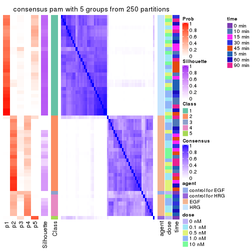</p>

</div>
<div id='tab-MAD-pam-consensus-heatmap-5'>
<pre><code class="r">consensus_heatmap(res, k = 6)
</code></pre>

<p></p>

</div>
</div>

Heatmaps for the membership of samples in all partitions to see how consistent they are:


<script>
$( function() {
	$( '#tabs-MAD-pam-membership-heatmap' ).tabs();
} );
</script>
<div id='tabs-MAD-pam-membership-heatmap'>
<ul>
<li><a href='#tab-MAD-pam-membership-heatmap-1'>k = 2</a></li>
<li><a href='#tab-MAD-pam-membership-heatmap-2'>k = 3</a></li>
<li><a href='#tab-MAD-pam-membership-heatmap-3'>k = 4</a></li>
<li><a href='#tab-MAD-pam-membership-heatmap-4'>k = 5</a></li>
<li><a href='#tab-MAD-pam-membership-heatmap-5'>k = 6</a></li>
</ul>
<div id='tab-MAD-pam-membership-heatmap-1'>
<pre><code class="r">membership_heatmap(res, k = 2)
</code></pre>

<p></p>

</div>
<div id='tab-MAD-pam-membership-heatmap-2'>
<pre><code class="r">membership_heatmap(res, k = 3)
</code></pre>

<p></p>

</div>
<div id='tab-MAD-pam-membership-heatmap-3'>
<pre><code class="r">membership_heatmap(res, k = 4)
</code></pre>

<p></p>

</div>
<div id='tab-MAD-pam-membership-heatmap-4'>
<pre><code class="r">membership_heatmap(res, k = 5)
</code></pre>

<p></p>

</div>
<div id='tab-MAD-pam-membership-heatmap-5'>
<pre><code class="r">membership_heatmap(res, k = 6)
</code></pre>

<p></p>

</div>
</div>

As soon as we have had the classes for columns, we can look for signatures
which are significantly different between classes which can be candidate marks
for certain classes. Following are the heatmaps for signatures.


Signature heatmaps where rows are scaled:


<script>
$( function() {
	$( '#tabs-MAD-pam-get-signatures' ).tabs();
} );
</script>
<div id='tabs-MAD-pam-get-signatures'>
<ul>
<li><a href='#tab-MAD-pam-get-signatures-1'>k = 2</a></li>
<li><a href='#tab-MAD-pam-get-signatures-2'>k = 3</a></li>
<li><a href='#tab-MAD-pam-get-signatures-3'>k = 4</a></li>
<li><a href='#tab-MAD-pam-get-signatures-4'>k = 5</a></li>
<li><a href='#tab-MAD-pam-get-signatures-5'>k = 6</a></li>
</ul>
<div id='tab-MAD-pam-get-signatures-1'>
<pre><code class="r">get_signatures(res, k = 2)
</code></pre>

<p></p>

</div>
<div id='tab-MAD-pam-get-signatures-2'>
<pre><code class="r">get_signatures(res, k = 3)
</code></pre>

<p></p>

</div>
<div id='tab-MAD-pam-get-signatures-3'>
<pre><code class="r">get_signatures(res, k = 4)
</code></pre>

<p></p>

</div>
<div id='tab-MAD-pam-get-signatures-4'>
<pre><code class="r">get_signatures(res, k = 5)
</code></pre>

<p></p>

</div>
<div id='tab-MAD-pam-get-signatures-5'>
<pre><code class="r">get_signatures(res, k = 6)
</code></pre>

<p></p>

</div>
</div>


Signature heatmaps where rows are not scaled:


<script>
$( function() {
	$( '#tabs-MAD-pam-get-signatures-no-scale' ).tabs();
} );
</script>
<div id='tabs-MAD-pam-get-signatures-no-scale'>
<ul>
<li><a href='#tab-MAD-pam-get-signatures-no-scale-1'>k = 2</a></li>
<li><a href='#tab-MAD-pam-get-signatures-no-scale-2'>k = 3</a></li>
<li><a href='#tab-MAD-pam-get-signatures-no-scale-3'>k = 4</a></li>
<li><a href='#tab-MAD-pam-get-signatures-no-scale-4'>k = 5</a></li>
<li><a href='#tab-MAD-pam-get-signatures-no-scale-5'>k = 6</a></li>
</ul>
<div id='tab-MAD-pam-get-signatures-no-scale-1'>
<pre><code class="r">get_signatures(res, k = 2, scale_rows = FALSE)
</code></pre>

<p></p>

</div>
<div id='tab-MAD-pam-get-signatures-no-scale-2'>
<pre><code class="r">get_signatures(res, k = 3, scale_rows = FALSE)
</code></pre>

<p></p>

</div>
<div id='tab-MAD-pam-get-signatures-no-scale-3'>
<pre><code class="r">get_signatures(res, k = 4, scale_rows = FALSE)
</code></pre>

<p></p>

</div>
<div id='tab-MAD-pam-get-signatures-no-scale-4'>
<pre><code class="r">get_signatures(res, k = 5, scale_rows = FALSE)
</code></pre>

<p></p>

</div>
<div id='tab-MAD-pam-get-signatures-no-scale-5'>
<pre><code class="r">get_signatures(res, k = 6, scale_rows = FALSE)
</code></pre>

<p></p>

</div>
</div>


Compare the overlap of signatures from different k:

```r
compare_signatures(res)
```


`get_signature()` returns a data frame invisibly. TO get the list of signatures, the function
call should be assigned to a variable explicitly. In following code, if `plot` argument is set
to `FALSE`, no heatmap is plotted while only the differential analysis is performed.

```r
# code only for demonstration
tb = get_signature(res, k = ..., plot = FALSE)
```

An example of the output of `tb` is:

```
#>   which_row         fdr    mean_1    mean_2 scaled_mean_1 scaled_mean_2 km
#> 1        38 0.042760348  8.373488  9.131774    -0.5533452     0.5164555  1
#> 2        40 0.018707592  7.106213  8.469186    -0.6173731     0.5762149  1
#> 3        55 0.019134737 10.221463 11.207825    -0.6159697     0.5749050  1
#> 4        59 0.006059896  5.921854  7.869574    -0.6899429     0.6439467  1
#> 5        60 0.018055526  8.928898 10.211722    -0.6204761     0.5791110  1
#> 6        98 0.009384629 15.714769 14.887706     0.6635654    -0.6193277  2
...
```

The columns in `tb` are:

1. `which_row`: row indices corresponding to the input matrix.
2. `fdr`: FDR for the differential test. 
3. `mean_x`: The mean value in group x.
4. `scaled_mean_x`: The mean value in group x after rows are scaled.
5. `km`: Row groups if k-means clustering is applied to rows.


UMAP plot which shows how samples are separated.


<script>
$( function() {
	$( '#tabs-MAD-pam-dimension-reduction' ).tabs();
} );
</script>
<div id='tabs-MAD-pam-dimension-reduction'>
<ul>
<li><a href='#tab-MAD-pam-dimension-reduction-1'>k = 2</a></li>
<li><a href='#tab-MAD-pam-dimension-reduction-2'>k = 3</a></li>
<li><a href='#tab-MAD-pam-dimension-reduction-3'>k = 4</a></li>
<li><a href='#tab-MAD-pam-dimension-reduction-4'>k = 5</a></li>
<li><a href='#tab-MAD-pam-dimension-reduction-5'>k = 6</a></li>
</ul>
<div id='tab-MAD-pam-dimension-reduction-1'>
<pre><code class="r">dimension_reduction(res, k = 2, method = &quot;UMAP&quot;)
</code></pre>

<p></p>

</div>
<div id='tab-MAD-pam-dimension-reduction-2'>
<pre><code class="r">dimension_reduction(res, k = 3, method = &quot;UMAP&quot;)
</code></pre>

<p></p>

</div>
<div id='tab-MAD-pam-dimension-reduction-3'>
<pre><code class="r">dimension_reduction(res, k = 4, method = &quot;UMAP&quot;)
</code></pre>

<p></p>

</div>
<div id='tab-MAD-pam-dimension-reduction-4'>
<pre><code class="r">dimension_reduction(res, k = 5, method = &quot;UMAP&quot;)
</code></pre>

<p></p>

</div>
<div id='tab-MAD-pam-dimension-reduction-5'>
<pre><code class="r">dimension_reduction(res, k = 6, method = &quot;UMAP&quot;)
</code></pre>

<p></p>

</div>
</div>


Following heatmap shows how subgroups are split when increasing `k`:

```r
collect_classes(res)
```


Test correlation between subgroups and known annotations. If the known
annotation is numeric, one-way ANOVA test is applied, and if the known
annotation is discrete, chi-squared contingency table test is applied.

```r
test_to_known_factors(res)
```

```
#>          n agent(p) dose(p) time(p) k
#> MAD:pam 57 2.57e-12   1.000   1.000 2
#> MAD:pam 57 2.57e-12   1.000   1.000 3
#> MAD:pam 29 9.42e-03   0.437   0.547 4
#> MAD:pam 33 4.03e-07   0.207   0.682 5
#> MAD:pam 31 1.85e-06   0.627   0.557 6
```


If matrix rows can be associated to genes, consider to use `functional_enrichment(res,
...)` to perform function enrichment for the signature genes. See [this vignette](http://bioconductor.org/packages/devel/bioc/vignettes/cola/inst/doc/functional_enrichment.html) for more detailed explanations.


 

---------------------------------------------------


### MAD:mclust


The object with results only for a single top-value method and a single partition method 
can be extracted as:

```r
res = res_list["MAD", "mclust"]
# you can also extract it by
# res = res_list["MAD:mclust"]
```

A summary of `res` and all the functions that can be applied to it:

```r
res
```

```
#> A 'ConsensusPartition' object with k = 2, 3, 4, 5, 6.
#>   On a matrix with 21163 rows and 57 columns.
#>   Top rows (1000, 2000, 3000, 4000, 5000) are extracted by 'MAD' method.
#>   Subgroups are detected by 'mclust' method.
#>   Performed in total 1250 partitions by row resampling.
#>   Best k for subgroups seems to be 2.
#> 
#> Following methods can be applied to this 'ConsensusPartition' object:
#>  [1] "cola_report"             "collect_classes"         "collect_plots"          
#>  [4] "collect_stats"           "colnames"                "compare_signatures"     
#>  [7] "consensus_heatmap"       "dimension_reduction"     "functional_enrichment"  
#> [10] "get_anno_col"            "get_anno"                "get_classes"            
#> [13] "get_consensus"           "get_matrix"              "get_membership"         
#> [16] "get_param"               "get_signatures"          "get_stats"              
#> [19] "is_best_k"               "is_stable_k"             "membership_heatmap"     
#> [22] "ncol"                    "nrow"                    "plot_ecdf"              
#> [25] "rownames"                "select_partition_number" "show"                   
#> [28] "suggest_best_k"          "test_to_known_factors"
```

`collect_plots()` function collects all the plots made from `res` for all `k` (number of partitions)
into one single page to provide an easy and fast comparison between different `k`.

```r
collect_plots(res)
```


The plots are:

- The first row: a plot of the ECDF (empirical cumulative distribution
  function) curves of the consensus matrix for each `k` and the heatmap of
  predicted classes for each `k`.
- The second row: heatmaps of the consensus matrix for each `k`.
- The third row: heatmaps of the membership matrix for each `k`.
- The fouth row: heatmaps of the signatures for each `k`.

All the plots in panels can be made by individual functions and they are
plotted later in this section.

`select_partition_number()` produces several plots showing different
statistics for choosing "optimized" `k`. There are following statistics:

- ECDF curves of the consensus matrix for each `k`;
- 1-PAC. [The PAC
  score](https://en.wikipedia.org/wiki/Consensus_clustering#Over-interpretation_potential_of_consensus_clustering)
  measures the proportion of the ambiguous subgrouping.
- Mean silhouette score.
- Concordance. The mean probability of fiting the consensus class ids in all
  partitions.
- Area increased. Denote $A_k$ as the area under the ECDF curve for current
  `k`, the area increased is defined as $A_k - A_{k-1}$.
- Rand index. The percent of pairs of samples that are both in a same cluster
  or both are not in a same cluster in the partition of k and k-1.
- Jaccard index. The ratio of pairs of samples are both in a same cluster in
  the partition of k and k-1 and the pairs of samples are both in a same
  cluster in the partition k or k-1.

The detailed explanations of these statistics can be found in [the _cola_
vignette](http://bioconductor.org/packages/devel/bioc/vignettes/cola/inst/doc/cola.html#toc_13).

Generally speaking, lower PAC score, higher mean silhouette score or higher
concordance corresponds to better partition. Rand index and Jaccard index
measure how similar the current partition is compared to partition with `k-1`.
If they are too similar, we won't accept `k` is better than `k-1`.

```r
select_partition_number(res)
```


The numeric values for all these statistics can be obtained by `get_stats()`.

```r
get_stats(res)
```

```
#>   k 1-PAC mean_silhouette concordance area_increased  Rand Jaccard
#> 2 2 0.781           0.895       0.950         0.4948 0.491   0.491
#> 3 3 0.642           0.895       0.866         0.2482 0.908   0.812
#> 4 4 0.819           0.842       0.900         0.1531 0.872   0.680
#> 5 5 0.832           0.786       0.824         0.0630 1.000   1.000
#> 6 6 0.777           0.755       0.822         0.0411 0.935   0.765
```

`suggest_best_k()` suggests the best $k$ based on these statistics. The rules are as follows:

- All $k$ with Jaccard index larger than 0.95 are removed because increasing
  $k$ does not provide enough extra information. If all $k$ are removed, it is
  marked as no subgroup is detected.
- For all $k$ with 1-PAC score larger than 0.9, the maximal $k$ is taken as
  the best $k$, and other $k$ are marked as optional $k$.
- If it does not fit the second rule. The $k$ with the maximal vote of the
  highest 1-PAC score, highest mean silhouette, and highest concordance is
  taken as the best $k$.

```r
suggest_best_k(res)
```

```
#> [1] 2
```


Following shows the table of the partitions (You need to click the **show/hide
code output** link to see it). The membership matrix (columns with name `p*`)
is inferred by
[`clue::cl_consensus()`](https://www.rdocumentation.org/link/cl_consensus?package=clue)
function with the `SE` method. Basically the value in the membership matrix
represents the probability to belong to a certain group. The finall class
label for an item is determined with the group with highest probability it
belongs to.

In `get_classes()` function, the entropy is calculated from the membership
matrix and the silhouette score is calculated from the consensus matrix.


<script>
$( function() {
	$( '#tabs-MAD-mclust-get-classes' ).tabs();
} );
</script>
<div id='tabs-MAD-mclust-get-classes'>
<ul>
<li><a href='#tab-MAD-mclust-get-classes-1'>k = 2</a></li>
<li><a href='#tab-MAD-mclust-get-classes-2'>k = 3</a></li>
<li><a href='#tab-MAD-mclust-get-classes-3'>k = 4</a></li>
<li><a href='#tab-MAD-mclust-get-classes-4'>k = 5</a></li>
<li><a href='#tab-MAD-mclust-get-classes-5'>k = 6</a></li>
</ul>

<div id='tab-MAD-mclust-get-classes-1'>
<p><a id='tab-MAD-mclust-get-classes-1-a' style='color:#0366d6' href='#'>show/hide code output</a></p>
<pre><code class="r">cbind(get_classes(res, k = 2), get_membership(res, k = 2))
</code></pre>

<pre><code>#&gt;           class entropy silhouette    p1    p2
#&gt; GSM148516     2  0.9661      0.500 0.392 0.608
#&gt; GSM148517     1  0.0000      1.000 1.000 0.000
#&gt; GSM148518     2  0.0938      0.883 0.012 0.988
#&gt; GSM148519     2  0.0000      0.888 0.000 1.000
#&gt; GSM148520     2  0.0000      0.888 0.000 1.000
#&gt; GSM148521     2  0.0000      0.888 0.000 1.000
#&gt; GSM148522     2  0.0000      0.888 0.000 1.000
#&gt; GSM148523     2  0.0000      0.888 0.000 1.000
#&gt; GSM148524     2  0.0000      0.888 0.000 1.000
#&gt; GSM148525     2  0.0672      0.885 0.008 0.992
#&gt; GSM148526     2  0.0376      0.887 0.004 0.996
#&gt; GSM148527     2  0.0000      0.888 0.000 1.000
#&gt; GSM148528     2  0.0000      0.888 0.000 1.000
#&gt; GSM148529     2  0.0000      0.888 0.000 1.000
#&gt; GSM148530     2  0.0376      0.887 0.004 0.996
#&gt; GSM148531     2  0.0000      0.888 0.000 1.000
#&gt; GSM148532     2  0.0000      0.888 0.000 1.000
#&gt; GSM148533     2  0.0000      0.888 0.000 1.000
#&gt; GSM148534     2  0.0000      0.888 0.000 1.000
#&gt; GSM148535     2  0.0000      0.888 0.000 1.000
#&gt; GSM148536     2  0.0000      0.888 0.000 1.000
#&gt; GSM148537     2  0.0672      0.885 0.008 0.992
#&gt; GSM148538     2  0.1633      0.876 0.024 0.976
#&gt; GSM148539     2  0.9635      0.505 0.388 0.612
#&gt; GSM148540     2  0.9710      0.486 0.400 0.600
#&gt; GSM148541     2  0.9732      0.478 0.404 0.596
#&gt; GSM148542     2  0.9732      0.478 0.404 0.596
#&gt; GSM148543     2  0.9732      0.478 0.404 0.596
#&gt; GSM148544     2  0.9732      0.478 0.404 0.596
#&gt; GSM148545     1  0.0000      1.000 1.000 0.000
#&gt; GSM148546     1  0.0000      1.000 1.000 0.000
#&gt; GSM148547     1  0.0000      1.000 1.000 0.000
#&gt; GSM148548     1  0.0000      1.000 1.000 0.000
#&gt; GSM148549     1  0.0000      1.000 1.000 0.000
#&gt; GSM148550     1  0.0000      1.000 1.000 0.000
#&gt; GSM148551     1  0.0000      1.000 1.000 0.000
#&gt; GSM148552     1  0.0000      1.000 1.000 0.000
#&gt; GSM148553     1  0.0000      1.000 1.000 0.000
#&gt; GSM148554     1  0.0000      1.000 1.000 0.000
#&gt; GSM148555     1  0.0000      1.000 1.000 0.000
#&gt; GSM148556     1  0.0000      1.000 1.000 0.000
#&gt; GSM148557     1  0.0000      1.000 1.000 0.000
#&gt; GSM148558     1  0.0000      1.000 1.000 0.000
#&gt; GSM148559     1  0.0000      1.000 1.000 0.000
#&gt; GSM148560     1  0.0000      1.000 1.000 0.000
#&gt; GSM148561     1  0.0000      1.000 1.000 0.000
#&gt; GSM148562     1  0.0000      1.000 1.000 0.000
#&gt; GSM148563     1  0.0000      1.000 1.000 0.000
#&gt; GSM148564     1  0.0000      1.000 1.000 0.000
#&gt; GSM148565     1  0.0000      1.000 1.000 0.000
#&gt; GSM148566     1  0.0000      1.000 1.000 0.000
#&gt; GSM148567     1  0.0000      1.000 1.000 0.000
#&gt; GSM148568     1  0.0000      1.000 1.000 0.000
#&gt; GSM148569     1  0.0000      1.000 1.000 0.000
#&gt; GSM148570     1  0.0000      1.000 1.000 0.000
#&gt; GSM148571     1  0.0000      1.000 1.000 0.000
#&gt; GSM148572     1  0.0000      1.000 1.000 0.000
</code></pre>

<script>
$('#tab-MAD-mclust-get-classes-1-a').parent().next().next().hide();
$('#tab-MAD-mclust-get-classes-1-a').click(function(){
  $('#tab-MAD-mclust-get-classes-1-a').parent().next().next().toggle();
  return(false);
});
</script>
</div>

<div id='tab-MAD-mclust-get-classes-2'>
<p><a id='tab-MAD-mclust-get-classes-2-a' style='color:#0366d6' href='#'>show/hide code output</a></p>
<pre><code class="r">cbind(get_classes(res, k = 3), get_membership(res, k = 3))
</code></pre>

<pre><code>#&gt;           class entropy silhouette    p1    p2    p3
#&gt; GSM148516     3  0.6414      0.985 0.036 0.248 0.716
#&gt; GSM148517     1  0.6111      0.793 0.604 0.000 0.396
#&gt; GSM148518     2  0.1289      0.960 0.000 0.968 0.032
#&gt; GSM148519     2  0.0000      0.990 0.000 1.000 0.000
#&gt; GSM148520     2  0.0000      0.990 0.000 1.000 0.000
#&gt; GSM148521     2  0.0000      0.990 0.000 1.000 0.000
#&gt; GSM148522     2  0.0000      0.990 0.000 1.000 0.000
#&gt; GSM148523     2  0.0237      0.989 0.000 0.996 0.004
#&gt; GSM148524     2  0.0000      0.990 0.000 1.000 0.000
#&gt; GSM148525     2  0.1878      0.939 0.004 0.952 0.044
#&gt; GSM148526     2  0.0000      0.990 0.000 1.000 0.000
#&gt; GSM148527     2  0.0000      0.990 0.000 1.000 0.000
#&gt; GSM148528     2  0.0000      0.990 0.000 1.000 0.000
#&gt; GSM148529     2  0.0237      0.988 0.000 0.996 0.004
#&gt; GSM148530     2  0.0237      0.988 0.000 0.996 0.004
#&gt; GSM148531     2  0.0000      0.990 0.000 1.000 0.000
#&gt; GSM148532     2  0.0237      0.989 0.000 0.996 0.004
#&gt; GSM148533     2  0.0592      0.983 0.000 0.988 0.012
#&gt; GSM148534     2  0.0000      0.990 0.000 1.000 0.000
#&gt; GSM148535     2  0.0237      0.989 0.000 0.996 0.004
#&gt; GSM148536     2  0.0237      0.988 0.000 0.996 0.004
#&gt; GSM148537     2  0.0983      0.976 0.004 0.980 0.016
#&gt; GSM148538     2  0.0829      0.978 0.004 0.984 0.012
#&gt; GSM148539     3  0.6601      0.928 0.028 0.296 0.676
#&gt; GSM148540     3  0.6414      0.985 0.036 0.248 0.716
#&gt; GSM148541     3  0.6375      0.987 0.036 0.244 0.720
#&gt; GSM148542     3  0.6375      0.987 0.036 0.244 0.720
#&gt; GSM148543     3  0.6375      0.987 0.036 0.244 0.720
#&gt; GSM148544     3  0.6375      0.987 0.036 0.244 0.720
#&gt; GSM148545     1  0.6126      0.790 0.600 0.000 0.400
#&gt; GSM148546     1  0.6045      0.799 0.620 0.000 0.380
#&gt; GSM148547     1  0.6062      0.797 0.616 0.000 0.384
#&gt; GSM148548     1  0.5431      0.831 0.716 0.000 0.284
#&gt; GSM148549     1  0.5216      0.834 0.740 0.000 0.260
#&gt; GSM148550     1  0.5098      0.835 0.752 0.000 0.248
#&gt; GSM148551     1  0.4796      0.834 0.780 0.000 0.220
#&gt; GSM148552     1  0.6095      0.796 0.608 0.000 0.392
#&gt; GSM148553     1  0.6062      0.799 0.616 0.000 0.384
#&gt; GSM148554     1  0.5905      0.811 0.648 0.000 0.352
#&gt; GSM148555     1  0.5058      0.835 0.756 0.000 0.244
#&gt; GSM148556     1  0.5058      0.838 0.756 0.000 0.244
#&gt; GSM148557     1  0.5058      0.835 0.756 0.000 0.244
#&gt; GSM148558     1  0.4750      0.833 0.784 0.000 0.216
#&gt; GSM148559     1  0.5465      0.809 0.712 0.000 0.288
#&gt; GSM148560     1  0.5431      0.809 0.716 0.000 0.284
#&gt; GSM148561     1  0.2537      0.814 0.920 0.000 0.080
#&gt; GSM148562     1  0.0747      0.810 0.984 0.000 0.016
#&gt; GSM148563     1  0.0892      0.800 0.980 0.000 0.020
#&gt; GSM148564     1  0.1031      0.804 0.976 0.000 0.024
#&gt; GSM148565     1  0.1529      0.789 0.960 0.000 0.040
#&gt; GSM148566     1  0.5254      0.814 0.736 0.000 0.264
#&gt; GSM148567     1  0.1860      0.813 0.948 0.000 0.052
#&gt; GSM148568     1  0.1753      0.818 0.952 0.000 0.048
#&gt; GSM148569     1  0.0592      0.806 0.988 0.000 0.012
#&gt; GSM148570     1  0.1289      0.801 0.968 0.000 0.032
#&gt; GSM148571     1  0.1529      0.789 0.960 0.000 0.040
#&gt; GSM148572     1  0.1529      0.791 0.960 0.000 0.040
</code></pre>

<script>
$('#tab-MAD-mclust-get-classes-2-a').parent().next().next().hide();
$('#tab-MAD-mclust-get-classes-2-a').click(function(){
  $('#tab-MAD-mclust-get-classes-2-a').parent().next().next().toggle();
  return(false);
});
</script>
</div>

<div id='tab-MAD-mclust-get-classes-3'>
<p><a id='tab-MAD-mclust-get-classes-3-a' style='color:#0366d6' href='#'>show/hide code output</a></p>
<pre><code class="r">cbind(get_classes(res, k = 4), get_membership(res, k = 4))
</code></pre>

<pre><code>#&gt;           class entropy silhouette    p1    p2    p3    p4
#&gt; GSM148516     3  0.2125      0.948 0.012 0.052 0.932 0.004
#&gt; GSM148517     1  0.0804      0.785 0.980 0.000 0.008 0.012
#&gt; GSM148518     2  0.0657      0.985 0.004 0.984 0.012 0.000
#&gt; GSM148519     2  0.0000      0.997 0.000 1.000 0.000 0.000
#&gt; GSM148520     2  0.0000      0.997 0.000 1.000 0.000 0.000
#&gt; GSM148521     2  0.0000      0.997 0.000 1.000 0.000 0.000
#&gt; GSM148522     2  0.0000      0.997 0.000 1.000 0.000 0.000
#&gt; GSM148523     2  0.0188      0.995 0.000 0.996 0.004 0.000
#&gt; GSM148524     2  0.0000      0.997 0.000 1.000 0.000 0.000
#&gt; GSM148525     2  0.0895      0.977 0.000 0.976 0.020 0.004
#&gt; GSM148526     2  0.0000      0.997 0.000 1.000 0.000 0.000
#&gt; GSM148527     2  0.0000      0.997 0.000 1.000 0.000 0.000
#&gt; GSM148528     2  0.0000      0.997 0.000 1.000 0.000 0.000
#&gt; GSM148529     2  0.0000      0.997 0.000 1.000 0.000 0.000
#&gt; GSM148530     2  0.0000      0.997 0.000 1.000 0.000 0.000
#&gt; GSM148531     2  0.0000      0.997 0.000 1.000 0.000 0.000
#&gt; GSM148532     2  0.0000      0.997 0.000 1.000 0.000 0.000
#&gt; GSM148533     2  0.0188      0.995 0.000 0.996 0.004 0.000
#&gt; GSM148534     2  0.0000      0.997 0.000 1.000 0.000 0.000
#&gt; GSM148535     2  0.0188      0.995 0.000 0.996 0.004 0.000
#&gt; GSM148536     2  0.0188      0.994 0.000 0.996 0.004 0.000
#&gt; GSM148537     2  0.0336      0.992 0.000 0.992 0.008 0.000
#&gt; GSM148538     2  0.0000      0.997 0.000 1.000 0.000 0.000
#&gt; GSM148539     3  0.3529      0.839 0.012 0.152 0.836 0.000
#&gt; GSM148540     3  0.1471      0.967 0.012 0.024 0.960 0.004
#&gt; GSM148541     3  0.1471      0.967 0.012 0.024 0.960 0.004
#&gt; GSM148542     3  0.1471      0.967 0.012 0.024 0.960 0.004
#&gt; GSM148543     3  0.1471      0.967 0.012 0.024 0.960 0.004
#&gt; GSM148544     3  0.1471      0.967 0.012 0.024 0.960 0.004
#&gt; GSM148545     1  0.0804      0.785 0.980 0.000 0.008 0.012
#&gt; GSM148546     1  0.1042      0.789 0.972 0.000 0.008 0.020
#&gt; GSM148547     1  0.1151      0.789 0.968 0.000 0.008 0.024
#&gt; GSM148548     1  0.3718      0.748 0.820 0.000 0.012 0.168
#&gt; GSM148549     1  0.4978      0.602 0.664 0.000 0.012 0.324
#&gt; GSM148550     1  0.4820      0.643 0.692 0.000 0.012 0.296
#&gt; GSM148551     1  0.5112      0.465 0.608 0.000 0.008 0.384
#&gt; GSM148552     1  0.1042      0.789 0.972 0.000 0.008 0.020
#&gt; GSM148553     1  0.1356      0.791 0.960 0.000 0.008 0.032
#&gt; GSM148554     1  0.2124      0.788 0.924 0.000 0.008 0.068
#&gt; GSM148555     1  0.5130      0.587 0.652 0.000 0.016 0.332
#&gt; GSM148556     1  0.4795      0.648 0.696 0.000 0.012 0.292
#&gt; GSM148557     1  0.5018      0.592 0.656 0.000 0.012 0.332
#&gt; GSM148558     4  0.5636      0.113 0.424 0.000 0.024 0.552
#&gt; GSM148559     1  0.2060      0.756 0.932 0.000 0.016 0.052
#&gt; GSM148560     1  0.2775      0.750 0.896 0.000 0.020 0.084
#&gt; GSM148561     4  0.4844      0.657 0.300 0.000 0.012 0.688
#&gt; GSM148562     4  0.3681      0.774 0.176 0.000 0.008 0.816
#&gt; GSM148563     4  0.2060      0.799 0.052 0.000 0.016 0.932
#&gt; GSM148564     4  0.3105      0.798 0.140 0.000 0.004 0.856
#&gt; GSM148565     4  0.0779      0.780 0.004 0.000 0.016 0.980
#&gt; GSM148566     1  0.3900      0.717 0.816 0.000 0.020 0.164
#&gt; GSM148567     4  0.4453      0.713 0.244 0.000 0.012 0.744
#&gt; GSM148568     4  0.4663      0.676 0.272 0.000 0.012 0.716
#&gt; GSM148569     4  0.3052      0.797 0.136 0.000 0.004 0.860
#&gt; GSM148570     4  0.1284      0.791 0.024 0.000 0.012 0.964
#&gt; GSM148571     4  0.0592      0.777 0.000 0.000 0.016 0.984
#&gt; GSM148572     4  0.0469      0.778 0.000 0.000 0.012 0.988
</code></pre>

<script>
$('#tab-MAD-mclust-get-classes-3-a').parent().next().next().hide();
$('#tab-MAD-mclust-get-classes-3-a').click(function(){
  $('#tab-MAD-mclust-get-classes-3-a').parent().next().next().toggle();
  return(false);
});
</script>
</div>

<div id='tab-MAD-mclust-get-classes-4'>
<p><a id='tab-MAD-mclust-get-classes-4-a' style='color:#0366d6' href='#'>show/hide code output</a></p>
<pre><code class="r">cbind(get_classes(res, k = 5), get_membership(res, k = 5))
</code></pre>

<pre><code>#&gt;           class entropy silhouette    p1    p2    p3    p4    p5
#&gt; GSM148516     3  0.1568      0.941 0.000 0.036 0.944 0.000 0.020
#&gt; GSM148517     1  0.2536      0.635 0.868 0.000 0.004 0.000 0.128
#&gt; GSM148518     2  0.1942      0.946 0.000 0.920 0.012 0.000 0.068
#&gt; GSM148519     2  0.0404      0.982 0.000 0.988 0.000 0.000 0.012
#&gt; GSM148520     2  0.1041      0.978 0.000 0.964 0.004 0.000 0.032
#&gt; GSM148521     2  0.0290      0.982 0.000 0.992 0.000 0.000 0.008
#&gt; GSM148522     2  0.0404      0.982 0.000 0.988 0.000 0.000 0.012
#&gt; GSM148523     2  0.0290      0.981 0.000 0.992 0.008 0.000 0.000
#&gt; GSM148524     2  0.0703      0.980 0.000 0.976 0.000 0.000 0.024
#&gt; GSM148525     2  0.1965      0.950 0.000 0.924 0.024 0.000 0.052
#&gt; GSM148526     2  0.0963      0.979 0.000 0.964 0.000 0.000 0.036
#&gt; GSM148527     2  0.0880      0.980 0.000 0.968 0.000 0.000 0.032
#&gt; GSM148528     2  0.0290      0.982 0.000 0.992 0.000 0.000 0.008
#&gt; GSM148529     2  0.0955      0.977 0.000 0.968 0.004 0.000 0.028
#&gt; GSM148530     2  0.0162      0.982 0.000 0.996 0.000 0.000 0.004
#&gt; GSM148531     2  0.0162      0.982 0.000 0.996 0.000 0.000 0.004
#&gt; GSM148532     2  0.0880      0.975 0.000 0.968 0.000 0.000 0.032
#&gt; GSM148533     2  0.0992      0.977 0.000 0.968 0.008 0.000 0.024
#&gt; GSM148534     2  0.0404      0.982 0.000 0.988 0.000 0.000 0.012
#&gt; GSM148535     2  0.0771      0.978 0.000 0.976 0.004 0.000 0.020
#&gt; GSM148536     2  0.0898      0.980 0.000 0.972 0.008 0.000 0.020
#&gt; GSM148537     2  0.0912      0.978 0.000 0.972 0.012 0.000 0.016
#&gt; GSM148538     2  0.0404      0.982 0.000 0.988 0.000 0.000 0.012
#&gt; GSM148539     3  0.3400      0.813 0.000 0.136 0.828 0.000 0.036
#&gt; GSM148540     3  0.1018      0.955 0.000 0.016 0.968 0.000 0.016
#&gt; GSM148541     3  0.0898      0.952 0.000 0.008 0.972 0.000 0.020
#&gt; GSM148542     3  0.0290      0.954 0.000 0.008 0.992 0.000 0.000
#&gt; GSM148543     3  0.0566      0.955 0.000 0.012 0.984 0.000 0.004
#&gt; GSM148544     3  0.0613      0.953 0.000 0.008 0.984 0.004 0.004
#&gt; GSM148545     1  0.2233      0.644 0.892 0.000 0.004 0.000 0.104
#&gt; GSM148546     1  0.1956      0.654 0.916 0.000 0.000 0.008 0.076
#&gt; GSM148547     1  0.1956      0.654 0.916 0.000 0.000 0.008 0.076
#&gt; GSM148548     1  0.5338      0.618 0.700 0.000 0.012 0.160 0.128
#&gt; GSM148549     1  0.6981      0.458 0.456 0.000 0.016 0.296 0.232
#&gt; GSM148550     1  0.6845      0.512 0.496 0.000 0.016 0.256 0.232
#&gt; GSM148551     1  0.7052      0.374 0.416 0.000 0.016 0.340 0.228
#&gt; GSM148552     1  0.1924      0.664 0.924 0.000 0.008 0.004 0.064
#&gt; GSM148553     1  0.1617      0.671 0.948 0.000 0.012 0.020 0.020
#&gt; GSM148554     1  0.3749      0.666 0.828 0.000 0.012 0.052 0.108
#&gt; GSM148555     1  0.7028      0.470 0.448 0.000 0.016 0.280 0.256
#&gt; GSM148556     1  0.6741      0.522 0.512 0.000 0.016 0.272 0.200
#&gt; GSM148557     1  0.7043      0.463 0.444 0.000 0.016 0.276 0.264
#&gt; GSM148558     4  0.7143     -0.110 0.316 0.000 0.016 0.400 0.268
#&gt; GSM148559     1  0.4474      0.524 0.652 0.000 0.004 0.012 0.332
#&gt; GSM148560     1  0.5016      0.530 0.616 0.000 0.004 0.036 0.344
#&gt; GSM148561     4  0.4991      0.678 0.092 0.000 0.008 0.720 0.180
#&gt; GSM148562     4  0.2291      0.779 0.036 0.000 0.000 0.908 0.056
#&gt; GSM148563     4  0.2351      0.794 0.016 0.000 0.000 0.896 0.088
#&gt; GSM148564     4  0.2144      0.791 0.020 0.000 0.000 0.912 0.068
#&gt; GSM148565     4  0.2890      0.772 0.004 0.000 0.000 0.836 0.160
#&gt; GSM148566     1  0.6379      0.462 0.504 0.000 0.004 0.160 0.332
#&gt; GSM148567     4  0.3821      0.733 0.052 0.000 0.000 0.800 0.148
#&gt; GSM148568     4  0.4372      0.699 0.072 0.000 0.000 0.756 0.172
#&gt; GSM148569     4  0.1498      0.790 0.024 0.000 0.008 0.952 0.016
#&gt; GSM148570     4  0.2798      0.781 0.008 0.000 0.000 0.852 0.140
#&gt; GSM148571     4  0.2891      0.762 0.000 0.000 0.000 0.824 0.176
#&gt; GSM148572     4  0.2813      0.766 0.000 0.000 0.000 0.832 0.168
</code></pre>

<script>
$('#tab-MAD-mclust-get-classes-4-a').parent().next().next().hide();
$('#tab-MAD-mclust-get-classes-4-a').click(function(){
  $('#tab-MAD-mclust-get-classes-4-a').parent().next().next().toggle();
  return(false);
});
</script>
</div>

<div id='tab-MAD-mclust-get-classes-5'>
<p><a id='tab-MAD-mclust-get-classes-5-a' style='color:#0366d6' href='#'>show/hide code output</a></p>
<pre><code class="r">cbind(get_classes(res, k = 6), get_membership(res, k = 6))
</code></pre>

<pre><code>#&gt;           class entropy silhouette    p1    p2    p3    p4    p5    p6
#&gt; GSM148516     3  0.2455      0.911 0.016 0.016 0.888 0.000 0.080 0.000
#&gt; GSM148517     6  0.2136      0.552 0.048 0.000 0.000 0.000 0.048 0.904
#&gt; GSM148518     2  0.2362      0.919 0.000 0.860 0.000 0.000 0.136 0.004
#&gt; GSM148519     2  0.1007      0.957 0.000 0.956 0.000 0.000 0.044 0.000
#&gt; GSM148520     2  0.1745      0.947 0.000 0.920 0.012 0.000 0.068 0.000
#&gt; GSM148521     2  0.0858      0.956 0.000 0.968 0.004 0.000 0.028 0.000
#&gt; GSM148522     2  0.0858      0.957 0.000 0.968 0.004 0.000 0.028 0.000
#&gt; GSM148523     2  0.0790      0.957 0.000 0.968 0.000 0.000 0.032 0.000
#&gt; GSM148524     2  0.1141      0.956 0.000 0.948 0.000 0.000 0.052 0.000
#&gt; GSM148525     2  0.2531      0.909 0.000 0.856 0.012 0.000 0.132 0.000
#&gt; GSM148526     2  0.1588      0.948 0.000 0.924 0.004 0.000 0.072 0.000
#&gt; GSM148527     2  0.0937      0.958 0.000 0.960 0.000 0.000 0.040 0.000
#&gt; GSM148528     2  0.1010      0.956 0.000 0.960 0.000 0.000 0.036 0.004
#&gt; GSM148529     2  0.1701      0.944 0.000 0.920 0.008 0.000 0.072 0.000
#&gt; GSM148530     2  0.1010      0.957 0.000 0.960 0.004 0.000 0.036 0.000
#&gt; GSM148531     2  0.1285      0.955 0.000 0.944 0.004 0.000 0.052 0.000
#&gt; GSM148532     2  0.1765      0.938 0.000 0.904 0.000 0.000 0.096 0.000
#&gt; GSM148533     2  0.1588      0.950 0.000 0.924 0.004 0.000 0.072 0.000
#&gt; GSM148534     2  0.1531      0.952 0.000 0.928 0.000 0.000 0.068 0.004
#&gt; GSM148535     2  0.1327      0.953 0.000 0.936 0.000 0.000 0.064 0.000
#&gt; GSM148536     2  0.1075      0.955 0.000 0.952 0.000 0.000 0.048 0.000
#&gt; GSM148537     2  0.1644      0.949 0.000 0.920 0.004 0.000 0.076 0.000
#&gt; GSM148538     2  0.1349      0.954 0.000 0.940 0.004 0.000 0.056 0.000
#&gt; GSM148539     3  0.3270      0.797 0.000 0.120 0.820 0.000 0.060 0.000
#&gt; GSM148540     3  0.1679      0.927 0.016 0.012 0.936 0.000 0.036 0.000
#&gt; GSM148541     3  0.1657      0.918 0.016 0.000 0.928 0.000 0.056 0.000
#&gt; GSM148542     3  0.0725      0.928 0.000 0.012 0.976 0.000 0.012 0.000
#&gt; GSM148543     3  0.1074      0.926 0.000 0.012 0.960 0.000 0.028 0.000
#&gt; GSM148544     3  0.1151      0.925 0.000 0.012 0.956 0.000 0.032 0.000
#&gt; GSM148545     6  0.1657      0.590 0.056 0.000 0.000 0.000 0.016 0.928
#&gt; GSM148546     6  0.2312      0.593 0.112 0.000 0.000 0.000 0.012 0.876
#&gt; GSM148547     6  0.2070      0.601 0.100 0.000 0.000 0.000 0.008 0.892
#&gt; GSM148548     1  0.4306      0.470 0.700 0.000 0.000 0.044 0.008 0.248
#&gt; GSM148549     1  0.3184      0.646 0.832 0.000 0.004 0.132 0.008 0.024
#&gt; GSM148550     1  0.2814      0.669 0.864 0.000 0.000 0.080 0.004 0.052
#&gt; GSM148551     1  0.4073      0.568 0.724 0.000 0.004 0.240 0.020 0.012
#&gt; GSM148552     6  0.4648      0.290 0.340 0.000 0.000 0.000 0.056 0.604
#&gt; GSM148553     6  0.4434      0.232 0.428 0.000 0.000 0.000 0.028 0.544
#&gt; GSM148554     1  0.4601     -0.106 0.556 0.000 0.000 0.004 0.032 0.408
#&gt; GSM148555     1  0.2795      0.669 0.864 0.000 0.004 0.100 0.004 0.028
#&gt; GSM148556     1  0.3095      0.657 0.856 0.000 0.000 0.072 0.020 0.052
#&gt; GSM148557     1  0.2812      0.658 0.860 0.000 0.000 0.104 0.008 0.028
#&gt; GSM148558     1  0.4828      0.487 0.640 0.000 0.000 0.276 0.080 0.004
#&gt; GSM148559     5  0.5709      0.593 0.108 0.000 0.004 0.008 0.456 0.424
#&gt; GSM148560     5  0.6242      0.633 0.264 0.000 0.000 0.008 0.416 0.312
#&gt; GSM148561     4  0.5815      0.701 0.148 0.000 0.016 0.644 0.156 0.036
#&gt; GSM148562     4  0.3349      0.802 0.164 0.000 0.008 0.804 0.024 0.000
#&gt; GSM148563     4  0.2631      0.820 0.076 0.000 0.004 0.876 0.044 0.000
#&gt; GSM148564     4  0.3017      0.819 0.108 0.000 0.000 0.840 0.052 0.000
#&gt; GSM148565     4  0.2398      0.783 0.020 0.000 0.000 0.876 0.104 0.000
#&gt; GSM148566     1  0.6610     -0.627 0.372 0.000 0.004 0.024 0.372 0.228
#&gt; GSM148567     4  0.4515      0.761 0.160 0.000 0.004 0.716 0.120 0.000
#&gt; GSM148568     4  0.4908      0.725 0.188 0.000 0.004 0.680 0.124 0.004
#&gt; GSM148569     4  0.2730      0.814 0.152 0.000 0.000 0.836 0.012 0.000
#&gt; GSM148570     4  0.2249      0.803 0.032 0.000 0.004 0.900 0.064 0.000
#&gt; GSM148571     4  0.2491      0.772 0.020 0.000 0.000 0.868 0.112 0.000
#&gt; GSM148572     4  0.2573      0.775 0.024 0.000 0.000 0.864 0.112 0.000
</code></pre>

<script>
$('#tab-MAD-mclust-get-classes-5-a').parent().next().next().hide();
$('#tab-MAD-mclust-get-classes-5-a').click(function(){
  $('#tab-MAD-mclust-get-classes-5-a').parent().next().next().toggle();
  return(false);
});
</script>
</div>
</div>

Heatmaps for the consensus matrix. It visualizes the probability of two
samples to be in a same group.


<script>
$( function() {
	$( '#tabs-MAD-mclust-consensus-heatmap' ).tabs();
} );
</script>
<div id='tabs-MAD-mclust-consensus-heatmap'>
<ul>
<li><a href='#tab-MAD-mclust-consensus-heatmap-1'>k = 2</a></li>
<li><a href='#tab-MAD-mclust-consensus-heatmap-2'>k = 3</a></li>
<li><a href='#tab-MAD-mclust-consensus-heatmap-3'>k = 4</a></li>
<li><a href='#tab-MAD-mclust-consensus-heatmap-4'>k = 5</a></li>
<li><a href='#tab-MAD-mclust-consensus-heatmap-5'>k = 6</a></li>
</ul>
<div id='tab-MAD-mclust-consensus-heatmap-1'>
<pre><code class="r">consensus_heatmap(res, k = 2)
</code></pre>

<p></p>

</div>
<div id='tab-MAD-mclust-consensus-heatmap-2'>
<pre><code class="r">consensus_heatmap(res, k = 3)
</code></pre>

<p></p>

</div>
<div id='tab-MAD-mclust-consensus-heatmap-3'>
<pre><code class="r">consensus_heatmap(res, k = 4)
</code></pre>

<p></p>

</div>
<div id='tab-MAD-mclust-consensus-heatmap-4'>
<pre><code class="r">consensus_heatmap(res, k = 5)
</code></pre>

<p></p>

</div>
<div id='tab-MAD-mclust-consensus-heatmap-5'>
<pre><code class="r">consensus_heatmap(res, k = 6)
</code></pre>

<p></p>

</div>
</div>

Heatmaps for the membership of samples in all partitions to see how consistent they are:


<script>
$( function() {
	$( '#tabs-MAD-mclust-membership-heatmap' ).tabs();
} );
</script>
<div id='tabs-MAD-mclust-membership-heatmap'>
<ul>
<li><a href='#tab-MAD-mclust-membership-heatmap-1'>k = 2</a></li>
<li><a href='#tab-MAD-mclust-membership-heatmap-2'>k = 3</a></li>
<li><a href='#tab-MAD-mclust-membership-heatmap-3'>k = 4</a></li>
<li><a href='#tab-MAD-mclust-membership-heatmap-4'>k = 5</a></li>
<li><a href='#tab-MAD-mclust-membership-heatmap-5'>k = 6</a></li>
</ul>
<div id='tab-MAD-mclust-membership-heatmap-1'>
<pre><code class="r">membership_heatmap(res, k = 2)
</code></pre>

<p></p>

</div>
<div id='tab-MAD-mclust-membership-heatmap-2'>
<pre><code class="r">membership_heatmap(res, k = 3)
</code></pre>

<p>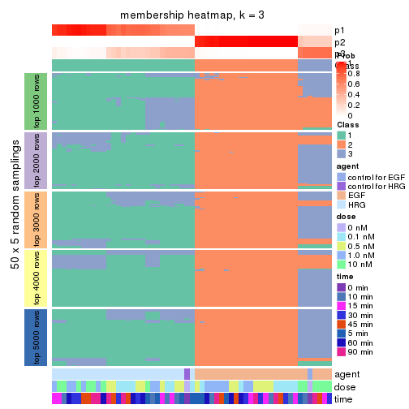</p>

</div>
<div id='tab-MAD-mclust-membership-heatmap-3'>
<pre><code class="r">membership_heatmap(res, k = 4)
</code></pre>

<p></p>

</div>
<div id='tab-MAD-mclust-membership-heatmap-4'>
<pre><code class="r">membership_heatmap(res, k = 5)
</code></pre>

<p></p>

</div>
<div id='tab-MAD-mclust-membership-heatmap-5'>
<pre><code class="r">membership_heatmap(res, k = 6)
</code></pre>

<p></p>

</div>
</div>

As soon as we have had the classes for columns, we can look for signatures
which are significantly different between classes which can be candidate marks
for certain classes. Following are the heatmaps for signatures.


Signature heatmaps where rows are scaled:


<script>
$( function() {
	$( '#tabs-MAD-mclust-get-signatures' ).tabs();
} );
</script>
<div id='tabs-MAD-mclust-get-signatures'>
<ul>
<li><a href='#tab-MAD-mclust-get-signatures-1'>k = 2</a></li>
<li><a href='#tab-MAD-mclust-get-signatures-2'>k = 3</a></li>
<li><a href='#tab-MAD-mclust-get-signatures-3'>k = 4</a></li>
<li><a href='#tab-MAD-mclust-get-signatures-4'>k = 5</a></li>
<li><a href='#tab-MAD-mclust-get-signatures-5'>k = 6</a></li>
</ul>
<div id='tab-MAD-mclust-get-signatures-1'>
<pre><code class="r">get_signatures(res, k = 2)
</code></pre>

<p></p>

</div>
<div id='tab-MAD-mclust-get-signatures-2'>
<pre><code class="r">get_signatures(res, k = 3)
</code></pre>

<p></p>

</div>
<div id='tab-MAD-mclust-get-signatures-3'>
<pre><code class="r">get_signatures(res, k = 4)
</code></pre>

<p></p>

</div>
<div id='tab-MAD-mclust-get-signatures-4'>
<pre><code class="r">get_signatures(res, k = 5)
</code></pre>

<p></p>

</div>
<div id='tab-MAD-mclust-get-signatures-5'>
<pre><code class="r">get_signatures(res, k = 6)
</code></pre>

<p></p>

</div>
</div>


Signature heatmaps where rows are not scaled:


<script>
$( function() {
	$( '#tabs-MAD-mclust-get-signatures-no-scale' ).tabs();
} );
</script>
<div id='tabs-MAD-mclust-get-signatures-no-scale'>
<ul>
<li><a href='#tab-MAD-mclust-get-signatures-no-scale-1'>k = 2</a></li>
<li><a href='#tab-MAD-mclust-get-signatures-no-scale-2'>k = 3</a></li>
<li><a href='#tab-MAD-mclust-get-signatures-no-scale-3'>k = 4</a></li>
<li><a href='#tab-MAD-mclust-get-signatures-no-scale-4'>k = 5</a></li>
<li><a href='#tab-MAD-mclust-get-signatures-no-scale-5'>k = 6</a></li>
</ul>
<div id='tab-MAD-mclust-get-signatures-no-scale-1'>
<pre><code class="r">get_signatures(res, k = 2, scale_rows = FALSE)
</code></pre>

<p></p>

</div>
<div id='tab-MAD-mclust-get-signatures-no-scale-2'>
<pre><code class="r">get_signatures(res, k = 3, scale_rows = FALSE)
</code></pre>

<p></p>

</div>
<div id='tab-MAD-mclust-get-signatures-no-scale-3'>
<pre><code class="r">get_signatures(res, k = 4, scale_rows = FALSE)
</code></pre>

<p></p>

</div>
<div id='tab-MAD-mclust-get-signatures-no-scale-4'>
<pre><code class="r">get_signatures(res, k = 5, scale_rows = FALSE)
</code></pre>

<p></p>

</div>
<div id='tab-MAD-mclust-get-signatures-no-scale-5'>
<pre><code class="r">get_signatures(res, k = 6, scale_rows = FALSE)
</code></pre>

<p></p>

</div>
</div>


Compare the overlap of signatures from different k:

```r
compare_signatures(res)
```


`get_signature()` returns a data frame invisibly. TO get the list of signatures, the function
call should be assigned to a variable explicitly. In following code, if `plot` argument is set
to `FALSE`, no heatmap is plotted while only the differential analysis is performed.

```r
# code only for demonstration
tb = get_signature(res, k = ..., plot = FALSE)
```

An example of the output of `tb` is:

```
#>   which_row         fdr    mean_1    mean_2 scaled_mean_1 scaled_mean_2 km
#> 1        38 0.042760348  8.373488  9.131774    -0.5533452     0.5164555  1
#> 2        40 0.018707592  7.106213  8.469186    -0.6173731     0.5762149  1
#> 3        55 0.019134737 10.221463 11.207825    -0.6159697     0.5749050  1
#> 4        59 0.006059896  5.921854  7.869574    -0.6899429     0.6439467  1
#> 5        60 0.018055526  8.928898 10.211722    -0.6204761     0.5791110  1
#> 6        98 0.009384629 15.714769 14.887706     0.6635654    -0.6193277  2
...
```

The columns in `tb` are:

1. `which_row`: row indices corresponding to the input matrix.
2. `fdr`: FDR for the differential test. 
3. `mean_x`: The mean value in group x.
4. `scaled_mean_x`: The mean value in group x after rows are scaled.
5. `km`: Row groups if k-means clustering is applied to rows.


UMAP plot which shows how samples are separated.


<script>
$( function() {
	$( '#tabs-MAD-mclust-dimension-reduction' ).tabs();
} );
</script>
<div id='tabs-MAD-mclust-dimension-reduction'>
<ul>
<li><a href='#tab-MAD-mclust-dimension-reduction-1'>k = 2</a></li>
<li><a href='#tab-MAD-mclust-dimension-reduction-2'>k = 3</a></li>
<li><a href='#tab-MAD-mclust-dimension-reduction-3'>k = 4</a></li>
<li><a href='#tab-MAD-mclust-dimension-reduction-4'>k = 5</a></li>
<li><a href='#tab-MAD-mclust-dimension-reduction-5'>k = 6</a></li>
</ul>
<div id='tab-MAD-mclust-dimension-reduction-1'>
<pre><code class="r">dimension_reduction(res, k = 2, method = &quot;UMAP&quot;)
</code></pre>

<p></p>

</div>
<div id='tab-MAD-mclust-dimension-reduction-2'>
<pre><code class="r">dimension_reduction(res, k = 3, method = &quot;UMAP&quot;)
</code></pre>

<p></p>

</div>
<div id='tab-MAD-mclust-dimension-reduction-3'>
<pre><code class="r">dimension_reduction(res, k = 4, method = &quot;UMAP&quot;)
</code></pre>

<p></p>

</div>
<div id='tab-MAD-mclust-dimension-reduction-4'>
<pre><code class="r">dimension_reduction(res, k = 5, method = &quot;UMAP&quot;)
</code></pre>

<p></p>

</div>
<div id='tab-MAD-mclust-dimension-reduction-5'>
<pre><code class="r">dimension_reduction(res, k = 6, method = &quot;UMAP&quot;)
</code></pre>

<p></p>

</div>
</div>


Following heatmap shows how subgroups are split when increasing `k`:

```r
collect_classes(res)
```


Test correlation between subgroups and known annotations. If the known
annotation is numeric, one-way ANOVA test is applied, and if the known
annotation is discrete, chi-squared contingency table test is applied.

```r
test_to_known_factors(res)
```

```
#>             n agent(p)  dose(p) time(p) k
#> MAD:mclust 51 8.42e-12 3.28e-01   0.996 2
#> MAD:mclust 57 9.44e-12 6.66e-04   0.995 3
#> MAD:mclust 55 4.28e-10 1.32e-05   0.961 4
#> MAD:mclust 51 2.29e-09 1.36e-05   0.947 5
#> MAD:mclust 51 1.15e-08 3.16e-06   0.863 6
```


If matrix rows can be associated to genes, consider to use `functional_enrichment(res,
...)` to perform function enrichment for the signature genes. See [this vignette](http://bioconductor.org/packages/devel/bioc/vignettes/cola/inst/doc/functional_enrichment.html) for more detailed explanations.


 

---------------------------------------------------


### MAD:NMF**


The object with results only for a single top-value method and a single partition method 
can be extracted as:

```r
res = res_list["MAD", "NMF"]
# you can also extract it by
# res = res_list["MAD:NMF"]
```

A summary of `res` and all the functions that can be applied to it:

```r
res
```

```
#> A 'ConsensusPartition' object with k = 2, 3, 4, 5, 6.
#>   On a matrix with 21163 rows and 57 columns.
#>   Top rows (1000, 2000, 3000, 4000, 5000) are extracted by 'MAD' method.
#>   Subgroups are detected by 'NMF' method.
#>   Performed in total 1250 partitions by row resampling.
#>   Best k for subgroups seems to be 2.
#> 
#> Following methods can be applied to this 'ConsensusPartition' object:
#>  [1] "cola_report"             "collect_classes"         "collect_plots"          
#>  [4] "collect_stats"           "colnames"                "compare_signatures"     
#>  [7] "consensus_heatmap"       "dimension_reduction"     "functional_enrichment"  
#> [10] "get_anno_col"            "get_anno"                "get_classes"            
#> [13] "get_consensus"           "get_matrix"              "get_membership"         
#> [16] "get_param"               "get_signatures"          "get_stats"              
#> [19] "is_best_k"               "is_stable_k"             "membership_heatmap"     
#> [22] "ncol"                    "nrow"                    "plot_ecdf"              
#> [25] "rownames"                "select_partition_number" "show"                   
#> [28] "suggest_best_k"          "test_to_known_factors"
```

`collect_plots()` function collects all the plots made from `res` for all `k` (number of partitions)
into one single page to provide an easy and fast comparison between different `k`.

```r
collect_plots(res)
```


The plots are:

- The first row: a plot of the ECDF (empirical cumulative distribution
  function) curves of the consensus matrix for each `k` and the heatmap of
  predicted classes for each `k`.
- The second row: heatmaps of the consensus matrix for each `k`.
- The third row: heatmaps of the membership matrix for each `k`.
- The fouth row: heatmaps of the signatures for each `k`.

All the plots in panels can be made by individual functions and they are
plotted later in this section.

`select_partition_number()` produces several plots showing different
statistics for choosing "optimized" `k`. There are following statistics:

- ECDF curves of the consensus matrix for each `k`;
- 1-PAC. [The PAC
  score](https://en.wikipedia.org/wiki/Consensus_clustering#Over-interpretation_potential_of_consensus_clustering)
  measures the proportion of the ambiguous subgrouping.
- Mean silhouette score.
- Concordance. The mean probability of fiting the consensus class ids in all
  partitions.
- Area increased. Denote $A_k$ as the area under the ECDF curve for current
  `k`, the area increased is defined as $A_k - A_{k-1}$.
- Rand index. The percent of pairs of samples that are both in a same cluster
  or both are not in a same cluster in the partition of k and k-1.
- Jaccard index. The ratio of pairs of samples are both in a same cluster in
  the partition of k and k-1 and the pairs of samples are both in a same
  cluster in the partition k or k-1.

The detailed explanations of these statistics can be found in [the _cola_
vignette](http://bioconductor.org/packages/devel/bioc/vignettes/cola/inst/doc/cola.html#toc_13).

Generally speaking, lower PAC score, higher mean silhouette score or higher
concordance corresponds to better partition. Rand index and Jaccard index
measure how similar the current partition is compared to partition with `k-1`.
If they are too similar, we won't accept `k` is better than `k-1`.

```r
select_partition_number(res)
```


The numeric values for all these statistics can be obtained by `get_stats()`.

```r
get_stats(res)
```

```
#>   k 1-PAC mean_silhouette concordance area_increased  Rand Jaccard
#> 2 2 1.000           1.000       1.000         0.5093 0.491   0.491
#> 3 3 0.686           0.865       0.851         0.1993 1.000   1.000
#> 4 4 0.557           0.756       0.796         0.1485 0.784   0.560
#> 5 5 0.564           0.743       0.789         0.0772 0.982   0.938
#> 6 6 0.621           0.627       0.739         0.0435 0.993   0.975
```

`suggest_best_k()` suggests the best $k$ based on these statistics. The rules are as follows:

- All $k$ with Jaccard index larger than 0.95 are removed because increasing
  $k$ does not provide enough extra information. If all $k$ are removed, it is
  marked as no subgroup is detected.
- For all $k$ with 1-PAC score larger than 0.9, the maximal $k$ is taken as
  the best $k$, and other $k$ are marked as optional $k$.
- If it does not fit the second rule. The $k$ with the maximal vote of the
  highest 1-PAC score, highest mean silhouette, and highest concordance is
  taken as the best $k$.

```r
suggest_best_k(res)
```

```
#> [1] 2
```


Following shows the table of the partitions (You need to click the **show/hide
code output** link to see it). The membership matrix (columns with name `p*`)
is inferred by
[`clue::cl_consensus()`](https://www.rdocumentation.org/link/cl_consensus?package=clue)
function with the `SE` method. Basically the value in the membership matrix
represents the probability to belong to a certain group. The finall class
label for an item is determined with the group with highest probability it
belongs to.

In `get_classes()` function, the entropy is calculated from the membership
matrix and the silhouette score is calculated from the consensus matrix.


<script>
$( function() {
	$( '#tabs-MAD-NMF-get-classes' ).tabs();
} );
</script>
<div id='tabs-MAD-NMF-get-classes'>
<ul>
<li><a href='#tab-MAD-NMF-get-classes-1'>k = 2</a></li>
<li><a href='#tab-MAD-NMF-get-classes-2'>k = 3</a></li>
<li><a href='#tab-MAD-NMF-get-classes-3'>k = 4</a></li>
<li><a href='#tab-MAD-NMF-get-classes-4'>k = 5</a></li>
<li><a href='#tab-MAD-NMF-get-classes-5'>k = 6</a></li>
</ul>

<div id='tab-MAD-NMF-get-classes-1'>
<p><a id='tab-MAD-NMF-get-classes-1-a' style='color:#0366d6' href='#'>show/hide code output</a></p>
<pre><code class="r">cbind(get_classes(res, k = 2), get_membership(res, k = 2))
</code></pre>

<pre><code>#&gt;           class entropy silhouette p1 p2
#&gt; GSM148516     2       0          1  0  1
#&gt; GSM148517     1       0          1  1  0
#&gt; GSM148518     2       0          1  0  1
#&gt; GSM148519     2       0          1  0  1
#&gt; GSM148520     2       0          1  0  1
#&gt; GSM148521     2       0          1  0  1
#&gt; GSM148522     2       0          1  0  1
#&gt; GSM148523     2       0          1  0  1
#&gt; GSM148524     2       0          1  0  1
#&gt; GSM148525     2       0          1  0  1
#&gt; GSM148526     2       0          1  0  1
#&gt; GSM148527     2       0          1  0  1
#&gt; GSM148528     2       0          1  0  1
#&gt; GSM148529     2       0          1  0  1
#&gt; GSM148530     2       0          1  0  1
#&gt; GSM148531     2       0          1  0  1
#&gt; GSM148532     2       0          1  0  1
#&gt; GSM148533     2       0          1  0  1
#&gt; GSM148534     2       0          1  0  1
#&gt; GSM148535     2       0          1  0  1
#&gt; GSM148536     2       0          1  0  1
#&gt; GSM148537     2       0          1  0  1
#&gt; GSM148538     2       0          1  0  1
#&gt; GSM148539     2       0          1  0  1
#&gt; GSM148540     2       0          1  0  1
#&gt; GSM148541     2       0          1  0  1
#&gt; GSM148542     2       0          1  0  1
#&gt; GSM148543     2       0          1  0  1
#&gt; GSM148544     2       0          1  0  1
#&gt; GSM148545     1       0          1  1  0
#&gt; GSM148546     1       0          1  1  0
#&gt; GSM148547     1       0          1  1  0
#&gt; GSM148548     1       0          1  1  0
#&gt; GSM148549     1       0          1  1  0
#&gt; GSM148550     1       0          1  1  0
#&gt; GSM148551     1       0          1  1  0
#&gt; GSM148552     1       0          1  1  0
#&gt; GSM148553     1       0          1  1  0
#&gt; GSM148554     1       0          1  1  0
#&gt; GSM148555     1       0          1  1  0
#&gt; GSM148556     1       0          1  1  0
#&gt; GSM148557     1       0          1  1  0
#&gt; GSM148558     1       0          1  1  0
#&gt; GSM148559     1       0          1  1  0
#&gt; GSM148560     1       0          1  1  0
#&gt; GSM148561     1       0          1  1  0
#&gt; GSM148562     1       0          1  1  0
#&gt; GSM148563     1       0          1  1  0
#&gt; GSM148564     1       0          1  1  0
#&gt; GSM148565     1       0          1  1  0
#&gt; GSM148566     1       0          1  1  0
#&gt; GSM148567     1       0          1  1  0
#&gt; GSM148568     1       0          1  1  0
#&gt; GSM148569     1       0          1  1  0
#&gt; GSM148570     1       0          1  1  0
#&gt; GSM148571     1       0          1  1  0
#&gt; GSM148572     1       0          1  1  0
</code></pre>

<script>
$('#tab-MAD-NMF-get-classes-1-a').parent().next().next().hide();
$('#tab-MAD-NMF-get-classes-1-a').click(function(){
  $('#tab-MAD-NMF-get-classes-1-a').parent().next().next().toggle();
  return(false);
});
</script>
</div>

<div id='tab-MAD-NMF-get-classes-2'>
<p><a id='tab-MAD-NMF-get-classes-2-a' style='color:#0366d6' href='#'>show/hide code output</a></p>
<pre><code class="r">cbind(get_classes(res, k = 3), get_membership(res, k = 3))
</code></pre>

<pre><code>#&gt;           class entropy silhouette    p1    p2 p3
#&gt; GSM148516     2   0.661      0.715 0.008 0.560 NA
#&gt; GSM148517     1   0.341      0.863 0.876 0.000 NA
#&gt; GSM148518     2   0.153      0.911 0.000 0.960 NA
#&gt; GSM148519     2   0.129      0.910 0.000 0.968 NA
#&gt; GSM148520     2   0.245      0.905 0.000 0.924 NA
#&gt; GSM148521     2   0.186      0.910 0.000 0.948 NA
#&gt; GSM148522     2   0.186      0.909 0.000 0.948 NA
#&gt; GSM148523     2   0.129      0.911 0.000 0.968 NA
#&gt; GSM148524     2   0.141      0.908 0.000 0.964 NA
#&gt; GSM148525     2   0.254      0.904 0.000 0.920 NA
#&gt; GSM148526     2   0.245      0.909 0.000 0.924 NA
#&gt; GSM148527     2   0.103      0.910 0.000 0.976 NA
#&gt; GSM148528     2   0.103      0.910 0.000 0.976 NA
#&gt; GSM148529     2   0.196      0.903 0.000 0.944 NA
#&gt; GSM148530     2   0.175      0.911 0.000 0.952 NA
#&gt; GSM148531     2   0.153      0.910 0.000 0.960 NA
#&gt; GSM148532     2   0.236      0.908 0.000 0.928 NA
#&gt; GSM148533     2   0.153      0.911 0.000 0.960 NA
#&gt; GSM148534     2   0.175      0.910 0.000 0.952 NA
#&gt; GSM148535     2   0.129      0.910 0.000 0.968 NA
#&gt; GSM148536     2   0.175      0.910 0.000 0.952 NA
#&gt; GSM148537     2   0.186      0.909 0.000 0.948 NA
#&gt; GSM148538     2   0.216      0.906 0.000 0.936 NA
#&gt; GSM148539     2   0.625      0.798 0.016 0.684 NA
#&gt; GSM148540     2   0.615      0.742 0.000 0.592 NA
#&gt; GSM148541     2   0.650      0.690 0.004 0.532 NA
#&gt; GSM148542     2   0.639      0.731 0.004 0.584 NA
#&gt; GSM148543     2   0.633      0.746 0.004 0.600 NA
#&gt; GSM148544     2   0.581      0.785 0.000 0.664 NA
#&gt; GSM148545     1   0.327      0.866 0.884 0.000 NA
#&gt; GSM148546     1   0.304      0.869 0.896 0.000 NA
#&gt; GSM148547     1   0.304      0.870 0.896 0.000 NA
#&gt; GSM148548     1   0.263      0.875 0.916 0.000 NA
#&gt; GSM148549     1   0.216      0.887 0.936 0.000 NA
#&gt; GSM148550     1   0.226      0.884 0.932 0.000 NA
#&gt; GSM148551     1   0.245      0.889 0.924 0.000 NA
#&gt; GSM148552     1   0.520      0.818 0.796 0.020 NA
#&gt; GSM148553     1   0.418      0.843 0.828 0.000 NA
#&gt; GSM148554     1   0.263      0.874 0.916 0.000 NA
#&gt; GSM148555     1   0.254      0.887 0.920 0.000 NA
#&gt; GSM148556     1   0.129      0.888 0.968 0.000 NA
#&gt; GSM148557     1   0.263      0.888 0.916 0.000 NA
#&gt; GSM148558     1   0.271      0.886 0.912 0.000 NA
#&gt; GSM148559     1   0.435      0.855 0.836 0.008 NA
#&gt; GSM148560     1   0.245      0.888 0.924 0.000 NA
#&gt; GSM148561     1   0.583      0.804 0.660 0.000 NA
#&gt; GSM148562     1   0.506      0.862 0.756 0.000 NA
#&gt; GSM148563     1   0.529      0.851 0.732 0.000 NA
#&gt; GSM148564     1   0.525      0.852 0.736 0.000 NA
#&gt; GSM148565     1   0.497      0.859 0.764 0.000 NA
#&gt; GSM148566     1   0.271      0.888 0.912 0.000 NA
#&gt; GSM148567     1   0.562      0.833 0.692 0.000 NA
#&gt; GSM148568     1   0.455      0.869 0.800 0.000 NA
#&gt; GSM148569     1   0.529      0.851 0.732 0.000 NA
#&gt; GSM148570     1   0.550      0.839 0.708 0.000 NA
#&gt; GSM148571     1   0.529      0.848 0.732 0.000 NA
#&gt; GSM148572     1   0.556      0.836 0.700 0.000 NA
</code></pre>

<script>
$('#tab-MAD-NMF-get-classes-2-a').parent().next().next().hide();
$('#tab-MAD-NMF-get-classes-2-a').click(function(){
  $('#tab-MAD-NMF-get-classes-2-a').parent().next().next().toggle();
  return(false);
});
</script>
</div>

<div id='tab-MAD-NMF-get-classes-3'>
<p><a id='tab-MAD-NMF-get-classes-3-a' style='color:#0366d6' href='#'>show/hide code output</a></p>
<pre><code class="r">cbind(get_classes(res, k = 4), get_membership(res, k = 4))
</code></pre>

<pre><code>#&gt;           class entropy silhouette    p1    p2    p3    p4
#&gt; GSM148516     3   0.631      0.818 0.028 0.268 0.656 0.048
#&gt; GSM148517     1   0.267      0.715 0.908 0.000 0.044 0.048
#&gt; GSM148518     2   0.247      0.856 0.000 0.900 0.096 0.004
#&gt; GSM148519     2   0.180      0.903 0.000 0.944 0.040 0.016
#&gt; GSM148520     2   0.361      0.835 0.000 0.840 0.140 0.020
#&gt; GSM148521     2   0.254      0.894 0.000 0.904 0.084 0.012
#&gt; GSM148522     2   0.172      0.892 0.000 0.944 0.048 0.008
#&gt; GSM148523     2   0.131      0.902 0.000 0.960 0.036 0.004
#&gt; GSM148524     2   0.227      0.894 0.000 0.916 0.076 0.008
#&gt; GSM148525     2   0.458      0.591 0.000 0.748 0.232 0.020
#&gt; GSM148526     2   0.350      0.827 0.000 0.844 0.140 0.016
#&gt; GSM148527     2   0.149      0.903 0.000 0.952 0.044 0.004
#&gt; GSM148528     2   0.271      0.890 0.000 0.900 0.080 0.020
#&gt; GSM148529     2   0.214      0.889 0.000 0.928 0.056 0.016
#&gt; GSM148530     2   0.168      0.903 0.000 0.948 0.040 0.012
#&gt; GSM148531     2   0.131      0.901 0.000 0.960 0.036 0.004
#&gt; GSM148532     2   0.371      0.828 0.000 0.840 0.132 0.028
#&gt; GSM148533     2   0.222      0.874 0.000 0.908 0.092 0.000
#&gt; GSM148534     2   0.180      0.901 0.000 0.944 0.040 0.016
#&gt; GSM148535     2   0.161      0.898 0.000 0.952 0.032 0.016
#&gt; GSM148536     2   0.286      0.883 0.000 0.888 0.096 0.016
#&gt; GSM148537     2   0.177      0.901 0.000 0.944 0.044 0.012
#&gt; GSM148538     2   0.283      0.875 0.000 0.900 0.060 0.040
#&gt; GSM148539     3   0.718      0.667 0.068 0.404 0.500 0.028
#&gt; GSM148540     3   0.584      0.827 0.024 0.248 0.692 0.036
#&gt; GSM148541     3   0.559      0.804 0.020 0.200 0.732 0.048
#&gt; GSM148542     3   0.617      0.809 0.012 0.300 0.636 0.052
#&gt; GSM148543     3   0.734      0.821 0.040 0.292 0.580 0.088
#&gt; GSM148544     3   0.744      0.750 0.024 0.368 0.508 0.100
#&gt; GSM148545     1   0.231      0.726 0.924 0.000 0.032 0.044
#&gt; GSM148546     1   0.198      0.736 0.936 0.000 0.016 0.048
#&gt; GSM148547     1   0.244      0.735 0.916 0.000 0.024 0.060
#&gt; GSM148548     1   0.234      0.737 0.912 0.000 0.008 0.080
#&gt; GSM148549     1   0.568      0.435 0.640 0.000 0.044 0.316
#&gt; GSM148550     1   0.331      0.713 0.840 0.000 0.004 0.156
#&gt; GSM148551     1   0.509      0.425 0.640 0.000 0.012 0.348
#&gt; GSM148552     1   0.309      0.675 0.888 0.000 0.060 0.052
#&gt; GSM148553     1   0.330      0.681 0.876 0.004 0.092 0.028
#&gt; GSM148554     1   0.227      0.738 0.912 0.000 0.004 0.084
#&gt; GSM148555     1   0.445      0.637 0.744 0.000 0.012 0.244
#&gt; GSM148556     1   0.376      0.658 0.784 0.000 0.000 0.216
#&gt; GSM148557     1   0.481      0.496 0.676 0.000 0.008 0.316
#&gt; GSM148558     1   0.550     -0.130 0.520 0.000 0.016 0.464
#&gt; GSM148559     1   0.483      0.669 0.792 0.004 0.084 0.120
#&gt; GSM148560     1   0.514      0.625 0.716 0.000 0.040 0.244
#&gt; GSM148561     4   0.700      0.558 0.264 0.004 0.148 0.584
#&gt; GSM148562     4   0.520      0.792 0.252 0.000 0.040 0.708
#&gt; GSM148563     4   0.440      0.837 0.212 0.000 0.020 0.768
#&gt; GSM148564     4   0.446      0.843 0.208 0.000 0.024 0.768
#&gt; GSM148565     4   0.439      0.833 0.252 0.000 0.008 0.740
#&gt; GSM148566     1   0.515      0.496 0.664 0.000 0.020 0.316
#&gt; GSM148567     4   0.477      0.804 0.256 0.000 0.020 0.724
#&gt; GSM148568     4   0.561      0.602 0.380 0.000 0.028 0.592
#&gt; GSM148569     4   0.419      0.833 0.228 0.000 0.008 0.764
#&gt; GSM148570     4   0.418      0.841 0.200 0.000 0.016 0.784
#&gt; GSM148571     4   0.394      0.842 0.236 0.000 0.000 0.764
#&gt; GSM148572     4   0.416      0.828 0.188 0.000 0.020 0.792
</code></pre>

<script>
$('#tab-MAD-NMF-get-classes-3-a').parent().next().next().hide();
$('#tab-MAD-NMF-get-classes-3-a').click(function(){
  $('#tab-MAD-NMF-get-classes-3-a').parent().next().next().toggle();
  return(false);
});
</script>
</div>

<div id='tab-MAD-NMF-get-classes-4'>
<p><a id='tab-MAD-NMF-get-classes-4-a' style='color:#0366d6' href='#'>show/hide code output</a></p>
<pre><code class="r">cbind(get_classes(res, k = 5), get_membership(res, k = 5))
</code></pre>

<pre><code>#&gt;           class entropy silhouette    p1    p2    p3    p4 p5
#&gt; GSM148516     3   0.531      0.798 0.020 0.080 0.736 0.016 NA
#&gt; GSM148517     1   0.382      0.718 0.820 0.000 0.020 0.032 NA
#&gt; GSM148518     2   0.308      0.856 0.000 0.860 0.092 0.000 NA
#&gt; GSM148519     2   0.199      0.891 0.000 0.924 0.032 0.000 NA
#&gt; GSM148520     2   0.461      0.795 0.004 0.756 0.116 0.000 NA
#&gt; GSM148521     2   0.327      0.871 0.008 0.860 0.064 0.000 NA
#&gt; GSM148522     2   0.232      0.882 0.008 0.916 0.020 0.004 NA
#&gt; GSM148523     2   0.226      0.883 0.000 0.908 0.028 0.000 NA
#&gt; GSM148524     2   0.267      0.882 0.004 0.892 0.044 0.000 NA
#&gt; GSM148525     2   0.543      0.517 0.000 0.632 0.268 0.000 NA
#&gt; GSM148526     2   0.442      0.803 0.012 0.772 0.156 0.000 NA
#&gt; GSM148527     2   0.175      0.891 0.000 0.936 0.028 0.000 NA
#&gt; GSM148528     2   0.304      0.876 0.000 0.864 0.056 0.000 NA
#&gt; GSM148529     2   0.228      0.889 0.000 0.908 0.032 0.000 NA
#&gt; GSM148530     2   0.144      0.890 0.000 0.948 0.012 0.000 NA
#&gt; GSM148531     2   0.197      0.891 0.004 0.932 0.020 0.004 NA
#&gt; GSM148532     2   0.391      0.814 0.000 0.796 0.144 0.000 NA
#&gt; GSM148533     2   0.279      0.877 0.000 0.880 0.052 0.000 NA
#&gt; GSM148534     2   0.340      0.859 0.000 0.840 0.040 0.004 NA
#&gt; GSM148535     2   0.221      0.884 0.000 0.912 0.032 0.000 NA
#&gt; GSM148536     2   0.292      0.878 0.000 0.872 0.072 0.000 NA
#&gt; GSM148537     2   0.194      0.886 0.000 0.924 0.020 0.000 NA
#&gt; GSM148538     2   0.305      0.878 0.008 0.876 0.024 0.008 NA
#&gt; GSM148539     3   0.681      0.709 0.036 0.228 0.552 0.000 NA
#&gt; GSM148540     3   0.497      0.819 0.008 0.100 0.752 0.012 NA
#&gt; GSM148541     3   0.442      0.806 0.012 0.068 0.808 0.024 NA
#&gt; GSM148542     3   0.632      0.785 0.016 0.120 0.672 0.052 NA
#&gt; GSM148543     3   0.512      0.817 0.008 0.124 0.756 0.036 NA
#&gt; GSM148544     3   0.642      0.772 0.000 0.184 0.636 0.088 NA
#&gt; GSM148545     1   0.282      0.733 0.884 0.000 0.012 0.024 NA
#&gt; GSM148546     1   0.208      0.744 0.928 0.000 0.016 0.032 NA
#&gt; GSM148547     1   0.234      0.744 0.916 0.000 0.020 0.024 NA
#&gt; GSM148548     1   0.331      0.738 0.860 0.000 0.016 0.084 NA
#&gt; GSM148549     1   0.713      0.290 0.480 0.000 0.084 0.344 NA
#&gt; GSM148550     1   0.438      0.663 0.740 0.000 0.008 0.220 NA
#&gt; GSM148551     1   0.685      0.266 0.484 0.000 0.060 0.368 NA
#&gt; GSM148552     1   0.327      0.730 0.860 0.004 0.020 0.016 NA
#&gt; GSM148553     1   0.347      0.720 0.844 0.000 0.048 0.008 NA
#&gt; GSM148554     1   0.282      0.738 0.884 0.000 0.012 0.080 NA
#&gt; GSM148555     1   0.616      0.512 0.580 0.000 0.028 0.304 NA
#&gt; GSM148556     1   0.447      0.636 0.720 0.000 0.008 0.244 NA
#&gt; GSM148557     1   0.569      0.411 0.556 0.000 0.012 0.372 NA
#&gt; GSM148558     4   0.570      0.199 0.376 0.000 0.012 0.552 NA
#&gt; GSM148559     1   0.494      0.669 0.732 0.004 0.016 0.056 NA
#&gt; GSM148560     1   0.520      0.631 0.692 0.000 0.004 0.108 NA
#&gt; GSM148561     4   0.790      0.404 0.152 0.004 0.108 0.436 NA
#&gt; GSM148562     4   0.484      0.745 0.092 0.000 0.048 0.772 NA
#&gt; GSM148563     4   0.436      0.785 0.096 0.000 0.012 0.788 NA
#&gt; GSM148564     4   0.321      0.804 0.092 0.000 0.008 0.860 NA
#&gt; GSM148565     4   0.311      0.800 0.096 0.000 0.008 0.864 NA
#&gt; GSM148566     1   0.508      0.617 0.700 0.000 0.000 0.160 NA
#&gt; GSM148567     4   0.424      0.781 0.108 0.000 0.008 0.792 NA
#&gt; GSM148568     4   0.502      0.674 0.212 0.000 0.004 0.700 NA
#&gt; GSM148569     4   0.263      0.803 0.056 0.000 0.020 0.900 NA
#&gt; GSM148570     4   0.290      0.808 0.064 0.000 0.012 0.884 NA
#&gt; GSM148571     4   0.245      0.805 0.076 0.000 0.000 0.896 NA
#&gt; GSM148572     4   0.258      0.795 0.040 0.000 0.008 0.900 NA
</code></pre>

<script>
$('#tab-MAD-NMF-get-classes-4-a').parent().next().next().hide();
$('#tab-MAD-NMF-get-classes-4-a').click(function(){
  $('#tab-MAD-NMF-get-classes-4-a').parent().next().next().toggle();
  return(false);
});
</script>
</div>

<div id='tab-MAD-NMF-get-classes-5'>
<p><a id='tab-MAD-NMF-get-classes-5-a' style='color:#0366d6' href='#'>show/hide code output</a></p>
<pre><code class="r">cbind(get_classes(res, k = 6), get_membership(res, k = 6))
</code></pre>

<pre><code>#&gt;           class entropy silhouette    p1    p2    p3    p4    p5 p6
#&gt; GSM148516     3   0.656      0.624 0.012 0.060 0.560 0.004 0.132 NA
#&gt; GSM148517     1   0.557      0.541 0.632 0.000 0.024 0.016 0.244 NA
#&gt; GSM148518     2   0.368      0.844 0.000 0.812 0.064 0.000 0.020 NA
#&gt; GSM148519     2   0.191      0.878 0.000 0.920 0.016 0.000 0.008 NA
#&gt; GSM148520     2   0.488      0.741 0.000 0.672 0.064 0.000 0.024 NA
#&gt; GSM148521     2   0.335      0.868 0.000 0.832 0.040 0.000 0.020 NA
#&gt; GSM148522     2   0.261      0.871 0.000 0.884 0.044 0.000 0.012 NA
#&gt; GSM148523     2   0.256      0.871 0.000 0.880 0.040 0.000 0.004 NA
#&gt; GSM148524     2   0.313      0.868 0.000 0.848 0.032 0.004 0.012 NA
#&gt; GSM148525     2   0.490      0.624 0.000 0.656 0.200 0.000 0.000 NA
#&gt; GSM148526     2   0.391      0.849 0.000 0.792 0.068 0.000 0.020 NA
#&gt; GSM148527     2   0.292      0.878 0.000 0.856 0.052 0.000 0.004 NA
#&gt; GSM148528     2   0.300      0.873 0.000 0.848 0.028 0.000 0.012 NA
#&gt; GSM148529     2   0.261      0.874 0.000 0.864 0.008 0.000 0.012 NA
#&gt; GSM148530     2   0.178      0.880 0.000 0.920 0.016 0.000 0.000 NA
#&gt; GSM148531     2   0.335      0.866 0.000 0.824 0.028 0.000 0.020 NA
#&gt; GSM148532     2   0.453      0.761 0.000 0.700 0.088 0.000 0.004 NA
#&gt; GSM148533     2   0.325      0.862 0.000 0.836 0.060 0.000 0.008 NA
#&gt; GSM148534     2   0.302      0.874 0.000 0.840 0.016 0.000 0.016 NA
#&gt; GSM148535     2   0.224      0.870 0.000 0.900 0.020 0.000 0.008 NA
#&gt; GSM148536     2   0.366      0.854 0.000 0.804 0.060 0.000 0.012 NA
#&gt; GSM148537     2   0.201      0.874 0.000 0.916 0.012 0.000 0.016 NA
#&gt; GSM148538     2   0.304      0.861 0.000 0.828 0.008 0.000 0.016 NA
#&gt; GSM148539     3   0.607      0.599 0.016 0.188 0.604 0.000 0.032 NA
#&gt; GSM148540     3   0.474      0.676 0.000 0.028 0.732 0.012 0.060 NA
#&gt; GSM148541     3   0.454      0.676 0.004 0.016 0.752 0.012 0.060 NA
#&gt; GSM148542     3   0.666      0.607 0.004 0.060 0.580 0.036 0.104 NA
#&gt; GSM148543     3   0.466      0.692 0.012 0.040 0.788 0.040 0.052 NA
#&gt; GSM148544     3   0.590      0.641 0.004 0.064 0.692 0.092 0.068 NA
#&gt; GSM148545     1   0.360      0.629 0.788 0.000 0.000 0.008 0.168 NA
#&gt; GSM148546     1   0.282      0.656 0.880 0.000 0.012 0.020 0.068 NA
#&gt; GSM148547     1   0.301      0.655 0.872 0.000 0.020 0.016 0.064 NA
#&gt; GSM148548     1   0.311      0.656 0.860 0.000 0.000 0.052 0.052 NA
#&gt; GSM148549     1   0.727      0.370 0.508 0.000 0.124 0.208 0.128 NA
#&gt; GSM148550     1   0.484      0.603 0.732 0.000 0.016 0.140 0.092 NA
#&gt; GSM148551     1   0.707      0.289 0.492 0.000 0.052 0.276 0.136 NA
#&gt; GSM148552     1   0.402      0.639 0.792 0.008 0.016 0.000 0.120 NA
#&gt; GSM148553     1   0.445      0.622 0.764 0.004 0.036 0.008 0.148 NA
#&gt; GSM148554     1   0.207      0.660 0.916 0.000 0.000 0.044 0.028 NA
#&gt; GSM148555     1   0.708      0.446 0.548 0.004 0.072 0.164 0.172 NA
#&gt; GSM148556     1   0.453      0.610 0.740 0.000 0.004 0.152 0.088 NA
#&gt; GSM148557     1   0.587      0.312 0.532 0.000 0.016 0.332 0.112 NA
#&gt; GSM148558     4   0.592      0.123 0.368 0.000 0.008 0.504 0.100 NA
#&gt; GSM148559     1   0.609      0.488 0.596 0.004 0.012 0.044 0.248 NA
#&gt; GSM148560     1   0.645      0.192 0.468 0.000 0.012 0.144 0.348 NA
#&gt; GSM148561     5   0.764      0.000 0.096 0.012 0.060 0.352 0.408 NA
#&gt; GSM148562     4   0.575      0.312 0.076 0.000 0.052 0.664 0.180 NA
#&gt; GSM148563     4   0.394      0.517 0.068 0.000 0.008 0.784 0.136 NA
#&gt; GSM148564     4   0.390      0.551 0.036 0.000 0.020 0.808 0.116 NA
#&gt; GSM148565     4   0.358      0.593 0.072 0.000 0.008 0.832 0.068 NA
#&gt; GSM148566     1   0.628      0.249 0.532 0.000 0.008 0.192 0.244 NA
#&gt; GSM148567     4   0.516      0.310 0.072 0.004 0.004 0.680 0.212 NA
#&gt; GSM148568     4   0.568      0.108 0.160 0.000 0.004 0.612 0.204 NA
#&gt; GSM148569     4   0.357      0.598 0.056 0.000 0.020 0.840 0.064 NA
#&gt; GSM148570     4   0.347      0.561 0.052 0.000 0.008 0.836 0.088 NA
#&gt; GSM148571     4   0.179      0.617 0.040 0.000 0.000 0.928 0.028 NA
#&gt; GSM148572     4   0.269      0.601 0.032 0.000 0.016 0.888 0.056 NA
</code></pre>

<script>
$('#tab-MAD-NMF-get-classes-5-a').parent().next().next().hide();
$('#tab-MAD-NMF-get-classes-5-a').click(function(){
  $('#tab-MAD-NMF-get-classes-5-a').parent().next().next().toggle();
  return(false);
});
</script>
</div>
</div>

Heatmaps for the consensus matrix. It visualizes the probability of two
samples to be in a same group.


<script>
$( function() {
	$( '#tabs-MAD-NMF-consensus-heatmap' ).tabs();
} );
</script>
<div id='tabs-MAD-NMF-consensus-heatmap'>
<ul>
<li><a href='#tab-MAD-NMF-consensus-heatmap-1'>k = 2</a></li>
<li><a href='#tab-MAD-NMF-consensus-heatmap-2'>k = 3</a></li>
<li><a href='#tab-MAD-NMF-consensus-heatmap-3'>k = 4</a></li>
<li><a href='#tab-MAD-NMF-consensus-heatmap-4'>k = 5</a></li>
<li><a href='#tab-MAD-NMF-consensus-heatmap-5'>k = 6</a></li>
</ul>
<div id='tab-MAD-NMF-consensus-heatmap-1'>
<pre><code class="r">consensus_heatmap(res, k = 2)
</code></pre>

<p></p>

</div>
<div id='tab-MAD-NMF-consensus-heatmap-2'>
<pre><code class="r">consensus_heatmap(res, k = 3)
</code></pre>

<p></p>

</div>
<div id='tab-MAD-NMF-consensus-heatmap-3'>
<pre><code class="r">consensus_heatmap(res, k = 4)
</code></pre>

<p></p>

</div>
<div id='tab-MAD-NMF-consensus-heatmap-4'>
<pre><code class="r">consensus_heatmap(res, k = 5)
</code></pre>

<p></p>

</div>
<div id='tab-MAD-NMF-consensus-heatmap-5'>
<pre><code class="r">consensus_heatmap(res, k = 6)
</code></pre>

<p></p>

</div>
</div>

Heatmaps for the membership of samples in all partitions to see how consistent they are:


<script>
$( function() {
	$( '#tabs-MAD-NMF-membership-heatmap' ).tabs();
} );
</script>
<div id='tabs-MAD-NMF-membership-heatmap'>
<ul>
<li><a href='#tab-MAD-NMF-membership-heatmap-1'>k = 2</a></li>
<li><a href='#tab-MAD-NMF-membership-heatmap-2'>k = 3</a></li>
<li><a href='#tab-MAD-NMF-membership-heatmap-3'>k = 4</a></li>
<li><a href='#tab-MAD-NMF-membership-heatmap-4'>k = 5</a></li>
<li><a href='#tab-MAD-NMF-membership-heatmap-5'>k = 6</a></li>
</ul>
<div id='tab-MAD-NMF-membership-heatmap-1'>
<pre><code class="r">membership_heatmap(res, k = 2)
</code></pre>

<p></p>

</div>
<div id='tab-MAD-NMF-membership-heatmap-2'>
<pre><code class="r">membership_heatmap(res, k = 3)
</code></pre>

<p></p>

</div>
<div id='tab-MAD-NMF-membership-heatmap-3'>
<pre><code class="r">membership_heatmap(res, k = 4)
</code></pre>

<p></p>

</div>
<div id='tab-MAD-NMF-membership-heatmap-4'>
<pre><code class="r">membership_heatmap(res, k = 5)
</code></pre>

<p></p>

</div>
<div id='tab-MAD-NMF-membership-heatmap-5'>
<pre><code class="r">membership_heatmap(res, k = 6)
</code></pre>

<p></p>

</div>
</div>

As soon as we have had the classes for columns, we can look for signatures
which are significantly different between classes which can be candidate marks
for certain classes. Following are the heatmaps for signatures.


Signature heatmaps where rows are scaled:


<script>
$( function() {
	$( '#tabs-MAD-NMF-get-signatures' ).tabs();
} );
</script>
<div id='tabs-MAD-NMF-get-signatures'>
<ul>
<li><a href='#tab-MAD-NMF-get-signatures-1'>k = 2</a></li>
<li><a href='#tab-MAD-NMF-get-signatures-2'>k = 3</a></li>
<li><a href='#tab-MAD-NMF-get-signatures-3'>k = 4</a></li>
<li><a href='#tab-MAD-NMF-get-signatures-4'>k = 5</a></li>
<li><a href='#tab-MAD-NMF-get-signatures-5'>k = 6</a></li>
</ul>
<div id='tab-MAD-NMF-get-signatures-1'>
<pre><code class="r">get_signatures(res, k = 2)
</code></pre>

<p></p>

</div>
<div id='tab-MAD-NMF-get-signatures-2'>
<pre><code class="r">get_signatures(res, k = 3)
</code></pre>

<p></p>

</div>
<div id='tab-MAD-NMF-get-signatures-3'>
<pre><code class="r">get_signatures(res, k = 4)
</code></pre>

<p></p>

</div>
<div id='tab-MAD-NMF-get-signatures-4'>
<pre><code class="r">get_signatures(res, k = 5)
</code></pre>

<p></p>

</div>
<div id='tab-MAD-NMF-get-signatures-5'>
<pre><code class="r">get_signatures(res, k = 6)
</code></pre>

<p></p>

</div>
</div>


Signature heatmaps where rows are not scaled:


<script>
$( function() {
	$( '#tabs-MAD-NMF-get-signatures-no-scale' ).tabs();
} );
</script>
<div id='tabs-MAD-NMF-get-signatures-no-scale'>
<ul>
<li><a href='#tab-MAD-NMF-get-signatures-no-scale-1'>k = 2</a></li>
<li><a href='#tab-MAD-NMF-get-signatures-no-scale-2'>k = 3</a></li>
<li><a href='#tab-MAD-NMF-get-signatures-no-scale-3'>k = 4</a></li>
<li><a href='#tab-MAD-NMF-get-signatures-no-scale-4'>k = 5</a></li>
<li><a href='#tab-MAD-NMF-get-signatures-no-scale-5'>k = 6</a></li>
</ul>
<div id='tab-MAD-NMF-get-signatures-no-scale-1'>
<pre><code class="r">get_signatures(res, k = 2, scale_rows = FALSE)
</code></pre>

<p></p>

</div>
<div id='tab-MAD-NMF-get-signatures-no-scale-2'>
<pre><code class="r">get_signatures(res, k = 3, scale_rows = FALSE)
</code></pre>

<p></p>

</div>
<div id='tab-MAD-NMF-get-signatures-no-scale-3'>
<pre><code class="r">get_signatures(res, k = 4, scale_rows = FALSE)
</code></pre>

<p></p>

</div>
<div id='tab-MAD-NMF-get-signatures-no-scale-4'>
<pre><code class="r">get_signatures(res, k = 5, scale_rows = FALSE)
</code></pre>

<p></p>

</div>
<div id='tab-MAD-NMF-get-signatures-no-scale-5'>
<pre><code class="r">get_signatures(res, k = 6, scale_rows = FALSE)
</code></pre>

<p></p>

</div>
</div>


Compare the overlap of signatures from different k:

```r
compare_signatures(res)
```


`get_signature()` returns a data frame invisibly. TO get the list of signatures, the function
call should be assigned to a variable explicitly. In following code, if `plot` argument is set
to `FALSE`, no heatmap is plotted while only the differential analysis is performed.

```r
# code only for demonstration
tb = get_signature(res, k = ..., plot = FALSE)
```

An example of the output of `tb` is:

```
#>   which_row         fdr    mean_1    mean_2 scaled_mean_1 scaled_mean_2 km
#> 1        38 0.042760348  8.373488  9.131774    -0.5533452     0.5164555  1
#> 2        40 0.018707592  7.106213  8.469186    -0.6173731     0.5762149  1
#> 3        55 0.019134737 10.221463 11.207825    -0.6159697     0.5749050  1
#> 4        59 0.006059896  5.921854  7.869574    -0.6899429     0.6439467  1
#> 5        60 0.018055526  8.928898 10.211722    -0.6204761     0.5791110  1
#> 6        98 0.009384629 15.714769 14.887706     0.6635654    -0.6193277  2
...
```

The columns in `tb` are:

1. `which_row`: row indices corresponding to the input matrix.
2. `fdr`: FDR for the differential test. 
3. `mean_x`: The mean value in group x.
4. `scaled_mean_x`: The mean value in group x after rows are scaled.
5. `km`: Row groups if k-means clustering is applied to rows.


UMAP plot which shows how samples are separated.


<script>
$( function() {
	$( '#tabs-MAD-NMF-dimension-reduction' ).tabs();
} );
</script>
<div id='tabs-MAD-NMF-dimension-reduction'>
<ul>
<li><a href='#tab-MAD-NMF-dimension-reduction-1'>k = 2</a></li>
<li><a href='#tab-MAD-NMF-dimension-reduction-2'>k = 3</a></li>
<li><a href='#tab-MAD-NMF-dimension-reduction-3'>k = 4</a></li>
<li><a href='#tab-MAD-NMF-dimension-reduction-4'>k = 5</a></li>
<li><a href='#tab-MAD-NMF-dimension-reduction-5'>k = 6</a></li>
</ul>
<div id='tab-MAD-NMF-dimension-reduction-1'>
<pre><code class="r">dimension_reduction(res, k = 2, method = &quot;UMAP&quot;)
</code></pre>

<p></p>

</div>
<div id='tab-MAD-NMF-dimension-reduction-2'>
<pre><code class="r">dimension_reduction(res, k = 3, method = &quot;UMAP&quot;)
</code></pre>

<p></p>

</div>
<div id='tab-MAD-NMF-dimension-reduction-3'>
<pre><code class="r">dimension_reduction(res, k = 4, method = &quot;UMAP&quot;)
</code></pre>

<p></p>

</div>
<div id='tab-MAD-NMF-dimension-reduction-4'>
<pre><code class="r">dimension_reduction(res, k = 5, method = &quot;UMAP&quot;)
</code></pre>

<p></p>

</div>
<div id='tab-MAD-NMF-dimension-reduction-5'>
<pre><code class="r">dimension_reduction(res, k = 6, method = &quot;UMAP&quot;)
</code></pre>

<p></p>

</div>
</div>


Following heatmap shows how subgroups are split when increasing `k`:

```r
collect_classes(res)
```


Test correlation between subgroups and known annotations. If the known
annotation is numeric, one-way ANOVA test is applied, and if the known
annotation is discrete, chi-squared contingency table test is applied.

```r
test_to_known_factors(res)
```

```
#>          n agent(p)  dose(p) time(p) k
#> MAD:NMF 57 2.57e-12 1.00e+00   1.000 2
#> MAD:NMF 57 2.57e-12 1.00e+00   1.000 3
#> MAD:NMF 52 1.54e-09 9.08e-06   0.958 4
#> MAD:NMF 52 1.76e-09 4.20e-05   0.925 5
#> MAD:NMF 45 4.58e-08 1.31e-05   0.900 6
```


If matrix rows can be associated to genes, consider to use `functional_enrichment(res,
...)` to perform function enrichment for the signature genes. See [this vignette](http://bioconductor.org/packages/devel/bioc/vignettes/cola/inst/doc/functional_enrichment.html) for more detailed explanations.


 

---------------------------------------------------


### ATC:hclust**


The object with results only for a single top-value method and a single partition method 
can be extracted as:

```r
res = res_list["ATC", "hclust"]
# you can also extract it by
# res = res_list["ATC:hclust"]
```

A summary of `res` and all the functions that can be applied to it:

```r
res
```

```
#> A 'ConsensusPartition' object with k = 2, 3, 4, 5, 6.
#>   On a matrix with 21163 rows and 57 columns.
#>   Top rows (1000, 2000, 3000, 4000, 5000) are extracted by 'ATC' method.
#>   Subgroups are detected by 'hclust' method.
#>   Performed in total 1250 partitions by row resampling.
#>   Best k for subgroups seems to be 4.
#> 
#> Following methods can be applied to this 'ConsensusPartition' object:
#>  [1] "cola_report"             "collect_classes"         "collect_plots"          
#>  [4] "collect_stats"           "colnames"                "compare_signatures"     
#>  [7] "consensus_heatmap"       "dimension_reduction"     "functional_enrichment"  
#> [10] "get_anno_col"            "get_anno"                "get_classes"            
#> [13] "get_consensus"           "get_matrix"              "get_membership"         
#> [16] "get_param"               "get_signatures"          "get_stats"              
#> [19] "is_best_k"               "is_stable_k"             "membership_heatmap"     
#> [22] "ncol"                    "nrow"                    "plot_ecdf"              
#> [25] "rownames"                "select_partition_number" "show"                   
#> [28] "suggest_best_k"          "test_to_known_factors"
```

`collect_plots()` function collects all the plots made from `res` for all `k` (number of partitions)
into one single page to provide an easy and fast comparison between different `k`.

```r
collect_plots(res)
```


The plots are:

- The first row: a plot of the ECDF (empirical cumulative distribution
  function) curves of the consensus matrix for each `k` and the heatmap of
  predicted classes for each `k`.
- The second row: heatmaps of the consensus matrix for each `k`.
- The third row: heatmaps of the membership matrix for each `k`.
- The fouth row: heatmaps of the signatures for each `k`.

All the plots in panels can be made by individual functions and they are
plotted later in this section.

`select_partition_number()` produces several plots showing different
statistics for choosing "optimized" `k`. There are following statistics:

- ECDF curves of the consensus matrix for each `k`;
- 1-PAC. [The PAC
  score](https://en.wikipedia.org/wiki/Consensus_clustering#Over-interpretation_potential_of_consensus_clustering)
  measures the proportion of the ambiguous subgrouping.
- Mean silhouette score.
- Concordance. The mean probability of fiting the consensus class ids in all
  partitions.
- Area increased. Denote $A_k$ as the area under the ECDF curve for current
  `k`, the area increased is defined as $A_k - A_{k-1}$.
- Rand index. The percent of pairs of samples that are both in a same cluster
  or both are not in a same cluster in the partition of k and k-1.
- Jaccard index. The ratio of pairs of samples are both in a same cluster in
  the partition of k and k-1 and the pairs of samples are both in a same
  cluster in the partition k or k-1.

The detailed explanations of these statistics can be found in [the _cola_
vignette](http://bioconductor.org/packages/devel/bioc/vignettes/cola/inst/doc/cola.html#toc_13).

Generally speaking, lower PAC score, higher mean silhouette score or higher
concordance corresponds to better partition. Rand index and Jaccard index
measure how similar the current partition is compared to partition with `k-1`.
If they are too similar, we won't accept `k` is better than `k-1`.

```r
select_partition_number(res)
```


The numeric values for all these statistics can be obtained by `get_stats()`.

```r
get_stats(res)
```

```
#>   k 1-PAC mean_silhouette concordance area_increased  Rand Jaccard
#> 2 2 1.000           1.000       1.000         0.5093 0.491   0.491
#> 3 3 0.911           0.987       0.972         0.1435 0.917   0.832
#> 4 4 0.966           0.976       0.983         0.0784 0.966   0.917
#> 5 5 0.855           0.890       0.928         0.0898 0.969   0.916
#> 6 6 0.858           0.892       0.912         0.0731 0.929   0.792
```

`suggest_best_k()` suggests the best $k$ based on these statistics. The rules are as follows:

- All $k$ with Jaccard index larger than 0.95 are removed because increasing
  $k$ does not provide enough extra information. If all $k$ are removed, it is
  marked as no subgroup is detected.
- For all $k$ with 1-PAC score larger than 0.9, the maximal $k$ is taken as
  the best $k$, and other $k$ are marked as optional $k$.
- If it does not fit the second rule. The $k$ with the maximal vote of the
  highest 1-PAC score, highest mean silhouette, and highest concordance is
  taken as the best $k$.

```r
suggest_best_k(res)
```

```
#> [1] 4
#> attr(,"optional")
#> [1] 2 3
```

There is also optional best $k$ = 2 3 that is worth to check.

Following shows the table of the partitions (You need to click the **show/hide
code output** link to see it). The membership matrix (columns with name `p*`)
is inferred by
[`clue::cl_consensus()`](https://www.rdocumentation.org/link/cl_consensus?package=clue)
function with the `SE` method. Basically the value in the membership matrix
represents the probability to belong to a certain group. The finall class
label for an item is determined with the group with highest probability it
belongs to.

In `get_classes()` function, the entropy is calculated from the membership
matrix and the silhouette score is calculated from the consensus matrix.


<script>
$( function() {
	$( '#tabs-ATC-hclust-get-classes' ).tabs();
} );
</script>
<div id='tabs-ATC-hclust-get-classes'>
<ul>
<li><a href='#tab-ATC-hclust-get-classes-1'>k = 2</a></li>
<li><a href='#tab-ATC-hclust-get-classes-2'>k = 3</a></li>
<li><a href='#tab-ATC-hclust-get-classes-3'>k = 4</a></li>
<li><a href='#tab-ATC-hclust-get-classes-4'>k = 5</a></li>
<li><a href='#tab-ATC-hclust-get-classes-5'>k = 6</a></li>
</ul>

<div id='tab-ATC-hclust-get-classes-1'>
<p><a id='tab-ATC-hclust-get-classes-1-a' style='color:#0366d6' href='#'>show/hide code output</a></p>
<pre><code class="r">cbind(get_classes(res, k = 2), get_membership(res, k = 2))
</code></pre>

<pre><code>#&gt;           class entropy silhouette p1 p2
#&gt; GSM148516     2       0          1  0  1
#&gt; GSM148517     1       0          1  1  0
#&gt; GSM148518     2       0          1  0  1
#&gt; GSM148519     2       0          1  0  1
#&gt; GSM148520     2       0          1  0  1
#&gt; GSM148521     2       0          1  0  1
#&gt; GSM148522     2       0          1  0  1
#&gt; GSM148523     2       0          1  0  1
#&gt; GSM148524     2       0          1  0  1
#&gt; GSM148525     2       0          1  0  1
#&gt; GSM148526     2       0          1  0  1
#&gt; GSM148527     2       0          1  0  1
#&gt; GSM148528     2       0          1  0  1
#&gt; GSM148529     2       0          1  0  1
#&gt; GSM148530     2       0          1  0  1
#&gt; GSM148531     2       0          1  0  1
#&gt; GSM148532     2       0          1  0  1
#&gt; GSM148533     2       0          1  0  1
#&gt; GSM148534     2       0          1  0  1
#&gt; GSM148535     2       0          1  0  1
#&gt; GSM148536     2       0          1  0  1
#&gt; GSM148537     2       0          1  0  1
#&gt; GSM148538     2       0          1  0  1
#&gt; GSM148539     2       0          1  0  1
#&gt; GSM148540     2       0          1  0  1
#&gt; GSM148541     2       0          1  0  1
#&gt; GSM148542     2       0          1  0  1
#&gt; GSM148543     2       0          1  0  1
#&gt; GSM148544     2       0          1  0  1
#&gt; GSM148545     1       0          1  1  0
#&gt; GSM148546     1       0          1  1  0
#&gt; GSM148547     1       0          1  1  0
#&gt; GSM148548     1       0          1  1  0
#&gt; GSM148549     1       0          1  1  0
#&gt; GSM148550     1       0          1  1  0
#&gt; GSM148551     1       0          1  1  0
#&gt; GSM148552     1       0          1  1  0
#&gt; GSM148553     1       0          1  1  0
#&gt; GSM148554     1       0          1  1  0
#&gt; GSM148555     1       0          1  1  0
#&gt; GSM148556     1       0          1  1  0
#&gt; GSM148557     1       0          1  1  0
#&gt; GSM148558     1       0          1  1  0
#&gt; GSM148559     1       0          1  1  0
#&gt; GSM148560     1       0          1  1  0
#&gt; GSM148561     1       0          1  1  0
#&gt; GSM148562     1       0          1  1  0
#&gt; GSM148563     1       0          1  1  0
#&gt; GSM148564     1       0          1  1  0
#&gt; GSM148565     1       0          1  1  0
#&gt; GSM148566     1       0          1  1  0
#&gt; GSM148567     1       0          1  1  0
#&gt; GSM148568     1       0          1  1  0
#&gt; GSM148569     1       0          1  1  0
#&gt; GSM148570     1       0          1  1  0
#&gt; GSM148571     1       0          1  1  0
#&gt; GSM148572     1       0          1  1  0
</code></pre>

<script>
$('#tab-ATC-hclust-get-classes-1-a').parent().next().next().hide();
$('#tab-ATC-hclust-get-classes-1-a').click(function(){
  $('#tab-ATC-hclust-get-classes-1-a').parent().next().next().toggle();
  return(false);
});
</script>
</div>

<div id='tab-ATC-hclust-get-classes-2'>
<p><a id='tab-ATC-hclust-get-classes-2-a' style='color:#0366d6' href='#'>show/hide code output</a></p>
<pre><code class="r">cbind(get_classes(res, k = 3), get_membership(res, k = 3))
</code></pre>

<pre><code>#&gt;           class entropy silhouette    p1    p2    p3
#&gt; GSM148516     3    0.45      1.000 0.000 0.196 0.804
#&gt; GSM148517     1    0.45      0.802 0.804 0.000 0.196
#&gt; GSM148518     2    0.00      1.000 0.000 1.000 0.000
#&gt; GSM148519     2    0.00      1.000 0.000 1.000 0.000
#&gt; GSM148520     2    0.00      1.000 0.000 1.000 0.000
#&gt; GSM148521     2    0.00      1.000 0.000 1.000 0.000
#&gt; GSM148522     2    0.00      1.000 0.000 1.000 0.000
#&gt; GSM148523     2    0.00      1.000 0.000 1.000 0.000
#&gt; GSM148524     2    0.00      1.000 0.000 1.000 0.000
#&gt; GSM148525     2    0.00      1.000 0.000 1.000 0.000
#&gt; GSM148526     2    0.00      1.000 0.000 1.000 0.000
#&gt; GSM148527     2    0.00      1.000 0.000 1.000 0.000
#&gt; GSM148528     2    0.00      1.000 0.000 1.000 0.000
#&gt; GSM148529     2    0.00      1.000 0.000 1.000 0.000
#&gt; GSM148530     2    0.00      1.000 0.000 1.000 0.000
#&gt; GSM148531     2    0.00      1.000 0.000 1.000 0.000
#&gt; GSM148532     2    0.00      1.000 0.000 1.000 0.000
#&gt; GSM148533     2    0.00      1.000 0.000 1.000 0.000
#&gt; GSM148534     2    0.00      1.000 0.000 1.000 0.000
#&gt; GSM148535     2    0.00      1.000 0.000 1.000 0.000
#&gt; GSM148536     2    0.00      1.000 0.000 1.000 0.000
#&gt; GSM148537     2    0.00      1.000 0.000 1.000 0.000
#&gt; GSM148538     2    0.00      1.000 0.000 1.000 0.000
#&gt; GSM148539     3    0.45      1.000 0.000 0.196 0.804
#&gt; GSM148540     3    0.45      1.000 0.000 0.196 0.804
#&gt; GSM148541     3    0.45      1.000 0.000 0.196 0.804
#&gt; GSM148542     2    0.00      1.000 0.000 1.000 0.000
#&gt; GSM148543     3    0.45      1.000 0.000 0.196 0.804
#&gt; GSM148544     3    0.45      1.000 0.000 0.196 0.804
#&gt; GSM148545     1    0.45      0.802 0.804 0.000 0.196
#&gt; GSM148546     1    0.00      0.987 1.000 0.000 0.000
#&gt; GSM148547     1    0.00      0.987 1.000 0.000 0.000
#&gt; GSM148548     1    0.00      0.987 1.000 0.000 0.000
#&gt; GSM148549     1    0.00      0.987 1.000 0.000 0.000
#&gt; GSM148550     1    0.00      0.987 1.000 0.000 0.000
#&gt; GSM148551     1    0.00      0.987 1.000 0.000 0.000
#&gt; GSM148552     1    0.00      0.987 1.000 0.000 0.000
#&gt; GSM148553     1    0.00      0.987 1.000 0.000 0.000
#&gt; GSM148554     1    0.00      0.987 1.000 0.000 0.000
#&gt; GSM148555     1    0.00      0.987 1.000 0.000 0.000
#&gt; GSM148556     1    0.00      0.987 1.000 0.000 0.000
#&gt; GSM148557     1    0.00      0.987 1.000 0.000 0.000
#&gt; GSM148558     1    0.00      0.987 1.000 0.000 0.000
#&gt; GSM148559     1    0.00      0.987 1.000 0.000 0.000
#&gt; GSM148560     1    0.00      0.987 1.000 0.000 0.000
#&gt; GSM148561     1    0.00      0.987 1.000 0.000 0.000
#&gt; GSM148562     1    0.00      0.987 1.000 0.000 0.000
#&gt; GSM148563     1    0.00      0.987 1.000 0.000 0.000
#&gt; GSM148564     1    0.00      0.987 1.000 0.000 0.000
#&gt; GSM148565     1    0.00      0.987 1.000 0.000 0.000
#&gt; GSM148566     1    0.00      0.987 1.000 0.000 0.000
#&gt; GSM148567     1    0.00      0.987 1.000 0.000 0.000
#&gt; GSM148568     1    0.00      0.987 1.000 0.000 0.000
#&gt; GSM148569     1    0.00      0.987 1.000 0.000 0.000
#&gt; GSM148570     1    0.00      0.987 1.000 0.000 0.000
#&gt; GSM148571     1    0.00      0.987 1.000 0.000 0.000
#&gt; GSM148572     1    0.00      0.987 1.000 0.000 0.000
</code></pre>

<script>
$('#tab-ATC-hclust-get-classes-2-a').parent().next().next().hide();
$('#tab-ATC-hclust-get-classes-2-a').click(function(){
  $('#tab-ATC-hclust-get-classes-2-a').parent().next().next().toggle();
  return(false);
});
</script>
</div>

<div id='tab-ATC-hclust-get-classes-3'>
<p><a id='tab-ATC-hclust-get-classes-3-a' style='color:#0366d6' href='#'>show/hide code output</a></p>
<pre><code class="r">cbind(get_classes(res, k = 4), get_membership(res, k = 4))
</code></pre>

<pre><code>#&gt;           class entropy silhouette    p1 p2 p3    p4
#&gt; GSM148516     3  0.0000      1.000 0.000  0  1 0.000
#&gt; GSM148517     1  0.3649      1.000 0.796  0  0 0.204
#&gt; GSM148518     2  0.0000      1.000 0.000  1  0 0.000
#&gt; GSM148519     2  0.0000      1.000 0.000  1  0 0.000
#&gt; GSM148520     2  0.0000      1.000 0.000  1  0 0.000
#&gt; GSM148521     2  0.0000      1.000 0.000  1  0 0.000
#&gt; GSM148522     2  0.0000      1.000 0.000  1  0 0.000
#&gt; GSM148523     2  0.0000      1.000 0.000  1  0 0.000
#&gt; GSM148524     2  0.0000      1.000 0.000  1  0 0.000
#&gt; GSM148525     2  0.0000      1.000 0.000  1  0 0.000
#&gt; GSM148526     2  0.0000      1.000 0.000  1  0 0.000
#&gt; GSM148527     2  0.0000      1.000 0.000  1  0 0.000
#&gt; GSM148528     2  0.0000      1.000 0.000  1  0 0.000
#&gt; GSM148529     2  0.0000      1.000 0.000  1  0 0.000
#&gt; GSM148530     2  0.0000      1.000 0.000  1  0 0.000
#&gt; GSM148531     2  0.0000      1.000 0.000  1  0 0.000
#&gt; GSM148532     2  0.0000      1.000 0.000  1  0 0.000
#&gt; GSM148533     2  0.0000      1.000 0.000  1  0 0.000
#&gt; GSM148534     2  0.0000      1.000 0.000  1  0 0.000
#&gt; GSM148535     2  0.0000      1.000 0.000  1  0 0.000
#&gt; GSM148536     2  0.0000      1.000 0.000  1  0 0.000
#&gt; GSM148537     2  0.0000      1.000 0.000  1  0 0.000
#&gt; GSM148538     2  0.0000      1.000 0.000  1  0 0.000
#&gt; GSM148539     3  0.0000      1.000 0.000  0  1 0.000
#&gt; GSM148540     3  0.0000      1.000 0.000  0  1 0.000
#&gt; GSM148541     3  0.0000      1.000 0.000  0  1 0.000
#&gt; GSM148542     2  0.0000      1.000 0.000  1  0 0.000
#&gt; GSM148543     3  0.0000      1.000 0.000  0  1 0.000
#&gt; GSM148544     3  0.0000      1.000 0.000  0  1 0.000
#&gt; GSM148545     1  0.3649      1.000 0.796  0  0 0.204
#&gt; GSM148546     4  0.0000      0.973 0.000  0  0 1.000
#&gt; GSM148547     4  0.0000      0.973 0.000  0  0 1.000
#&gt; GSM148548     4  0.0188      0.971 0.004  0  0 0.996
#&gt; GSM148549     4  0.0000      0.973 0.000  0  0 1.000
#&gt; GSM148550     4  0.0000      0.973 0.000  0  0 1.000
#&gt; GSM148551     4  0.0000      0.973 0.000  0  0 1.000
#&gt; GSM148552     4  0.3649      0.731 0.204  0  0 0.796
#&gt; GSM148553     4  0.3649      0.731 0.204  0  0 0.796
#&gt; GSM148554     4  0.1867      0.905 0.072  0  0 0.928
#&gt; GSM148555     4  0.0188      0.971 0.004  0  0 0.996
#&gt; GSM148556     4  0.0188      0.971 0.004  0  0 0.996
#&gt; GSM148557     4  0.0188      0.971 0.004  0  0 0.996
#&gt; GSM148558     4  0.0000      0.973 0.000  0  0 1.000
#&gt; GSM148559     4  0.0000      0.973 0.000  0  0 1.000
#&gt; GSM148560     4  0.0000      0.973 0.000  0  0 1.000
#&gt; GSM148561     4  0.0921      0.952 0.028  0  0 0.972
#&gt; GSM148562     4  0.0000      0.973 0.000  0  0 1.000
#&gt; GSM148563     4  0.0000      0.973 0.000  0  0 1.000
#&gt; GSM148564     4  0.0000      0.973 0.000  0  0 1.000
#&gt; GSM148565     4  0.0000      0.973 0.000  0  0 1.000
#&gt; GSM148566     4  0.0000      0.973 0.000  0  0 1.000
#&gt; GSM148567     4  0.0921      0.952 0.028  0  0 0.972
#&gt; GSM148568     4  0.0921      0.952 0.028  0  0 0.972
#&gt; GSM148569     4  0.0000      0.973 0.000  0  0 1.000
#&gt; GSM148570     4  0.0000      0.973 0.000  0  0 1.000
#&gt; GSM148571     4  0.0000      0.973 0.000  0  0 1.000
#&gt; GSM148572     4  0.0000      0.973 0.000  0  0 1.000
</code></pre>

<script>
$('#tab-ATC-hclust-get-classes-3-a').parent().next().next().hide();
$('#tab-ATC-hclust-get-classes-3-a').click(function(){
  $('#tab-ATC-hclust-get-classes-3-a').parent().next().next().toggle();
  return(false);
});
</script>
</div>

<div id='tab-ATC-hclust-get-classes-4'>
<p><a id='tab-ATC-hclust-get-classes-4-a' style='color:#0366d6' href='#'>show/hide code output</a></p>
<pre><code class="r">cbind(get_classes(res, k = 5), get_membership(res, k = 5))
</code></pre>

<pre><code>#&gt;           class entropy silhouette    p1 p2 p3    p4    p5
#&gt; GSM148516     3   0.000      1.000 0.000  0  1 0.000 0.000
#&gt; GSM148517     4   0.000      1.000 0.000  0  0 1.000 0.000
#&gt; GSM148518     2   0.000      1.000 0.000  1  0 0.000 0.000
#&gt; GSM148519     2   0.000      1.000 0.000  1  0 0.000 0.000
#&gt; GSM148520     2   0.000      1.000 0.000  1  0 0.000 0.000
#&gt; GSM148521     2   0.000      1.000 0.000  1  0 0.000 0.000
#&gt; GSM148522     2   0.000      1.000 0.000  1  0 0.000 0.000
#&gt; GSM148523     2   0.000      1.000 0.000  1  0 0.000 0.000
#&gt; GSM148524     2   0.000      1.000 0.000  1  0 0.000 0.000
#&gt; GSM148525     2   0.000      1.000 0.000  1  0 0.000 0.000
#&gt; GSM148526     2   0.000      1.000 0.000  1  0 0.000 0.000
#&gt; GSM148527     2   0.000      1.000 0.000  1  0 0.000 0.000
#&gt; GSM148528     2   0.000      1.000 0.000  1  0 0.000 0.000
#&gt; GSM148529     2   0.000      1.000 0.000  1  0 0.000 0.000
#&gt; GSM148530     2   0.000      1.000 0.000  1  0 0.000 0.000
#&gt; GSM148531     2   0.000      1.000 0.000  1  0 0.000 0.000
#&gt; GSM148532     2   0.000      1.000 0.000  1  0 0.000 0.000
#&gt; GSM148533     2   0.000      1.000 0.000  1  0 0.000 0.000
#&gt; GSM148534     2   0.000      1.000 0.000  1  0 0.000 0.000
#&gt; GSM148535     2   0.000      1.000 0.000  1  0 0.000 0.000
#&gt; GSM148536     2   0.000      1.000 0.000  1  0 0.000 0.000
#&gt; GSM148537     2   0.000      1.000 0.000  1  0 0.000 0.000
#&gt; GSM148538     2   0.000      1.000 0.000  1  0 0.000 0.000
#&gt; GSM148539     3   0.000      1.000 0.000  0  1 0.000 0.000
#&gt; GSM148540     3   0.000      1.000 0.000  0  1 0.000 0.000
#&gt; GSM148541     3   0.000      1.000 0.000  0  1 0.000 0.000
#&gt; GSM148542     2   0.000      1.000 0.000  1  0 0.000 0.000
#&gt; GSM148543     3   0.000      1.000 0.000  0  1 0.000 0.000
#&gt; GSM148544     3   0.000      1.000 0.000  0  1 0.000 0.000
#&gt; GSM148545     4   0.000      1.000 0.000  0  0 1.000 0.000
#&gt; GSM148546     1   0.000      0.772 1.000  0  0 0.000 0.000
#&gt; GSM148547     1   0.000      0.772 1.000  0  0 0.000 0.000
#&gt; GSM148548     1   0.088      0.742 0.968  0  0 0.000 0.032
#&gt; GSM148549     1   0.000      0.772 1.000  0  0 0.000 0.000
#&gt; GSM148550     1   0.000      0.772 1.000  0  0 0.000 0.000
#&gt; GSM148551     1   0.000      0.772 1.000  0  0 0.000 0.000
#&gt; GSM148552     5   0.405      1.000 0.356  0  0 0.000 0.644
#&gt; GSM148553     5   0.405      1.000 0.356  0  0 0.000 0.644
#&gt; GSM148554     1   0.202      0.649 0.900  0  0 0.000 0.100
#&gt; GSM148555     1   0.088      0.742 0.968  0  0 0.000 0.032
#&gt; GSM148556     1   0.029      0.766 0.992  0  0 0.000 0.008
#&gt; GSM148557     1   0.029      0.766 0.992  0  0 0.000 0.008
#&gt; GSM148558     1   0.000      0.772 1.000  0  0 0.000 0.000
#&gt; GSM148559     1   0.285      0.801 0.828  0  0 0.000 0.172
#&gt; GSM148560     1   0.285      0.801 0.828  0  0 0.000 0.172
#&gt; GSM148561     1   0.311      0.793 0.800  0  0 0.000 0.200
#&gt; GSM148562     1   0.285      0.801 0.828  0  0 0.000 0.172
#&gt; GSM148563     1   0.405      0.689 0.644  0  0 0.000 0.356
#&gt; GSM148564     1   0.491      0.658 0.608  0  0 0.036 0.356
#&gt; GSM148565     1   0.491      0.658 0.608  0  0 0.036 0.356
#&gt; GSM148566     1   0.285      0.801 0.828  0  0 0.000 0.172
#&gt; GSM148567     1   0.311      0.793 0.800  0  0 0.000 0.200
#&gt; GSM148568     1   0.311      0.793 0.800  0  0 0.000 0.200
#&gt; GSM148569     1   0.285      0.801 0.828  0  0 0.000 0.172
#&gt; GSM148570     1   0.405      0.689 0.644  0  0 0.000 0.356
#&gt; GSM148571     1   0.405      0.689 0.644  0  0 0.000 0.356
#&gt; GSM148572     1   0.491      0.658 0.608  0  0 0.036 0.356
</code></pre>

<script>
$('#tab-ATC-hclust-get-classes-4-a').parent().next().next().hide();
$('#tab-ATC-hclust-get-classes-4-a').click(function(){
  $('#tab-ATC-hclust-get-classes-4-a').parent().next().next().toggle();
  return(false);
});
</script>
</div>

<div id='tab-ATC-hclust-get-classes-5'>
<p><a id='tab-ATC-hclust-get-classes-5-a' style='color:#0366d6' href='#'>show/hide code output</a></p>
<pre><code class="r">cbind(get_classes(res, k = 6), get_membership(res, k = 6))
</code></pre>

<pre><code>#&gt;           class entropy silhouette    p1   p2 p3    p4    p5    p6
#&gt; GSM148516     3  0.0000      1.000 0.000 0.00  1 0.000 0.000 0.000
#&gt; GSM148517     6  0.0790      1.000 0.000 0.00  0 0.032 0.000 0.968
#&gt; GSM148518     2  0.0000      0.992 0.000 1.00  0 0.000 0.000 0.000
#&gt; GSM148519     2  0.0000      0.992 0.000 1.00  0 0.000 0.000 0.000
#&gt; GSM148520     2  0.0000      0.992 0.000 1.00  0 0.000 0.000 0.000
#&gt; GSM148521     2  0.0000      0.992 0.000 1.00  0 0.000 0.000 0.000
#&gt; GSM148522     2  0.0000      0.992 0.000 1.00  0 0.000 0.000 0.000
#&gt; GSM148523     2  0.0000      0.992 0.000 1.00  0 0.000 0.000 0.000
#&gt; GSM148524     2  0.0000      0.992 0.000 1.00  0 0.000 0.000 0.000
#&gt; GSM148525     2  0.0000      0.992 0.000 1.00  0 0.000 0.000 0.000
#&gt; GSM148526     2  0.0000      0.992 0.000 1.00  0 0.000 0.000 0.000
#&gt; GSM148527     2  0.0000      0.992 0.000 1.00  0 0.000 0.000 0.000
#&gt; GSM148528     2  0.0000      0.992 0.000 1.00  0 0.000 0.000 0.000
#&gt; GSM148529     2  0.0000      0.992 0.000 1.00  0 0.000 0.000 0.000
#&gt; GSM148530     2  0.0000      0.992 0.000 1.00  0 0.000 0.000 0.000
#&gt; GSM148531     2  0.0000      0.992 0.000 1.00  0 0.000 0.000 0.000
#&gt; GSM148532     2  0.0000      0.992 0.000 1.00  0 0.000 0.000 0.000
#&gt; GSM148533     2  0.0000      0.992 0.000 1.00  0 0.000 0.000 0.000
#&gt; GSM148534     2  0.0000      0.992 0.000 1.00  0 0.000 0.000 0.000
#&gt; GSM148535     2  0.0000      0.992 0.000 1.00  0 0.000 0.000 0.000
#&gt; GSM148536     2  0.0000      0.992 0.000 1.00  0 0.000 0.000 0.000
#&gt; GSM148537     2  0.0000      0.992 0.000 1.00  0 0.000 0.000 0.000
#&gt; GSM148538     2  0.0000      0.992 0.000 1.00  0 0.000 0.000 0.000
#&gt; GSM148539     3  0.0000      1.000 0.000 0.00  1 0.000 0.000 0.000
#&gt; GSM148540     3  0.0000      1.000 0.000 0.00  1 0.000 0.000 0.000
#&gt; GSM148541     3  0.0000      1.000 0.000 0.00  1 0.000 0.000 0.000
#&gt; GSM148542     2  0.3101      0.796 0.000 0.82  0 0.148 0.000 0.032
#&gt; GSM148543     3  0.0000      1.000 0.000 0.00  1 0.000 0.000 0.000
#&gt; GSM148544     3  0.0000      1.000 0.000 0.00  1 0.000 0.000 0.000
#&gt; GSM148545     6  0.0790      1.000 0.000 0.00  0 0.032 0.000 0.968
#&gt; GSM148546     1  0.0458      0.768 0.984 0.00  0 0.000 0.016 0.000
#&gt; GSM148547     1  0.0458      0.768 0.984 0.00  0 0.000 0.016 0.000
#&gt; GSM148548     1  0.0790      0.740 0.968 0.00  0 0.000 0.032 0.000
#&gt; GSM148549     1  0.0000      0.766 1.000 0.00  0 0.000 0.000 0.000
#&gt; GSM148550     1  0.0000      0.766 1.000 0.00  0 0.000 0.000 0.000
#&gt; GSM148551     1  0.0000      0.766 1.000 0.00  0 0.000 0.000 0.000
#&gt; GSM148552     5  0.3499      1.000 0.320 0.00  0 0.000 0.680 0.000
#&gt; GSM148553     5  0.3499      1.000 0.320 0.00  0 0.000 0.680 0.000
#&gt; GSM148554     1  0.1814      0.642 0.900 0.00  0 0.000 0.100 0.000
#&gt; GSM148555     1  0.0790      0.740 0.968 0.00  0 0.000 0.032 0.000
#&gt; GSM148556     1  0.0260      0.761 0.992 0.00  0 0.000 0.008 0.000
#&gt; GSM148557     1  0.0260      0.761 0.992 0.00  0 0.000 0.008 0.000
#&gt; GSM148558     1  0.0000      0.766 1.000 0.00  0 0.000 0.000 0.000
#&gt; GSM148559     1  0.3499      0.721 0.680 0.00  0 0.000 0.320 0.000
#&gt; GSM148560     1  0.3499      0.721 0.680 0.00  0 0.000 0.320 0.000
#&gt; GSM148561     1  0.3607      0.707 0.652 0.00  0 0.000 0.348 0.000
#&gt; GSM148562     1  0.3741      0.716 0.672 0.00  0 0.008 0.320 0.000
#&gt; GSM148563     4  0.5135      0.688 0.240 0.00  0 0.616 0.144 0.000
#&gt; GSM148564     4  0.2340      0.910 0.148 0.00  0 0.852 0.000 0.000
#&gt; GSM148565     4  0.2340      0.910 0.148 0.00  0 0.852 0.000 0.000
#&gt; GSM148566     1  0.3499      0.721 0.680 0.00  0 0.000 0.320 0.000
#&gt; GSM148567     1  0.3607      0.707 0.652 0.00  0 0.000 0.348 0.000
#&gt; GSM148568     1  0.3607      0.707 0.652 0.00  0 0.000 0.348 0.000
#&gt; GSM148569     1  0.3741      0.716 0.672 0.00  0 0.008 0.320 0.000
#&gt; GSM148570     4  0.2664      0.907 0.184 0.00  0 0.816 0.000 0.000
#&gt; GSM148571     4  0.2664      0.907 0.184 0.00  0 0.816 0.000 0.000
#&gt; GSM148572     4  0.2340      0.910 0.148 0.00  0 0.852 0.000 0.000
</code></pre>

<script>
$('#tab-ATC-hclust-get-classes-5-a').parent().next().next().hide();
$('#tab-ATC-hclust-get-classes-5-a').click(function(){
  $('#tab-ATC-hclust-get-classes-5-a').parent().next().next().toggle();
  return(false);
});
</script>
</div>
</div>

Heatmaps for the consensus matrix. It visualizes the probability of two
samples to be in a same group.


<script>
$( function() {
	$( '#tabs-ATC-hclust-consensus-heatmap' ).tabs();
} );
</script>
<div id='tabs-ATC-hclust-consensus-heatmap'>
<ul>
<li><a href='#tab-ATC-hclust-consensus-heatmap-1'>k = 2</a></li>
<li><a href='#tab-ATC-hclust-consensus-heatmap-2'>k = 3</a></li>
<li><a href='#tab-ATC-hclust-consensus-heatmap-3'>k = 4</a></li>
<li><a href='#tab-ATC-hclust-consensus-heatmap-4'>k = 5</a></li>
<li><a href='#tab-ATC-hclust-consensus-heatmap-5'>k = 6</a></li>
</ul>
<div id='tab-ATC-hclust-consensus-heatmap-1'>
<pre><code class="r">consensus_heatmap(res, k = 2)
</code></pre>

<p></p>

</div>
<div id='tab-ATC-hclust-consensus-heatmap-2'>
<pre><code class="r">consensus_heatmap(res, k = 3)
</code></pre>

<p></p>

</div>
<div id='tab-ATC-hclust-consensus-heatmap-3'>
<pre><code class="r">consensus_heatmap(res, k = 4)
</code></pre>

<p></p>

</div>
<div id='tab-ATC-hclust-consensus-heatmap-4'>
<pre><code class="r">consensus_heatmap(res, k = 5)
</code></pre>

<p></p>

</div>
<div id='tab-ATC-hclust-consensus-heatmap-5'>
<pre><code class="r">consensus_heatmap(res, k = 6)
</code></pre>

<p></p>

</div>
</div>

Heatmaps for the membership of samples in all partitions to see how consistent they are:


<script>
$( function() {
	$( '#tabs-ATC-hclust-membership-heatmap' ).tabs();
} );
</script>
<div id='tabs-ATC-hclust-membership-heatmap'>
<ul>
<li><a href='#tab-ATC-hclust-membership-heatmap-1'>k = 2</a></li>
<li><a href='#tab-ATC-hclust-membership-heatmap-2'>k = 3</a></li>
<li><a href='#tab-ATC-hclust-membership-heatmap-3'>k = 4</a></li>
<li><a href='#tab-ATC-hclust-membership-heatmap-4'>k = 5</a></li>
<li><a href='#tab-ATC-hclust-membership-heatmap-5'>k = 6</a></li>
</ul>
<div id='tab-ATC-hclust-membership-heatmap-1'>
<pre><code class="r">membership_heatmap(res, k = 2)
</code></pre>

<p></p>

</div>
<div id='tab-ATC-hclust-membership-heatmap-2'>
<pre><code class="r">membership_heatmap(res, k = 3)
</code></pre>

<p></p>

</div>
<div id='tab-ATC-hclust-membership-heatmap-3'>
<pre><code class="r">membership_heatmap(res, k = 4)
</code></pre>

<p></p>

</div>
<div id='tab-ATC-hclust-membership-heatmap-4'>
<pre><code class="r">membership_heatmap(res, k = 5)
</code></pre>

<p></p>

</div>
<div id='tab-ATC-hclust-membership-heatmap-5'>
<pre><code class="r">membership_heatmap(res, k = 6)
</code></pre>

<p></p>

</div>
</div>

As soon as we have had the classes for columns, we can look for signatures
which are significantly different between classes which can be candidate marks
for certain classes. Following are the heatmaps for signatures.


Signature heatmaps where rows are scaled:


<script>
$( function() {
	$( '#tabs-ATC-hclust-get-signatures' ).tabs();
} );
</script>
<div id='tabs-ATC-hclust-get-signatures'>
<ul>
<li><a href='#tab-ATC-hclust-get-signatures-1'>k = 2</a></li>
<li><a href='#tab-ATC-hclust-get-signatures-2'>k = 3</a></li>
<li><a href='#tab-ATC-hclust-get-signatures-3'>k = 4</a></li>
<li><a href='#tab-ATC-hclust-get-signatures-4'>k = 5</a></li>
<li><a href='#tab-ATC-hclust-get-signatures-5'>k = 6</a></li>
</ul>
<div id='tab-ATC-hclust-get-signatures-1'>
<pre><code class="r">get_signatures(res, k = 2)
</code></pre>

<p></p>

</div>
<div id='tab-ATC-hclust-get-signatures-2'>
<pre><code class="r">get_signatures(res, k = 3)
</code></pre>

<p></p>

</div>
<div id='tab-ATC-hclust-get-signatures-3'>
<pre><code class="r">get_signatures(res, k = 4)
</code></pre>

<p></p>

</div>
<div id='tab-ATC-hclust-get-signatures-4'>
<pre><code class="r">get_signatures(res, k = 5)
</code></pre>

<p></p>

</div>
<div id='tab-ATC-hclust-get-signatures-5'>
<pre><code class="r">get_signatures(res, k = 6)
</code></pre>

<p></p>

</div>
</div>


Signature heatmaps where rows are not scaled:


<script>
$( function() {
	$( '#tabs-ATC-hclust-get-signatures-no-scale' ).tabs();
} );
</script>
<div id='tabs-ATC-hclust-get-signatures-no-scale'>
<ul>
<li><a href='#tab-ATC-hclust-get-signatures-no-scale-1'>k = 2</a></li>
<li><a href='#tab-ATC-hclust-get-signatures-no-scale-2'>k = 3</a></li>
<li><a href='#tab-ATC-hclust-get-signatures-no-scale-3'>k = 4</a></li>
<li><a href='#tab-ATC-hclust-get-signatures-no-scale-4'>k = 5</a></li>
<li><a href='#tab-ATC-hclust-get-signatures-no-scale-5'>k = 6</a></li>
</ul>
<div id='tab-ATC-hclust-get-signatures-no-scale-1'>
<pre><code class="r">get_signatures(res, k = 2, scale_rows = FALSE)
</code></pre>

<p></p>

</div>
<div id='tab-ATC-hclust-get-signatures-no-scale-2'>
<pre><code class="r">get_signatures(res, k = 3, scale_rows = FALSE)
</code></pre>

<p>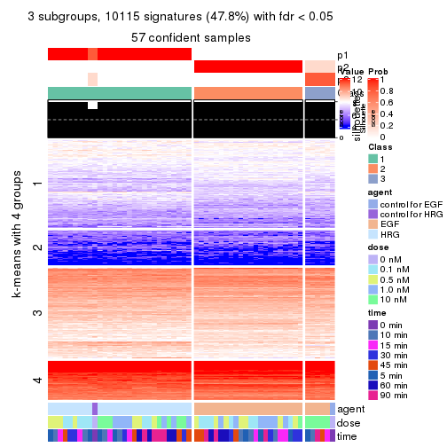</p>

</div>
<div id='tab-ATC-hclust-get-signatures-no-scale-3'>
<pre><code class="r">get_signatures(res, k = 4, scale_rows = FALSE)
</code></pre>

<p></p>

</div>
<div id='tab-ATC-hclust-get-signatures-no-scale-4'>
<pre><code class="r">get_signatures(res, k = 5, scale_rows = FALSE)
</code></pre>

<p></p>

</div>
<div id='tab-ATC-hclust-get-signatures-no-scale-5'>
<pre><code class="r">get_signatures(res, k = 6, scale_rows = FALSE)
</code></pre>

<p></p>

</div>
</div>


Compare the overlap of signatures from different k:

```r
compare_signatures(res)
```


`get_signature()` returns a data frame invisibly. TO get the list of signatures, the function
call should be assigned to a variable explicitly. In following code, if `plot` argument is set
to `FALSE`, no heatmap is plotted while only the differential analysis is performed.

```r
# code only for demonstration
tb = get_signature(res, k = ..., plot = FALSE)
```

An example of the output of `tb` is:

```
#>   which_row         fdr    mean_1    mean_2 scaled_mean_1 scaled_mean_2 km
#> 1        38 0.042760348  8.373488  9.131774    -0.5533452     0.5164555  1
#> 2        40 0.018707592  7.106213  8.469186    -0.6173731     0.5762149  1
#> 3        55 0.019134737 10.221463 11.207825    -0.6159697     0.5749050  1
#> 4        59 0.006059896  5.921854  7.869574    -0.6899429     0.6439467  1
#> 5        60 0.018055526  8.928898 10.211722    -0.6204761     0.5791110  1
#> 6        98 0.009384629 15.714769 14.887706     0.6635654    -0.6193277  2
...
```

The columns in `tb` are:

1. `which_row`: row indices corresponding to the input matrix.
2. `fdr`: FDR for the differential test. 
3. `mean_x`: The mean value in group x.
4. `scaled_mean_x`: The mean value in group x after rows are scaled.
5. `km`: Row groups if k-means clustering is applied to rows.


UMAP plot which shows how samples are separated.


<script>
$( function() {
	$( '#tabs-ATC-hclust-dimension-reduction' ).tabs();
} );
</script>
<div id='tabs-ATC-hclust-dimension-reduction'>
<ul>
<li><a href='#tab-ATC-hclust-dimension-reduction-1'>k = 2</a></li>
<li><a href='#tab-ATC-hclust-dimension-reduction-2'>k = 3</a></li>
<li><a href='#tab-ATC-hclust-dimension-reduction-3'>k = 4</a></li>
<li><a href='#tab-ATC-hclust-dimension-reduction-4'>k = 5</a></li>
<li><a href='#tab-ATC-hclust-dimension-reduction-5'>k = 6</a></li>
</ul>
<div id='tab-ATC-hclust-dimension-reduction-1'>
<pre><code class="r">dimension_reduction(res, k = 2, method = &quot;UMAP&quot;)
</code></pre>

<p></p>

</div>
<div id='tab-ATC-hclust-dimension-reduction-2'>
<pre><code class="r">dimension_reduction(res, k = 3, method = &quot;UMAP&quot;)
</code></pre>

<p></p>

</div>
<div id='tab-ATC-hclust-dimension-reduction-3'>
<pre><code class="r">dimension_reduction(res, k = 4, method = &quot;UMAP&quot;)
</code></pre>

<p></p>

</div>
<div id='tab-ATC-hclust-dimension-reduction-4'>
<pre><code class="r">dimension_reduction(res, k = 5, method = &quot;UMAP&quot;)
</code></pre>

<p></p>

</div>
<div id='tab-ATC-hclust-dimension-reduction-5'>
<pre><code class="r">dimension_reduction(res, k = 6, method = &quot;UMAP&quot;)
</code></pre>

<p></p>

</div>
</div>


Following heatmap shows how subgroups are split when increasing `k`:

```r
collect_classes(res)
```


Test correlation between subgroups and known annotations. If the known
annotation is numeric, one-way ANOVA test is applied, and if the known
annotation is discrete, chi-squared contingency table test is applied.

```r
test_to_known_factors(res)
```

```
#>             n agent(p)  dose(p) time(p) k
#> ATC:hclust 57 2.57e-12 0.999568   1.000 2
#> ATC:hclust 57 4.87e-12 0.004143   0.970 3
#> ATC:hclust 57 5.82e-16 0.000161   0.349 4
#> ATC:hclust 57 1.83e-14 0.000174   0.419 5
#> ATC:hclust 57 3.81e-13 0.000174   0.325 6
```


If matrix rows can be associated to genes, consider to use `functional_enrichment(res,
...)` to perform function enrichment for the signature genes. See [this vignette](http://bioconductor.org/packages/devel/bioc/vignettes/cola/inst/doc/functional_enrichment.html) for more detailed explanations.


 

---------------------------------------------------


### ATC:kmeans**


The object with results only for a single top-value method and a single partition method 
can be extracted as:

```r
res = res_list["ATC", "kmeans"]
# you can also extract it by
# res = res_list["ATC:kmeans"]
```

A summary of `res` and all the functions that can be applied to it:

```r
res
```

```
#> A 'ConsensusPartition' object with k = 2, 3, 4, 5, 6.
#>   On a matrix with 21163 rows and 57 columns.
#>   Top rows (1000, 2000, 3000, 4000, 5000) are extracted by 'ATC' method.
#>   Subgroups are detected by 'kmeans' method.
#>   Performed in total 1250 partitions by row resampling.
#>   Best k for subgroups seems to be 2.
#> 
#> Following methods can be applied to this 'ConsensusPartition' object:
#>  [1] "cola_report"             "collect_classes"         "collect_plots"          
#>  [4] "collect_stats"           "colnames"                "compare_signatures"     
#>  [7] "consensus_heatmap"       "dimension_reduction"     "functional_enrichment"  
#> [10] "get_anno_col"            "get_anno"                "get_classes"            
#> [13] "get_consensus"           "get_matrix"              "get_membership"         
#> [16] "get_param"               "get_signatures"          "get_stats"              
#> [19] "is_best_k"               "is_stable_k"             "membership_heatmap"     
#> [22] "ncol"                    "nrow"                    "plot_ecdf"              
#> [25] "rownames"                "select_partition_number" "show"                   
#> [28] "suggest_best_k"          "test_to_known_factors"
```

`collect_plots()` function collects all the plots made from `res` for all `k` (number of partitions)
into one single page to provide an easy and fast comparison between different `k`.

```r
collect_plots(res)
```


The plots are:

- The first row: a plot of the ECDF (empirical cumulative distribution
  function) curves of the consensus matrix for each `k` and the heatmap of
  predicted classes for each `k`.
- The second row: heatmaps of the consensus matrix for each `k`.
- The third row: heatmaps of the membership matrix for each `k`.
- The fouth row: heatmaps of the signatures for each `k`.

All the plots in panels can be made by individual functions and they are
plotted later in this section.

`select_partition_number()` produces several plots showing different
statistics for choosing "optimized" `k`. There are following statistics:

- ECDF curves of the consensus matrix for each `k`;
- 1-PAC. [The PAC
  score](https://en.wikipedia.org/wiki/Consensus_clustering#Over-interpretation_potential_of_consensus_clustering)
  measures the proportion of the ambiguous subgrouping.
- Mean silhouette score.
- Concordance. The mean probability of fiting the consensus class ids in all
  partitions.
- Area increased. Denote $A_k$ as the area under the ECDF curve for current
  `k`, the area increased is defined as $A_k - A_{k-1}$.
- Rand index. The percent of pairs of samples that are both in a same cluster
  or both are not in a same cluster in the partition of k and k-1.
- Jaccard index. The ratio of pairs of samples are both in a same cluster in
  the partition of k and k-1 and the pairs of samples are both in a same
  cluster in the partition k or k-1.

The detailed explanations of these statistics can be found in [the _cola_
vignette](http://bioconductor.org/packages/devel/bioc/vignettes/cola/inst/doc/cola.html#toc_13).

Generally speaking, lower PAC score, higher mean silhouette score or higher
concordance corresponds to better partition. Rand index and Jaccard index
measure how similar the current partition is compared to partition with `k-1`.
If they are too similar, we won't accept `k` is better than `k-1`.

```r
select_partition_number(res)
```


The numeric values for all these statistics can be obtained by `get_stats()`.

```r
get_stats(res)
```

```
#>   k 1-PAC mean_silhouette concordance area_increased  Rand Jaccard
#> 2 2 1.000           1.000       1.000         0.5093 0.491   0.491
#> 3 3 0.760           0.822       0.833         0.2072 1.000   1.000
#> 4 4 0.678           0.906       0.835         0.1238 0.778   0.547
#> 5 5 0.632           0.832       0.789         0.0705 1.000   1.000
#> 6 6 0.663           0.809       0.787         0.0578 0.961   0.853
```

`suggest_best_k()` suggests the best $k$ based on these statistics. The rules are as follows:

- All $k$ with Jaccard index larger than 0.95 are removed because increasing
  $k$ does not provide enough extra information. If all $k$ are removed, it is
  marked as no subgroup is detected.
- For all $k$ with 1-PAC score larger than 0.9, the maximal $k$ is taken as
  the best $k$, and other $k$ are marked as optional $k$.
- If it does not fit the second rule. The $k$ with the maximal vote of the
  highest 1-PAC score, highest mean silhouette, and highest concordance is
  taken as the best $k$.

```r
suggest_best_k(res)
```

```
#> [1] 2
```


Following shows the table of the partitions (You need to click the **show/hide
code output** link to see it). The membership matrix (columns with name `p*`)
is inferred by
[`clue::cl_consensus()`](https://www.rdocumentation.org/link/cl_consensus?package=clue)
function with the `SE` method. Basically the value in the membership matrix
represents the probability to belong to a certain group. The finall class
label for an item is determined with the group with highest probability it
belongs to.

In `get_classes()` function, the entropy is calculated from the membership
matrix and the silhouette score is calculated from the consensus matrix.


<script>
$( function() {
	$( '#tabs-ATC-kmeans-get-classes' ).tabs();
} );
</script>
<div id='tabs-ATC-kmeans-get-classes'>
<ul>
<li><a href='#tab-ATC-kmeans-get-classes-1'>k = 2</a></li>
<li><a href='#tab-ATC-kmeans-get-classes-2'>k = 3</a></li>
<li><a href='#tab-ATC-kmeans-get-classes-3'>k = 4</a></li>
<li><a href='#tab-ATC-kmeans-get-classes-4'>k = 5</a></li>
<li><a href='#tab-ATC-kmeans-get-classes-5'>k = 6</a></li>
</ul>

<div id='tab-ATC-kmeans-get-classes-1'>
<p><a id='tab-ATC-kmeans-get-classes-1-a' style='color:#0366d6' href='#'>show/hide code output</a></p>
<pre><code class="r">cbind(get_classes(res, k = 2), get_membership(res, k = 2))
</code></pre>

<pre><code>#&gt;           class entropy silhouette p1 p2
#&gt; GSM148516     2       0          1  0  1
#&gt; GSM148517     1       0          1  1  0
#&gt; GSM148518     2       0          1  0  1
#&gt; GSM148519     2       0          1  0  1
#&gt; GSM148520     2       0          1  0  1
#&gt; GSM148521     2       0          1  0  1
#&gt; GSM148522     2       0          1  0  1
#&gt; GSM148523     2       0          1  0  1
#&gt; GSM148524     2       0          1  0  1
#&gt; GSM148525     2       0          1  0  1
#&gt; GSM148526     2       0          1  0  1
#&gt; GSM148527     2       0          1  0  1
#&gt; GSM148528     2       0          1  0  1
#&gt; GSM148529     2       0          1  0  1
#&gt; GSM148530     2       0          1  0  1
#&gt; GSM148531     2       0          1  0  1
#&gt; GSM148532     2       0          1  0  1
#&gt; GSM148533     2       0          1  0  1
#&gt; GSM148534     2       0          1  0  1
#&gt; GSM148535     2       0          1  0  1
#&gt; GSM148536     2       0          1  0  1
#&gt; GSM148537     2       0          1  0  1
#&gt; GSM148538     2       0          1  0  1
#&gt; GSM148539     2       0          1  0  1
#&gt; GSM148540     2       0          1  0  1
#&gt; GSM148541     2       0          1  0  1
#&gt; GSM148542     2       0          1  0  1
#&gt; GSM148543     2       0          1  0  1
#&gt; GSM148544     2       0          1  0  1
#&gt; GSM148545     1       0          1  1  0
#&gt; GSM148546     1       0          1  1  0
#&gt; GSM148547     1       0          1  1  0
#&gt; GSM148548     1       0          1  1  0
#&gt; GSM148549     1       0          1  1  0
#&gt; GSM148550     1       0          1  1  0
#&gt; GSM148551     1       0          1  1  0
#&gt; GSM148552     1       0          1  1  0
#&gt; GSM148553     1       0          1  1  0
#&gt; GSM148554     1       0          1  1  0
#&gt; GSM148555     1       0          1  1  0
#&gt; GSM148556     1       0          1  1  0
#&gt; GSM148557     1       0          1  1  0
#&gt; GSM148558     1       0          1  1  0
#&gt; GSM148559     1       0          1  1  0
#&gt; GSM148560     1       0          1  1  0
#&gt; GSM148561     1       0          1  1  0
#&gt; GSM148562     1       0          1  1  0
#&gt; GSM148563     1       0          1  1  0
#&gt; GSM148564     1       0          1  1  0
#&gt; GSM148565     1       0          1  1  0
#&gt; GSM148566     1       0          1  1  0
#&gt; GSM148567     1       0          1  1  0
#&gt; GSM148568     1       0          1  1  0
#&gt; GSM148569     1       0          1  1  0
#&gt; GSM148570     1       0          1  1  0
#&gt; GSM148571     1       0          1  1  0
#&gt; GSM148572     1       0          1  1  0
</code></pre>

<script>
$('#tab-ATC-kmeans-get-classes-1-a').parent().next().next().hide();
$('#tab-ATC-kmeans-get-classes-1-a').click(function(){
  $('#tab-ATC-kmeans-get-classes-1-a').parent().next().next().toggle();
  return(false);
});
</script>
</div>

<div id='tab-ATC-kmeans-get-classes-2'>
<p><a id='tab-ATC-kmeans-get-classes-2-a' style='color:#0366d6' href='#'>show/hide code output</a></p>
<pre><code class="r">cbind(get_classes(res, k = 3), get_membership(res, k = 3))
</code></pre>

<pre><code>#&gt;           class entropy silhouette    p1   p2 p3
#&gt; GSM148516     2  0.0000      0.660 0.000 1.00 NA
#&gt; GSM148517     1  0.4002      0.801 0.840 0.00 NA
#&gt; GSM148518     2  0.6280      0.901 0.000 0.54 NA
#&gt; GSM148519     2  0.6280      0.901 0.000 0.54 NA
#&gt; GSM148520     2  0.6280      0.901 0.000 0.54 NA
#&gt; GSM148521     2  0.6280      0.901 0.000 0.54 NA
#&gt; GSM148522     2  0.6280      0.901 0.000 0.54 NA
#&gt; GSM148523     2  0.6280      0.901 0.000 0.54 NA
#&gt; GSM148524     2  0.6280      0.901 0.000 0.54 NA
#&gt; GSM148525     2  0.6280      0.901 0.000 0.54 NA
#&gt; GSM148526     2  0.6280      0.901 0.000 0.54 NA
#&gt; GSM148527     2  0.6280      0.901 0.000 0.54 NA
#&gt; GSM148528     2  0.6280      0.901 0.000 0.54 NA
#&gt; GSM148529     2  0.6280      0.901 0.000 0.54 NA
#&gt; GSM148530     2  0.6280      0.901 0.000 0.54 NA
#&gt; GSM148531     2  0.6280      0.901 0.000 0.54 NA
#&gt; GSM148532     2  0.6280      0.901 0.000 0.54 NA
#&gt; GSM148533     2  0.6280      0.901 0.000 0.54 NA
#&gt; GSM148534     2  0.6280      0.901 0.000 0.54 NA
#&gt; GSM148535     2  0.6280      0.901 0.000 0.54 NA
#&gt; GSM148536     2  0.6280      0.901 0.000 0.54 NA
#&gt; GSM148537     2  0.6280      0.901 0.000 0.54 NA
#&gt; GSM148538     2  0.6280      0.901 0.000 0.54 NA
#&gt; GSM148539     2  0.0000      0.660 0.000 1.00 NA
#&gt; GSM148540     2  0.0000      0.660 0.000 1.00 NA
#&gt; GSM148541     2  0.0000      0.660 0.000 1.00 NA
#&gt; GSM148542     2  0.0000      0.660 0.000 1.00 NA
#&gt; GSM148543     2  0.0000      0.660 0.000 1.00 NA
#&gt; GSM148544     2  0.0000      0.660 0.000 1.00 NA
#&gt; GSM148545     1  0.4002      0.801 0.840 0.00 NA
#&gt; GSM148546     1  0.6192      0.794 0.580 0.00 NA
#&gt; GSM148547     1  0.6192      0.794 0.580 0.00 NA
#&gt; GSM148548     1  0.6192      0.794 0.580 0.00 NA
#&gt; GSM148549     1  0.6192      0.794 0.580 0.00 NA
#&gt; GSM148550     1  0.6192      0.794 0.580 0.00 NA
#&gt; GSM148551     1  0.6192      0.794 0.580 0.00 NA
#&gt; GSM148552     1  0.6192      0.794 0.580 0.00 NA
#&gt; GSM148553     1  0.6192      0.794 0.580 0.00 NA
#&gt; GSM148554     1  0.6192      0.794 0.580 0.00 NA
#&gt; GSM148555     1  0.6192      0.794 0.580 0.00 NA
#&gt; GSM148556     1  0.6192      0.794 0.580 0.00 NA
#&gt; GSM148557     1  0.6192      0.793 0.580 0.00 NA
#&gt; GSM148558     1  0.6267      0.785 0.548 0.00 NA
#&gt; GSM148559     1  0.0424      0.820 0.992 0.00 NA
#&gt; GSM148560     1  0.0424      0.820 0.992 0.00 NA
#&gt; GSM148561     1  0.0424      0.820 0.992 0.00 NA
#&gt; GSM148562     1  0.0000      0.819 1.000 0.00 NA
#&gt; GSM148563     1  0.1411      0.811 0.964 0.00 NA
#&gt; GSM148564     1  0.2261      0.801 0.932 0.00 NA
#&gt; GSM148565     1  0.2261      0.801 0.932 0.00 NA
#&gt; GSM148566     1  0.0424      0.820 0.992 0.00 NA
#&gt; GSM148567     1  0.0424      0.820 0.992 0.00 NA
#&gt; GSM148568     1  0.0424      0.820 0.992 0.00 NA
#&gt; GSM148569     1  0.0892      0.815 0.980 0.00 NA
#&gt; GSM148570     1  0.2261      0.801 0.932 0.00 NA
#&gt; GSM148571     1  0.2261      0.801 0.932 0.00 NA
#&gt; GSM148572     1  0.2261      0.801 0.932 0.00 NA
</code></pre>

<script>
$('#tab-ATC-kmeans-get-classes-2-a').parent().next().next().hide();
$('#tab-ATC-kmeans-get-classes-2-a').click(function(){
  $('#tab-ATC-kmeans-get-classes-2-a').parent().next().next().toggle();
  return(false);
});
</script>
</div>

<div id='tab-ATC-kmeans-get-classes-3'>
<p><a id='tab-ATC-kmeans-get-classes-3-a' style='color:#0366d6' href='#'>show/hide code output</a></p>
<pre><code class="r">cbind(get_classes(res, k = 4), get_membership(res, k = 4))
</code></pre>

<pre><code>#&gt;           class entropy silhouette    p1    p2    p3    p4
#&gt; GSM148516     3  0.4040      0.990 0.000 0.248 0.752 0.000
#&gt; GSM148517     4  0.5855      0.726 0.100 0.000 0.208 0.692
#&gt; GSM148518     2  0.2530      0.868 0.112 0.888 0.000 0.000
#&gt; GSM148519     2  0.2530      0.868 0.112 0.888 0.000 0.000
#&gt; GSM148520     2  0.2149      0.887 0.088 0.912 0.000 0.000
#&gt; GSM148521     2  0.2149      0.887 0.088 0.912 0.000 0.000
#&gt; GSM148522     2  0.2011      0.889 0.080 0.920 0.000 0.000
#&gt; GSM148523     2  0.2149      0.887 0.088 0.912 0.000 0.000
#&gt; GSM148524     2  0.2216      0.887 0.092 0.908 0.000 0.000
#&gt; GSM148525     2  0.2647      0.865 0.120 0.880 0.000 0.000
#&gt; GSM148526     2  0.2647      0.865 0.120 0.880 0.000 0.000
#&gt; GSM148527     2  0.1022      0.893 0.032 0.968 0.000 0.000
#&gt; GSM148528     2  0.2530      0.868 0.112 0.888 0.000 0.000
#&gt; GSM148529     2  0.2216      0.887 0.092 0.908 0.000 0.000
#&gt; GSM148530     2  0.2149      0.887 0.088 0.912 0.000 0.000
#&gt; GSM148531     2  0.2149      0.887 0.088 0.912 0.000 0.000
#&gt; GSM148532     2  0.0921      0.895 0.028 0.972 0.000 0.000
#&gt; GSM148533     2  0.2647      0.865 0.120 0.880 0.000 0.000
#&gt; GSM148534     2  0.2530      0.868 0.112 0.888 0.000 0.000
#&gt; GSM148535     2  0.1940      0.882 0.076 0.924 0.000 0.000
#&gt; GSM148536     2  0.0817      0.894 0.024 0.976 0.000 0.000
#&gt; GSM148537     2  0.2216      0.887 0.092 0.908 0.000 0.000
#&gt; GSM148538     2  0.0188      0.895 0.004 0.996 0.000 0.000
#&gt; GSM148539     3  0.4220      0.990 0.004 0.248 0.748 0.000
#&gt; GSM148540     3  0.4220      0.990 0.004 0.248 0.748 0.000
#&gt; GSM148541     3  0.4220      0.990 0.004 0.248 0.748 0.000
#&gt; GSM148542     3  0.5687      0.949 0.068 0.248 0.684 0.000
#&gt; GSM148543     3  0.4040      0.990 0.000 0.248 0.752 0.000
#&gt; GSM148544     3  0.4040      0.990 0.000 0.248 0.752 0.000
#&gt; GSM148545     4  0.5855      0.726 0.100 0.000 0.208 0.692
#&gt; GSM148546     1  0.4608      0.986 0.692 0.000 0.004 0.304
#&gt; GSM148547     1  0.4608      0.986 0.692 0.000 0.004 0.304
#&gt; GSM148548     1  0.4584      0.987 0.696 0.000 0.004 0.300
#&gt; GSM148549     1  0.4584      0.986 0.696 0.000 0.004 0.300
#&gt; GSM148550     1  0.4608      0.986 0.692 0.000 0.004 0.304
#&gt; GSM148551     1  0.4608      0.986 0.692 0.000 0.004 0.304
#&gt; GSM148552     1  0.4957      0.981 0.684 0.000 0.016 0.300
#&gt; GSM148553     1  0.4957      0.981 0.684 0.000 0.016 0.300
#&gt; GSM148554     1  0.4957      0.981 0.684 0.000 0.016 0.300
#&gt; GSM148555     1  0.4584      0.987 0.696 0.000 0.004 0.300
#&gt; GSM148556     1  0.4584      0.987 0.696 0.000 0.004 0.300
#&gt; GSM148557     1  0.4431      0.985 0.696 0.000 0.000 0.304
#&gt; GSM148558     1  0.4761      0.953 0.664 0.000 0.004 0.332
#&gt; GSM148559     4  0.1661      0.868 0.052 0.000 0.004 0.944
#&gt; GSM148560     4  0.1474      0.868 0.052 0.000 0.000 0.948
#&gt; GSM148561     4  0.2060      0.863 0.052 0.000 0.016 0.932
#&gt; GSM148562     4  0.1211      0.871 0.040 0.000 0.000 0.960
#&gt; GSM148563     4  0.0927      0.865 0.008 0.000 0.016 0.976
#&gt; GSM148564     4  0.3074      0.842 0.000 0.000 0.152 0.848
#&gt; GSM148565     4  0.3024      0.842 0.000 0.000 0.148 0.852
#&gt; GSM148566     4  0.1661      0.867 0.052 0.000 0.004 0.944
#&gt; GSM148567     4  0.2060      0.863 0.052 0.000 0.016 0.932
#&gt; GSM148568     4  0.2060      0.863 0.052 0.000 0.016 0.932
#&gt; GSM148569     4  0.1004      0.872 0.024 0.000 0.004 0.972
#&gt; GSM148570     4  0.3024      0.842 0.000 0.000 0.148 0.852
#&gt; GSM148571     4  0.3024      0.842 0.000 0.000 0.148 0.852
#&gt; GSM148572     4  0.3024      0.842 0.000 0.000 0.148 0.852
</code></pre>

<script>
$('#tab-ATC-kmeans-get-classes-3-a').parent().next().next().hide();
$('#tab-ATC-kmeans-get-classes-3-a').click(function(){
  $('#tab-ATC-kmeans-get-classes-3-a').parent().next().next().toggle();
  return(false);
});
</script>
</div>

<div id='tab-ATC-kmeans-get-classes-4'>
<p><a id='tab-ATC-kmeans-get-classes-4-a' style='color:#0366d6' href='#'>show/hide code output</a></p>
<pre><code class="r">cbind(get_classes(res, k = 5), get_membership(res, k = 5))
</code></pre>

<pre><code>#&gt;           class entropy silhouette    p1    p2    p3    p4    p5
#&gt; GSM148516     3  0.3048      0.973 0.004 0.176 0.820 0.000 0.000
#&gt; GSM148517     4  0.6095      0.605 0.056 0.000 0.120 0.664 0.160
#&gt; GSM148518     2  0.3661      0.748 0.000 0.724 0.000 0.000 0.276
#&gt; GSM148519     2  0.3661      0.748 0.000 0.724 0.000 0.000 0.276
#&gt; GSM148520     2  0.1965      0.800 0.000 0.904 0.000 0.000 0.096
#&gt; GSM148521     2  0.2127      0.795 0.000 0.892 0.000 0.000 0.108
#&gt; GSM148522     2  0.2513      0.802 0.008 0.876 0.000 0.000 0.116
#&gt; GSM148523     2  0.2127      0.795 0.000 0.892 0.000 0.000 0.108
#&gt; GSM148524     2  0.2127      0.795 0.000 0.892 0.000 0.000 0.108
#&gt; GSM148525     2  0.4655      0.728 0.052 0.700 0.000 0.000 0.248
#&gt; GSM148526     2  0.4655      0.728 0.052 0.700 0.000 0.000 0.248
#&gt; GSM148527     2  0.2448      0.806 0.020 0.892 0.000 0.000 0.088
#&gt; GSM148528     2  0.3661      0.748 0.000 0.724 0.000 0.000 0.276
#&gt; GSM148529     2  0.2127      0.795 0.000 0.892 0.000 0.000 0.108
#&gt; GSM148530     2  0.2127      0.795 0.000 0.892 0.000 0.000 0.108
#&gt; GSM148531     2  0.2127      0.795 0.000 0.892 0.000 0.000 0.108
#&gt; GSM148532     2  0.1012      0.810 0.020 0.968 0.000 0.000 0.012
#&gt; GSM148533     2  0.4655      0.728 0.052 0.700 0.000 0.000 0.248
#&gt; GSM148534     2  0.3661      0.748 0.000 0.724 0.000 0.000 0.276
#&gt; GSM148535     2  0.3399      0.785 0.020 0.812 0.000 0.000 0.168
#&gt; GSM148536     2  0.2505      0.804 0.020 0.888 0.000 0.000 0.092
#&gt; GSM148537     2  0.2522      0.796 0.012 0.880 0.000 0.000 0.108
#&gt; GSM148538     2  0.2012      0.808 0.020 0.920 0.000 0.000 0.060
#&gt; GSM148539     3  0.2891      0.974 0.000 0.176 0.824 0.000 0.000
#&gt; GSM148540     3  0.2891      0.974 0.000 0.176 0.824 0.000 0.000
#&gt; GSM148541     3  0.3171      0.972 0.008 0.176 0.816 0.000 0.000
#&gt; GSM148542     3  0.6589      0.845 0.104 0.176 0.624 0.000 0.096
#&gt; GSM148543     3  0.2891      0.974 0.000 0.176 0.824 0.000 0.000
#&gt; GSM148544     3  0.2891      0.974 0.000 0.176 0.824 0.000 0.000
#&gt; GSM148545     4  0.6095      0.605 0.056 0.000 0.120 0.664 0.160
#&gt; GSM148546     1  0.3888      0.951 0.788 0.000 0.004 0.176 0.032
#&gt; GSM148547     1  0.3888      0.951 0.788 0.000 0.004 0.176 0.032
#&gt; GSM148548     1  0.3769      0.950 0.796 0.000 0.016 0.176 0.012
#&gt; GSM148549     1  0.3048      0.954 0.820 0.000 0.004 0.176 0.000
#&gt; GSM148550     1  0.3888      0.951 0.788 0.000 0.004 0.176 0.032
#&gt; GSM148551     1  0.3888      0.951 0.788 0.000 0.004 0.176 0.032
#&gt; GSM148552     1  0.5278      0.911 0.720 0.000 0.048 0.176 0.056
#&gt; GSM148553     1  0.5278      0.911 0.720 0.000 0.048 0.176 0.056
#&gt; GSM148554     1  0.5074      0.919 0.732 0.000 0.040 0.176 0.052
#&gt; GSM148555     1  0.3769      0.950 0.796 0.000 0.016 0.176 0.012
#&gt; GSM148556     1  0.3171      0.954 0.816 0.000 0.008 0.176 0.000
#&gt; GSM148557     1  0.2891      0.955 0.824 0.000 0.000 0.176 0.000
#&gt; GSM148558     1  0.3961      0.947 0.780 0.000 0.004 0.184 0.032
#&gt; GSM148559     4  0.4671      0.803 0.028 0.000 0.000 0.640 0.332
#&gt; GSM148560     4  0.4822      0.801 0.028 0.000 0.004 0.636 0.332
#&gt; GSM148561     4  0.5166      0.784 0.028 0.000 0.012 0.592 0.368
#&gt; GSM148562     4  0.4608      0.803 0.024 0.000 0.000 0.640 0.336
#&gt; GSM148563     4  0.4337      0.800 0.016 0.000 0.004 0.696 0.284
#&gt; GSM148564     4  0.0162      0.745 0.000 0.000 0.000 0.996 0.004
#&gt; GSM148565     4  0.0000      0.745 0.000 0.000 0.000 1.000 0.000
#&gt; GSM148566     4  0.4929      0.797 0.032 0.000 0.004 0.624 0.340
#&gt; GSM148567     4  0.5052      0.788 0.028 0.000 0.008 0.600 0.364
#&gt; GSM148568     4  0.5052      0.788 0.028 0.000 0.008 0.600 0.364
#&gt; GSM148569     4  0.4418      0.805 0.016 0.000 0.000 0.652 0.332
#&gt; GSM148570     4  0.0000      0.745 0.000 0.000 0.000 1.000 0.000
#&gt; GSM148571     4  0.0000      0.745 0.000 0.000 0.000 1.000 0.000
#&gt; GSM148572     4  0.0000      0.745 0.000 0.000 0.000 1.000 0.000
</code></pre>

<script>
$('#tab-ATC-kmeans-get-classes-4-a').parent().next().next().hide();
$('#tab-ATC-kmeans-get-classes-4-a').click(function(){
  $('#tab-ATC-kmeans-get-classes-4-a').parent().next().next().toggle();
  return(false);
});
</script>
</div>

<div id='tab-ATC-kmeans-get-classes-5'>
<p><a id='tab-ATC-kmeans-get-classes-5-a' style='color:#0366d6' href='#'>show/hide code output</a></p>
<pre><code class="r">cbind(get_classes(res, k = 6), get_membership(res, k = 6))
</code></pre>

<pre><code>#&gt;           class entropy silhouette    p1    p2    p3    p4    p5 p6
#&gt; GSM148516     3  0.2261      0.961 0.000 0.104 0.884 0.004 0.000 NA
#&gt; GSM148517     4  0.7907      0.539 0.100 0.000 0.068 0.428 0.236 NA
#&gt; GSM148518     2  0.3999      0.683 0.000 0.500 0.000 0.004 0.000 NA
#&gt; GSM148519     2  0.3999      0.683 0.000 0.500 0.000 0.004 0.000 NA
#&gt; GSM148520     2  0.0622      0.745 0.000 0.980 0.000 0.000 0.008 NA
#&gt; GSM148521     2  0.0260      0.742 0.000 0.992 0.000 0.000 0.008 NA
#&gt; GSM148522     2  0.1196      0.751 0.000 0.952 0.000 0.008 0.000 NA
#&gt; GSM148523     2  0.0000      0.743 0.000 1.000 0.000 0.000 0.000 NA
#&gt; GSM148524     2  0.0000      0.743 0.000 1.000 0.000 0.000 0.000 NA
#&gt; GSM148525     2  0.5358      0.659 0.000 0.484 0.000 0.032 0.044 NA
#&gt; GSM148526     2  0.5358      0.659 0.000 0.484 0.000 0.032 0.044 NA
#&gt; GSM148527     2  0.4325      0.752 0.000 0.692 0.000 0.064 0.000 NA
#&gt; GSM148528     2  0.3999      0.683 0.000 0.500 0.000 0.004 0.000 NA
#&gt; GSM148529     2  0.0000      0.743 0.000 1.000 0.000 0.000 0.000 NA
#&gt; GSM148530     2  0.0000      0.743 0.000 1.000 0.000 0.000 0.000 NA
#&gt; GSM148531     2  0.0000      0.743 0.000 1.000 0.000 0.000 0.000 NA
#&gt; GSM148532     2  0.3874      0.756 0.000 0.776 0.000 0.060 0.008 NA
#&gt; GSM148533     2  0.5358      0.659 0.000 0.484 0.000 0.032 0.044 NA
#&gt; GSM148534     2  0.3999      0.683 0.000 0.500 0.000 0.004 0.000 NA
#&gt; GSM148535     2  0.4621      0.738 0.000 0.632 0.000 0.064 0.000 NA
#&gt; GSM148536     2  0.4392      0.749 0.000 0.680 0.000 0.064 0.000 NA
#&gt; GSM148537     2  0.1007      0.744 0.000 0.956 0.000 0.044 0.000 NA
#&gt; GSM148538     2  0.4149      0.754 0.000 0.720 0.000 0.064 0.000 NA
#&gt; GSM148539     3  0.2006      0.962 0.000 0.104 0.892 0.000 0.000 NA
#&gt; GSM148540     3  0.2006      0.962 0.000 0.104 0.892 0.000 0.000 NA
#&gt; GSM148541     3  0.2361      0.961 0.000 0.104 0.880 0.004 0.000 NA
#&gt; GSM148542     3  0.6472      0.783 0.000 0.104 0.624 0.144 0.056 NA
#&gt; GSM148543     3  0.2006      0.962 0.000 0.104 0.892 0.000 0.004 NA
#&gt; GSM148544     3  0.2149      0.962 0.000 0.104 0.888 0.004 0.004 NA
#&gt; GSM148545     4  0.7886      0.539 0.100 0.000 0.068 0.432 0.236 NA
#&gt; GSM148546     1  0.1065      0.900 0.964 0.000 0.000 0.008 0.008 NA
#&gt; GSM148547     1  0.1065      0.900 0.964 0.000 0.000 0.008 0.008 NA
#&gt; GSM148548     1  0.2431      0.881 0.860 0.000 0.000 0.008 0.000 NA
#&gt; GSM148549     1  0.0146      0.902 0.996 0.000 0.000 0.000 0.000 NA
#&gt; GSM148550     1  0.0665      0.896 0.980 0.000 0.000 0.008 0.008 NA
#&gt; GSM148551     1  0.0810      0.896 0.976 0.000 0.004 0.008 0.008 NA
#&gt; GSM148552     1  0.3975      0.806 0.716 0.000 0.000 0.040 0.000 NA
#&gt; GSM148553     1  0.3975      0.806 0.716 0.000 0.000 0.040 0.000 NA
#&gt; GSM148554     1  0.3975      0.806 0.716 0.000 0.000 0.040 0.000 NA
#&gt; GSM148555     1  0.2473      0.880 0.856 0.000 0.000 0.008 0.000 NA
#&gt; GSM148556     1  0.1462      0.898 0.936 0.000 0.000 0.008 0.000 NA
#&gt; GSM148557     1  0.1138      0.902 0.960 0.000 0.000 0.012 0.004 NA
#&gt; GSM148558     1  0.1363      0.882 0.952 0.000 0.004 0.028 0.012 NA
#&gt; GSM148559     5  0.2053      0.920 0.108 0.000 0.004 0.000 0.888 NA
#&gt; GSM148560     5  0.2563      0.918 0.108 0.000 0.008 0.008 0.872 NA
#&gt; GSM148561     5  0.3278      0.902 0.108 0.000 0.004 0.028 0.840 NA
#&gt; GSM148562     5  0.2565      0.913 0.104 0.000 0.016 0.008 0.872 NA
#&gt; GSM148563     5  0.4277      0.719 0.080 0.000 0.028 0.112 0.776 NA
#&gt; GSM148564     4  0.4950      0.793 0.080 0.000 0.000 0.576 0.344 NA
#&gt; GSM148565     4  0.4926      0.797 0.080 0.000 0.000 0.584 0.336 NA
#&gt; GSM148566     5  0.2754      0.914 0.116 0.000 0.008 0.012 0.860 NA
#&gt; GSM148567     5  0.3237      0.899 0.112 0.000 0.004 0.028 0.840 NA
#&gt; GSM148568     5  0.3192      0.901 0.108 0.000 0.004 0.028 0.844 NA
#&gt; GSM148569     5  0.2405      0.911 0.100 0.000 0.016 0.004 0.880 NA
#&gt; GSM148570     4  0.5335      0.794 0.080 0.000 0.016 0.568 0.336 NA
#&gt; GSM148571     4  0.5335      0.794 0.080 0.000 0.016 0.568 0.336 NA
#&gt; GSM148572     4  0.4926      0.797 0.080 0.000 0.000 0.584 0.336 NA
</code></pre>

<script>
$('#tab-ATC-kmeans-get-classes-5-a').parent().next().next().hide();
$('#tab-ATC-kmeans-get-classes-5-a').click(function(){
  $('#tab-ATC-kmeans-get-classes-5-a').parent().next().next().toggle();
  return(false);
});
</script>
</div>
</div>

Heatmaps for the consensus matrix. It visualizes the probability of two
samples to be in a same group.


<script>
$( function() {
	$( '#tabs-ATC-kmeans-consensus-heatmap' ).tabs();
} );
</script>
<div id='tabs-ATC-kmeans-consensus-heatmap'>
<ul>
<li><a href='#tab-ATC-kmeans-consensus-heatmap-1'>k = 2</a></li>
<li><a href='#tab-ATC-kmeans-consensus-heatmap-2'>k = 3</a></li>
<li><a href='#tab-ATC-kmeans-consensus-heatmap-3'>k = 4</a></li>
<li><a href='#tab-ATC-kmeans-consensus-heatmap-4'>k = 5</a></li>
<li><a href='#tab-ATC-kmeans-consensus-heatmap-5'>k = 6</a></li>
</ul>
<div id='tab-ATC-kmeans-consensus-heatmap-1'>
<pre><code class="r">consensus_heatmap(res, k = 2)
</code></pre>

<p></p>

</div>
<div id='tab-ATC-kmeans-consensus-heatmap-2'>
<pre><code class="r">consensus_heatmap(res, k = 3)
</code></pre>

<p></p>

</div>
<div id='tab-ATC-kmeans-consensus-heatmap-3'>
<pre><code class="r">consensus_heatmap(res, k = 4)
</code></pre>

<p></p>

</div>
<div id='tab-ATC-kmeans-consensus-heatmap-4'>
<pre><code class="r">consensus_heatmap(res, k = 5)
</code></pre>

<p></p>

</div>
<div id='tab-ATC-kmeans-consensus-heatmap-5'>
<pre><code class="r">consensus_heatmap(res, k = 6)
</code></pre>

<p></p>

</div>
</div>

Heatmaps for the membership of samples in all partitions to see how consistent they are:


<script>
$( function() {
	$( '#tabs-ATC-kmeans-membership-heatmap' ).tabs();
} );
</script>
<div id='tabs-ATC-kmeans-membership-heatmap'>
<ul>
<li><a href='#tab-ATC-kmeans-membership-heatmap-1'>k = 2</a></li>
<li><a href='#tab-ATC-kmeans-membership-heatmap-2'>k = 3</a></li>
<li><a href='#tab-ATC-kmeans-membership-heatmap-3'>k = 4</a></li>
<li><a href='#tab-ATC-kmeans-membership-heatmap-4'>k = 5</a></li>
<li><a href='#tab-ATC-kmeans-membership-heatmap-5'>k = 6</a></li>
</ul>
<div id='tab-ATC-kmeans-membership-heatmap-1'>
<pre><code class="r">membership_heatmap(res, k = 2)
</code></pre>

<p></p>

</div>
<div id='tab-ATC-kmeans-membership-heatmap-2'>
<pre><code class="r">membership_heatmap(res, k = 3)
</code></pre>

<p></p>

</div>
<div id='tab-ATC-kmeans-membership-heatmap-3'>
<pre><code class="r">membership_heatmap(res, k = 4)
</code></pre>

<p></p>

</div>
<div id='tab-ATC-kmeans-membership-heatmap-4'>
<pre><code class="r">membership_heatmap(res, k = 5)
</code></pre>

<p></p>

</div>
<div id='tab-ATC-kmeans-membership-heatmap-5'>
<pre><code class="r">membership_heatmap(res, k = 6)
</code></pre>

<p></p>

</div>
</div>

As soon as we have had the classes for columns, we can look for signatures
which are significantly different between classes which can be candidate marks
for certain classes. Following are the heatmaps for signatures.


Signature heatmaps where rows are scaled:


<script>
$( function() {
	$( '#tabs-ATC-kmeans-get-signatures' ).tabs();
} );
</script>
<div id='tabs-ATC-kmeans-get-signatures'>
<ul>
<li><a href='#tab-ATC-kmeans-get-signatures-1'>k = 2</a></li>
<li><a href='#tab-ATC-kmeans-get-signatures-2'>k = 3</a></li>
<li><a href='#tab-ATC-kmeans-get-signatures-3'>k = 4</a></li>
<li><a href='#tab-ATC-kmeans-get-signatures-4'>k = 5</a></li>
<li><a href='#tab-ATC-kmeans-get-signatures-5'>k = 6</a></li>
</ul>
<div id='tab-ATC-kmeans-get-signatures-1'>
<pre><code class="r">get_signatures(res, k = 2)
</code></pre>

<p></p>

</div>
<div id='tab-ATC-kmeans-get-signatures-2'>
<pre><code class="r">get_signatures(res, k = 3)
</code></pre>

<p></p>

</div>
<div id='tab-ATC-kmeans-get-signatures-3'>
<pre><code class="r">get_signatures(res, k = 4)
</code></pre>

<p></p>

</div>
<div id='tab-ATC-kmeans-get-signatures-4'>
<pre><code class="r">get_signatures(res, k = 5)
</code></pre>

<p>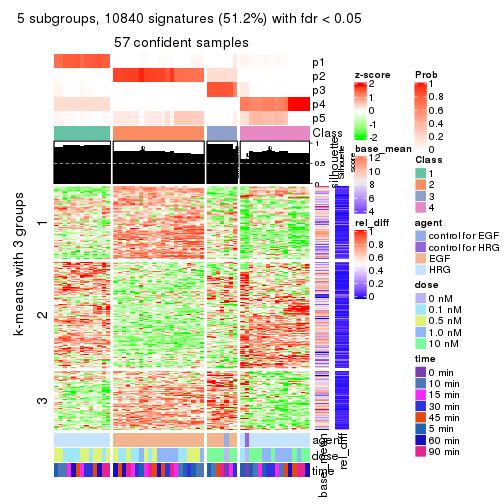</p>

</div>
<div id='tab-ATC-kmeans-get-signatures-5'>
<pre><code class="r">get_signatures(res, k = 6)
</code></pre>

<p></p>

</div>
</div>


Signature heatmaps where rows are not scaled:


<script>
$( function() {
	$( '#tabs-ATC-kmeans-get-signatures-no-scale' ).tabs();
} );
</script>
<div id='tabs-ATC-kmeans-get-signatures-no-scale'>
<ul>
<li><a href='#tab-ATC-kmeans-get-signatures-no-scale-1'>k = 2</a></li>
<li><a href='#tab-ATC-kmeans-get-signatures-no-scale-2'>k = 3</a></li>
<li><a href='#tab-ATC-kmeans-get-signatures-no-scale-3'>k = 4</a></li>
<li><a href='#tab-ATC-kmeans-get-signatures-no-scale-4'>k = 5</a></li>
<li><a href='#tab-ATC-kmeans-get-signatures-no-scale-5'>k = 6</a></li>
</ul>
<div id='tab-ATC-kmeans-get-signatures-no-scale-1'>
<pre><code class="r">get_signatures(res, k = 2, scale_rows = FALSE)
</code></pre>

<p></p>

</div>
<div id='tab-ATC-kmeans-get-signatures-no-scale-2'>
<pre><code class="r">get_signatures(res, k = 3, scale_rows = FALSE)
</code></pre>

<p></p>

</div>
<div id='tab-ATC-kmeans-get-signatures-no-scale-3'>
<pre><code class="r">get_signatures(res, k = 4, scale_rows = FALSE)
</code></pre>

<p></p>

</div>
<div id='tab-ATC-kmeans-get-signatures-no-scale-4'>
<pre><code class="r">get_signatures(res, k = 5, scale_rows = FALSE)
</code></pre>

<p></p>

</div>
<div id='tab-ATC-kmeans-get-signatures-no-scale-5'>
<pre><code class="r">get_signatures(res, k = 6, scale_rows = FALSE)
</code></pre>

<p></p>

</div>
</div>


Compare the overlap of signatures from different k:

```r
compare_signatures(res)
```


`get_signature()` returns a data frame invisibly. TO get the list of signatures, the function
call should be assigned to a variable explicitly. In following code, if `plot` argument is set
to `FALSE`, no heatmap is plotted while only the differential analysis is performed.

```r
# code only for demonstration
tb = get_signature(res, k = ..., plot = FALSE)
```

An example of the output of `tb` is:

```
#>   which_row         fdr    mean_1    mean_2 scaled_mean_1 scaled_mean_2 km
#> 1        38 0.042760348  8.373488  9.131774    -0.5533452     0.5164555  1
#> 2        40 0.018707592  7.106213  8.469186    -0.6173731     0.5762149  1
#> 3        55 0.019134737 10.221463 11.207825    -0.6159697     0.5749050  1
#> 4        59 0.006059896  5.921854  7.869574    -0.6899429     0.6439467  1
#> 5        60 0.018055526  8.928898 10.211722    -0.6204761     0.5791110  1
#> 6        98 0.009384629 15.714769 14.887706     0.6635654    -0.6193277  2
...
```

The columns in `tb` are:

1. `which_row`: row indices corresponding to the input matrix.
2. `fdr`: FDR for the differential test. 
3. `mean_x`: The mean value in group x.
4. `scaled_mean_x`: The mean value in group x after rows are scaled.
5. `km`: Row groups if k-means clustering is applied to rows.


UMAP plot which shows how samples are separated.


<script>
$( function() {
	$( '#tabs-ATC-kmeans-dimension-reduction' ).tabs();
} );
</script>
<div id='tabs-ATC-kmeans-dimension-reduction'>
<ul>
<li><a href='#tab-ATC-kmeans-dimension-reduction-1'>k = 2</a></li>
<li><a href='#tab-ATC-kmeans-dimension-reduction-2'>k = 3</a></li>
<li><a href='#tab-ATC-kmeans-dimension-reduction-3'>k = 4</a></li>
<li><a href='#tab-ATC-kmeans-dimension-reduction-4'>k = 5</a></li>
<li><a href='#tab-ATC-kmeans-dimension-reduction-5'>k = 6</a></li>
</ul>
<div id='tab-ATC-kmeans-dimension-reduction-1'>
<pre><code class="r">dimension_reduction(res, k = 2, method = &quot;UMAP&quot;)
</code></pre>

<p>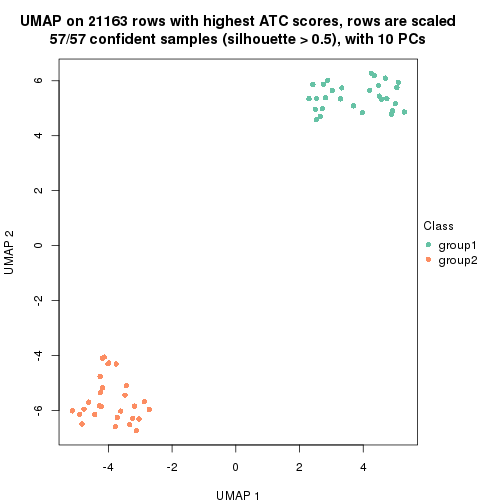</p>

</div>
<div id='tab-ATC-kmeans-dimension-reduction-2'>
<pre><code class="r">dimension_reduction(res, k = 3, method = &quot;UMAP&quot;)
</code></pre>

<p></p>

</div>
<div id='tab-ATC-kmeans-dimension-reduction-3'>
<pre><code class="r">dimension_reduction(res, k = 4, method = &quot;UMAP&quot;)
</code></pre>

<p></p>

</div>
<div id='tab-ATC-kmeans-dimension-reduction-4'>
<pre><code class="r">dimension_reduction(res, k = 5, method = &quot;UMAP&quot;)
</code></pre>

<p></p>

</div>
<div id='tab-ATC-kmeans-dimension-reduction-5'>
<pre><code class="r">dimension_reduction(res, k = 6, method = &quot;UMAP&quot;)
</code></pre>

<p></p>

</div>
</div>


Following heatmap shows how subgroups are split when increasing `k`:

```r
collect_classes(res)
```


Test correlation between subgroups and known annotations. If the known
annotation is numeric, one-way ANOVA test is applied, and if the known
annotation is discrete, chi-squared contingency table test is applied.

```r
test_to_known_factors(res)
```

```
#>             n agent(p)  dose(p) time(p) k
#> ATC:kmeans 57 2.57e-12 1.00e+00   1.000 2
#> ATC:kmeans 57 2.57e-12 1.00e+00   1.000 3
#> ATC:kmeans 57 1.45e-10 4.71e-07   1.000 4
#> ATC:kmeans 57 1.45e-10 4.71e-07   1.000 5
#> ATC:kmeans 57 3.60e-10 2.04e-06   0.943 6
```


If matrix rows can be associated to genes, consider to use `functional_enrichment(res,
...)` to perform function enrichment for the signature genes. See [this vignette](http://bioconductor.org/packages/devel/bioc/vignettes/cola/inst/doc/functional_enrichment.html) for more detailed explanations.


 

---------------------------------------------------


### ATC:skmeans**


The object with results only for a single top-value method and a single partition method 
can be extracted as:

```r
res = res_list["ATC", "skmeans"]
# you can also extract it by
# res = res_list["ATC:skmeans"]
```

A summary of `res` and all the functions that can be applied to it:

```r
res
```

```
#> A 'ConsensusPartition' object with k = 2, 3, 4, 5, 6.
#>   On a matrix with 21163 rows and 57 columns.
#>   Top rows (1000, 2000, 3000, 4000, 5000) are extracted by 'ATC' method.
#>   Subgroups are detected by 'skmeans' method.
#>   Performed in total 1250 partitions by row resampling.
#>   Best k for subgroups seems to be 4.
#> 
#> Following methods can be applied to this 'ConsensusPartition' object:
#>  [1] "cola_report"             "collect_classes"         "collect_plots"          
#>  [4] "collect_stats"           "colnames"                "compare_signatures"     
#>  [7] "consensus_heatmap"       "dimension_reduction"     "functional_enrichment"  
#> [10] "get_anno_col"            "get_anno"                "get_classes"            
#> [13] "get_consensus"           "get_matrix"              "get_membership"         
#> [16] "get_param"               "get_signatures"          "get_stats"              
#> [19] "is_best_k"               "is_stable_k"             "membership_heatmap"     
#> [22] "ncol"                    "nrow"                    "plot_ecdf"              
#> [25] "rownames"                "select_partition_number" "show"                   
#> [28] "suggest_best_k"          "test_to_known_factors"
```

`collect_plots()` function collects all the plots made from `res` for all `k` (number of partitions)
into one single page to provide an easy and fast comparison between different `k`.

```r
collect_plots(res)
```


The plots are:

- The first row: a plot of the ECDF (empirical cumulative distribution
  function) curves of the consensus matrix for each `k` and the heatmap of
  predicted classes for each `k`.
- The second row: heatmaps of the consensus matrix for each `k`.
- The third row: heatmaps of the membership matrix for each `k`.
- The fouth row: heatmaps of the signatures for each `k`.

All the plots in panels can be made by individual functions and they are
plotted later in this section.

`select_partition_number()` produces several plots showing different
statistics for choosing "optimized" `k`. There are following statistics:

- ECDF curves of the consensus matrix for each `k`;
- 1-PAC. [The PAC
  score](https://en.wikipedia.org/wiki/Consensus_clustering#Over-interpretation_potential_of_consensus_clustering)
  measures the proportion of the ambiguous subgrouping.
- Mean silhouette score.
- Concordance. The mean probability of fiting the consensus class ids in all
  partitions.
- Area increased. Denote $A_k$ as the area under the ECDF curve for current
  `k`, the area increased is defined as $A_k - A_{k-1}$.
- Rand index. The percent of pairs of samples that are both in a same cluster
  or both are not in a same cluster in the partition of k and k-1.
- Jaccard index. The ratio of pairs of samples are both in a same cluster in
  the partition of k and k-1 and the pairs of samples are both in a same
  cluster in the partition k or k-1.

The detailed explanations of these statistics can be found in [the _cola_
vignette](http://bioconductor.org/packages/devel/bioc/vignettes/cola/inst/doc/cola.html#toc_13).

Generally speaking, lower PAC score, higher mean silhouette score or higher
concordance corresponds to better partition. Rand index and Jaccard index
measure how similar the current partition is compared to partition with `k-1`.
If they are too similar, we won't accept `k` is better than `k-1`.

```r
select_partition_number(res)
```


The numeric values for all these statistics can be obtained by `get_stats()`.

```r
get_stats(res)
```

```
#>   k 1-PAC mean_silhouette concordance area_increased  Rand Jaccard
#> 2 2 1.000           1.000       1.000         0.5093 0.491   0.491
#> 3 3 1.000           0.998       0.997         0.1629 0.917   0.832
#> 4 4 1.000           0.999       0.998         0.2187 0.870   0.681
#> 5 5 0.953           0.908       0.902         0.0359 1.000   1.000
#> 6 6 0.870           0.832       0.863         0.0316 0.947   0.809
```

`suggest_best_k()` suggests the best $k$ based on these statistics. The rules are as follows:

- All $k$ with Jaccard index larger than 0.95 are removed because increasing
  $k$ does not provide enough extra information. If all $k$ are removed, it is
  marked as no subgroup is detected.
- For all $k$ with 1-PAC score larger than 0.9, the maximal $k$ is taken as
  the best $k$, and other $k$ are marked as optional $k$.
- If it does not fit the second rule. The $k$ with the maximal vote of the
  highest 1-PAC score, highest mean silhouette, and highest concordance is
  taken as the best $k$.

```r
suggest_best_k(res)
```

```
#> [1] 4
#> attr(,"optional")
#> [1] 2 3
```

There is also optional best $k$ = 2 3 that is worth to check.

Following shows the table of the partitions (You need to click the **show/hide
code output** link to see it). The membership matrix (columns with name `p*`)
is inferred by
[`clue::cl_consensus()`](https://www.rdocumentation.org/link/cl_consensus?package=clue)
function with the `SE` method. Basically the value in the membership matrix
represents the probability to belong to a certain group. The finall class
label for an item is determined with the group with highest probability it
belongs to.

In `get_classes()` function, the entropy is calculated from the membership
matrix and the silhouette score is calculated from the consensus matrix.


<script>
$( function() {
	$( '#tabs-ATC-skmeans-get-classes' ).tabs();
} );
</script>
<div id='tabs-ATC-skmeans-get-classes'>
<ul>
<li><a href='#tab-ATC-skmeans-get-classes-1'>k = 2</a></li>
<li><a href='#tab-ATC-skmeans-get-classes-2'>k = 3</a></li>
<li><a href='#tab-ATC-skmeans-get-classes-3'>k = 4</a></li>
<li><a href='#tab-ATC-skmeans-get-classes-4'>k = 5</a></li>
<li><a href='#tab-ATC-skmeans-get-classes-5'>k = 6</a></li>
</ul>

<div id='tab-ATC-skmeans-get-classes-1'>
<p><a id='tab-ATC-skmeans-get-classes-1-a' style='color:#0366d6' href='#'>show/hide code output</a></p>
<pre><code class="r">cbind(get_classes(res, k = 2), get_membership(res, k = 2))
</code></pre>

<pre><code>#&gt;           class entropy silhouette p1 p2
#&gt; GSM148516     2       0          1  0  1
#&gt; GSM148517     1       0          1  1  0
#&gt; GSM148518     2       0          1  0  1
#&gt; GSM148519     2       0          1  0  1
#&gt; GSM148520     2       0          1  0  1
#&gt; GSM148521     2       0          1  0  1
#&gt; GSM148522     2       0          1  0  1
#&gt; GSM148523     2       0          1  0  1
#&gt; GSM148524     2       0          1  0  1
#&gt; GSM148525     2       0          1  0  1
#&gt; GSM148526     2       0          1  0  1
#&gt; GSM148527     2       0          1  0  1
#&gt; GSM148528     2       0          1  0  1
#&gt; GSM148529     2       0          1  0  1
#&gt; GSM148530     2       0          1  0  1
#&gt; GSM148531     2       0          1  0  1
#&gt; GSM148532     2       0          1  0  1
#&gt; GSM148533     2       0          1  0  1
#&gt; GSM148534     2       0          1  0  1
#&gt; GSM148535     2       0          1  0  1
#&gt; GSM148536     2       0          1  0  1
#&gt; GSM148537     2       0          1  0  1
#&gt; GSM148538     2       0          1  0  1
#&gt; GSM148539     2       0          1  0  1
#&gt; GSM148540     2       0          1  0  1
#&gt; GSM148541     2       0          1  0  1
#&gt; GSM148542     2       0          1  0  1
#&gt; GSM148543     2       0          1  0  1
#&gt; GSM148544     2       0          1  0  1
#&gt; GSM148545     1       0          1  1  0
#&gt; GSM148546     1       0          1  1  0
#&gt; GSM148547     1       0          1  1  0
#&gt; GSM148548     1       0          1  1  0
#&gt; GSM148549     1       0          1  1  0
#&gt; GSM148550     1       0          1  1  0
#&gt; GSM148551     1       0          1  1  0
#&gt; GSM148552     1       0          1  1  0
#&gt; GSM148553     1       0          1  1  0
#&gt; GSM148554     1       0          1  1  0
#&gt; GSM148555     1       0          1  1  0
#&gt; GSM148556     1       0          1  1  0
#&gt; GSM148557     1       0          1  1  0
#&gt; GSM148558     1       0          1  1  0
#&gt; GSM148559     1       0          1  1  0
#&gt; GSM148560     1       0          1  1  0
#&gt; GSM148561     1       0          1  1  0
#&gt; GSM148562     1       0          1  1  0
#&gt; GSM148563     1       0          1  1  0
#&gt; GSM148564     1       0          1  1  0
#&gt; GSM148565     1       0          1  1  0
#&gt; GSM148566     1       0          1  1  0
#&gt; GSM148567     1       0          1  1  0
#&gt; GSM148568     1       0          1  1  0
#&gt; GSM148569     1       0          1  1  0
#&gt; GSM148570     1       0          1  1  0
#&gt; GSM148571     1       0          1  1  0
#&gt; GSM148572     1       0          1  1  0
</code></pre>

<script>
$('#tab-ATC-skmeans-get-classes-1-a').parent().next().next().hide();
$('#tab-ATC-skmeans-get-classes-1-a').click(function(){
  $('#tab-ATC-skmeans-get-classes-1-a').parent().next().next().toggle();
  return(false);
});
</script>
</div>

<div id='tab-ATC-skmeans-get-classes-2'>
<p><a id='tab-ATC-skmeans-get-classes-2-a' style='color:#0366d6' href='#'>show/hide code output</a></p>
<pre><code class="r">cbind(get_classes(res, k = 3), get_membership(res, k = 3))
</code></pre>

<pre><code>#&gt;           class entropy silhouette    p1    p2    p3
#&gt; GSM148516     3  0.0424      1.000 0.000 0.008 0.992
#&gt; GSM148517     1  0.0000      0.997 1.000 0.000 0.000
#&gt; GSM148518     2  0.0000      1.000 0.000 1.000 0.000
#&gt; GSM148519     2  0.0000      1.000 0.000 1.000 0.000
#&gt; GSM148520     2  0.0000      1.000 0.000 1.000 0.000
#&gt; GSM148521     2  0.0000      1.000 0.000 1.000 0.000
#&gt; GSM148522     2  0.0000      1.000 0.000 1.000 0.000
#&gt; GSM148523     2  0.0000      1.000 0.000 1.000 0.000
#&gt; GSM148524     2  0.0000      1.000 0.000 1.000 0.000
#&gt; GSM148525     2  0.0000      1.000 0.000 1.000 0.000
#&gt; GSM148526     2  0.0000      1.000 0.000 1.000 0.000
#&gt; GSM148527     2  0.0000      1.000 0.000 1.000 0.000
#&gt; GSM148528     2  0.0000      1.000 0.000 1.000 0.000
#&gt; GSM148529     2  0.0000      1.000 0.000 1.000 0.000
#&gt; GSM148530     2  0.0000      1.000 0.000 1.000 0.000
#&gt; GSM148531     2  0.0000      1.000 0.000 1.000 0.000
#&gt; GSM148532     2  0.0000      1.000 0.000 1.000 0.000
#&gt; GSM148533     2  0.0000      1.000 0.000 1.000 0.000
#&gt; GSM148534     2  0.0000      1.000 0.000 1.000 0.000
#&gt; GSM148535     2  0.0000      1.000 0.000 1.000 0.000
#&gt; GSM148536     2  0.0000      1.000 0.000 1.000 0.000
#&gt; GSM148537     2  0.0000      1.000 0.000 1.000 0.000
#&gt; GSM148538     2  0.0000      1.000 0.000 1.000 0.000
#&gt; GSM148539     3  0.0424      1.000 0.000 0.008 0.992
#&gt; GSM148540     3  0.0424      1.000 0.000 0.008 0.992
#&gt; GSM148541     3  0.0424      1.000 0.000 0.008 0.992
#&gt; GSM148542     2  0.0000      1.000 0.000 1.000 0.000
#&gt; GSM148543     3  0.0424      1.000 0.000 0.008 0.992
#&gt; GSM148544     3  0.0424      1.000 0.000 0.008 0.992
#&gt; GSM148545     1  0.0000      0.997 1.000 0.000 0.000
#&gt; GSM148546     1  0.0424      0.996 0.992 0.000 0.008
#&gt; GSM148547     1  0.0424      0.996 0.992 0.000 0.008
#&gt; GSM148548     1  0.0424      0.996 0.992 0.000 0.008
#&gt; GSM148549     1  0.0424      0.996 0.992 0.000 0.008
#&gt; GSM148550     1  0.0424      0.996 0.992 0.000 0.008
#&gt; GSM148551     1  0.0424      0.996 0.992 0.000 0.008
#&gt; GSM148552     1  0.0424      0.996 0.992 0.000 0.008
#&gt; GSM148553     1  0.0424      0.996 0.992 0.000 0.008
#&gt; GSM148554     1  0.0424      0.996 0.992 0.000 0.008
#&gt; GSM148555     1  0.0424      0.996 0.992 0.000 0.008
#&gt; GSM148556     1  0.0424      0.996 0.992 0.000 0.008
#&gt; GSM148557     1  0.0424      0.996 0.992 0.000 0.008
#&gt; GSM148558     1  0.0424      0.996 0.992 0.000 0.008
#&gt; GSM148559     1  0.0000      0.997 1.000 0.000 0.000
#&gt; GSM148560     1  0.0000      0.997 1.000 0.000 0.000
#&gt; GSM148561     1  0.0000      0.997 1.000 0.000 0.000
#&gt; GSM148562     1  0.0000      0.997 1.000 0.000 0.000
#&gt; GSM148563     1  0.0000      0.997 1.000 0.000 0.000
#&gt; GSM148564     1  0.0000      0.997 1.000 0.000 0.000
#&gt; GSM148565     1  0.0000      0.997 1.000 0.000 0.000
#&gt; GSM148566     1  0.0000      0.997 1.000 0.000 0.000
#&gt; GSM148567     1  0.0000      0.997 1.000 0.000 0.000
#&gt; GSM148568     1  0.0000      0.997 1.000 0.000 0.000
#&gt; GSM148569     1  0.0000      0.997 1.000 0.000 0.000
#&gt; GSM148570     1  0.0000      0.997 1.000 0.000 0.000
#&gt; GSM148571     1  0.0000      0.997 1.000 0.000 0.000
#&gt; GSM148572     1  0.0000      0.997 1.000 0.000 0.000
</code></pre>

<script>
$('#tab-ATC-skmeans-get-classes-2-a').parent().next().next().hide();
$('#tab-ATC-skmeans-get-classes-2-a').click(function(){
  $('#tab-ATC-skmeans-get-classes-2-a').parent().next().next().toggle();
  return(false);
});
</script>
</div>

<div id='tab-ATC-skmeans-get-classes-3'>
<p><a id='tab-ATC-skmeans-get-classes-3-a' style='color:#0366d6' href='#'>show/hide code output</a></p>
<pre><code class="r">cbind(get_classes(res, k = 4), get_membership(res, k = 4))
</code></pre>

<pre><code>#&gt;           class entropy silhouette    p1    p2 p3    p4
#&gt; GSM148516     3  0.0000      1.000 0.000 0.000  1 0.000
#&gt; GSM148517     4  0.0000      1.000 0.000 0.000  0 1.000
#&gt; GSM148518     2  0.0188      0.998 0.004 0.996  0 0.000
#&gt; GSM148519     2  0.0188      0.998 0.004 0.996  0 0.000
#&gt; GSM148520     2  0.0000      0.999 0.000 1.000  0 0.000
#&gt; GSM148521     2  0.0000      0.999 0.000 1.000  0 0.000
#&gt; GSM148522     2  0.0000      0.999 0.000 1.000  0 0.000
#&gt; GSM148523     2  0.0000      0.999 0.000 1.000  0 0.000
#&gt; GSM148524     2  0.0000      0.999 0.000 1.000  0 0.000
#&gt; GSM148525     2  0.0188      0.998 0.004 0.996  0 0.000
#&gt; GSM148526     2  0.0188      0.998 0.004 0.996  0 0.000
#&gt; GSM148527     2  0.0000      0.999 0.000 1.000  0 0.000
#&gt; GSM148528     2  0.0188      0.998 0.004 0.996  0 0.000
#&gt; GSM148529     2  0.0000      0.999 0.000 1.000  0 0.000
#&gt; GSM148530     2  0.0000      0.999 0.000 1.000  0 0.000
#&gt; GSM148531     2  0.0000      0.999 0.000 1.000  0 0.000
#&gt; GSM148532     2  0.0000      0.999 0.000 1.000  0 0.000
#&gt; GSM148533     2  0.0188      0.998 0.004 0.996  0 0.000
#&gt; GSM148534     2  0.0188      0.998 0.004 0.996  0 0.000
#&gt; GSM148535     2  0.0000      0.999 0.000 1.000  0 0.000
#&gt; GSM148536     2  0.0000      0.999 0.000 1.000  0 0.000
#&gt; GSM148537     2  0.0000      0.999 0.000 1.000  0 0.000
#&gt; GSM148538     2  0.0000      0.999 0.000 1.000  0 0.000
#&gt; GSM148539     3  0.0000      1.000 0.000 0.000  1 0.000
#&gt; GSM148540     3  0.0000      1.000 0.000 0.000  1 0.000
#&gt; GSM148541     3  0.0000      1.000 0.000 0.000  1 0.000
#&gt; GSM148542     2  0.0188      0.998 0.004 0.996  0 0.000
#&gt; GSM148543     3  0.0000      1.000 0.000 0.000  1 0.000
#&gt; GSM148544     3  0.0000      1.000 0.000 0.000  1 0.000
#&gt; GSM148545     4  0.0000      1.000 0.000 0.000  0 1.000
#&gt; GSM148546     1  0.0336      0.997 0.992 0.000  0 0.008
#&gt; GSM148547     1  0.0336      0.997 0.992 0.000  0 0.008
#&gt; GSM148548     1  0.0188      0.998 0.996 0.000  0 0.004
#&gt; GSM148549     1  0.0188      0.998 0.996 0.000  0 0.004
#&gt; GSM148550     1  0.0336      0.997 0.992 0.000  0 0.008
#&gt; GSM148551     1  0.0336      0.997 0.992 0.000  0 0.008
#&gt; GSM148552     1  0.0188      0.998 0.996 0.000  0 0.004
#&gt; GSM148553     1  0.0188      0.998 0.996 0.000  0 0.004
#&gt; GSM148554     1  0.0188      0.998 0.996 0.000  0 0.004
#&gt; GSM148555     1  0.0188      0.998 0.996 0.000  0 0.004
#&gt; GSM148556     1  0.0188      0.998 0.996 0.000  0 0.004
#&gt; GSM148557     1  0.0336      0.997 0.992 0.000  0 0.008
#&gt; GSM148558     1  0.0336      0.997 0.992 0.000  0 0.008
#&gt; GSM148559     4  0.0000      1.000 0.000 0.000  0 1.000
#&gt; GSM148560     4  0.0000      1.000 0.000 0.000  0 1.000
#&gt; GSM148561     4  0.0000      1.000 0.000 0.000  0 1.000
#&gt; GSM148562     4  0.0000      1.000 0.000 0.000  0 1.000
#&gt; GSM148563     4  0.0000      1.000 0.000 0.000  0 1.000
#&gt; GSM148564     4  0.0000      1.000 0.000 0.000  0 1.000
#&gt; GSM148565     4  0.0000      1.000 0.000 0.000  0 1.000
#&gt; GSM148566     4  0.0000      1.000 0.000 0.000  0 1.000
#&gt; GSM148567     4  0.0000      1.000 0.000 0.000  0 1.000
#&gt; GSM148568     4  0.0000      1.000 0.000 0.000  0 1.000
#&gt; GSM148569     4  0.0000      1.000 0.000 0.000  0 1.000
#&gt; GSM148570     4  0.0000      1.000 0.000 0.000  0 1.000
#&gt; GSM148571     4  0.0000      1.000 0.000 0.000  0 1.000
#&gt; GSM148572     4  0.0000      1.000 0.000 0.000  0 1.000
</code></pre>

<script>
$('#tab-ATC-skmeans-get-classes-3-a').parent().next().next().hide();
$('#tab-ATC-skmeans-get-classes-3-a').click(function(){
  $('#tab-ATC-skmeans-get-classes-3-a').parent().next().next().toggle();
  return(false);
});
</script>
</div>

<div id='tab-ATC-skmeans-get-classes-4'>
<p><a id='tab-ATC-skmeans-get-classes-4-a' style='color:#0366d6' href='#'>show/hide code output</a></p>
<pre><code class="r">cbind(get_classes(res, k = 5), get_membership(res, k = 5))
</code></pre>

<pre><code>#&gt;           class entropy silhouette    p1    p2    p3    p4 p5
#&gt; GSM148516     3  0.0290      0.976 0.000 0.000 0.992 0.000 NA
#&gt; GSM148517     4  0.4718      0.721 0.016 0.000 0.000 0.540 NA
#&gt; GSM148518     2  0.0703      0.982 0.000 0.976 0.000 0.000 NA
#&gt; GSM148519     2  0.0703      0.982 0.000 0.976 0.000 0.000 NA
#&gt; GSM148520     2  0.0000      0.988 0.000 1.000 0.000 0.000 NA
#&gt; GSM148521     2  0.0290      0.987 0.000 0.992 0.000 0.000 NA
#&gt; GSM148522     2  0.0290      0.987 0.000 0.992 0.000 0.000 NA
#&gt; GSM148523     2  0.0290      0.987 0.000 0.992 0.000 0.000 NA
#&gt; GSM148524     2  0.0290      0.987 0.000 0.992 0.000 0.000 NA
#&gt; GSM148525     2  0.0703      0.982 0.000 0.976 0.000 0.000 NA
#&gt; GSM148526     2  0.0703      0.982 0.000 0.976 0.000 0.000 NA
#&gt; GSM148527     2  0.0000      0.988 0.000 1.000 0.000 0.000 NA
#&gt; GSM148528     2  0.0703      0.982 0.000 0.976 0.000 0.000 NA
#&gt; GSM148529     2  0.0290      0.987 0.000 0.992 0.000 0.000 NA
#&gt; GSM148530     2  0.0290      0.987 0.000 0.992 0.000 0.000 NA
#&gt; GSM148531     2  0.0290      0.987 0.000 0.992 0.000 0.000 NA
#&gt; GSM148532     2  0.0000      0.988 0.000 1.000 0.000 0.000 NA
#&gt; GSM148533     2  0.0703      0.982 0.000 0.976 0.000 0.000 NA
#&gt; GSM148534     2  0.0703      0.982 0.000 0.976 0.000 0.000 NA
#&gt; GSM148535     2  0.0000      0.988 0.000 1.000 0.000 0.000 NA
#&gt; GSM148536     2  0.0000      0.988 0.000 1.000 0.000 0.000 NA
#&gt; GSM148537     2  0.0290      0.987 0.000 0.992 0.000 0.000 NA
#&gt; GSM148538     2  0.0162      0.988 0.000 0.996 0.000 0.000 NA
#&gt; GSM148539     3  0.2605      0.912 0.000 0.000 0.852 0.000 NA
#&gt; GSM148540     3  0.0404      0.978 0.000 0.000 0.988 0.000 NA
#&gt; GSM148541     3  0.0404      0.978 0.000 0.000 0.988 0.000 NA
#&gt; GSM148542     2  0.1549      0.960 0.000 0.944 0.016 0.000 NA
#&gt; GSM148543     3  0.0000      0.978 0.000 0.000 1.000 0.000 NA
#&gt; GSM148544     3  0.0000      0.978 0.000 0.000 1.000 0.000 NA
#&gt; GSM148545     4  0.4942      0.716 0.028 0.000 0.000 0.540 NA
#&gt; GSM148546     1  0.0000      0.942 1.000 0.000 0.000 0.000 NA
#&gt; GSM148547     1  0.0000      0.942 1.000 0.000 0.000 0.000 NA
#&gt; GSM148548     1  0.0000      0.942 1.000 0.000 0.000 0.000 NA
#&gt; GSM148549     1  0.0000      0.942 1.000 0.000 0.000 0.000 NA
#&gt; GSM148550     1  0.0000      0.942 1.000 0.000 0.000 0.000 NA
#&gt; GSM148551     1  0.0000      0.942 1.000 0.000 0.000 0.000 NA
#&gt; GSM148552     1  0.4030      0.667 0.648 0.000 0.000 0.000 NA
#&gt; GSM148553     1  0.3949      0.687 0.668 0.000 0.000 0.000 NA
#&gt; GSM148554     1  0.0162      0.941 0.996 0.000 0.000 0.000 NA
#&gt; GSM148555     1  0.0000      0.942 1.000 0.000 0.000 0.000 NA
#&gt; GSM148556     1  0.0880      0.928 0.968 0.000 0.000 0.000 NA
#&gt; GSM148557     1  0.0880      0.928 0.968 0.000 0.000 0.000 NA
#&gt; GSM148558     1  0.0880      0.928 0.968 0.000 0.000 0.000 NA
#&gt; GSM148559     4  0.0162      0.811 0.000 0.000 0.000 0.996 NA
#&gt; GSM148560     4  0.0162      0.811 0.000 0.000 0.000 0.996 NA
#&gt; GSM148561     4  0.0162      0.811 0.000 0.000 0.000 0.996 NA
#&gt; GSM148562     4  0.0290      0.814 0.000 0.000 0.000 0.992 NA
#&gt; GSM148563     4  0.1544      0.812 0.000 0.000 0.000 0.932 NA
#&gt; GSM148564     4  0.4210      0.768 0.000 0.000 0.000 0.588 NA
#&gt; GSM148565     4  0.4210      0.768 0.000 0.000 0.000 0.588 NA
#&gt; GSM148566     4  0.0162      0.811 0.000 0.000 0.000 0.996 NA
#&gt; GSM148567     4  0.1478      0.823 0.000 0.000 0.000 0.936 NA
#&gt; GSM148568     4  0.1270      0.822 0.000 0.000 0.000 0.948 NA
#&gt; GSM148569     4  0.1671      0.824 0.000 0.000 0.000 0.924 NA
#&gt; GSM148570     4  0.4192      0.771 0.000 0.000 0.000 0.596 NA
#&gt; GSM148571     4  0.4192      0.771 0.000 0.000 0.000 0.596 NA
#&gt; GSM148572     4  0.4210      0.768 0.000 0.000 0.000 0.588 NA
</code></pre>

<script>
$('#tab-ATC-skmeans-get-classes-4-a').parent().next().next().hide();
$('#tab-ATC-skmeans-get-classes-4-a').click(function(){
  $('#tab-ATC-skmeans-get-classes-4-a').parent().next().next().toggle();
  return(false);
});
</script>
</div>

<div id='tab-ATC-skmeans-get-classes-5'>
<p><a id='tab-ATC-skmeans-get-classes-5-a' style='color:#0366d6' href='#'>show/hide code output</a></p>
<pre><code class="r">cbind(get_classes(res, k = 6), get_membership(res, k = 6))
</code></pre>

<pre><code>#&gt;           class entropy silhouette    p1    p2    p3    p4    p5    p6
#&gt; GSM148516     3  0.1176      0.925 0.000 0.000 0.956 0.000 0.020 0.024
#&gt; GSM148517     4  0.4161      0.577 0.012 0.000 0.000 0.764 0.092 0.132
#&gt; GSM148518     2  0.2328      0.918 0.000 0.892 0.000 0.000 0.052 0.056
#&gt; GSM148519     2  0.2328      0.918 0.000 0.892 0.000 0.000 0.052 0.056
#&gt; GSM148520     2  0.0520      0.942 0.000 0.984 0.000 0.000 0.008 0.008
#&gt; GSM148521     2  0.0972      0.938 0.000 0.964 0.000 0.000 0.008 0.028
#&gt; GSM148522     2  0.0891      0.939 0.000 0.968 0.000 0.000 0.008 0.024
#&gt; GSM148523     2  0.0972      0.938 0.000 0.964 0.000 0.000 0.008 0.028
#&gt; GSM148524     2  0.0972      0.938 0.000 0.964 0.000 0.000 0.008 0.028
#&gt; GSM148525     2  0.2328      0.918 0.000 0.892 0.000 0.000 0.052 0.056
#&gt; GSM148526     2  0.2328      0.918 0.000 0.892 0.000 0.000 0.052 0.056
#&gt; GSM148527     2  0.0291      0.943 0.000 0.992 0.000 0.000 0.004 0.004
#&gt; GSM148528     2  0.2328      0.918 0.000 0.892 0.000 0.000 0.052 0.056
#&gt; GSM148529     2  0.0972      0.938 0.000 0.964 0.000 0.000 0.008 0.028
#&gt; GSM148530     2  0.0972      0.938 0.000 0.964 0.000 0.000 0.008 0.028
#&gt; GSM148531     2  0.0972      0.938 0.000 0.964 0.000 0.000 0.008 0.028
#&gt; GSM148532     2  0.0622      0.941 0.000 0.980 0.000 0.000 0.012 0.008
#&gt; GSM148533     2  0.2328      0.918 0.000 0.892 0.000 0.000 0.052 0.056
#&gt; GSM148534     2  0.2328      0.918 0.000 0.892 0.000 0.000 0.052 0.056
#&gt; GSM148535     2  0.0622      0.941 0.000 0.980 0.000 0.000 0.012 0.008
#&gt; GSM148536     2  0.0260      0.942 0.000 0.992 0.000 0.000 0.008 0.000
#&gt; GSM148537     2  0.0891      0.939 0.000 0.968 0.000 0.000 0.008 0.024
#&gt; GSM148538     2  0.0146      0.942 0.000 0.996 0.000 0.000 0.000 0.004
#&gt; GSM148539     3  0.3920      0.759 0.000 0.000 0.736 0.000 0.216 0.048
#&gt; GSM148540     3  0.0520      0.938 0.000 0.000 0.984 0.000 0.008 0.008
#&gt; GSM148541     3  0.0891      0.936 0.000 0.000 0.968 0.000 0.024 0.008
#&gt; GSM148542     2  0.3755      0.848 0.000 0.804 0.016 0.000 0.076 0.104
#&gt; GSM148543     3  0.0291      0.939 0.000 0.000 0.992 0.000 0.004 0.004
#&gt; GSM148544     3  0.0405      0.939 0.000 0.000 0.988 0.000 0.008 0.004
#&gt; GSM148545     4  0.5071      0.531 0.056 0.000 0.000 0.708 0.104 0.132
#&gt; GSM148546     1  0.0146      0.962 0.996 0.000 0.000 0.000 0.000 0.004
#&gt; GSM148547     1  0.0000      0.963 1.000 0.000 0.000 0.000 0.000 0.000
#&gt; GSM148548     1  0.0363      0.958 0.988 0.000 0.000 0.000 0.000 0.012
#&gt; GSM148549     1  0.0000      0.963 1.000 0.000 0.000 0.000 0.000 0.000
#&gt; GSM148550     1  0.0000      0.963 1.000 0.000 0.000 0.000 0.000 0.000
#&gt; GSM148551     1  0.0000      0.963 1.000 0.000 0.000 0.000 0.000 0.000
#&gt; GSM148552     6  0.3464      0.917 0.312 0.000 0.000 0.000 0.000 0.688
#&gt; GSM148553     6  0.3371      0.919 0.292 0.000 0.000 0.000 0.000 0.708
#&gt; GSM148554     1  0.0937      0.932 0.960 0.000 0.000 0.000 0.000 0.040
#&gt; GSM148555     1  0.0458      0.956 0.984 0.000 0.000 0.000 0.000 0.016
#&gt; GSM148556     1  0.1124      0.931 0.956 0.000 0.000 0.036 0.008 0.000
#&gt; GSM148557     1  0.1398      0.912 0.940 0.000 0.000 0.052 0.008 0.000
#&gt; GSM148558     1  0.1327      0.902 0.936 0.000 0.000 0.064 0.000 0.000
#&gt; GSM148559     5  0.3659      0.915 0.000 0.000 0.000 0.364 0.636 0.000
#&gt; GSM148560     5  0.3672      0.917 0.000 0.000 0.000 0.368 0.632 0.000
#&gt; GSM148561     5  0.3807      0.917 0.004 0.000 0.000 0.368 0.628 0.000
#&gt; GSM148562     5  0.3717      0.910 0.000 0.000 0.000 0.384 0.616 0.000
#&gt; GSM148563     5  0.3862      0.754 0.000 0.000 0.000 0.476 0.524 0.000
#&gt; GSM148564     4  0.0000      0.700 0.000 0.000 0.000 1.000 0.000 0.000
#&gt; GSM148565     4  0.0000      0.700 0.000 0.000 0.000 1.000 0.000 0.000
#&gt; GSM148566     5  0.3899      0.913 0.008 0.000 0.000 0.364 0.628 0.000
#&gt; GSM148567     4  0.3998     -0.689 0.000 0.000 0.000 0.504 0.492 0.004
#&gt; GSM148568     5  0.3857      0.741 0.000 0.000 0.000 0.468 0.532 0.000
#&gt; GSM148569     4  0.3857     -0.668 0.000 0.000 0.000 0.532 0.468 0.000
#&gt; GSM148570     4  0.0260      0.697 0.000 0.000 0.000 0.992 0.008 0.000
#&gt; GSM148571     4  0.0458      0.690 0.000 0.000 0.000 0.984 0.016 0.000
#&gt; GSM148572     4  0.0000      0.700 0.000 0.000 0.000 1.000 0.000 0.000
</code></pre>

<script>
$('#tab-ATC-skmeans-get-classes-5-a').parent().next().next().hide();
$('#tab-ATC-skmeans-get-classes-5-a').click(function(){
  $('#tab-ATC-skmeans-get-classes-5-a').parent().next().next().toggle();
  return(false);
});
</script>
</div>
</div>

Heatmaps for the consensus matrix. It visualizes the probability of two
samples to be in a same group.


<script>
$( function() {
	$( '#tabs-ATC-skmeans-consensus-heatmap' ).tabs();
} );
</script>
<div id='tabs-ATC-skmeans-consensus-heatmap'>
<ul>
<li><a href='#tab-ATC-skmeans-consensus-heatmap-1'>k = 2</a></li>
<li><a href='#tab-ATC-skmeans-consensus-heatmap-2'>k = 3</a></li>
<li><a href='#tab-ATC-skmeans-consensus-heatmap-3'>k = 4</a></li>
<li><a href='#tab-ATC-skmeans-consensus-heatmap-4'>k = 5</a></li>
<li><a href='#tab-ATC-skmeans-consensus-heatmap-5'>k = 6</a></li>
</ul>
<div id='tab-ATC-skmeans-consensus-heatmap-1'>
<pre><code class="r">consensus_heatmap(res, k = 2)
</code></pre>

<p></p>

</div>
<div id='tab-ATC-skmeans-consensus-heatmap-2'>
<pre><code class="r">consensus_heatmap(res, k = 3)
</code></pre>

<p></p>

</div>
<div id='tab-ATC-skmeans-consensus-heatmap-3'>
<pre><code class="r">consensus_heatmap(res, k = 4)
</code></pre>

<p></p>

</div>
<div id='tab-ATC-skmeans-consensus-heatmap-4'>
<pre><code class="r">consensus_heatmap(res, k = 5)
</code></pre>

<p></p>

</div>
<div id='tab-ATC-skmeans-consensus-heatmap-5'>
<pre><code class="r">consensus_heatmap(res, k = 6)
</code></pre>

<p></p>

</div>
</div>

Heatmaps for the membership of samples in all partitions to see how consistent they are:


<script>
$( function() {
	$( '#tabs-ATC-skmeans-membership-heatmap' ).tabs();
} );
</script>
<div id='tabs-ATC-skmeans-membership-heatmap'>
<ul>
<li><a href='#tab-ATC-skmeans-membership-heatmap-1'>k = 2</a></li>
<li><a href='#tab-ATC-skmeans-membership-heatmap-2'>k = 3</a></li>
<li><a href='#tab-ATC-skmeans-membership-heatmap-3'>k = 4</a></li>
<li><a href='#tab-ATC-skmeans-membership-heatmap-4'>k = 5</a></li>
<li><a href='#tab-ATC-skmeans-membership-heatmap-5'>k = 6</a></li>
</ul>
<div id='tab-ATC-skmeans-membership-heatmap-1'>
<pre><code class="r">membership_heatmap(res, k = 2)
</code></pre>

<p></p>

</div>
<div id='tab-ATC-skmeans-membership-heatmap-2'>
<pre><code class="r">membership_heatmap(res, k = 3)
</code></pre>

<p></p>

</div>
<div id='tab-ATC-skmeans-membership-heatmap-3'>
<pre><code class="r">membership_heatmap(res, k = 4)
</code></pre>

<p></p>

</div>
<div id='tab-ATC-skmeans-membership-heatmap-4'>
<pre><code class="r">membership_heatmap(res, k = 5)
</code></pre>

<p></p>

</div>
<div id='tab-ATC-skmeans-membership-heatmap-5'>
<pre><code class="r">membership_heatmap(res, k = 6)
</code></pre>

<p></p>

</div>
</div>

As soon as we have had the classes for columns, we can look for signatures
which are significantly different between classes which can be candidate marks
for certain classes. Following are the heatmaps for signatures.


Signature heatmaps where rows are scaled:


<script>
$( function() {
	$( '#tabs-ATC-skmeans-get-signatures' ).tabs();
} );
</script>
<div id='tabs-ATC-skmeans-get-signatures'>
<ul>
<li><a href='#tab-ATC-skmeans-get-signatures-1'>k = 2</a></li>
<li><a href='#tab-ATC-skmeans-get-signatures-2'>k = 3</a></li>
<li><a href='#tab-ATC-skmeans-get-signatures-3'>k = 4</a></li>
<li><a href='#tab-ATC-skmeans-get-signatures-4'>k = 5</a></li>
<li><a href='#tab-ATC-skmeans-get-signatures-5'>k = 6</a></li>
</ul>
<div id='tab-ATC-skmeans-get-signatures-1'>
<pre><code class="r">get_signatures(res, k = 2)
</code></pre>

<p></p>

</div>
<div id='tab-ATC-skmeans-get-signatures-2'>
<pre><code class="r">get_signatures(res, k = 3)
</code></pre>

<p></p>

</div>
<div id='tab-ATC-skmeans-get-signatures-3'>
<pre><code class="r">get_signatures(res, k = 4)
</code></pre>

<p></p>

</div>
<div id='tab-ATC-skmeans-get-signatures-4'>
<pre><code class="r">get_signatures(res, k = 5)
</code></pre>

<p></p>

</div>
<div id='tab-ATC-skmeans-get-signatures-5'>
<pre><code class="r">get_signatures(res, k = 6)
</code></pre>

<p></p>

</div>
</div>


Signature heatmaps where rows are not scaled:


<script>
$( function() {
	$( '#tabs-ATC-skmeans-get-signatures-no-scale' ).tabs();
} );
</script>
<div id='tabs-ATC-skmeans-get-signatures-no-scale'>
<ul>
<li><a href='#tab-ATC-skmeans-get-signatures-no-scale-1'>k = 2</a></li>
<li><a href='#tab-ATC-skmeans-get-signatures-no-scale-2'>k = 3</a></li>
<li><a href='#tab-ATC-skmeans-get-signatures-no-scale-3'>k = 4</a></li>
<li><a href='#tab-ATC-skmeans-get-signatures-no-scale-4'>k = 5</a></li>
<li><a href='#tab-ATC-skmeans-get-signatures-no-scale-5'>k = 6</a></li>
</ul>
<div id='tab-ATC-skmeans-get-signatures-no-scale-1'>
<pre><code class="r">get_signatures(res, k = 2, scale_rows = FALSE)
</code></pre>

<p></p>

</div>
<div id='tab-ATC-skmeans-get-signatures-no-scale-2'>
<pre><code class="r">get_signatures(res, k = 3, scale_rows = FALSE)
</code></pre>

<p></p>

</div>
<div id='tab-ATC-skmeans-get-signatures-no-scale-3'>
<pre><code class="r">get_signatures(res, k = 4, scale_rows = FALSE)
</code></pre>

<p></p>

</div>
<div id='tab-ATC-skmeans-get-signatures-no-scale-4'>
<pre><code class="r">get_signatures(res, k = 5, scale_rows = FALSE)
</code></pre>

<p></p>

</div>
<div id='tab-ATC-skmeans-get-signatures-no-scale-5'>
<pre><code class="r">get_signatures(res, k = 6, scale_rows = FALSE)
</code></pre>

<p></p>

</div>
</div>


Compare the overlap of signatures from different k:

```r
compare_signatures(res)
```


`get_signature()` returns a data frame invisibly. TO get the list of signatures, the function
call should be assigned to a variable explicitly. In following code, if `plot` argument is set
to `FALSE`, no heatmap is plotted while only the differential analysis is performed.

```r
# code only for demonstration
tb = get_signature(res, k = ..., plot = FALSE)
```

An example of the output of `tb` is:

```
#>   which_row         fdr    mean_1    mean_2 scaled_mean_1 scaled_mean_2 km
#> 1        38 0.042760348  8.373488  9.131774    -0.5533452     0.5164555  1
#> 2        40 0.018707592  7.106213  8.469186    -0.6173731     0.5762149  1
#> 3        55 0.019134737 10.221463 11.207825    -0.6159697     0.5749050  1
#> 4        59 0.006059896  5.921854  7.869574    -0.6899429     0.6439467  1
#> 5        60 0.018055526  8.928898 10.211722    -0.6204761     0.5791110  1
#> 6        98 0.009384629 15.714769 14.887706     0.6635654    -0.6193277  2
...
```

The columns in `tb` are:

1. `which_row`: row indices corresponding to the input matrix.
2. `fdr`: FDR for the differential test. 
3. `mean_x`: The mean value in group x.
4. `scaled_mean_x`: The mean value in group x after rows are scaled.
5. `km`: Row groups if k-means clustering is applied to rows.


UMAP plot which shows how samples are separated.


<script>
$( function() {
	$( '#tabs-ATC-skmeans-dimension-reduction' ).tabs();
} );
</script>
<div id='tabs-ATC-skmeans-dimension-reduction'>
<ul>
<li><a href='#tab-ATC-skmeans-dimension-reduction-1'>k = 2</a></li>
<li><a href='#tab-ATC-skmeans-dimension-reduction-2'>k = 3</a></li>
<li><a href='#tab-ATC-skmeans-dimension-reduction-3'>k = 4</a></li>
<li><a href='#tab-ATC-skmeans-dimension-reduction-4'>k = 5</a></li>
<li><a href='#tab-ATC-skmeans-dimension-reduction-5'>k = 6</a></li>
</ul>
<div id='tab-ATC-skmeans-dimension-reduction-1'>
<pre><code class="r">dimension_reduction(res, k = 2, method = &quot;UMAP&quot;)
</code></pre>

<p></p>

</div>
<div id='tab-ATC-skmeans-dimension-reduction-2'>
<pre><code class="r">dimension_reduction(res, k = 3, method = &quot;UMAP&quot;)
</code></pre>

<p></p>

</div>
<div id='tab-ATC-skmeans-dimension-reduction-3'>
<pre><code class="r">dimension_reduction(res, k = 4, method = &quot;UMAP&quot;)
</code></pre>

<p></p>

</div>
<div id='tab-ATC-skmeans-dimension-reduction-4'>
<pre><code class="r">dimension_reduction(res, k = 5, method = &quot;UMAP&quot;)
</code></pre>

<p></p>

</div>
<div id='tab-ATC-skmeans-dimension-reduction-5'>
<pre><code class="r">dimension_reduction(res, k = 6, method = &quot;UMAP&quot;)
</code></pre>

<p></p>

</div>
</div>


Following heatmap shows how subgroups are split when increasing `k`:

```r
collect_classes(res)
```


Test correlation between subgroups and known annotations. If the known
annotation is numeric, one-way ANOVA test is applied, and if the known
annotation is discrete, chi-squared contingency table test is applied.

```r
test_to_known_factors(res)
```

```
#>              n agent(p)  dose(p) time(p) k
#> ATC:skmeans 57 2.57e-12 1.00e+00   1.000 2
#> ATC:skmeans 57 4.87e-12 4.14e-03   0.970 3
#> ATC:skmeans 57 7.72e-11 3.16e-06   0.997 4
#> ATC:skmeans 57 7.72e-11 3.16e-06   0.997 5
#> ATC:skmeans 55 8.21e-09 2.37e-05   0.879 6
```


If matrix rows can be associated to genes, consider to use `functional_enrichment(res,
...)` to perform function enrichment for the signature genes. See [this vignette](http://bioconductor.org/packages/devel/bioc/vignettes/cola/inst/doc/functional_enrichment.html) for more detailed explanations.


 

---------------------------------------------------


### ATC:pam*


The object with results only for a single top-value method and a single partition method 
can be extracted as:

```r
res = res_list["ATC", "pam"]
# you can also extract it by
# res = res_list["ATC:pam"]
```

A summary of `res` and all the functions that can be applied to it:

```r
res
```

```
#> A 'ConsensusPartition' object with k = 2, 3, 4, 5, 6.
#>   On a matrix with 21163 rows and 57 columns.
#>   Top rows (1000, 2000, 3000, 4000, 5000) are extracted by 'ATC' method.
#>   Subgroups are detected by 'pam' method.
#>   Performed in total 1250 partitions by row resampling.
#>   Best k for subgroups seems to be 6.
#> 
#> Following methods can be applied to this 'ConsensusPartition' object:
#>  [1] "cola_report"             "collect_classes"         "collect_plots"          
#>  [4] "collect_stats"           "colnames"                "compare_signatures"     
#>  [7] "consensus_heatmap"       "dimension_reduction"     "functional_enrichment"  
#> [10] "get_anno_col"            "get_anno"                "get_classes"            
#> [13] "get_consensus"           "get_matrix"              "get_membership"         
#> [16] "get_param"               "get_signatures"          "get_stats"              
#> [19] "is_best_k"               "is_stable_k"             "membership_heatmap"     
#> [22] "ncol"                    "nrow"                    "plot_ecdf"              
#> [25] "rownames"                "select_partition_number" "show"                   
#> [28] "suggest_best_k"          "test_to_known_factors"
```

`collect_plots()` function collects all the plots made from `res` for all `k` (number of partitions)
into one single page to provide an easy and fast comparison between different `k`.

```r
collect_plots(res)
```


The plots are:

- The first row: a plot of the ECDF (empirical cumulative distribution
  function) curves of the consensus matrix for each `k` and the heatmap of
  predicted classes for each `k`.
- The second row: heatmaps of the consensus matrix for each `k`.
- The third row: heatmaps of the membership matrix for each `k`.
- The fouth row: heatmaps of the signatures for each `k`.

All the plots in panels can be made by individual functions and they are
plotted later in this section.

`select_partition_number()` produces several plots showing different
statistics for choosing "optimized" `k`. There are following statistics:

- ECDF curves of the consensus matrix for each `k`;
- 1-PAC. [The PAC
  score](https://en.wikipedia.org/wiki/Consensus_clustering#Over-interpretation_potential_of_consensus_clustering)
  measures the proportion of the ambiguous subgrouping.
- Mean silhouette score.
- Concordance. The mean probability of fiting the consensus class ids in all
  partitions.
- Area increased. Denote $A_k$ as the area under the ECDF curve for current
  `k`, the area increased is defined as $A_k - A_{k-1}$.
- Rand index. The percent of pairs of samples that are both in a same cluster
  or both are not in a same cluster in the partition of k and k-1.
- Jaccard index. The ratio of pairs of samples are both in a same cluster in
  the partition of k and k-1 and the pairs of samples are both in a same
  cluster in the partition k or k-1.

The detailed explanations of these statistics can be found in [the _cola_
vignette](http://bioconductor.org/packages/devel/bioc/vignettes/cola/inst/doc/cola.html#toc_13).

Generally speaking, lower PAC score, higher mean silhouette score or higher
concordance corresponds to better partition. Rand index and Jaccard index
measure how similar the current partition is compared to partition with `k-1`.
If they are too similar, we won't accept `k` is better than `k-1`.

```r
select_partition_number(res)
```


The numeric values for all these statistics can be obtained by `get_stats()`.

```r
get_stats(res)
```

```
#>   k 1-PAC mean_silhouette concordance area_increased  Rand Jaccard
#> 2 2 1.000           1.000       1.000         0.5093 0.491   0.491
#> 3 3 1.000           0.988       0.995         0.1674 0.917   0.832
#> 4 4 1.000           0.979       0.991         0.2194 0.870   0.681
#> 5 5 0.959           0.949       0.969         0.0275 0.982   0.937
#> 6 6 0.928           0.893       0.910         0.0339 0.962   0.856
```

`suggest_best_k()` suggests the best $k$ based on these statistics. The rules are as follows:

- All $k$ with Jaccard index larger than 0.95 are removed because increasing
  $k$ does not provide enough extra information. If all $k$ are removed, it is
  marked as no subgroup is detected.
- For all $k$ with 1-PAC score larger than 0.9, the maximal $k$ is taken as
  the best $k$, and other $k$ are marked as optional $k$.
- If it does not fit the second rule. The $k$ with the maximal vote of the
  highest 1-PAC score, highest mean silhouette, and highest concordance is
  taken as the best $k$.

```r
suggest_best_k(res)
```

```
#> [1] 6
#> attr(,"optional")
#> [1] 2 3 4 5
```

There is also optional best $k$ = 2 3 4 5 that is worth to check.

Following shows the table of the partitions (You need to click the **show/hide
code output** link to see it). The membership matrix (columns with name `p*`)
is inferred by
[`clue::cl_consensus()`](https://www.rdocumentation.org/link/cl_consensus?package=clue)
function with the `SE` method. Basically the value in the membership matrix
represents the probability to belong to a certain group. The finall class
label for an item is determined with the group with highest probability it
belongs to.

In `get_classes()` function, the entropy is calculated from the membership
matrix and the silhouette score is calculated from the consensus matrix.


<script>
$( function() {
	$( '#tabs-ATC-pam-get-classes' ).tabs();
} );
</script>
<div id='tabs-ATC-pam-get-classes'>
<ul>
<li><a href='#tab-ATC-pam-get-classes-1'>k = 2</a></li>
<li><a href='#tab-ATC-pam-get-classes-2'>k = 3</a></li>
<li><a href='#tab-ATC-pam-get-classes-3'>k = 4</a></li>
<li><a href='#tab-ATC-pam-get-classes-4'>k = 5</a></li>
<li><a href='#tab-ATC-pam-get-classes-5'>k = 6</a></li>
</ul>

<div id='tab-ATC-pam-get-classes-1'>
<p><a id='tab-ATC-pam-get-classes-1-a' style='color:#0366d6' href='#'>show/hide code output</a></p>
<pre><code class="r">cbind(get_classes(res, k = 2), get_membership(res, k = 2))
</code></pre>

<pre><code>#&gt;           class entropy silhouette p1 p2
#&gt; GSM148516     2       0          1  0  1
#&gt; GSM148517     1       0          1  1  0
#&gt; GSM148518     2       0          1  0  1
#&gt; GSM148519     2       0          1  0  1
#&gt; GSM148520     2       0          1  0  1
#&gt; GSM148521     2       0          1  0  1
#&gt; GSM148522     2       0          1  0  1
#&gt; GSM148523     2       0          1  0  1
#&gt; GSM148524     2       0          1  0  1
#&gt; GSM148525     2       0          1  0  1
#&gt; GSM148526     2       0          1  0  1
#&gt; GSM148527     2       0          1  0  1
#&gt; GSM148528     2       0          1  0  1
#&gt; GSM148529     2       0          1  0  1
#&gt; GSM148530     2       0          1  0  1
#&gt; GSM148531     2       0          1  0  1
#&gt; GSM148532     2       0          1  0  1
#&gt; GSM148533     2       0          1  0  1
#&gt; GSM148534     2       0          1  0  1
#&gt; GSM148535     2       0          1  0  1
#&gt; GSM148536     2       0          1  0  1
#&gt; GSM148537     2       0          1  0  1
#&gt; GSM148538     2       0          1  0  1
#&gt; GSM148539     2       0          1  0  1
#&gt; GSM148540     2       0          1  0  1
#&gt; GSM148541     2       0          1  0  1
#&gt; GSM148542     2       0          1  0  1
#&gt; GSM148543     2       0          1  0  1
#&gt; GSM148544     2       0          1  0  1
#&gt; GSM148545     1       0          1  1  0
#&gt; GSM148546     1       0          1  1  0
#&gt; GSM148547     1       0          1  1  0
#&gt; GSM148548     1       0          1  1  0
#&gt; GSM148549     1       0          1  1  0
#&gt; GSM148550     1       0          1  1  0
#&gt; GSM148551     1       0          1  1  0
#&gt; GSM148552     1       0          1  1  0
#&gt; GSM148553     1       0          1  1  0
#&gt; GSM148554     1       0          1  1  0
#&gt; GSM148555     1       0          1  1  0
#&gt; GSM148556     1       0          1  1  0
#&gt; GSM148557     1       0          1  1  0
#&gt; GSM148558     1       0          1  1  0
#&gt; GSM148559     1       0          1  1  0
#&gt; GSM148560     1       0          1  1  0
#&gt; GSM148561     1       0          1  1  0
#&gt; GSM148562     1       0          1  1  0
#&gt; GSM148563     1       0          1  1  0
#&gt; GSM148564     1       0          1  1  0
#&gt; GSM148565     1       0          1  1  0
#&gt; GSM148566     1       0          1  1  0
#&gt; GSM148567     1       0          1  1  0
#&gt; GSM148568     1       0          1  1  0
#&gt; GSM148569     1       0          1  1  0
#&gt; GSM148570     1       0          1  1  0
#&gt; GSM148571     1       0          1  1  0
#&gt; GSM148572     1       0          1  1  0
</code></pre>

<script>
$('#tab-ATC-pam-get-classes-1-a').parent().next().next().hide();
$('#tab-ATC-pam-get-classes-1-a').click(function(){
  $('#tab-ATC-pam-get-classes-1-a').parent().next().next().toggle();
  return(false);
});
</script>
</div>

<div id='tab-ATC-pam-get-classes-2'>
<p><a id='tab-ATC-pam-get-classes-2-a' style='color:#0366d6' href='#'>show/hide code output</a></p>
<pre><code class="r">cbind(get_classes(res, k = 3), get_membership(res, k = 3))
</code></pre>

<pre><code>#&gt;           class entropy silhouette p1   p2   p3
#&gt; GSM148516     3    0.00      1.000  0 0.00 1.00
#&gt; GSM148517     1    0.00      1.000  1 0.00 0.00
#&gt; GSM148518     2    0.00      0.986  0 1.00 0.00
#&gt; GSM148519     2    0.00      0.986  0 1.00 0.00
#&gt; GSM148520     2    0.00      0.986  0 1.00 0.00
#&gt; GSM148521     2    0.00      0.986  0 1.00 0.00
#&gt; GSM148522     2    0.00      0.986  0 1.00 0.00
#&gt; GSM148523     2    0.00      0.986  0 1.00 0.00
#&gt; GSM148524     2    0.00      0.986  0 1.00 0.00
#&gt; GSM148525     2    0.00      0.986  0 1.00 0.00
#&gt; GSM148526     2    0.00      0.986  0 1.00 0.00
#&gt; GSM148527     2    0.00      0.986  0 1.00 0.00
#&gt; GSM148528     2    0.00      0.986  0 1.00 0.00
#&gt; GSM148529     2    0.00      0.986  0 1.00 0.00
#&gt; GSM148530     2    0.00      0.986  0 1.00 0.00
#&gt; GSM148531     2    0.00      0.986  0 1.00 0.00
#&gt; GSM148532     2    0.00      0.986  0 1.00 0.00
#&gt; GSM148533     2    0.00      0.986  0 1.00 0.00
#&gt; GSM148534     2    0.00      0.986  0 1.00 0.00
#&gt; GSM148535     2    0.00      0.986  0 1.00 0.00
#&gt; GSM148536     2    0.00      0.986  0 1.00 0.00
#&gt; GSM148537     2    0.00      0.986  0 1.00 0.00
#&gt; GSM148538     2    0.00      0.986  0 1.00 0.00
#&gt; GSM148539     3    0.00      1.000  0 0.00 1.00
#&gt; GSM148540     3    0.00      1.000  0 0.00 1.00
#&gt; GSM148541     3    0.00      1.000  0 0.00 1.00
#&gt; GSM148542     2    0.54      0.611  0 0.72 0.28
#&gt; GSM148543     3    0.00      1.000  0 0.00 1.00
#&gt; GSM148544     3    0.00      1.000  0 0.00 1.00
#&gt; GSM148545     1    0.00      1.000  1 0.00 0.00
#&gt; GSM148546     1    0.00      1.000  1 0.00 0.00
#&gt; GSM148547     1    0.00      1.000  1 0.00 0.00
#&gt; GSM148548     1    0.00      1.000  1 0.00 0.00
#&gt; GSM148549     1    0.00      1.000  1 0.00 0.00
#&gt; GSM148550     1    0.00      1.000  1 0.00 0.00
#&gt; GSM148551     1    0.00      1.000  1 0.00 0.00
#&gt; GSM148552     1    0.00      1.000  1 0.00 0.00
#&gt; GSM148553     1    0.00      1.000  1 0.00 0.00
#&gt; GSM148554     1    0.00      1.000  1 0.00 0.00
#&gt; GSM148555     1    0.00      1.000  1 0.00 0.00
#&gt; GSM148556     1    0.00      1.000  1 0.00 0.00
#&gt; GSM148557     1    0.00      1.000  1 0.00 0.00
#&gt; GSM148558     1    0.00      1.000  1 0.00 0.00
#&gt; GSM148559     1    0.00      1.000  1 0.00 0.00
#&gt; GSM148560     1    0.00      1.000  1 0.00 0.00
#&gt; GSM148561     1    0.00      1.000  1 0.00 0.00
#&gt; GSM148562     1    0.00      1.000  1 0.00 0.00
#&gt; GSM148563     1    0.00      1.000  1 0.00 0.00
#&gt; GSM148564     1    0.00      1.000  1 0.00 0.00
#&gt; GSM148565     1    0.00      1.000  1 0.00 0.00
#&gt; GSM148566     1    0.00      1.000  1 0.00 0.00
#&gt; GSM148567     1    0.00      1.000  1 0.00 0.00
#&gt; GSM148568     1    0.00      1.000  1 0.00 0.00
#&gt; GSM148569     1    0.00      1.000  1 0.00 0.00
#&gt; GSM148570     1    0.00      1.000  1 0.00 0.00
#&gt; GSM148571     1    0.00      1.000  1 0.00 0.00
#&gt; GSM148572     1    0.00      1.000  1 0.00 0.00
</code></pre>

<script>
$('#tab-ATC-pam-get-classes-2-a').parent().next().next().hide();
$('#tab-ATC-pam-get-classes-2-a').click(function(){
  $('#tab-ATC-pam-get-classes-2-a').parent().next().next().toggle();
  return(false);
});
</script>
</div>

<div id='tab-ATC-pam-get-classes-3'>
<p><a id='tab-ATC-pam-get-classes-3-a' style='color:#0366d6' href='#'>show/hide code output</a></p>
<pre><code class="r">cbind(get_classes(res, k = 4), get_membership(res, k = 4))
</code></pre>

<pre><code>#&gt;           class entropy silhouette    p1   p2   p3    p4
#&gt; GSM148516     3  0.0000      1.000 0.000 0.00 1.00 0.000
#&gt; GSM148517     4  0.0469      0.975 0.012 0.00 0.00 0.988
#&gt; GSM148518     2  0.0000      0.986 0.000 1.00 0.00 0.000
#&gt; GSM148519     2  0.0000      0.986 0.000 1.00 0.00 0.000
#&gt; GSM148520     2  0.0000      0.986 0.000 1.00 0.00 0.000
#&gt; GSM148521     2  0.0000      0.986 0.000 1.00 0.00 0.000
#&gt; GSM148522     2  0.0000      0.986 0.000 1.00 0.00 0.000
#&gt; GSM148523     2  0.0000      0.986 0.000 1.00 0.00 0.000
#&gt; GSM148524     2  0.0000      0.986 0.000 1.00 0.00 0.000
#&gt; GSM148525     2  0.0000      0.986 0.000 1.00 0.00 0.000
#&gt; GSM148526     2  0.0000      0.986 0.000 1.00 0.00 0.000
#&gt; GSM148527     2  0.0000      0.986 0.000 1.00 0.00 0.000
#&gt; GSM148528     2  0.0000      0.986 0.000 1.00 0.00 0.000
#&gt; GSM148529     2  0.0000      0.986 0.000 1.00 0.00 0.000
#&gt; GSM148530     2  0.0000      0.986 0.000 1.00 0.00 0.000
#&gt; GSM148531     2  0.0000      0.986 0.000 1.00 0.00 0.000
#&gt; GSM148532     2  0.0000      0.986 0.000 1.00 0.00 0.000
#&gt; GSM148533     2  0.0000      0.986 0.000 1.00 0.00 0.000
#&gt; GSM148534     2  0.0000      0.986 0.000 1.00 0.00 0.000
#&gt; GSM148535     2  0.0000      0.986 0.000 1.00 0.00 0.000
#&gt; GSM148536     2  0.0000      0.986 0.000 1.00 0.00 0.000
#&gt; GSM148537     2  0.0000      0.986 0.000 1.00 0.00 0.000
#&gt; GSM148538     2  0.0000      0.986 0.000 1.00 0.00 0.000
#&gt; GSM148539     3  0.0000      1.000 0.000 0.00 1.00 0.000
#&gt; GSM148540     3  0.0000      1.000 0.000 0.00 1.00 0.000
#&gt; GSM148541     3  0.0000      1.000 0.000 0.00 1.00 0.000
#&gt; GSM148542     2  0.4277      0.611 0.000 0.72 0.28 0.000
#&gt; GSM148543     3  0.0000      1.000 0.000 0.00 1.00 0.000
#&gt; GSM148544     3  0.0000      1.000 0.000 0.00 1.00 0.000
#&gt; GSM148545     4  0.0469      0.975 0.012 0.00 0.00 0.988
#&gt; GSM148546     1  0.0000      1.000 1.000 0.00 0.00 0.000
#&gt; GSM148547     1  0.0000      1.000 1.000 0.00 0.00 0.000
#&gt; GSM148548     1  0.0000      1.000 1.000 0.00 0.00 0.000
#&gt; GSM148549     1  0.0000      1.000 1.000 0.00 0.00 0.000
#&gt; GSM148550     1  0.0000      1.000 1.000 0.00 0.00 0.000
#&gt; GSM148551     1  0.0000      1.000 1.000 0.00 0.00 0.000
#&gt; GSM148552     1  0.0000      1.000 1.000 0.00 0.00 0.000
#&gt; GSM148553     1  0.0000      1.000 1.000 0.00 0.00 0.000
#&gt; GSM148554     1  0.0000      1.000 1.000 0.00 0.00 0.000
#&gt; GSM148555     1  0.0000      1.000 1.000 0.00 0.00 0.000
#&gt; GSM148556     1  0.0000      1.000 1.000 0.00 0.00 0.000
#&gt; GSM148557     1  0.0000      1.000 1.000 0.00 0.00 0.000
#&gt; GSM148558     1  0.0000      1.000 1.000 0.00 0.00 0.000
#&gt; GSM148559     4  0.0000      0.982 0.000 0.00 0.00 1.000
#&gt; GSM148560     4  0.0000      0.982 0.000 0.00 0.00 1.000
#&gt; GSM148561     4  0.0000      0.982 0.000 0.00 0.00 1.000
#&gt; GSM148562     4  0.0000      0.982 0.000 0.00 0.00 1.000
#&gt; GSM148563     4  0.0000      0.982 0.000 0.00 0.00 1.000
#&gt; GSM148564     4  0.0000      0.982 0.000 0.00 0.00 1.000
#&gt; GSM148565     4  0.0188      0.981 0.004 0.00 0.00 0.996
#&gt; GSM148566     4  0.3569      0.748 0.196 0.00 0.00 0.804
#&gt; GSM148567     4  0.0000      0.982 0.000 0.00 0.00 1.000
#&gt; GSM148568     4  0.0000      0.982 0.000 0.00 0.00 1.000
#&gt; GSM148569     4  0.0000      0.982 0.000 0.00 0.00 1.000
#&gt; GSM148570     4  0.0000      0.982 0.000 0.00 0.00 1.000
#&gt; GSM148571     4  0.0188      0.981 0.004 0.00 0.00 0.996
#&gt; GSM148572     4  0.0188      0.981 0.004 0.00 0.00 0.996
</code></pre>

<script>
$('#tab-ATC-pam-get-classes-3-a').parent().next().next().hide();
$('#tab-ATC-pam-get-classes-3-a').click(function(){
  $('#tab-ATC-pam-get-classes-3-a').parent().next().next().toggle();
  return(false);
});
</script>
</div>

<div id='tab-ATC-pam-get-classes-4'>
<p><a id='tab-ATC-pam-get-classes-4-a' style='color:#0366d6' href='#'>show/hide code output</a></p>
<pre><code class="r">cbind(get_classes(res, k = 5), get_membership(res, k = 5))
</code></pre>

<pre><code>#&gt;           class entropy silhouette    p1   p2   p3    p4    p5
#&gt; GSM148516     3  0.0000      1.000 0.000 0.00 1.00 0.000 0.000
#&gt; GSM148517     5  0.2127      0.956 0.000 0.00 0.00 0.108 0.892
#&gt; GSM148518     2  0.0000      0.986 0.000 1.00 0.00 0.000 0.000
#&gt; GSM148519     2  0.0000      0.986 0.000 1.00 0.00 0.000 0.000
#&gt; GSM148520     2  0.0000      0.986 0.000 1.00 0.00 0.000 0.000
#&gt; GSM148521     2  0.0000      0.986 0.000 1.00 0.00 0.000 0.000
#&gt; GSM148522     2  0.0000      0.986 0.000 1.00 0.00 0.000 0.000
#&gt; GSM148523     2  0.0000      0.986 0.000 1.00 0.00 0.000 0.000
#&gt; GSM148524     2  0.0000      0.986 0.000 1.00 0.00 0.000 0.000
#&gt; GSM148525     2  0.0000      0.986 0.000 1.00 0.00 0.000 0.000
#&gt; GSM148526     2  0.0000      0.986 0.000 1.00 0.00 0.000 0.000
#&gt; GSM148527     2  0.0000      0.986 0.000 1.00 0.00 0.000 0.000
#&gt; GSM148528     2  0.0000      0.986 0.000 1.00 0.00 0.000 0.000
#&gt; GSM148529     2  0.0000      0.986 0.000 1.00 0.00 0.000 0.000
#&gt; GSM148530     2  0.0000      0.986 0.000 1.00 0.00 0.000 0.000
#&gt; GSM148531     2  0.0000      0.986 0.000 1.00 0.00 0.000 0.000
#&gt; GSM148532     2  0.0000      0.986 0.000 1.00 0.00 0.000 0.000
#&gt; GSM148533     2  0.0000      0.986 0.000 1.00 0.00 0.000 0.000
#&gt; GSM148534     2  0.0000      0.986 0.000 1.00 0.00 0.000 0.000
#&gt; GSM148535     2  0.0000      0.986 0.000 1.00 0.00 0.000 0.000
#&gt; GSM148536     2  0.0000      0.986 0.000 1.00 0.00 0.000 0.000
#&gt; GSM148537     2  0.0000      0.986 0.000 1.00 0.00 0.000 0.000
#&gt; GSM148538     2  0.0000      0.986 0.000 1.00 0.00 0.000 0.000
#&gt; GSM148539     3  0.0000      1.000 0.000 0.00 1.00 0.000 0.000
#&gt; GSM148540     3  0.0000      1.000 0.000 0.00 1.00 0.000 0.000
#&gt; GSM148541     3  0.0000      1.000 0.000 0.00 1.00 0.000 0.000
#&gt; GSM148542     2  0.3684      0.611 0.000 0.72 0.28 0.000 0.000
#&gt; GSM148543     3  0.0000      1.000 0.000 0.00 1.00 0.000 0.000
#&gt; GSM148544     3  0.0000      1.000 0.000 0.00 1.00 0.000 0.000
#&gt; GSM148545     5  0.2516      0.956 0.000 0.00 0.00 0.140 0.860
#&gt; GSM148546     1  0.0000      0.942 1.000 0.00 0.00 0.000 0.000
#&gt; GSM148547     1  0.0000      0.942 1.000 0.00 0.00 0.000 0.000
#&gt; GSM148548     1  0.0290      0.943 0.992 0.00 0.00 0.000 0.008
#&gt; GSM148549     1  0.0609      0.942 0.980 0.00 0.00 0.000 0.020
#&gt; GSM148550     1  0.0703      0.942 0.976 0.00 0.00 0.000 0.024
#&gt; GSM148551     1  0.0703      0.942 0.976 0.00 0.00 0.000 0.024
#&gt; GSM148552     1  0.2179      0.918 0.888 0.00 0.00 0.000 0.112
#&gt; GSM148553     1  0.2179      0.918 0.888 0.00 0.00 0.000 0.112
#&gt; GSM148554     1  0.2179      0.918 0.888 0.00 0.00 0.000 0.112
#&gt; GSM148555     1  0.2179      0.918 0.888 0.00 0.00 0.000 0.112
#&gt; GSM148556     1  0.2471      0.916 0.864 0.00 0.00 0.000 0.136
#&gt; GSM148557     1  0.0794      0.942 0.972 0.00 0.00 0.000 0.028
#&gt; GSM148558     1  0.0703      0.942 0.976 0.00 0.00 0.000 0.024
#&gt; GSM148559     4  0.0000      0.947 0.000 0.00 0.00 1.000 0.000
#&gt; GSM148560     4  0.0000      0.947 0.000 0.00 0.00 1.000 0.000
#&gt; GSM148561     4  0.0000      0.947 0.000 0.00 0.00 1.000 0.000
#&gt; GSM148562     4  0.0000      0.947 0.000 0.00 0.00 1.000 0.000
#&gt; GSM148563     4  0.0290      0.945 0.000 0.00 0.00 0.992 0.008
#&gt; GSM148564     4  0.0963      0.936 0.000 0.00 0.00 0.964 0.036
#&gt; GSM148565     4  0.1410      0.923 0.000 0.00 0.00 0.940 0.060
#&gt; GSM148566     4  0.3661      0.516 0.276 0.00 0.00 0.724 0.000
#&gt; GSM148567     4  0.0000      0.947 0.000 0.00 0.00 1.000 0.000
#&gt; GSM148568     4  0.0000      0.947 0.000 0.00 0.00 1.000 0.000
#&gt; GSM148569     4  0.0000      0.947 0.000 0.00 0.00 1.000 0.000
#&gt; GSM148570     4  0.0963      0.936 0.000 0.00 0.00 0.964 0.036
#&gt; GSM148571     4  0.1410      0.923 0.000 0.00 0.00 0.940 0.060
#&gt; GSM148572     4  0.1410      0.923 0.000 0.00 0.00 0.940 0.060
</code></pre>

<script>
$('#tab-ATC-pam-get-classes-4-a').parent().next().next().hide();
$('#tab-ATC-pam-get-classes-4-a').click(function(){
  $('#tab-ATC-pam-get-classes-4-a').parent().next().next().toggle();
  return(false);
});
</script>
</div>

<div id='tab-ATC-pam-get-classes-5'>
<p><a id='tab-ATC-pam-get-classes-5-a' style='color:#0366d6' href='#'>show/hide code output</a></p>
<pre><code class="r">cbind(get_classes(res, k = 6), get_membership(res, k = 6))
</code></pre>

<pre><code>#&gt;           class entropy silhouette    p1   p2   p3    p4    p5    p6
#&gt; GSM148516     3  0.0000      1.000 0.000 0.00 1.00 0.000 0.000 0.000
#&gt; GSM148517     6  0.0000      0.951 0.000 0.00 0.00 0.000 0.000 1.000
#&gt; GSM148518     2  0.0000      0.985 0.000 1.00 0.00 0.000 0.000 0.000
#&gt; GSM148519     2  0.0000      0.985 0.000 1.00 0.00 0.000 0.000 0.000
#&gt; GSM148520     2  0.0000      0.985 0.000 1.00 0.00 0.000 0.000 0.000
#&gt; GSM148521     2  0.0000      0.985 0.000 1.00 0.00 0.000 0.000 0.000
#&gt; GSM148522     2  0.0000      0.985 0.000 1.00 0.00 0.000 0.000 0.000
#&gt; GSM148523     2  0.0000      0.985 0.000 1.00 0.00 0.000 0.000 0.000
#&gt; GSM148524     2  0.0000      0.985 0.000 1.00 0.00 0.000 0.000 0.000
#&gt; GSM148525     2  0.0000      0.985 0.000 1.00 0.00 0.000 0.000 0.000
#&gt; GSM148526     2  0.0000      0.985 0.000 1.00 0.00 0.000 0.000 0.000
#&gt; GSM148527     2  0.0000      0.985 0.000 1.00 0.00 0.000 0.000 0.000
#&gt; GSM148528     2  0.0000      0.985 0.000 1.00 0.00 0.000 0.000 0.000
#&gt; GSM148529     2  0.0000      0.985 0.000 1.00 0.00 0.000 0.000 0.000
#&gt; GSM148530     2  0.0000      0.985 0.000 1.00 0.00 0.000 0.000 0.000
#&gt; GSM148531     2  0.0000      0.985 0.000 1.00 0.00 0.000 0.000 0.000
#&gt; GSM148532     2  0.0000      0.985 0.000 1.00 0.00 0.000 0.000 0.000
#&gt; GSM148533     2  0.0000      0.985 0.000 1.00 0.00 0.000 0.000 0.000
#&gt; GSM148534     2  0.0000      0.985 0.000 1.00 0.00 0.000 0.000 0.000
#&gt; GSM148535     2  0.0000      0.985 0.000 1.00 0.00 0.000 0.000 0.000
#&gt; GSM148536     2  0.0000      0.985 0.000 1.00 0.00 0.000 0.000 0.000
#&gt; GSM148537     2  0.0000      0.985 0.000 1.00 0.00 0.000 0.000 0.000
#&gt; GSM148538     2  0.0000      0.985 0.000 1.00 0.00 0.000 0.000 0.000
#&gt; GSM148539     3  0.0000      1.000 0.000 0.00 1.00 0.000 0.000 0.000
#&gt; GSM148540     3  0.0000      1.000 0.000 0.00 1.00 0.000 0.000 0.000
#&gt; GSM148541     3  0.0000      1.000 0.000 0.00 1.00 0.000 0.000 0.000
#&gt; GSM148542     2  0.3309      0.608 0.000 0.72 0.28 0.000 0.000 0.000
#&gt; GSM148543     3  0.0000      1.000 0.000 0.00 1.00 0.000 0.000 0.000
#&gt; GSM148544     3  0.0000      1.000 0.000 0.00 1.00 0.000 0.000 0.000
#&gt; GSM148545     6  0.0865      0.951 0.000 0.00 0.00 0.036 0.000 0.964
#&gt; GSM148546     1  0.0000      0.873 1.000 0.00 0.00 0.000 0.000 0.000
#&gt; GSM148547     1  0.0000      0.873 1.000 0.00 0.00 0.000 0.000 0.000
#&gt; GSM148548     1  0.1327      0.760 0.936 0.00 0.00 0.000 0.064 0.000
#&gt; GSM148549     1  0.0000      0.873 1.000 0.00 0.00 0.000 0.000 0.000
#&gt; GSM148550     1  0.0000      0.873 1.000 0.00 0.00 0.000 0.000 0.000
#&gt; GSM148551     1  0.0000      0.873 1.000 0.00 0.00 0.000 0.000 0.000
#&gt; GSM148552     5  0.3833      0.998 0.444 0.00 0.00 0.000 0.556 0.000
#&gt; GSM148553     5  0.3961      0.991 0.440 0.00 0.00 0.004 0.556 0.000
#&gt; GSM148554     5  0.3833      0.998 0.444 0.00 0.00 0.000 0.556 0.000
#&gt; GSM148555     5  0.3833      0.998 0.444 0.00 0.00 0.000 0.556 0.000
#&gt; GSM148556     5  0.3833      0.998 0.444 0.00 0.00 0.000 0.556 0.000
#&gt; GSM148557     1  0.0000      0.873 1.000 0.00 0.00 0.000 0.000 0.000
#&gt; GSM148558     1  0.0000      0.873 1.000 0.00 0.00 0.000 0.000 0.000
#&gt; GSM148559     4  0.0000      0.812 0.000 0.00 0.00 1.000 0.000 0.000
#&gt; GSM148560     4  0.0000      0.812 0.000 0.00 0.00 1.000 0.000 0.000
#&gt; GSM148561     4  0.0000      0.812 0.000 0.00 0.00 1.000 0.000 0.000
#&gt; GSM148562     4  0.0000      0.812 0.000 0.00 0.00 1.000 0.000 0.000
#&gt; GSM148563     4  0.0508      0.809 0.000 0.00 0.00 0.984 0.012 0.004
#&gt; GSM148564     4  0.4578      0.575 0.000 0.00 0.00 0.520 0.444 0.036
#&gt; GSM148565     4  0.4578      0.575 0.000 0.00 0.00 0.520 0.444 0.036
#&gt; GSM148566     1  0.3737      0.290 0.608 0.00 0.00 0.392 0.000 0.000
#&gt; GSM148567     4  0.0000      0.812 0.000 0.00 0.00 1.000 0.000 0.000
#&gt; GSM148568     4  0.0000      0.812 0.000 0.00 0.00 1.000 0.000 0.000
#&gt; GSM148569     4  0.0000      0.812 0.000 0.00 0.00 1.000 0.000 0.000
#&gt; GSM148570     4  0.3283      0.737 0.000 0.00 0.00 0.804 0.160 0.036
#&gt; GSM148571     4  0.4578      0.575 0.000 0.00 0.00 0.520 0.444 0.036
#&gt; GSM148572     4  0.4578      0.575 0.000 0.00 0.00 0.520 0.444 0.036
</code></pre>

<script>
$('#tab-ATC-pam-get-classes-5-a').parent().next().next().hide();
$('#tab-ATC-pam-get-classes-5-a').click(function(){
  $('#tab-ATC-pam-get-classes-5-a').parent().next().next().toggle();
  return(false);
});
</script>
</div>
</div>

Heatmaps for the consensus matrix. It visualizes the probability of two
samples to be in a same group.


<script>
$( function() {
	$( '#tabs-ATC-pam-consensus-heatmap' ).tabs();
} );
</script>
<div id='tabs-ATC-pam-consensus-heatmap'>
<ul>
<li><a href='#tab-ATC-pam-consensus-heatmap-1'>k = 2</a></li>
<li><a href='#tab-ATC-pam-consensus-heatmap-2'>k = 3</a></li>
<li><a href='#tab-ATC-pam-consensus-heatmap-3'>k = 4</a></li>
<li><a href='#tab-ATC-pam-consensus-heatmap-4'>k = 5</a></li>
<li><a href='#tab-ATC-pam-consensus-heatmap-5'>k = 6</a></li>
</ul>
<div id='tab-ATC-pam-consensus-heatmap-1'>
<pre><code class="r">consensus_heatmap(res, k = 2)
</code></pre>

<p></p>

</div>
<div id='tab-ATC-pam-consensus-heatmap-2'>
<pre><code class="r">consensus_heatmap(res, k = 3)
</code></pre>

<p></p>

</div>
<div id='tab-ATC-pam-consensus-heatmap-3'>
<pre><code class="r">consensus_heatmap(res, k = 4)
</code></pre>

<p></p>

</div>
<div id='tab-ATC-pam-consensus-heatmap-4'>
<pre><code class="r">consensus_heatmap(res, k = 5)
</code></pre>

<p></p>

</div>
<div id='tab-ATC-pam-consensus-heatmap-5'>
<pre><code class="r">consensus_heatmap(res, k = 6)
</code></pre>

<p></p>

</div>
</div>

Heatmaps for the membership of samples in all partitions to see how consistent they are:


<script>
$( function() {
	$( '#tabs-ATC-pam-membership-heatmap' ).tabs();
} );
</script>
<div id='tabs-ATC-pam-membership-heatmap'>
<ul>
<li><a href='#tab-ATC-pam-membership-heatmap-1'>k = 2</a></li>
<li><a href='#tab-ATC-pam-membership-heatmap-2'>k = 3</a></li>
<li><a href='#tab-ATC-pam-membership-heatmap-3'>k = 4</a></li>
<li><a href='#tab-ATC-pam-membership-heatmap-4'>k = 5</a></li>
<li><a href='#tab-ATC-pam-membership-heatmap-5'>k = 6</a></li>
</ul>
<div id='tab-ATC-pam-membership-heatmap-1'>
<pre><code class="r">membership_heatmap(res, k = 2)
</code></pre>

<p></p>

</div>
<div id='tab-ATC-pam-membership-heatmap-2'>
<pre><code class="r">membership_heatmap(res, k = 3)
</code></pre>

<p></p>

</div>
<div id='tab-ATC-pam-membership-heatmap-3'>
<pre><code class="r">membership_heatmap(res, k = 4)
</code></pre>

<p></p>

</div>
<div id='tab-ATC-pam-membership-heatmap-4'>
<pre><code class="r">membership_heatmap(res, k = 5)
</code></pre>

<p></p>

</div>
<div id='tab-ATC-pam-membership-heatmap-5'>
<pre><code class="r">membership_heatmap(res, k = 6)
</code></pre>

<p></p>

</div>
</div>

As soon as we have had the classes for columns, we can look for signatures
which are significantly different between classes which can be candidate marks
for certain classes. Following are the heatmaps for signatures.


Signature heatmaps where rows are scaled:


<script>
$( function() {
	$( '#tabs-ATC-pam-get-signatures' ).tabs();
} );
</script>
<div id='tabs-ATC-pam-get-signatures'>
<ul>
<li><a href='#tab-ATC-pam-get-signatures-1'>k = 2</a></li>
<li><a href='#tab-ATC-pam-get-signatures-2'>k = 3</a></li>
<li><a href='#tab-ATC-pam-get-signatures-3'>k = 4</a></li>
<li><a href='#tab-ATC-pam-get-signatures-4'>k = 5</a></li>
<li><a href='#tab-ATC-pam-get-signatures-5'>k = 6</a></li>
</ul>
<div id='tab-ATC-pam-get-signatures-1'>
<pre><code class="r">get_signatures(res, k = 2)
</code></pre>

<p></p>

</div>
<div id='tab-ATC-pam-get-signatures-2'>
<pre><code class="r">get_signatures(res, k = 3)
</code></pre>

<p></p>

</div>
<div id='tab-ATC-pam-get-signatures-3'>
<pre><code class="r">get_signatures(res, k = 4)
</code></pre>

<p></p>

</div>
<div id='tab-ATC-pam-get-signatures-4'>
<pre><code class="r">get_signatures(res, k = 5)
</code></pre>

<p></p>

</div>
<div id='tab-ATC-pam-get-signatures-5'>
<pre><code class="r">get_signatures(res, k = 6)
</code></pre>

<p></p>

</div>
</div>


Signature heatmaps where rows are not scaled:


<script>
$( function() {
	$( '#tabs-ATC-pam-get-signatures-no-scale' ).tabs();
} );
</script>
<div id='tabs-ATC-pam-get-signatures-no-scale'>
<ul>
<li><a href='#tab-ATC-pam-get-signatures-no-scale-1'>k = 2</a></li>
<li><a href='#tab-ATC-pam-get-signatures-no-scale-2'>k = 3</a></li>
<li><a href='#tab-ATC-pam-get-signatures-no-scale-3'>k = 4</a></li>
<li><a href='#tab-ATC-pam-get-signatures-no-scale-4'>k = 5</a></li>
<li><a href='#tab-ATC-pam-get-signatures-no-scale-5'>k = 6</a></li>
</ul>
<div id='tab-ATC-pam-get-signatures-no-scale-1'>
<pre><code class="r">get_signatures(res, k = 2, scale_rows = FALSE)
</code></pre>

<p></p>

</div>
<div id='tab-ATC-pam-get-signatures-no-scale-2'>
<pre><code class="r">get_signatures(res, k = 3, scale_rows = FALSE)
</code></pre>

<p></p>

</div>
<div id='tab-ATC-pam-get-signatures-no-scale-3'>
<pre><code class="r">get_signatures(res, k = 4, scale_rows = FALSE)
</code></pre>

<p></p>

</div>
<div id='tab-ATC-pam-get-signatures-no-scale-4'>
<pre><code class="r">get_signatures(res, k = 5, scale_rows = FALSE)
</code></pre>

<p></p>

</div>
<div id='tab-ATC-pam-get-signatures-no-scale-5'>
<pre><code class="r">get_signatures(res, k = 6, scale_rows = FALSE)
</code></pre>

<p></p>

</div>
</div>


Compare the overlap of signatures from different k:

```r
compare_signatures(res)
```


`get_signature()` returns a data frame invisibly. TO get the list of signatures, the function
call should be assigned to a variable explicitly. In following code, if `plot` argument is set
to `FALSE`, no heatmap is plotted while only the differential analysis is performed.

```r
# code only for demonstration
tb = get_signature(res, k = ..., plot = FALSE)
```

An example of the output of `tb` is:

```
#>   which_row         fdr    mean_1    mean_2 scaled_mean_1 scaled_mean_2 km
#> 1        38 0.042760348  8.373488  9.131774    -0.5533452     0.5164555  1
#> 2        40 0.018707592  7.106213  8.469186    -0.6173731     0.5762149  1
#> 3        55 0.019134737 10.221463 11.207825    -0.6159697     0.5749050  1
#> 4        59 0.006059896  5.921854  7.869574    -0.6899429     0.6439467  1
#> 5        60 0.018055526  8.928898 10.211722    -0.6204761     0.5791110  1
#> 6        98 0.009384629 15.714769 14.887706     0.6635654    -0.6193277  2
...
```

The columns in `tb` are:

1. `which_row`: row indices corresponding to the input matrix.
2. `fdr`: FDR for the differential test. 
3. `mean_x`: The mean value in group x.
4. `scaled_mean_x`: The mean value in group x after rows are scaled.
5. `km`: Row groups if k-means clustering is applied to rows.


UMAP plot which shows how samples are separated.


<script>
$( function() {
	$( '#tabs-ATC-pam-dimension-reduction' ).tabs();
} );
</script>
<div id='tabs-ATC-pam-dimension-reduction'>
<ul>
<li><a href='#tab-ATC-pam-dimension-reduction-1'>k = 2</a></li>
<li><a href='#tab-ATC-pam-dimension-reduction-2'>k = 3</a></li>
<li><a href='#tab-ATC-pam-dimension-reduction-3'>k = 4</a></li>
<li><a href='#tab-ATC-pam-dimension-reduction-4'>k = 5</a></li>
<li><a href='#tab-ATC-pam-dimension-reduction-5'>k = 6</a></li>
</ul>
<div id='tab-ATC-pam-dimension-reduction-1'>
<pre><code class="r">dimension_reduction(res, k = 2, method = &quot;UMAP&quot;)
</code></pre>

<p></p>

</div>
<div id='tab-ATC-pam-dimension-reduction-2'>
<pre><code class="r">dimension_reduction(res, k = 3, method = &quot;UMAP&quot;)
</code></pre>

<p></p>

</div>
<div id='tab-ATC-pam-dimension-reduction-3'>
<pre><code class="r">dimension_reduction(res, k = 4, method = &quot;UMAP&quot;)
</code></pre>

<p></p>

</div>
<div id='tab-ATC-pam-dimension-reduction-4'>
<pre><code class="r">dimension_reduction(res, k = 5, method = &quot;UMAP&quot;)
</code></pre>

<p></p>

</div>
<div id='tab-ATC-pam-dimension-reduction-5'>
<pre><code class="r">dimension_reduction(res, k = 6, method = &quot;UMAP&quot;)
</code></pre>

<p></p>

</div>
</div>


Following heatmap shows how subgroups are split when increasing `k`:

```r
collect_classes(res)
```


Test correlation between subgroups and known annotations. If the known
annotation is numeric, one-way ANOVA test is applied, and if the known
annotation is discrete, chi-squared contingency table test is applied.

```r
test_to_known_factors(res)
```

```
#>          n agent(p)  dose(p) time(p) k
#> ATC:pam 57 2.57e-12 1.00e+00   1.000 2
#> ATC:pam 57 4.87e-12 4.14e-03   0.970 3
#> ATC:pam 57 7.72e-11 3.16e-06   0.997 4
#> ATC:pam 57 1.83e-14 5.10e-08   0.726 5
#> ATC:pam 56 7.77e-13 5.69e-09   0.801 6
```


If matrix rows can be associated to genes, consider to use `functional_enrichment(res,
...)` to perform function enrichment for the signature genes. See [this vignette](http://bioconductor.org/packages/devel/bioc/vignettes/cola/inst/doc/functional_enrichment.html) for more detailed explanations.


 

---------------------------------------------------


### ATC:mclust*


The object with results only for a single top-value method and a single partition method 
can be extracted as:

```r
res = res_list["ATC", "mclust"]
# you can also extract it by
# res = res_list["ATC:mclust"]
```

A summary of `res` and all the functions that can be applied to it:

```r
res
```

```
#> A 'ConsensusPartition' object with k = 2, 3, 4, 5, 6.
#>   On a matrix with 21163 rows and 57 columns.
#>   Top rows (1000, 2000, 3000, 4000, 5000) are extracted by 'ATC' method.
#>   Subgroups are detected by 'mclust' method.
#>   Performed in total 1250 partitions by row resampling.
#>   Best k for subgroups seems to be 6.
#> 
#> Following methods can be applied to this 'ConsensusPartition' object:
#>  [1] "cola_report"             "collect_classes"         "collect_plots"          
#>  [4] "collect_stats"           "colnames"                "compare_signatures"     
#>  [7] "consensus_heatmap"       "dimension_reduction"     "functional_enrichment"  
#> [10] "get_anno_col"            "get_anno"                "get_classes"            
#> [13] "get_consensus"           "get_matrix"              "get_membership"         
#> [16] "get_param"               "get_signatures"          "get_stats"              
#> [19] "is_best_k"               "is_stable_k"             "membership_heatmap"     
#> [22] "ncol"                    "nrow"                    "plot_ecdf"              
#> [25] "rownames"                "select_partition_number" "show"                   
#> [28] "suggest_best_k"          "test_to_known_factors"
```

`collect_plots()` function collects all the plots made from `res` for all `k` (number of partitions)
into one single page to provide an easy and fast comparison between different `k`.

```r
collect_plots(res)
```


The plots are:

- The first row: a plot of the ECDF (empirical cumulative distribution
  function) curves of the consensus matrix for each `k` and the heatmap of
  predicted classes for each `k`.
- The second row: heatmaps of the consensus matrix for each `k`.
- The third row: heatmaps of the membership matrix for each `k`.
- The fouth row: heatmaps of the signatures for each `k`.

All the plots in panels can be made by individual functions and they are
plotted later in this section.

`select_partition_number()` produces several plots showing different
statistics for choosing "optimized" `k`. There are following statistics:

- ECDF curves of the consensus matrix for each `k`;
- 1-PAC. [The PAC
  score](https://en.wikipedia.org/wiki/Consensus_clustering#Over-interpretation_potential_of_consensus_clustering)
  measures the proportion of the ambiguous subgrouping.
- Mean silhouette score.
- Concordance. The mean probability of fiting the consensus class ids in all
  partitions.
- Area increased. Denote $A_k$ as the area under the ECDF curve for current
  `k`, the area increased is defined as $A_k - A_{k-1}$.
- Rand index. The percent of pairs of samples that are both in a same cluster
  or both are not in a same cluster in the partition of k and k-1.
- Jaccard index. The ratio of pairs of samples are both in a same cluster in
  the partition of k and k-1 and the pairs of samples are both in a same
  cluster in the partition k or k-1.

The detailed explanations of these statistics can be found in [the _cola_
vignette](http://bioconductor.org/packages/devel/bioc/vignettes/cola/inst/doc/cola.html#toc_13).

Generally speaking, lower PAC score, higher mean silhouette score or higher
concordance corresponds to better partition. Rand index and Jaccard index
measure how similar the current partition is compared to partition with `k-1`.
If they are too similar, we won't accept `k` is better than `k-1`.

```r
select_partition_number(res)
```


The numeric values for all these statistics can be obtained by `get_stats()`.

```r
get_stats(res)
```

```
#>   k 1-PAC mean_silhouette concordance area_increased  Rand Jaccard
#> 2 2 0.781           0.903       0.953         0.4960 0.491   0.491
#> 3 3 0.647           0.713       0.826         0.2584 0.756   0.543
#> 4 4 0.955           0.853       0.939         0.1752 0.854   0.605
#> 5 5 0.935           0.925       0.914         0.0366 0.945   0.800
#> 6 6 0.941           0.862       0.922         0.0318 0.972   0.884
```

`suggest_best_k()` suggests the best $k$ based on these statistics. The rules are as follows:

- All $k$ with Jaccard index larger than 0.95 are removed because increasing
  $k$ does not provide enough extra information. If all $k$ are removed, it is
  marked as no subgroup is detected.
- For all $k$ with 1-PAC score larger than 0.9, the maximal $k$ is taken as
  the best $k$, and other $k$ are marked as optional $k$.
- If it does not fit the second rule. The $k$ with the maximal vote of the
  highest 1-PAC score, highest mean silhouette, and highest concordance is
  taken as the best $k$.

```r
suggest_best_k(res)
```

```
#> [1] 6
#> attr(,"optional")
#> [1] 4 5
```

There is also optional best $k$ = 4 5 that is worth to check.

Following shows the table of the partitions (You need to click the **show/hide
code output** link to see it). The membership matrix (columns with name `p*`)
is inferred by
[`clue::cl_consensus()`](https://www.rdocumentation.org/link/cl_consensus?package=clue)
function with the `SE` method. Basically the value in the membership matrix
represents the probability to belong to a certain group. The finall class
label for an item is determined with the group with highest probability it
belongs to.

In `get_classes()` function, the entropy is calculated from the membership
matrix and the silhouette score is calculated from the consensus matrix.


<script>
$( function() {
	$( '#tabs-ATC-mclust-get-classes' ).tabs();
} );
</script>
<div id='tabs-ATC-mclust-get-classes'>
<ul>
<li><a href='#tab-ATC-mclust-get-classes-1'>k = 2</a></li>
<li><a href='#tab-ATC-mclust-get-classes-2'>k = 3</a></li>
<li><a href='#tab-ATC-mclust-get-classes-3'>k = 4</a></li>
<li><a href='#tab-ATC-mclust-get-classes-4'>k = 5</a></li>
<li><a href='#tab-ATC-mclust-get-classes-5'>k = 6</a></li>
</ul>

<div id='tab-ATC-mclust-get-classes-1'>
<p><a id='tab-ATC-mclust-get-classes-1-a' style='color:#0366d6' href='#'>show/hide code output</a></p>
<pre><code class="r">cbind(get_classes(res, k = 2), get_membership(res, k = 2))
</code></pre>

<pre><code>#&gt;           class entropy silhouette   p1   p2
#&gt; GSM148516     2   0.958      0.523 0.38 0.62
#&gt; GSM148517     1   0.000      1.000 1.00 0.00
#&gt; GSM148518     2   0.000      0.895 0.00 1.00
#&gt; GSM148519     2   0.000      0.895 0.00 1.00
#&gt; GSM148520     2   0.000      0.895 0.00 1.00
#&gt; GSM148521     2   0.000      0.895 0.00 1.00
#&gt; GSM148522     2   0.000      0.895 0.00 1.00
#&gt; GSM148523     2   0.000      0.895 0.00 1.00
#&gt; GSM148524     2   0.000      0.895 0.00 1.00
#&gt; GSM148525     2   0.000      0.895 0.00 1.00
#&gt; GSM148526     2   0.000      0.895 0.00 1.00
#&gt; GSM148527     2   0.000      0.895 0.00 1.00
#&gt; GSM148528     2   0.000      0.895 0.00 1.00
#&gt; GSM148529     2   0.000      0.895 0.00 1.00
#&gt; GSM148530     2   0.000      0.895 0.00 1.00
#&gt; GSM148531     2   0.000      0.895 0.00 1.00
#&gt; GSM148532     2   0.000      0.895 0.00 1.00
#&gt; GSM148533     2   0.000      0.895 0.00 1.00
#&gt; GSM148534     2   0.000      0.895 0.00 1.00
#&gt; GSM148535     2   0.000      0.895 0.00 1.00
#&gt; GSM148536     2   0.000      0.895 0.00 1.00
#&gt; GSM148537     2   0.000      0.895 0.00 1.00
#&gt; GSM148538     2   0.000      0.895 0.00 1.00
#&gt; GSM148539     2   0.958      0.523 0.38 0.62
#&gt; GSM148540     2   0.958      0.523 0.38 0.62
#&gt; GSM148541     2   0.958      0.523 0.38 0.62
#&gt; GSM148542     2   0.958      0.523 0.38 0.62
#&gt; GSM148543     2   0.958      0.523 0.38 0.62
#&gt; GSM148544     2   0.958      0.523 0.38 0.62
#&gt; GSM148545     1   0.000      1.000 1.00 0.00
#&gt; GSM148546     1   0.000      1.000 1.00 0.00
#&gt; GSM148547     1   0.000      1.000 1.00 0.00
#&gt; GSM148548     1   0.000      1.000 1.00 0.00
#&gt; GSM148549     1   0.000      1.000 1.00 0.00
#&gt; GSM148550     1   0.000      1.000 1.00 0.00
#&gt; GSM148551     1   0.000      1.000 1.00 0.00
#&gt; GSM148552     1   0.000      1.000 1.00 0.00
#&gt; GSM148553     1   0.000      1.000 1.00 0.00
#&gt; GSM148554     1   0.000      1.000 1.00 0.00
#&gt; GSM148555     1   0.000      1.000 1.00 0.00
#&gt; GSM148556     1   0.000      1.000 1.00 0.00
#&gt; GSM148557     1   0.000      1.000 1.00 0.00
#&gt; GSM148558     1   0.000      1.000 1.00 0.00
#&gt; GSM148559     1   0.000      1.000 1.00 0.00
#&gt; GSM148560     1   0.000      1.000 1.00 0.00
#&gt; GSM148561     1   0.000      1.000 1.00 0.00
#&gt; GSM148562     1   0.000      1.000 1.00 0.00
#&gt; GSM148563     1   0.000      1.000 1.00 0.00
#&gt; GSM148564     1   0.000      1.000 1.00 0.00
#&gt; GSM148565     1   0.000      1.000 1.00 0.00
#&gt; GSM148566     1   0.000      1.000 1.00 0.00
#&gt; GSM148567     1   0.000      1.000 1.00 0.00
#&gt; GSM148568     1   0.000      1.000 1.00 0.00
#&gt; GSM148569     1   0.000      1.000 1.00 0.00
#&gt; GSM148570     1   0.000      1.000 1.00 0.00
#&gt; GSM148571     1   0.000      1.000 1.00 0.00
#&gt; GSM148572     1   0.000      1.000 1.00 0.00
</code></pre>

<script>
$('#tab-ATC-mclust-get-classes-1-a').parent().next().next().hide();
$('#tab-ATC-mclust-get-classes-1-a').click(function(){
  $('#tab-ATC-mclust-get-classes-1-a').parent().next().next().toggle();
  return(false);
});
</script>
</div>

<div id='tab-ATC-mclust-get-classes-2'>
<p><a id='tab-ATC-mclust-get-classes-2-a' style='color:#0366d6' href='#'>show/hide code output</a></p>
<pre><code class="r">cbind(get_classes(res, k = 3), get_membership(res, k = 3))
</code></pre>

<pre><code>#&gt;           class entropy silhouette    p1    p2    p3
#&gt; GSM148516     3  0.9329      0.205 0.400 0.164 0.436
#&gt; GSM148517     1  0.5926      0.413 0.644 0.000 0.356
#&gt; GSM148518     2  0.0000      1.000 0.000 1.000 0.000
#&gt; GSM148519     2  0.0000      1.000 0.000 1.000 0.000
#&gt; GSM148520     2  0.0000      1.000 0.000 1.000 0.000
#&gt; GSM148521     2  0.0000      1.000 0.000 1.000 0.000
#&gt; GSM148522     2  0.0000      1.000 0.000 1.000 0.000
#&gt; GSM148523     2  0.0000      1.000 0.000 1.000 0.000
#&gt; GSM148524     2  0.0000      1.000 0.000 1.000 0.000
#&gt; GSM148525     2  0.0000      1.000 0.000 1.000 0.000
#&gt; GSM148526     2  0.0000      1.000 0.000 1.000 0.000
#&gt; GSM148527     2  0.0000      1.000 0.000 1.000 0.000
#&gt; GSM148528     2  0.0000      1.000 0.000 1.000 0.000
#&gt; GSM148529     2  0.0000      1.000 0.000 1.000 0.000
#&gt; GSM148530     2  0.0000      1.000 0.000 1.000 0.000
#&gt; GSM148531     2  0.0000      1.000 0.000 1.000 0.000
#&gt; GSM148532     2  0.0000      1.000 0.000 1.000 0.000
#&gt; GSM148533     2  0.0000      1.000 0.000 1.000 0.000
#&gt; GSM148534     2  0.0000      1.000 0.000 1.000 0.000
#&gt; GSM148535     2  0.0000      1.000 0.000 1.000 0.000
#&gt; GSM148536     2  0.0000      1.000 0.000 1.000 0.000
#&gt; GSM148537     2  0.0000      1.000 0.000 1.000 0.000
#&gt; GSM148538     2  0.0000      1.000 0.000 1.000 0.000
#&gt; GSM148539     3  0.9329      0.205 0.400 0.164 0.436
#&gt; GSM148540     3  0.9293      0.204 0.400 0.160 0.440
#&gt; GSM148541     3  0.9293      0.204 0.400 0.160 0.440
#&gt; GSM148542     1  0.9602     -0.270 0.400 0.200 0.400
#&gt; GSM148543     3  0.9364      0.203 0.400 0.168 0.432
#&gt; GSM148544     3  0.9329      0.205 0.400 0.164 0.436
#&gt; GSM148545     1  0.5926      0.413 0.644 0.000 0.356
#&gt; GSM148546     3  0.5397      0.518 0.280 0.000 0.720
#&gt; GSM148547     3  0.5397      0.518 0.280 0.000 0.720
#&gt; GSM148548     3  0.5397      0.518 0.280 0.000 0.720
#&gt; GSM148549     3  0.5397      0.518 0.280 0.000 0.720
#&gt; GSM148550     3  0.5397      0.518 0.280 0.000 0.720
#&gt; GSM148551     3  0.5397      0.518 0.280 0.000 0.720
#&gt; GSM148552     1  0.5760      0.417 0.672 0.000 0.328
#&gt; GSM148553     1  0.4346      0.626 0.816 0.000 0.184
#&gt; GSM148554     3  0.5397      0.518 0.280 0.000 0.720
#&gt; GSM148555     3  0.5397      0.518 0.280 0.000 0.720
#&gt; GSM148556     1  0.5621      0.455 0.692 0.000 0.308
#&gt; GSM148557     1  0.5621      0.455 0.692 0.000 0.308
#&gt; GSM148558     1  0.4702      0.595 0.788 0.000 0.212
#&gt; GSM148559     1  0.0000      0.798 1.000 0.000 0.000
#&gt; GSM148560     1  0.0000      0.798 1.000 0.000 0.000
#&gt; GSM148561     1  0.0237      0.796 0.996 0.000 0.004
#&gt; GSM148562     1  0.0000      0.798 1.000 0.000 0.000
#&gt; GSM148563     1  0.0000      0.798 1.000 0.000 0.000
#&gt; GSM148564     1  0.0000      0.798 1.000 0.000 0.000
#&gt; GSM148565     1  0.0237      0.796 0.996 0.000 0.004
#&gt; GSM148566     1  0.0237      0.796 0.996 0.000 0.004
#&gt; GSM148567     1  0.0000      0.798 1.000 0.000 0.000
#&gt; GSM148568     1  0.0000      0.798 1.000 0.000 0.000
#&gt; GSM148569     1  0.0000      0.798 1.000 0.000 0.000
#&gt; GSM148570     1  0.0237      0.796 0.996 0.000 0.004
#&gt; GSM148571     1  0.0000      0.798 1.000 0.000 0.000
#&gt; GSM148572     1  0.0237      0.796 0.996 0.000 0.004
</code></pre>

<script>
$('#tab-ATC-mclust-get-classes-2-a').parent().next().next().hide();
$('#tab-ATC-mclust-get-classes-2-a').click(function(){
  $('#tab-ATC-mclust-get-classes-2-a').parent().next().next().toggle();
  return(false);
});
</script>
</div>

<div id='tab-ATC-mclust-get-classes-3'>
<p><a id='tab-ATC-mclust-get-classes-3-a' style='color:#0366d6' href='#'>show/hide code output</a></p>
<pre><code class="r">cbind(get_classes(res, k = 4), get_membership(res, k = 4))
</code></pre>

<pre><code>#&gt;           class entropy silhouette    p1   p2    p3    p4
#&gt; GSM148516     3   0.000     0.8138 0.000 0.00 1.000 0.000
#&gt; GSM148517     3   0.771    -0.0895 0.376 0.00 0.400 0.224
#&gt; GSM148518     2   0.000     1.0000 0.000 1.00 0.000 0.000
#&gt; GSM148519     2   0.000     1.0000 0.000 1.00 0.000 0.000
#&gt; GSM148520     2   0.000     1.0000 0.000 1.00 0.000 0.000
#&gt; GSM148521     2   0.000     1.0000 0.000 1.00 0.000 0.000
#&gt; GSM148522     2   0.000     1.0000 0.000 1.00 0.000 0.000
#&gt; GSM148523     2   0.000     1.0000 0.000 1.00 0.000 0.000
#&gt; GSM148524     2   0.000     1.0000 0.000 1.00 0.000 0.000
#&gt; GSM148525     2   0.000     1.0000 0.000 1.00 0.000 0.000
#&gt; GSM148526     2   0.000     1.0000 0.000 1.00 0.000 0.000
#&gt; GSM148527     2   0.000     1.0000 0.000 1.00 0.000 0.000
#&gt; GSM148528     2   0.000     1.0000 0.000 1.00 0.000 0.000
#&gt; GSM148529     2   0.000     1.0000 0.000 1.00 0.000 0.000
#&gt; GSM148530     2   0.000     1.0000 0.000 1.00 0.000 0.000
#&gt; GSM148531     2   0.000     1.0000 0.000 1.00 0.000 0.000
#&gt; GSM148532     2   0.000     1.0000 0.000 1.00 0.000 0.000
#&gt; GSM148533     2   0.000     1.0000 0.000 1.00 0.000 0.000
#&gt; GSM148534     2   0.000     1.0000 0.000 1.00 0.000 0.000
#&gt; GSM148535     2   0.000     1.0000 0.000 1.00 0.000 0.000
#&gt; GSM148536     2   0.000     1.0000 0.000 1.00 0.000 0.000
#&gt; GSM148537     2   0.000     1.0000 0.000 1.00 0.000 0.000
#&gt; GSM148538     2   0.000     1.0000 0.000 1.00 0.000 0.000
#&gt; GSM148539     3   0.000     0.8138 0.000 0.00 1.000 0.000
#&gt; GSM148540     3   0.000     0.8138 0.000 0.00 1.000 0.000
#&gt; GSM148541     3   0.000     0.8138 0.000 0.00 1.000 0.000
#&gt; GSM148542     3   0.164     0.7557 0.000 0.06 0.940 0.000
#&gt; GSM148543     3   0.000     0.8138 0.000 0.00 1.000 0.000
#&gt; GSM148544     3   0.000     0.8138 0.000 0.00 1.000 0.000
#&gt; GSM148545     3   0.771    -0.0895 0.376 0.00 0.400 0.224
#&gt; GSM148546     1   0.000     0.7769 1.000 0.00 0.000 0.000
#&gt; GSM148547     1   0.000     0.7769 1.000 0.00 0.000 0.000
#&gt; GSM148548     1   0.000     0.7769 1.000 0.00 0.000 0.000
#&gt; GSM148549     1   0.000     0.7769 1.000 0.00 0.000 0.000
#&gt; GSM148550     1   0.000     0.7769 1.000 0.00 0.000 0.000
#&gt; GSM148551     1   0.000     0.7769 1.000 0.00 0.000 0.000
#&gt; GSM148552     1   0.529     0.4334 0.584 0.00 0.404 0.012
#&gt; GSM148553     1   0.527     0.4463 0.592 0.00 0.396 0.012
#&gt; GSM148554     1   0.000     0.7769 1.000 0.00 0.000 0.000
#&gt; GSM148555     1   0.000     0.7769 1.000 0.00 0.000 0.000
#&gt; GSM148556     1   0.555     0.4486 0.588 0.00 0.388 0.024
#&gt; GSM148557     1   0.555     0.4486 0.588 0.00 0.388 0.024
#&gt; GSM148558     1   0.651     0.3746 0.540 0.00 0.380 0.080
#&gt; GSM148559     4   0.000     0.9914 0.000 0.00 0.000 1.000
#&gt; GSM148560     4   0.000     0.9914 0.000 0.00 0.000 1.000
#&gt; GSM148561     4   0.000     0.9914 0.000 0.00 0.000 1.000
#&gt; GSM148562     4   0.000     0.9914 0.000 0.00 0.000 1.000
#&gt; GSM148563     4   0.000     0.9914 0.000 0.00 0.000 1.000
#&gt; GSM148564     4   0.000     0.9914 0.000 0.00 0.000 1.000
#&gt; GSM148565     4   0.000     0.9914 0.000 0.00 0.000 1.000
#&gt; GSM148566     4   0.222     0.8814 0.092 0.00 0.000 0.908
#&gt; GSM148567     4   0.000     0.9914 0.000 0.00 0.000 1.000
#&gt; GSM148568     4   0.000     0.9914 0.000 0.00 0.000 1.000
#&gt; GSM148569     4   0.000     0.9914 0.000 0.00 0.000 1.000
#&gt; GSM148570     4   0.000     0.9914 0.000 0.00 0.000 1.000
#&gt; GSM148571     4   0.000     0.9914 0.000 0.00 0.000 1.000
#&gt; GSM148572     4   0.000     0.9914 0.000 0.00 0.000 1.000
</code></pre>

<script>
$('#tab-ATC-mclust-get-classes-3-a').parent().next().next().hide();
$('#tab-ATC-mclust-get-classes-3-a').click(function(){
  $('#tab-ATC-mclust-get-classes-3-a').parent().next().next().toggle();
  return(false);
});
</script>
</div>

<div id='tab-ATC-mclust-get-classes-4'>
<p><a id='tab-ATC-mclust-get-classes-4-a' style='color:#0366d6' href='#'>show/hide code output</a></p>
<pre><code class="r">cbind(get_classes(res, k = 5), get_membership(res, k = 5))
</code></pre>

<pre><code>#&gt;           class entropy silhouette    p1    p2    p3    p4    p5
#&gt; GSM148516     3  0.0000      0.982 0.000 0.000 1.000 0.000 0.000
#&gt; GSM148517     1  0.6323      0.572 0.508 0.000 0.060 0.388 0.044
#&gt; GSM148518     2  0.0000      1.000 0.000 1.000 0.000 0.000 0.000
#&gt; GSM148519     2  0.0000      1.000 0.000 1.000 0.000 0.000 0.000
#&gt; GSM148520     2  0.0000      1.000 0.000 1.000 0.000 0.000 0.000
#&gt; GSM148521     2  0.0000      1.000 0.000 1.000 0.000 0.000 0.000
#&gt; GSM148522     2  0.0000      1.000 0.000 1.000 0.000 0.000 0.000
#&gt; GSM148523     2  0.0000      1.000 0.000 1.000 0.000 0.000 0.000
#&gt; GSM148524     2  0.0000      1.000 0.000 1.000 0.000 0.000 0.000
#&gt; GSM148525     2  0.0000      1.000 0.000 1.000 0.000 0.000 0.000
#&gt; GSM148526     2  0.0000      1.000 0.000 1.000 0.000 0.000 0.000
#&gt; GSM148527     2  0.0000      1.000 0.000 1.000 0.000 0.000 0.000
#&gt; GSM148528     2  0.0000      1.000 0.000 1.000 0.000 0.000 0.000
#&gt; GSM148529     2  0.0000      1.000 0.000 1.000 0.000 0.000 0.000
#&gt; GSM148530     2  0.0000      1.000 0.000 1.000 0.000 0.000 0.000
#&gt; GSM148531     2  0.0000      1.000 0.000 1.000 0.000 0.000 0.000
#&gt; GSM148532     2  0.0000      1.000 0.000 1.000 0.000 0.000 0.000
#&gt; GSM148533     2  0.0000      1.000 0.000 1.000 0.000 0.000 0.000
#&gt; GSM148534     2  0.0000      1.000 0.000 1.000 0.000 0.000 0.000
#&gt; GSM148535     2  0.0000      1.000 0.000 1.000 0.000 0.000 0.000
#&gt; GSM148536     2  0.0000      1.000 0.000 1.000 0.000 0.000 0.000
#&gt; GSM148537     2  0.0000      1.000 0.000 1.000 0.000 0.000 0.000
#&gt; GSM148538     2  0.0000      1.000 0.000 1.000 0.000 0.000 0.000
#&gt; GSM148539     3  0.0000      0.982 0.000 0.000 1.000 0.000 0.000
#&gt; GSM148540     3  0.0000      0.982 0.000 0.000 1.000 0.000 0.000
#&gt; GSM148541     3  0.0000      0.982 0.000 0.000 1.000 0.000 0.000
#&gt; GSM148542     3  0.2597      0.891 0.000 0.024 0.884 0.092 0.000
#&gt; GSM148543     3  0.0000      0.982 0.000 0.000 1.000 0.000 0.000
#&gt; GSM148544     3  0.0162      0.980 0.000 0.000 0.996 0.004 0.000
#&gt; GSM148545     1  0.6323      0.572 0.508 0.000 0.060 0.388 0.044
#&gt; GSM148546     1  0.0000      0.872 1.000 0.000 0.000 0.000 0.000
#&gt; GSM148547     1  0.0000      0.872 1.000 0.000 0.000 0.000 0.000
#&gt; GSM148548     1  0.0000      0.872 1.000 0.000 0.000 0.000 0.000
#&gt; GSM148549     1  0.0000      0.872 1.000 0.000 0.000 0.000 0.000
#&gt; GSM148550     1  0.0000      0.872 1.000 0.000 0.000 0.000 0.000
#&gt; GSM148551     1  0.0000      0.872 1.000 0.000 0.000 0.000 0.000
#&gt; GSM148552     1  0.3527      0.825 0.828 0.000 0.056 0.116 0.000
#&gt; GSM148553     1  0.3446      0.834 0.840 0.000 0.036 0.116 0.008
#&gt; GSM148554     1  0.0000      0.872 1.000 0.000 0.000 0.000 0.000
#&gt; GSM148555     1  0.0000      0.872 1.000 0.000 0.000 0.000 0.000
#&gt; GSM148556     1  0.3012      0.839 0.860 0.000 0.036 0.104 0.000
#&gt; GSM148557     1  0.3012      0.839 0.860 0.000 0.036 0.104 0.000
#&gt; GSM148558     1  0.6691      0.360 0.492 0.000 0.036 0.108 0.364
#&gt; GSM148559     5  0.0000      0.978 0.000 0.000 0.000 0.000 1.000
#&gt; GSM148560     5  0.0000      0.978 0.000 0.000 0.000 0.000 1.000
#&gt; GSM148561     5  0.0290      0.971 0.000 0.000 0.000 0.008 0.992
#&gt; GSM148562     5  0.0000      0.978 0.000 0.000 0.000 0.000 1.000
#&gt; GSM148563     4  0.4307      0.849 0.000 0.000 0.000 0.500 0.500
#&gt; GSM148564     4  0.4201      0.934 0.000 0.000 0.000 0.592 0.408
#&gt; GSM148565     4  0.4201      0.934 0.000 0.000 0.000 0.592 0.408
#&gt; GSM148566     5  0.1430      0.871 0.052 0.000 0.000 0.004 0.944
#&gt; GSM148567     5  0.0162      0.975 0.000 0.000 0.000 0.004 0.996
#&gt; GSM148568     5  0.0000      0.978 0.000 0.000 0.000 0.000 1.000
#&gt; GSM148569     5  0.0000      0.978 0.000 0.000 0.000 0.000 1.000
#&gt; GSM148570     4  0.4210      0.933 0.000 0.000 0.000 0.588 0.412
#&gt; GSM148571     4  0.4307      0.855 0.000 0.000 0.000 0.500 0.500
#&gt; GSM148572     4  0.4201      0.934 0.000 0.000 0.000 0.592 0.408
</code></pre>

<script>
$('#tab-ATC-mclust-get-classes-4-a').parent().next().next().hide();
$('#tab-ATC-mclust-get-classes-4-a').click(function(){
  $('#tab-ATC-mclust-get-classes-4-a').parent().next().next().toggle();
  return(false);
});
</script>
</div>

<div id='tab-ATC-mclust-get-classes-5'>
<p><a id='tab-ATC-mclust-get-classes-5-a' style='color:#0366d6' href='#'>show/hide code output</a></p>
<pre><code class="r">cbind(get_classes(res, k = 6), get_membership(res, k = 6))
</code></pre>

<pre><code>#&gt;           class entropy silhouette    p1    p2    p3    p4    p5    p6
#&gt; GSM148516     3  0.0000      0.988 0.000 0.000 1.000 0.000 0.000 0.000
#&gt; GSM148517     6  0.2739      0.647 0.084 0.000 0.032 0.000 0.012 0.872
#&gt; GSM148518     2  0.0458      0.988 0.000 0.984 0.000 0.000 0.000 0.016
#&gt; GSM148519     2  0.0458      0.988 0.000 0.984 0.000 0.000 0.000 0.016
#&gt; GSM148520     2  0.0458      0.988 0.000 0.984 0.000 0.000 0.000 0.016
#&gt; GSM148521     2  0.0000      0.989 0.000 1.000 0.000 0.000 0.000 0.000
#&gt; GSM148522     2  0.0000      0.989 0.000 1.000 0.000 0.000 0.000 0.000
#&gt; GSM148523     2  0.0146      0.989 0.000 0.996 0.000 0.000 0.000 0.004
#&gt; GSM148524     2  0.0363      0.987 0.000 0.988 0.000 0.000 0.000 0.012
#&gt; GSM148525     2  0.0458      0.988 0.000 0.984 0.000 0.000 0.000 0.016
#&gt; GSM148526     2  0.0458      0.988 0.000 0.984 0.000 0.000 0.000 0.016
#&gt; GSM148527     2  0.0363      0.987 0.000 0.988 0.000 0.000 0.000 0.012
#&gt; GSM148528     2  0.0458      0.988 0.000 0.984 0.000 0.000 0.000 0.016
#&gt; GSM148529     2  0.0363      0.987 0.000 0.988 0.000 0.000 0.000 0.012
#&gt; GSM148530     2  0.0000      0.989 0.000 1.000 0.000 0.000 0.000 0.000
#&gt; GSM148531     2  0.0000      0.989 0.000 1.000 0.000 0.000 0.000 0.000
#&gt; GSM148532     2  0.0363      0.987 0.000 0.988 0.000 0.000 0.000 0.012
#&gt; GSM148533     2  0.0458      0.988 0.000 0.984 0.000 0.000 0.000 0.016
#&gt; GSM148534     2  0.0458      0.988 0.000 0.984 0.000 0.000 0.000 0.016
#&gt; GSM148535     2  0.0363      0.987 0.000 0.988 0.000 0.000 0.000 0.012
#&gt; GSM148536     2  0.0458      0.988 0.000 0.984 0.000 0.000 0.000 0.016
#&gt; GSM148537     2  0.0363      0.987 0.000 0.988 0.000 0.000 0.000 0.012
#&gt; GSM148538     2  0.0363      0.987 0.000 0.988 0.000 0.000 0.000 0.012
#&gt; GSM148539     3  0.0000      0.988 0.000 0.000 1.000 0.000 0.000 0.000
#&gt; GSM148540     3  0.0000      0.988 0.000 0.000 1.000 0.000 0.000 0.000
#&gt; GSM148541     3  0.0000      0.988 0.000 0.000 1.000 0.000 0.000 0.000
#&gt; GSM148542     3  0.1933      0.926 0.000 0.012 0.924 0.032 0.000 0.032
#&gt; GSM148543     3  0.0000      0.988 0.000 0.000 1.000 0.000 0.000 0.000
#&gt; GSM148544     3  0.0000      0.988 0.000 0.000 1.000 0.000 0.000 0.000
#&gt; GSM148545     6  0.2739      0.647 0.084 0.000 0.032 0.000 0.012 0.872
#&gt; GSM148546     1  0.0000      0.829 1.000 0.000 0.000 0.000 0.000 0.000
#&gt; GSM148547     1  0.0000      0.829 1.000 0.000 0.000 0.000 0.000 0.000
#&gt; GSM148548     1  0.0000      0.829 1.000 0.000 0.000 0.000 0.000 0.000
#&gt; GSM148549     1  0.0000      0.829 1.000 0.000 0.000 0.000 0.000 0.000
#&gt; GSM148550     1  0.0000      0.829 1.000 0.000 0.000 0.000 0.000 0.000
#&gt; GSM148551     1  0.0000      0.829 1.000 0.000 0.000 0.000 0.000 0.000
#&gt; GSM148552     1  0.5655      0.313 0.604 0.000 0.032 0.120 0.000 0.244
#&gt; GSM148553     1  0.5228      0.346 0.620 0.000 0.008 0.120 0.000 0.252
#&gt; GSM148554     1  0.0000      0.829 1.000 0.000 0.000 0.000 0.000 0.000
#&gt; GSM148555     1  0.0000      0.829 1.000 0.000 0.000 0.000 0.000 0.000
#&gt; GSM148556     1  0.4098     -0.321 0.496 0.000 0.008 0.000 0.000 0.496
#&gt; GSM148557     6  0.4086      0.147 0.464 0.000 0.008 0.000 0.000 0.528
#&gt; GSM148558     6  0.6021      0.384 0.276 0.000 0.000 0.000 0.296 0.428
#&gt; GSM148559     5  0.0000      0.979 0.000 0.000 0.000 0.000 1.000 0.000
#&gt; GSM148560     5  0.0000      0.979 0.000 0.000 0.000 0.000 1.000 0.000
#&gt; GSM148561     5  0.0000      0.979 0.000 0.000 0.000 0.000 1.000 0.000
#&gt; GSM148562     5  0.0000      0.979 0.000 0.000 0.000 0.000 1.000 0.000
#&gt; GSM148563     4  0.3737      0.685 0.000 0.000 0.000 0.608 0.392 0.000
#&gt; GSM148564     4  0.2416      0.899 0.000 0.000 0.000 0.844 0.156 0.000
#&gt; GSM148565     4  0.2416      0.899 0.000 0.000 0.000 0.844 0.156 0.000
#&gt; GSM148566     5  0.2119      0.852 0.060 0.000 0.000 0.000 0.904 0.036
#&gt; GSM148567     5  0.0000      0.979 0.000 0.000 0.000 0.000 1.000 0.000
#&gt; GSM148568     5  0.0000      0.979 0.000 0.000 0.000 0.000 1.000 0.000
#&gt; GSM148569     5  0.0000      0.979 0.000 0.000 0.000 0.000 1.000 0.000
#&gt; GSM148570     4  0.2416      0.899 0.000 0.000 0.000 0.844 0.156 0.000
#&gt; GSM148571     4  0.3563      0.768 0.000 0.000 0.000 0.664 0.336 0.000
#&gt; GSM148572     4  0.2416      0.899 0.000 0.000 0.000 0.844 0.156 0.000
</code></pre>

<script>
$('#tab-ATC-mclust-get-classes-5-a').parent().next().next().hide();
$('#tab-ATC-mclust-get-classes-5-a').click(function(){
  $('#tab-ATC-mclust-get-classes-5-a').parent().next().next().toggle();
  return(false);
});
</script>
</div>
</div>

Heatmaps for the consensus matrix. It visualizes the probability of two
samples to be in a same group.


<script>
$( function() {
	$( '#tabs-ATC-mclust-consensus-heatmap' ).tabs();
} );
</script>
<div id='tabs-ATC-mclust-consensus-heatmap'>
<ul>
<li><a href='#tab-ATC-mclust-consensus-heatmap-1'>k = 2</a></li>
<li><a href='#tab-ATC-mclust-consensus-heatmap-2'>k = 3</a></li>
<li><a href='#tab-ATC-mclust-consensus-heatmap-3'>k = 4</a></li>
<li><a href='#tab-ATC-mclust-consensus-heatmap-4'>k = 5</a></li>
<li><a href='#tab-ATC-mclust-consensus-heatmap-5'>k = 6</a></li>
</ul>
<div id='tab-ATC-mclust-consensus-heatmap-1'>
<pre><code class="r">consensus_heatmap(res, k = 2)
</code></pre>

<p></p>

</div>
<div id='tab-ATC-mclust-consensus-heatmap-2'>
<pre><code class="r">consensus_heatmap(res, k = 3)
</code></pre>

<p></p>

</div>
<div id='tab-ATC-mclust-consensus-heatmap-3'>
<pre><code class="r">consensus_heatmap(res, k = 4)
</code></pre>

<p>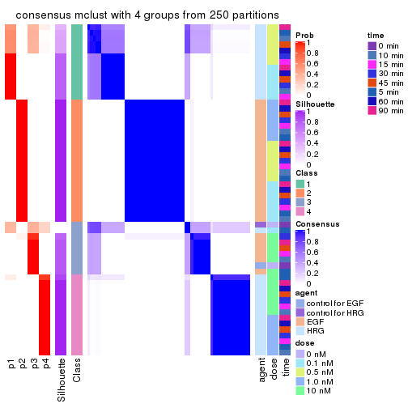</p>

</div>
<div id='tab-ATC-mclust-consensus-heatmap-4'>
<pre><code class="r">consensus_heatmap(res, k = 5)
</code></pre>

<p></p>

</div>
<div id='tab-ATC-mclust-consensus-heatmap-5'>
<pre><code class="r">consensus_heatmap(res, k = 6)
</code></pre>

<p></p>

</div>
</div>

Heatmaps for the membership of samples in all partitions to see how consistent they are:


<script>
$( function() {
	$( '#tabs-ATC-mclust-membership-heatmap' ).tabs();
} );
</script>
<div id='tabs-ATC-mclust-membership-heatmap'>
<ul>
<li><a href='#tab-ATC-mclust-membership-heatmap-1'>k = 2</a></li>
<li><a href='#tab-ATC-mclust-membership-heatmap-2'>k = 3</a></li>
<li><a href='#tab-ATC-mclust-membership-heatmap-3'>k = 4</a></li>
<li><a href='#tab-ATC-mclust-membership-heatmap-4'>k = 5</a></li>
<li><a href='#tab-ATC-mclust-membership-heatmap-5'>k = 6</a></li>
</ul>
<div id='tab-ATC-mclust-membership-heatmap-1'>
<pre><code class="r">membership_heatmap(res, k = 2)
</code></pre>

<p></p>

</div>
<div id='tab-ATC-mclust-membership-heatmap-2'>
<pre><code class="r">membership_heatmap(res, k = 3)
</code></pre>

<p></p>

</div>
<div id='tab-ATC-mclust-membership-heatmap-3'>
<pre><code class="r">membership_heatmap(res, k = 4)
</code></pre>

<p></p>

</div>
<div id='tab-ATC-mclust-membership-heatmap-4'>
<pre><code class="r">membership_heatmap(res, k = 5)
</code></pre>

<p></p>

</div>
<div id='tab-ATC-mclust-membership-heatmap-5'>
<pre><code class="r">membership_heatmap(res, k = 6)
</code></pre>

<p></p>

</div>
</div>

As soon as we have had the classes for columns, we can look for signatures
which are significantly different between classes which can be candidate marks
for certain classes. Following are the heatmaps for signatures.


Signature heatmaps where rows are scaled:


<script>
$( function() {
	$( '#tabs-ATC-mclust-get-signatures' ).tabs();
} );
</script>
<div id='tabs-ATC-mclust-get-signatures'>
<ul>
<li><a href='#tab-ATC-mclust-get-signatures-1'>k = 2</a></li>
<li><a href='#tab-ATC-mclust-get-signatures-2'>k = 3</a></li>
<li><a href='#tab-ATC-mclust-get-signatures-3'>k = 4</a></li>
<li><a href='#tab-ATC-mclust-get-signatures-4'>k = 5</a></li>
<li><a href='#tab-ATC-mclust-get-signatures-5'>k = 6</a></li>
</ul>
<div id='tab-ATC-mclust-get-signatures-1'>
<pre><code class="r">get_signatures(res, k = 2)
</code></pre>

<p></p>

</div>
<div id='tab-ATC-mclust-get-signatures-2'>
<pre><code class="r">get_signatures(res, k = 3)
</code></pre>

<p></p>

</div>
<div id='tab-ATC-mclust-get-signatures-3'>
<pre><code class="r">get_signatures(res, k = 4)
</code></pre>

<p></p>

</div>
<div id='tab-ATC-mclust-get-signatures-4'>
<pre><code class="r">get_signatures(res, k = 5)
</code></pre>

<p></p>

</div>
<div id='tab-ATC-mclust-get-signatures-5'>
<pre><code class="r">get_signatures(res, k = 6)
</code></pre>

<p></p>

</div>
</div>


Signature heatmaps where rows are not scaled:


<script>
$( function() {
	$( '#tabs-ATC-mclust-get-signatures-no-scale' ).tabs();
} );
</script>
<div id='tabs-ATC-mclust-get-signatures-no-scale'>
<ul>
<li><a href='#tab-ATC-mclust-get-signatures-no-scale-1'>k = 2</a></li>
<li><a href='#tab-ATC-mclust-get-signatures-no-scale-2'>k = 3</a></li>
<li><a href='#tab-ATC-mclust-get-signatures-no-scale-3'>k = 4</a></li>
<li><a href='#tab-ATC-mclust-get-signatures-no-scale-4'>k = 5</a></li>
<li><a href='#tab-ATC-mclust-get-signatures-no-scale-5'>k = 6</a></li>
</ul>
<div id='tab-ATC-mclust-get-signatures-no-scale-1'>
<pre><code class="r">get_signatures(res, k = 2, scale_rows = FALSE)
</code></pre>

<p></p>

</div>
<div id='tab-ATC-mclust-get-signatures-no-scale-2'>
<pre><code class="r">get_signatures(res, k = 3, scale_rows = FALSE)
</code></pre>

<p></p>

</div>
<div id='tab-ATC-mclust-get-signatures-no-scale-3'>
<pre><code class="r">get_signatures(res, k = 4, scale_rows = FALSE)
</code></pre>

<p></p>

</div>
<div id='tab-ATC-mclust-get-signatures-no-scale-4'>
<pre><code class="r">get_signatures(res, k = 5, scale_rows = FALSE)
</code></pre>

<p></p>

</div>
<div id='tab-ATC-mclust-get-signatures-no-scale-5'>
<pre><code class="r">get_signatures(res, k = 6, scale_rows = FALSE)
</code></pre>

<p></p>

</div>
</div>


Compare the overlap of signatures from different k:

```r
compare_signatures(res)
```


`get_signature()` returns a data frame invisibly. TO get the list of signatures, the function
call should be assigned to a variable explicitly. In following code, if `plot` argument is set
to `FALSE`, no heatmap is plotted while only the differential analysis is performed.

```r
# code only for demonstration
tb = get_signature(res, k = ..., plot = FALSE)
```

An example of the output of `tb` is:

```
#>   which_row         fdr    mean_1    mean_2 scaled_mean_1 scaled_mean_2 km
#> 1        38 0.042760348  8.373488  9.131774    -0.5533452     0.5164555  1
#> 2        40 0.018707592  7.106213  8.469186    -0.6173731     0.5762149  1
#> 3        55 0.019134737 10.221463 11.207825    -0.6159697     0.5749050  1
#> 4        59 0.006059896  5.921854  7.869574    -0.6899429     0.6439467  1
#> 5        60 0.018055526  8.928898 10.211722    -0.6204761     0.5791110  1
#> 6        98 0.009384629 15.714769 14.887706     0.6635654    -0.6193277  2
...
```

The columns in `tb` are:

1. `which_row`: row indices corresponding to the input matrix.
2. `fdr`: FDR for the differential test. 
3. `mean_x`: The mean value in group x.
4. `scaled_mean_x`: The mean value in group x after rows are scaled.
5. `km`: Row groups if k-means clustering is applied to rows.


UMAP plot which shows how samples are separated.


<script>
$( function() {
	$( '#tabs-ATC-mclust-dimension-reduction' ).tabs();
} );
</script>
<div id='tabs-ATC-mclust-dimension-reduction'>
<ul>
<li><a href='#tab-ATC-mclust-dimension-reduction-1'>k = 2</a></li>
<li><a href='#tab-ATC-mclust-dimension-reduction-2'>k = 3</a></li>
<li><a href='#tab-ATC-mclust-dimension-reduction-3'>k = 4</a></li>
<li><a href='#tab-ATC-mclust-dimension-reduction-4'>k = 5</a></li>
<li><a href='#tab-ATC-mclust-dimension-reduction-5'>k = 6</a></li>
</ul>
<div id='tab-ATC-mclust-dimension-reduction-1'>
<pre><code class="r">dimension_reduction(res, k = 2, method = &quot;UMAP&quot;)
</code></pre>

<p></p>

</div>
<div id='tab-ATC-mclust-dimension-reduction-2'>
<pre><code class="r">dimension_reduction(res, k = 3, method = &quot;UMAP&quot;)
</code></pre>

<p></p>

</div>
<div id='tab-ATC-mclust-dimension-reduction-3'>
<pre><code class="r">dimension_reduction(res, k = 4, method = &quot;UMAP&quot;)
</code></pre>

<p></p>

</div>
<div id='tab-ATC-mclust-dimension-reduction-4'>
<pre><code class="r">dimension_reduction(res, k = 5, method = &quot;UMAP&quot;)
</code></pre>

<p></p>

</div>
<div id='tab-ATC-mclust-dimension-reduction-5'>
<pre><code class="r">dimension_reduction(res, k = 6, method = &quot;UMAP&quot;)
</code></pre>

<p></p>

</div>
</div>


Following heatmap shows how subgroups are split when increasing `k`:

```r
collect_classes(res)
```


Test correlation between subgroups and known annotations. If the known
annotation is numeric, one-way ANOVA test is applied, and if the known
annotation is discrete, chi-squared contingency table test is applied.

```r
test_to_known_factors(res)
```

```
#>             n agent(p)  dose(p) time(p) k
#> ATC:mclust 57 2.57e-12 1.00e+00   1.000 2
#> ATC:mclust 45 1.69e-10 8.25e-05   0.997 3
#> ATC:mclust 50 3.58e-10 3.73e-07   0.987 4
#> ATC:mclust 56 3.68e-09 3.52e-06   0.857 5
#> ATC:mclust 52 2.28e-11 1.37e-06   0.397 6
```


If matrix rows can be associated to genes, consider to use `functional_enrichment(res,
...)` to perform function enrichment for the signature genes. See [this vignette](http://bioconductor.org/packages/devel/bioc/vignettes/cola/inst/doc/functional_enrichment.html) for more detailed explanations.


 

---------------------------------------------------


### ATC:NMF**


The object with results only for a single top-value method and a single partition method 
can be extracted as:

```r
res = res_list["ATC", "NMF"]
# you can also extract it by
# res = res_list["ATC:NMF"]
```

A summary of `res` and all the functions that can be applied to it:

```r
res
```

```
#> A 'ConsensusPartition' object with k = 2, 3, 4, 5, 6.
#>   On a matrix with 21163 rows and 57 columns.
#>   Top rows (1000, 2000, 3000, 4000, 5000) are extracted by 'ATC' method.
#>   Subgroups are detected by 'NMF' method.
#>   Performed in total 1250 partitions by row resampling.
#>   Best k for subgroups seems to be 2.
#> 
#> Following methods can be applied to this 'ConsensusPartition' object:
#>  [1] "cola_report"             "collect_classes"         "collect_plots"          
#>  [4] "collect_stats"           "colnames"                "compare_signatures"     
#>  [7] "consensus_heatmap"       "dimension_reduction"     "functional_enrichment"  
#> [10] "get_anno_col"            "get_anno"                "get_classes"            
#> [13] "get_consensus"           "get_matrix"              "get_membership"         
#> [16] "get_param"               "get_signatures"          "get_stats"              
#> [19] "is_best_k"               "is_stable_k"             "membership_heatmap"     
#> [22] "ncol"                    "nrow"                    "plot_ecdf"              
#> [25] "rownames"                "select_partition_number" "show"                   
#> [28] "suggest_best_k"          "test_to_known_factors"
```

`collect_plots()` function collects all the plots made from `res` for all `k` (number of partitions)
into one single page to provide an easy and fast comparison between different `k`.

```r
collect_plots(res)
```


The plots are:

- The first row: a plot of the ECDF (empirical cumulative distribution
  function) curves of the consensus matrix for each `k` and the heatmap of
  predicted classes for each `k`.
- The second row: heatmaps of the consensus matrix for each `k`.
- The third row: heatmaps of the membership matrix for each `k`.
- The fouth row: heatmaps of the signatures for each `k`.

All the plots in panels can be made by individual functions and they are
plotted later in this section.

`select_partition_number()` produces several plots showing different
statistics for choosing "optimized" `k`. There are following statistics:

- ECDF curves of the consensus matrix for each `k`;
- 1-PAC. [The PAC
  score](https://en.wikipedia.org/wiki/Consensus_clustering#Over-interpretation_potential_of_consensus_clustering)
  measures the proportion of the ambiguous subgrouping.
- Mean silhouette score.
- Concordance. The mean probability of fiting the consensus class ids in all
  partitions.
- Area increased. Denote $A_k$ as the area under the ECDF curve for current
  `k`, the area increased is defined as $A_k - A_{k-1}$.
- Rand index. The percent of pairs of samples that are both in a same cluster
  or both are not in a same cluster in the partition of k and k-1.
- Jaccard index. The ratio of pairs of samples are both in a same cluster in
  the partition of k and k-1 and the pairs of samples are both in a same
  cluster in the partition k or k-1.

The detailed explanations of these statistics can be found in [the _cola_
vignette](http://bioconductor.org/packages/devel/bioc/vignettes/cola/inst/doc/cola.html#toc_13).

Generally speaking, lower PAC score, higher mean silhouette score or higher
concordance corresponds to better partition. Rand index and Jaccard index
measure how similar the current partition is compared to partition with `k-1`.
If they are too similar, we won't accept `k` is better than `k-1`.

```r
select_partition_number(res)
```


The numeric values for all these statistics can be obtained by `get_stats()`.

```r
get_stats(res)
```

```
#>   k 1-PAC mean_silhouette concordance area_increased  Rand Jaccard
#> 2 2 1.000           1.000       1.000         0.5093 0.491   0.491
#> 3 3 0.767           0.801       0.885         0.2157 0.857   0.716
#> 4 4 0.842           0.897       0.885         0.1289 0.871   0.666
#> 5 5 0.780           0.840       0.875         0.0544 0.971   0.893
#> 6 6 0.824           0.808       0.848         0.0341 0.984   0.937
```

`suggest_best_k()` suggests the best $k$ based on these statistics. The rules are as follows:

- All $k$ with Jaccard index larger than 0.95 are removed because increasing
  $k$ does not provide enough extra information. If all $k$ are removed, it is
  marked as no subgroup is detected.
- For all $k$ with 1-PAC score larger than 0.9, the maximal $k$ is taken as
  the best $k$, and other $k$ are marked as optional $k$.
- If it does not fit the second rule. The $k$ with the maximal vote of the
  highest 1-PAC score, highest mean silhouette, and highest concordance is
  taken as the best $k$.

```r
suggest_best_k(res)
```

```
#> [1] 2
```


Following shows the table of the partitions (You need to click the **show/hide
code output** link to see it). The membership matrix (columns with name `p*`)
is inferred by
[`clue::cl_consensus()`](https://www.rdocumentation.org/link/cl_consensus?package=clue)
function with the `SE` method. Basically the value in the membership matrix
represents the probability to belong to a certain group. The finall class
label for an item is determined with the group with highest probability it
belongs to.

In `get_classes()` function, the entropy is calculated from the membership
matrix and the silhouette score is calculated from the consensus matrix.


<script>
$( function() {
	$( '#tabs-ATC-NMF-get-classes' ).tabs();
} );
</script>
<div id='tabs-ATC-NMF-get-classes'>
<ul>
<li><a href='#tab-ATC-NMF-get-classes-1'>k = 2</a></li>
<li><a href='#tab-ATC-NMF-get-classes-2'>k = 3</a></li>
<li><a href='#tab-ATC-NMF-get-classes-3'>k = 4</a></li>
<li><a href='#tab-ATC-NMF-get-classes-4'>k = 5</a></li>
<li><a href='#tab-ATC-NMF-get-classes-5'>k = 6</a></li>
</ul>

<div id='tab-ATC-NMF-get-classes-1'>
<p><a id='tab-ATC-NMF-get-classes-1-a' style='color:#0366d6' href='#'>show/hide code output</a></p>
<pre><code class="r">cbind(get_classes(res, k = 2), get_membership(res, k = 2))
</code></pre>

<pre><code>#&gt;           class entropy silhouette p1 p2
#&gt; GSM148516     2       0          1  0  1
#&gt; GSM148517     1       0          1  1  0
#&gt; GSM148518     2       0          1  0  1
#&gt; GSM148519     2       0          1  0  1
#&gt; GSM148520     2       0          1  0  1
#&gt; GSM148521     2       0          1  0  1
#&gt; GSM148522     2       0          1  0  1
#&gt; GSM148523     2       0          1  0  1
#&gt; GSM148524     2       0          1  0  1
#&gt; GSM148525     2       0          1  0  1
#&gt; GSM148526     2       0          1  0  1
#&gt; GSM148527     2       0          1  0  1
#&gt; GSM148528     2       0          1  0  1
#&gt; GSM148529     2       0          1  0  1
#&gt; GSM148530     2       0          1  0  1
#&gt; GSM148531     2       0          1  0  1
#&gt; GSM148532     2       0          1  0  1
#&gt; GSM148533     2       0          1  0  1
#&gt; GSM148534     2       0          1  0  1
#&gt; GSM148535     2       0          1  0  1
#&gt; GSM148536     2       0          1  0  1
#&gt; GSM148537     2       0          1  0  1
#&gt; GSM148538     2       0          1  0  1
#&gt; GSM148539     2       0          1  0  1
#&gt; GSM148540     2       0          1  0  1
#&gt; GSM148541     2       0          1  0  1
#&gt; GSM148542     2       0          1  0  1
#&gt; GSM148543     2       0          1  0  1
#&gt; GSM148544     2       0          1  0  1
#&gt; GSM148545     1       0          1  1  0
#&gt; GSM148546     1       0          1  1  0
#&gt; GSM148547     1       0          1  1  0
#&gt; GSM148548     1       0          1  1  0
#&gt; GSM148549     1       0          1  1  0
#&gt; GSM148550     1       0          1  1  0
#&gt; GSM148551     1       0          1  1  0
#&gt; GSM148552     1       0          1  1  0
#&gt; GSM148553     1       0          1  1  0
#&gt; GSM148554     1       0          1  1  0
#&gt; GSM148555     1       0          1  1  0
#&gt; GSM148556     1       0          1  1  0
#&gt; GSM148557     1       0          1  1  0
#&gt; GSM148558     1       0          1  1  0
#&gt; GSM148559     1       0          1  1  0
#&gt; GSM148560     1       0          1  1  0
#&gt; GSM148561     1       0          1  1  0
#&gt; GSM148562     1       0          1  1  0
#&gt; GSM148563     1       0          1  1  0
#&gt; GSM148564     1       0          1  1  0
#&gt; GSM148565     1       0          1  1  0
#&gt; GSM148566     1       0          1  1  0
#&gt; GSM148567     1       0          1  1  0
#&gt; GSM148568     1       0          1  1  0
#&gt; GSM148569     1       0          1  1  0
#&gt; GSM148570     1       0          1  1  0
#&gt; GSM148571     1       0          1  1  0
#&gt; GSM148572     1       0          1  1  0
</code></pre>

<script>
$('#tab-ATC-NMF-get-classes-1-a').parent().next().next().hide();
$('#tab-ATC-NMF-get-classes-1-a').click(function(){
  $('#tab-ATC-NMF-get-classes-1-a').parent().next().next().toggle();
  return(false);
});
</script>
</div>

<div id='tab-ATC-NMF-get-classes-2'>
<p><a id='tab-ATC-NMF-get-classes-2-a' style='color:#0366d6' href='#'>show/hide code output</a></p>
<pre><code class="r">cbind(get_classes(res, k = 3), get_membership(res, k = 3))
</code></pre>

<pre><code>#&gt;           class entropy silhouette    p1    p2    p3
#&gt; GSM148516     3  0.6126      0.473 0.000 0.400 0.600
#&gt; GSM148517     3  0.5178      0.316 0.256 0.000 0.744
#&gt; GSM148518     2  0.0237      0.979 0.000 0.996 0.004
#&gt; GSM148519     2  0.0237      0.980 0.000 0.996 0.004
#&gt; GSM148520     2  0.0237      0.979 0.000 0.996 0.004
#&gt; GSM148521     2  0.0000      0.980 0.000 1.000 0.000
#&gt; GSM148522     2  0.0000      0.980 0.000 1.000 0.000
#&gt; GSM148523     2  0.0237      0.980 0.000 0.996 0.004
#&gt; GSM148524     2  0.0592      0.978 0.000 0.988 0.012
#&gt; GSM148525     2  0.0592      0.976 0.000 0.988 0.012
#&gt; GSM148526     2  0.0747      0.977 0.000 0.984 0.016
#&gt; GSM148527     2  0.1031      0.972 0.000 0.976 0.024
#&gt; GSM148528     2  0.0747      0.973 0.000 0.984 0.016
#&gt; GSM148529     2  0.0592      0.978 0.000 0.988 0.012
#&gt; GSM148530     2  0.0592      0.976 0.000 0.988 0.012
#&gt; GSM148531     2  0.0424      0.978 0.000 0.992 0.008
#&gt; GSM148532     2  0.1643      0.957 0.000 0.956 0.044
#&gt; GSM148533     2  0.0592      0.980 0.000 0.988 0.012
#&gt; GSM148534     2  0.0424      0.978 0.000 0.992 0.008
#&gt; GSM148535     2  0.1411      0.964 0.000 0.964 0.036
#&gt; GSM148536     2  0.0237      0.980 0.000 0.996 0.004
#&gt; GSM148537     2  0.1643      0.957 0.000 0.956 0.044
#&gt; GSM148538     2  0.1643      0.957 0.000 0.956 0.044
#&gt; GSM148539     3  0.5621      0.592 0.000 0.308 0.692
#&gt; GSM148540     3  0.5968      0.535 0.000 0.364 0.636
#&gt; GSM148541     3  0.4750      0.609 0.000 0.216 0.784
#&gt; GSM148542     2  0.1860      0.945 0.000 0.948 0.052
#&gt; GSM148543     3  0.5650      0.589 0.000 0.312 0.688
#&gt; GSM148544     3  0.6215      0.421 0.000 0.428 0.572
#&gt; GSM148545     3  0.6295     -0.217 0.472 0.000 0.528
#&gt; GSM148546     1  0.2066      0.861 0.940 0.000 0.060
#&gt; GSM148547     1  0.2165      0.859 0.936 0.000 0.064
#&gt; GSM148548     1  0.2356      0.856 0.928 0.000 0.072
#&gt; GSM148549     1  0.2448      0.854 0.924 0.000 0.076
#&gt; GSM148550     1  0.2448      0.854 0.924 0.000 0.076
#&gt; GSM148551     1  0.2448      0.854 0.924 0.000 0.076
#&gt; GSM148552     1  0.0747      0.868 0.984 0.000 0.016
#&gt; GSM148553     1  0.0424      0.868 0.992 0.000 0.008
#&gt; GSM148554     1  0.2165      0.859 0.936 0.000 0.064
#&gt; GSM148555     1  0.2448      0.854 0.924 0.000 0.076
#&gt; GSM148556     1  0.0892      0.867 0.980 0.000 0.020
#&gt; GSM148557     1  0.0892      0.867 0.980 0.000 0.020
#&gt; GSM148558     1  0.1964      0.862 0.944 0.000 0.056
#&gt; GSM148559     1  0.4555      0.776 0.800 0.000 0.200
#&gt; GSM148560     1  0.2711      0.846 0.912 0.000 0.088
#&gt; GSM148561     1  0.0747      0.869 0.984 0.000 0.016
#&gt; GSM148562     1  0.2959      0.841 0.900 0.000 0.100
#&gt; GSM148563     1  0.0424      0.868 0.992 0.000 0.008
#&gt; GSM148564     3  0.6299     -0.231 0.476 0.000 0.524
#&gt; GSM148565     1  0.5835      0.601 0.660 0.000 0.340
#&gt; GSM148566     1  0.1643      0.864 0.956 0.000 0.044
#&gt; GSM148567     1  0.5254      0.714 0.736 0.000 0.264
#&gt; GSM148568     1  0.4931      0.749 0.768 0.000 0.232
#&gt; GSM148569     1  0.4887      0.753 0.772 0.000 0.228
#&gt; GSM148570     1  0.5216      0.719 0.740 0.000 0.260
#&gt; GSM148571     1  0.3116      0.837 0.892 0.000 0.108
#&gt; GSM148572     1  0.6045      0.522 0.620 0.000 0.380
</code></pre>

<script>
$('#tab-ATC-NMF-get-classes-2-a').parent().next().next().hide();
$('#tab-ATC-NMF-get-classes-2-a').click(function(){
  $('#tab-ATC-NMF-get-classes-2-a').parent().next().next().toggle();
  return(false);
});
</script>
</div>

<div id='tab-ATC-NMF-get-classes-3'>
<p><a id='tab-ATC-NMF-get-classes-3-a' style='color:#0366d6' href='#'>show/hide code output</a></p>
<pre><code class="r">cbind(get_classes(res, k = 4), get_membership(res, k = 4))
</code></pre>

<pre><code>#&gt;           class entropy silhouette    p1    p2    p3    p4
#&gt; GSM148516     3  0.2111      0.905 0.024 0.044 0.932 0.000
#&gt; GSM148517     3  0.5320      0.198 0.012 0.000 0.572 0.416
#&gt; GSM148518     2  0.0336      0.968 0.008 0.992 0.000 0.000
#&gt; GSM148519     2  0.0000      0.968 0.000 1.000 0.000 0.000
#&gt; GSM148520     2  0.1305      0.959 0.036 0.960 0.004 0.000
#&gt; GSM148521     2  0.1118      0.960 0.036 0.964 0.000 0.000
#&gt; GSM148522     2  0.0188      0.968 0.004 0.996 0.000 0.000
#&gt; GSM148523     2  0.0817      0.968 0.024 0.976 0.000 0.000
#&gt; GSM148524     2  0.0469      0.967 0.012 0.988 0.000 0.000
#&gt; GSM148525     2  0.1284      0.961 0.024 0.964 0.012 0.000
#&gt; GSM148526     2  0.0524      0.968 0.004 0.988 0.008 0.000
#&gt; GSM148527     2  0.0469      0.967 0.012 0.988 0.000 0.000
#&gt; GSM148528     2  0.1767      0.952 0.044 0.944 0.012 0.000
#&gt; GSM148529     2  0.0469      0.967 0.012 0.988 0.000 0.000
#&gt; GSM148530     2  0.1305      0.959 0.036 0.960 0.004 0.000
#&gt; GSM148531     2  0.1211      0.959 0.040 0.960 0.000 0.000
#&gt; GSM148532     2  0.0707      0.966 0.020 0.980 0.000 0.000
#&gt; GSM148533     2  0.1059      0.965 0.016 0.972 0.012 0.000
#&gt; GSM148534     2  0.0524      0.968 0.004 0.988 0.008 0.000
#&gt; GSM148535     2  0.0592      0.967 0.016 0.984 0.000 0.000
#&gt; GSM148536     2  0.0804      0.967 0.012 0.980 0.008 0.000
#&gt; GSM148537     2  0.0779      0.966 0.016 0.980 0.004 0.000
#&gt; GSM148538     2  0.1004      0.963 0.024 0.972 0.004 0.000
#&gt; GSM148539     3  0.2021      0.908 0.024 0.040 0.936 0.000
#&gt; GSM148540     3  0.1913      0.906 0.020 0.040 0.940 0.000
#&gt; GSM148541     3  0.2023      0.901 0.028 0.028 0.940 0.004
#&gt; GSM148542     2  0.6049      0.590 0.120 0.680 0.200 0.000
#&gt; GSM148543     3  0.1767      0.908 0.012 0.044 0.944 0.000
#&gt; GSM148544     3  0.1637      0.898 0.000 0.060 0.940 0.000
#&gt; GSM148545     4  0.5322      0.503 0.028 0.000 0.312 0.660
#&gt; GSM148546     1  0.4522      0.900 0.680 0.000 0.000 0.320
#&gt; GSM148547     1  0.4382      0.907 0.704 0.000 0.000 0.296
#&gt; GSM148548     1  0.4103      0.902 0.744 0.000 0.000 0.256
#&gt; GSM148549     1  0.3486      0.836 0.812 0.000 0.000 0.188
#&gt; GSM148550     1  0.4164      0.905 0.736 0.000 0.000 0.264
#&gt; GSM148551     1  0.4103      0.902 0.744 0.000 0.000 0.256
#&gt; GSM148552     1  0.5083      0.886 0.716 0.000 0.036 0.248
#&gt; GSM148553     1  0.4697      0.880 0.644 0.000 0.000 0.356
#&gt; GSM148554     1  0.4250      0.907 0.724 0.000 0.000 0.276
#&gt; GSM148555     1  0.3907      0.884 0.768 0.000 0.000 0.232
#&gt; GSM148556     1  0.5220      0.878 0.632 0.000 0.016 0.352
#&gt; GSM148557     1  0.5217      0.848 0.608 0.000 0.012 0.380
#&gt; GSM148558     1  0.4730      0.872 0.636 0.000 0.000 0.364
#&gt; GSM148559     4  0.0336      0.935 0.008 0.000 0.000 0.992
#&gt; GSM148560     4  0.0592      0.930 0.016 0.000 0.000 0.984
#&gt; GSM148561     4  0.2402      0.855 0.076 0.000 0.012 0.912
#&gt; GSM148562     4  0.0469      0.932 0.012 0.000 0.000 0.988
#&gt; GSM148563     4  0.2266      0.838 0.084 0.000 0.004 0.912
#&gt; GSM148564     4  0.0707      0.924 0.000 0.000 0.020 0.980
#&gt; GSM148565     4  0.0469      0.931 0.000 0.000 0.012 0.988
#&gt; GSM148566     1  0.4977      0.710 0.540 0.000 0.000 0.460
#&gt; GSM148567     4  0.0657      0.935 0.004 0.000 0.012 0.984
#&gt; GSM148568     4  0.0000      0.936 0.000 0.000 0.000 1.000
#&gt; GSM148569     4  0.0188      0.936 0.004 0.000 0.000 0.996
#&gt; GSM148570     4  0.0524      0.935 0.004 0.000 0.008 0.988
#&gt; GSM148571     4  0.0188      0.936 0.004 0.000 0.000 0.996
#&gt; GSM148572     4  0.0592      0.928 0.000 0.000 0.016 0.984
</code></pre>

<script>
$('#tab-ATC-NMF-get-classes-3-a').parent().next().next().hide();
$('#tab-ATC-NMF-get-classes-3-a').click(function(){
  $('#tab-ATC-NMF-get-classes-3-a').parent().next().next().toggle();
  return(false);
});
</script>
</div>

<div id='tab-ATC-NMF-get-classes-4'>
<p><a id='tab-ATC-NMF-get-classes-4-a' style='color:#0366d6' href='#'>show/hide code output</a></p>
<pre><code class="r">cbind(get_classes(res, k = 5), get_membership(res, k = 5))
</code></pre>

<pre><code>#&gt;           class entropy silhouette    p1    p2    p3    p4    p5
#&gt; GSM148516     3  0.1059      0.821 0.004 0.008 0.968 0.000 0.020
#&gt; GSM148517     5  0.7976      0.593 0.116 0.000 0.336 0.168 0.380
#&gt; GSM148518     2  0.0798      0.983 0.000 0.976 0.016 0.000 0.008
#&gt; GSM148519     2  0.0579      0.985 0.000 0.984 0.008 0.000 0.008
#&gt; GSM148520     2  0.0510      0.983 0.000 0.984 0.000 0.000 0.016
#&gt; GSM148521     2  0.0609      0.982 0.000 0.980 0.000 0.000 0.020
#&gt; GSM148522     2  0.0162      0.985 0.000 0.996 0.000 0.000 0.004
#&gt; GSM148523     2  0.0404      0.984 0.000 0.988 0.000 0.000 0.012
#&gt; GSM148524     2  0.0510      0.985 0.000 0.984 0.000 0.000 0.016
#&gt; GSM148525     2  0.0613      0.985 0.004 0.984 0.004 0.000 0.008
#&gt; GSM148526     2  0.0727      0.984 0.004 0.980 0.004 0.000 0.012
#&gt; GSM148527     2  0.0510      0.985 0.000 0.984 0.000 0.000 0.016
#&gt; GSM148528     2  0.0566      0.985 0.000 0.984 0.004 0.000 0.012
#&gt; GSM148529     2  0.0404      0.985 0.000 0.988 0.000 0.000 0.012
#&gt; GSM148530     2  0.0566      0.984 0.004 0.984 0.000 0.000 0.012
#&gt; GSM148531     2  0.0865      0.978 0.004 0.972 0.000 0.000 0.024
#&gt; GSM148532     2  0.0693      0.984 0.000 0.980 0.008 0.000 0.012
#&gt; GSM148533     2  0.1808      0.955 0.008 0.936 0.012 0.000 0.044
#&gt; GSM148534     2  0.0451      0.985 0.000 0.988 0.008 0.000 0.004
#&gt; GSM148535     2  0.0798      0.983 0.000 0.976 0.008 0.000 0.016
#&gt; GSM148536     2  0.0324      0.986 0.000 0.992 0.004 0.000 0.004
#&gt; GSM148537     2  0.0324      0.986 0.000 0.992 0.004 0.000 0.004
#&gt; GSM148538     2  0.0807      0.983 0.000 0.976 0.012 0.000 0.012
#&gt; GSM148539     3  0.0579      0.822 0.008 0.000 0.984 0.000 0.008
#&gt; GSM148540     3  0.0865      0.823 0.000 0.004 0.972 0.000 0.024
#&gt; GSM148541     3  0.0880      0.814 0.000 0.000 0.968 0.000 0.032
#&gt; GSM148542     3  0.7198      0.218 0.024 0.336 0.456 0.008 0.176
#&gt; GSM148543     3  0.1082      0.823 0.000 0.008 0.964 0.000 0.028
#&gt; GSM148544     3  0.0955      0.810 0.000 0.028 0.968 0.000 0.004
#&gt; GSM148545     5  0.8251      0.605 0.176 0.000 0.160 0.300 0.364
#&gt; GSM148546     1  0.4404      0.762 0.760 0.000 0.000 0.152 0.088
#&gt; GSM148547     1  0.4260      0.785 0.784 0.000 0.004 0.124 0.088
#&gt; GSM148548     1  0.2473      0.812 0.896 0.000 0.000 0.072 0.032
#&gt; GSM148549     1  0.2885      0.791 0.880 0.000 0.004 0.064 0.052
#&gt; GSM148550     1  0.2423      0.810 0.896 0.000 0.000 0.080 0.024
#&gt; GSM148551     1  0.2694      0.803 0.884 0.000 0.000 0.076 0.040
#&gt; GSM148552     1  0.4784      0.758 0.772 0.000 0.044 0.068 0.116
#&gt; GSM148553     1  0.4985      0.694 0.728 0.000 0.008 0.116 0.148
#&gt; GSM148554     1  0.3512      0.803 0.840 0.000 0.004 0.088 0.068
#&gt; GSM148555     1  0.2270      0.810 0.908 0.000 0.004 0.072 0.016
#&gt; GSM148556     1  0.4746      0.742 0.744 0.000 0.004 0.132 0.120
#&gt; GSM148557     1  0.4888      0.741 0.728 0.000 0.004 0.160 0.108
#&gt; GSM148558     1  0.4065      0.771 0.772 0.000 0.000 0.180 0.048
#&gt; GSM148559     4  0.3494      0.801 0.096 0.000 0.004 0.840 0.060
#&gt; GSM148560     4  0.4149      0.727 0.128 0.000 0.000 0.784 0.088
#&gt; GSM148561     4  0.4316      0.657 0.120 0.000 0.000 0.772 0.108
#&gt; GSM148562     4  0.2248      0.854 0.088 0.000 0.000 0.900 0.012
#&gt; GSM148563     4  0.1942      0.862 0.068 0.000 0.000 0.920 0.012
#&gt; GSM148564     4  0.3012      0.806 0.036 0.000 0.000 0.860 0.104
#&gt; GSM148565     4  0.3146      0.823 0.052 0.000 0.000 0.856 0.092
#&gt; GSM148566     1  0.6028      0.211 0.468 0.000 0.000 0.416 0.116
#&gt; GSM148567     4  0.2304      0.860 0.068 0.000 0.004 0.908 0.020
#&gt; GSM148568     4  0.1914      0.855 0.060 0.000 0.000 0.924 0.016
#&gt; GSM148569     4  0.1981      0.863 0.064 0.000 0.000 0.920 0.016
#&gt; GSM148570     4  0.2514      0.852 0.060 0.000 0.000 0.896 0.044
#&gt; GSM148571     4  0.2989      0.842 0.072 0.000 0.000 0.868 0.060
#&gt; GSM148572     4  0.3130      0.821 0.048 0.000 0.000 0.856 0.096
</code></pre>

<script>
$('#tab-ATC-NMF-get-classes-4-a').parent().next().next().hide();
$('#tab-ATC-NMF-get-classes-4-a').click(function(){
  $('#tab-ATC-NMF-get-classes-4-a').parent().next().next().toggle();
  return(false);
});
</script>
</div>

<div id='tab-ATC-NMF-get-classes-5'>
<p><a id='tab-ATC-NMF-get-classes-5-a' style='color:#0366d6' href='#'>show/hide code output</a></p>
<pre><code class="r">cbind(get_classes(res, k = 6), get_membership(res, k = 6))
</code></pre>

<pre><code>#&gt;           class entropy silhouette    p1    p2    p3    p4 p5    p6
#&gt; GSM148516     3  0.1426      0.915 0.000 0.016 0.948 0.000 NA 0.028
#&gt; GSM148517     6  0.6075      0.851 0.212 0.000 0.084 0.096 NA 0.604
#&gt; GSM148518     2  0.0951      0.976 0.000 0.968 0.004 0.000 NA 0.008
#&gt; GSM148519     2  0.0837      0.976 0.000 0.972 0.004 0.000 NA 0.004
#&gt; GSM148520     2  0.0260      0.979 0.000 0.992 0.000 0.000 NA 0.008
#&gt; GSM148521     2  0.0363      0.979 0.000 0.988 0.000 0.000 NA 0.012
#&gt; GSM148522     2  0.0146      0.979 0.000 0.996 0.000 0.000 NA 0.004
#&gt; GSM148523     2  0.1067      0.971 0.004 0.964 0.004 0.000 NA 0.024
#&gt; GSM148524     2  0.0777      0.976 0.000 0.972 0.000 0.000 NA 0.024
#&gt; GSM148525     2  0.0891      0.977 0.000 0.968 0.000 0.000 NA 0.008
#&gt; GSM148526     2  0.0935      0.976 0.000 0.964 0.000 0.000 NA 0.004
#&gt; GSM148527     2  0.0622      0.980 0.000 0.980 0.000 0.000 NA 0.008
#&gt; GSM148528     2  0.0508      0.979 0.000 0.984 0.000 0.000 NA 0.004
#&gt; GSM148529     2  0.0692      0.977 0.000 0.976 0.000 0.000 NA 0.020
#&gt; GSM148530     2  0.0951      0.973 0.008 0.968 0.000 0.000 NA 0.020
#&gt; GSM148531     2  0.1198      0.969 0.012 0.960 0.004 0.000 NA 0.020
#&gt; GSM148532     2  0.0665      0.979 0.000 0.980 0.004 0.000 NA 0.008
#&gt; GSM148533     2  0.1769      0.954 0.000 0.924 0.004 0.000 NA 0.012
#&gt; GSM148534     2  0.0951      0.976 0.000 0.968 0.004 0.000 NA 0.008
#&gt; GSM148535     2  0.1116      0.975 0.000 0.960 0.004 0.000 NA 0.008
#&gt; GSM148536     2  0.0405      0.979 0.000 0.988 0.000 0.000 NA 0.008
#&gt; GSM148537     2  0.0551      0.979 0.000 0.984 0.004 0.000 NA 0.008
#&gt; GSM148538     2  0.0984      0.977 0.000 0.968 0.008 0.000 NA 0.012
#&gt; GSM148539     3  0.1810      0.907 0.004 0.008 0.932 0.000 NA 0.020
#&gt; GSM148540     3  0.0508      0.915 0.000 0.000 0.984 0.000 NA 0.012
#&gt; GSM148541     3  0.0858      0.912 0.000 0.000 0.968 0.000 NA 0.028
#&gt; GSM148542     3  0.5580      0.669 0.012 0.100 0.684 0.000 NA 0.132
#&gt; GSM148543     3  0.1230      0.914 0.000 0.008 0.956 0.000 NA 0.028
#&gt; GSM148544     3  0.0692      0.917 0.000 0.020 0.976 0.000 NA 0.004
#&gt; GSM148545     6  0.6733      0.843 0.232 0.000 0.048 0.164 NA 0.532
#&gt; GSM148546     1  0.4928      0.561 0.680 0.000 0.000 0.100 NA 0.016
#&gt; GSM148547     1  0.3912      0.685 0.784 0.000 0.000 0.060 NA 0.016
#&gt; GSM148548     1  0.1793      0.754 0.928 0.000 0.000 0.032 NA 0.004
#&gt; GSM148549     1  0.1851      0.754 0.928 0.000 0.000 0.036 NA 0.012
#&gt; GSM148550     1  0.1957      0.759 0.920 0.000 0.000 0.048 NA 0.008
#&gt; GSM148551     1  0.2602      0.750 0.888 0.000 0.000 0.052 NA 0.020
#&gt; GSM148552     1  0.4829      0.480 0.692 0.000 0.004 0.008 NA 0.196
#&gt; GSM148553     1  0.5968      0.280 0.528 0.000 0.012 0.040 NA 0.068
#&gt; GSM148554     1  0.3381      0.716 0.828 0.000 0.000 0.032 NA 0.024
#&gt; GSM148555     1  0.1196      0.758 0.952 0.000 0.000 0.040 NA 0.008
#&gt; GSM148556     1  0.3879      0.684 0.808 0.000 0.000 0.072 NA 0.044
#&gt; GSM148557     1  0.4018      0.656 0.768 0.000 0.000 0.112 NA 0.004
#&gt; GSM148558     1  0.4338      0.618 0.732 0.000 0.000 0.164 NA 0.004
#&gt; GSM148559     4  0.4011      0.668 0.060 0.000 0.000 0.736 NA 0.000
#&gt; GSM148560     4  0.4500      0.617 0.076 0.000 0.000 0.676 NA 0.000
#&gt; GSM148561     4  0.4945      0.512 0.068 0.000 0.000 0.584 NA 0.004
#&gt; GSM148562     4  0.3138      0.733 0.060 0.000 0.000 0.832 NA 0.000
#&gt; GSM148563     4  0.2001      0.747 0.040 0.000 0.000 0.912 NA 0.000
#&gt; GSM148564     4  0.3606      0.663 0.016 0.000 0.000 0.788 NA 0.024
#&gt; GSM148565     4  0.3621      0.659 0.032 0.000 0.000 0.772 NA 0.004
#&gt; GSM148566     4  0.5725      0.389 0.208 0.000 0.000 0.512 NA 0.000
#&gt; GSM148567     4  0.3634      0.727 0.060 0.000 0.000 0.820 NA 0.028
#&gt; GSM148568     4  0.2420      0.743 0.040 0.000 0.000 0.884 NA 0.000
#&gt; GSM148569     4  0.1204      0.745 0.056 0.000 0.000 0.944 NA 0.000
#&gt; GSM148570     4  0.2822      0.713 0.040 0.000 0.000 0.852 NA 0.000
#&gt; GSM148571     4  0.3651      0.680 0.048 0.000 0.000 0.772 NA 0.000
#&gt; GSM148572     4  0.3682      0.653 0.032 0.000 0.000 0.764 NA 0.004
</code></pre>

<script>
$('#tab-ATC-NMF-get-classes-5-a').parent().next().next().hide();
$('#tab-ATC-NMF-get-classes-5-a').click(function(){
  $('#tab-ATC-NMF-get-classes-5-a').parent().next().next().toggle();
  return(false);
});
</script>
</div>
</div>

Heatmaps for the consensus matrix. It visualizes the probability of two
samples to be in a same group.


<script>
$( function() {
	$( '#tabs-ATC-NMF-consensus-heatmap' ).tabs();
} );
</script>
<div id='tabs-ATC-NMF-consensus-heatmap'>
<ul>
<li><a href='#tab-ATC-NMF-consensus-heatmap-1'>k = 2</a></li>
<li><a href='#tab-ATC-NMF-consensus-heatmap-2'>k = 3</a></li>
<li><a href='#tab-ATC-NMF-consensus-heatmap-3'>k = 4</a></li>
<li><a href='#tab-ATC-NMF-consensus-heatmap-4'>k = 5</a></li>
<li><a href='#tab-ATC-NMF-consensus-heatmap-5'>k = 6</a></li>
</ul>
<div id='tab-ATC-NMF-consensus-heatmap-1'>
<pre><code class="r">consensus_heatmap(res, k = 2)
</code></pre>

<p></p>

</div>
<div id='tab-ATC-NMF-consensus-heatmap-2'>
<pre><code class="r">consensus_heatmap(res, k = 3)
</code></pre>

<p></p>

</div>
<div id='tab-ATC-NMF-consensus-heatmap-3'>
<pre><code class="r">consensus_heatmap(res, k = 4)
</code></pre>

<p></p>

</div>
<div id='tab-ATC-NMF-consensus-heatmap-4'>
<pre><code class="r">consensus_heatmap(res, k = 5)
</code></pre>

<p></p>

</div>
<div id='tab-ATC-NMF-consensus-heatmap-5'>
<pre><code class="r">consensus_heatmap(res, k = 6)
</code></pre>

<p></p>

</div>
</div>

Heatmaps for the membership of samples in all partitions to see how consistent they are:


<script>
$( function() {
	$( '#tabs-ATC-NMF-membership-heatmap' ).tabs();
} );
</script>
<div id='tabs-ATC-NMF-membership-heatmap'>
<ul>
<li><a href='#tab-ATC-NMF-membership-heatmap-1'>k = 2</a></li>
<li><a href='#tab-ATC-NMF-membership-heatmap-2'>k = 3</a></li>
<li><a href='#tab-ATC-NMF-membership-heatmap-3'>k = 4</a></li>
<li><a href='#tab-ATC-NMF-membership-heatmap-4'>k = 5</a></li>
<li><a href='#tab-ATC-NMF-membership-heatmap-5'>k = 6</a></li>
</ul>
<div id='tab-ATC-NMF-membership-heatmap-1'>
<pre><code class="r">membership_heatmap(res, k = 2)
</code></pre>

<p></p>

</div>
<div id='tab-ATC-NMF-membership-heatmap-2'>
<pre><code class="r">membership_heatmap(res, k = 3)
</code></pre>

<p></p>

</div>
<div id='tab-ATC-NMF-membership-heatmap-3'>
<pre><code class="r">membership_heatmap(res, k = 4)
</code></pre>

<p></p>

</div>
<div id='tab-ATC-NMF-membership-heatmap-4'>
<pre><code class="r">membership_heatmap(res, k = 5)
</code></pre>

<p></p>

</div>
<div id='tab-ATC-NMF-membership-heatmap-5'>
<pre><code class="r">membership_heatmap(res, k = 6)
</code></pre>

<p></p>

</div>
</div>

As soon as we have had the classes for columns, we can look for signatures
which are significantly different between classes which can be candidate marks
for certain classes. Following are the heatmaps for signatures.


Signature heatmaps where rows are scaled:


<script>
$( function() {
	$( '#tabs-ATC-NMF-get-signatures' ).tabs();
} );
</script>
<div id='tabs-ATC-NMF-get-signatures'>
<ul>
<li><a href='#tab-ATC-NMF-get-signatures-1'>k = 2</a></li>
<li><a href='#tab-ATC-NMF-get-signatures-2'>k = 3</a></li>
<li><a href='#tab-ATC-NMF-get-signatures-3'>k = 4</a></li>
<li><a href='#tab-ATC-NMF-get-signatures-4'>k = 5</a></li>
<li><a href='#tab-ATC-NMF-get-signatures-5'>k = 6</a></li>
</ul>
<div id='tab-ATC-NMF-get-signatures-1'>
<pre><code class="r">get_signatures(res, k = 2)
</code></pre>

<p></p>

</div>
<div id='tab-ATC-NMF-get-signatures-2'>
<pre><code class="r">get_signatures(res, k = 3)
</code></pre>

<p></p>

</div>
<div id='tab-ATC-NMF-get-signatures-3'>
<pre><code class="r">get_signatures(res, k = 4)
</code></pre>

<p>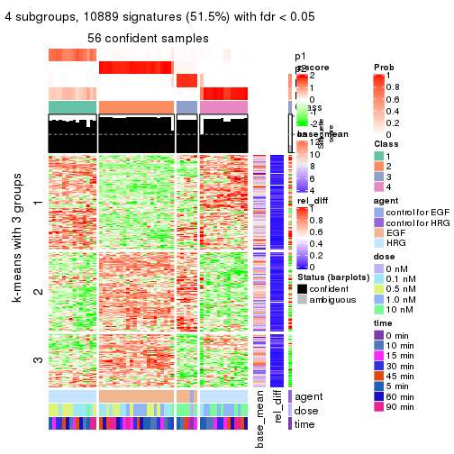</p>

</div>
<div id='tab-ATC-NMF-get-signatures-4'>
<pre><code class="r">get_signatures(res, k = 5)
</code></pre>

<p></p>

</div>
<div id='tab-ATC-NMF-get-signatures-5'>
<pre><code class="r">get_signatures(res, k = 6)
</code></pre>

<p></p>

</div>
</div>


Signature heatmaps where rows are not scaled:


<script>
$( function() {
	$( '#tabs-ATC-NMF-get-signatures-no-scale' ).tabs();
} );
</script>
<div id='tabs-ATC-NMF-get-signatures-no-scale'>
<ul>
<li><a href='#tab-ATC-NMF-get-signatures-no-scale-1'>k = 2</a></li>
<li><a href='#tab-ATC-NMF-get-signatures-no-scale-2'>k = 3</a></li>
<li><a href='#tab-ATC-NMF-get-signatures-no-scale-3'>k = 4</a></li>
<li><a href='#tab-ATC-NMF-get-signatures-no-scale-4'>k = 5</a></li>
<li><a href='#tab-ATC-NMF-get-signatures-no-scale-5'>k = 6</a></li>
</ul>
<div id='tab-ATC-NMF-get-signatures-no-scale-1'>
<pre><code class="r">get_signatures(res, k = 2, scale_rows = FALSE)
</code></pre>

<p></p>

</div>
<div id='tab-ATC-NMF-get-signatures-no-scale-2'>
<pre><code class="r">get_signatures(res, k = 3, scale_rows = FALSE)
</code></pre>

<p>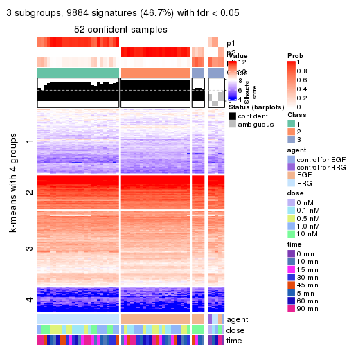</p>

</div>
<div id='tab-ATC-NMF-get-signatures-no-scale-3'>
<pre><code class="r">get_signatures(res, k = 4, scale_rows = FALSE)
</code></pre>

<p></p>

</div>
<div id='tab-ATC-NMF-get-signatures-no-scale-4'>
<pre><code class="r">get_signatures(res, k = 5, scale_rows = FALSE)
</code></pre>

<p></p>

</div>
<div id='tab-ATC-NMF-get-signatures-no-scale-5'>
<pre><code class="r">get_signatures(res, k = 6, scale_rows = FALSE)
</code></pre>

<p></p>

</div>
</div>


Compare the overlap of signatures from different k:

```r
compare_signatures(res)
```


`get_signature()` returns a data frame invisibly. TO get the list of signatures, the function
call should be assigned to a variable explicitly. In following code, if `plot` argument is set
to `FALSE`, no heatmap is plotted while only the differential analysis is performed.

```r
# code only for demonstration
tb = get_signature(res, k = ..., plot = FALSE)
```

An example of the output of `tb` is:

```
#>   which_row         fdr    mean_1    mean_2 scaled_mean_1 scaled_mean_2 km
#> 1        38 0.042760348  8.373488  9.131774    -0.5533452     0.5164555  1
#> 2        40 0.018707592  7.106213  8.469186    -0.6173731     0.5762149  1
#> 3        55 0.019134737 10.221463 11.207825    -0.6159697     0.5749050  1
#> 4        59 0.006059896  5.921854  7.869574    -0.6899429     0.6439467  1
#> 5        60 0.018055526  8.928898 10.211722    -0.6204761     0.5791110  1
#> 6        98 0.009384629 15.714769 14.887706     0.6635654    -0.6193277  2
...
```

The columns in `tb` are:

1. `which_row`: row indices corresponding to the input matrix.
2. `fdr`: FDR for the differential test. 
3. `mean_x`: The mean value in group x.
4. `scaled_mean_x`: The mean value in group x after rows are scaled.
5. `km`: Row groups if k-means clustering is applied to rows.


UMAP plot which shows how samples are separated.


<script>
$( function() {
	$( '#tabs-ATC-NMF-dimension-reduction' ).tabs();
} );
</script>
<div id='tabs-ATC-NMF-dimension-reduction'>
<ul>
<li><a href='#tab-ATC-NMF-dimension-reduction-1'>k = 2</a></li>
<li><a href='#tab-ATC-NMF-dimension-reduction-2'>k = 3</a></li>
<li><a href='#tab-ATC-NMF-dimension-reduction-3'>k = 4</a></li>
<li><a href='#tab-ATC-NMF-dimension-reduction-4'>k = 5</a></li>
<li><a href='#tab-ATC-NMF-dimension-reduction-5'>k = 6</a></li>
</ul>
<div id='tab-ATC-NMF-dimension-reduction-1'>
<pre><code class="r">dimension_reduction(res, k = 2, method = &quot;UMAP&quot;)
</code></pre>

<p></p>

</div>
<div id='tab-ATC-NMF-dimension-reduction-2'>
<pre><code class="r">dimension_reduction(res, k = 3, method = &quot;UMAP&quot;)
</code></pre>

<p></p>

</div>
<div id='tab-ATC-NMF-dimension-reduction-3'>
<pre><code class="r">dimension_reduction(res, k = 4, method = &quot;UMAP&quot;)
</code></pre>

<p></p>

</div>
<div id='tab-ATC-NMF-dimension-reduction-4'>
<pre><code class="r">dimension_reduction(res, k = 5, method = &quot;UMAP&quot;)
</code></pre>

<p></p>

</div>
<div id='tab-ATC-NMF-dimension-reduction-5'>
<pre><code class="r">dimension_reduction(res, k = 6, method = &quot;UMAP&quot;)
</code></pre>

<p></p>

</div>
</div>


Following heatmap shows how subgroups are split when increasing `k`:

```r
collect_classes(res)
```


Test correlation between subgroups and known annotations. If the known
annotation is numeric, one-way ANOVA test is applied, and if the known
annotation is discrete, chi-squared contingency table test is applied.

```r
test_to_known_factors(res)
```

```
#>          n agent(p)  dose(p) time(p) k
#> ATC:NMF 57 2.57e-12 1.00e+00   1.000 2
#> ATC:NMF 52 5.11e-12 6.58e-03   0.994 3
#> ATC:NMF 56 8.31e-12 2.93e-06   0.973 4
#> ATC:NMF 55 8.11e-14 2.26e-08   0.741 5
#> ATC:NMF 54 3.03e-13 3.63e-08   0.722 6
```


If matrix rows can be associated to genes, consider to use `functional_enrichment(res,
...)` to perform function enrichment for the signature genes. See [this vignette](http://bioconductor.org/packages/devel/bioc/vignettes/cola/inst/doc/functional_enrichment.html) for more detailed explanations.


 

## Session info


```r
sessionInfo()
```

```
#> R version 3.6.0 (2019-04-26)
#> Platform: x86_64-pc-linux-gnu (64-bit)
#> Running under: CentOS Linux 7 (Core)
#> 
#> Matrix products: default
#> BLAS:   /usr/lib64/libblas.so.3.4.2
#> LAPACK: /usr/lib64/liblapack.so.3.4.2
#> 
#> locale:
#>  [1] LC_CTYPE=en_GB.UTF-8       LC_NUMERIC=C               LC_TIME=en_GB.UTF-8       
#>  [4] LC_COLLATE=en_GB.UTF-8     LC_MONETARY=en_GB.UTF-8    LC_MESSAGES=en_GB.UTF-8   
#>  [7] LC_PAPER=en_GB.UTF-8       LC_NAME=C                  LC_ADDRESS=C              
#> [10] LC_TELEPHONE=C             LC_MEASUREMENT=en_GB.UTF-8 LC_IDENTIFICATION=C       
#> 
#> attached base packages:
#> [1] grid      stats     graphics  grDevices utils     datasets  methods   base     
#> 
#> other attached packages:
#> [1] genefilter_1.66.0    ComplexHeatmap_2.3.1 markdown_1.1         knitr_1.26          
#> [5] GetoptLong_0.1.7     cola_1.3.2          
#> 
#> loaded via a namespace (and not attached):
#>  [1] circlize_0.4.8       shape_1.4.4          xfun_0.11            slam_0.1-46         
#>  [5] lattice_0.20-38      splines_3.6.0        colorspace_1.4-1     vctrs_0.2.0         
#>  [9] stats4_3.6.0         blob_1.2.0           XML_3.98-1.20        survival_2.44-1.1   
#> [13] rlang_0.4.2          pillar_1.4.2         DBI_1.0.0            BiocGenerics_0.30.0 
#> [17] bit64_0.9-7          RColorBrewer_1.1-2   matrixStats_0.55.0   stringr_1.4.0       
#> [21] GlobalOptions_0.1.1  evaluate_0.14        memoise_1.1.0        Biobase_2.44.0      
#> [25] IRanges_2.18.3       parallel_3.6.0       AnnotationDbi_1.46.1 highr_0.8           
#> [29] Rcpp_1.0.3           xtable_1.8-4         backports_1.1.5      S4Vectors_0.22.1    
#> [33] annotate_1.62.0      skmeans_0.2-11       bit_1.1-14           microbenchmark_1.4-7
#> [37] brew_1.0-6           impute_1.58.0        rjson_0.2.20         png_0.1-7           
#> [41] digest_0.6.23        stringi_1.4.3        polyclip_1.10-0      clue_0.3-57         
#> [45] tools_3.6.0          bitops_1.0-6         magrittr_1.5         eulerr_6.0.0        
#> [49] RCurl_1.95-4.12      RSQLite_2.1.4        tibble_2.1.3         cluster_2.1.0       
#> [53] crayon_1.3.4         pkgconfig_2.0.3      zeallot_0.1.0        Matrix_1.2-17       
#> [57] xml2_1.2.2           httr_1.4.1           R6_2.4.1             mclust_5.4.5        
#> [61] compiler_3.6.0
```


